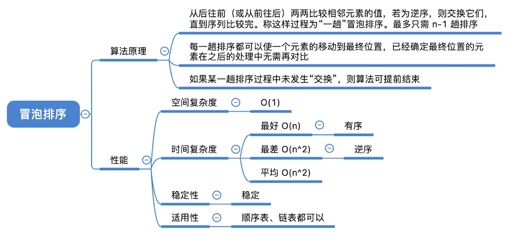
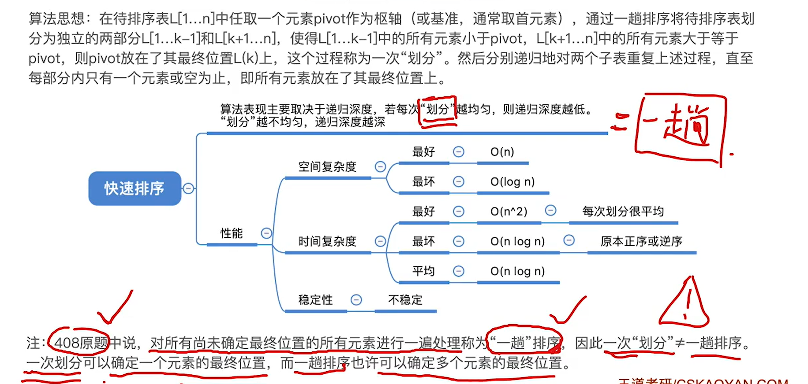

# 交换排序

基于两个关键字比较结果进行交换的排序叫交换排序


## 冒泡排序

每次把值最小的值冒到最前面

**如果一整趟都没有交换，说明已经完全有序，要提前结束**



### 代码

```c
#include<stdio.h>
#include<stdlib.h>

#define ElmeType int

void BubleSort(ElmeType A[], int n){

  for(int i = 0; i < n; i++){
    bool flag = false;//用于记录每趟是否有交换
    for(int j = n-1; j > i; j--){
        if(A[j] < A[j-1]){
            int t = A[j];
            A[j] = A[j-1];
            A[j-1] = t;
            flag = true;
        }
    }
    if(!flag){//如果一整趟都没有交换，说明已经完全有序，结束
        return;
    }

}
```


### 性能分析

空间复杂度O(1)

最好时间复杂度O(n)

最坏时间复杂度O(n^2)

平均时间复杂度O(n^2)

### 稳定

### 可用于链表

只要把大的值往后冒就可以了


## 快速排序




对一个序列，

先选中第一个为做基准，

定义俩指针low和high，low指向最左侧位置，high指向最右位置，此时low视为可插入，

判断high是与基准的关系，若比基准大，则直接左移，继续判断high，如果小，就让high的值放于low，low右移，high视为可插入，进而判断low

判断low时，若比基准小，则右移，若比基准大，则与high交换，high左移，low视为可插入，之后判断high

重复上述2操作

直到high和low指向同一位置，将基准置于此位置，这叫一个划分

之后，基准左右两侧又为两个新序列，对其继续进行划分，直至所有位置都当作基准到了指定位置

结束


### 代码

```c
#include<stdio.h>
#include<stdlib.h>

#define ElmeType int

void QuickSort(ElmeType A[], int low, int high){
	if(low >= high){//当low>high代表上一层基准左侧或右侧为空，low=high代表左侧或右侧只有一个元素
        return;//都不用再进行了，结束
    }
  	int base = A[low];//先让当前区间的第一个当作基准
    int l = low, h = high;//保存初始low和high
    bool flag = true;//true代表l为插入位置，false代表h为插入位置
    while(l!=h){//当指针位置不同时
        if(flag){//l为空位置，判断h
            if(A[h] >= base){//由于基准是第一个，所有为了保证稳定性右侧与base相等时需要置于右侧，所以判断右侧时不用移动
                h--;
            } else {
                A[l] = A[h];
                l++;
                flag = false;
            }
        } else{//r为空位置，判断l
            if(A[l] < base){//由于基准是第一个，所有为了保证稳定性做侧与base相等时时需要置于右侧，所以判断左侧时需要将其与右侧交换
                l++;
            } else{
                A[h] = A[l];
                h--;
                flag = true;
            }
        }
    }//循环结束说明基准位置找到，其左侧比他小，右侧比他大
    A[l] = base;//基准放进去
    
    QuickSort(A,low,l-1);//这里的l时base的位置，low是下限
	QuickSort(A,l+1,high);//high是上限，递归左右侧
}
```

或者这种

```c
#include<stdio.h>
#include<stdlib.h>

#define ElmeType int

int Partition(ElmeType A[], int low, int high){
    int base = A[low];
    while(low < high){
        while(low < high && A[high]>=base){
            high--;
        }
        A[low] = A[high];
        while(low < high && A[low]<base){
            low++;
        }
        A[high] = A[low];
    }
    A[low] = base;
    return low;
}

void QuickSort(ElmeType A[], int low, int high){
	if(low < high){
        int pivotpos = Partition(A,low,high);
        QuickSort(A,low,pivotpos-1);
        QuickSort(A,pivotpos+1,high);
    }
}
```


### 效率分析

空间复杂度：O(递归深度)

时间复杂度：O(n*递归深度)

递归深度最小为log(n),最大为n（可以看作一棵二叉排序树）

所以在元素顺序或逆序时复杂度最高

可以在取基准的时候随机取或者取首尾和中间三个的中间值当基准，这样可以减少深度


### 稳定性

一般认为是不稳定的，但是可以使用一些方法写出稳定的版本
