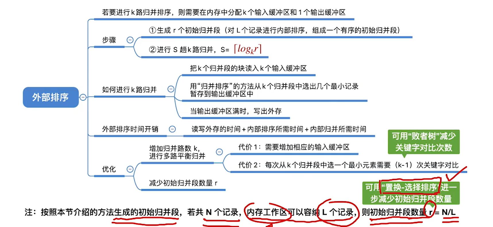
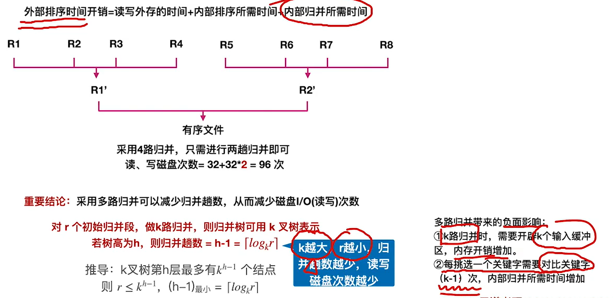
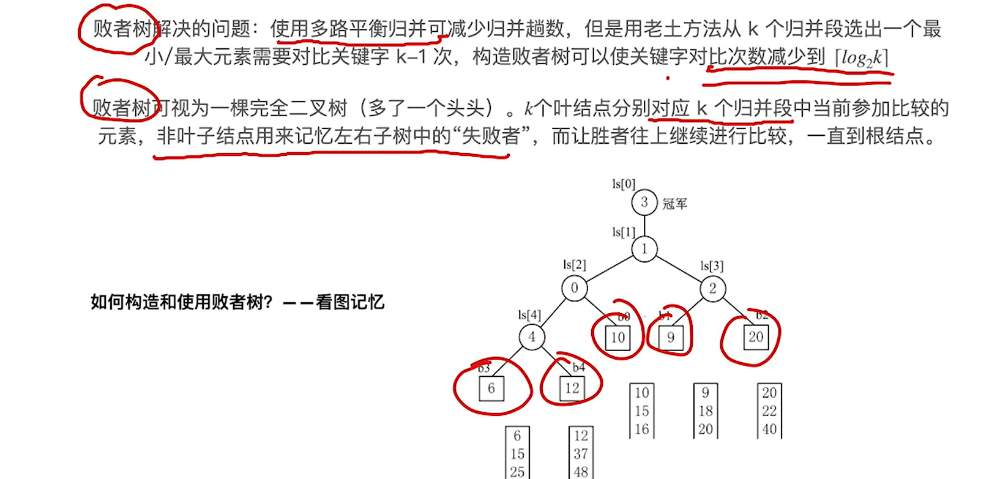
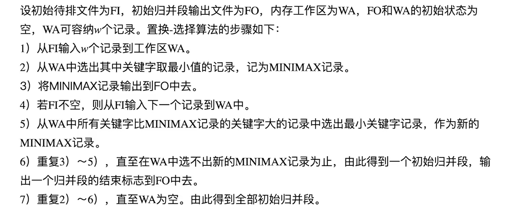
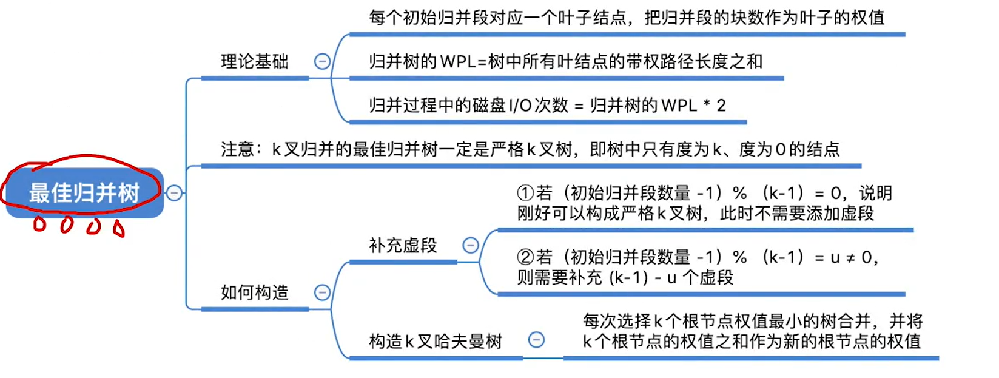
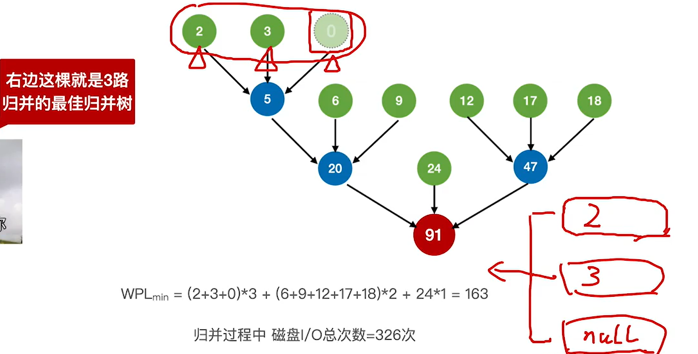
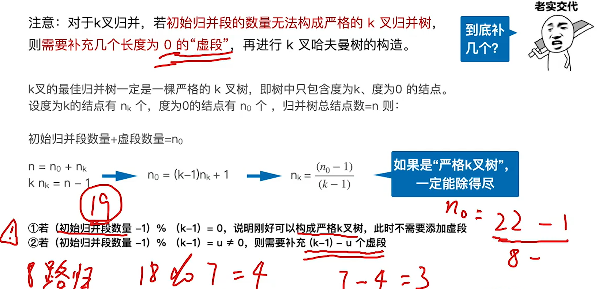

# 外部排序

当数据过多，内存中无法一次处理时，需要对磁盘中的数据进行排序，这就是外部排序

它基本思路是把数据从磁盘读入内存，然后在内存中写好，再写回内存

## 内存和外存的数据交换

外存就是指磁盘，磁盘是以块为单位进行管理的

所以读入至少一个磁盘块，读入到内存中，排序后，再存入磁盘

## 外部排序原理

主要采用的原理就是**归并排序**

最少只需要在内存分配3个缓冲区即可对任意文件排序

其中一个是输出缓冲区，将排序好的元素存入，存满后一整块写入磁盘

剩下两块是输入缓冲区，一次读入两块数据存入进来，按照二路归并排序存入输出缓冲区，然后输出

### 二路归并实现的具体流程

#### 构造初始归并段

首先，由于是二路归并，只有两个读入缓冲区，所以初始的归并段是两个盘块，需要先构建初始归并段

将其两两进行读入，在内存中进行归并排序，每当输出缓冲区满，就将其写入磁盘的一块新空间，再满，就放在上一块后面，然后把原来两个归并段的内存释放，当所有两两一组的归并完毕，它们两组归并的两个盘块下一次循环就看作是一个归并段

#### 每轮的归并

后续归并，一个归并段不止一个盘块，与构建初始归并段时的操作类似，但是每次先读入的先是两个要合并的归并段的第一块，分别放入两个读入缓冲区中，进行归并排序，当输出缓冲区满了就写入磁盘的新位置，若输入缓冲区空了，就从对应归并段再读一个盘块，直至每个归并段都排序完毕，构成的新区域里，这两个归并段就可在下一轮视为一个归并段

重复上述步骤，直至只有一个归并段，且排序完毕，结束

## 时间开销分析

构造初始归并段，所有盘块都要读一次写一次

每一轮，所有盘块也都要读一次写一次

所以时间开销为：读写磁盘次数+内部排序时间+内部归并时间

由于与读写磁盘相比，排序时间可以忽略不计，所以外部排序只需要考虑读写次数

对于二路归并来说，进行的轮数为r，所以总时间开销为：2n(r+1)

由于构造初始的时间开销都是2n，无法减少，主要考虑减少r来优化时间开销

下面是优化方式

## 时间优化方式

### 多路归并

可以在内存中开辟多个读入缓冲区，进行多路归并，一轮就可以处理更多的归并段

进行归并的轮数就可以大大减少，假设初始一共有t个归并段，则二路归并要log2(t)轮，而4路归并只要log4(t)轮

但是并**不是路数越多越好**，除了**内存占用空间变大**外，在内存中排序时，找到关键字时间也会变成，**影响内部排序效率**(可用败者树优化此问题)

#### k路平衡归并

一般采用k路平衡归并，可以减少归并趟数

### 减少初始归并段数量

可以在构造初始归并段时，利用多个缓冲区，把每个初始**归并段的盘块数的个数**增加，就能**减少初始盘块数**，后续合并次数便能降低。

或者可以看后面置换选择排序的方法，让初始归并段长度超过内存工作区的长度，从而减少初始归并段数

## 败者树

为了解决多路归并在内部排序排序时找到最小元素时间过长的问题，构建一棵完全二叉树从1开始到n-1，记录每一个位置的比较后的失败者，叶子节点是虚拟的，指向每个读入缓冲区，第i个读入缓冲区的父节点是(i+k)/2，k是缓冲区的个数也就是k路归并

在初始构造过程中，每一对叶子节点(虚拟的)进行对比，将失败者的下标存入其父节点，胜者到父节点，和兄弟继续比，直到到根节点(i)存入败者，最后在0处存入胜者，构建完毕

每次取0处盘块的第一个数，然后将该盘块下一个数，到对应叶子节点，每次和父节点对比，直到更新到根节点，就更新完毕了

这个过程只进行了树的层数h次，也就是log2(n)次，对比次数大大减少

代码可看[这里](https://c.biancheng.net/view/3453.html)

## 置换选择排序

为了减少初始归并块的数量，一种容易想到的方法是，让每个初始归并块的数量，下面便使用置换选择排序，在不改变内存分配空间的情况下，让归并段更长

构造初始归并段时，先把读入缓冲区读满，让找到最小的放入输出缓冲区，然后再读入一个元素，读入缓冲区再满，找到比上一个最小的更大的最小元素，加入输出缓冲区，这样可能会导致比上次更小的元素无法输出，但是暂且不管，直到读入缓冲区已经没有可以输出的元素了，说明这个归并段已经不能再写了

进行下一个归并段的构造，先把读入缓冲区里的全都按照顺序放入输出缓冲区，然后再把读入缓冲区读满，重复上述操作，直至所以初始归并段构造完毕

(上述操作在进行过程中，每当输出缓冲区满了，或者读入缓冲区不能再读了，就把输出缓冲区的内容写入磁盘)

用这种方法，初始归并段的平均长度大概是原来的2倍，可以减少许多数量

注意为了减少io，实际上，并不是一个一个写入和读取，而都是存取一块

## 最佳归并树

在进行k路归并排序时，可以把过程看作一棵倒着的k叉树，把每个初始节点看作叶子节点，IO操作的次数便是带权路径长度的两倍，即：
$$
IO次数 = 归并树的WSL*2
$$

### 最佳归并树的构造

最小归并树也就是哈夫曼树了，具体流程如下：

先选出k个最小的归并段，当作第一层，用其盘块数的和生成新节点，在这个新节点和剩余节点中再找出k个当作第2层，以此类推直至只剩一个节点，哈夫曼树(最佳归并树)构造完毕，注意这里的树是倒立的，根节点在最下面

### 虚段的添加

注意，当初始归并段个数不能构造严格的k叉树(只有度为k和度为0的节点)时，则需要添加若干个长度为0的虚段来辅助构造。如下图

### 虚段个数判断

由于只有度为0和度为k的节点，且添加的虚段和初始归并段一定是叶子节点，所有有

n0 = 虚段+初始归并段

n = n0 + nk;

n-1 = k * nk

所以 n0 = (k-1)nk + 1

即 nk = (n0-1)/(k-1)

当nk为整数时，不必加虚段，不为整数时，需要加虚段到成为整数

至此，外部排序结束

数据结构，结束。