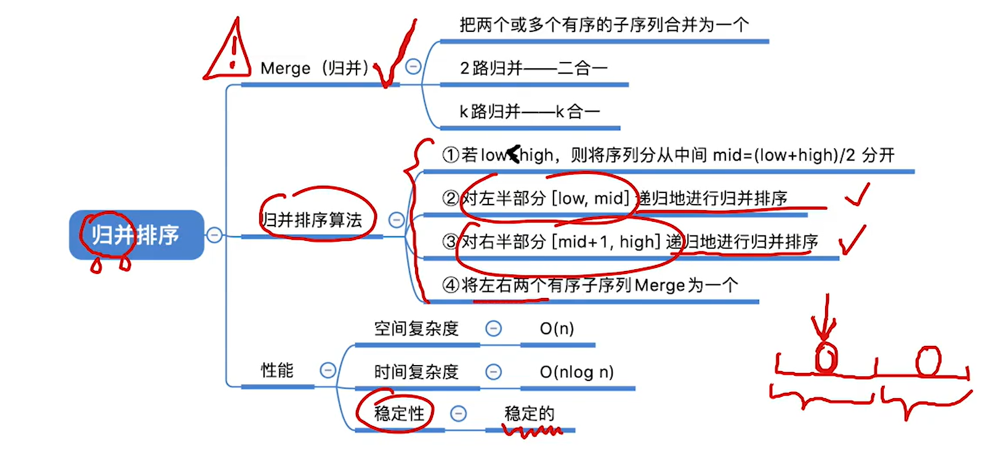
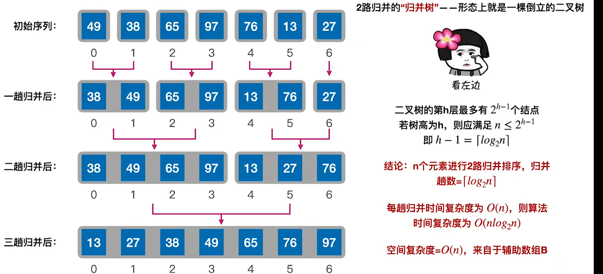
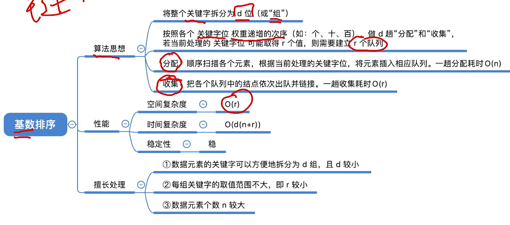
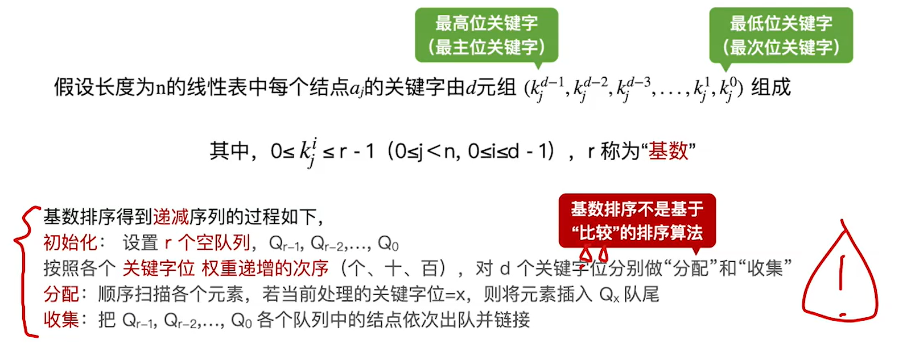
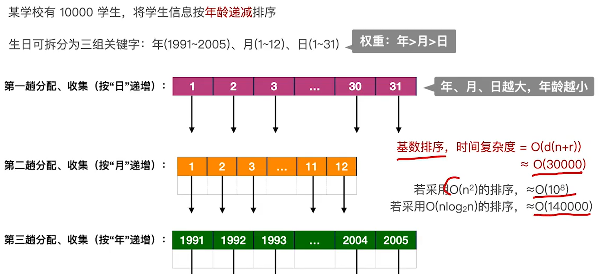
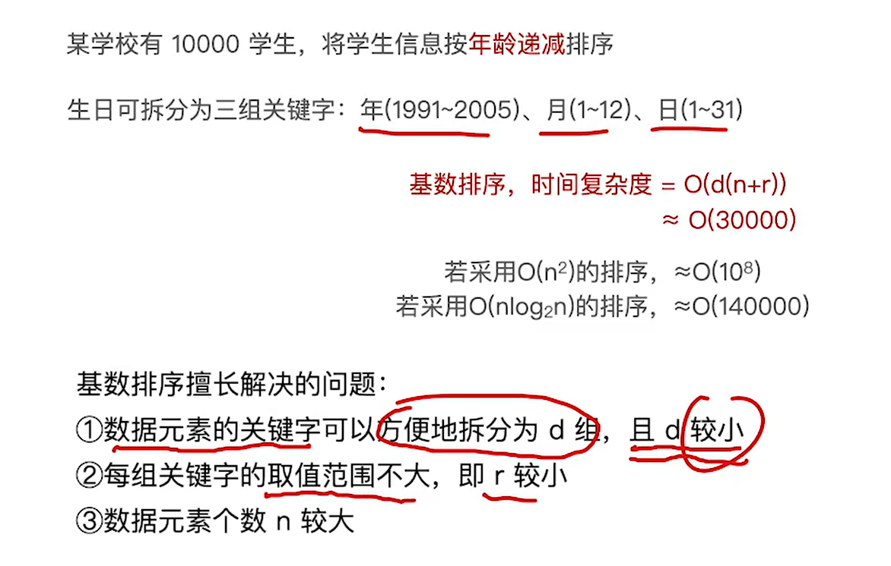

## 归并排序



把多个有序序列合并成一个

所以我们需要先把一个序列划分成多个序列，直至每个序列都是有序的了(最开始的是单个的)，然后将相邻的合并，直至全都合并完成，排序结束


### 代码

```c
#include<stdio.h>
#include<stdlib.h>

#define ElmeType int
#define MAXSIZE 1000000

ElmeType B[MAXSIZE];//要和A一样长，用于存储A
void Merge(ElmeType A[], int low, int mid, int high){
    
    int i = low, j = mid+1, k = low;//i和j分别是在辅助数组中，要合并的两部分的起点，k是原数组合并后区域的起点
    while(i <= mid && j <= high){//当两区域都没判断完
        if(A[i] <= A[j]){//i的位置值小，则让k的位置存入它，并都往后一位
            B[k++] = A[i++];
        }
        if(A[i] > A[j]){//j的位置值小，则让k的位置存入它，并都往后一位
            B[k++] = A[j++];
        }
    }
    while(i <= mid){//若结束i区域还有剩余，则全部加入数组
        B[k++] = A[i++];
    }
    while(j <= high){//若结束j区域还有剩余，则全部加入数组
        B[k++] = A[j++];
    }
    for(int i = low; i <=high; i++){
        A[i] = B[i];//把原数组的这部分更新成辅助数组排序后的
    }
}

void MergeSort(ElmeType A[], int low, int high){
  if(low < high){//当划分的区域比1个元素多，则可以继续划分合并，否则结束
      int mid = (low+high)/2;//划分为俩区域
      MergeSort(A,low,mid);
      MergeSort(A,mid+1,high);
      Merge(A,low, mid, high);
  }
}
```


### 性能分析



#### 时间复杂度

合并过程形成的合并树，可以看作一棵倒着的二叉树

层高h<log(n) + 1

所以归并趟数就是log(n)趟，

每次合并对比的次数大致是n/2，所以总的时间复杂度为

**O(nlog(n))**且量级**与数组初始排列无关**

#### **空间复杂度**

递归占用O(log(n))(趟数) 的空间，辅助数组占用O(n)的空间，所以总的空间复杂度为

**O(n)**

### 稳定性

稳定的


## 基数排序



基数排序是指，把关键字拆分成d组，，每一组可以有r(每一组的r可以不一样)个可能的类型，然后每组建立一个长为r的数组，把它们先按照优先级最低的组进行收集，将和对应组的关键字相同的放入同一个链表，再重新将其连接起来，再对下一组进行同样的操作，直至每一组都结束，这样就排序完成了

以最低位优先叫LSD(先排优先度低的)，最高位优先叫MSD(先排优先度高的)




### 性能分析

空间复杂度：由于要建立长为r的关键字数组，所以空间复杂度为O(r)

时间复杂度：进行d趟，每趟一次分配n次，收集r次

所以总的时间复杂度为O( d*(n+r) )


### 稳定性

是稳定的

### 应用






## 计数排序

计数排序不是基于比较的排序

它采用一种以空间换时间的思想

利用下标记录元素的值，而数组里存的是对应下标在原数组里的个数

### 适用范围

只有所有元素的值均为整数时才可用

先找到最大值和最小值，其差值k为数组长度

注意这种办法最后要给每个下标加上偏移量(最小值)才是存储的真实的值

### 性能分析

空间复杂度：O(k)

时间复杂度：O(k)

但是k和n不一定正相关，所以适用于k较小的情况，若k>nlog(n),效率还不如基于比较的排序

