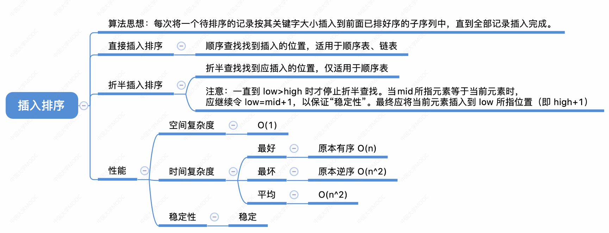
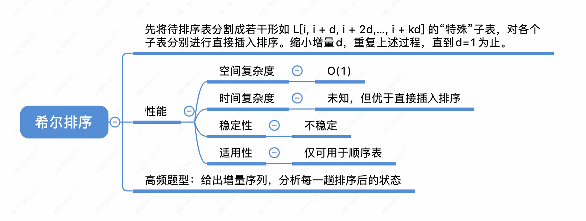

## 插入排序



### 直接插入排序

#### 代码

```c
#include<stdio.h>
#include<stdlib.h>

#define ElmeType int

void InsertSort(ElmeType A[], int n){

  for(int i = 1; i < n; i++){
    int base = A[i];//保存当前数据
    for(int j = i-1; base < A[j] &&j >= 0; j--){//遍历之前的
        A[j+1] = A[j];//右移
        A[j] = base;//插入
    }
  }

  // for(int i = 1; i < n; i++){
  //   int base = A[i];//保存当前数据
  //   for(int j = i-1; j >= 0; j--){//遍历之前的
  //     if(base < A[j]){//如果比之前的小
  //       A[j+1] = A[j];//右移
  //       A[j] = base;//插入
  //     } else {//大于或等于
  //       break;//结束
  //     }
  //   }
  // }

}
```

空间复杂度O(1)

平均时间复杂度n^2

### 折半插入排序

#### 代码

```c
#include<stdio.h>
#include<stdlib.h>

#define ElmeType int

void BinaryInsertSort(ElmeType A[], int n){

  for(int i = 1; i < n; i++){
    int base = A[i];//保存当前数据
    int low = 0;//下限
    int high = i;//上限
    while(low <= high){//下限未超过上限
      int mid = (low+high)/2;//取中间
      if(base > A[mid]){//只有大于中值才增加下限
        low = mid+1;
      } else{//小于等于都减上限
        high = mid-1;
      }
    }
    for(int j = i-1; j >= low; j--){//遍历之前的
        A[j+1] = A[j];//右移  
    }
    A[low] = base;//插入
  }

  

}
```

空间复杂度O(1)

对比的次数减少了，但是移动依然有n^2的量级，所以时间复杂度仍为n^2

### 可对链表使用

空间复杂度O(1)

对链表就只可以使用直接插入排序了，不用右移，可以用O(1)插入

移动元素次数可以大大减少，但是对比次数(找到插入位置的过程)仍为n^2，所以时间复杂度还是n^2


## 希尔排序

希尔排序也是插入排序的一种



### 代码

```c

#include<stdio.h>
#include<stdlib.h>

#define ElmeType int

void ShellSort(ElmeType A[], int n){

  for(int d = n/2; d >= 1; d/=2){
    for(int i = 0; i < n; i += d){
        int temp = A[i];//记录
        for(int j = i-d; temp<A[j] && j >=0; j-=d){
            A[j+d] = A[j];
            A[j] = temp;
        }
    }
  }

}

```

### 性能分析

空间复杂度O(1)

时间复杂度与d的序列有关，难以准确计算

最坏时间复杂度为O(n^2),n在某个范围内可达O(n^1.3)

### 稳定性

不稳定

### 不可基于链表
