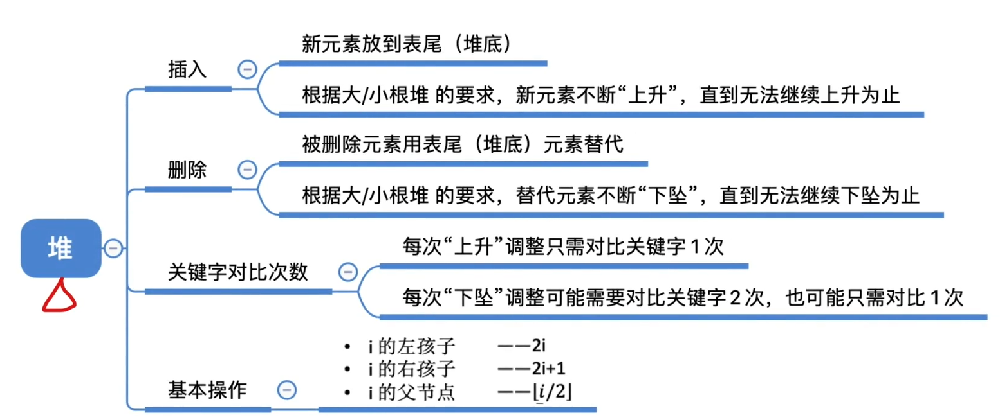

# 选择排序

选择排序就是每一趟选择最大或最小的元素加入有序子序列


## 简单选择排序


### 代码实现


```c
#include<stdio.h>
#include<stdlib.h>

#define ElmeType int

void SelectSort(ElmeType A[], int n){

  for(int i = 0; i < n-1; i++){
    int min = i;
    for(int j = i+1; j < n; j++){
        if(A[min] > A[j]){
            min = j;
        }
    }
    if(min != i){
        int t = A[i];
    	A[i] = A[min];
    	A[min] = t;
    }
  }
}
```


### 性能分析

空间复杂度：O(1)

时间复杂度：O(n^2)，与序列无关，均要进行n-1趟排序


### 稳定性

由于是最小值与最前面的交换，所以**不稳定**


### 可用于链表


## 堆排序


### 什么是堆

序列满足以下条件则称为堆

#### 大根堆:

$$
L(i)\geq L(2i) 且 L(i)\geq L(2i+1)其中(1\lt i \leq n/2)
$$

#### 小根堆:

$$
L(i)\leq L(2i) 且 L(i)\leq L(2i+1)其中(1\lt i \leq n/2)
$$

其实可以看作一棵用数组存储的完全二叉树，每个子树的孩子都小于(或大于)它的根节点，则称为大根堆(小根堆)，注意与二叉排序树区分


### 建立大根堆

#### 思想

由于完全二叉树在采用顺序存储时，其分支节点满足其下标i<=n/2

而我们在建立大根堆的过程中，我们需要对每个分支节点判断是否满足性质，

所以我们从n/2开始倒序遍历数组，并检查每个元素的左右孩子是否小于该分支节点

若都小于该分支节点则不用操作

否则将较大的孩子与该分支节点交换

在交换过程中，分支节点变为孩子节点时，可能会导致该孩子节点又不满足大根堆性质，要对其再验证性质

直至该子树全满足，进行下一个节点

重复以上过程，直至全部完成

#### 代码实现

```c
#include<stdio.h>
#include<stdlib.h>

#define ElmeType int

void HeadAdjust(ElmeType A[], int k, int n){//k是该子树的根节点
    int t = A[k];
    for(int i = 2*k+1; i < n; i *= 2){
        if(i < n-1 && A[i] < A[i+1]){//若左孩子比右孩子小(i要小于n-1，才有右兄弟)
            i++;//指向右孩子
        }//此时i指向的是大的孩子
        if(A[i] <= t){//大的孩子都小于根，说明调整完了，跳出循环
            break;
        } else{
            A[k] = A[i];//把大的孩子放到根节点的位置
            k = i;//现在原来的根节点在i的位置上
            //下一次循环找它的孩子看满不满足性质
        }
    }
    A[k] = t;
    //循环结束，说明此时k所在子树也满足了性质，由于之前可能未给此处更新值，现在更新成最初的分支节点的值
}

void BuildMaxHeap(ElmeType A[], int n){//n是元素个数
    for(int i = n/2-1; i >=0; i--){
        HeadAdjust(A,i,n);
    }
}
```


### 建立小根堆

与大根堆类似，只要把小的放到根节点就好了


### 大根堆实现堆排序

先将首位与最后一个交换，把前n-1个元素当作一个新的大根堆，调整它，使其满足大根堆性质，完成第一趟排序

再将新的大根堆的第一个与倒数第二个位置交换，再把前n-2个元素当作一个新的大根堆，调整

直至大根堆只剩一个元素

结束


#### 排序代码

```c
#include<stdio.h>
#include<stdlib.h>

#define ElmeType int

void HeapAdjust(ElmeType A[], int k, int n){//k是该子树的根节点
    int t = A[k];
    for(int i = 2*k+1; i < n; i = i*2+1){//当0也存储元素是，分支节点i的左孩子是2i+1
        if(i < n-1 && A[i] < A[i+1]){//若左孩子比右孩子小(i要小于n-1，才有右兄弟)
            i++;//指向右孩子
        }//此时i指向的是大的孩子
        if(A[i] <= t){//大的孩子都小于根，说明调整完了，跳出循环
            break;
        } else{
            A[k] = A[i];//把大的孩子放到根节点的位置
            k = i;//现在原来的根节点在i的位置上
            //下一次循环找它的孩子看满不满足性质
        }
    }
    A[k] = t;
    //循环结束，说明此时k所在子树也满足了性质，由于之前可能未给此处更新值，现在更新成最初的分支节点的值
}

void BuildMaxHeap(ElmeType A[], int n){//n是元素个数
    for(int i = n/2-1; i >=0; i--){
        HeapAdjust(A,i,n);
    }
}

void HeapSort(ElmeType A[], int n){
    BuildMaxHeap(A,n);
    for(int i = n-1; i > 0; i--){
        int t = A[0];
        A[0] = A[i];
        A[i] = t;
        HeapAdjust(A,0,i);
    }
}
```


### 小根堆实现堆排序

与大根堆操作一模一样，但是生成的序列会是降序的


### 性能分析

空间复杂度：O(1)

时间复杂度，分为两部分

**建立大根堆：**


所以这部分时间复杂度为O(n)

**排序**


需要进行n-1趟，每个关键字最多下坠h-1层，每次下坠最多对比2次，由于完全二叉树层高h<log(n+1)

所以排序的时间复杂度为O(nlog(n))


所以综上，总的时间复杂度为O(nlog(n))


### 稳定性

不具有稳定性


## 堆的插入和删除和应用



### 插入

将新加入节点加入到最后，然后一直找其父节点，判断是否符合性质，进行调整


### 删除

删除对应位置，将表最后一个元素填补该位置，然后判断该子树是否满足性质，并进行调整


### 应用

可以在大量元素中找前k小或者前k大

以第k小为例

先取前k个元素建立大根堆，对之后的元素，与根进行比较，若比根大，直接舍弃，若比根小，把根换成它然后调整

最后该堆就是前k小，时间复杂度为O(n)                 
