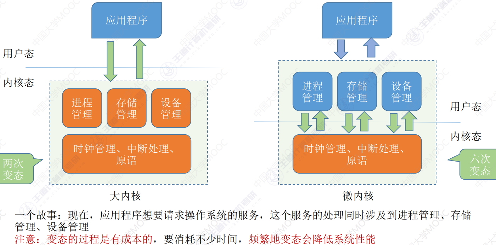
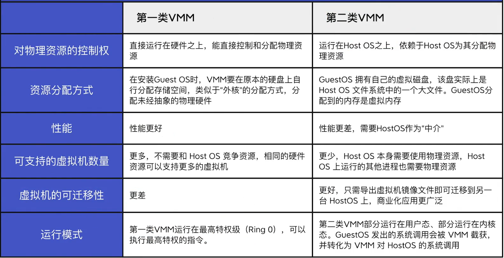

# 计算机系统概述

## 操作系统的基本概念

### 操作系统的概念和功能

#### 系统资源的管理者

提供的功能：

**处理机(CPU)管理**：可以看作是进程的管理，包括进程控制、进程同步、进程通信、死锁处理、处理机调度等

**存储器管理**(把程序放入内存)：主要包括内存的分配与回收、地址映射、内存保护与共享和内存扩充

**文件管理**(找到文件位置)：存储空间管理、目录管理和文件读写管理和保护

**设备管理**(调用外部设备)：主要包括缓冲管理、、设备分配、设备处理和虚拟设备

#### 向上层提供方便易用的服务

把硬件功能封装成服务

提供的服务如下

**GUI**：图形化用户接口，不一定有

**联机命令接口**：交互式的命令接口，也就是命令行，**一次一条**命令

**脱机命令接口**：也叫批处理命令接口，**一次很多**命令

上面的用户可以使用，下面的只有应用程序才能使用

**程序接口**：在程序中使用**系统调用**来使用程序接口，这也是应用程序请求操作系统服务的唯一方式

#### 最接近硬件的层次

需要实现**对硬件机器的拓展**

没有软件叫做**裸机**

有了软件的机器叫做**扩充机器**，也叫虚拟机

### 操作系统的特征

操作系统有四个特征，分别是

**并发、共享、虚拟、异步**

#### 并发

宏观上同时，但围观上是交替发生的

操作系统就是支持多道程序技术而诞生的，也就是说**操作系统和程序并发是一起诞生的**

单核CPU只能并发，不能并行

**并发性是操作系统的最基本特性**

#### 共享

也就是**资源共享**，系统资源可以供内存中多个并发执行的进程共同使用

**互斥共享**：同一时间段只能一个进程访问

**同时共享**：同一时间段可以多个进程"同时"访问

#### 并发和共享的关系

如果没有并发性，共享性就没有意义

如果没有共享性，就不能实现并发性

**它们互相为存在条件**

#### 虚拟

把一个物理实体，看成多个逻辑上的对应物，用户实际感受到的是逻辑上的对应物

可分为**时分复用**技术(虚拟处理器)和**空分复用**技术(虚拟存储器)

**失去并发性虚拟性也没有意义**

**异步**

进程的执行不是一贯到底的，会以**不可预知**的速度执行，

**失去并发性异步性也不存在了**

## 操作系统的发展与分类

### 手工操作阶段

此时无操作系统，纯人工，用户独占全机，且极大的性能浪费

### 批处理阶段

#### 单道批处理系统

引入**脱机输入/输出技术**，由**监督程序**负责控制作业的输入输出

自动性：一批作业能无需人工运行

顺序性：先调入内存的先完成

单道性：内存仅有一个程序运行，待其结束或出现异常后，才行进行下一个程序

每次只能运行一个程序，且如果运行中需要**访存**，IO速度很慢，**CPU需要空闲等待**，利用率低

#### 多道批处理系统

操作系统正式诞生，支持**多道程序并发**运行

多道：同时存放多个互相独立的程序

宏观上并行：同时进入的都在运行中

微观上串行：轮流使用CPU

**引入多道程序的前提是系统具有中断功能**，可以通过中断让IO设备和CPU并行

优点：多道程序并发执行，共享计算机资源，**效率大幅提升**

缺点：**没有人机交互**(运行过程中不能控制自己的最有，无法调试或在过程中输入)

### 分时操作系统

计算机按**时间片**为单位**轮流**为各个作业提供服务

**用户请求可以及时响应**，解决了人机交互的问题

缺点：**不能优先处理紧急任务**，只能按时间片轮转

### 实时操作系统

能优先响应一些紧急任务

**要在严格的时限内处理完成时间**，主要特点是**及时性和可靠性**

硬实时系统：必须严格按时间完成

软实时系统：可以偶尔违反时间规定

### 网络操作系统和分布式操作系统

网络操作系统：实现网络中各种**资源的共享**和**计算机间的通信**

分布式操作系统：特点是分布性和并行性。系统中各台计算机**地位相同**，任何工作都可以分布在这些计算机上，由他们**并行协同完成**

### 个人操作系统

Windows、Linux、MacOS等

## 操作系统的运行环境

### 操作系统的运行机制

####  应用程序和内核程序

程序分为两种：

普通的**应用程序**和操作系统**内核程序**

内核程序是应用程序的管理者，所以它们会能执行一些**特权指令**

> 操作系统中，与硬件关联密切的模块，以及运行频率较高的模块构成了操作系统的内核，其中的指令运行在内核态

#### 特权指令和非特权指令

**特权指令**：不允许用户直接使用的指令，如I/O指令、关中断指令、内存清零指令、存取用于内存保护的寄存器、送PSW到程序状态字寄存器等

**非特权指令**：是指用户直接使用的指令，不能直接访问系统的软硬件资源，**仅能访问用户的地址空间**，这是为了防止程序对系统造成破坏

#### 内核态和用户态

为了区分内核程序和应用程序，CPU分出了两种状态，分别是**内核态**和**用户态**

**内核态**时，说明**运行的是内核程序**可以执行特权指令

**用户态**时，说明**执行的是应用程序**，只能执行非特权指令

在程序状态字寄存器**PSW中有一个二进制位**，1代表内核态，0代表用户态

内核态也叫**管态**，用户态也叫**目态**

#### 内核态与用户态的切换

**内核态->用户态**：执行一条特权指令，修改PSW的值

**用户态->内核态**：由中断引发，**硬件来完成**

### 中断和异常

**中断**是让操作系统内核重新夺回**CPU使用权**的**唯一途径**

> 现代操作系统可以说是靠中断驱动的软件

#### 内中断(异常)

内中断与正在执行的程序**有关**

包括**陷入**、**故障**和**终止**

其中，陷入是故意引发来实现系统调用的

#### 外中断(中断)

外中断与正在运行的程序**无关**

如时钟中断，由时钟部件发来的中断信号，进行程序的并发

包括**可屏蔽中断**和**不可屏蔽中断**

#### 中断的基本原理

发现中断后分为三步

先是**关中断**

然后**保存断点和程序状态**

最后**识别中断类型并跳转到相应程序**

识别中断类型分为软件识别和硬件识别，硬件识别是去查询中断向量表实现的

> 中断机制中，只有一小部分属于内核，负责**保存现场**和**恢复现场**以及**转移控制权**到相关的处理程序
>
> **断点(PC)和PSW由硬件保存**
>
> **保存中断屏蔽字**、**保存通用寄存器的值**以及**提供中断服务**都由**操作系统来实现**
>
> **中断向量表也是由操作系统初始化的**

### 系统调用

**系统调用**就是操作系统**提供给应用程序**使用的**接口**，应用程序可以通过系统调用来**请求获得操作系统内核的服务**

凡是**与共享资源有关的操作**(如存储分配、I/O操作、文件管理等)，**都必须要通过系统调用**向操作系统内核提出服务请求，**由操作系统内核完成**，这样才可以保证系统的稳定性和安全性

> 系统调用对系统的影响很大，所以运行在**内核态**

#### 系统调用的过程

用户先将需要的参数压入堆栈

然后**执行陷入指令(也叫访管指令)**，引发中断，**转换到内核态**

(需要关中断和保护现场)

然后根据该陷入指令引发的中断类型，根据中断向量表，**跳转到该中断程序**

**执行该中断程序**(也就是系统调用)

执行**结束后，转回用户态**

**返回**原来的陷入指令的下一条，恢复现场后

**继续执行原来的程序**

> 注意，这里的**陷入指令(访管指令)**，是在用户态使用的，所以是**非特权指令**

## 操作系统结构

### 操作系统的内核

**内核**是操作系统最核心的部分，实现这些核心功能的程序就是**内核程序**

> #### 时钟管理
>
> 利用时钟中断实现计时功能
>
> > 包括更新
> >
> > 内核中时钟变量的值
> >
> > 当前进程占CPU的时间
> >
> > 当前进程在时间片内剩余的时间
>
> #### 中断处理
>
> 与上面的内容一致
>
> #### 原语
>
> 设备驱动，CPU切换等，具有原子性，必须要一口气完成

下面那部分不包括硬件的管理操作，虽然也很基础，但是有的操作系统并不把它放入内核

### 分层结构

最底层是硬件，最高层是用户接口

每层可以调用相邻的低一层的功能

优点：

- 便于系统的调试和验证
- 易于扩充和维护。

缺点：

- 难以合理定义各层的功能。不够灵活
- 效率低。不能跨层调用

### 模块化结构

把操作系统分为多个模块，各个模块相互协作

**内核=主模块+可加装内核模块**

主模块：只负责**核心**功能，如进程调度、内存管理等

可加载内核模块：可以**动态加载**新模块到内核，而无需重新编译整个内核

优点：

- 模块间逻辑清晰，易于维护，确定模块间接口后可以多模块同时开发
- 可以动态加载新内核，可以**增强系统适用性**
- 各个模块间可以直接调用，**无需消息传递，效率高**

缺点：

- 模块间的接口定义不一定合理
- 模块间相互依赖，更**难调试和验证**

### 宏内核

把所有系统功能都放入内核，其实也采用了模块化

优点：

- **效率高**

缺点：

- 内核庞大复杂，**难维护**
- **某个模块出错，会使整个系统崩溃**

### 微内核

只把最核心的功能放入内核，其它的在用户态

> 包括**进程管理**、**低级存储器管理**、**中断和陷入**处理

各功能模块间使用**消息传递**来间接通信

优点：

- **功能少，易维护，可靠性高**
- **某个功能模块出错不会让整个系统崩溃**
- **扩展性和灵活性**
- **可靠性和安全性**
- **可移植性**
- **适用于分布式计算**

> 特点：**内核足够小**、**采用C/S**、应用”**机制与策略分离**“(机制在内核，策略在服务器)、**面向对象**

缺点：

- **性能低**，需要频繁切换用户态和核心态，各功能模块间不能直接通信，只能使用消息传递来间接通信

### 外核

由内核和外核两个系统组成

**内核**复杂进程调度、进程通信等**与硬件无关的功能**

**外核来分配**未经抽象的**硬件资源**(也就是实际的物理空间，而不是虚拟空间)

> 可以分配连续的物理空间，便于磁盘快速访问
>
> 内存也可以

还需要保证硬件的使用安全

优点：

- 分配的是不虚拟的硬件，使**用户可以更灵活的使用硬件**
- 减少了虚拟硬件资源的映射层，**提高效率**

缺点：

- 降低了系统的一致性(有的要映射，有的不用映射)
- **系统更复杂**

## 操作系统引导

也就是操作系统启动的过程

1. 激活CPU

   > CPU先读取ROM中的boot指令，将IR置为BIOS的第一条指令
   >
   > 这是JMP指令，会跳转的BIOS，BIOS程序在内存最开始的地方**构建中断向量表**，接下来的POST过程会用到中断功能

2. 硬件自检

   > 。然后通电自检，判断硬件是否有问题，如有会发出声音，启动终止

3. 加载带有操作系统的磁盘

   > BIOS读取Boot Sequence，把控制权交给启动顺序第一位的存储设备，然后CPU把该设备的引导扇区加载到内存中

4. 加载主引导记录(**MBR**)

   > MBR的作用是告知CPU去哪个分区找操作系统

5. 扫描硬盘分区表，并加载硬盘活动分区

   > 加载活动分区后，把控制权交给活动分区

6. 加载分区引导记录**PBR**

   > 读取活动分区的第一个扇区，它的作用是找到并激活启动管理器

7. 加载启动管理器

   > **用于引导操作系统**

8. 加载操作系统

   > 把操作系统加载到内存中执行。注意**不会全部加入内存，先加入的是内核**

## 虚拟机

使用虚拟化技术，把一台物理机器虚拟化成多台虚拟机器(Virtual Machine，VM)，每个虚拟机可以独立运行一个操作系统

需要使用 虚拟机管理程序/虚拟机监控程序（Virtual Machine Monitor/Hypervisor）

> 以上几个是同义词，简称VMM

有两种方式

### 第一类虚拟机管理程序

虚拟机管理程序**直接运行在裸机上**，向上层提供几个虚拟机，在虚拟机上再安装操作系统

这些虚拟机都是裸机的复制品

虚拟机作为用户态的一个进程运行，不允许执行敏感指令。

但是各个操作系统认为自己处于内核态，这叫做**虚拟内核态**

当上层虚拟机想要执行特权指令，需要陷入虚拟机管理程序

VMM来判断是其上的操作系统发出的还是用户发出的，

执行操作系统的特权指令；若是用户发出的，就模拟真实硬件的行为

> 直接管理硬件资源
>
> 给虚拟机分配的是物理空间
>
> 性能更好
>
> 可支持的虚拟机更多
>
> 很难迁移虚拟机
>
> 运行在最高特权级

### 第二类虚拟机管理程序

第二类虚拟机管理程序是**运行在宿主操作系统**上的

在其上再提供几个虚拟机

当虚拟机请求硬件资源时，VMM需要向宿主操作系统请求，然后再分配

> 硬件资源的管理者依然是宿主操作系统
>
> 给虚拟机分配的是虚拟空间
>
> 性能更差
>
> 可支持的虚拟机更少，英文宿主机也要占用资源
>
> 很容易迁移，只需要导出文件就可以
>
> 部分运行在用户态，部分运行在内核态