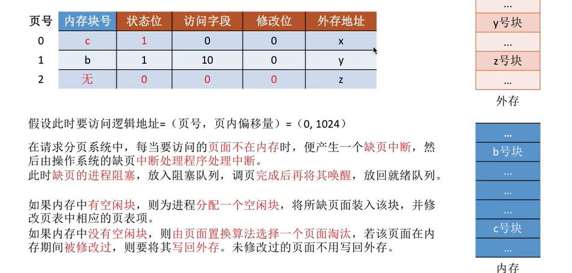

# 内存管理

## 前置知识

### 三种装入方式

#### 绝对装入

在编译时，提前知道程序会分配到内存的哪个位置，就在编译时，把内部的所有地址改为全部的正确的绝对地址。

编译链接后，指令中的地址会改为绝对地址

灵活性很差，**只适用于单道程序环境**

> 由编译器实现，不是操作系统

#### 可重定位装入

也叫**静态重定位**：编译链接后的装入模块的地址都是从0开始的，指令中使用的地址都是相对于起始地址的逻辑地址。根据内存的情况，装入内存，**装入时**，对地址进行**重定位**，把逻辑地址变换为物理地址（**地址转换是在装入时一次完成的**）

在**装入内存时，必须分配其要求的全部内存空间**，若没有足够的空间，就不能装入

在**运行时程序不能在内存移动**，也不能再申请空间了

#### 动态运行时装入

也叫**动态重定位**：编译链接后的装入模块的地址也都是从0开始的，指令中使用的地址都是相对于起始地址的逻辑地址。但是，在**装入**内存后，**不会立刻**把逻辑地址**转换为物理地址**，而是**在程序真正要执行时才进行转换**。因此装入内存后，内部的所有地址仍然是逻辑地址。这种方式需要一个**重定位寄存器**

运行程序在内存中移动，可以把程序分配到不连续的内存中。只装入部分程序就可以运行。

### 程序运行前的过程

编译、链接、装入

编译：把源代码编译成若干目标模块

链接：把这些模块和库函数链接在一起，形成完整的装入模块

装入：由装入程序将装入模块装入内存

### 三种链接方式

#### 静态链接

在程序运行前，把是哟与目标模块和库函数，链接成一个完整的装入模块，不再拆开

#### 装入时动态链接

将目标模块装入内存时，边装入边链接

#### 运行时动态链接

在程序执行时需要该目标模块时，才对其进行连接。用不到的模块不装入内存

便于修改和更新，便于实现对目标模块的共享。

## 内存管理概述

### 内存管理概念

内存管理需要实现以下功能：

1. 操作系统负责**内存的分配与回收**

   > 主要包括如何记录被分配和未被分配的区域
   >
   > 如何分配地址给进程
   >
   > 如何回收内存空间

2. 操作系统需要在**逻辑上对内存空间进行扩充**

   > 通过虚拟技术，实现对内存的扩充

3. 操作系统需要提供**地址转换**功能，负责将程序的逻辑地址和物理地址进行转换

   > 主要就是地址重定位，包括静态和动态，(绝对装入没有使用操作系统)
   >
   > 

4. 操作系统需要提供**内存保护**功能。保证进程间独立运行互不干扰

   > 有两种方式：
   >
   > #### 设置一对上下限寄存器
   >
   > 只允许访问这两个寄存器地址间的地址
   >
   > 
   >
   > #### 采用基址寄存器和界地址寄存器
   >
   > 也叫**重定位寄存器**和**限长寄存器**
   >
   > 重定位寄存器放的是进程**起始物理地址**
   >
   > 限长寄存器放的是进程的**最大逻辑地址**
   >
   > 在访问时，判断访问的逻辑地址是否小于限长寄存器，若小于，则转换到物理地址访问
   >
   > 否则抛出**越界异常**
   >
   > 

### 进程的内存映像

一个进程在在内存中各部分的位置和大小，对32位系统来说，虚拟地址空间最大为4GB

**最高的1GB**($\text{FFFF FFFF - C000 0000}$)是**操作系统内核区**，用于存储内核代码、内核数据结构等，如**PCB**

然后最低地址有一片**未使用区**($\text{0804 8000 - 0000 0000}$)

剩下的不到3GB是用户区，交给用户进程来使用，这又分为2部分

从未使用区到1GB之间($\text{4000 0000 - 0804 8000}$)从低到高分为：

1. **只读代码/数据**：编译后的代码和const定义的变量，执行中不能修改，只能读

   > 宏定义的常量，它不会存储起来，而是在编译时，直接写到机器指令里

2. **读/写数据**：全局变量和静态变量static，在程序执行时，虽然可以改，但是空间大小不变

3. **堆**：malloc可以分配的空间

剩下中间的2GB($\text{C000 0000 - 4000 0000}$)，分成两部分

1. 从低到高增长的是：**共享库的存储映射区**，主要就是库函数的代码部分
2. 从高到低增长的是：**用户栈**，主要是函数的栈帧存放的位置，版画的局部变量和函数调用的一些信息

### 覆盖与交换

#### 覆盖技术

引入覆盖技术，用于解决程序大小超过物理内存总和的问题。

思想：把程序分为多个段(模块)，常用的段常驻内存，其它段使用时再调入

内存中分为**一个固定区**，和**若干个覆盖区**

常驻内存的段放在固定区，**调入后在运行期间就不再调出**

不常用的就放在覆盖区中，需要用时调入，不用时调出

**同时不会一起调用的模块，共享一个覆盖区**

缺点：必须程序员来声明覆盖结构，**对用户不透明**，增加编程负担

#### 交换技术

当内存紧张时，把内存中的某些进程暂时换出外存，把外存可以运行的进程换入内存(也就是中级调度，在内存和磁盘间调度，**PCB还在内存**)

暂时换出的进程叫做**挂起**态，挂起还分为**就绪挂起**和**阻塞挂起**

- **在外存的哪里保存换出的进程**：

  > 具有对换功能的操作系统，常把磁盘分为**文件区和对换区**两部分
  >
  > 文件区放文件，主要追求**空间利用率**，采用**离散分配**方式
  >
  > 对换区空间小，被**换出的进程数据就在对换区**。为了追求换入换出的**速度**，所有对换区常采用**连续分配方式**

- **什么时候交换**

  > 当进程很多，且**内存吃紧时进行**，当系统负载降低时就暂停
  >
  > 一般在**频繁缺页**时就说明**内存紧张**，开始换出，缺页率低了，就可以暂停换出

- 换出哪些进程

  > 优先换出阻塞进程；优先级低的进程；但是只换优先级低的可能导致饥饿，可以考虑在内存驻留的时间

> **PCB会常驻内存**

### 连续分配管理方式

**连续分配**：为进程分配的必须是**连续的内存空间**

#### 单一连续分配

内存被分为**系统区**和**用户区**，系统区在低地址，用户区在高地址

内存中**只能有一道**用户程序，用户程序**独占**整个用户区

优点：实现简单；**无外部碎片**，可以采用覆盖技术扩充内存；不一定需要内存保护

缺点：只能用于单用户单任务的操作系统，不支持多道程序并发运行；**有内部碎片**；存储器利用率低

#### 固定分区分配

为了实现多道程序，且不能相互干扰。于是将用户空间**分为了若干个固定大小的分区，每个分区只装入一道作业**

分区大小**可以相等也可以不等**。

相等的灵活性差，但适用于常执行多个同样进程的系统；不相等的灵活性强

操作系统需要建立一个数据结构—**分区说明表**，来实现对各个分区的分配与回收，每个表项对应一个分区。每个表项包括：**大小、起始地址、状态**

优点：简单，**无外部碎片**

缺点：**程序太大**时，只能采用覆盖技术才能实现，会**降低性能**。会产生**内部碎片**，内存利用率低

#### 动态分区分配

也叫**可变分区分配**，**不会预先划分**内存分区，在进程**装入**内存时，**才根据大小建立分区**

- 要使用**什么数据结构**记录内存的使用情况

  > **空闲分区表：**
  >
  > 每个表项包含：分区号、大小、起始地址、状态
  >
  > **空闲分区链**：
  >
  > 双向链表，分区的起始和结束放在指针指向前驱或后继

- 多个空闲分区可满足需求时，应当**如何选择**

  > 要按照**动态分区分配算法**选择

- 如何进行分区的**分配与回收**

  > **分配时**：
  >
  > 若该进程**分配**到分区**后仍有空闲**，则**只用修改**该空闲分区的大小和起始地址即可
  >
  > 若**刚好占满**这个分区，就**删去**这个空闲分区
  >
  > 
  >
  > **回收时**：
  >
  > 当**只有**前面或者后面有**一个**空闲分区时，就**和那一个合并**，并**修改合并的那个表项**
  >
  > 当**前后都有**空闲分区时，把**这仨合并**，并改为一个表项
  >
  > 当前后**都没有时**，**就新建**一个表项
  >
  > 
  >
  > 分区的排列顺序不一定按地址增，要根据动态分区分配算法确定

> #### 内部碎片与外部碎片
>
> **内部碎片**：分配给进程的区域中，进程不用使用的区域
>
> **外部碎片**：内存中空闲分区太小，无法利用的空间
>
> 可以通过**紧凑技术**来解决外部碎片。紧凑后需要修改进程的起始地址，就是要修改PCB中存的基址寄存器的值
>
> 动态重定位最适合使用紧凑技术

##### 动态分区分配算法

**动态分区分配算法**：在动态分区分配方式中，当很多个空闲分区都能满足需求时，应当**如何选择分区**的算法

- **首次适应算法**

  > 每次都从低地址开始查找，找到第一个能满足的空闲分区
  >
  > 实现：**空闲分区按地址递增**的次序排列，每次分配内存时**顺序查找**空闲分区链/表，找**到第一个满足要求的分区**
  >
  > 
  >
  > 分配完**不必修改**分区排列顺序
  >
  > 会在低地址部分留下很多小碎片，每次都要从那遍历，降低效率
  >
  > 但是也会优先把低地址的小分区使用掉，包含了一部分下面最佳适应算法的优点

- **最佳适应算法**

  > 优先使用更小的空闲分区
  >
  > 实现：空闲分区**按容量递增**次序排列，每次分配时，**顺序**查找空闲分区链/表，每次第一个找到的就是**最小的能满足要求**的分区
  >
  > 
  >
  > 每次**分配完**，可能需要**修改新的分区的排列顺序**
  >
  > 缺点：**产生很多极小的无法利用的外部碎片**

- **最坏适应算法**

  > 优先使用最大的连续空闲区
  >
  > 实现：空闲分区**按容量递减**次序排列，每次分配时，**顺序**查找空闲分区链/表，每次第一个找到的就是**最大的能满足要求**的分区
  >
  > 
  >
  > 每次**分配完**，可能需要**修改新的分区的排列顺序**
  >
  > 缺点：会导致大分区很快用完，**大进程无法分配**

- **邻近适应算法**

  > 与首次适应算法类似，但是每次从上次分配后的分区开始查找
  >
  > 实现：也是按照**地址递增**的顺序排列(可以是循环链表)，每次分配**从上次查找结束的位置开始查找**空闲分区链/表，找到第一个能满足大小的分区
  >
  > 
  >
  > 分配完**不必修改**分区排列顺序
  >
  > 防止小碎片只在低地址出现，会比较平均
  >
  > 但是这也包含了最坏适应算法的缺点，不利于大进程分配

> **四种算法中，反而首次适应算法效果最好**

##### 基于索引搜索的分配算法

根据大小对所有空闲分区**分类**，对**每类**空闲分区(大小相同的空闲分区)单独设置一个空闲分区链。并且设置一个索引表来管理这些分区链。为进程分配空间时，在索引表中找到所需空间大小对应的表项，并得到对应空闲分区链的头指针，从而得到一个空闲分区。

分配方式有以下几种，主要是分区大小限制、选择分区大小的方式不同

1. 快速适应算法

   > 空闲分区的大小根据进程**常用的空间**大小进行划分。
   >
   > 分配过程：先找到能容纳该进程最小的分区链表。然后从该链表头指针取第一个分区分配
   >
   > 优点：效率高，没有内部碎片(存疑)
   >
   > 缺点：回收分区合并时比较复杂

2. 伙伴系统

   > 所有分区大小均为**2^k^**，当需要分配大小为n的分区时($2^{i-1} < n \leq 2^i$)，在大小为2^i^的空闲分区链中寻找。
   >
   > 若找到，则分配给该进程。
   >
   > 否则说明2^i^大小的块已耗尽，则去寻找**2^i+1^**的块，若找到，则将其**等分为两个**2^i^的块，**这两块称为一对伙伴**，一个用于分配，一个加入空闲分区链
   >
   > 若$2^{i+1}$也没找到，则找更大的，直到找到。
   >
   > 回收时，也可能要将伙伴合并

3. 哈希算法

   > 根据空闲分区的规律，**建立哈希函数**，构建一个以空闲分区大小为关键字的**哈希表**，每个**表项对应**一个**空闲分区链**。分配时直接根据要分配分区的大小，根据哈希函数直接找到哈希表中的位置，从而获得空闲分区链表

4. 

### 基本分页存储管理

**非连续分配**：为用户进程分配的可以是**分散**的内存空间

#### **分页存储**

把内存空间分为若干大小相等的分区，一个区域叫做一个**页框/页帧/内存块/物理块/物理页面**。每个页框有页框号，从0开始记

每个进程的**逻辑地址空间**也被分成**与页框大小相等**的若干部分，每个部分称为一个**页/页面**，每个页面有变换，叫做页号，也从0开始

> 页/页面   与    页框/页帧/内存块/物理块/物理页面  不同
>
> 前者是逻辑上的，后者是物理的

操作系统**以页框为单位**为每个进程分配内存空间，进程的每个**页面**分别放入一个页框中。也就是说，进程的**页面与内存的页框是一一对应**的

各个页面不必连续存放，可以放到不相邻的页框中

#### 页表

操作系统给每个进程建立一张页表(页表常存在PCB中)

1. 一个进程对应一张页表
2. 进程的每个页面对应一个页表项
3. 页表项由页号和块号组成
4. **页表记录**的是：页面和页框的**映射关系**(也就是每个逻辑页面放到了哪个物理页面)

>  每个**页表项**分配的空间是**整数字节**，不足的向上取整
>
> **页号**是**隐含**的，不占用存储空间，只有块号占据物理空间
>
> 由于页表是连续存储的(可以看作一个数组)，所以想找第i页的块号，需要整个页表的起始地址，和每个页表项的大小，来计算出该页号 放的块号的地址，然后找到对应的块号
>
> 但是这只是块号，还不是这个块的起始物理地址(这是因为还有块内地址)，J号内存块的起始地址=J*内存块大小

##### 页表项的大小

##### 如何实现地址转换

虽然页面是离散存放的，但是页面内部是连续存放的

所以想访问逻辑地址A：

1. 需要先找到A对应的**页号**P
2. 查页表找到页面在内存的起始地址
3. 确定A的页内偏移量W

A的物理地址 = P的起始地址 + 页内偏移W

##### 逻辑地址的结构

页号+页内偏移

### 基本地址变换机构

 基本地址变换机构可以将逻辑地址转换为物理地址

通常会在系统中设置一个**页表寄存器**PTR，存放**页表**在内存中的**起始地址**F和**页表长度**M。

进程未执行时，页表的起始地址和页表长度放在进程控制块**PCB中**，当进程被**调度时**，操作系统内核会把它们**放到页表寄存器**中

> 当程序被调度时，PCB中的部分数据需要被恢复
>
> 包括程序计数器PC：存储该进程下一条指令的逻辑地址
>
> 页表寄存器PTR：把页表的始址和页表长度存入到PTR

> **无论进程是否调度，段表都在内存(PCB)中，不要和页表寄存器搞混**

#### 逻辑地址的转换

先判断逻辑地址的页号与页表长度的大小，若页号超过页表长度，则说明越界，抛出**越界中断**(内中断)

> 页号大于和**等于**页表长度，都会越界中断，这是因为页号是从0开始的
>
> 而页表长度最小是1

若页号小于页表长度，则可根据页表起始地址、页号以及页表项的长度，确定内存块号

最后根据块号和内存偏移量得到物理地址

> 由于只要确定了每个页面的大小，逻辑地址的结构就确定了，所以**页式管理中地址是一维的**，只需要给出逻辑地址，就可以自动算出页号、页内偏移量

### 具有快表的地址的地址变换机构

**快表**：也叫**联想寄存器TLB**，是一种**访问速度比内存快**很多的高速缓存(不是内存)，用于**存放最近访问过的页表项的副本**，可以加快地址变换的速度。内存中的页表也叫做**慢表**

> 当进程切换时，快表的内容也要被删除

每次要变换地址时，先查询快表，若命中则直接转换，若未命中，就再去内存查找慢表(页表)，查找之后，要把该页表项复制到快表

### 两级页表

> 使用二级页表时，(全相联映射)TLB的标记位，仍然是整个虚拟页号，而不是二级页表
>
> 也就是对TLB来说，不管几级页表，都和单页表一样看待
>
> 当不命中时，才去按照该页表结构访问主存

> **注意一级页表、二级页表分别占据不同的物理空间，需要算出每级页表的页表项总个数，才能算总空间**(在所有页表的页表项大小相同时，否则分开ji's)
>
> （假设每级都是十位，则一级页表项有2^10^个，二级页表有2^20^个，三级页表有2^30^个）
>
> **此外，每个一级页表项，代表一个二级页表**
>
> （一级页表有一个，二级页表有2^10^个，三级页表有2^20^个）

由于**单级页表必须连续存放，当页表很大时，需要占用很多个连续的页框**

此外，由于局部性原理，一段时间内很可能只用访问几个特定的页面，**没有必要让整个页表常驻内存**

#### 两级页表的组成

所以有了二级页表

将页表项分组，使得一个内存块刚好能装入一个分组，然后这些分组就可以离散的装入内存块了

此外，为了找到这些分组，需要再建立一张页表，叫做**页目录表/外层目录表/顶层目录表**

#### 两级页表地址变换

1. 根据地址结构把逻辑地址拆分为三部分：一级页号、二级页号、页内偏移
2. 从PCB读出页目录表始址，再根据一级页号，查询其二级页表存储的位置
3. 找到二级页表，根据二级页号查询，找到最终的内存块号
4. 根据内存块号和也能偏移，就是物理地址了

#### 解决调入部分页表的方法

可以当需要访问页面时才把页面调入内存。这需要在页表中添加一个标志位，显示该页面是否调入内存

> 两级页表都要添加标志，一级页表显示的是这一组页表有没有调入
>
> 二级页表的标志显示的是这一组页表的某一个页表项有没有调入页表

当访问的页面不在内存中是，就会发生**缺页中断**

#### 其它细节

1. 采用多级页表，**每级页表大小不能超过一个页面**

   > 先算最多有多少页，然后算一个页框最多可以存储多少页表项
   >
   > 假如一个页框能存$2^m$个页表项，最多2^n^个页表项，则需要分$\frac{n}{m}$级
   >
   > 

2. 两级页表的访存次数

   > 当**没有快表**时，需要**3次访存**
   >
   > 第一次：访问内存的**页目录表**(一级页表)
   >
   > 第二次：根据一级页表，访问内存中的**二级页表**
   >
   > 第三次：根据二级页表，访问内存中的**内存单元**

### 基本分段存储管理

#### 分段

进程的地址空间：按照程序自身的**逻辑关系划分成若干个段**，每个段都有段名(低级语言中使用段名编程)，**每段从0开始编址**(段内地址)

内存分配的规则：以段为单位进行分配，**每个段在内存中占据连续的空间**，各段可以不相邻。(其实就可以看作是大小不一的页)

编写代码时使用的是段名，但是编译时会转换成段号

分段系统的地址结构由**段号+段内地址**组成

> **段号的位数决定了最多能有多少个段**
>
> **段内地址的位数决定了一个段最大能有多大**

#### 段表

也就是段映射表，用于记录每个段在物理内存中的位置，每个段对应一个段表项

段表项包括了：**段号、段长、基址**

> 其中**段号是隐藏的，不会存储**；段长表示这个段的长度；基址是这个段在物理内存的起始地址
>
> **段表项长度是相同的**
>
> 假如逻辑地址结构是段号16位+段内地址16位，按字节编址，物理内存总大小为4GB(2^32^B)
>
> 段表长度计算方式：最大段长位数(段内地址)+内存的最大地址位数 = 16+32 = 48 = 6B
>
> 若段表的起始地址是M，则第K个表项存放的地址就是M+K*表项长度

#### 地址变换

在进程被调度后，还是先从PCB中恢复一些寄存器的值，分段存储恢复的包括了**段表寄存器**

段表寄存器中记录了：**段表始址**F和**段表长度**M

地址变换过程如下

1. 根据逻辑地址得到**段号**S和**段内地址**W

2. 把段号和段表长度进行对比，判断是否越界

   > 当段号**大于等于**段表长度(表项的个数)，说明越界，产生**越界中断**

3. 根据段表始址和段号，访存，查询段表，找到表项

   > 对应段号的表项地址为F+S*段表项长度

4. 读出段长和基址，判断段内地址是否超出最大段长

   > 若段内地址**超出最大段长**(大于等于)，则产生**越界中断**
   >
   > 这是比页表多出来的一步

5. 计算物理地址

   > 物理地址为**基址+段内地址**

6. 访存

#### 分段和分页的对比

> **页**是信息的**物理单位**，只是为了实现离散分配，完全是**系统行为**，**用户不可见**
>
> **段**是信息的**逻辑单位**。是为了更好的**满足用户需求**，一个段通常是一个逻辑模块。分段**对用户是可见**的，用户编程时需要显示的给出段名

> 页的大小固定，且由系统设定。
>
> 段的长度不确定，是用户设置的。

> **分页**的用户进程**地址空间是一维的**，即**只用给出一个标记符**就可以了，剩下由操作系统完成
>
> **分段**的用户进程**地址空间是二维的**，程序员想标识一个地址，**既要有段名，还要有段内地址**

> **分段**比分页**更容易实现信息的共享和保护**
>
> 不能被修改的代码叫做**纯代码**或者**可重入代码(**不属于临界资源)，可以直接共享。**可修改的代码是不能共享的**
>
> 分段系统的不同进程想要共享某个功能段，只需要在其**段表添加一条表项即可**
>
> 但是**分页系统**，这个功能模块可能分配到不同的页中，**不容易实现共享**
>
> 保护也是同理
>
> 

> 访存次数：
>
> 分页：单级2次：访存页表，访存目标
>
> 分段：2次：访存段表，访存目标
>
> **分段也可以引入快表机构，减少一次访存**

### 段页式管理方式

#### 分页和分段的优缺点

分页：内存利用率高，**不会产生外部碎片**，但是会有少量页内碎片。

不便于按照逻辑模块实现信息的共享和保护

分段：便于逻辑模块的共享和保护 

当段长过大时，分配连续的一段很难。**会产生外部碎片**

#### 分段+分页=段页式管理

先把进程按照逻辑模块分段，再对每个段进行分页

此时的逻辑地址结构为：**段号+页号+页内地址**

其中页号+页内地址就是原来段的段内地址

段号决定分多少段；

页号决定分多少段；

页内地址决定一个页和内存块的大小是多少

> 段页式，分段对用户是可见的，但是内部的分页也是不可见的
>
> 所以**段页式**管理的**地址结构也是二维的**
>
> 只要一个段表寄存器，不需要页表寄存器

#### 段表和页表

系统会建立一个段表，一个页表

但是这里的**段表和段式管理的段表不一样**

段表包含：**段号、页表长度、页表存放块号**

> 段号含义不变
>
> 页表长度指该段分为了几个页
>
> **页表存放块号**是指**这一段的页表的物理块号**

页表结构与页式管理的页表是相同的：页号+页内地址

#### 地址转换

1. 先根据逻辑地址划分出段号、页号、页内地址

2. 判断段号与段表寄存器的段长

   > 若段号**大于等于**段长，则越界，发生越界中断

3. 查询段表

   > 根据段表寄存器的始址和段号，找到找到段表项

4. 检测页号和段表项中的页表长度

   > 若页号**大于等于**页表长度，说明越界，抛出越界中断

5. 根据页存放块号，直接访存读出对应页表项

6. 根据内存块号和页内偏移，确定物理地址

7. 访存

> 也可引入快表，若命中，只用访存一次

## 虚拟内存管理

> 对于n位的系统，虚拟地址最多有n位

虚拟技术是比**交换**和**覆盖**更高级的**内存空间扩充技术**

### 虚拟内存的概念

#### 传统存储管理方式的特征、缺点

1. **一次性**

   所有作业必须一次性全部装入内存才能运行

   会导致**大作业无法运行**。大量作业要求运行时，由于内存无法容纳所有作业，导致**并发度下降**

2. **驻留性**

    一旦作业被装入内存，就会一直驻留内存，直至结束。浪费内存空间

#### 局部性原理

**时间局部性**：某几条指令或数据在一段时间很可能会频繁访问

**空间局部性**：在一段时间内，之前访问过的相邻的存储单元也很可能再被访问

#### 虚拟内存的定义和特征

基于局部性原理，在程序装入时，可以让程序中很**快能用到的部分装入内存**，暂**时用不到的**部分留**在外存**

在程序执行过程中，当所**访问的信息不在内存时**，由**操作系统将所需的信息从外存调入内存**，然后继续执行

在操作系统的管理下，用户看来就会有比实际内存大得多的内存

虚拟内存有三个特征：

1. **多次性**：作业在运行时无需一次全部装入内存，而是允许被分为多次调入内存
2. **对换性**：在作业运行时，无需一直常驻内存，而允许在执行中换入换出
3. **虚拟性**：在逻辑上扩充了内存容量

#### 如何实现虚拟内存技术

必须采用**离散分配**的内存管理方式

在非连续分配存储管理的基础上，实现了：

1. **请求分页存储管理**
2. **请求分段存储管理**
3. **请求段页式存储管理**

**主要区别**：

**请求调页功能**：在程序执行过程中，当访问的**信息不在内存**中时，由操作系统将所需信息从外存**调入内存**，然后继续执行

**页置换功能**：若**内存空间不够**，操作系统要将暂时用不到的信息**换出**到外存

> 也就是说积分分页、分段、段页式都是全部要加载到内存中的
>
> 因为它们没有置换功能
>
> 而请求分页、分段、段页式，这三种实现了请求调页和置换功能，可以不都调入内存

### 请求分页管理方式

****

这是在基本分页存储管理基础上新增的方式

添加了**请求调页**和**页面置换**功能

#### 页表机制

为了**实现请求调页**功能，操作系统需要知道哪些页面调入了内存，哪些不在内存，以及在外存的页面存放的位置

要实现页面置换，操作系统需要根据指标决定换出哪个页面；需要知道页面是否被修改，是否要写回外存，与哦哟也要记录是否被修改的信息

请求页表新增了四个条目，分别是**状态位、访问字段、修改位、外存地址**

#### 缺页中断机构

在请求分页系统中，当要访问的页面不在内存中是，便产生一个缺页中断，然后由操作系统**缺页中断处理程序处理中断**，此时缺页的进程阻塞，放入阻塞队列，完成后将其唤醒。

若**内存中有空闲块**，就为该进程分配一个空闲块，**将所缺页面装入该块**，并修改表项

若**没有空闲块**，则根据**页面置换算法**选择一个**页面淘汰**，若淘汰的页面在内存期间被修改过，则要写回外存，未修改过的页面不用写回

> 若被淘汰的页面也在快表中，则快表中也要一并删除

缺页中断是当前执行的指令想要访问的目标页面未调入主存产生的，所以属于**内中断**

> 一条指令可能产生多次缺页中断 

#### 地址变换机构

##### 比基本分页存储多出的步骤

1. 请求调页：查到页表项时，需要判断该表项是否调入了内存
2. 页面置换：需要调入页面，但是没有空闲内存块时需要执行算法置换
3. 调入、调出、访问页面时，表项需要修改

##### 具体步骤

1. 检查页号的合法性

   > 判断是否越界

2. 查询快表

   > 若查到直接得到物理地址，没查到再去查慢表

3. 查询慢表

   > 判断页面是否在内存中，若在内存中，就进行访问，并修改页表，将其放入快表
   >
   > 若不在内存中，发出缺页中断，等缺页中断处理程序进行处理
   >
   > 处理结束后，也要**修改页表**

4. 转换物理地址、访存

##### 其它细节

1. 只有写指令才要修改表项的“修改位”
2. 缺页中断也是中断，也要保存现场等操作
3. 换出要采用页面置换算法
4. 换入换出需要I/O操作，次数太多效率低
5. 页面调入内存后，除了修改表项，也要把这个表项加到快表

### 页面置换算法

用于选择把那个页面换出到外存

#### 最佳置换算法OPT

每次选择**淘汰的页面**是以后**永远不会使用**的页面，或**者在最长时间不再被访问**的页面，这样可以保证最低的缺页率

每次需要置换时，挑选后面最后一个出现的页面

> 发生缺页中断不一定会页面置换，若有空闲内存块，则不用置换

缺点：必须提前知道之后的页面序列，**实际中无法实现**

#### 先进先出置换算法FIFO

每次**淘汰最早进入内存的**页面

把页面放入队列，每次**换出队头的页面**

> **Belady异常**，只有先进先出算法会出现该异常，即：为进程分配的**物理块数增大**时，**缺页数不减反增**的现象
>
> **算法性能差**

#### 最近最久未使用算法LRU

选择淘汰表项里的最久未使用的页面

需要给每个**页表项上添加访问字段**，访问字段存储从上次访问到现在的时间t

> 该算法性能最接近最佳置换算法，**性能好**
>
> 但是需要专门的硬件，**实现困难，开销大**

#### 时钟置换算法CLOCK

也叫做最近未用算法NRU

首先需要在**页表项中增加访问位**，1代表最近访问过，0代表最近没访问过

先把所有用于分配的页面链接成一个循环队列

当某页被访问时，将其访问位置为1

当要换出某个页面时，要循环访问整个循环队列，如果遇到某个页面是0，则将其换出

如果页面是1，将其置为0，去判断下一个，知道遇到0为止(一定会遇到，因为有下一轮)

> 页面被访问时，直接置1，指针不动
>
> **最多进行两轮扫描**

#### 改进型的时钟置换算法

除了考虑是否被访问，还要考虑是否被修改，优先淘汰未被修改的页面

在页表项中**再添加一个修改位**，使用**(访问位，修改位)**来表示页面状态

先将所有可能被置换的页面排成循环队列

第一轮扫描，寻找(0，0)，若找到，就放入。未找到进行第二轮

> 第一轮不修改任何标志位

第二轮：查找(0，1)，找到就替换。未找到进行第三轮

> 本轮每个经过的帧，**访问位都设置为1**

第三轮：再寻找(0，0)，找到就进行替换。否则进行第四轮

> 第三轮也不修改标志位。(本次找的主要是初始为(1,0)的页面)

第四轮，找(0，1)，一定能找到

> **最多进行四轮扫描**

### 页面分配策略

**驻留集**：指请求分页存储管理中，**给进程分配的物理块的集合**

在虚拟存储技术的系统中，驻留集大小一般小于进程的总大小

> 若驻留集太小，会导致缺页频繁，系统要花大量时间去处理缺页
>
> 若驻留集太大，会浪费资源，并发度下降

**固定分配**：初始时分配固定的物理块。即**驻留集大小不变**

**可变分配**：初始时分配一些物理块，在进程执行期间，可以增加或者减少。也就是**驻留集大小可变**

**局部置换**：发生缺页时**只能选进程自己的**物理块进行置换

**全局置换**：可以将操作系统**保留的空闲物理块**分配给缺页进程，也可以将**别的进程持有的**物理块置换到外存，再分配给缺页进程

> 不存在固定分配全局置换

**固定分配局部置换**：系统为每个进程分配一定数量的物理块，不能改变。发生缺页时也要从自己的页面选出一页换出.

缺点是：在初始状态**很难合理**的分配物理块

**可变分配全局置换**：刚开始会分配一些物理块。操作系统还会保持一个空闲物理块队列。当某个进程发送缺页时，从空闲物理块中取出一个分配给进程；若无空闲物理块，可以选一个**未锁定**的页面换出外存，再将该物理块分配给缺页的进程。

> 锁定：系统会锁定一些不能换出到外存的页面（如内核数据

采用这种策略，**只要进程缺页，一定能获得新的物理块**。但是被换出的进程的物理块会减少，缺页率增加

**可变分配局部置换**：刚开始先分配一定的物理块。发生缺页时，只允许选择自己的物理块选择一个进行换出。如果某个进程**频繁缺页**，操作系统会为该进程**多分配几个**物理块，直到缺页率变得适当。如果**缺页率特别低**，也会**适当减少**几个物理块

#### 何时调入页面

**预调页策略**：根据局部性原理，异常调入若干个相邻的页面，由于一次I/O就绪，可能会更高效。但是若调进来的未使用，又会是低效的

所以说这种策略**一般用于进程的首次调入**，由程序员指定优先调入哪些

**请求调页策略**：进程**在运行期间发现缺页才将所缺的页面调入内存**。这种调入的页面一定会被访问，但是由于每次只能调入一页，每次都要I/O，开销较大

#### 从何处调入页面

系统分为**对换区**和**文件区**，对换区读写速度更快

1. 若**系统拥有足够的**对换区空间：页面的调入调出都是**在对换区进行**的，速度很快。进程**运行前要将进程的数据复制到对换区**

2. 若**系统缺少足够的**对换区空间：凡是**不会修改的数据**都直接**从文件区**调入，由于这些页面不会修改，所以不用写回磁盘。对于**可能修改的**部分，**换出时需要写回磁盘对换区**，下次需要时再从对换区调入

   

3. **UNIX方式**：所有数据**都存在文件区**，未使用过的页面**第一次都从文件区调入**。用完的页面**换出到外存时，写回到对换区**，**下次**再使用也**从对换区调入**

   

#### 抖动(颠簸)现象

刚换出的页面马上又要换入到内存，或者刚换入的页面马上又要被换出，这种**频繁的页面调度行为称为抖动**，或者颠簸。产生抖动的主要**原因**是进程频繁访问的页面数目高于可用的物理快数(也就是**物理块数量不够)**

#### 工作集

在某段时间间隔内，进程**实际访问的页面的集合**

与驻留集有所不同

操作系统会根据**窗口尺寸**来计算工作集

从当前访问的页面，往前窗口尺寸下的不同页号的个数，就是工作集的大小

> 工作集大小可能小于窗口尺寸。
>
> 实际应用中可以根据工作集大小分配内存块。也可以实现页面置换算法，淘汰不在工作集的页面
>
> **驻留集的大小不能小于工作集的大小，否则会频繁缺页**

### 内存映射文件

是操作系统向上层提供的功能(**系统调用**)

便于程序员访问文件数据、多个进程共享同一文件数据

#### 传统文件访问方式

1. open系统调用——打开文件
2. seek系统调用——将读写指针移动到某个位置
3. read系统调用——从读写指针所指位置开始读入若干数据(磁盘到内存
4. write系统调用——将内存的指定数据写回磁盘(写到读写指针的位置)

#### 内存映射文件的访问方式

1. open系统调用——打开文件

2. mmap系统调用——把文件映射到进程的虚拟空间

   以访问内存的方式访问文件数据

   > 注意，刚开始物理块实际并没有调入内存，**只是建立了映射关系**，好像在内存了
   >
   > 当**直接访问时，会发生缺页中断**，才调入内存

   读入、写出数据的所有操作都是**操作系统自己完成**的，程序员不需要手动调用其它系统调用了

   进程关闭文件时，操作系统将自动把所有修改的数据写回磁盘

##### 实现文件的共享

一个文件可能同时被多个进程映射，也就是多个进程映射到了一个物理块，也叫实现了共享
