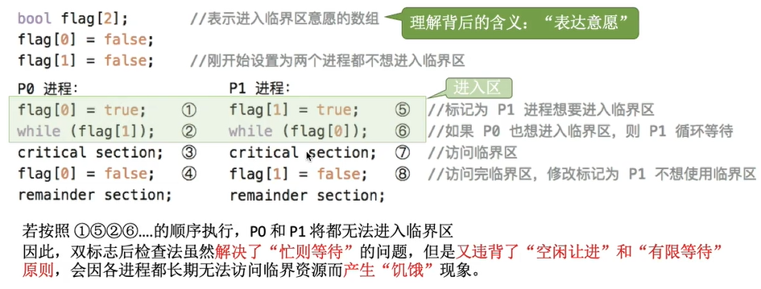

# 进程与线程


## 进程与线程综述

### 进程与线程的概念


**进程是进程实体的运行过程，是系统进行资源分配和调度的一个独立单位**

进程是程序的一次执行过程，是动态的

每个进程有一个唯一的PID(进程ID)


#### 进程控制块PCB：

用于保存PID、UID(用户ID)、给进程分配的资源、进程的运行情况等

- 进程描述信息
- 进程控制和管理信息
- 资源分配清单
- 处理机相关信息

凡是该进程**管理时所需要的信息，都放在PCB中**

PCB是进程存在的唯一标志，当进程创建时，操作系统会为其创建PCB，当进程结束时，会回收其PCB


#### 进程的组成

**进程由PCB、程序段和数据段组成**

PCB存储的是操作系统所需的数据

程序段和数据段是程序自己需要用到的数据


**进程实体**是由程序段、数据段和PCB组成的，是**静态**的

而**进程**是**动态**的，它是进程实体的**运行过程**

#### 进程的特征

- 动态性：动态产生、变化和消亡

- 并发性：进程可并发执行

- 独立性：每个进程是独立运行、独立获得资源、独立接受调度的基本单位

  > 在**引入线程**后，进程不是接受调度的基本单位了，但**仍然是独立获取资源的基本单位**

- 异步性：各自独立，按不可预知的速度推进

- 结构性：每个进程一个PCB


### 进程的状态与转换

> 三个状态的转换都是在内核态实现的


****


- 创建态

  > 进程正在被创建，但尚未转到就绪态
  >
  > 步骤：
  >
  > 申请PCB并填入控制和管理进程的信息、
  >
  > 分配运行时资源、
  >
  > 最后将其转入就绪态，并插入就绪队列

- **就绪态**

  > 进程获得了除了CPU以外的所有资源，一旦得到CPU就可以运行
  >
  > 系统中处于就绪态的进程很多，一般把它们排成**就绪队列**

- **运行态**

  > 进程正在CPU上运行

- **阻塞态**

  > 也叫等待态
  >
  > 进程因为等待某事件而暂停运行
  >
  > 如等待I/O完成，这时进程不能执行，所以处于阻塞态
  >
  > 阻塞态的进程会排成一个**阻塞队列**
  >
  > 当等待的事件

- 终止态

  > 进程正在系统中消失，可能是执行结束也可能是其他原因
  >
  > 进程需要结束时，系统就将其置为终止态，然后回收资源


#### 状态的转换


注意，进入阻塞态是进程自发进行的，所以仅有在占有CPU时才能实现这个过程


#### 进程的组织


- **链接方式**

  > 执行态、阻塞态、就绪态分别一个指针
  >
  > 每个指针指向一个PCB，像一个链表一样，一般把优先级高的靠前放
  >
  > 
  >
  > 甚至阻塞原因不同还会把阻塞队列分开
  >
  > 

- **索引方式**

  > 按状态建立索引表
  >
  > 索引表指向PCB
  >
  > 


### 进程控制


对进程实施有效的管理

要**实现进程的状态转换**

#### 如何实现进程控制

通过原语来实现

进程控制需要一气呵成，否则会导致数据结构数据不统一

原子性是由关中断和开中断这两个特权指令实现的

#### 进程控制相关的原语

- 进程的创建

  > 允许一个进程创建另一个进程
  >
  > 1. 分配进程号，申请空白PCB，若申请失败，则创建失败
  > 2. 为其分配资源，若资源不足，不会申请失败，而是处于创建态，等待资源
  > 3. 初始化PCB
  > 4. 把PCB插入就绪队列
  >
  > 结束后会由创建态->就绪态
  >
  > 
  >
  > **发生用户登录**、**作业调度**、**系统提供服务**、**应用请求**时会执行该原语

- 进程的终止

  > 将进程撤销
  >
  > 1. 根据标识符找到该进程的PCB
  > 2. 若其正在运行，则直接剥夺CPU
  > 3. 终止其子孙进程
  > 4. 释放资源，可以归还父进程，或者归还给操作系统
  > 5. 把PCB从队列删除
  >
  > 
  >
  > 引起进程终止的事件包括：**正常终止**、**异常结束**、**外界干预**

- 进程的阻塞与唤醒

  > 将进程阻塞：
  >
  > 1. 找到PCB
  > 2. 保护现场，将PCB设置位阻塞态
  > 3. 将PCB插入等待队列
  >
  > 引起阻塞的事件：**等待系统分配资源**、**等待其它进程完成工作**
  >
  > 
  >
  > 进程的唤醒：
  >
  > 1. 在等待队列中找到PCB
  > 2. 把PCB从等待队列移出，设置位就绪态
  > 3. 把PCB插入就绪队列
  >
  > **等待的事件发生**后进行唤醒
  >
  > **必须成对使用**

- 进程的切换

  > 让当前运行态的进程转就绪态，把另一个就绪态的进程转运行态
  >
  > 1. 把运行环境(进程上下文)存入PCB
  > 2. PCB移入相应队列
  > 3. 选择另一个进程运行，并更新PCB
  > 4. 根据PCB恢复新进程的运行环境
  >
  > 
  >
  > 引起进程切换的事件：
  >
  > **时间片到**、**更高优先级的进程到**、**进程主动阻塞**、**当前进程终止**


### 进程通信IPC


进程间通信是指两个进程件产生数据交互

进程是分配系统资源的单位，**各进程**拥有的**内存地址空间相互独立**

一个进程不能直接访问另一个进程的地址空间，所以需要通过操作系统进行进程间通信

PV操作是低级通信方式，高级通信方式是指以较高效率传输大量数据

高级通信方法主要有以下三类

#### 共享存储

在操作系统中建立一个共享存储区，每个进程都可以对这个共享空间进行读写

> Linux中，使用shm_open申请共享内存，使用mmap系统调用把共享内存区映射到自己的地址空间

当对共享区读写时，应当是互斥的

有两种存储方式

##### **基于存储区**的共享：

在内存中划出一块区域，而数据的形式和位置在这块区域中由进程自己控制，比较灵活，速度块，是**高级通信方式**

##### **基于数据结构**的共享：

操作系统给定一种数据结构，进程只能按照这个结构进行共享，限制多，速度慢，是**低级通信方式**


#### 消息传递

进程间的数据交换**以格式化的消息为单位**。进程通过操作系统提供的“发送消息/接收消息”这两个**原语**进行数据交换

一个消息包含**消息头**和**消息体**，消息头包含发送进程ID、接收进程ID、信息长度等数据

消息传递有两种方式

##### 直接通信方式

消息发送进程要指明接收进程的ID

在进程的PCB中包含着该进程的消息队列，用于接收别的进程发来的信息

> 假设P向Q发消息
>
> **P调用发送原语**，**指明**发送给Q，操作系统把这个消息**挂到Q的消息队列**上
>
> 当**Q想接收消息时**，**使用接收原语**，**指明**接收哪个进程的消息，**操作系统**就**从Q的消息队列上取出**找到P发送的消息，将其**复制到Q**的地址空间


P和Q是这两个进程的ID

##### 间接通信方式

通过“信箱”间接地通信，所以也叫信箱通信方式

> 进程可以通过系统调用申请建立几个信箱，
>
> 之后进程指明发送给哪个信箱即可
>
> 接收时，也指明从哪个信箱中接收


A和B是信箱的标号


#### 管道通信

管道是一种特殊的共享文件，其实就是内存中开辟一个大小固定的内存缓冲区

##### 管道的特点

1. 一个管道**只能单向**传递数据，某一时间段只能单向传输数据

   若**要双向同时**通信，**需要设置两个管道**，一段写入，一段接收

2. 各进程访问管道需要互斥的(由操作系统实现的)

3. 当**管道写满**时，**写进程将被阻塞**，直到读出数据才唤醒

4. **管道读空**时，**读进程会被阻塞**，直至到写入数据才唤醒

   (也就是读写是在同步机制下的)

5. 管道的数据一旦被读出，就彻底小时，所以当多个进程读同一个管道时，可能会错乱

   > 有两种解决方式
   >
   > 1. 可以有多个写进程，但是只能一个读进程
   > 2. 可以多个写也可以有多个读进程，但是读进程需要轮流读取数据


> 与共享存储的区别
>
> 共享存储方式，存取数据是任意的
>
> 而管道通信中，是以数据流的方式存取的，只有前面的数据存储或读取后，才能到下一个位置。是**先进先出的**


#### 信号通信

信号是一条小的消息，由内核或其它进程生成并发送至目标程序，目标程序会根据该信号做出反应，可以由进程或者内核发出

> 信号并不携带数据


### 线程的概念与特点

为了让同一个程序的不同功能并行，引入了线程

> 传统的系统中，程序执行流的最小单位是进程
>
> 引入线程后，线程变为了程序执行流的最小单位
>
> **线程间除了TCB中的数据都可以共享**

引入线程后，**进程**变为**系统资源(除CPU)的分配单位**，但是CPU调度的最小单位变为了线程

线程间并发时，如果是**同一进程**的**线程切换**，则不**需要切换进程环境**，开销小


#### 线程的属性

- 线程是处理机调度的单位
- 多CPU计算机中，线程可占用不同CPU
- 每个线程有一个线程ID和线程控制块(TCB)
- 线程也有就绪、阻塞、运行三种状态
- 线程几乎不拥有系统资源(都在进程中)
- 同一进程的线程共享进程资源
- 同一进程间线程通信无需系统干预
- 同一进程的线程切换不会引起进程的切换
- 不同进程的线程切换会引起进程的切换
- 切换进程内的线程，开销小
- 切换进程开销大


### 线程的实现方式


> 注意，只有一个进程中所有的**线程全部阻塞**，**这个进程才会被阻塞**

#### 用户级线程


早期操作系统不支持线程，只支持进程

所以线程是由线程库来实现的

这种方式下，**线程的管理由线程库**来完成

**线程的切换不需要转换**到内核态

**操作系统意识不到用户级线程的存在**

优点：

- 线程切换在用户空间内即可实现，不需要切换到核心态，线程管理的开销小，**效率高**

缺点：

- 当一个用户级线程被阻塞时，整个线程库的进程都会阻塞，**并发度不高**，多个线程不能在多核处理机上并行运行


#### 内核级线程


这是由操作系统支持的线程

线程的**管理由操作系统**完成

线程**切换需要操作系统转到核心态**执行

**操作系统能意识到内核级线程的存在**

优点：

- 当一个线程被阻塞，别的线程还能继续执行，可以在多核处理器上并行执行，并发能力强

缺点：

- 线程切换需要切换到核心态，管理成本高，开销大


#### 多线程模型

在支持内核级线程的系统中，再引入线程库

分为以下几种

- 一对一模型

  > **一个用户级线程映射到一个内核级线程**
  >
  > 和单纯的内核级线程差不多
  >
  > 

- 多对一模型

  > **多个用户级线程映射到一个内核级线程**
  >
  > 和单纯的用户级线程差不多
  >
  > 

- 多对多模型

  > **把n个用户级线程映射到m个内核级线程上**(n>=m)
  >
  > 集二者所长
  >
  > 注意，只有这个进程中所有的**线程全部阻塞**，**这个进程才会被阻塞**
  >
  > 
  >
  > 


### 线程的状态与转换

与进程的转换相似，主要只关注就绪态、运行态和阻塞态的转换


#### 线程的组织与控制

与进程控制也很类似，只不过管理的是线程的TCB

TCB中会包含：

- 线程标识符PID：用于标识线程

- 程序计数器PC：目前执行到哪了

- 其它寄存器：执行的中间结果

- 堆栈指针：存储的是堆栈的指针，对应位置保存着函数调用信息、局部变量等

  > 上3条在阻塞或切换时要保存，执行前得恢复

- 线程运行状态：运行、就绪、阻塞

- 优先级：调度时使用的


每个TCB可以表示一个线程，把线程组织起来，构成一个线程表，可以一个进程一个表，也可以所有线程一个表


## CPU调度


### 调度的基本概念和层次


调度是以某种规则来处理任务的顺序


#### 高级调度(作业调度)

作业：一个具体的任务

高级调度：按照一定的原则从外存的**作业后备队列**选择一个作业调入内存，并创建进程。**每个作业只调入一次，调出一次**。调入时会创建PCB，调出时撤销PCB。

> 可以看作调度的是选择启动的程序。是内存与辅存间的调度

多道批处理大都配有作业调度，而其它系统一般不需要

#### 中级调度(内存调度)

将暂时不能运行的进程**调至外存**等待，此时称为**挂起态**。当它们可以运行，且内存有空闲时，再由**中级调度**选择**调入内存**，变为**就绪态**，在就绪队列等待

> 挂起时，PCB仍在内存中

中级调度频率也会发送很多次，所以**频率比高级调度高**很多

#### 低级调度(进程调度/处理机调度)

按照策略，从就绪队列中选取一个进程，把处理机分配给它

进程调度是操作系统里**最基本的一种调度**，各种操作系统都必须配置进程调度

**进程频率很高**，几十毫秒一次


#### 七状态模型

就绪挂起和阻塞挂起

主要是中级调度实现的


> 挂起与阻塞不同
>
> **阻塞仍在内存**
>
> **挂起的进程处于外存**


### 调度算法的评价指标


#### CPU利用率：

$$
利用率 = \frac{忙碌时间}{总时间}
$$

如果是多道程序，使用甘特图比较方便计算

#### 系统吞吐量

$$
系统吞吐量=\frac{作业完成个数}{时间}
$$

#### 周转时间

指作业**从提交到完成**花了多少时间。

包括四个部分：

- 作业在后备队列等待作业调度(高级调度)的时间
- 进程在就绪队列上等待进程调度(低级调度)的时间
- 在CPU上执行的时间
- 等待I/O操作完成的时间

后三项可能有多次
$$
平均周转时间=\frac{各作业周转时间之和}{作业数}
$$
但是如果周转时间相同，运行时间越长其实CPU使用率越高

所以有了
$$
带权周转时间= \frac{作业周转时间}{作业实际运行时间}
$$


#### 等待时间

指作业或进程处于**等待处理机**状态 的**时间之和**

对**进程**来说，其实就是处于**就绪态的时间** ，**等待I/O请求的时间不算**

对**作业**来说，除了建立进程后的等待时间，还要**加上作业在外存后备队列的等待时间**

一般也会用平均等待时间

#### 响应时间

指 从用户提出**请求到首次产生响应**的时间


### 进程调度的实现


#### 进程调度的时机

**需要调度**的情况：

- 主动放弃

  > 进程正常终止
  >
  > 发生异常而终止
  >
  > 主动请求阻塞(等待I/O)

- 被动放弃

  > 时间片用完
  >
  > 更紧急的事发生(中断)
  >
  > 更高优先级的进程进入就绪队列

**不能调度**的情况：

1. 处理**中断**时一般不进行进程调度

2. 进程**在操作系统内核程序的临界区**中时

   > 注意是**内核程序**的临界区
   >
   > **其它临界区中是可以调度的**
   >
   > 这是因为内**核程序临界区**一般是**访问内核数据结构**的，就包括了进程的就绪队列，而此时该队列会上锁，也就无法访问
   >
   > 

3. **原子操作**过程中不能进行


#### 进程调度的方式

**非剥夺调度方式**，又称**非抢占方式**。即，**只允许进程主动放弃处理机**，哪怕有更紧急的任务，也有等该进程主动放弃

> 实现简单，系统开销小，但无法及时处理紧急任务，
>
> **适用于早期批处理**

**剥夺调度方式**，又称**抢占方式**。当进程在处理机执行时，如果**有更紧急的**进程，**就立即暂停**当前进程

> 可以优先处理更紧急的进程，可以实现时间片轮转(时钟中断)。
>
> **适用于分时、实时操作系统**


#### 进程的切换过程

**狭义的进程调度**：指从就绪队列**选中一个要运行的进程**（可以是刚暂停执行的进程，也可以是别的进程，如果不**是刚刚执行的进程，就要进程切换**）

**进程切换**：一个进程让出处理机，另一个进程占用处理机的过程。完成了原有程序的数据**保存**；对新进程的数据**恢复**。

**广义的进程调度**：包含了选则进程和进程切换两个步骤

> 进程切换是有代价的，过于频繁的调度，反而会使效率降低


#### 调度程序(调度器)

运行和就绪态的切换时有调度程序决定的

包括：

**调度算法**：让谁运行

**时间片大小**：运行时间多久

**调度时机**：什么事件触发调度程序

> - 创建新进程
>
> - 进程退出
>
> - 运行的进程阻塞
>
> - I/O中断发生(可能唤醒某些进程)
>

 

> - 非抢占式：只有进程阻塞或退出才会调度
>- 抢占式：每个**时钟中断**会触发调度程序，检查是否需要抢占


在**支持线程**的系统中

如果**支持内核级线程**，调度程序的调度单位就是**线程**

**否则**单位**仍是进程**


#### 闲逛进程

实际系统中，CPU永远不会停止，如果没有其它进程，就会选中闲逛进程


**特性**：

- 优先级最低
- 可以是0地址指令，指令末尾也会检查中断
- 能耗低


### 调度算法

前三种算法：FCFS、SJF/SPJ、HRRN


后三种，主要适合于**交互**式系统


#### 先来先服务FCFS

按进程/作业到达先后顺序服务

作业调度时判断的是哪个作业先到**后备队列**

进程调度是判断哪个进程先到**就绪队列**

一般是**非抢占式算法**


优点：公平，实现简单

缺点：排在长作业后面的短作业需要等很久。即**FCFS对长作业有利，对短作业不利**

> 也可以说是对CPU密集型有利，对I/O密集型不利(每次I/O都要重新排队)
>

**不会导致饥饿**


#### 短作业优先SJF

追求最少的平均等待时间，最少平均周转时间，最少的平均带权周转时间

**最短的作业/进程先得到服务**

> 长度一样时，先调度先来的
>
> **得到服务就会做完，不会被抢占**
>
> 一般来说各项平均指标都比先来先服务更小

调度进程时称作**SPF**短进程优先算法

**是非抢占式算法**，但是也**有抢占式版本**：**最短剩余时间优先算法SRTN**

> SRTN在有新进程**进入就绪队列**或者某个**进程完成**，**都要调度**
>
> 一般来说各项平均指标都比短作业优先更小

优点：平均等待时间、平均周转时间短

缺点：**不公平，对短作业有利，长作业不利**，甚至会产生饥饿现象。进程运行时间是用户提供的，不一定真实，不一定真正做到短作业优先

**会产生饥饿**，甚至会一直得不到服务


#### 高响应比优先HRRN

综合考虑作业/进程的等待时间和要求服务时间

在每次调度时，先计算各个进程的响应比，**选择响应比最高的**进程服务

> $$
> 响应比=\frac{等待时间+要求服务时间}{要求服务时间}
> $$

是**非抢占式算法**，只有进程主动放弃CPU时才调度，此时才计算响应比

**优点**：综合考虑了等待时间和运行时间；等待时间相同时，要求服务时间短的先执行(SJF优点)；要求服务时间相同时，等待久的先执行(FCFS优点)；对于长作业来说也考虑到了，避免了长作业的饥饿

**不会饥饿**


#### 时间片轮转算法RR

公平地、轮流为每个进程服务

按照进程到达就绪队列顺序，**轮流**让各个进程执行**一个时间片**，若在一个时间片内未处理完，则放到就绪队列尾部重新排队

**只用于进程调度**(只有作业放入内存，并建立了相应的进程后才会分配处理机的时间片)

是**抢占式算法**，由时钟装置发出**时钟中断**来通知CPU的

> 若时间片未用完进程就结束了，则也需要调度

如果**时间片过大**，就**会退化**成先来先服务算法，而且也会**增大进程响应时间**(在快结束时发出请求，要等其它所有进程都结束再轮到自己才能响应，会很久)

若**时间片太小**，则切换过于频繁，切换**花销过大**。(一般来说，用于切换的开销不能超过时间片的1%)

优点：公平，**响应快**，适用于**分时操作系统**

缺点：高频切换进程会有**开销**；**不区分任务紧急度**

**不会饥饿**

> 注意其轮转的顺序，与到达的顺序和放置的顺序有关，有时已有进程在队列中了，新进程在后面才能调度，而不是下一个就到它
>

#### 优先级调度算法

需要根据任务紧急度来调度

每个作业/进程都有各自的优先级，调度时**选择优先级最高的**

作业调度和进程调度都可以使用

**有抢占式的和非抢占式的**，非抢占式只在进程放弃CPU时考虑调度，抢占式除此之外还要在就绪队列改变时考虑调度 

> 就绪队列未必只有一个
>
> 静态优先级：进程创建时确定，之后不变
>
> 动态优先级：创建时有初始值，之后动态调整
>
> 

**优点**：可以区分紧急程度，适用于实时操作系统。可以灵活调整

**缺点**：若不断有高优先级的进程，低优先级会得不到调度

**会产生饥饿**


#### 多级反馈队列调度算法

对其它所有算法进行折中

> **设置多级就绪队列**：各队列优先级从高到低，时间片从小到大
>
> **新进程**到达时先进入**最高级队列**，按**FCFS****等待**被分配**时间片**
>
> 若被分配的**一个时间片完毕**进程还未结束，**则放入下一级队列的队尾**(若在最下级，就放到最下级的队尾)
>
> **只有当高级队列为空时，才会调度低级队列**
>
> 注意是抢占式的，所以**新进程进入会抢占处理机**，但是**被抢占的进程**不放到下一级，而是**放到当前队列的队尾**
>
> 

一般用于**进程调度**

一般是**抢占式算法**

> 

**优点**：对各类型进程相对**公平**(FCFS优点)；每个新到达的进程都能**很快得到响应**(RR优点)；**短进程**只需要较短时间就能完成(SPJ优点)；**不必估计**进程运行时间(克服了SPJ缺点)；**可以灵活调整**对各类型进程的**偏好**程度，比如CPU密集型进程，I/O密集型进程

(可以将因I/O阻塞的进程重新放回原队列，这样I/O型进程就可以保持较高优先级)

**会导致饥饿**(一直来新进程，老进程就得不到服务)


#### 多级队列调度算法

根据进程的类型设置多种队列

进程创建成功后插入某个队列

每种队列可以采用不同的调度方式，变得更灵活


## 同步与互斥


### 同步与互斥的基本概念


**同步**：让程序按照确定的顺序执行，也叫直接制约关系

**互斥**：在**一个时间段内只允许一个进程访问该资源**

需要互斥访问的资源叫做**临界资源**


实现互斥访问分为4部分：

1. **进入区**：检查是否可进入临界区，若可，则设置访问的标志位(**上锁**)
2. **临界区**：**访问临界资源的代码**
3. **退出区**：解除访问的标志位(**解锁**)
4. **剩余区**：**程序的其它代码**

实现对临界区资源的

#### **互斥访问的原则**：

- 空闲让进：临界区**空闲**时，**可允许**一个进程**立即访问**
- 忙则等待：**已有进程进入**时，其它进程必须**等待**
- 有限等待：对等待的进程，应保证**等待的时间有限**(不会饥饿)
- 让权等待：当进程**不能进入**临界区时，应当**释放处理机**


### 进程互斥的软件实现算法


以下算法都只考虑两个进程的情况

#### 单标志法

进程在访问完临界区后，会把使用临界区的权限转交给另一个进程，也就是说**进入临界区的权限只能被另一个进程赋予**

也就是每当一个进程只能等待turn是自己时才进入，运行结束后，把turn改为对方的值


缺点：当p1交给p0后，即使p0不使用，也会占用一整个时间片，下一次p1才能使用，临界资源也叫空闲了

也就是违背了**空闲让进**原则

#### 双标志先检查法

建立一个布尔型的数组，用于标记各进程想进入临界区的意愿，当值为1时，代表想进入。

先检查法是指：在轮到自己时，先判断对方是否想进入(flag是否为1)，若对方想进，自己就循环等待，若对方不想进，就把自己的意愿改为1，执行结束后，把自己的意愿改为0.


由于程序是并发执行的，在p0判断后还未修改自己的flag是，若被调度到p1，p1会继续执行，导致两个进程都进入临界区

**违反了忙则等待**原则


#### 双标志后检查法

后检查法，先设置自己的意愿也就是先上锁，然后再检查对方的意愿



但是当调度让两个进程都设置了自己的意愿，此时两个进程全都不能运行

会**违背空闲让进和有限等待**，从而产生“**饥饿**”  (其实实际上叫活锁可能更好)


#### Peterson算法

结合了双标志法和单标志法的思想，使用turn和flag两个变量

先把自己进程的意愿(flag)标志为想进

然后检查对方的意愿(对方的flag是否为1)，若对方想进，则让turn改为对方，也就是让对方优先进

做完这些后进行判断，当**对方不想进，或者turn不等于对方**时，**自己就可以先进入**，否则等待


 

虽然Peterson遵循了空闲让进，忙则等待，有限等待三个原则，但是**没有遵循让权等待**


### 进程互斥的硬件实现方法


#### 中断屏蔽方法

利用开关中断指令，使访问临界区资源的进程不会被切换，直到访问完毕


优点：简单高效

缺点：

**不适用于多处理机**；(关中断仅仅关闭当前处理机的中断)

**只适用于操作系统内核进程**，不能让用户进程使用(开关中断是特权指令)


#### TestAndSet指令

可叫TS指令或者TSL指令

TSL指令是**硬件**实现的，过程**不可中断**，只能一气呵成

所有进程有一个共享变量lock(其实是硬件里的寄存器)，执行TSL指令时

先把lock原来的值存下来，保存为old，然后把原先的lock覆盖为true

> 全都覆盖是因为：如果原来就是true，相当于没做，若原来是false，则下一次调用TS指令的进程就会访问临界区，那么就不能让其它进程使用，就要上锁

返回old的值，也就是覆盖前有没有上锁

当发现原来没有上锁，跳出执行，访问临界区


优点：实现**简单**，不用检查是否有逻辑漏洞；也**适用于多处理机**系统

缺点：**不满足让权等待**，无法访问临界区的进程也会一直占用CPU执行TSL指令


#### Swap指令

也叫Exchange指令XCHG

Swap指令也是**硬件**实现的，执行时**不允许中断**

该指令就是硬件实现的交换两个变量的值

和TSL指令逻辑类似，但它会新建一个新的old变量，在循环中不断把old和lock做交换，然后直到交换得到的值为false，跳出循环，进入临界区


优缺点与TLS一样


### 互斥锁

解决临界区最简单的工具就是互斥锁，一个进程在进入临界区应当获得锁，退出时应当释放锁。acquire()就是获得锁，release()就是释放锁

这两个函数必须是原子操作

互斥锁的缺点主要就是**忙等待**，违反了让权等待原则，在其它进程想进入临界区是，必须循环调用acquire()直到得到锁，会浪费CPU

这种需要忙等的互斥锁，称为**自旋锁**，如TSL、Swap、单标志法等


特点：

- 需要忙等，违反让权等待
- 等待不用切换进程上下文，若上锁时间短，则开销不大
- **常用于多处理器系统**，可以由其它核解除该进程的忙等
- 一般**不适用于单处理器**，因为忙等中不可能进行解锁


### 信号量机制


> P、V默认是记录型信号量

用户进程可以通过使用操作系统提供的一对**原语**来对信号量进行操作，从而很方便的实现互斥核同步

信号量就是一个变量(可以是整数，也可以是更复杂的记录型变量)，可以用信号量**表示一个系统中某种资源的数量**

使用**wait(S) 和signal(S)**原语，也可以简写为**P、V**操作(P操作-1，V操作+1)

#### 整型信号量

用一个整数型的变量作为信号量，用来表示系统中某种资源的数量。(对该信号量的操作只有3种：初始化、P、V)

实现方法其实和双标志先检查法差不多，但是由于它是用原语实现的，所以不会两个进程同时进入临界区


**问题：不满足让权等待**


#### 记录型信号量

由结构体组成，除了原先的整数表示剩余资源数，还维护了一个等待队列

> 当使用P操作时，先让资源数减一，然后判断一次资源数是否大于0，
>
> 若**小于0**，说明当前没有资源可以使用，
>
> 所以执行**block**，把该进程**放入阻塞队列**中
>
> 若大于等于0，说明当前资源够用，不用阻塞，可以继续运行

> 使用V操作时，先把资源数加1，然后判断当前资源数是否大于0，
>
> 若**小于等于0**，说明本进程释放后，还有进程需要用该资源(也代表阻塞队列有成员)
>
> 就使用**wakeup**()去阻塞队列中**唤醒一个进程**，让它使用
>
> 若大于0说明当前没别的进程一使用资源，不用唤醒


### 用信号量机制实现进程同步、互斥、前驱关系


#### 实现进程互斥

设置**互斥信号量mutex，初值为1**

```c
semaphore mutex=1;   //这样定义信号量即可
//但是有时可能会让定义结构体，那需要先这样:
typedf struct{
    int value;
    struct process *L; //等待队列
}semaphore;
```


对于**不同的临界资源**，要设置不**同的互斥信号量**


#### 实现进程同步

同步：让并发进程有序执行

使用信号量实现：

设置同步信号量S，初始为0

在要先执行的代码后执行V操作

在需要后执行的代码前执行P操作


#### 实现前驱关系

使用同步的方式，在需要先执行的代码后执行V操作，后执行的代码前执行P操作

注意前驱关系需要设置多个同步信号量


### 生产者消费者问题

> 


生产者进行生产，消费者消费，缓冲区大小为n，只有缓冲区没满生产者才能生产，只有缓冲区不空，消费者才能消费。此外缓冲区必须互斥访问

由于只能使用P、V操作来实现，所以满和空必须分开考虑

还要考虑到缓冲区的互斥，所以定义以下变量

```c
semaphore mutex = 1;
semaphore full = 0; //这是显示当有多少产品的，刚开始没有产品
semaphore empty = n; //这是显示还有多少位置可以生产的，刚开始有n个位置
```

假设只考虑产品数，当消费前，应当P(full)确保有产品

在生产后，应当V(full)表明生产出产品了

若只考虑缓冲区大小，当生产前，应当P(empty)，确保还有空位

在消费后，就V(empty)，表明多了空位

同时从存或取缓冲区，要保证互斥，在缓冲区操作前后加上P(mutex)和V(mutex)

```c
Producer(){
    //生产
    P(empty);
    P(mutex);
    //存
    V(mutex);
    V(full);
}
consumer(){
    P(full);
    P(mutex);
    //取
    V(mutex);
    V(empty);
    //消费
}
```

> **P操作**的顺序不能改变，必须**互斥信号量贴近临界区**，否则会产生死锁

> 注意，以上消费代码和生产的代码，其实放入临界区不会有致命问题
>
> 但是，这会使得临界区变长，时间变久，并发度下降，效率变低


### 多生产者-多消费者问题

应当看作是**多对不同类的生产者消费者问题**，每种生产者生产的产品是不同的

 在分析这类问题时，应还是当**把生产者和消费者这两类**来考虑，而不是按照进程来考虑

也就是生产者会在缓冲区添加数据，消费者会取出数据，是这样的关系，把缓冲区当作桥梁

然后**再分析每对生产者和消费者间的关系，进行同步**

如：


> **缓冲区大小可以不为1**，但不为1时，修改plate的初值即可

> 由于盘子要互斥访问，所以要设置互斥信号量mutex
>
> 父女、父子间要同步，所以分别需要apple和orange两个同步信号量
>
> 此外，由于盘子的大小有限制，所以也要设置一个同步信号量plate
>
> plate是所有生产者和所有消费者之间的同步互斥问题
>
> 其实本题可以不需要mutex，因为盘子大小仅为1，使用plate可以替代它实现互斥
>
> **但注意：当盘子大小不为1时，不可省略，所以一般加上即可**

```c
semaphore mutex = 1;
semaphore plate = 1;
semaphore apple = 0;
semaphore orange = 0;
```


### 吸烟者问题

用于解决单个生产多种产品的生产者，对应多个消费者的情况

每个消费者等待的产品组合不同，且每次只能一个消费者进程执行，在执行结束后，反馈给生产者进程，让其准备下一个

主要注意：生产者将不同组合摆上后发出的信号是不同的，在消费者执行后，产生的完成信号是相同的

此外，由于每次生产者最多产生一个信号，让一个消费者执行，所以仍然可以不使用互斥信号量


> 若题目改为随机让一个抽烟者吸烟，则把i的变换，改为使用random()函数


### 读者写者问题


读者与前面的消费者不同，它在读完数据后，数据仍然保留，所以读者可以同时访问

它是一个单纯的互斥问题，并不包含同步，而且既要保证写进程与其它进程互斥，又要保证读进程之间不互斥，比较复杂

由于读写进程之间要互斥，所以我们考虑使用互斥信号量rw，在读写临界区前后上锁解锁

但是这样的话，读进程间也会互斥，所以需要加上条件判断，设置一个记录当前读者值的数cnt

只有第一个读者进入时，才进行P操作，并给cnt+1，对于后到来的读者，不用P操作，只给cnt+1，每个进程退出前，给cnt-1，并且最后一个读者退出时，给rw解锁，这样，读者间就不会互斥了，吗？

不是，由于读者间也会并发执行，而判断cnt和给cnt赋值不是一气呵成的，所以还会引起读进程的死锁，要解决这个问题，应当把cnt看作临界资源，在判断和赋值过程中上另一把互斥锁mutex

这样，就可以实现真正的读者写者问题了


但是这种方式是读进程优先的，若一直有读进程进入，rw一直不会解锁，写进程就会一直等待，会出现饥饿现象，这是不太好的，下面有一种更公平的算法

再添加一个互斥信号量w，对读者在mutex前后上锁；

对读者在rw前后上锁

这样，当需要写的时候，就可以等待最后至多一个读进程的加入，之后写进程就会完成w的上锁，这时可能仍有读进程，所以写进程会在rw处等待，但是不会有新的读进程加入了，新的读进程会等待w这把锁

所以当读进程全部完成后，会释放rw，写进程就可以执行了


> 所以这就实现了一个先来先服务的读写进程，也叫做读写公平法


### 哲学家进餐问题

与之前的都不同，每个进程需要持有两个临界资源才能运行，所以可能会产生死锁

该算法的关键就是防止死锁发生

当遇到一个进程**需要多个临界资源就需要考虑死锁**

 

对于哲学家进餐问题，只要防止所有哲学家都拿起一根筷子，然后等待即可

可以用的方法有：

- 最多同时有4个哲学家同时进餐

  > 设置一个信号量n=4，在试图拿筷子之前，对P(n)，两根拿完之后V(n)
  >
  > 这样最多同时有4个进程拿筷子，至少有一个能拿一双

- 让奇数哲学家先拿左边，偶数先拿右边

  > 这样相邻的奇偶哲学家至多一个人抢到相邻的筷子，没抢到的会什么都不拿就阻塞
  >
  > 这样就至少有一个人可以拿全

- 先拿编号小的筷子

  > 由于编号是0-4，所以前4个人会拿左手边，最后一个人会拿右手边，也至少一个人会拿全

- 互斥得拿筷子

  > 添加互斥信号量mutex，在拿筷子前后上锁，这样最多同时只能一个人拿一双筷子
  >
  > 当它拿完一双后，会解锁，下一个人要么拿全两支，要么拿一支就阻塞，还可能之间阻塞，但是只要他阻塞，就不会有人能再拿筷子了
  >
  > 


### 管程

引入管程是为了解决信号量编写程序困难的问题

管程可以完全**解决互斥**的问题，这是**编译器实现的**(**同步还是要自己写**)

#### 管程的定义

由以下四部分组成

1. 内部有共享数据结构的定义
2. 对数据结构操作的过程(函数)
3. 对共享数据结构设置初始值的语句
4. 有名字

特征：

1. 管程内部的数据**只能由管程内的过程(函数)访问**
2. 进程只要通过调用管程内的过程才能进入管程访问共享数据
3. **每次仅允许一个**进程在管程内执行某个内部过程


> 管程内进行阻塞时，会让管程内的其它过程执行

#### 条件变量

管程的条件变量是

1. x.wait：进入阻塞，并**插入x的阻塞队列**之中
2. x.signal：**唤醒一个阻塞的进程**，若没有阻塞的进程，不会产生任何影响

管程中的条件变量操作很像P、V操作

但是**与信号量有不同**：条件变量**没有值**，只实现了排队等待

其**剩余资源数是通过共享数据结构记录**的


## 死锁

> 当所有进程都阻塞的时候才叫死锁，只是系统中资源分配完毕，但只要还没有进程阻塞的时候不叫死锁
>

### 死锁的概念


- **死锁**：多个进程因竞争资源而造成的一种僵局(**各个进程都在等待对方手里的资源**)，使得各个进程都阻塞，若无外力，都不能向前推进。

  > 一定是阻塞态、至少两个进程

- **饥饿**：长期得不到想要的资源，某进程无法向前推进。

  > 可以是一个进程，可以是阻塞态也可以是就绪态

- **死循环**：某个进程一直跳不出某个循环的现象。

  > 可能是一个进程，也可以是运行态


#### 死锁产生的必要条件

1. 互斥条件：资源需要互斥使用

2. 不可剥夺条件：其它进程不能抢夺，只能主动释放

3. 请求和保持条件：在保持资源后，仍然可以请求新的资源

4. 循环等待：存在资源的循环等待链，链中的每个进程已获得的资源同时被下一个进程请求

   > 循环等待是必要条件，当等待的资源大于1时，不一定会死锁
   >
   > 但是若等待的资源都只有一个，那就是充要条件了
   >
   > 


#### 什么时候会发生死锁

1. 对系统资源竞争时
2. 进程的推进顺序非法时
3. 信号量使用不当时


#### 死锁的处理策略

1. **预防死锁**。破坏死锁产生的必要条件中的一个或几个
2. **避免死锁**。防止系统进入不安全的状态(银行家算法)
3. **死锁的检测和解除**。允许死锁发生，不过操作系统需要检测死锁的发生，并采取措施解除死锁


### 预防死锁


#### 破坏互斥条件

把只能**互斥的资源改造为允许共享**使用的，就不会死锁

##### SPOOLing假脱机技术

可以把独占设备在逻辑上改变为共享设备，添加一个输出进程，每个进程把打印任务**交给输出进程**，输出进程进行按序使用打印机，这样在原进程**看来就是直接被处理，不用阻塞**

##### 缺点

不是所有资源都可以改为共享资源，而且为了安全，很多资源必须互斥

所以大多**数情况都无法破坏互斥条件**


#### 破坏不剥夺条件

方案一：当某个进程**请求新的**资源**得不到**满足时，必须**立即释放所有资源**，之后再重新申请

方案二：当某个进程需要的资源被其它进程占有时，可以**借助操作系统剥夺**其资源。这种方式一般要考虑优先级

##### 缺点

实现较复杂

释放资源会导致之前的工作失效。所以说一般用于容易保存的资源，如CPU

反复地申请和释放资源会增加系统开销，降低系统吞吐量

采用方案一，可能会一直释放再重新申请，而得不到执行，**产生饥饿**现象


#### 破坏请求和保持条件

可以**采用静态分配方式**：在运行前一次把所有需要的资源全部申请，在投入运行后，资源就一直归它所有，也不会请求新资源

##### 缺点

**资源利用率极低**，还可能导致**进程饥饿**


#### 破坏循环等待条件

采用**顺序资源分配法**：首先给系统中的资源编号，每个进程必须**按编号递增的顺序请求资源**，编号相同的资源一次申请完


##### 缺点

**不方便新增**新的设备

进程实际使用资源的顺序可能和编号不一样，会导致资源浪费

必须按规定次序申请资源，用户编程麻烦


### 避免死锁

**安全序列**：按照安全序列分配资源，则每个进程都能顺利完成。只要能找出一个安全序列，系统就是**安全状态**。安全序列可以有多个。

若分配资源后，找不出任何一个安全序列。系统就进入了**不安全状态**，意味着之后**可能**所有进程**都无法顺利执行**下去。不过如果有进程提前归还了一些资源，也可能重新回到安全状态。

> **安全状态一定不发生死锁**，**不安全状态可能发生死锁**
>
> 发生死锁一定在不安全状态，但不安全状态不一定就是已经发生了死锁

避免死锁：在资源**分配之前提前判断**该次分配是否会进程不安全状态，由此判断是否分配该请求，这也是**银行家算法**的核心思想


#### 银行家算法

##### 数据结构

- Available**可利用资源向量**，表示当前系统还剩多少资源没分配
- Max**最大需求矩阵**，每个进程最多对每种资源的需求数
- Allocation**分配矩阵**，每个进程已经分配了多少资源
- Need**需求矩阵**，进程接下来最多还需要多少资源

概述

1. $Request_{i}$是第i个进程此次请求的资源量。若其中每一项都小于等于$Need_i$，转向第二步，否则认为出错

2. 接下来判断$Request_{i}$是否小于等于Available，表示若是，则转向第三步，否则必须等待(因为当前分配不了那么多资源)

3. 试探着分配给它资源，并修改数据结构的值

   Available  **-=**  $Request_{i}$；

   $Allocation_i$ **+=** $Request_{i}$ ;

   $Need_{i}$  **-=** $Request_{i}$

4. 执行安全性算法，判断此次分配后，是否存在安全序列，若存在，则正式分配。否则此次分配作废，恢复原来状态，让$P_{i}$等待

   > 安全性算法：
   >
   > 设置工作向量Work = Available
   >
   > 1. 初始安全序列为空
   > 2. 将所有**Need小于等于Work**的进程都加入安全序列，进入三。若找不到一个进程，则进入四
   > 3. 把新加入安全序列的进程的**Allocation加到Work上**，返回步骤二
   > 4. 若安全序列**已有全部进程**，则处于**安全**状态，**否则不安全**。

### 死锁的检测和解除


#### 死锁的检测

使用**某种数据结构**来保存资源的请求和分配信息

提供**一种算法**，利用上述信息判断是否进入死锁


##### 资源分配图

**两种节点**：

- 进程节点：对应一个进程
- 资源节点：对应一类资源，一类资源可能有多个

**两种边**：

- 进程节点—>资源节点：表示进程想申请多少资源(一个边代表一个)
- 资源节点—>进程节点：表示已经给该进程分配了多少资源(一个边代表一个)

  

##### 死锁检测算法

1. 在资源分配图中，找到一个既不阻塞也不是孤点的进程，小区它的所有请求边和分配边，使之称为孤立的节点。

   > 也就是找到至少有一个边相连的进程节点，若其对应资源的申请数量，小于现在空闲的资源数量，那就把这个进程的所有边全部删去

2. 消除后的节点释放的资源又能唤醒其它的进程，再重复上述步骤，若能消除整个图中的所有边，则说明该图是**可以完全简化**的。

**死锁定理**：若某时刻资源分配图是不可完全简化的，说明发生**死锁**


#### 死锁的解除

一旦检测到死锁，就应当立即解除死锁。

> 不是系统所有的进程都是死锁状态，只有化简资源分配图后，还连着边的进程才是死锁进程

##### 解除死锁的方法

1. **资源剥夺法**。挂起某些死锁进程，并抢占它的资源，分配給其它进程。但是要防止进程饥饿
2. **撤销进程法**(终止进程法)：强制撤销部分死锁进程。优点是实现简单。缺点是代价较大
3. **进程回退法**：让一个或多个死锁进程回退到可以避免死锁的状态。这要求**系统记录进程的历史信息**，设置还原点


