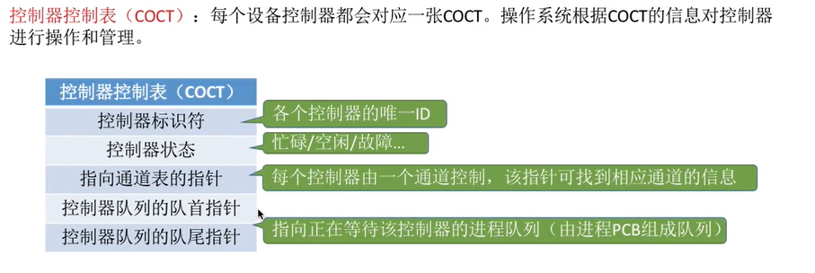
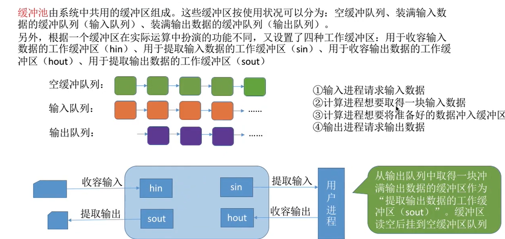
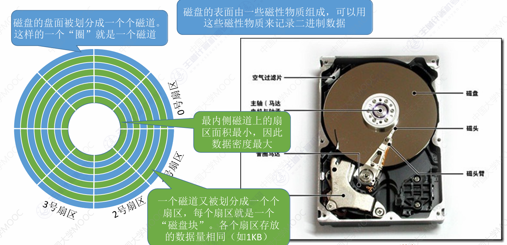

# 输入输出管理

## I/O管理概述

### I/O设备

也就是输入输出设备

UNIX系统把输入输出设备也看做一种**特殊的文件**，用户可以使用与文件系统操作相同的方式对外部设备进行操作了

#### I/O设备的分类

1. 人机交互设备：速度最慢
2. 存储设备：速度最快
3. 网络通信设备：介于二者中间

1. 低速设备
2. 中速设备
3. 高速设备

1. 块设备：数据传输的**单位是块**，速率较高，可寻址
2. 字符设备：**单位是字符或字节**，速率较慢，不可寻址，输入输出常采用中断驱动方式

### I/O控制器

机械部件：用于具体执行I/O操作的

电子部件：主要是插入主板的电路板

电子部件也叫做I/O控制器

#### I/O控制器的功能

1. **接受和识别CPU发出的命令**

   > 如CPU发来read/write指令，I/O控制器中会有相应的**控制寄存器**来存放指令和参数

2. **向CPU报告设备的状态**

   > I/O控制器中会有相应的**状态寄存器**，用于记录I/O设备当前的状态

3. **数据交换**

   > 还会有**数据寄存器**，暂存CPU发来的数据

4. **地址识别**

   > 类似于内存的地址，用于区分其中的各个寄存器

#### I/O控制器的组成

- CPU与控制器的接口

  > 包含数据寄存器、控制寄存器、状态寄存器
  >
  > 用于实现**CPU与控制器**的通信。CPU通过控制线发出命令；通过地址线指明设备；通过数据线来输入输出数据

- I/O逻辑

  > 负责接收和识别CPU发来的各种命令，并负责对设备发出命令

- 控制器与设备的接口

  > 一个控制器可能会控制多个I/O的设备，为了确认操纵哪个设备，需要对设备进行编号
  >
  > 用于完成**设备和控制器间**的通信
  >
  > 向I/O控制器传送自己的数据、状态和控制信息

> CPU操作设备的过程
>
> CPU先通过**控制线**向I/O控制器发出具体的指令，同时在**地址线**上指明操作的设备地址(I/O逻辑负责接收)
>
> CPU通过**数据总线**，把数据放到**数据寄存器**中，还会把需要用到的控制信号存储在**控制寄存器**中，还要从**状态寄存器**中读出当前设备的状态
>
> 数据通过I/O逻辑读出或者写入，控制寄存器的信号发送给I/O逻辑，状态寄存器的信息是I/O寄存器写入的
>
> I/O逻辑负责把输出传送到设备的接口

> 一个I/O控制器可能会对应多个设备
>
> 数据寄存器、控制寄存器、状态寄存器可能有多个(每组对应一个设备)
>
> 且这些寄存器都要有对应的地址
>
> 有的计算机会让它们占据内存地址，称为**内存映像I/O**
>
> 还有的计算机会采用I/O的专用地址，即**寄存器独立编址**

#### 内存映像I/O与寄存器独立编址

内存映像I/O的地址是统一编址

可以使用普通的访存指令进行I/O

寄存器独立编址是单独的地址，与内存其它空间地址不相连，设备间的寄存器可能相连也可能不相连

必须使用专门的控制器操作，除了指明地址还有指明控制器编号

### I/O控制方式

用什么样的方式控制I/O设备的读写

主要关注：读写操作的流程、数据传送的单位、数据的流向、优缺点

#### 程序直接控制方式

##### 流程

1. **CPU向控制器**发出指令，设备启动，但此时设备未准备好，于是设**置状态寄存器为1(未就绪)**
2. CPU**轮询检测**状态寄存器，直到其变为0
3. 若**设备**准备好了数据，则把数据传送给I/O逻辑，并**报告自身状**态
4. I/O逻辑发现后，把**数据存入数据寄存器**，并**修改状态寄存器**为0
5. **CPU**发现状态寄存器变为0，便可以从数据寄存器中**读取数据**了，**读到CPU的寄存器，再放到内存中**
6. 若还要继续读入，则CPU继续发出读指令

> 注意，程序直接控制方式，会把数据读到CPU的寄存器中，再放入内存

> CPU每次I/O操作开始前、后都要介入，同时，在等待I/O完成的过程中也要**不断地轮询**检测
>
> **每次读写一个字**
>
> #### 数据流向：
>
> 读：I/O设备->CPU->内存
>
> 写：内存->CPU->I/O设备
>
> #### 优缺点
>
> 实现简单，只需要在读写指令之前加上实现循环检测的指令即可，可以只用软件实现
>
> CPU和I/O设备只能串行工作，CPU需要轮询检查，处于忙等状态，利用率低

#### 中断驱动方式

引入中断机制。

##### 流程

1. CPU发出命令，此时将等待I/O的进程阻塞，先切换到别的进程
2. 当I/O准备和数据完成后，控制器向CPU发出中断信号
3. CPU接收到中断信号，就保存唤醒，执行中断处理程序
4. 处理中断的过程中，CPU从I/O控制器读一个字的数据送到其寄存器，然后写入主存
5. CPU恢复等待I/O的进程(或者其它进程)的运行环境，继续执行

> CPU在每个指令末尾检查中断
>
> 中断处理需要时间开销，太频繁会影响性能

> CPU的干预频率降低了，只在I/O操作开始前和结束后介入，**在等待I/O完成时，可以切换到别的进程执行**
>
> **每次读写一个字**
>
> #### 数据流向：
>
> 读：I/O设备->CPU->内存
>
> 写：内存->CPU->I/O设备
>
> #### 优缺点
>
> 不需要轮询访问，可以与I/O设备并行
>
> 但是频繁的I/O会**不断处理中断**，消耗的时间较多

#### DMA方式

DMA(**直接存储器存取**)，**主要用于块设备**的I/O控制 

相比之前的方式有以下改进：

1. 传送的数据**单位是块**，不再一个字一个字传输(这里指每满一个块，才进行一次)
2. **数据**的流向不**必通过CPU**，可以直接从设备到达内存
3. **仅在**传送一个或者多个数据块的**开始和结束时，才需要CPU干预**

##### 流程

1. CPU给I/O模块发出读/写指令，然后转去做其它事情

   > CPU需要指明此次的操作
   >
   > 读入多少数据
   >
   > 数据存在内存的地址
   >
   > 数据在外存的地址

2. **DMA控制器**根据CPU发出的命令参数，完成读写工作

3. 当本块的数据存取结束后，向CPU发出中断信号，由CPU来处理

   > 整块数据读完之后才发送中断

##### DMA控制器

包含以下部件：

**主机与控制器的接口**，主要包含以下寄存器

- **DR数据寄存器**：**暂存**设备到内存，或从内存到设备的**数据**
- **MAR内存地址寄存器**：在输入时，MAR表示数据应该放到内存的什么位置，输出时表示要输出的数据放在内存的什么**位置**
- **DC数据计数器**：表示剩余要读写的**字节数**
- **CR命令状态寄存器**：存放CPU发来的I/O命令，或者设备的状态信息

**I/O控制逻辑**：用于管理数据的传递

**与块设备的接口**：实现块设备和设备的通信

> 数据总线把CPU和内存联系在一起，**数据的读写不再通过CPU**
>
> DMA控制器根据CPU提供的参数(读取位置在MAR，大小在DC)，直接让数据在**内存和设备间交换**

> 仅在传送一个或者多个块**开始和结束**时，才需要CPU干预
>
> 每次读写一个或者多个块（注意，读写的**必须是连续的多个块**，否则需要分多次；同时，在**内存中也是连续存放的**）
>
> #### 数据流向：
>
> 读：I/O设备->内存
>
> 写：内存->I/O设备
>
> #### 优缺点
>
> 数据传输以块为单位，CPU介入少，数据传输不必通过CPU，效率提高，CPU和I/O的并行度也提高
>
> 但是每发出一条指令，只能读写连续的数据块

#### 通道控制方式

是一种硬件，简化版的CPU，可以识别并执行一系列的**通道指令**

##### 流程

1. **CPU向通道**发出I/O指令。**指明通道程序**在内存中的**位置**，并**指明操作的I/O设备**，然后CPU可执行其它程序

2. **通道去执行内存中的通道程序**

   > 通道程序里写了执行的操作，数据的多少，数据存放的位置等信息

3. 当通道把通道程序**执行完毕**后，向CPU**发出中断**信号，之后**CPU**对中断进行**处理**

> 与CPU相比，通道能识别的指令较单一，而且通道与CPU共享内存
>
> **CPU的干预频率极低**，只有完成一组数据库的读写后才发出中断信号，请求CPU
>
> 每次读写一组数据块，可以不连续
>
> #### 数据流向(在通道的控制线进行)
>
> 读：I/O设备->内存
>
> 写：内存->I/O设备
>
> #### 优缺点
>
> CPU、通道、I/O设备可以并行工作，利用率高
>
> 但是实现复杂，需要专门的硬件

### I/O软件层次结构

越靠上越接近用户，上层使用下层的服务

#### 用户层软件

该层的功能在用户层实现

**实现与用户交换的接口**

会提供一些I/O操作的库函数

当需要进行I/O操作时，会调用**设备独立性软件**的**系统调用**接口

> 这是因为只有操作系统才能操作硬件

#### 设备独立性软件

也可能叫**系统调用处理层**

也叫做**设备无关性软件**

> 几乎所有与硬件特性无关的功能都在这一层

- 向上层提供系统调用接口

- 实现设备的保护

  > 与文件保护类似

- 差错处理

- 设备的分配与回收

- 数据缓冲区管理

  > 用于屏蔽设备之间数据交换单位大小和速度差异

- 建立逻辑设备名到物理设备名的**映射**，根据设备的类型选择**调用**相应的**驱动程序**

  > 映射关系是**逻辑设备表LUT**实现的，用于确定逻辑设备对应的物理设备，并且找到对应的设备驱动程序
  >
  > 
  >
  > 逻辑设备表的两种方式，类似于单级目录和两级目录
  >
  > 不同的设备需要不同的设备驱动程序

#### 设备驱动程序

驱动程序一般以一个独立进程的方式存在

由于不同设备有不同的硬件特性，所有程序需要根据硬件特性设计驱动程序

#### 中断处理程序

I/O任务完成后，I/O控制器会发送一个中断信号，系统根据中断信号的类型，找到相应的中断处理程序执行

### 输入/输出应用程序接口和驱动程序接口

#### 输入/输出应用程序接口

由于物理设备是不同的，所以说系统无法通过一个统一的系统调用接口来完成所有设备的I/O，这就需要设备独立性软件给用户提供不同的接口

##### 字符设备接口

get/pu系统调用t：向字符设备读写一个字符

##### 块设备接口

read/write系统调用：向块设备的**读写指针位置**读写多个字符

seek系统调用：**修改读写指针位置**

##### 网络设备接口

也叫做**网络套接字接口**

socket系统调用：**创建一个网络套接字**，需要指明网络协议(tcp、udp)

bind：将套接字绑定到本地**端口**

connect：将套接字连接到远程地址

read/write：从套接字读写数据

> 1. 先创建一个socket，**分配**在一片**内核**空间中，给用户返回socket的**描述符**(相当于指针)
>
> 2. 然后使用bind将其绑定到本机端口
>
> 3. 然后用connect指明socket的描述符，以及目的ip和端口，用于连接到远程主机的socket
>
>    就可以收发数据了，数据会存储在给socket分配的内核空间中
>
> 4. 最后就可以直接使用read/write读写数据了

#### 阻塞I/O与非阻塞I/O

阻塞I/O：发出I/O系统调用时，进程**需要阻塞等待**

非阻塞I/O：应用程序发出I/O系统调用时，可以迅速返回，**无需等待**

#### 设备驱动程序接口

## I/O核心子系统

### I/O核心子系统简述

操作系统内核的三个层次：设备独立性软件、设备驱动软件、中断处理程序，被称为**I/O系统**或者**I/O核心子系统**

假脱机技术在用户层实现，其余的功能包括：I/O调度、设备保护、设备的分配与回收、缓冲区管理等，都是在设备独立性软件实现的

#### I/O调度

**使用某种算法，确定一个好的顺序处理各个I/O请求**

如磁盘调度：先来先服务、最短寻道优先、SCAN、C-SCAN、LOOK、C-LOOK等

当多个I/O请求到来时，使用调度算法确定I/O的顺序

#### 设备保护

不同的用户对不同的文件有不同的访问权限

把设备看作特殊的文件，设备也有对应的FCB，当用户请求时，检测权限来实现设备保护

### 假脱机技术SPOOLing

#### 脱机技术

批处理阶段，引入了脱机输入输出，使用磁带完成

会先把数据输入到磁带上，再由**外围控制机**再慢慢输入给计算机

即使CPU正在忙碌，也可以在外围控制机的控制线提前输入输出数据

#### 假脱机技术

通过**软件**的方式模拟脱机技术

系统会在**磁盘**开辟两片区域,一片叫做输入井，一片叫做输出井

**输入井**模拟输入时从磁带，用于收容I/O设备输入的数据

**输出井**模拟输出时的磁带，用于收容用户进程输出的数据

由**输入进程**和**输出进程**模拟**外围控制机**

> 输入进程和输出进程必须是可以并发的，所以该系统必须支持多道程序并发执行

还会在**内存中开辟输入缓冲区和输出缓冲区**，用于暂存输入输出的数据，之后再存入输入输出井中

#### 共享打印机实例

独占式设备：**允许多个进程串行使用设备**（也就是一段时间内只能一个进程使用

共享设备：**允许多个进程“同时”使用的设备(**类似并发)，可以满足多个进程的使用请求

打印机属于独占式设备

但是可以使用假脱机技术实现对它的共享

当多个用户进程提出打印请求时，系统会响应它们的请求，但不会立刻真的把打印机分配给它，而是由**假脱机管理进程**进行以下操作：

1. 在**磁盘**的**输出井**中申请一个**空闲缓冲区**，并把要打印的数据存入其中
2. 为用户进程申请一张空白的**打印请求表**，并将用户的打印**请求填入表**中，把该**表挂到假脱机文件**队列上

**打印机空闲时**，输出进程就会从文件队列**读出一张打印请求表**，并根据表中的要求**将要打印的数据**从**输出井**传输**到输出缓冲区**，再输出到打印机进行**打印**

> 虽然只有一个打印机，但是进程提出请求后，系统就会在输出井分配一个存储器(**相当于分配了一个逻辑设备**)，**进程认为自己独占打印机**，实现了共享

### 设备的分配与回收

#### 设备分配时应当考虑的因素

包括设备的固有属性、分配算法、安全性

##### 固有属性

> - **独占设备**：一段时间只能分配给一个进程
> - **共享设备**，可以同时分配给多个进程使用(磁盘)，但是一般是并发使用
> - **虚拟设备**：采用SPOOLing技术将独占设备改造成的虚拟共享设备，可以同时分配给多个进程使用

##### 分配算法

先来先服务、优先级高者优先、短任务优先等

##### 安全性

> - **安全分配方式**：为进程**分配**一个设备后，就将进程**阻塞**，本次I/O**完成后**才将进程**唤醒**
>
>   在一个时段内，进程只能使用一个进程，破坏了请求和保持条件，**不会死锁**。但是CPU和I/O**只能串行**工作，效率低
>
> - **不安全分配方式**：进程发出I/O请求后，系统为他**分配I/O**设备，进程可以**继续执行**，还可以发出新的I/O请求。只有请求得不到满足才会阻塞进程
>
>   CPU和I/O可以并行执行，**效率高**。但是**可能**会发生**死锁**

#### 静态分配和动态分配

**静态分配**：进程允许前就分配**全部所需资源**，结束后归还资源

> 破坏了请求和保持条件，不会死锁

**动态分配**：进程在运行过程中**动态申请**资源

#### 设备分配管理时用到的数据结构

##### 通道、控制器、设备间的关系

##### 设备控制表DCT

系统为每个设备配置一张DCT，用于记录设备的情况

包含了以下条目

- **设备类型**：打印机、扫描仪这些
- **设备标识符**：即物理设备名，系统中每个设备的**物理设备名唯一**
- **设备状态**：忙碌、空闲、故障
- **指向控制器表的指针**：每个设备由一个控制器构成，通过该指针找到控**制它的控制器**
- **重复执行次数或事件**：若这么多次后仍不成功，**才认为失败**
- **设备队列的队首指针**：指向等待该设备的进程队列(由进程的PCB组成)

> 设备队列就是根据阻塞原因不同分出的队列，每个设备都会有指向这个队列的指针，当空闲时便会从中唤醒一个进程

##### 控制器控制表COCT

每个设备控制器都会设置一个COCT

包含以下条目：

- **控制器标识符**：控制器的唯一ID
- **控制器状态**：忙碌、空闲、故障
- **指向通道表的指针**：指向管理该控制器的通道表
- **控制器队列的队首指针**：
- **控制器队列的队尾指针**：指向等待该设备控制器的进程队列

##### 通道控制表CHCT

每个通道都有一张CHCT

包含以下条目：

- **通道标识符**：通道的唯一ID
- **通道状态**：忙碌、空闲、故障
- 与通道相连的**控制器表的首地址**：指向管理的控制器
- **通道队列的队首指针**：
- **通道队列的队尾指针**：指向等待该通道的进程队列

##### 系统设备表SDT

记录了**系统中*全部设备***的情况，每个设备对应一个表目

每个表目包括：

- 设备类型
- 设备标识符
- DCT(设备控制表)
- 驱动程序入口

#### 设备分配的步骤

1. 根据进程请求的物理设备名，查找SDT

   > 物理设备名是进程请求时提供的

2. 根据SDT**找到DCT**，判断设备是否空闲，若**忙碌**，则把该进程的**PCB挂载到设备等待队列**中，**不忙碌**就把设备**分配**给进程

3. 根据DCT**找到对应的COCT**，若控制器**忙碌**，就把**PCB挂载**到**控制器等待队列**上，若**不忙碌**，则把控制器**分配**给进程

4. 根据COCT找到CHCT，若**通道**忙碌则把PCB挂到**通道等待队列**中，**不忙碌**则把通道**分配**给进程

> 只有**设备、控制器、通道都分配成功**，**才算分配成功**，之后便可以**启动I/O**进行数据传送

> **缺点**：用户编程时必须使用物理设备名，不便于编程
>
> 换了一个物理设备，程序必须修改
>
> 若目的设备在忙碌，即使有同类设备，也必须阻塞等待

#### 设备分配步骤的改进

建立逻辑设备与物理设备的**映射机制**，用户编程只需要提供逻辑设备名

1. 进程请求**逻辑设备名**查找SDT

   > 用户提供的**逻辑设备名**其实是**设备类型**

2. 查找SDT，找到用户**指定类型的空闲设备**，分配给该进程，从而找到DCT。并且在**逻辑设备表**LRU中新建一个表项

   > 只有当所有该类型设备都忙碌时，进程才会被阻塞

3. 根据DCT找到CODT

4. 根据CODT找到CHCT

> 只有进程第一次才完整查询，之后会在LUT中查询

若之后用户再通过相同的**逻辑设备名请求**使用设备，则操作系统会在**LUT表**中查询，就可以知道用户进程实际**想访问的物理设备**，并且知道该设备的**驱动程序入口地址**了

##### 逻辑设备表的设置方式

- 整个系统只有一张逻辑设备表：这样**各用户的逻辑设备名不允许重复**，适用于单用户系统
- 每个用户一张LUT：**不同用户的逻辑设备名可以重复**，适用于多用户

### 缓冲区管理

缓冲区可以由专用的寄存器硬件组成，也可以利用内存作为缓冲区

硬件缓冲区成本高，容量也较小，但是速度很快

一般情况下还是使用内存作为缓冲区

#### 与高速缓存的区别

##### 高速缓存

- 存放的是低速设备上**复制的数据**，高速缓存上有的低速设备一定有
- 高速缓存上存放的是频繁访问的数据，若**高速缓存上没有，则需要访问低速设备**

#### 缓冲区

- 要么存放的是低速设备要访问的高速设备上的数据，要么是高速设备想要访问的低速设备的数据

  这些数据不一定有备份

- 高速设备和低速设备通信**一定经过缓冲区**，**高速设备永远不会直接访问低速设备**

#### 缓冲区的作用

1. 缓和CPU与I/O设备的速度不匹配的矛盾

2. 减少对CPU的中断频率，放宽CPU中断响应时间的限制

   > 当缓冲区满了，或者一次数据发完了才请求中断，而不用每个字符都请求，可以提高效率
   >
   > 另外设备的数据也能暂存到缓冲区，可以让CPU晚些再中断

3. 解决数据粒度不匹配的问题

   > 比如字符设备一次只能输出一个字符，但是内存会一次读出一块，就可以放到缓冲区里

4. 可以提高CPU和I/O设备的并行性

#### 单缓冲

操作系统会在主存为进程分配**一个缓冲区**(一般来说是一个块)

> 只有当缓存区满了才能读出数据

数据需要先从设备读入缓冲区

然后从缓冲区读到进程工作区

再从工作区到CPU

> 处理一块数据的平均耗时为
> $$
> Max(C,T)+M
> $$

#### 双缓冲

会为进程分配**两个缓冲区**

当T>M+C时，每隔T会完成一个数据

当T<M+C时，每隔M+C会完成一个数据

> 处理一块数据的平均耗时为
> $$
> Max(T，C+M)
> $$

#### 单/双缓冲区在通信时的区别

在机器进行通信时，也可以配置缓冲区，用于数据的发送和接收

##### 单缓冲区

当A向B的发送数据

A会把数据写入A的缓冲区，满了后发到B的缓冲区，B的缓冲区接受数据

此时，B不能向B的缓冲区写数据，也就不能向A发送数据

> 所以说，单缓冲区，只能进行**半双工通信**
>
> 任何时刻数据只能单向传输

##### 双缓冲区

可以为每个机器配置两个缓冲区

一个用于接收，另一个用于发送

> 这样就可以实现**全双工通信**了

#### 循环缓冲区

把多个**大小相等**的缓冲区，链接成一个**循环队列**

有两个指针

**in指针**：指向下一个可以冲入数据的**空缓冲区**

**out指针**：指向下一个可以取出数据的**满缓冲区**

#### 缓冲池

缓冲池，由系统中公用的缓冲区组成，这些缓冲区按照使用情况可以分为：**空缓冲队列**、**输入队列**、**输出队列**

输入队列：存取进程输入的数据

输出队列：存储进程想要输出的数据

此外，还根据功能不同设置了四种不同的工作缓冲区

- 收容输入hin

  > hin用于**请求**从**系统输入**数据时
  >
  > 从**空缓冲队列**中取一个，放入hin，写入数据后放入**输入队列**

- 提取输入sin

  > sin用于**进程**想要**提取输入**的数据时
  >
  > 从**输入队列**取一个，把它放到sin，进程就可以读了，最后放到**空缓冲队列**

- 提取输出sout

  > sout用于**系统提取**要**输出**的数据
  >
  > 从**输出队列**取一个，放入sout，系统就可以读输出了，最后放到**空缓冲队列**

- 收容输出hout

  > hout用于**进程**想要**输出**数据时
  >
  > 拿一个**空缓冲区**，放入hout，把进程向写的数据写入，放入**输出队列**

## 磁盘和固态硬盘

### 磁盘的结构

磁盘的数据由盘面、磁道、扇区进行划分

**每个扇区的数据量是相同的**，因此最内层的数据密度最大

#### 读写数据的方式

把磁头移动到目标的扇区上

一般情况下，一个磁头对应一个盘面

> 但是有时一个盘片会有两个盘面，也就是上下两面都有数据

所有的磁头每次指向的是不同盘面的同一磁道

这也叫做柱面

所以说一个磁盘块的位置可以用**(柱面号，盘面号，扇区号)**来表示

1. 根据柱面号，移动磁臂，指向对应磁头
2. 激活指定盘面对应的磁头
3. 在磁盘旋转过程中，找到指定扇区

#### 磁盘的分类

- **活动头磁盘**：磁头可以移动
- **固定头磁盘**：磁头不能移动，只用激活对应磁道的磁头即可

- **可换盘磁盘**：盘片可以更换
- **固定盘磁盘**：盘片不可以更换

### 磁盘调度算法

#### 一次磁盘读写操作需要的时间

1. **寻找时间**(寻道时间)：在读写数据前，将磁头移动到指定磁道所需要的时间$T_s$

   

   > **启动磁头臂**：设耗时为s
   >
   > **移动磁头**：假设磁头匀速移动，每跨越应该磁道，耗时为m，总共需要跨n个磁道，则
   > $$
   > T_s = s +nm
   > $$

2. **延迟时间**：通过旋转磁盘，使磁头定位到目标扇区花费的时间$T_R$

   

   > 设磁盘转速是r，则平均所需的延时时间是**转半圈**的时间，即
   > $$
   > T_R = \frac{1}{2} \times \frac{1}{r} = \frac{1}{2r}
   > $$

3. **传输时间**：磁盘读出或者写入数据所经历的时间$T_t$

   

   > 假设磁盘转速为r，此次写入的字节数为b，每个磁道上的字节数为N，则
   > $$
   > T_t = \frac{1}{r} \times \frac{b}{N} = \frac{b}{rN}
   > $$
   > 即共转$\frac{b}{N}$圈花费的时间

综上，**总花费时间**为
$$
T_a = T_s + \frac{1}{2r} + \frac{b}{rN}
$$
其中，传输时间是磁盘的硬件性质决定的，不能改变，但是**寻道时间$T_s$**可由**软件优化**来修改，因此也就有了不同的磁盘调度算法

此外，延迟时间可以由改变磁盘初始化结构来减少

#### 先来先服务FCFS

根据系统**请求磁盘的先后顺序**进行调度

计算平均寻找长度，就把所有磁头移动过的磁道数相加，除以请求数，就能得到平均寻找长度

**优点**：公平；若请求的磁道比较集中，性能还不错

**缺点**：若有大量进程竞争使用磁盘，或者请求的磁道很分散，则性能差

#### 最短寻找时间优先SSTF

该算法会优先处理与当前磁头离的最近的磁道，这样可以保证**每次的寻道时间最短**，但是**总的时间不一定最短**(**贪心法**)

**优点**：性能较好，寻道时间短

**缺点**：**可能产生饥饿**

#### 扫描算法SCAN

也叫做**电梯算法**，只有磁头**移动到最外侧磁道才能往内移动，移动到最内侧磁道时，才能往外移动**

> 即使后面没有请求了，也要移动到最外侧

**优点**：性能较好，平均寻道时间较短，不会产生饥饿现象

**缺点**：

- 只有到达边缘才能改变方向，可能会浪费时间
- 对**各个位置**磁道的**响应频率不均匀**

#### LOOK调度算法

如果在磁头移动方向上已经**没有了别的请求**，**就可以立刻改变**磁头移动方向(边移动，边观察)

**优点**：比SCAN更快

#### 循环扫描算法C-SCAN

C-SCAN算法规定，只有某个**特定方向才能处理**访问请求，在到达那一侧的**末尾后**，**直接回到起始端**，且**过程中不进行任何处理。**

**优点**：响应频率比SCAN平均

**缺点**：只有到边缘才能改变方向，效率低，且平均寻道时间比SCAN更长

#### C-LOOK调度算法

**C-SCAN的优化**，只是**不必回到起始端**，只用**回到最早有请求的位置**即可

同时**与LOOK的结合**，**也不必到达最末端**，只用到达最后应该有请求的位置即可返回，**返回的过程中不处理请求**

**优点**：比C-SCAN时间短，也很平均

### 减少延迟时间的方法

在实际的磁盘中，磁头**读完一个扇区**后，**需要一小段时间进行处理**，不能马上读出相邻的扇区，如果序号是相邻存储的，就会等到下一圈才能继续读下一个扇区

为了减少这种情况，需要使用交替编号的方式

#### 交替编号

把逻辑上连续的扇区，在物理上有一段间隔

这样延时就会更小

#### 磁盘地址结构的设计

磁盘的物理地址是**(柱面号,盘面号，扇区号)**而不是(盘面号,柱面号，扇区号)

这是**为了减少启动磁头臂**的次数

更好的方式：

#### 错位命名

对于**不同盘面的相同扇区**位置，**编号错位命名**

### 磁盘的管理

#### 磁盘初始化

1. **低级格式化**(**物理格式化**)

   > 将磁盘的各个磁道划分为扇区
   >
   > 一个扇区分为：
   >
   > - 头尾：用于存储扇区管理的各种数据结构，像链式链接的指针.此外，还有扇区校验码
   > - 数据部分：存放数据
   >
   > 

2. **将磁盘分区**

   > 每个分区由若干柱面组成

3. **进行逻辑格式化**

   > **创建文件系统**，包括创建文件系统的根目录、初始化存储空间管理所用的数据结构(位示图、空闲分区表等)

#### 引导块

计算机开机时，需要进行初始化工作，这些初始化工作时通过指向**初始化程序**(**自举程序**)完成的

初始化程序可以放在ROM中，集成在主板上，**以后不能再修改**

为了使初始化更灵活，可以**只把*自举装入程序*放在ROM**，完整的程序放在磁盘的启动块中，位于磁盘的固定位置，这样可以灵活更新。这个磁盘就叫做系统磁盘

#### 坏块的管理

无法正常使用的扇区叫做**坏块**

操作系统需要将坏块标记出来，有两种方式

- 简单的磁盘，在**逻辑格式化时**，对整个磁盘进行坏块检查，标记出损坏扇区，**在FAT表中标明**。这种方式，**坏块对操作系统不透明**

- 复杂的磁盘，会由磁盘控制器，维护一个**坏块链表**。在**物理格式化时**，就**对坏块链表进行初始化**

  此外，磁盘控制器还会暴论一些备用扇区，用于**替换坏块**，这种方式叫做**扇区备用**，此方式，**坏块对操作系统透明**

### 提高磁盘I/O性能

- 采用磁盘高速缓存
- 调整磁盘请求顺序：磁盘调度
- 提前读：读当前块，把下一块也读进来
- 延迟写：在缓冲区首部设置延时写标志，释放此缓冲区，放入空闲缓冲区链表尾部，等其它进程申请此缓冲区时，再把它写入磁盘
- 优化物理块的分布
- 虚拟盘：使用内存去仿真磁盘，也叫RAM盘。主要是暂存临时文件
- 采用磁盘阵列RAID：可以并行交叉存取

### 固态硬盘SSD

基于闪存技术实现的，属于电可擦ROM，也就是EEPROM

#### 组成

**闪存翻译层**：负责翻译逻辑块号，找到其对应的物理地址(页号)

**存储介质：**多个闪存芯片(一个芯片由多个块组成，一个块由多个页组成)

> 
>
> IO总线传来的是逻辑块号，转换成物理地址时应当找的是最小存取单位
>
> 对磁盘来说是扇区
>
> **固态硬盘来说是页在块中，页是最小的存取单位**

#### 读写性能特性

- 固态硬盘**以页为单位读写**(相当于磁盘的扇区)

- 固态硬盘**以块为单位进行擦除**

  > 擦干净的块，其中每页都**只允许写一次**，可以读无数次
  >
  > 当只要修改某个块中1页的数据时，应当**把整块**的其它所有页数据**复制到另一块**里，然后新数据写入，**原来那块进行擦除**。与此同时，**内存翻译层的地址映射也要改变**
  >
  > 所以，**某一逻辑地址的物理地址是可能改变的**。

- **支持随机访问**，由地址翻译层迅速定位

- **读比写块**，因为写入可能要擦除

#### 与机械硬盘的比较

- 固态硬盘读写速度快、随机访问性能高、用电路控制访问位置；机械硬盘有寻道时间和旋转延迟等，慢很多
- SSD安静无噪音，耐摔抗震、能耗低但造价更贵
- **SSD的一个块擦除次数过多可能会坏掉**。但是**机械硬盘的扇区不会**因为读写过多而损坏

#### 磨损均衡技术

思想：**将擦除平均分布在各个块上，以提高使用寿命**

动态磨损均衡：写入数据时，优先选择累计擦除次数少的新闪存块

静态磨损均衡：**更先进**，SSD检测并自动进行数据分配、迁移，让老旧的闪存块承担以读为主的存储任务，让新的承担更多写任务
