# 文件管理

## 文件系统基础

### 初识文件管理

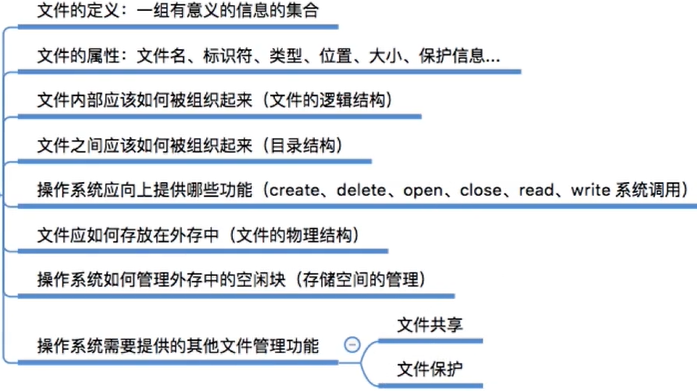

**文件**：文件就是一组有意义的信息/数据集合

**文件名**：同一目录下不能有重名文件

**标识符**：是操作系统用于区分文件的内部名称

**类型**：指明文件的类型

**位置**：文件存放的路径(用户使用)、在外存存放的地址(操作系统使用)

大小：文件大小

创建时间、上次修改时间

**保护信息**：对文件保护的访问控制信息

#### 文件的数据是如何组织的

**无结构文件**：由二进制或字符流组成，也叫**流式文件**

**有结构文件**：由一条条相似的记录构成，也叫做记录式文件

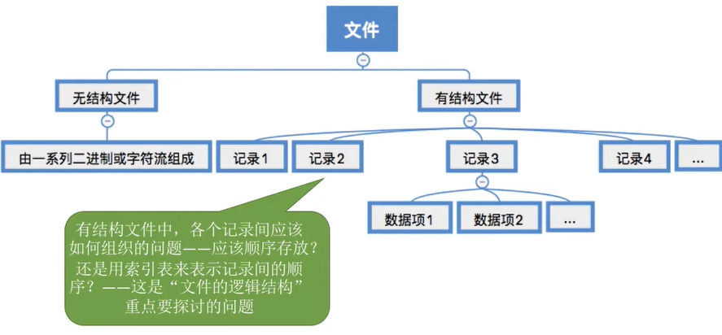

#### 文件之间是怎么组织的

树状的组织形式

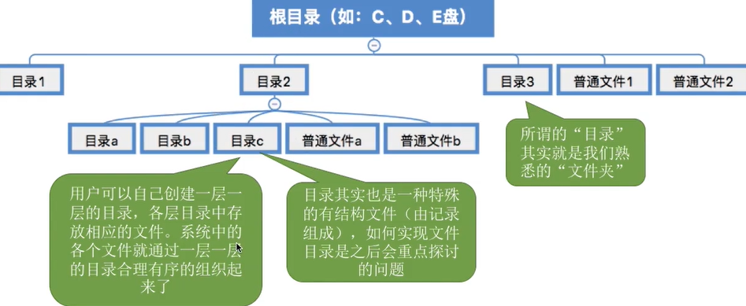

 

#### 操作系统向上提供的功能

可以创建文件(使用create系统调用)

可以读写文件(read和write系统调用)

可以删除文件(delete系统调用)

打开文件(open系统调用)

关闭文件(close系统调用)

更复杂的功能可以由以上基本功能组合实现

#### 文件应该如何存放在外存

与内存一样，**外存也是由存储单元组成**，每个存储单元对应一个物理地址

外存也被分为一个个的“**块/磁盘块/物理块**”，磁盘块的大小是相等的。

同样，**文件的逻辑地址**也可分为**(物理块号，块内地址)**，**操作系统**也需要把文件的**逻辑地址转换为外存的物理地址**的形式进行访问。**块内地址的位数取决于磁盘块的大小**

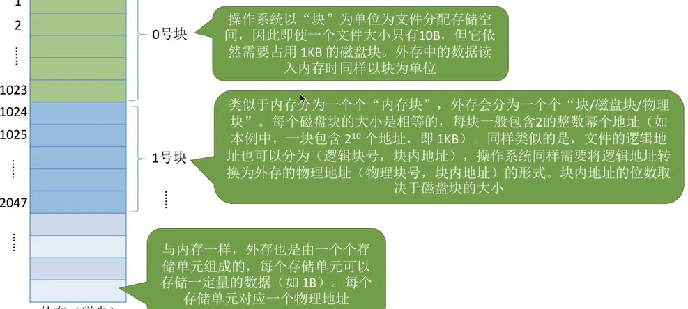

文件的磁盘块的组织也可以连续存放或者离散存放，同时由操作系统进行磁盘块的分配与回收

#### 其它操作系统要实现的功能

**文件共享**：多个用户可以实现共享文件

**文件保护**：保证不同用户对文件有不同的操作权限

### 文件的逻辑结构

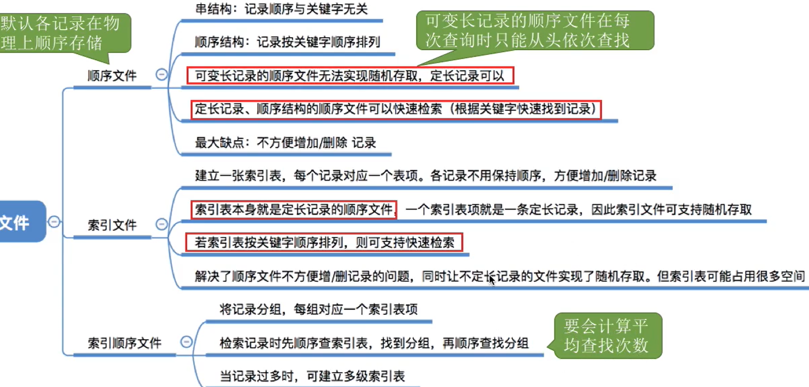

逻辑结构是在用户看来，数据是如何组织的。可以使用不同的物理结构实现

(如线性表是逻辑结构，可以由顺序表、链表等物理结构实现)

**无结构文件**：由二进制或字符流组成，也叫**流式文件**，由于它没有结构，这里不详细讨论

**下面均为有结构文件**

****

**有结构文件**：由一条条相似的记录构成，也叫做**记录式文件**。每条记录由若干数据项组成，如数据库表文件。一般来说，每条记录都有一个数据项可以作为**关键字**(也就是区别不同记录的ID)

根据记录的长度是否相等，分为**定长记录**和**可变长记录**两种

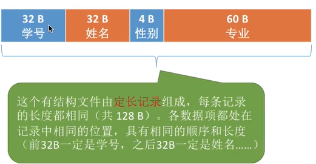       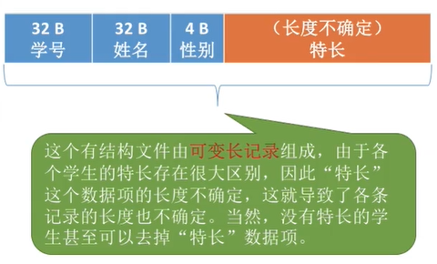

#### 顺序文件

 文件的记录在**逻辑上一个接一个**的排列，记录可以是**定长**的或者**可变长**的。在物理上可以用**顺序存储**或者**链式存储**

再根据记录是否根据**关键字的顺序排列**，又分为**串结构**和**顺序结构**

只有**顺序存储的定长记录**的顺序文件才可以**随机存取**

采用**顺序存储的定长记录的顺序结构**才可以快速找到某关键字的记录

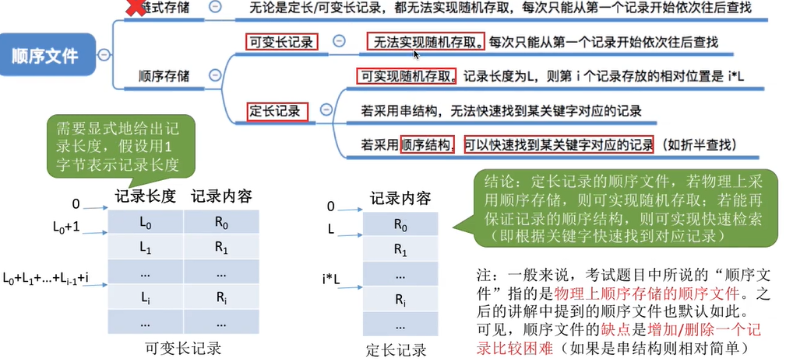

顺序文件的缺点是**增删记录比较困难**(但是使用串结构就更简单一些)

#### 索引文件

为了解决可变长记录的文件访问慢的问题，实现可变长记录文件的随机访问

每个文件建立一张索引表，每个表项对应一个记录

索引表的**表项需要连续**存放，但是**记录不需要**连续存放

> **索引表**本身是一个**定长记录的顺序文件**，因此可以快速找到第i个记录对应的索引项
>
> 可以把关键字作为索引号内容，按关键字排序，就可以实现按关键字的折半查找
>
> 此外，还可以使用不同的数据项建立多个索引表，同时指向这些记录
>
> 根据不同的检索需求，使用不同的索引表查询

每当增加/删除记录时，都要对索引表进行修改，由于索引文件有很快的检索速度，因此**主要用于对信息处理及时性高的场合**

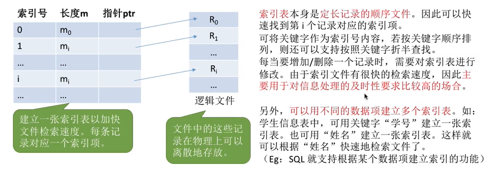

#### 索引顺序文件

由于索引文件一个记录只对应一个表项，所以索引表可能很大，甚至表项比记录还长，利用率较低

索引顺序文件是索引文件和顺序文件的结合。她同样会为文件建立一张索引表，但是其**一个表项对应一组记录**

##### 索引顺序文件检索效率分析

采用索引顺序文件后，会比单纯的索引文件查找次数低

但是若仍然很高，可以建立多级的索引顺序文件，查找次数会由乘法变为加法

### 文件目录

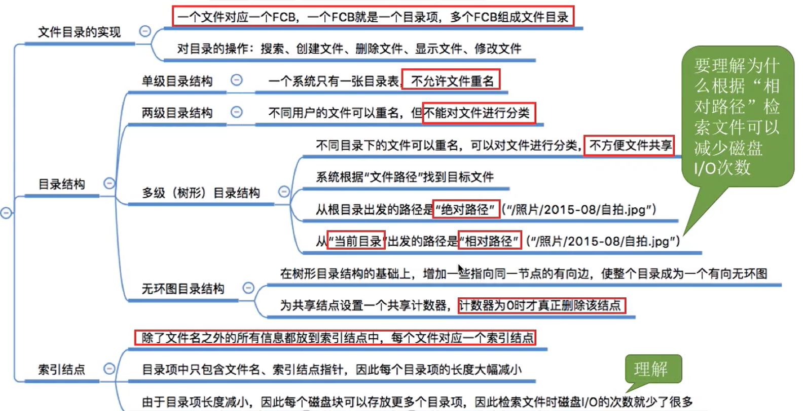

####  文件控制块

 **目录本身就是一种有结构的文件**，由许多记录组成，每条记录对应一个放在该目录下的文件。我们看到的一个个文件就是一条条记录

目录文件的**一条记录，就是一个文件控制块FCB**

FCB的有序集合称作**文件目录**，一个FCB就是一个文件目录项

##### FCB的内容

- 文件的基本信息

  > **文件名、物理地址**、逻辑结构、物理结构等

- 存取控制信息

  > 是否可读/可写、禁止访问的用户名单等

- 使用信息

  > 文件的建立时间、修改信息等

最重要的是：**文件名**和**文件存放的物理地址**。文件控制块**实现了文件名和文件之间的映射。**

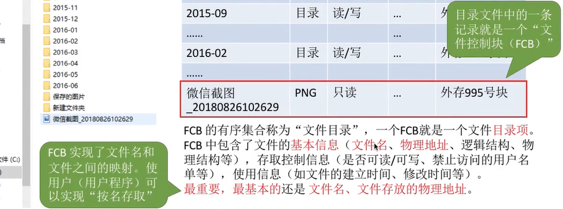

##### 目录需要的操作

- 搜索

  > 系统需要能根据文件名搜索目录，找到文件对应的目录项

- 创建文件

  > 创建一个新文件时，需要在其所属的目录中增加一个目录项

- 删除文件

  > 删除一个文件时，需要在目录中删除相应的目录项

- 显示目录

  > 用户可以请求显示当前目录的内容，如显示该目录的所有文件及其属性

- 修改目录

  > 当文件的属性发生变化时，需要修改相应的目录项

#### 单级目录结构

早期操作系统只建立一张目录表，每个文件占一个目录项

单级目录实现了**按名存取**，**但是不允许文件重名**

在创建文件时需要**检查是否重名**，不重名才能建立，把新文件对应的目录项插入到目录表中。

显然不适合多用户系统

#### 两级目录结构

分为主文件目录MFD，和用户文件目录UFD

- **主文件目录**：记录用户名和相应用户文件目录的存放位置
- **用户文件目录**：由用户的文件FCB组成

**所以不同用户的文件是允许重名的**，这是因为不同用户的文件目录存储位置不同

此外**还可以实现访问限制**

但是**用户不可以对自己的文件进行分类**

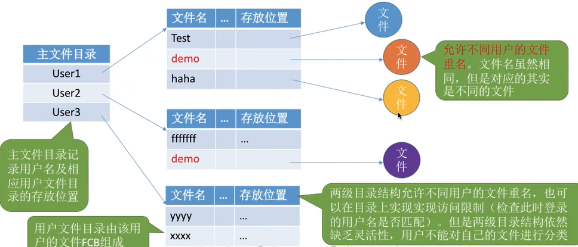

#### 多级目录结构

也叫**树形目录结构**，可以有很多级目录，**不同目录下**的文件**可以重名**

用户或进程要访问某个文件，需要**用文件路径名标识文件**。

根目录出发的路径叫做**绝对路径**

从当前目录出发的路径叫做**相对路径**

> 每读一次目录，需要一次磁盘I/O
>
> 当使用相对路径时，可以直接从当前页面的某个目录开始读
>
> 可以减少I/O的次数

树形目录结构可以**方便地**对文件进行**分类**，层次清晰，也能**有效的管理和保护**

但是**不便于实现文件的共享**

#### 无环图目录结构

为了便于文件共享，提出了无环图目录结构

在树形结构的基础上，**增加了一些指向同一节点的有向边**使整个目录成为一个**有向无环图**，更**方便用户共享文件**，甚至可以共享目录。

可以使用**不同的文件名指向同一个文件**

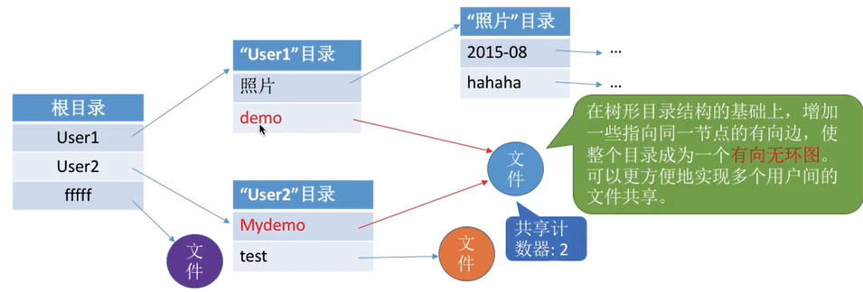

但是文件的删除会变复杂，只要还有用户使用，就保留，为每个共享节点设置一个**共享计数器**，用于记录此时有**多少地方在共享该节点**，**用户删除时，只删除该用户的PCB，使共享计数器减1**。只有共享文件计数器**为0时，才删除**。

> 注意**共享文件不是复制文件**，它们在外存存储与同一个位置，用户1对其修改，用户2也能看到。在这种方式里，可以把FCB认为是指针

#### 索引结点

由于在**查找**各级目录时，**只需要匹配文件名**即可

所以可以把其它的**信息放到专用的索引节点**中，在**目录中只保留文件名**和指向索引节点的**指针**(索引节点号)，也叫做文件描述符

索引节点简称inode

这样就可以**减小各级目录的长度**

这样一次从外存中读出的目录项数就会变多，总体上可以**减少I/O，提高效率**

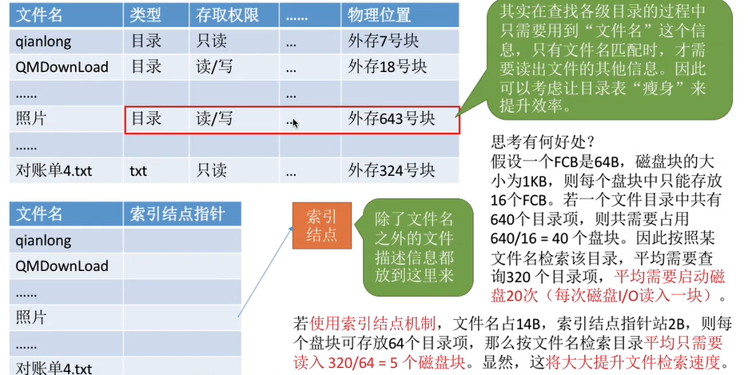

**找到对应目录项**后，才需要**把索引节点**从外存**调入到内存**，然后访问索引节点，**找到存放位置**，从外存中**读出目标文件**

> 在外存的索引节点称为**磁盘索引节点**，调入到内存后称为**内存索引节点**
>
> **内存索引节点需要多添加一些信息**，比如文件是否被修改，有几个进程郑州访问等

### 文件的物理结构

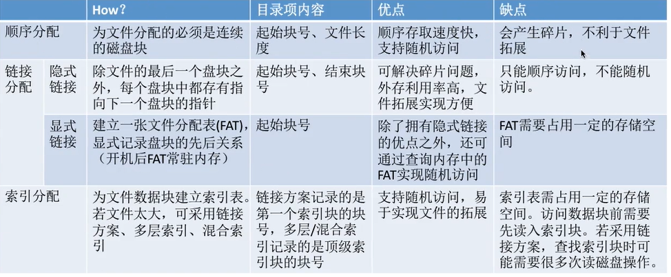

也叫做文件分配方式，就是文件的数据应该怎样存放在外存中

主要是关于操作系统对非空闲磁盘块进行的管理

#### 文件块、磁盘块

类似于内存分页，磁盘中的存储单元也会被分为一个个的“块/磁盘块/物理块”，在大部分操作系统中，**磁盘块的大小与内存块、页面的大小相同**

**内存与磁盘的数据交换(**读写操作、磁盘I/O)是**以磁盘块为单位**进行的

在内存管理中，逻辑地址空间被分为一个个页面，在外存管理中，为了方便对文件数据的管理，**文件的逻辑地址空间也被分为了一个一个的文件块**

文件的逻辑地址也可以表示为**(逻辑块号，块内地址)**

操作系统为文件**分配存储空间**也是**以块为单位**进行的

用户是使用逻辑块号来操作自己的文件，**操作系统**负责实现**逻辑地址到虚拟地址的转换**

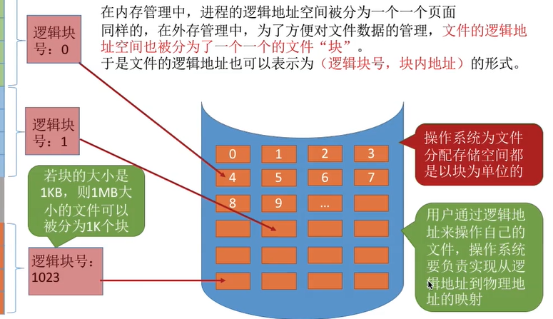

#### 连续分配方式

要求每个文件**在磁盘上占据连续的块**

为了实现逻辑地址到物理地址的转换，需要在文件目录中，给每个**表项添加起始块号和长度**(占几个块)

##### 转换过程

用户给出逻辑块号，操作系统访问FCB，找到起始块号和长度

则**物理块号=起始块号+逻辑块号**

长度，是为了验证用户所给的逻辑块号是否合法

> 当逻辑块号**>=**长度时，就不合法

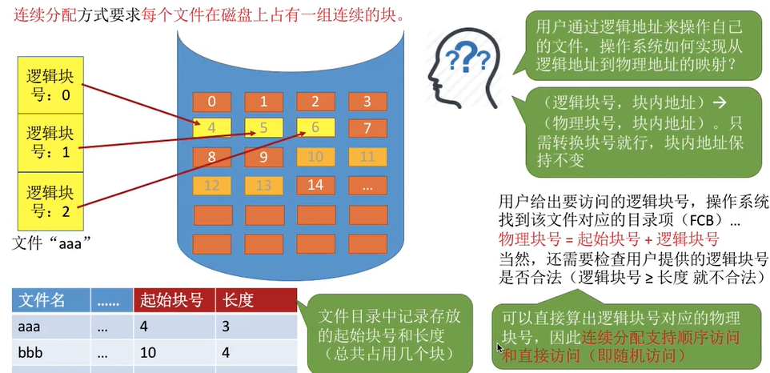

##### 特点

因为物理块号可以根据逻辑块号直接算出，所以说**连续分配支持顺序访问和直接访问(随机访问)**

由于连续分配数据连续，所以磁头移动距离短，所以说

**连续分配的文件在顺序读/写时速度最快**

****

**拓展困难**、

**空间利用率低，产生磁盘碎片**，可以用紧凑解决，但是开销大

#### **链接分配方式**

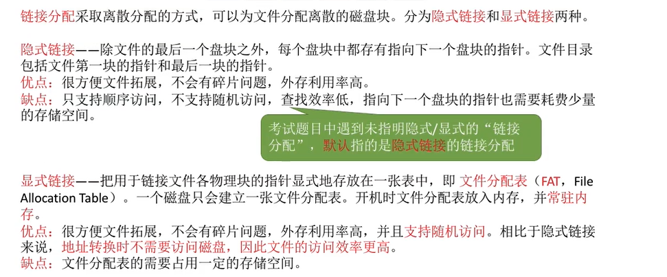

可以为文件分配**离散**的磁盘块。分为**隐式链接**和**显示链接**两种

##### 隐式链接

在目录项中添加**起始块号**和**结束块号**

除了文件的最后一个磁盘块，每个磁盘块中的结束位置都存有一个**指向下一个盘块的指针**，这些指针对用户是透明的

**访问i号块**，需要从第一个块遍历到第i块，也就是需要**访问i+1次磁盘**

所以说链式分配，**只支持顺序访问，不支持随机访问**，查找效率低。此外还会多耗费少量空间

****

便于拓展空间，不会产生碎片

##### 显式链接

用于链接文件各物理块的指针，显式地存放到一张表中，即：**文件分配表FAT**

假设有n个物理块，FAT中就会存储n个表项

每个表项记录它对应的文件，的下一个链接的物理块号，如果它是最后一个了，那就置为-1

目录中只需要添加一个起始块号

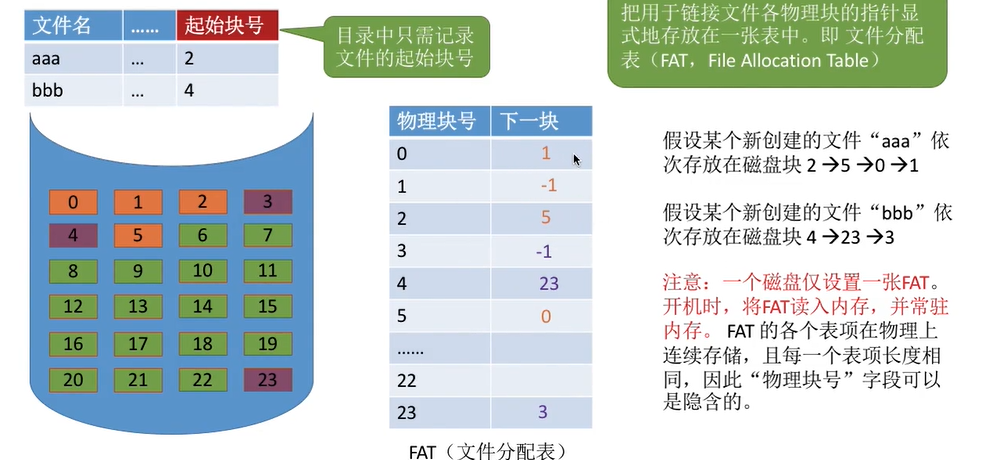

> **一个磁盘仅设置一个FAT**，**开机时FAT读入内存**，并且**常驻内存**。
>
> 由于FAT表项长度是相同的，所以物理块号可以隐含

实现逻辑块号到物理块号的转换：

先文件名在目录中找到这个文件在FAT的起始块号，想找逻辑块号i，则先根据起始块号，查询内存中的文件分配表，然后依次查询i次，FAT里的值就是逻辑地址i的物理地址。

> 若i为0，则起始块号就是它的物理块号
>
> 若i为1，则起始块号里存的数就是它的物理块号，也就是只查i次，但是其实是第i+1个块

注意**逻辑块号转换为物理块号**的过程是**在内存中**实现的，**不需要读磁盘**

**结论：**采用**链式分配**(显式链接)方式的文件，**支持顺序访问，也支持随机访问**(支持随机访问是指，不需要一个一个的遍历全部，就能找到，或者说查找的序列会受内部的数据影响，就叫随机访问)

由于显示连接方式**转换地址**过程中，**不需要访问磁盘**，所以**速度快很多**

显示链接也**不会产生外部碎片**，也可以**方便地对文件进行拓展**

#### 索引分配

> 根据多层索引、混合索引结构，算出文件最大长度
>
> 分析访问某数据库的I/O次数

索引分配允许文件离散地分配在各个盘中，系统会**为每个文件建立一张索引表**，索引表中**记录了文件的各个逻辑块对应的物理块**

> 索引表的功能类似于内存管理中的页表，用于建立逻辑块到物理块的映射关系

索引表存放的磁盘块称为**索引块**。文件数据存放的磁盘块称为**数据块**

文件目录中每个表项都要添加**索引块**条目，其中的是该文件索引表存储的磁**盘块号**

**索引表中存储**的是每个**逻辑块号对应的磁盘块号**，由于表项大小固定，索引逻辑块号可以省略

> **每个文件都有一张索引表**

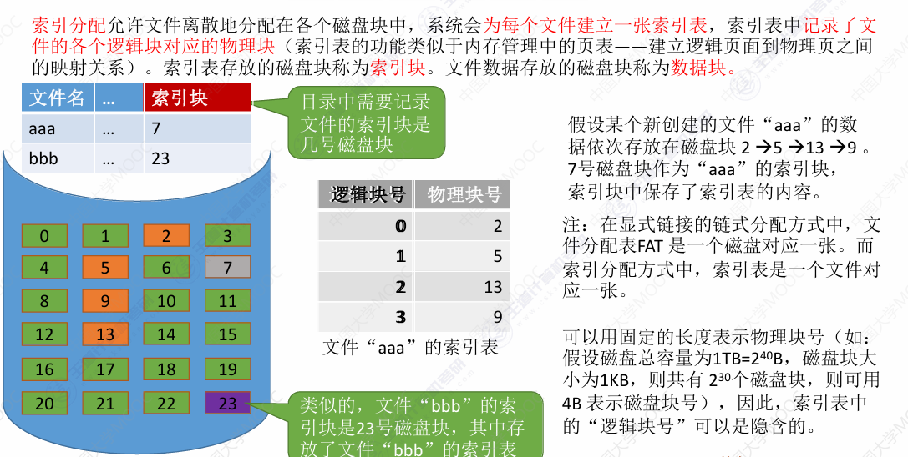

##### 逻辑块号到物理块号的转变

用户给出逻辑块号i，操作系统先查找目录，找到该文件的目录项FCB，找到其对应是索引块，访外存，读出这个磁盘块，取出索引表，对应到逻辑块号，就找到了对应的物理块号。

> 由于得到索引表后，可以直接找到逻辑块号那个表项，所以它**支持随机访问**，易于实现文件拓展
>
> 索引表需要占据物理空间

****

**一个磁盘块装不下整个索引表时**，需要采取以下方法来拓展索引表空间

##### 链接方案

**把多个索引块链接起来存放**，每个索引块最后添加一个指向下一个索引表的指针

访问后面的索引块时，必须依次读入前面所有的索引块

**当文件太大时，索引表会很大**，链接方案会进行成百上千次的I/O操作，显然**很低效**。

##### 多层索引

建立多层索引(**类似于多级页表**)，使第一层索引块指向第二层索引块，甚至更多级索引

**在FCB中，只需要存储其最高级的索引表的块号**就可以了

> 采用多层索引，**各层索引表的大小不能超过一个磁盘块**，可以据此计算出该系统的文件的最大长度

****

如何实现逻辑块号到物理块号的转变：

先根据FCB读出该文件一级索引表的物理块号

然后，由于知道一个索引表有多少表项，那么根据逻辑块号，就可以知道这个块号在第几个二级索引表，同时在这个二级索引表的第几项

> 假设逻辑块号为n，一个磁盘块能装m个表项
>
> 则n/m是一级索引表的序号，n%m是在这个二级页表的第几项

然后就能找到这个二级索引表项，并读出物理块号

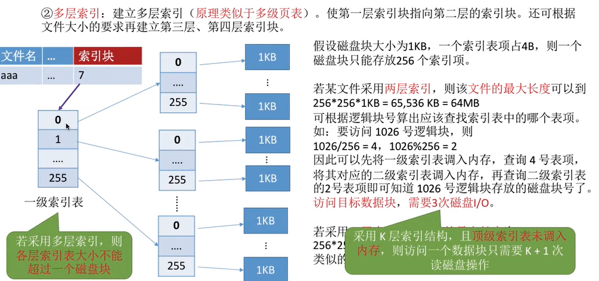

> 若是两层索引，进行3次磁盘I/O操作，三层就4次

但是就算文件很小时，也需要多次读磁盘，会损耗性能

##### 混合索引

混合索引把多种索引方式进行**结合**，既包含**直接地址索引**(直接指向数据块)，又包含**一级间接索引**(指向单层索引表)，还有**二级间接索引**

> 二级间接索引指向的也是一个索引表，这里面的索引表每个表项指向一个索引表。也就是说，这最高级的一个表项，指向了一个二级索引表

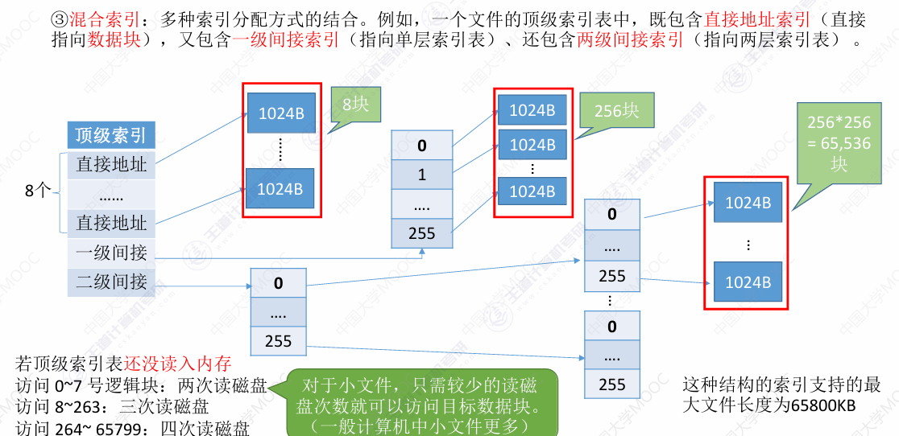

对于**小文件**，**访问磁盘**的次数会比单纯的多层索引要**减少**

### 逻辑结构与物理结构的区分

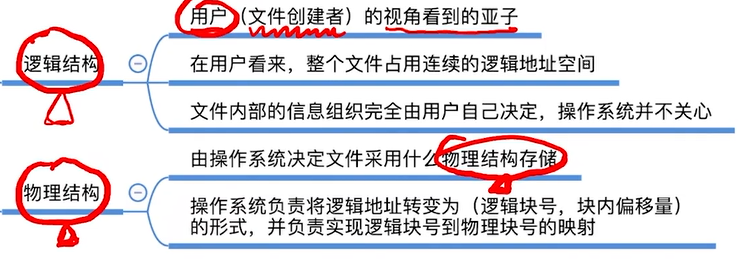

逻辑结构是给用户看的

> 其中的地址**均为逻辑地址**，存储的结构，也是指查询下一个逻辑地址的方式

物理结构是操作系统把数据存放的实际物理结构

> 通过FCB把文件要查找的**逻辑地址转换为物理地址**的方式

物理结构的实现与逻辑结构没有必然关系，逻辑上是顺序文件，在物理上仍可能采用链接、索引方式分配

逻辑结构的分类是在用户使用时的情况，用户是否觉得它是顺序文件，也就是给出下标是否能直接访问，还是只能一个一个在结构体后面找指针

> 物理结构对用户是透明的

### 文件存储空间管理

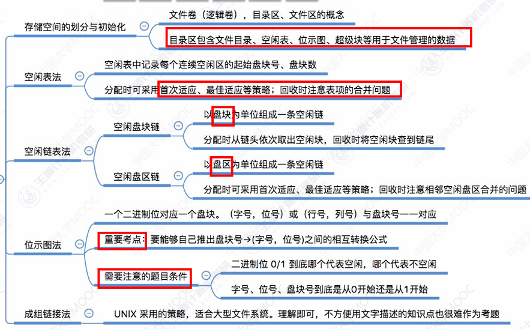

也就是**对空闲磁盘块的管理**

#### 存储空间的划分与初始化

每个磁盘分区就是文件卷，也就是将**物理磁盘划分**为一个个**文件卷**(逻辑卷、逻辑盘)

对每个文件再进行划分，划分为**目录区**和**文件区**

目录区中主要是**文件的目录信息**(FCB)和用于**磁盘存储空间的管理信息**

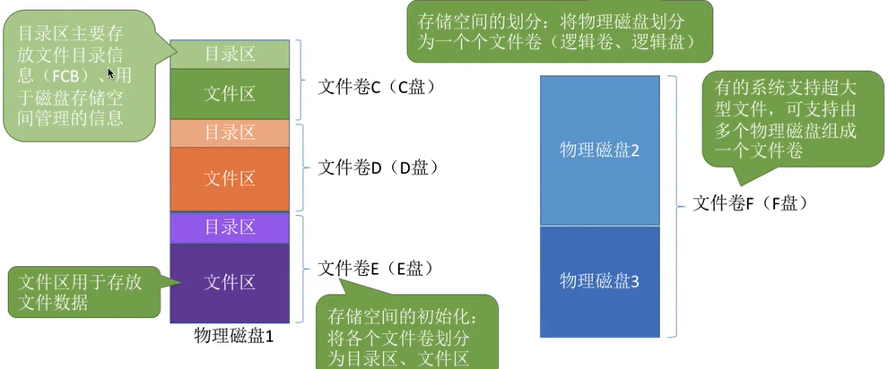

****

下面是存储空间管理的方法：

#### 空闲表法

> 适用于**连续分配方式**

建立一个空闲盘块表，每个表项写明某个空闲分区的**第一个盘块号**，以及这个空闲分区的**盘块数**

类似与内存连续分配中的的动态分区方式中的空闲分区表

**分配算法**也类似，包括：**首次适应、最佳适应、最坏适应**等，来决定如何分配

**回收磁盘块**也类似：注意**分区合并**

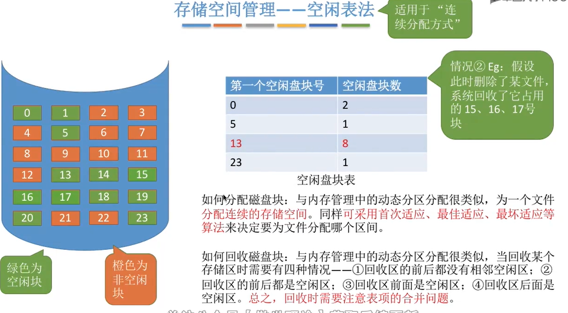

#### 空闲链表法

##### **空闲盘块链**

每个**空闲盘块作为一个单位**，盘块后面有指针，指向下一个空闲盘块

操作系统中保存着**链头、链尾指针**

**分配**：文件申请K个盘块，就从链头开始依次摘下K个盘块分配，并且修改操作系统中空闲链的链头指针

**回收**：回收的盘块依次挂到链尾，并且修改操作系统中空闲链表的链尾指针

> 适用于离散分配的物理结构。为文件进行分配和回收时需要重复多次操作

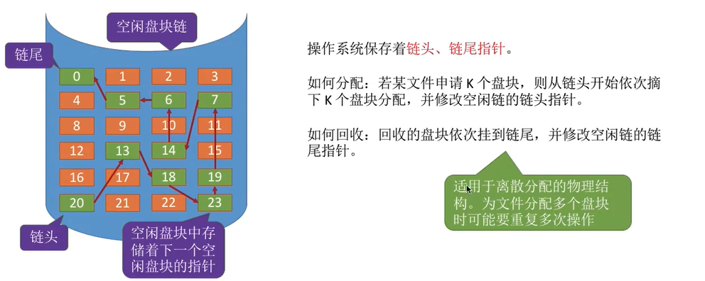

##### **空闲盘区链**

**连续的一组空闲盘块**作为一个单位**，每个盘区**第一个盘块**中，记录整个盘区的**长度**和下一个盘区的**指针

操作系统依然保存着**链头和链尾的指针**

**分配**：若分配K个块，先按照首次适应、最佳适应等算法，找到符合要求的空闲盘区区，直接分配连续的K个块，修改该盘区。

若没有单个合适的盘区，则可以把不同盘区的盘块都分给这个文件，分配后除了要改盘区，还有修改链指针

**回收**：若回收区与某个空闲盘区**相邻**，则需要将回收区**合并**到空闲盘区中，若和其它盘区**都不相邻**，将回收区作为**单独的一个空闲盘区挂到链尾**。

> 离散分配、连续分配都适用，为一个文件分配多个盘块时效率更高

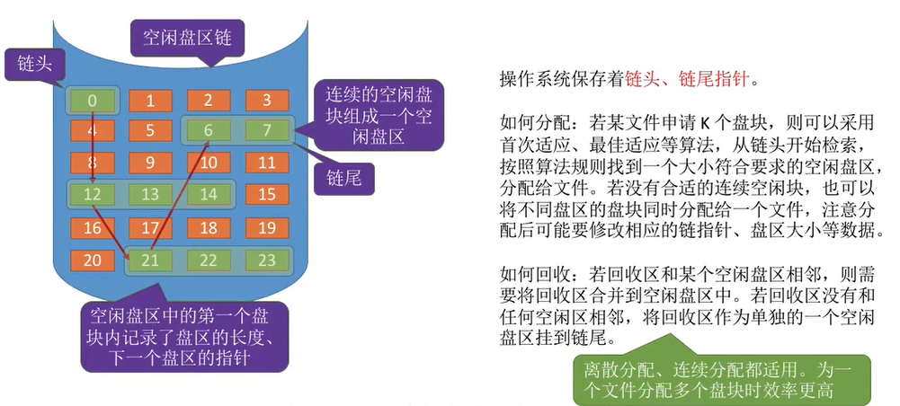

#### 位示图法

 每个二进制位代表一个盘块。在存储位示图的空间中，分为字号和位号

如果把一个字看作一行，那就可以看成是二维数组，行号就是字号，列号就是位号

从开头数第i个bit的值就代表了第i个盘块的空闲或者非空闲

> 每道题目中，字号、行号，可能从0开始也可能从1开始
>
> 每个bit中，可能是0代表空闲，也可能可能1代表空闲
>
> 需要根据要求计算

下图均为从0开始的公式

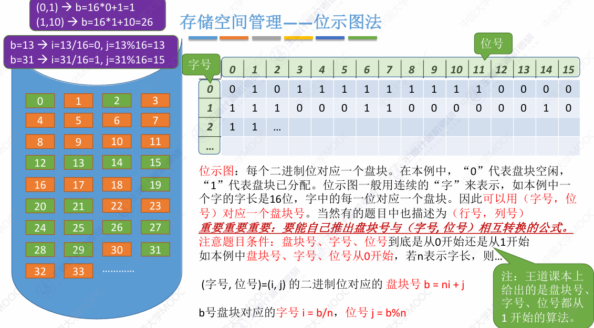

**以下假设0代表空闲状态**

##### 分配

若文件需要K个块

则顺序扫描位示图，找到相邻或者不相邻的K个0

然后根据这些0的字号和位号，算出对应的盘块号，把对应的盘块分配给文件

把相应位设置为1

##### 回收

根据回收的盘块号，计算出对应的字号、位号

再将对应的二进制位设为0

> 连续分配和离散分配都适用，若是连续分配，则必须选取K个连续的盘块

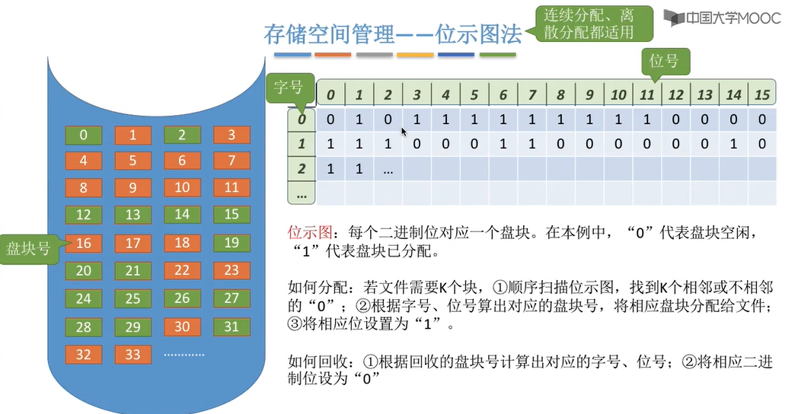

#### 成组链接法

对于大型系统来说，空闲表、空闲链表、位示图可能会占据很大的空间

首先，在文件卷的目录区，专门用一个块作为**超级块**，当系统启动时，需要将超级块读入内存，并且保证内存与外存的超级块数据一致

这个超级块中，首先是一个N，表示它当前保存的空闲块个数，然后是索引0，指向的是下一个当作索引的盘块，这个盘块与超级块结构相同，也是只存索引，不能分配

超级块中其它的索引1-99，直接存储的就是空闲盘块号，可以直接分配

> 每个盘块能保存的最多的盘块数量是固定的，一般为100

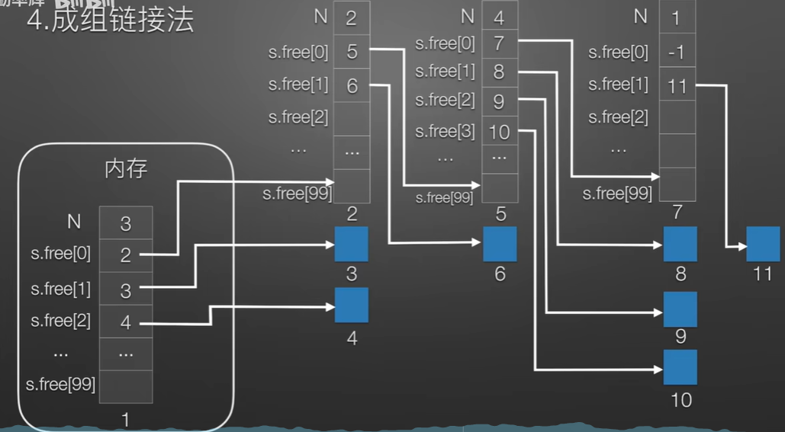

最后一层的索引盘块，由于它后续没有盘块的，所以其索引0存储的为-1

> 注意上图并不准确，**除了超级块外，其它所有索引块必须是满的**
>
> 可根据回收方式来理解

##### 分配

当分配K个块时

若超级块的**N大于等于K**，直接把下面的盘块**分配**给文件即可

当**N小于K时**，**先把能分配的分配**给文件，然后**读取0号索引**，**把对应的块读到内存中的超级块中，再继续分配**

> 刚把对应块读入超级块后，下一个分配的是原先的那个索引，然后再分超级块

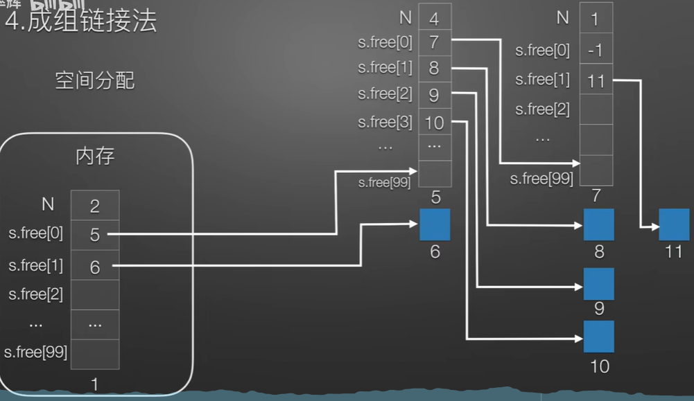

##### 回收

假如多了一个空闲磁盘块i

若超级块**未满**，则直接在超级块**下一个索引写入i**(也就是空闲磁盘块的块号)

若超级块**已满**，则把当前**超级块的所有指针写入这个空闲磁盘块**(说是指针，其实只是空闲块号)，然后把超级块的0号索引指向这个磁盘块i(s.free[0] = i，也就是把i写到索引0)

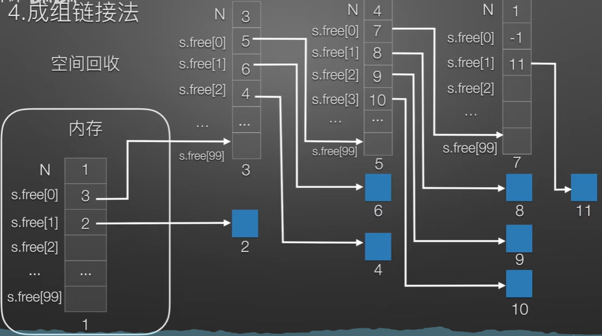

> 注意各个操作后要更新N

### 文件的基本操作

> 文件描述符是打开文件表的索引，也可以认为是一个指向该文件的指针
>
> 打开文件时，并没有把文件读入内存，而只是把文件的目录项放入了内存中的打开文件表

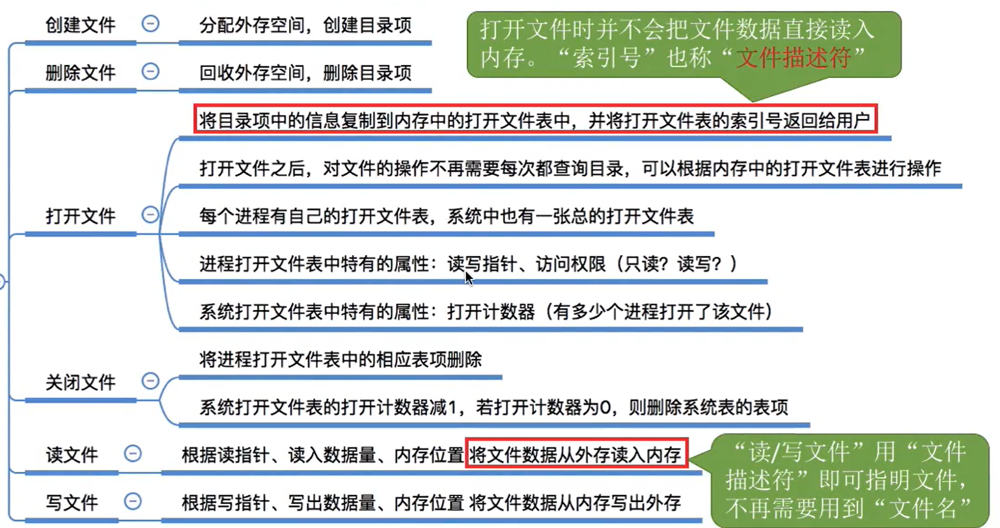

#### 创建文件

使用**Create系统调用**创建文件

**需要提供的参数**：

1.  文件所需的外存空间大小
2. 文件存放路径
3. 文件名

**操作系统做的操作**：

1. 在外存中**找到**文件所需的**空间**(空闲表、空闲链表、位示图、成组链接法等)
2. 根据文件存放路径，找到**该目录对应的目录文件**，在目录中**创建**该文件对应的**目录项**。目录项中包含了文件名、文件在外存中的存放位置信息等

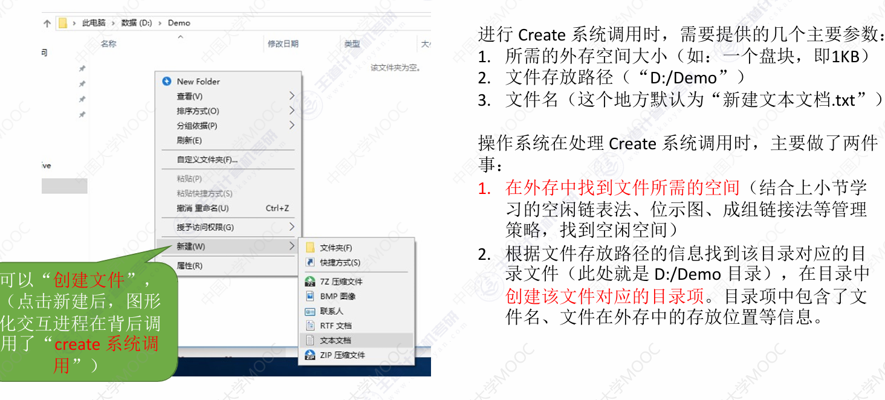

#### 删除文件

使用**Delete系统调用**删除文件

**需要提供的参数**：

1. **文件存放路径**
2. **文件名**

**操作系统的操作**：

1. 根据文件路径**找到对应的目录文件**。从而找到该文件的**目录项**
2. **根据目录项记录**的文件在外存中的**存放位置、文件大小**等信息，**回收**文件占用的**磁盘块**(空闲表法、空闲链表法、位示图法、成组链接法等策略不同，回收方式也不同)
3. 从目录表中**删除该目录项**

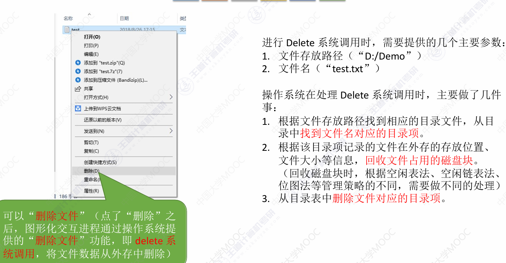

#### 打开文件

使用**Open系统调用**

**需要的参数**：

1. 文件存放路径
2. 文件名
3. 文件的操作类型(如只读r，只写w，读写rw)

**操作系统的操作**：

1. 先根据文件路径找到目录表，再根据文件名**找到目录项**，并且**检查该用户是否有操作权限**

   > 若用户没有这个操作权限，则拒绝打开

2. 把**目录项复制到内存中的“打开文件表”**中。并且将其**在打开文件表中的编号返回给用户**。之后用户使用这个编号指明要操作的文件

   > 这样之后就不需要再每次都查目录了，可以提高文件访问速度
   >
   > 这个编号也叫做**文件描述符**

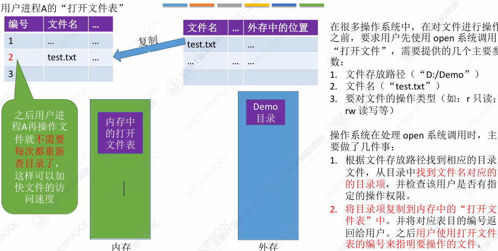

打开文件表有两种

**系统的打开文件表**：只有一张，包含现在整个系统中所有被打开的文件的，包含一个计数器属性，用于显示它被多少文件打开了，当大于0时，不能被删除

> 系统打开文件表中会存储目录项
>
> 而进程打开文件表中不会存储目录项，而是会存储系统打开文件表的索引，也就是文件描述符

**进程的打开文件表**：每个进程都有一个，显示当前进程已打开的文件，包含读写指针(当前读到的位置)、访问权限、索引号等属性

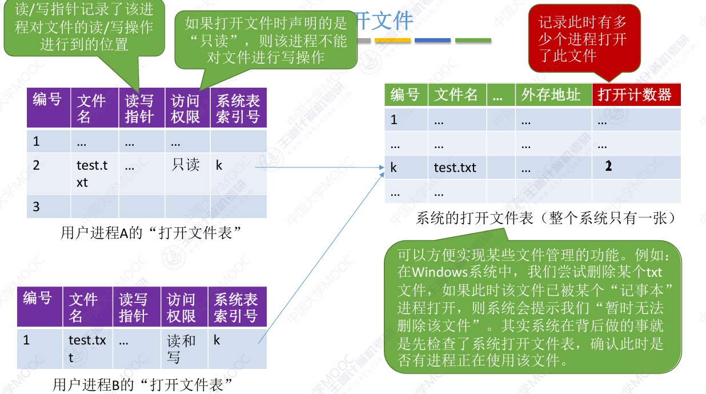

#### 关闭文件

当进程需要关闭文件时，需要调用**Close系统调用**

**操作系统的操作**：

1. 将该进程的打开文件表相应表项删除
2. 回收分配给该文件的内存资源
3. 系统打开文件表的打开计数器减1，若count=0，则删除对应表项

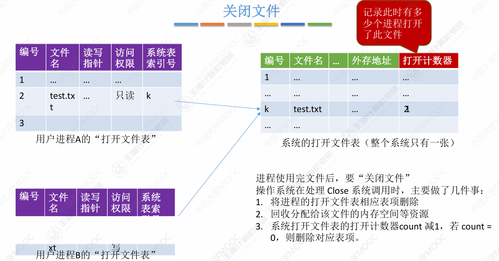

#### 读文件

使用**Read系统调用**

**需要的参数**：

1. 指明哪个文件

   > 在支持打开文件的系统中，只需要提高文件在打开文件表中的索引号即可

2. 指明读入多少数据

3. 指明读入的数据要放在内存的什么位置

**操作系统的操作**：

操作系统从读指针指向的外存中，将用户指定大小的数据读入用户指定的内存区域中

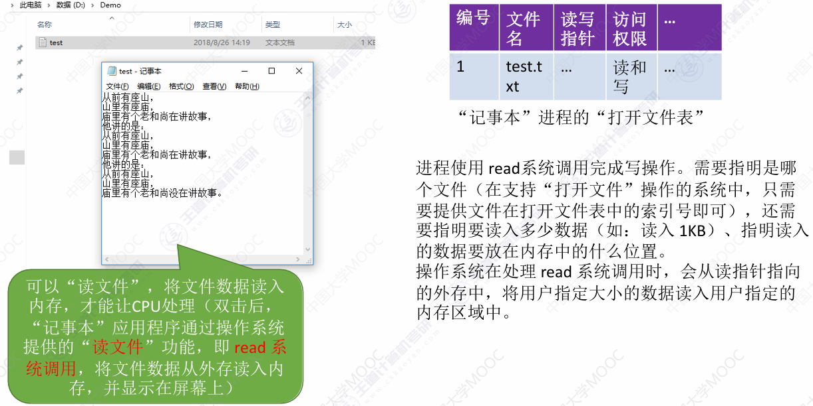

#### 写文件

使用**Write系统调用**

**需要的参数**：

1. 指明写入的文件

   > 也可以使用打开文件表的索引号

2. 写入多少数据

3. 写回外存的数据放在内存的什么位置

**操作系统的操作**：

操作系统从用户指定的内存区域中，将指定大小的数据写回回写指针指向的外存

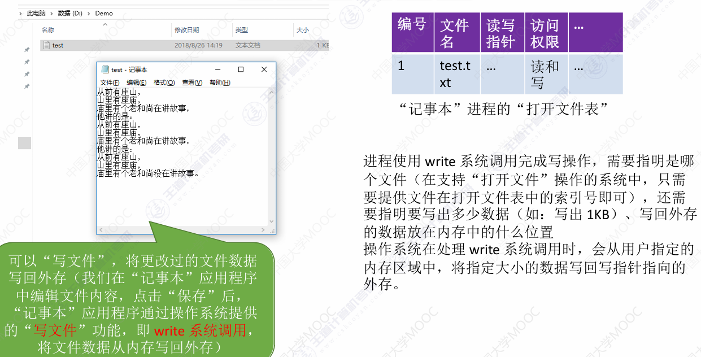

### 文件共享

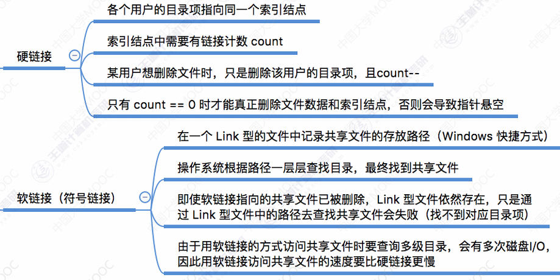

操作系统需要为用户提供文件共享功能，让用户共享地使用同一个文件

注意共享与复制的区别

#### 基于索引节点的共享方式(硬链接)

**索引节点**：把目录中，除了文件名之外的信息都放到索引节点中。这样目录项就只需要文件名和索引节点指针了

与文件的无环图目录结构也很相似

在索引节点中，添加一个链接计数器count，用于表示当前链接到本索引上的用户目录数

count的值就代表有多少个目录指向该索引节点，也就是指向该文件

当用户删除文件时，不会直接删除文件数据，而是先让对应的**count值减1**，然后把用户目录上对应的目录项删除

只有count值为0时，才会删除该文件

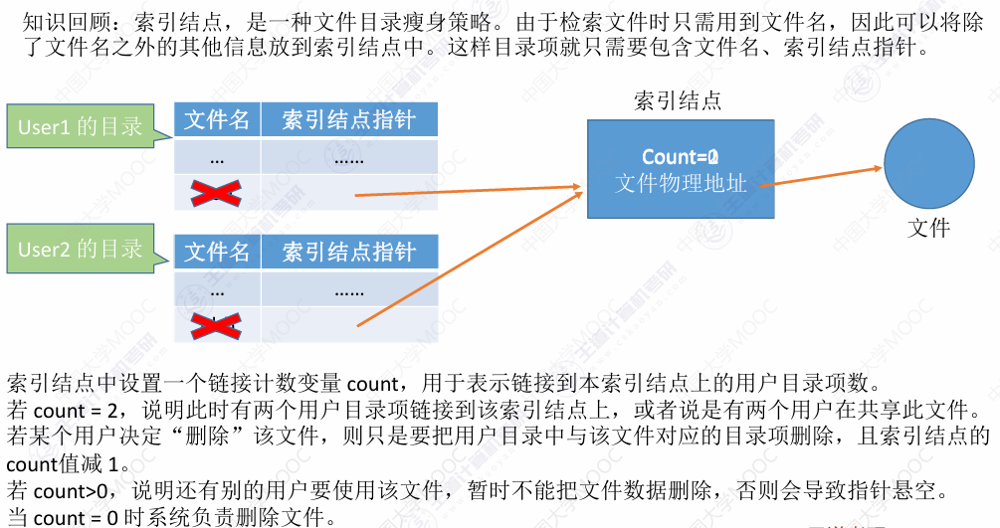

#### 基于符号链的共享方式(软链接)

> **软链接不改变文件的引用计数**
>
> 甚至软链接其实是尝试调用对应文件的指针，本身并不含有指针
>
> 但是本进程的打开文件表中会有读写指针，这个**读写指针与其它进程无关**

为了实现共享文件，会**创建一个新的Link类型的文件**，这个文件中**存储**了要共享访问的**文件的存放路径**

把这个Link文件加入到该用户的目录表中，然后想访问时，就可以根据目录表，找到Link文件，从而找到希望访问的目标文件了

> 软链接可能会失效
>
> 当要访问的文件已经被删除或移动位置，再去访问就会失效
>
> 查询目录次数多，速度慢

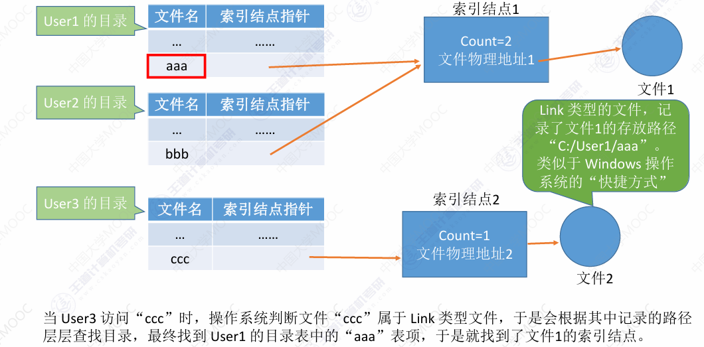

### 文件保护

> 文件的访问控制，常由用户的访问权限和属性控制
>
> 存取控制矩阵方法，用于多用户之间的存取权限保护

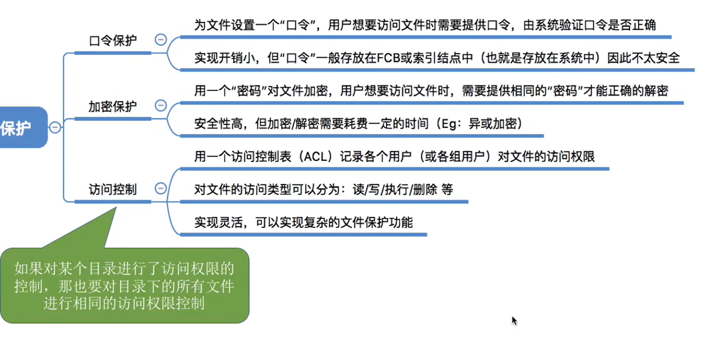

#### 口令保护

为文件设置一个口令，请求访问该文件时，需要操作系统检验口令

> 口令存在于FCB中，**口令开销小，验证速度块**
>
> 但是正确口令在系统内部，**不够安全**

#### 加密保护

使用密码对文件进行加密，访问文件时需要提供密码才能解密

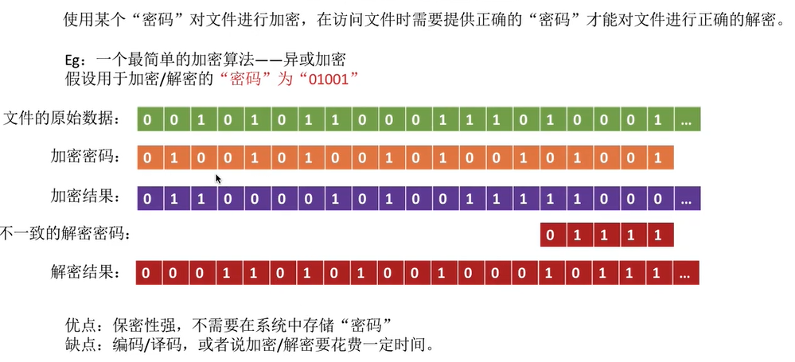

> 保密性强，系统中不会存储密码
>
> 需要加密解密，时间开销大

#### 访问控制

在每个文件的FCB(或者索引节点)中添加一个**访问控制列表**(ACL)，该表中记录各个用户可以对该文件执行哪些操作

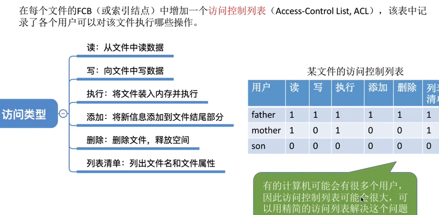

文件的访问控制，常由用户的访问权限和属性控制

存取控制矩阵方法，用于多用户之间的存取权限保护

##### 精简的访问控制表

以"组"为单位，标记各个组的用户对文件能执行的操作

访问文件时，只用检查该用户所属组的权限，就可以判断是否可以进行操作了

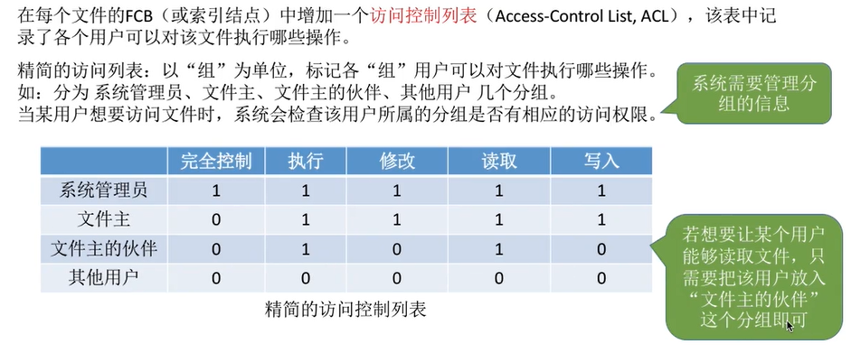

## 文件系统

### 文件系统的层次结构

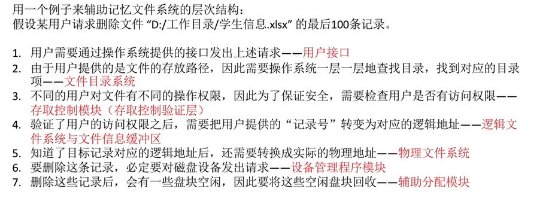

**用户接口层**：文件系统需要向上层用户提供简单的功能接口，也就是用于处理用户发出的系统调用(Read\Open等)

**文件目录系统**：用户通过文件路径来访问文件，这一层需要根据用户给出的文件路径找到对应的FCB或者索引节点。所有与目录、目录项相关的工作都在本层

**存取控制模块**：完成文件保护相关工作

**逻辑文件系统与文件信息缓冲区**：用户指明想要访问的文件记录号，本层把记录号转换为逻辑地址

**物理文件系统**：把逻辑地址转换为物理地址

**辅助分配模块**：负责文件存储空间的管理，负责分配和回收存储空间

**设备管理模块**：直接与硬件交互，负责和硬件相关的管理工作，包括分配设备，磁盘调度等

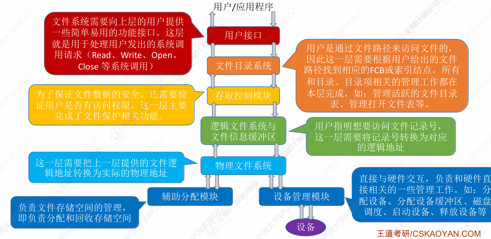

### 文件系统的全局结构

#### 文件系统在外存中的结构

##### 物理格式化

也就是低级格式化，划分扇区，检测坏扇区，并且使用备用扇区替换坏扇区

> 坏扇区对操作系统是透明的，会由硬件来处理

##### 逻辑格式化

也就是高级格式化

对磁盘进行分区，也叫做卷，完成各分区的文件系统初始化

首先在整个磁盘中会先分出一块主引导记录MBR，存储分区情况等数据

然后每个卷中，都会有一部分管理所用的数据

1. 引导块：用于找到并激活启动器用到
2. 超级块：用于分配回收空闲磁盘块
3. 空闲空间管理：存储空间管理的数据结构，如位示图
4. i节点区：连续存放索引节点，每个索引大小相同，可以快速按下标访问
5. 根目录：是整个卷的根目录，卷中其它所有的文件都会从这里开始建立

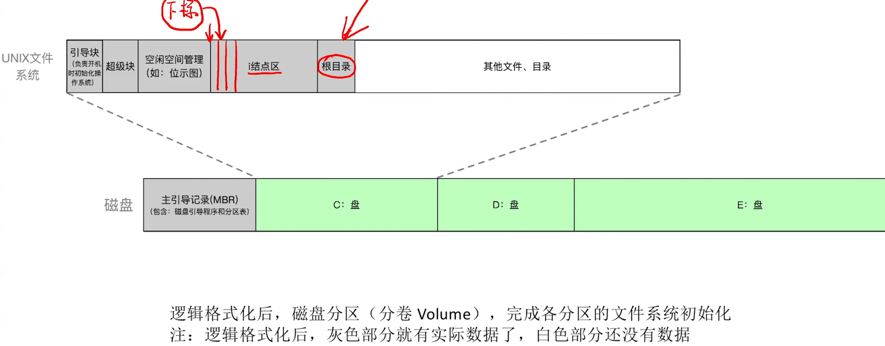

#### 文件系统在内存中的结构

在内存中分为用户区和内核区

##### 内核区

1. **目录的缓存**：近期访问过的目录文件会暂存在内存中，不会每次都从外存读入
2. **系统打开文件表**：整个系统只有一张，存储当前整个系统打开的全部文件
3. **进程(用户)打开文件表**：每个进程都有一张，记录自己打开的文件

> 打开文件Open系统调用的过程
>
> 系统会先读入目录
>
> 然后找到目标文件的FCB，复制到系统打开文件表
>
> 然后再进程打开文件表中新建一个条目，并且返回给用户文件描述符，也记录在自己的进程打开文件表中

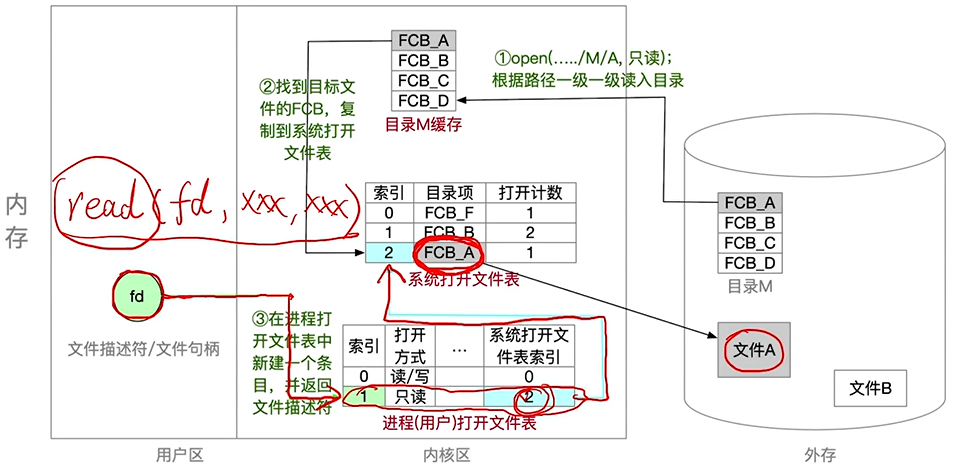

##### 用户区

关于打开文件的部分，主要存储的就是文件描述符，其实就是指向文件的指针
