# 计算机系统概述

计算机系统=硬件+软件

## 计算机系统层次结构

### 计算机硬件

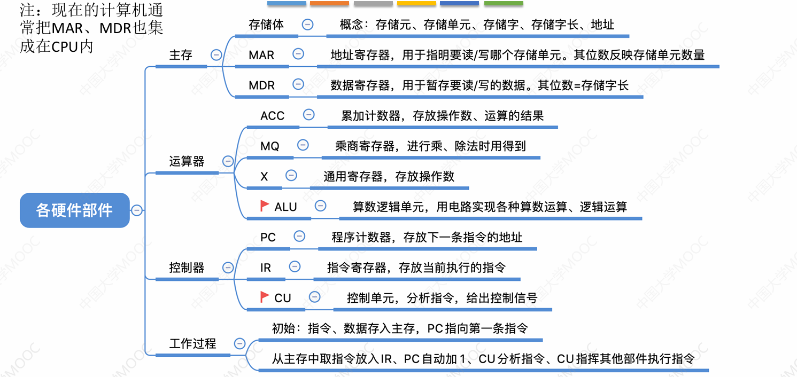

#### 计算机硬件的基本组成

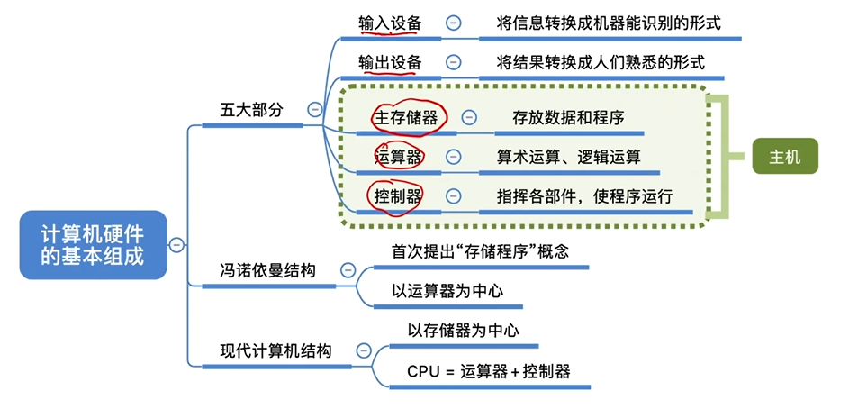

##### 冯诺依曼机

其工作的基本方式是**控制流驱动方式**：按照指令的执行序列，依次读取指令，然后根据指令所含的控制信息，调用数据信息进行处理，在执行过程中，始终以控制信息流为驱动工作的因素。

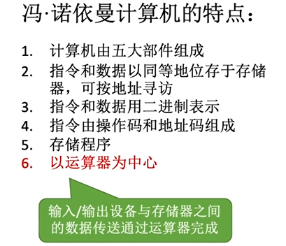

1. 采用存储程序的工作方式

   > **存储程序**：**指将指令以二进制代码的形式事先输入计算机的主存储器**，然后按其在存储器的首地址执行程序的第一条指令，然后就按该程序的规定顺序执行其它指令，直到执行结束

2. 计算机硬件系统由运算器、存储器、控制器、输入输出设备5大部件组成

   > 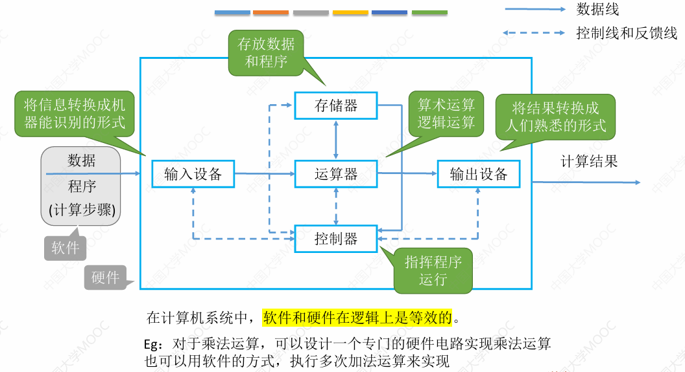
   >
   > 在计算机系统中，软件和硬件在逻辑上是等价的

3. 指令和数据以同等地位存于存储器，可按地址访问

4. 指令和数据都用二进制表示

5. 指令由操作码和地址码组成

6. **以运算器为中心**

   

##### 现代计算机结构

现代计算机采用以**存储器**为中心的结构，能减少运算器的占用时间，提高效率

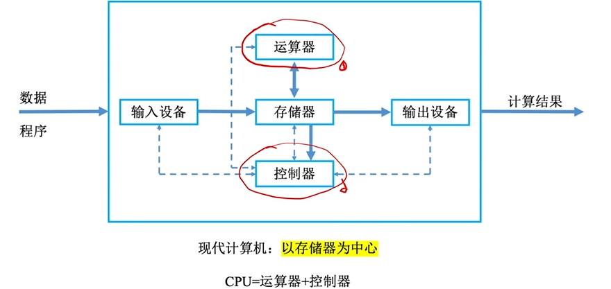

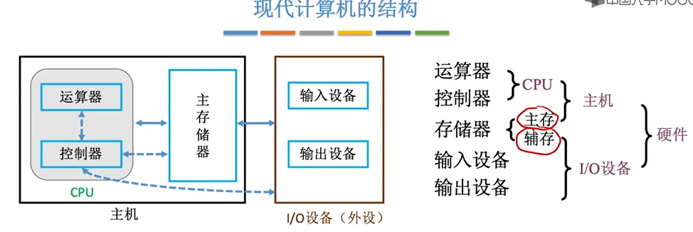

注意，主机只包含主存，而辅存属于IO设备

#### 主存储器的基本组成

主存储器包括三个部分

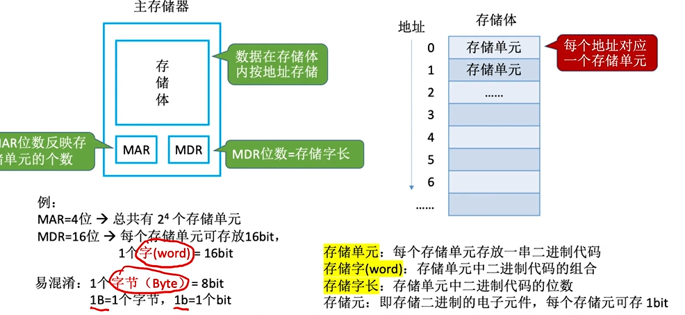

- 存储体

  > 这是所有数据存放的地方
  >
  > 整个存储体会按地址被分为好多个**存储单元**,每个存储单元存放一串二进制
  >
  > 这串二进制数据叫做**存储字**
  >
  > 存储单元的二进制的位数叫做**存储字长**
  >
  > **存储元**，就是存储二进制的电子原件，一个可以存1bit

- 存储地址寄存器MAR

  > 这里暂时存储访存的地址，处理后便于去找到或者存储到这个位置
  >
  > **MAR的位数可以显示有多少个存储单元**

- 存储数据寄存器MDR

  > 这里是数据暂存的地方，读出来或者要写入的数据会先存放在这里，然后从这里被拿走
  >
  > MDR的位数与存储单元的位数一样，也即**MDR位数=存储字长**

#### 运算器的基本组成

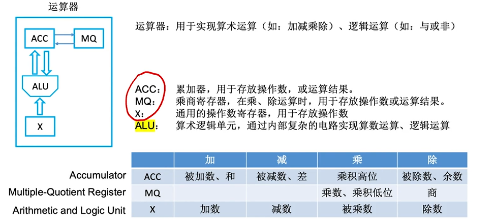

运算器是用于实现算数运算(加减乘除)和逻辑运算(与或非)的

主要包含这么几个部分

- 累加器ACC

  > 用于存放操作数或者运算结果
  >
  > 加减乘除都会用到
  >
  > 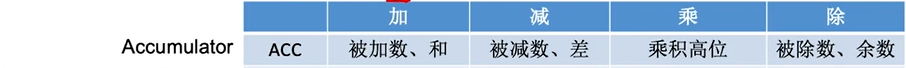

- 乘商寄存器MQ

  > 在乘除运算时，用于存储操作数或运算结果
  >
  > 只在乘除使用
  >
  > 

- 操作数寄存器X

  > 通用的操作数寄存器，用于存储操作数
  >
  > 加减乘除都能用
  >
  > 

- 算数逻辑单元ALU

  > 有复杂的电路，可以实现算数运算和逻辑运算
  >
  > 它会进行计算，是运算器的核心部件

#### 控制器的基本组成

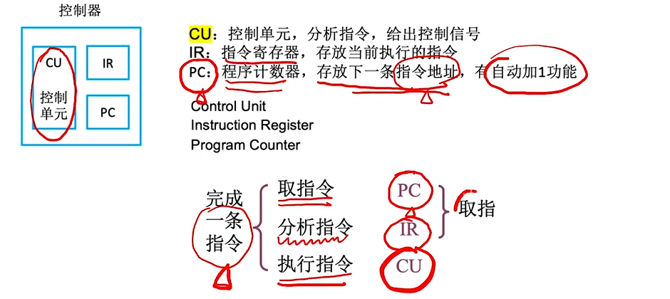

控制器有3个部分组成

- 控制单元CU

  > 是最核心的，用于分析指令，给出控制信号
  >
  > 根据读入的操作码，判断是什么操作

- 指令寄存器IR

  > 用于存放当前执行的指令

- 程序计数器PC

  > 用于存放下一条指令的地址，有自动加1的功能

##### 完成一条指令的过程

先取指令，从PC中找到下一条指令的地址并取出

存入到指令寄存器IR

最后交给CU来执行指令

#### 计算机工作过程举例

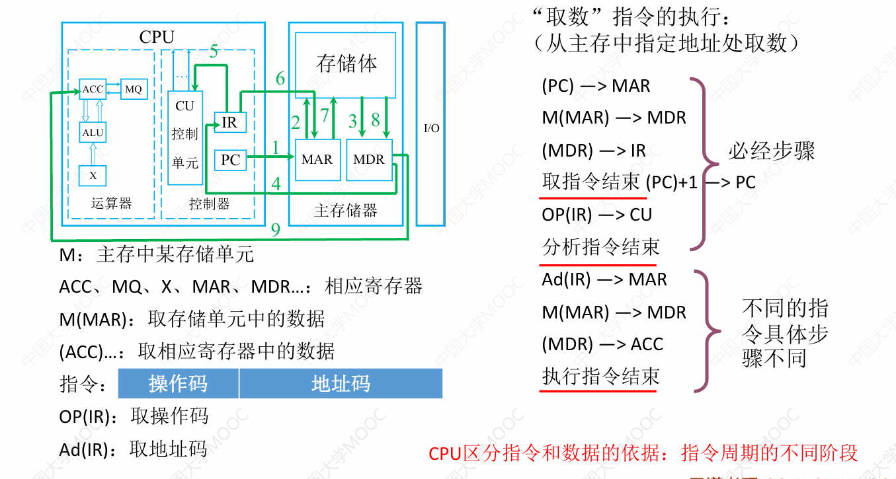

##### 取指令和分析指令

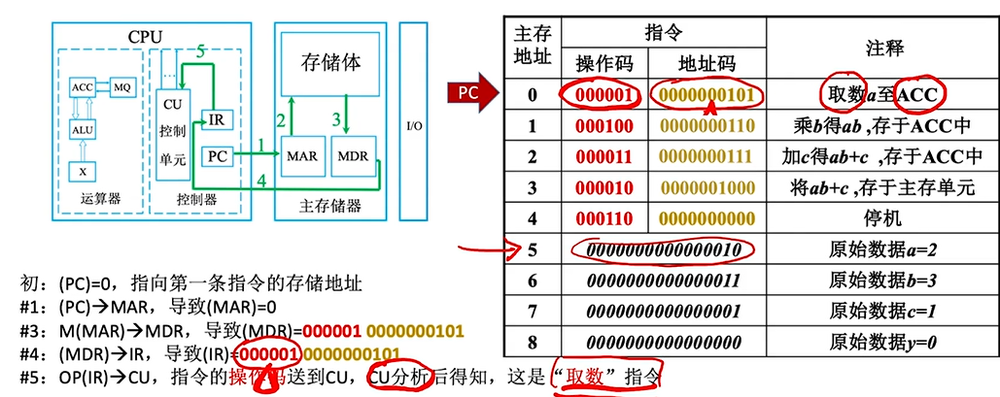

其中( )是指该器件内的数据，如(PC)=0，就是程序计数器的、值为0

M(MAR)->MDR是指把  主存的 *MAR现存地址处*的数据  存入MDR

存入MDR后，IR把这条指令读出来，存到IR

OP(IR)->CU就是把IR里的操作码读出交给CU，然后CU进行指令分析

指令分析结束后会根据结果不同进行不同的操作

##### 取数

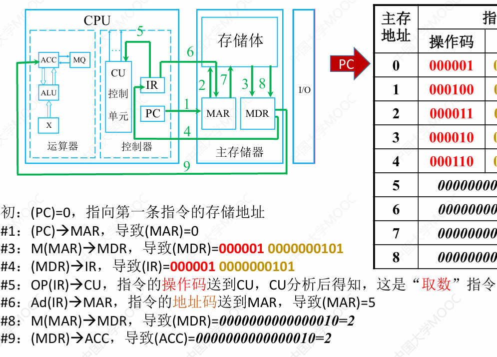

这是**取数指令**

**就是把地址码处的值读入到ACC**

Ad(IR)->MAR，就是把IR里的地址码存入MAR

然后其实是重复3，把M(MAR)的值存入MDR

最后把MDR的值存入ACC

第一个指令取a的值就结束了（#1~4取指令，#5分析指令，#6-9执行指令）

PC加1，去取下一个指令，重复执行

##### 乘法

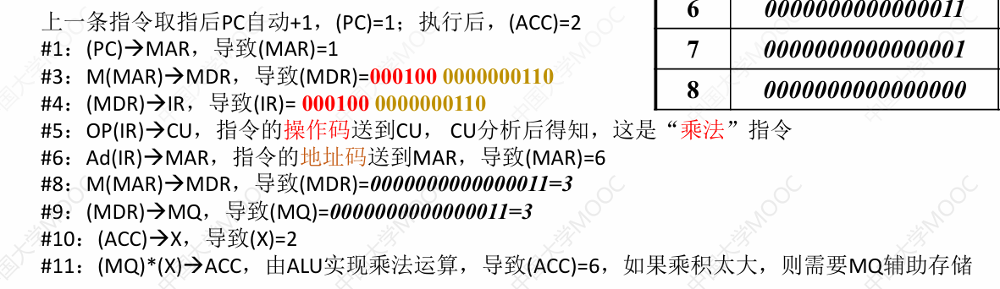

这是**乘法指令**(#6-11)

需要**把地址码的值乘以ACC**

与取数有所不同，#9要把乘数读入到MQ

然后先把ACC的数存入X，然后让ALU计算MQ*X的值，存入到ACC

结束   但如果乘积太大，可以把结果的低位交给MQ来存储

PC值再次加1

##### 加法

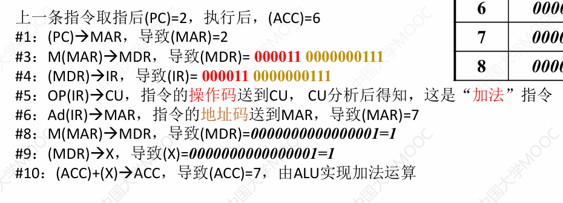

这是**加法指令**(#6-10)

需要**把地址码的值加到上ACC**上

也与前面不同，MDR的值是读入到X

然后ACC直接更新为(ACC)+(X)

结束

PC+1

##### 存数

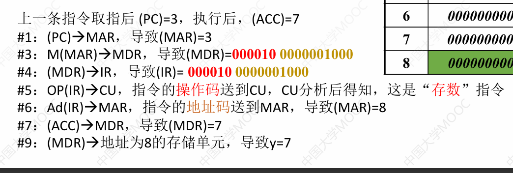

这是**存数指令**(#6-9)

这需要**把ACC的值存到指令的地址码位置处**

那就把IR的地址码存到MAR

把ACC的值存入MDR

哪最后就会把MAR地址处的值更新为MDR的值

PC+1

##### 停机

发现是停机指令后直接调用系统中断，结束

### 计算机软件

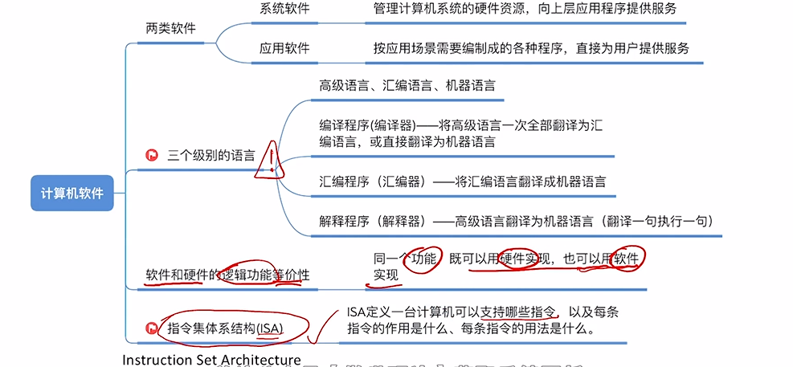

软件包括系统软件和应用软件

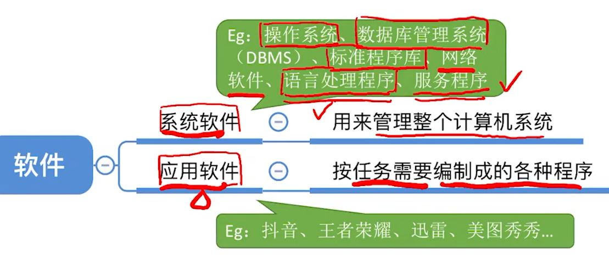

**应用软件**是为了解决某个应用领域的问题而编制的程序

**系统软件**负责管理硬件资源，并向上层应用程序提供基础服务

#### 软件和硬件具有逻辑功能等价性

实现同一个功能，可以由硬件实现，需要设计专用的硬件，成本高但效率高，也能在不改变硬件的情况下用软件实现(成本低但效率也低)

#### 指令集体系结构ISA

规定了软件和硬件之间的界限，设计计算机系统的ISA，就是要定义一台计算机可以支持哪些指令，每条指令的作用是什么，用法是什么

### 计算机系统的多级层次结构

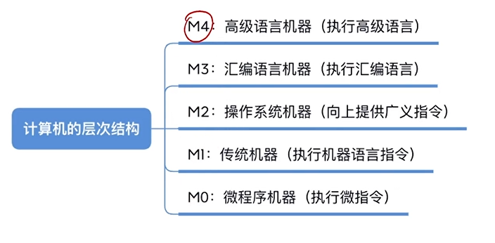

计算机系统层次大概分为以下几层

前两层是硬件，后三层是软件

- 微程序机器M0

  > 就是微指令系统，是一个实在的硬件层，由**硬件**直接执行微指令

- 传统机器M1

  > 就是用机器语言的机器，也是一个实在的机器层，执行的是二进制的机器指令，由微程序解释机器指令系统

- 虚拟机器M2

  > 操作系统机器，它由操作系统程序实现，操作系统程序是由机器指令和广义的指令组成的，广义指令**(系统调用**)是操作系统定义的

- 虚拟机器M3

  > 汇编语言机器，由汇编程序支持和执行，借此可编写汇编语言源程序

- 虚拟机器M4

  > 高级语言机器，是面向用户的，由各种高级语言支持和执行

### 计算机系统的工作原理

#### 从源程序到可执行文件

源程序.c经过预处理器，变为.i，然后再经过编译器，变为汇编语言程序.s，再经过汇编器，变成.o，最后经过链接器，变为.exe

把源程序转换成汇编语言叫做**编译**

把汇编语言转换成机器语言叫做**汇编**

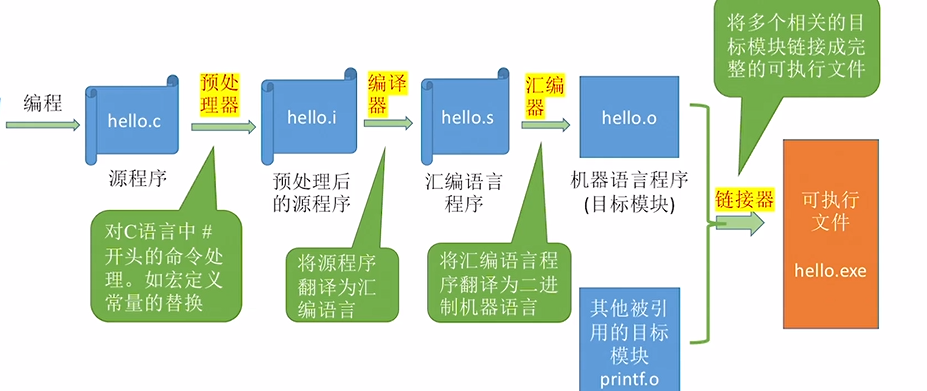

#### 存储程序的工作方式

程序存储在外部存储器中，当需要运行时，将其调入到主存中，进行执行

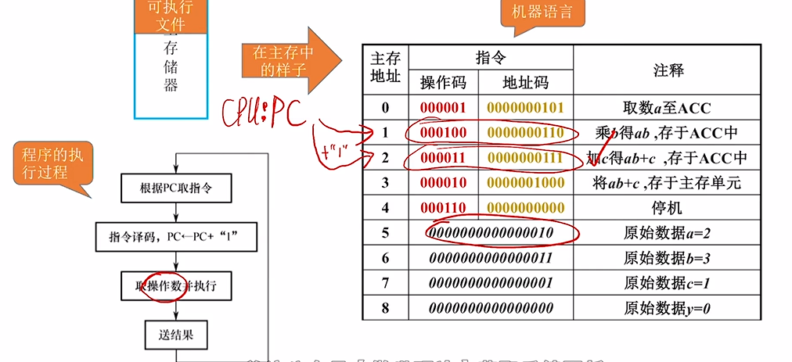

## 计算机的性能指标

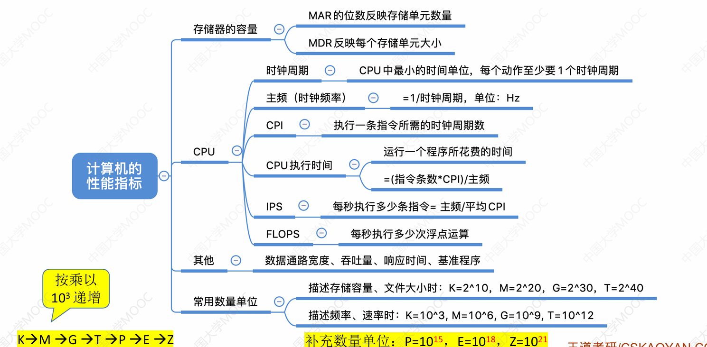

### 存储器的性能指标

MAR反映存储单元的个数

MDR反映每个存储单元的大小

#### 最大总容量

$$
最大总容量=存储单元个数 \times 存储字长 (bit)
      =\frac{存储单元个数 \times 存储字长}{8} (B)
$$

### CPU的性能指标

#### **CPU主频**：

CPU内数字脉冲信号震荡的频率(Hz)

#### **时钟周期**：

每一个脉冲信号的时间
$$
CPU主频 = \frac{1}{CUP时钟周期}
$$

#### **CPI**:

每一条指令所需的时钟周期(通常使用平均时间)
$$
执行一条指令的耗时 = CPI \times CUP时钟周期
$$

$$
CPU执行时间(整个程序的耗时) = \frac{指令条数 \times CPI}{主频}
$$

#### **IPS**：

每秒执行多少指令
$$
IPS = \frac{主频}{平均CPI}
$$

#### **FLOPS**：

每秒执行多少浮点运算

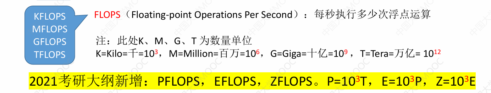

### 系统整体性能的指标

#### 数据通路带宽：

数据总线一次所能并行传送信息的位数(各硬件部件通过数据总线传输数据)

#### 机器字长

指计算机进行一次整数运算所能处理的二进制数据位数，通常与通用寄存器位数、ALU有关。**一般等于通用寄存器的的位数**或者**ALU的宽度**。

#### 吞吐量：

指系统在单位时间内**处理请求的数量**(一个完整的程序运行或者一个指令叫做一个请求)

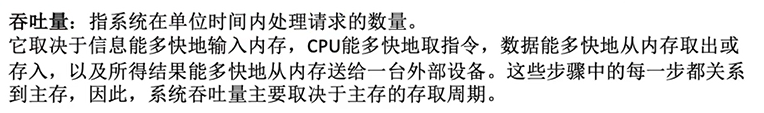

#### 响应时间：

用户从向计算机**发送一个请求**，**到**系统对该请求**做出响应**并获得它所需要的结果的等待时间。

#### 基准程序(动态测试)：

### 速度比较

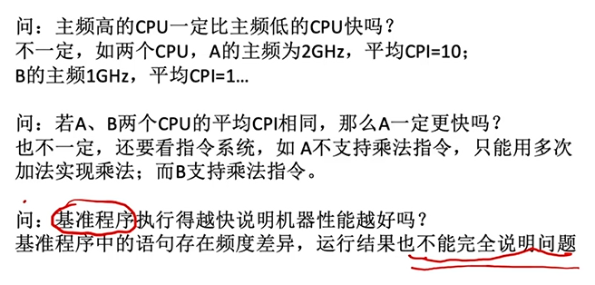

## 其它术语

### 系列机

用于基本相同的体系结构，**使用相同的基本指令系统**的多个不同型号的计算机组成的一个产品系列

### 兼容

指软件或硬件的通用性，即两个不同型号的计算机能运行同样的软/硬件，则说这些软硬件兼容这两种计算机

### 固件

将程序固化在ROM中组成的部件称为固件。是一种具有软件特性的硬件，比软件快，比硬件灵活。