# 输入输出设备

## I/O系统的基本概念

> 本节已从大纲删除

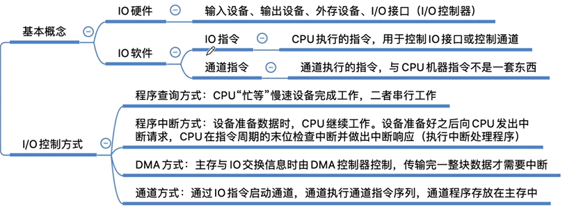

**I/O接口**：又叫**I/O控制器**、**设备控制器**，负责协调主机与外部设备间的数据传输

I/O接口**是一块芯片**，常被集成在主板上(会在南桥芯片内部)

### I/O控制方式简介

在I/O接口中，有3个寄存器，分别是

- **数据寄存器**：存放要交换的数据
- **控制寄存器**：可以直接反应外设的具体动作
- **状态寄存器**：反应外设的当前状态(是否完成、损坏等)

CPU通过控制总线发出命令；地址总线指明设备的地址和读到的数据放到哪个寄存器；

判断I/O操作是否完成的方式有以下几种

#### 程序查询方式

**CPU不断轮询**检测I/O控制器中的状态寄存器、检查是否完成。完成后取出数据

这会一直占用CPU

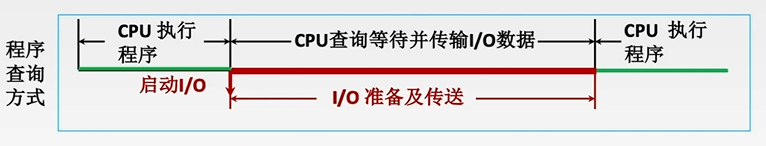

#### 程序中断方式

等待I/O时CPI可以先执行其它程序，等I/O完成后，I/O控制器向CPU发出**中断请求**，CPU响应中断，取走数据

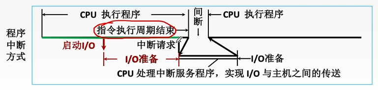

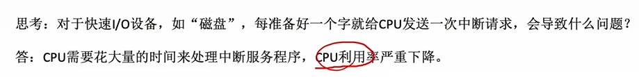

> 以上两种方式的数据流：键盘->I/O接口的数据寄存器->数据总线->CPU的某个寄存器->主存

#### DMA控制方式

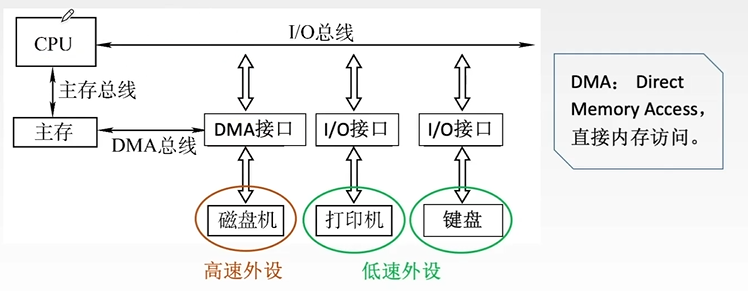

> 注：DMA接口，即DMA控制器，也是一种特殊的I/O控制器。主要应用于连接高速外设
>
> 采用的是三总线的结构

主存与高速的I/O设备有一条**直接数据通路**(DMA总线)。CPU向DMA接口发出读写命令，并且指明主存地址、磁盘地址、读写数据量等参数

**DMA控制器自动控制磁盘与主存的数据读写**，每**完成一整块**的数据读写，才向CPU**发送一次中断**请求

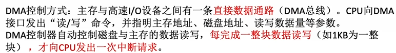

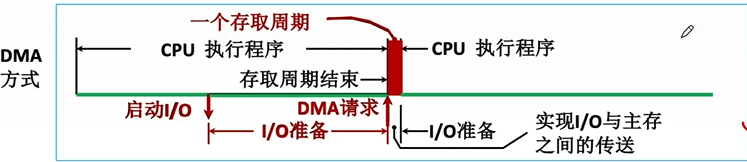

> 每一个字直接CPU需要暂停一个读写周期，但是比每个字都要中断的程序中断方式快多了

#### 通道控制方式

商用的中型机、大型即会有超多的I/O设备，中断太过频繁，CPU处理不过来

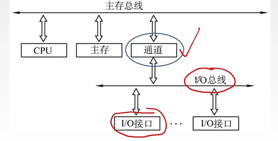

> 通道是具有特殊功能的处理器，能对I/O设备进行统一管理

通道能识别并执行一系列**通道指令**，指令的种类、功能通常比较单一

实现过程：

1. CPU向通道发出I/O指令。指明通道程序在内存中的位置，并指明它管理哪个设备，然后CPU就可以处理其它程序
2. 通道执行通道程序，控制I/O设备
3. 通道完成任务后，向CPU发出中断请求，CPU处理中断

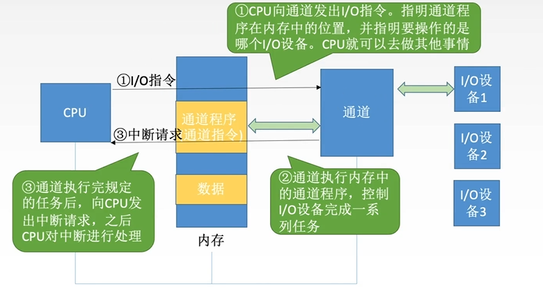

### I/O系统基本组成

I/O系统由**I/O软件**和**I/O硬件**组成

- I/O硬件：包括外部设备、I/O接口、I/O总线等

  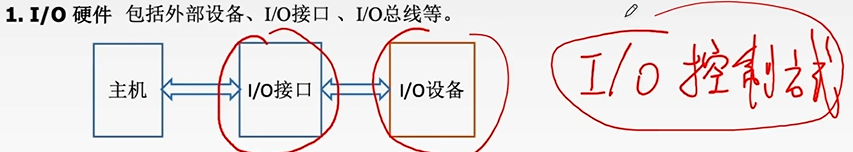

- I/O软件：包括驱动程序、用户程序、管理程序、升级补丁等

  通常采用I/O指令和通道指令实现CPU和I/O设备的信息交换

  > **I/O指令**：**CPU指令的一部分**
  >
  > 操作码+命令名+设备码
  >
  > 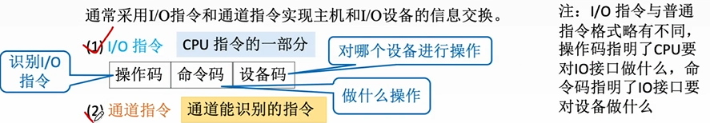
  >
  > ****
  >
  > **通道指令**：**通道能识别的指令**
  >
  > **通道程序**提前编制好**放在主存中**
  >
  > 在含有通道的计算机中，**CPU执行I/O指令**对通道发出命令，由**通道执行通道指令**，代替CPU对I/O设备进行管理
  >
  > 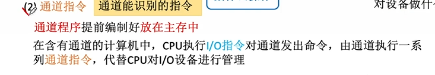 

## I/O接口

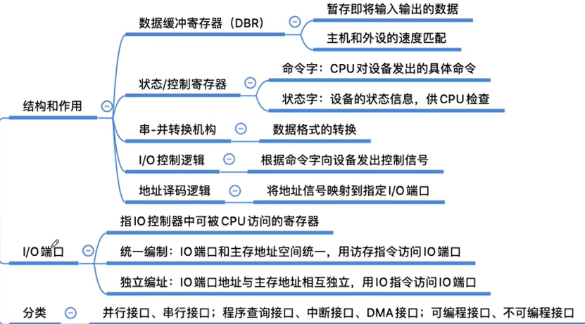

> **I/O接口**：又叫**I/O控制器**、**设备控制器**，复杂协调主机与外部设备间的数据传输
>
> I/O接口**是一块芯片**，常被集成在主板上(会在南桥芯片内部)
>
> 
>
> 
>
> 在I/O接口中，有3个寄存器，分别是
>
> - **数据寄存器**：存放要交换的数据，用于缓存
> - **控制寄存器**：可以直接反应外设的具体动作
> - **状态寄存器**：反应外设的当前状态(是否完成、损坏等)
>
> CPU通过控制总线发出命令；地址总线指明设备的地址和读到的数据放到哪个寄存器；
>

### I/O接口的作用

**数据缓冲**：通过数据寄存器(DBR)达到主机与外设速度相匹配的功能

**错误或状态监测**：通过状态控制器，反馈设备的错误、状态信息，供CPU查询

**控制和定时**：接收控制总线传来的控制信号和时钟信号

**数据格式转换**：串并行转换

**实现主机和设备间的通信**：实现主机-I/O接口-I/O设备间的通信

### 工作过程

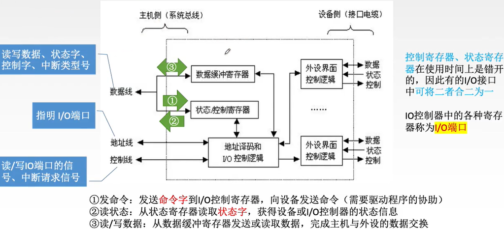

1. **发命令**：发送命令字到I/O**控制寄存器**，向设备发送命令
2. **读状态**：从状态寄存器读取**状态字**，获得设备的状态信息
3. **读写数据**：从数据缓存寄存器发送或读取数据，完成主机与外设间的数据交换

> 控制寄存器与状态寄存器使用时间是错开的，所以常把它们合并
>
> I/O控制器中的各种**寄存器**也被称为**I/O端口**

数据线用于**读写数据、状态字、控制字、中断类型号**

地址线用于**指明I/O端口**(寄存器)

控制线用于**传输读写I/O端口的信号、中断请求信号**

> 确定操作的外部设备有两种方法
>
> 1. 选择寄存器后，再发送一次地址来请求设备
> 2. 每个设备有一组寄存器，选择那组寄存器，就控制哪个设备

### 接口与端口

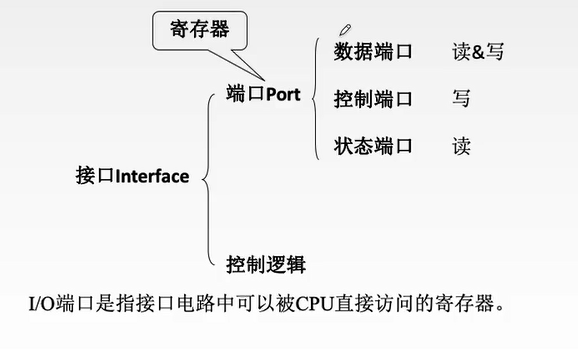

#### 统一编址和独立编址

统一编址是与主存地址是连续的

> 靠地址码就可以分别内存和I/O设备
>
> 也叫**存储器映射方式**

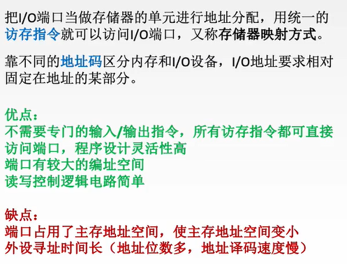

独立编制是地址是独立的

> 由于主存和I/O地址可能重复，所以要靠不同的指令来区分主存和I/O设备
>
> **只能用专用的I/O指令访问I/O端口**

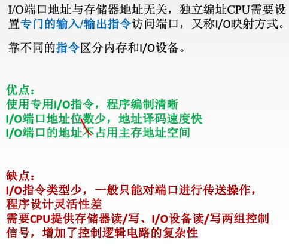

#### I/O接口的类型

按数据传送方式可分为：串行接口\并行接口

按主机访问I/O设备的控制方式可分为：程序查询接口、中断接口、DMA接口

按功能选择的灵活性可分为：可编程接口、不可编程接口

## I/O控制方式

### 程序查询方式

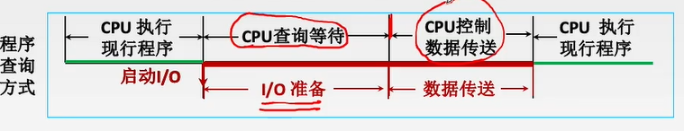

在I/O设备准备数据时，CPU不能做其它事情，要轮询检查判断是否处理完毕，当状态变成已完成，读出数据。这叫做独占查询

保证数据不丢失的情况下，隔一段时间查询一次，叫做定时查询，期间可以执行其它程序

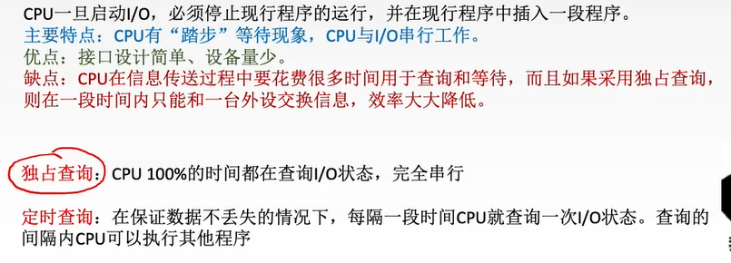

#### 实例模拟

以X86下的IN和OUT指令为例

IN Rd Rs ：把I/O端口RS的数据读入到CPU的Rd中

OUT Rd Rs：把CPU寄存器Rs的数据输出到I/O端口Rd

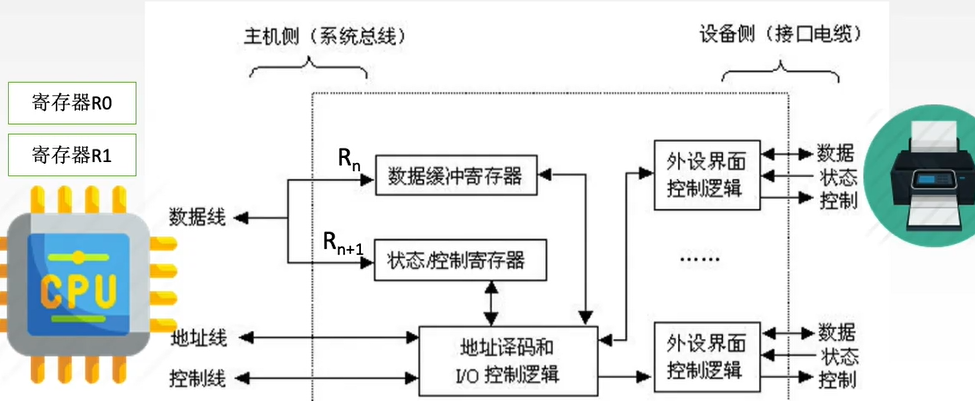

> 假设要打印字符，过程如下
>
> 1. 先把当前要打印的数据存入CPU的寄存器中
>
> 2. 通过OUT指令，把打印指令送入I/O接口的控制寄存器(可能得先把指令从主存调入CPU寄存器)
>
>    (CPU根据指令，通过地址线寻找到要写入的I/O端口，通过控制线指明对目标寄存器进行的操作，需要的数据通过数据线传入)
>
> 3. 此时打印命令存储在控制寄存器中,I/O控制器通过控制线，向I/O设备发出控制信号
>
> 4. I/O设备接收到控制信号后，开始进行工作，把当前自己的状态，通过状态线发送给I/O控制器
>
> 5. 当I/O控制器接收到状态信息后，将其存入状态寄存器
>
>    (此时控制寄存器已经不用了，所以控制寄存器可以和状态寄存器合并)
>
> 6. CPU通过IN指令，轮询检测状态寄存器中的值，直到读取到就绪状态
>
>    (用IN通过数据线把状态寄存器中的值读入CPU寄存器，再判断)
>
> 7. CPU使用OUT指令向I/O接口发送信息(通过地址线指明存放的I/O端口(寄存器)，控制线指明是要写数据，数据线传入要打印的数据)
>
> 8. I/O控制器通过数据线把传来的数据送入I/O设备，并发出控制信号
>
> 9. CPU打印过程中，状态控制器显示忙，打印完成改为就绪状态，等待数据
>
> 10. CPU发现后，把下一个数据传入，重复789
>
> 11. CPU检测到数据全部结束打印后，通过数据线向I/O接口发送停机命令字
>
> 12. I/O控制器把指令传给打印机，工作结束

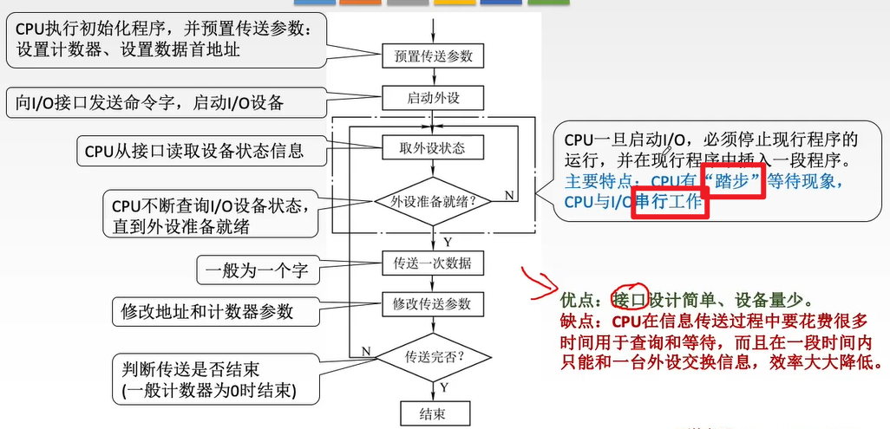

#### 例题

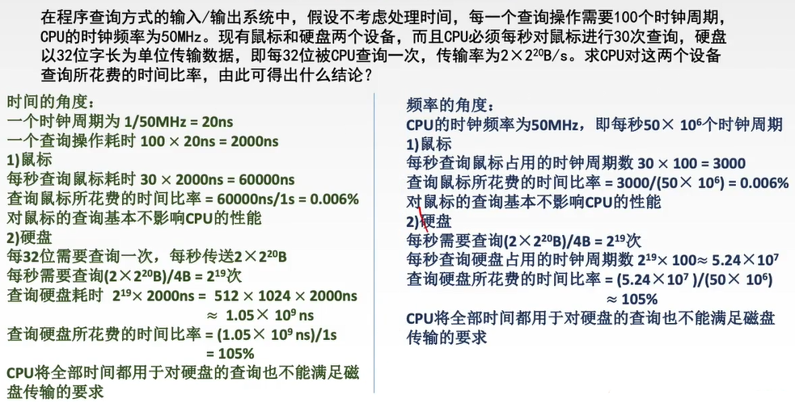

****

想要了解程序中断方式，就得先直到什么是中断

下面先来介绍一下中断系统

### 中断系统介绍

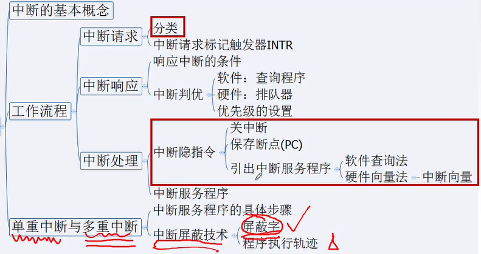

#### 中断系统的作用和原理

包括中断的**概念**、中断的**分类**、以及中断系统的**通用操作**

中断请求标记用于**判断**是哪个**类型**的中断

中断判优是**选择**哪个**中断**请求

##### 中断的概念

> ### 中断的基本概念
>
> 中断是指计算机在执行现行程序的过程中，出现急需处理的异常或特殊请求，CPU暂时中止现行程序，而转而去对这些异常情况或特殊请求进行处理，处理完成再返回
>
> 假如没有中断，某个进程会一直占有CPU，即使调用jmp或者call也仅仅是让执行的位置发生变换。还是会占用CPU直到该进程自主停止（以上指的是单核单CPU）
>
> 中断系统实现后，每个指令结束了，都会检测是否有中断信号需要响应，如有，就转向先执行中断这部分代码；具体过程是
>
> 1. **中断请求**
>
>    中断源向CPU发出中断请求信号
>
> 2. **中断响应**
>
>    先判断响应中断的条件是否满足(如关中断后一般的中断就不再响应)
>
>    然后进行中断判优(根据优先级判断响应哪一个中断)
>
> 3. **中断处理**
>
>    中断隐指令(根据中断信号的不同，转移到程序正确的位置)
>
>    执行中断服务程序

##### 中断的分类

> ### 中断的分类
>
> 分为异常和中断，其中异常叫做内中断，中断也叫外中断
>
> **内中断就是CPU内部执行指令时发现的**，分为
>
> - 故障：指令发现不能运行：缺页、除以0
> - **自陷**：系统故意的
> - **终止**：发现硬件坏了，如存储器校验错误、总线错误
>
> **外中断就是来自系统外部发出的中断请求**，分为
>
> I/O等外部设备发出的请求
>
> 用户的特殊操作（定时器到时，用户强制关闭）
>
> 
>
> 内中断的**故障和自陷**被称作**软件中断**
>
> **外中断和**内中断的**终止**被称作**硬件中断**
>
> #### 狭义上的中断
>
> 狭义上只有外中断才叫中断
>
> 
>
> 又分为：
>
> - **可屏蔽中断**：关中断不会响应
> - **不可屏蔽中断**：关中断也会响应（如掉点
>
> > ##### 关中断：
> >
> > 为了**实现原子性操作**实现的
> >
> > 在PSW寄存器中的IF标志字，用于显示是否关中断
> >
> > **当IF为1，表示开中断**
> >
> > IF为0表示关中断

##### 中断请求标记

> ### 中断请求标记
>
> 为了判断中断信号是哪个设备发来的，需要设计一个**中断请求标记寄存器**，由触发器组成，对每个中断源设置一个**中断请求标记触发器INTR**，当其**状态为1时，表示中断源有请求**。
>
> 中断请求标记寄存器可以在CPU中集成，也可以分散在各个中断源中
>
> 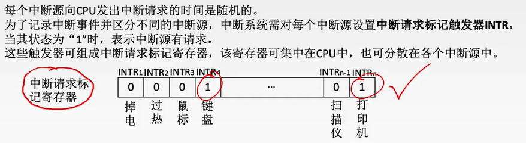
>
> 对于外中断，CPU在每条指令执行结束前向接口发出中断查询信号，以获取I/O中断请求。**CPU响应中断的时间是每条指令执行阶段的结束时刻（中断阶段）**
>
> 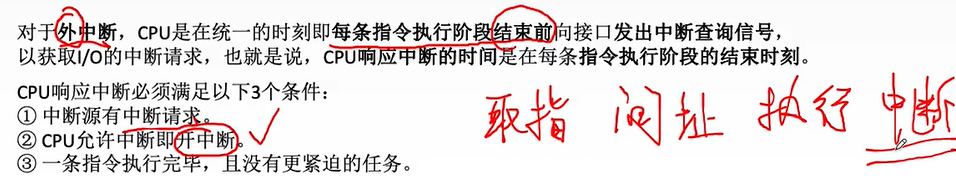
>
> CPU响应中断必须有以下三个条件：
>
> 中断源**有中断请求**；处于**开中断**；**一条指令执行完毕**，且没有更紧急的任务

##### 中断判优

> ### 中断判优
>
> 当多个中断请求同时发出时，CPU要进行中断判优
>
> 可以由**硬件排队器**实现
>
> 也可以由软件**查询程序**实现
>
> 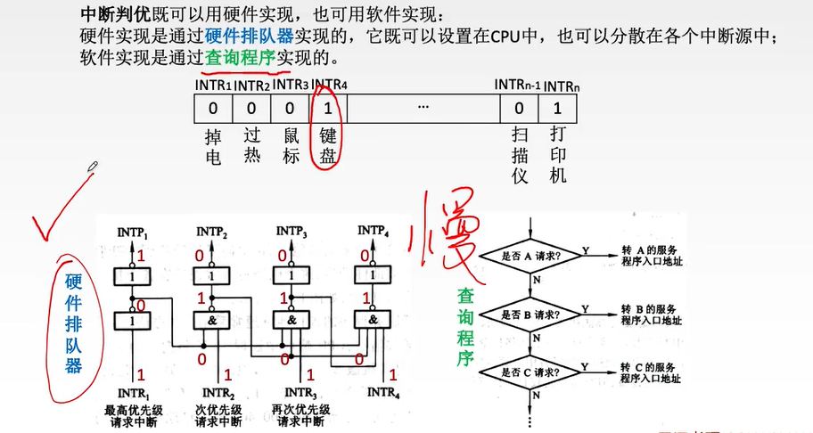
>
> #### 优先级设置
>
> 1. **硬件故障是最高级，之后才是软件中断**
> 2. **非屏蔽中断优于可屏蔽中断**
> 3. **DMA请求优于I/O设备传送的中断请求**
> 4. **高速设备优于低速设备**
> 5. **输入设备优于输入设备**
> 6. **实时设备优于普通设备**

#### 单重中断的处理过程

> ### 中断处理过程
>
> 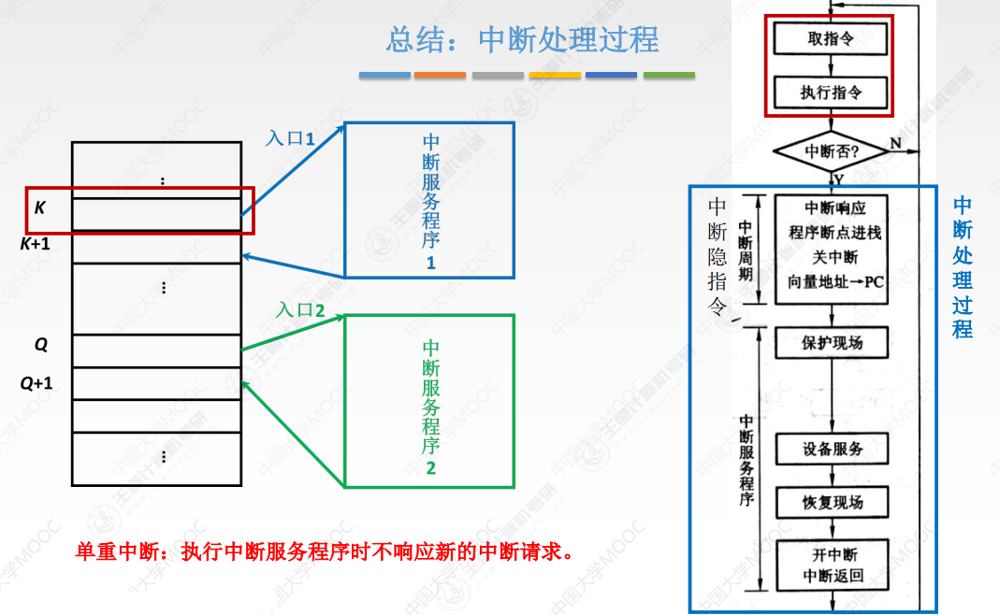
>
> 在跳转到中断程序之前，需要保存当前状态，这是由中断隐指令实现的
>
> **中断隐指令**是一系列任务，会**先保存源程序的PC值**(假设执行到K发生中断，不同中断保存的不一样，反正就是中断结束后该执行的指令的PC)，**让PC指向中断服务程序的第一条指令**
>
> #### 中断隐指令的任务
>
> 1. **关中断**
>
>    为了防止此次中断被别的中断打断(对于单重中断的系统)
>
> 2. **保存断点**
>
>    为了中断结束之后能再返回，要把PC的值放到堆栈中，也可以放到特定的单元中
>
>    > 注意，中断隐指令只保存PC和PSW，
>    >
>    > 而**保存中断屏蔽字**、**保存通用寄存器的值**以及**提供中断服务**都由**操作系统来实现**
>
> 3. **引出中断服务程序**
>
>    也就是把PC的值更改为中断服务程序的起始位置
>
>    但是现在还不知道该位置，有两种查询方法：软件查询法和硬件向量法，后面会介绍硬件向量法
>
> 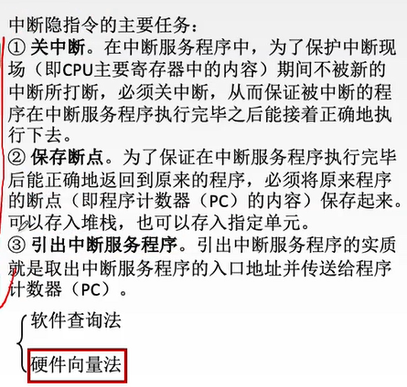
>
> #### 硬件向量法
>
> 会采用间接寻址的思想，把跳转到程序起始位置的代码(一个JMP指令)保存在主存中。让**中断向量地址形成部件**根据硬件**排队器的输出**，形成**向量地址**(代码在主存中的位置)。
>
> 执行这个向量地址的代码，PC就被更改为中断程序的起始位置(**这个位置叫做中断向量**)了。
>
> 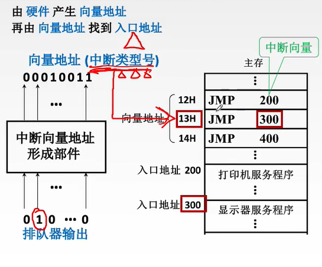
>
> >右边的就是中断向量表，产生的向量地址相当于是中断向量表的地址，可以看作是下标
> >
> >而中断程序在内存中是离散 的，而且位置可能变得，所以需要向量表里记录对应程序的起始地址，这样位置变动不用修改硬件。
> >
> >**中断向量表是由操作系统初始化的**
>
> 
>
> #### 中断服务程序的任务
>
> 主要包括3个方面
>
> 1. **保护现场**
>
>    **保存通用寄存器和状态寄存器的值**，便于中断执行结束后原程序可以恢复CPU环境。可以用堆栈，也可以用特定的存储单元
>
> 2. **中断服务**(设备服务)
>
>    这就是该中断需要进行的事情**主体**，不同中断的该部分也不一样
>
> 3. **恢复现场**
>
>    把之前保存的信息**送回原来的寄存器**，
>
> 4. **中断返回**
>
>    执行开中断，把原先的PC也变回去，也就回到了原来程序的位置

#### 多重中断

> ### 多重中断
>
> 有些系统中，需要在**中断过程中还需要响应其它中断**，这就是**多重中断**，也叫做中断嵌套
>
> 在单重中断中，调用中断前需要关中断，直到服务结束，再打开中断
>
> 而多重中断系统中，在**关闭中断后**，中断程序**还未结束时**，就**能收到开中断**的信号，这时就会跳转到另一个中断程序，在哪个中断程序**执行完毕**后，需要把**中断关闭**，回来**继续执行**原中断程序，**最后打开中断**
>
> 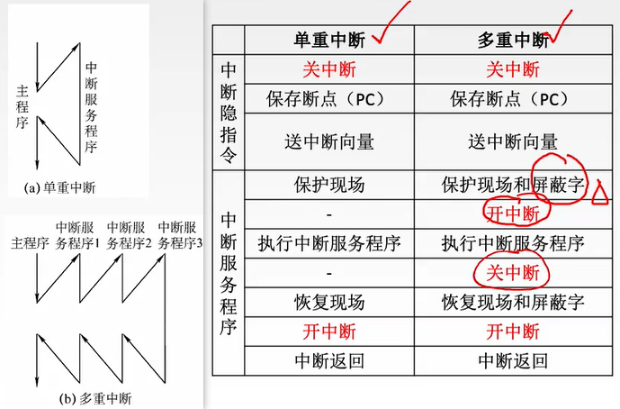
>
> 此外，在保存现场和恢复现场时，需要多保存一个**屏蔽字**
>
> #### 屏蔽字
>
> 屏蔽字是为了限制一些中断的调用，也就是说让**高优先级中断不会被低优先级中断打断**
>
> 注意与硬件排队器区分
>
> 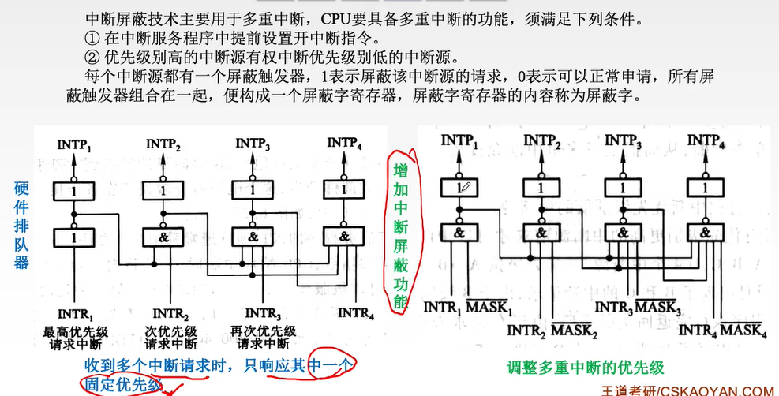
>
> 电路了解即可
>
> 注意，屏蔽字至少应该屏蔽自己
>
> #### 例题
>
> 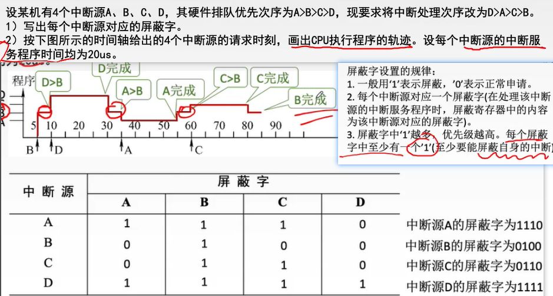

### 程序中断方式

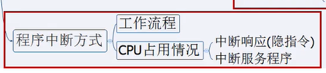

当I/O指令发出后，在**I/O部件准备数据**过程中，**CPU先执行**其它程序

当外部设备准备完毕后，**向CPU发出中断**指令，

当**CPU**在某个指令的中断周期**检测到这个中断**信号后，**去处理**该程序

在处理**结束后**，**继续回来执行下一条指令**

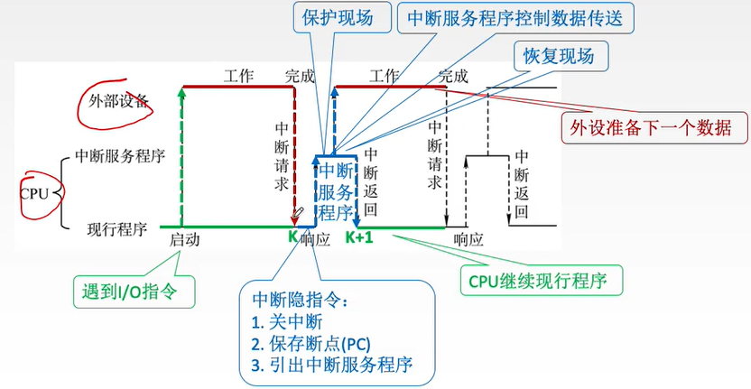

> 有些I/O操作必须等待所有外部设备处理结束才能执行后续程序，如scanf，就不是这个图示
>
> 但是大部分其实是可以实现的，比如printf、外部的打印机这种

### DMA方式

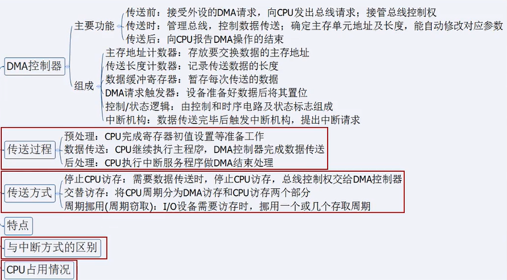

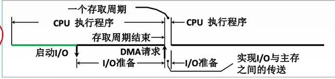

DMA通常用于**控制块设备**(以块为单位进行读写的设备，典型的就是磁盘)

CPU可以向DMA控制器**指明**当前是**输入**操作**还是输出**操作；

要传送**多少数据**；(可以以字节或字为单位)

数据在主存、外设的**地址**

####  主要功能

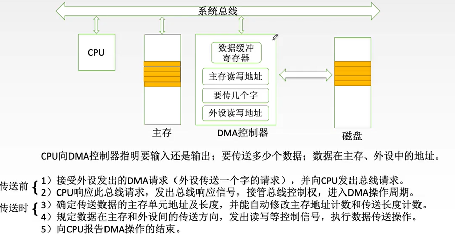

1. DMA控制器**接受**外设发出的DMA**请求**(一次传一个字)，并向CPU发出总线请求(这是单总线结构的DMA，3总线不需要请求)

2. CPU响应此总线请求，发出总线响应信号，DMA控制器接管总线控制权，**进入DMA操作周期**

   > 1、2这是传送到主存之前发生的事情，**预处理**

3. **确定**传送数据的**主存单元地址及长度**，并且能自动修改**主存地址计数**和**传送长度计数**

4. 规定数据在主存和外设间的**传送方向**，发出读写等**控制信号**，执行**数据传送**操作

   > 3、4这是传送时发生的操作，**数据传送**

5. 向CPU**报告**DMA操作的**结束**

   > 5是CPU执行中断做DMA的结束处理，**后处理**

#### DMA控制器的组成

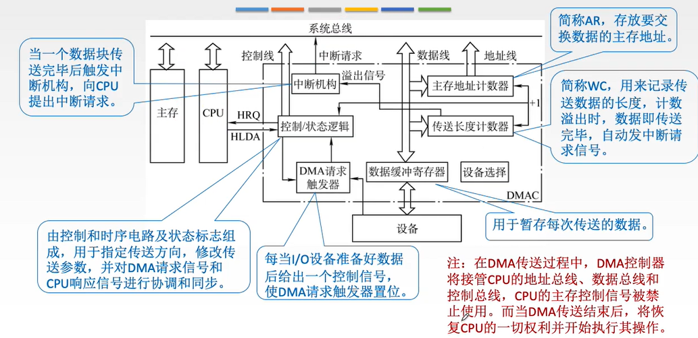

- ***控制/状态*逻辑**：用于指定传送方向、修改传送参数、并对DMA请求信号和CPU响应信号进行协调和同步
- **DMA请求触发器**：每当I/O设备准备好数据后，发出一个控制信号，使DMA请求触发器置位(当设备完成一个字的输入，就会发请求让它变为1，控制逻辑就进行对应操作)
- **主存地址计数器**：简称AR，指明要交换的数据在主存的地址。每传送一个字就自动+1，直至数据传输完毕
- **传送长度计数器**：简称WC，用来记录传送数据的长度。刚开始是要传送的总长度，每传一个-1，直到0
- **数据缓冲寄存器**：暂存要交换的数据
- **中断机构**：当一批数据发送完毕后(也就是一块)，向CPU发出中断信号

#### 详细传送过程

以下是**单总线结构**的DMA实现的传送过程

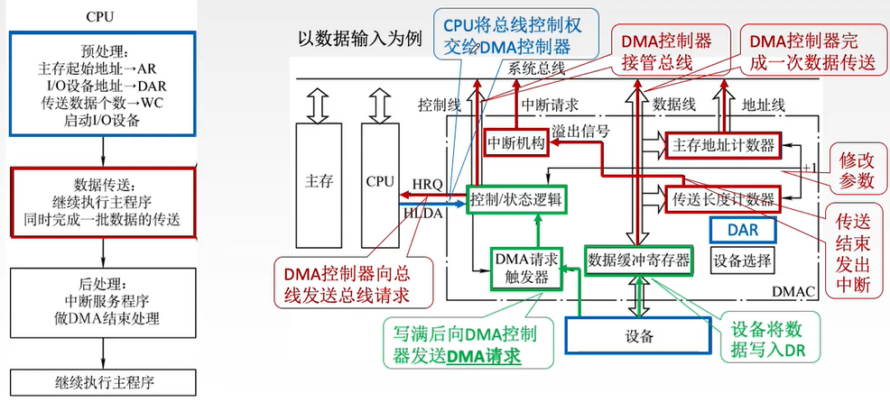

##### **预处理**：

- CPU向DMA控制器指明接下来要交换的数据的地址(主存和设备)

  主存交给AR，I/O设备交给DAR

- 要传送数据的个数

  交给WC

- 启动I/O设备

##### **数据传送**：

以数据输入为例

- I/O设备将数据**写入**数据缓冲寄存器DR

- DR写满后向DMA触发器**发送DMA请求**，让它变为1

- **控制逻辑**检测到这个DMA请求时，DMA控制器就向总线**发送总线请求**

- **CPU**发回信号，**将总线控制权交给DMA控制器**

- DMA控制器通过数据线、地址线、控制线**写入主存**

  数据缓冲寄存器放到数据线、主存地址计数器放到地址线

- 修改**主存地址寄存器**和**传送长度计数器**

  > 循环上述操作，直至所有字都写入主存

- 传递长度计数器发生溢出，传给**中断机构**，向CPU发出中断

##### **后处理**：

- CPU处理中断
- 做DMA结束处理

结束，CPU继续执行主程序

#### DMA使用主存的方式

当采用**三总线结构**时，CPU和DMA可能会同时访问主存，产生冲突，为了提高主存利用率，有以下3种方式使用主存

##### 停止CPU访问主存

> DMA工作时CPU不能访问主存
>
> **控制简单，但是CPU利用率降低**
>
> 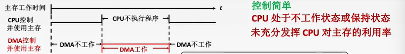

##### DMA与CPU交替访问

> 把一个CPU周期分为两半，前一半交给DMA访问，后一半交给CPU访问
>
> **不需要总线的使用权申请，但硬件逻辑更复杂一些，主存利用也不充分**

##### 周期挪用(周期窃取)

> DMA访存时有3种可能
>
> - CPU此时不访存：也就是没冲突，直接访存
> - CPU正在访存：DMA此时想访存，得等到CPU访存结束后让出总线
> - CPU和DMA同时访存：发生冲突，让**DMA优先**
>
> 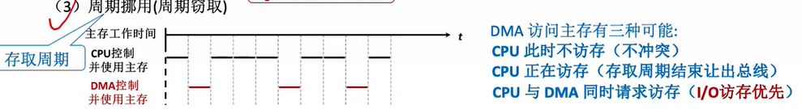
>
> **这里是主存周期**

#### DMA方式的特点

**I/O与主机并行工作，程序和传送并行工作**

主存既能被CPU也能被外设访问

数据块传送时，所有操作都由硬件电路实现

主存要开辟专用缓冲区，接收或供给外设数据

DMA传送块，CPU和外设并行，提高了系统效率

DMA在传送开始前要通过程序进行预处理，结束后要用中断进行后处理

#### DMA方式与中断方式

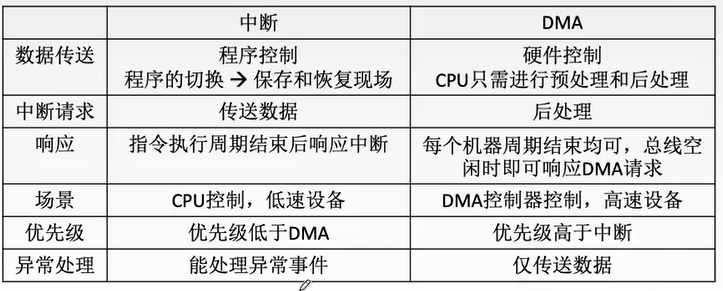

- **在数据传送时**：

  中断需要CPU进行程序切换、保存恢复现场等操作

  DMA只需要进行预处理和后处理

- **中断请求的发出**

  中断是在每次传送数据前

  DMA只有后处理时才发

- **响应中断的时机**

  中断方式是在每个指令周期结束后响应

  DMA是每个机器周期结束都行，总线空闲就能响应

- **使用场景**

  中断一般是CPU控制的低速设备

  DMA是DMA控制器控制的高速设备,块设备

- **优先级**

  DMA发出的中断优先级高

- **异常处理**

  中断方式能处理异常

  DMA只能传输数据
