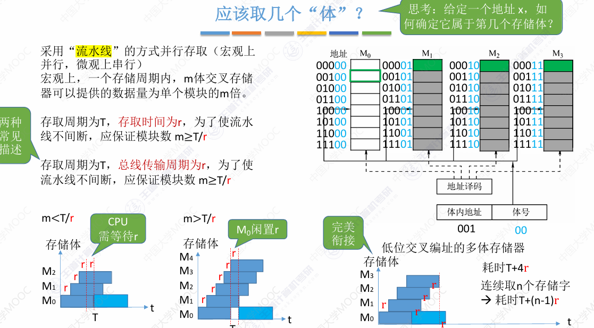
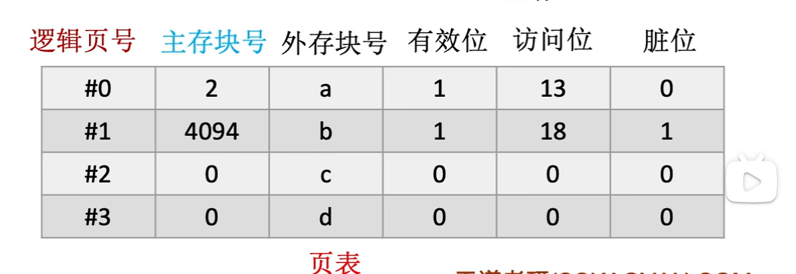

# 存储系统

## 存储器概述

存储器主要分为：寄存器、Cache、内存、辅存  （外存）

越往后容量越大，但速度越慢

其中CPU可以直接和寄存器、cache、主存交换信息，但是**辅存数据必须要调入主存才能被CPU访问**

主存--辅存：实现了虚拟存储系统，**解决了主存储容量不够的问题**

Cache--主存：**解决了主存与CPU速度不匹配的问题**

### 存储器的分类

#### 按层次分类

#### 按存储介质分类

**半导体存储器**

**磁表面存储器**

**光存储器**

#### 按存取方式分类

**随机存取存储器RAM**：读写任意一个存储单元的时间相同，与物理位置无关

**顺序存取存储器SAM**：读写时间与物理位置有关

**直接存取存储器DAM**：即有随机存取特性，又有顺序存取的特性，先直接访问到存储单元的区域，然后按顺序存取来找

后两者也可以归为**串行访问存储器**

**相联存储器CAM**：**按照内容检索存储位置**进行读写

#### 按信息的可更改性进行分类

**读写存储器**：既可以读，又可以写

**只读存储器ROM**，只能读，不能写

#### 按信息的可保存性分类

**易失性存储器**：存储信息断电后会消失

**非易失性存储器**：存储信息断电后仍然保存

**破坏性读出**：信息读出后，原存储信息被破坏，读完数据需要重新写

**非破坏性读出**：信息读出后，原存储信息不被破坏

### 存储器的性能指标

- 存储容量：存储字数$\times$字长

- 单位成本：每**位**价格  =  总成本/总容量

- 存储速度：**数据传输率** = 数据宽度/存储周期

  > 存取时间：从启动一次存取操作到完成该次操作花的时间
  >
  > 存取周期：连续两次存取之间所需要的最小间隔
  >
  > 
  >
  > 主存带宽：也称**数据传输率**，表示每秒从主存进出信息的最大数量，单位为字/秒、字节/秒、位/秒
  >
  > 

## 主存储器

### 主存储器的基本组成

主存储器由存储体、MAR、MDR组成

#### 基本半导体元件及原理

每个存储元由电容和MOS管组成，电容里存储的电荷可以表示0和1

给电容充电就是存数据，放电就是写数据

多个存储元串成一行，叫做一个存储单元，多个存储单元就构成了存储体

#### 存储芯片的基本原理

##### 译码器部分

**译码器**用于选择存储单元，

MAR处的n位地址，可以在译码器对应成成$2^n$个存储单元的地址，

译码器会通过**字选线**(让这条线变为高电平)选择对应的存储单元，

通过**数据线**读出数据到MDR中，

然后CPU通过数据总线一次读入MDR中的数据

##### 控制电路部分

除此之外还有**控制电路**，用于发出信号，使对应器件工作，

如在MAR电压稳定前，不会给译码器发信号，当稳定时才发信号将地址送入译码器，输出时也同理

存储芯片还需要有**片选线**对外进行输出

通常会用**$\overline{CS}$或$\overline{CE}$** (chip select或chip enable)表示，其中上面的**横线代表**该信号在**低电平时有效**

还有**读/写控制线**

$\overline{WE}$代表允许写，$\overline{OE}$代表允许读

也有时候用一根线$\overline{WE}$，低电平代表写，高电平代表读

##### 封装后来看

存储矩阵就是原理多个存储单元组成的部分

译码驱动包括原来的译码器，和用于确保信号能传输到对应存储单元的驱动器

读写电路包括原来的控制电路和原来图里用于读写数据传输的线路(红色和绿色的)

地址线用于接收CPU传入的地址信息

数据线用于将数据的交换

片选线用于表示当前这块芯片是否可用

读写控制线表示当前是读还是写

图中每一根线在实际芯片上会对应一个针脚(除此之外还可能有供电引脚、接地引脚)

8$\times$8位的芯片，代表共有8个地址单元，存储字长是8bit

也就是地址线有$log_2(8) = 3$条，数据线有8条

#### 寻址

一般是按字节寻址，所以总容量为N B，地址线就会需要$log_2(N)$条

当按字或者按半字、双字寻址时，可能真正用到的数据线会少于这个数

### SRAM和DRAM

RAM是随机访问存储器

DRAM是动态RAM，使用**栅极电容**存储信息，一般用于制作主存

SRAM是静态RAM，使用**双稳态触发器**存储信息，用于制作Cache

> 对于DRAM的一些计算：
>
> 整个芯片如果有多个DRMA芯片，只用看一个芯片有多少行
>
> 所有DRMA是同时刷新的
>
> 计算地址条数，需要除以2

#### 栅极电容与双稳态触发器

栅极电容几乎就是上一节的存储元，一个MOS管一个电容，只需要一根数据线，当MOS管接通，电容放电时，读出1；若不放电，读出0

但是当其放电时，信息会被破坏，也就是**破坏性读出**，读出后应当有**重写**操作恢复数据

由于电容的电荷会流失，所以需要**定时刷新**(也就是重新充入电荷)，大概2ms就要刷新一次

所以相对之下速度较慢，但是**制造成本低，集成度高，功耗低**

双稳态触发器比较复杂，由6个MOS管，2个数据线组成，当电平A高B低时读出1，A低B高时读出0

读出数据时，触发器状态保持稳定，是**非破坏性读出，无需重写**

**不用刷新**，只要不断电就不会改变

速度较快，**成本高，集成度低，功耗高**

#### DRAM的刷新

**刷新由存储器独立完成，不需要CPU的控制**

刷新是**通过**对存储单元只读但不输出数据的**假读实现的**

1. 刷新周期：一般为2ms

2. 以行为单位，每次刷新一行存储单元

   > 使用行列地址是为了减少选通线的个数，如果不用需要$2^n$根，而用行列地址只需要$2^{\frac{n}{2}} + 2^{\frac{n}{2}}$根选通线
   >
   > 行列地址的实现：把原来的一维存储单元看作一个矩阵，拆分成行地址和列地址，分别送给行地址译码器和列地址译码器
   >
   > 

3. 有硬件支持刷新，读出一整行的数据后重新写入，会占用1个读写周期

4. 刷新时间:

   > 假设DRAM内部排列是128*128，且读写周期(存取周期)是0.5微秒，则2ms共4000个周期。有下面家中刷新方式
   >
   > **分散刷新**：每次读写完毕后刷新以下，会导致存取周期翻倍变成1微秒，**没有访问死区**
   >
   > **集中刷新**：在2ms内集中安排时间全部刷新，系统的存取周期还是0.5微秒，但是会有一段时间专用于刷新，无法访问存储器，这段时间称为**访存死区**，对于这个例子，2ms中后128个周期是访存死区
   >
   > **异步刷新：**把所有刷新分散到2ms中，保证在2ms中每行都能刷新一次，对于这个例子就是2ms/128 = 15.6微秒刷新一次，**访问死区比较分散**
   >
   > 

#### DRAM的地址线复用技术

**把行地址和列地址分两次送入**，放入行地址缓冲器和列地址缓冲器中，再送入行/列地址译码器，这样每次只需要n/2根地址线即可

可减少整个芯片的地址线数量，让芯片的引脚更少

### 只读存储器ROM

ROM是**非易失性**的芯片，断电后数据不会消失

#### 各种ROM

- MROM (Mask Read Only Memory)掩模式只读存储器：在生产时写入信息，之后**完全不能重写**

- PROM(Programmable Read Only Memory)可编程只读存储器：可以让用户写入一次数据，**之后就不能更改**

- EPROM(Erasable Programmable Read Only Memory)可擦写可编程只读存储器：可进行多次擦写

  > 又分为UVEPROM和EEPROM
  >
  > UVEPROM是用紫外线照射后**擦除所有信息**
  >
  > EEPROM用电擦写，可以**擦除特定部分**

- Flash Memory 闪速存储器(像U盘、SD卡就是闪存)

  > 是由EEPROM发展而来的，断电后也能保存信息，**可进行多次快速擦除和重写。**
  >
  > 注意，由于每次写入都要先擦除，**所以写入比读取慢**

- SSD(Solid State Drives)固态硬盘

  > 由控制单元+存储单元(flash芯片)组成，与闪存的核心区别是控制单元不一样，但是存储介质相似，可以多次擦除重写，速度快，功耗低，价格高

#### 计算机内部的重要ROM

操作系统安装在辅存中，刚开机时，RAM里没有数据，无法允许，所以需要一个特殊的**BIOS芯片**(ROM)，存储了“自举装入程序”，用于把操作系统装入主存

虽然BIOS一般集成在主板上，但是我们会在逻辑上把它看作是主存的一部分

且这个ROM和RAM常统一编址（即前n个地址给BIOS，紧接着给RAM）

### 双端口RAM和多模块存储器

408只考多模块存储器

**这两种方式都是用于提升主存速度的**

#### 存取周期

存取周期就是可以连续读写的最短时间间隔，**存取时间+恢复时间**

**DRAM的恢复时间较长**，可能是存取时间的好几倍（SRAM就比较短）

当多个核的CPU都要访存，需要等很久

CPU的读写速度远快于主存的存取周期，如果一直等，会严重损失性能，所以有了后面的几种优化方法

#### 双端口RAM

**可以优化多核CPU访问一根内存条的速度**

需要有两组完全独立的数据线、地址线、控制线。CPU、RAM也要有更复杂的控制电路

当不同端口的操作相冲突时(对一个地址同时写，或对一个地址一个写一个读)，要提示忙，暂时关闭一个端口

#### 多体并行存储器

对于多个存储体，进行编址，可以分为**体号**和**体内地址**

假设有N个存储体，就需要$n=log_2(N)$位做体号

**高位交叉编址：**取前n位做体号，所以总的地址在单独一个存储体中是连续的

**低位交叉编址：**取后n位做体号，这种方式，每个存储体中地址是不连续的，但是存储体间，水平的地址是连续的，这样读取一整段数据时，一个存储体读取后，可以再其恢复时间去读下一个存储体的数据，类似流水线作业，能大大提高效率

假设存取周期是T，存取时间是r，那么读连续n个地址

高位交叉编址的时间是$nT$

低位交叉编址的时间是$T+(n-1)r$

##### 存储体个数

假设存取周期是T，存取时间是r

那么**存储体的个数m应当满足$m\ge \frac{T}{r}$** 

#### 单体多字存储器

上面的多体并行存储器，它每个存储体都是一个模块，各个模块都有单独的读写控制电路、MDR、MAR，它们既可以并行工作，也可以交叉工作

还有单体多字存储器，它相当于是把原先多个存储体合并，一次读取一整行，每个存储单元存储m字，总线宽度也需要变为m个字，一次并行读出m个字

但是这种情况不如多体并行存储器灵活，**一次必须读出m个字**，不能单独取某个字

且指令和数据在主存中必须是连续存放的

## 主存储器和CPU的连接

### 单块存储芯片与CPU的连接

对于单块存储芯片，需要对外暴露出：

地址线(与行数的对数相同)、

数据线(与一行存储元的个数相同，也就是存储字长)、

读写控制线(可能1根可能2根)，

对于现在的计算机，MDR和MAR都是集成在CPU内部的，存储芯片里的只是一个普通寄存器

这是对单个芯片连接

当字数不够时，需要对芯片进行位扩展

当总线宽度比芯片的字长大的时候，要用位扩展

### 多块存储芯片与CPU的连接

#### 输入输出信号的命名

- 地址线$A_n$

- 数据线$D_n$

- 片选线$\overline{CS}$或$\overline{CE}$，带横线指低电平时有效

- 读写控制线$\overline{WE}$或$\overline{WR}$，低电平代表写，高电平代表读

  也可能分开成$\overline{WE}$或$\overline{OE}$两条读写线

#### 增加存储字长—位扩展

把每个小芯片的地址线都连接到主存对应的**同一段地址线**上

数据线每个小芯片连n位(n是小芯片自己的字长)**不同的数据线**

**片选信号都置为选通**(要看是需要低电平还是高电平)

这样每次选到该地址，所有小芯片会同时读或者写，相当于是把它们水平拼接在一起，也就是把**位扩展**了

如下图就是把$8k\times 1$位的最终扩展成了$8k\times 8$位的，也就是把1位的扩展成了8位的

#### 增加存储字数—字扩展

当数据总线已经使用完全，但是地址总线还有空余时，可以把剩余的t个地址信号经过以下两种方式，转换成片选信号，分发给多个小存储器，这样就相当于增加从存储的字数，也就是容量扩大了

> - **线选法**：给每个芯片的**片选线直接连接一根地址线**，以2根地址线且片选信号高电平有效为例，一根0一根1时，1的那根工作
>
>   但是这样会有问题，当有2个及以上的1时会发生冲突，当全0时会无反应，而且**n根线只能产生n个片选信号**，会造成地址极大的浪费，**地址不连续**
>
> - **译码器片选法：**地址线连接译码器，**n根地址线能产生2^n^个片选信号**，且不会冲突，这样**地址是连续的**
>
> 

注意：译码器的输出口画了小圆圈，代表此处有非门，也就是最后输出的信号是1个0其它全1。由于片选信号是低电平有效(上面带横线)，所以也要给它加个非门

#### 主存容量扩展—字位同时扩展

就是把字扩展和位扩展结合起来

### 译码器

译码器一般有两种，一种就是出口没有非门的，它最终输出的数据是1个1，其它都是无效信号0，一般用于高电平有效的片选信号

另一种是出口有非门，这时候会输出1个0，其它的全是无效信号1。一般用于低电平有效的片选信号

#### 使能信号

译码器中，除了之前常见的输入信号和输出信号之外，还有**使能信号$EN$**，用于表示当前译码器是否使用，若信号不合规，则所有输出信号都是无效信号

还有更复杂的，多个使能信号共同作用，一般是$G_1$，$\overline{G_{2A}}$，$\overline{G_{2B}}$来表示(就是74ls138)

只有$G_1$是高电平，$\overline{G_{2A}}$和$\overline{G_{2B}}$都是低电平时，才有效

**使能端的作用**：可以通过控制使能端的电平，**控制片选信号的生效时间**

CPU输出地址信号，但是刚开始可能输出信号不稳定，所以需要等稳定之后，才通过$\overline{MREQ}$(主存请求信号)发出信号，让译码器生效

## 外部存储器

磁表面存储是指把某些磁性材料薄薄的覆盖在铝或者塑料表面上作为磁载体来存储信息，像磁盘、磁带和磁鼓都属于磁表面存储器

磁表面存储器每次**读和写都是以1bit为单位**的，如果发来的是**并行**的nbit数据，需要在内部**转换成串行**的数据

**读和写是不可以同时**进行的

**优点**

- 存储容量大，位价格低
- 记录介质可以重复使用
- 信息可以长时间保存
- 非破坏性读出，不用再生

**缺点**

- 存取速度较慢
- 机械结构复杂
- 对工作环境要求高

外存储器既可以做输入设备，也可以做输出设备

### 磁盘存储器

磁盘存储器分为磁盘驱动器和磁盘控制器

> 磁盘驱动器：核心部件是**磁头**组件和**盘片**组件，温彻斯特盘是一种可移动头固定盘片的硬盘存储器
>
> 磁盘控制器：是磁盘存储器和主机的接口，主流的标准有IDE、SCSI、SATA等

#### 磁盘设备的组成

**存储区域**

一块硬盘有多个记录面，每个记录面划分为若干个**磁道**，每条磁道分为若干个**扇区**，**扇区也称块**，是磁盘读写的最小单位，也就是说**磁盘按块存取**

> **磁头数：**也就是记录面数，表示磁盘一共多少个磁头，磁头用于读写盘片上记录面的信息，**一个记录面对应一个磁头**
>
> **柱面数：**表示硬盘每个盘面上有多少条磁道，在一个盘组中，不同记录面的相同编号的多个磁道组成一个圆柱面。**柱面数和每一面的磁道数相同**
>
> **扇区数：**表示每一个磁道上有多少个扇区。注意：不论周长大小，每个**磁道扇区数是相同的**

**硬盘存储器**

硬盘存储器由磁盘驱动器、磁盘控制器和盘片组成

#### 磁盘的性能指标

- **磁盘的容量：**磁盘能存储的总的字节数称为磁盘容量。磁盘容量有非格式化容量和格式化容量。

  > **非格式化容量**就是总可能存储的字节数；
  > $$
  > 非格式化容量 = 记录面数\times柱面数\times每个磁道的磁化单元数
  > $$
  > **格式化容量**是把数据格式化后的容量，会损失一些容量
  > $$
  > 格式化容量 = 记录面数\times柱面数\times每道扇区数\times每个扇区的容量
  > $$

- **记录密度**：指盘片上单位面积记录的二进制的信息量，通常以道密度、位密度和面密度表示

  > **道密度**是沿磁盘**半径方向单位长度上的磁道数**
  >
  > **位密度**是**磁道上单位长度能记录的二进制代码位数**
  >
  > **面密度**是**位密度和道密度的乘积**
  >
  > 磁盘上每个扇区的信息量一样，与长度无关，所以说**每个磁道的位密度不同**
  >
  > 

- **平均存取时间：**

  > $$
  > 平均存取时间=寻道时间+旋转延迟时间+传输时间
  > $$
  >
  > 寻道时间：磁头移动**到**目的**磁道**（计算时一般使用题目中所给的平均时间，否则就用最外道到最内道的时间的一半）
  >
  > 旋转延迟时间：磁头定位**到**所在**扇区**（若题目中没给，就按照**转半圈**来计算）
  >
  > 传输时间：**传输数据**随花费的时间（转数据所在扇区花费的时间）
  >
  > 除此之外还可能让加上磁盘控制器的延迟时间

- **数据传输率：**磁盘存储器在单位时间内向主机传输数据的字节数，叫做数据传输率

  > 假设磁盘**转速为r**，每个**磁道N个字节**
  >
  > 则数据传输率
  > $$
  > D_r= rN
  > $$

#### 磁盘地址

主机向磁盘发生寻址信息，磁盘的地址一般是

驱动器号+柱面号+盘面号+扇区号

#### 磁盘的工作过程

主要操作是：寻址、读盘、写盘。每个操作都对应一个控制字

硬盘工作时第一步是取控制字，第二步是执行控制字

硬盘属于机械式部件，**操作是串行**的，不能同时读写，也不能同时读或写两组数据

#### 磁盘阵列RAID

RAID廉价的冗余磁盘阵列，是将**多个独立的物理磁盘组成一个**独立的逻辑盘，数据在多个物理盘上**交叉存储、并行访问**，有**更好的存储性能、可靠性和安全性**

- RAID0：无冗余和无校验的磁盘阵列

  > 逻辑上相邻的几个扇区存到几个不同的磁盘，有点像前面的低位交叉编址
  >
  > 
  >
  > 

- RAID1：镜像磁盘阵列

  > 存两份数据，两个磁盘存一份数据，发生扇区损坏时可以找到备份的数据。同时比较两块磁盘的数据是否相同，来判断是否发生错误
  >
  > 

- RAID2：采用纠错的海明码的磁盘阵列

  > 把连续的几个bit(之前都是扇区，这里不同)分散存储在各个盘中
  >
  > 还要增加若干个磁盘存储校验位
  >
  > 4bit信息位+3bit海明码可以纠正1位错
  > $$
  > 2^k \ge r+k+1
  > $$
  > 其中，r是数据位数，k是纠错码的位数

- RAID3：位交叉奇偶校验的磁盘阵列

- RAID4：块交叉奇偶校验的磁盘阵列

- RAID5：无独立校验的奇偶校验磁盘阵列

**越往下冗余的占比会减少，可靠性会增加**

### 固态硬盘SSD

基于闪存技术实现的，属于电可擦ROM，也就是EEPROM

#### 组成

**闪存翻译层**：负责翻译逻辑块号，找到其对应的物理地址(页号)

**存储介质：**多个闪存芯片(一个芯片由多个块组成，一个块由多个页组成)

> 
>
> IO总线传来的是逻辑块号，转换成物理地址时应当找的是最小存取单位
>
> 对与磁盘来说是扇区
>
> 对应固态硬盘来说是页

#### 读写性能特性

- 固态硬盘**以页为单位读写**(相当于磁盘的扇区)

- 固态硬盘**以块为单位进行擦除**

  > 擦干净的块，其中每页都**只允许写一次**，可以读无数次
  >
  > 当只要修改某个块中1页的数据时，应当**把整块**的其它所有页数据**复制到另一块**里，然后新数据写入，**原来那块进行擦除**。与此同时，**内存翻译层的地址映射也要改变**
  >
  > 所以，**某一逻辑地址的物理地址是可能改变的**。

- **支持随机访问**，由地址翻译层迅速定位

- **读比写块**，因为写入可能要擦除

#### 与机械a硬盘的比较

- 固态硬盘读写速度快、随机访问性能高、用电路控制访问位置；机械硬盘有寻道时间和旋转延迟等，慢很多
- SSD安静无噪音，耐摔抗震、能耗低但造价更贵
- **SSD的一个块擦除次数过多可能会坏掉**。但是**机械硬盘的扇区不会**因为读写过多而损坏

#### 磨损均衡技术

思想：**将擦除平均分布在各个块上，以提高使用寿命**

动态磨损均衡：写入数据时，优先选择累计擦除次数少的新闪存块

静态磨损均衡：SSD检测并自动进行数据分配、迁移，让老旧的闪存块承担以读为主的存储认为，让新的承担更多写任务

## 高速缓冲存储器

即使采用了双端口RAM、多模块存储器的方式提高了主存的工作速度，但是速度与CPU还是有很大的差距

可以使用更快的SRAM，但是价格更高，容量更小，单纯用它，满足不了需求

所以根据程序访问的局部性原理，把SRAM制成Cache

### Cache的基本工作原理

**由于根据局部性原理，短时间内，同一程序使用的指令和数据大概率会在一块区域**，如果把最近会频繁使用的指令和数据放入Cache中，这样CPU可以直接和Cache交换数据，速度会大大提高

> ### 局部性原理
>
> #### 空间局部性
>
> 在最近的未来要用到的信息(指令和数据)，很可能与现在在使用的信息在空间上看是邻近的
>
> #### 时间局部性
>
> 在最近的未来使用到的信息，很可能是现在正在使用的信息
>
> 
>
> 

#### 性能分析

假设访问一次Cache的时间为$t_c$，访问一次主存的时间为$t_m$

命中率H：CPU欲访问的信息在Cache中的比率

缺失率(未命中率)M = 1-H

所以Cache—主存系统的平均访问时间t就为
$$
t = Ht_c + (1-H)(t_c+t_m）
$$
因为物理数据是否在Cache中，CPU都要先去Cache中寻找，若没有命中，再去主存中寻找

还有另一种方式，CPU同时在Cache和主存中寻找数据，若Cache中找到了，则直接停止主存的查找，若没找到，就在内存里继续查，这时平均访问时间会稍短，为
$$
t = Ht_c + (1-H)(t_m）
$$

#### 主存与Cache的数据交换(以块为单位)

为了主存与Cache进行数据交换，需要把主存和Cache都进行分块

一次要交换一块数据

分块之后，原先的地址在逻辑上也被划分为了**块号和块内地址**

(在操作系统中，主存的一个块，也被称为一个页/页面/页框

Cache的块有时也被称为行)

### Cache-主存的映射方式

由于Cache中保存的是内存中数据的副本，该怎么区分Cache与主存的映射关系

为了区分每个Cache块，要给每个Cache加上**标记**，标记里存的是主存的块号

除此之外，还需要再加上一位**有效位**，当有效位为1时，才代表这个Cache存储了数据

Cache的映射方式一共有3种，分别是全相联映射、直接映射、组相联映射

假设主存为256MB，Cache有8个Cache行，行长为64B

所以主存总地址为28位，块内地址位6位，块地址22位

下面是不同映射方式的实现细节

#### 全相联映射

也就是随意映射，主存中的块可以任意映射到Cache的任意位置

**对Cache的空间利用充分，但是查找标记最慢**

最开始Cache全是空的，有效位全为0

##### 主存放入Cache

主存放入Cache中时，可以随意放入Cache的一个位置，然后为Cache标记位写入**22位的标记**(主存块号)，并把有效位置为1

##### CPU访存

当CPU访问主存地址时，拿主存地址的**前22位**一个一个对比Cache中的每个标记

若标记与前22位**相同**，且**有效位为1**，说明**命中**，根据剩余的块内地址访问即可

若没有标记相同或有效位为0，说明**没有命中**，去**访问主存**

#### 直接映射

每个主存块在Cache中的位置是固定的，**位置=主存块号%Cache总块数**

但是会有缺点，**在Cache相同位置的主存块，即使Cache空闲，也只能存入一个**

**对任意一个地址，只需要对比一次标记查找最快，但是对Cache的空间利用不充分**

##### 标记简化

由于位置是根据取模固定好的，所以若Cache块总数为$2^n$，则Cache的每一行在主存地址的后n位是确定好的，所以标记里不需要存这后n位

##### CPU访存

当访问主存地址时，可以直接根据**主存块号的后n位**确定Cache行号

然后用主存块号剩余的前面的位数去和标记进行匹配

若相同且有效位为1，说明命中，根据块内地址访问即可

否则未命中，去访问主存

#### 组相联映射

每个主存地址在Cache中只能放在某个固定的分组，但是在分组内部可以随意放

像是全相联映射和直接映射的结合，效果也比较折中

**所属分组 = 主存块号%分组数**

假设二路组相联(也就是2块为一组)

此时主存块号也就被分为了**标记和组号两部分**

##### CPU访存

先根据后2位判断分组号，然后在对应分组里去判断是否命中

### Cache替换算法

当Cache满了该如何替换呢

对于全相联映射：当Cache完全满了才需要替换

对于直接映射：不需要考虑替换，或者说直接替换

对于组相联映射，当分组满了才需要替换，在分组内选择替换

下面以全相联映射为例

#### 随机算法RAND

当Cache满了，**随机选择一块**去替换

实现简单，但没有考虑局部性原理，命中率低，很不稳定

#### 先进先出算法FIFO

若Cache满了，则**替换最先被调入**Cache的块

 实现方便，但是也没考虑局部性原理，最先调入Cache的块也可能是被频繁访问的

还可能出现频繁的刚被换出就要再换入的情况，被称作**抖动**

#### 近期最少使用算法LRU

(Least Recently Used)给每个Cache块设置一个计数器，用于记录每个Cache块有多久没有访问了，当Cache满了，**替换计数器值最大的块**

当某个**块命中**时，将其**计数器置为0**，计数器**值比他低**的所有计数器+1

当未命中但有空闲行时，新装入的行置为0，其余非空闲的行加1

当未命中且无空闲行时，替换掉计数器最大的块，并将计数器置为0

LRU算法是**基于局部性原理**的，最近被访问过的块，在短期内也很有可能再被访问，所以淘汰最久没被访问的块是合理的。**运行效果优秀，Cache命中率高**

> 但是，如果**频繁访问的主存块数量大于Cache行数**，也可能发生**抖动**
>
> 如1，2，3，4，5，1，2，3，4，5....

#### 最不经常使用算法LFU

为每个Cache设置一个计数器，记录每个Cache被访问过几次。Cache满了就**替换计数器最小的**

> 如果有多个相同的最小行，有两种方法，一种是按行号最小的淘汰
>
> 另一种是按FIFO的策略选择

计数器可能会很大，所以计数器占的空间并不能很好确定

而且LFU算法**没有很好地遵循局部性原则**，曾经经常访问的块，在未来不一定会用到

所以**实际效果不如LRU**

### Cache写策略

Cache中保存的只是主存中的一个副本，当CPU对Cache进行写操作时，如何确保主存中数据母本的一致性呢

#### 写命中

当被写的块在Cache中时，有两种方法

##### 写回法

当CPU对Cache写命中时，**只修改Cache的内容**，而不立即写入主存，只有**当此块被换出时从写回主存**

如果没被修改就换出了，不用写回主存。

由此需要添加一个**脏位**，判断是否被修改过

可以减少访存次数，但是存在数据不一致的隐患

##### 全写法

也叫写直通法

当写命中时，**必须把数据同时写入Cache和主存**，一般使用写缓冲

> 写缓冲是用SRAM实现的FIFO队列，每当CPU对Cache写成功时，就也存入写缓冲，写缓冲有专门的控制电路写回主存
>
> 使用写缓冲，则CPU写的速度很快，如果写的不是很频繁，效果就很好
>
> 但是写的太频繁，写缓冲会保活，则CPU必须阻塞等待

访存次数增加，速度变慢，但是更能保证数据的一致性

#### 写不命中

##### 写分配法

当CPU对Cache写不命中时，先把主存中的块调入Cache，**在Cache中修改**。通常**搭配写回法**使用

##### 非写分配法

当CPU对Cache写不命中时，**只写入主存，不调入Cache**。**搭配全写法**使用

### 多级Cache

现代计算机常采用多级Cache

离CPU越近，速度越快，容量越小

一般来说最底层Cache与主存之间采用写回法+非写分配法

Cache之间采用全写法+非写分配法

## 虚拟存储器

### 页式存储

每个程序要分成若干个**页**，每个页的大小**和物理块的大小相同**

**页式存储系统**：一个进程在**逻辑**上被分为若干个大小相同的***页面***，***页面*大小与*块*的大小相同**，每个*页面*可以**离散的**放入不同的主存块中

#### 虚地址和实地址

也叫逻辑地址和物理地址

**逻辑地址：**在程序内部的相对地址

**物理地址：**在主存实际的物理地址

操作系统负责把逻辑地址映射为物理地址

假设分了2^n^页，则逻辑地址前n位是逻辑页号，换为物理地址就是把逻辑页号转换成主存块号

页内地址和块内地址是一样的

#### 页表(慢表)

页号与主存块号的对应关系存在**页表**之中

CPU的**所有机器指令都是逻辑地址**，所以在实际访存时都要通过页表将其转换成物理地址。同时**页表也存在主存里，所以读页表也需要一次访存**

#### 地址变换过程

先把逻辑地址拆分成逻辑页号和页内地址

CPU内有一个**页表基址寄存器**，用于存放当前运行的程序的**页表第一项在主存中的位置**

通过寄存器，找到页表，然后根据逻辑页号找到对应的主存块号，用**主存块号替换逻辑页号**，这就是该逻辑地址在主存的物理地址

#### 快表TLB

由于程序运行具有局部性，所以每次找对应页表项都要访问主存显然是低效的

所以出现了**快表**

它使用SRAM，而且是相联存储器，**可以按照内容查找**，速度很快，但是容量较小

在其中存储一些最近使用的表项

此时地址变换时，会先在快表里找寻逻辑页号，如果**找到了，直接转换**

如果**没有找到**，还是根据页表基址寄存器访存，找到对应表项后，**存入页表**，并**转换地址**

### 虚拟存储系统

基于局部性原理，一个程序也不是同时会用到它的所有内容

所以只需要把**辅存**的一部分需要用到的的内容**调入主存**即可

#### 页式虚拟存储器

把程序分页后，只把一部分会用到的调入主存

所以此时在使用数据时，可能有些数据不在主存，需要从外存调入

所以页表的结构需要改进

**逻辑页号**和**主存块号**与之前一样

**外存块号**指的是这个数据在外存的存储位置(外存也和主存一样进行了分块)

**有效位**为1代表已经被调入主存了，0代表还没调入

**访问位**是用于页面替换算法的，与Cache的替换控制位类似

**脏位**也是标记是否被修改过，在置换出去时是否需要写回外存

#### 段式虚拟存储器

段式虚拟存储器是把程序**按照功能模块拆分**，大小可能不一样

**主存不需要分块**或者分页了，地址一般就是按字节编址的了

段式存储的地址格式为：段号+段内地址

段表的结构也有所不同

**段号+段首址+装入位+段长**

段号就是段的标记

段首址就是段的首地址

装入位就是有效位

段长就是这个段的长度

#### 段页式虚拟存储器

先把程序分段，每段里再分为若干个页

此时虚拟地址就是：**段号+段内页号+页内地址**
