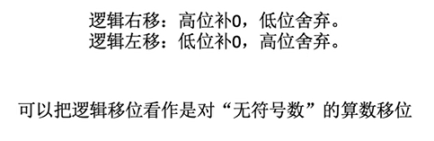

# 数据的表示和运算

## 数制与编码

### 进位计数制及其转换


#### r进制转10进制


#### 10进制转r进制

整数部分**除基取余**，倒序排列


小数部分**乘基取整**，顺序排列


#### 真值和机器数

真值就是人们实际中使用的带正负号的数

机器数是该真值在机器中存储的数


### 定点数


**定点数**：小数点位置固定，也就是常规计数

**浮点数：**小数点位置不定，也就是使用科学计数法

下面主要先介绍定点数的一些分类

#### 无符号数

整个机器字长全部的二进制位**均为数值位**，**没有符号**位，相当于是数的绝对值

n位的无符号数的二进制表示范围就是0~$2^n-1$ 

一般来说，只有无符号的整数，没有无符号的小数

#### 有符号数的定点表示

有符号数第一位是符号位，剩余部分是数值部分，也称**尾数**

一个定点小数的整数部分和小数部分需要分开保存

定点整数默认小数点在最低位

定点小数的小数点在最高位(隐含在符号位后面)


##### 原码

用尾数表示真值的绝对值，符号位0/1表示正/负

整数：**从右向左**，分别是2^0^到2^n-1^ ，最左侧是符号位

**整数真值范围是-(2^n^-1)~(2^n^-1)，而且有+0和-0两种形式**

小数：**从左向右**，最左是符号位，然后分别是2^-1^到2^-(n-1)^ 

**小数的范围是-(1-2^-n^)~1-2^-n^，0也有+0和-0**


不足要补0


##### 反码

若原码符号位为**0**，则反码与原码**相同**

若符号位为**1**，则符号位不变，**数值位全取反**

反码的范围也是-(2^n^-1)~(2^n^-1)，包含-0和+0


##### 补码

正数的补码就是原码

负数的补码是反码+1


对于补码来说，真值0只有1种表示形式，这是因为10000000(即-0)求补码之后会得到1 00000000，多出1位，首位会溢出，剩下的与+0一样


所以说就没有-0了，**定义1000 0000为 -2^7^**

所以说补码的范围与原码和反码不同，**为-2^7^~2^7^-1**

**对于小数，-1~1-2^-n^，多表示了一个-1**


补码运算便于处理减法，补码求法的由来：原码加反码会得到1111 1111 再+1就会得到1 0000 0000也就是模的值，所以反码+1就是原码的补数


**当补码进行加法的时候，符号位也参与运算**

##### 移码

把补码的符号位取反。注意，**移码只能表示整数**

表示范围和补码一样


移码的作用：把移码看作一个无符号数，则当真值增大，移码就增大，**便于比较大小**


（这里的移码是当作有符号整数来计算了）


#### C语言的定点整数

C语言里的定点数全都是用补码存储的

##### 强制类型转换


当**无符号数转换成有符号数**，数据存储完全不变(还是原来的补码)，只是把原来的**第一位看作符号位**，根据符号位0/1把补码转换成真值

**有符号数转换成无符号数**，就直接把第一位符号位看作是数值，直接拿**补码当真值计算**


当**长整数变短整数**，先算出长整数的补码，然后**高位直接截断**，剩下的当作补码根据第一位的符号位计算真值


当**短整数变长整数**，判断短整数补码的符号位，向前**补齐n个符号位**，作为长整数的补码(**值不变**)，对于无符号数，当正数看，在前面添0即可


#### 符号扩展和零扩展

由于ALU以及通用寄存器的宽度是固定的，但是不同类型的数据存储长度可能不太一样，所以需要对数据进行扩展


对于无符号整数，只需要在前面补0就行

对于有符号整数，正数在前面添0，负数在前面添1


## 运算方法和运算电路

### 逻辑门电路


**与AND**

只有输入均为1，输出1

**或OR**

输入有一个1就输出1

**非NOT**

取反

**与非NAND**

先与再取反，只有输入都是1，才输出0

**或非NOT-OR**

先或再取反，只有都是0，才能输出1

**异或XOR**

当两个值不一样时，输出1，相同则输出0

**同或XNOR**

对异或取反就行了


#### 优先级

非>与>或


#### 多路选择器MUX

作用：在多个输入数据中，只允许其中一个进入

图形：通常用梯形表示，多个输入，一个输出，一个控制信号(虚线)

若有k个输入，则控制信号的位数m  $\ge log_2k$ bit


#### 三态门

与多路选择器相似，但是只有两种情况

当op是0时，不允许通过，当op是1，就允许通过


三态门还可以在出口处加上非门取反，图像和非门有些相似，但是飞马没有控制信号


### 加法器


加法器要能实现两个n比特数据的加法

既要考虑这两个本位的值，以及来自低位的进位信息，计算出本位和，以及对高位的进位信息

##### 一位加法器

对于本位和：

只要这三个数1的个数是奇数，就说明本位和是1，对这三个数进行异或即可

对于进位：

也就是有两个以上的1时，进位信息为1，否则为0

也就是AB + ((A+B)C)


这就是一位全加器，FA


##### n位加法器

把n个一位全加器串联起来，就可以进行两个nbit数的相加


这种加法器**的进位信息是串行产生的**，运算速度较慢

但是这个加法器输入数据是从两端并行的输入

所以总结起来叫做**串行进位的并行加法器**


###### 并行进位的并行加法器:


也就是为这些展开式设计专用的电路，便于提前接收到后面的一些结果，提前做一些运算

但是为了防止电路过于复杂，层数不易过高一般是4位的CLA加法器

这种加法器的进位信息是并行产生的，更快


#### 带标志位的加法器

由于计算时会溢出，计算机硬件应当能判断

此外，判断结果的符号也很常用，最好也能让硬件直接给出

为此，对加法器增加了许多标志位便于判断


**OF溢出标志(Overflow Flag)**

用于判断**带符号数**的加减运算是否溢出，1代表溢出，0代表未溢出

对最高位进位和次高位进位两个数进行异或


**SF符号标志(Sign Flag)**

符号标志用于判断**带符号数**加减运算结果的正负性，1代表负，0代表正

只用看补码的最高位即可


**ZF零标志(Zero Flag)**

用于判断加减运算结果是否为0，ZF=1代表结果是0，ZF=0代表不是0

判断所有位的结果是否全0 全0说明是0，所以使用或非门即可


**CF进位/错位标志(Carry Flag)**

用于判断**无符号数**加减运算是否溢出，CF=1代表溢出，0代表没溢出

只用判断进位信息的第一个和最后一个，若它们不一样，则溢出，也就是对他俩进行异或


### 算数逻辑单元ALU

ALU是运算器的核心，加法器是ALU的核心


#### ALU的功能


算数运算：加减乘除

逻辑运算：与、或、非、异或、移位等

其它：求补码、直送(完全不处理，直接从输出端输出)等


ALU接收到m比特的由控制器产生的控制信号，对两端的数据进行对应的操作，并输出结果。

若ALU有k个功能，则控制信号的位数 $m\ge log_2k$ bit


#### ALU的电路原理

可以看作是一个多路选择器，把每种功能的电路接到多路选择器上，根据对应的控制信号，输出对应的结果即可


#### ALU图示

ALU的运算数与计算机的机器字长相同

也会有4个标志位ZF、OF、SF、CF分别代表零标志位、有符号数溢出、有符号数正负，无符号数溢出(和上面带标志的加法器一样)

这些标志位会被送到**PSW程序状态字寄存器**中(有的系统也称其为**标志寄存器FR**)


### 定点数的移位运算


移位包括算数移位、逻辑移位和循环移位

#### 算数移位


其实就是改变每个数码的位权，左移就是乘上r，右移就是除以r

可以使用移位运算等价实现乘法和除法


##### 对原码移位

符号位不变，仅对数值位进行移位

对于右移，高位补零，移出的数据就直接舍弃掉，所以精度会有损失。

对于左移，低位补零，超出的还是直接丢弃，这可能会溢出

小数也是同理


##### 对反码移位

对于**正数**来说，反码**和原码一样**，所以移位的方法也一样

对于**负数**来说，其实与原码也相似，但是注意**补位的数据是1**


##### 对补码移位

正数和原码也相同

对于负数，由于补码是反码加1得来的，加1时会产生进位，把相连的1再反转一次，所以补码的尾部的连续0直到第一个1，这部分是和原码相同的，这部分的左侧是未改变的反码，所以与反码相同

所以说**右移的时候与反码相同，补1**；**左移的时候与原码相同，补0**

**其实说到底就是让左移是真值乘以2，右移就是让真值除以2**，但是可能会产生溢出或精度丢失


#### 逻辑移位

逻辑移位就是可以直接看作是原码的移位，但是符号位也跟着一点

也就相当于是对**无符号数的算数移位**



#### 循环移位

在移动时，移出的数据不丢弃，而是放到另一端


还有带**进位位**的循环移位，就是相当于多了一位移动的空间，区别不大

(进位位CF，是用于存放进位信息的，可以实现超过8bit的加法，可以得到正确的结果)


### 定点数加减运算


一般来说，进行加减运算只用原码和补码，是不用反码的

#### 原码的加减

如果直接对原码进行加减，很可能得到错误的答案，所以要根据两数的符号进行分类进行

两正相加就直接数值相加取正数

两负相加，就数值相加取负

正负相加，就让数值大的减数值小的，符号与原理数值大的数相同


对于减法，就把减数取反，就可以转换成加法了

两个同号的数相加时可能会产生溢出，需要注意


#### 补码的加减


两数加减的补码与两数补码的加减相同(带符号位进行计算)
$$
[A+B]_补 = [A]_补 +[B]_补
$$

$$
[A-B]_补 = [A]_补 +[-B]_补
$$

对于$[-B]_补$，它其实就是B的补码带着符号位一起取反，然后再加1


这样将两个数的补码加减后，就得到了结果的补码，再将结果转换成真值即可

但是注意还是会产生**溢出**


##### 溢出判断

溢出分为上溢出和下溢出

只有正数+正数会产生上溢出：正+正=负

负数+负数才会产生下溢出：负+负=正


###### 采用1位符号位(只看符号位)


$A_S$、$B_S$代表两个加数的符号，$S_S$代表结果的符号

则溢出表达式为
$$
V = A_S B_S \overline{S_S} +\overline{A_S B_S} S_S
$$
当V=1，说明溢出了，V=0则没溢出

**也就是两个加数符号相同，但是结果与其不同，说明溢出了**


###### 采用1位符号位(看符号位进位和数值位进位)


$C_S$是符号位进位，$C_1$是数值位最高位的进位

| 溢出类型 | $C_S$ | $C_1$ |
| :------- | ----- | ----- |
| 上溢出   | 0     | 1     |
| 下溢出   | 1     | 0     |

当符号位进位和数值最高位的进位不同时发生溢出
$$
V = C_S \oplus C_1
$$

###### 采用双符号位

正数符号位为00，负数符号位为11（只是计算的时候有两个，**实际存储还是1个**）

若结果的符号位为01则上溢，为10则下溢


双符号位补码又称模4补码，单符号位补码又称模2补码

#### 无符号数的加减运算


**加法**：就直接按位相加即可

**减法**：

与有符号数类似，需要转换成加法来计算，也就是把**减数转换成它的补数**，再与原来的被减数**相加**，就是结果了

求补数其实就是求模256同余的数，和补码求法很像，就是要**把所有位都取反，然后+1**


##### 判断溢出

直接手算判定很简单，结果超出 0~2^n^-1 这个范围，则溢出

计算机判别：

**加法**：最高位产生**进位**1，说明**上溢出**


**减法**：最高位的进位为0(也就是**没有进位**)，说明发生了**下溢出**


#### 补码加减的运算电路

只需要对原有的加法器进行一些拓展就可以进行补码的加减运算了

最加数B处增加了一个多路选择器，接收Sub控制信号，Sub=1时代表减法，0代表加法

当Sub=0时，直接把B的数据输入 加法器

当Sub=1时，需要把B的数据全部取反，输入加法器，而且此时来自低位的进位Cin也要置为1（它与Sub相连）


而且也可以实现无符号数的加减法运算


##### 带符号位的补码加法器

与之前加法器的符号位没有区别

注意一下CF的实现原理，它是$C_{in}$和$C_{out}$进行异或的结果，

这是因为加法的时候，最高位进位为1发生溢出，而此时$C_{in}$为0，

减法的时候，最高位进位为0发生溢出，而此时$C_{in}$为1，

所以对它们异或即可判断溢出


### 定点数的乘法


#### 原码的1位乘法

假设机器字长为n+1，符号位为1位，求它们的乘积xy

符号位先单独处理
$$
符号位 = x_s \oplus y_s
$$
然后对数值位进行乘法计算

首先通用寄存器X要存被乘数，乘商寄存器刚开始存放的是乘数，刚开始ACC也清零


然后判断MQ里当前位置(最低位)的数，若是1则ACC加上X里的被乘数，若是0 则加0


然后让ACC和MQ整体**逻辑右移**(左边补0，**符号位也要移动**)


重复上述过程，拿MQ当前的最低位乘以X的值加到ACC上，然后ACC和MQ整体右移，直到MQ的最低位是原来乘数的符号位就结束

也就是机器字长n+1位数值位n位的数乘，上述操作重复n次

最后修改符号位，改成原来符号位的异或


由于补码乘法一定要用双符号位，所以原码乘法为了记忆就也用双符号位吧


最好在计算出来真值后写出原码

以上是使用小数乘法举例，整数乘法相同，就是注意小数点的位置不同即可

> **当乘积的高33位不全是0或全是1，说明溢出了**
>

#### 补码的1位乘法


补码运算主要要注意：移位采用算数移位(**符号位不动**，右移补的和符号位相同)，符号位也参与计算

在MQ多了一个辅助位，在原来寄存器的后面，会存储上一轮被移出的最低位

所以MQ有n+2位，与此同时ACC和X也变为了n+2位，在前面多一位，用于实现双符号位的补码运算

最后一轮数值位完成后，**最后还有一次加法，但是不移位**


下面是具体流程

首先ACC置0，X存入双符号位的被乘数补码，MQ的前n+1位放入单符号位的乘数补码，n+2位也就是辅助位 置0

先判断**辅助位减最低位**(MQ的n+1位)的值

- 若是1，则ACC加上$[x]_补$
- 若是0，则ACC加上0
- 若是-1，则ACC加上$[-x]_补$

带符号一起计算补码的加法，现在ACC就是计算结果

根据现在ACC结果的正负性(开头是11就负)，ACC和MQ整体**算数右移**一位(注意正负数左边补的数不同，而且**ACC的符号位不动**)

总共n轮加法和算数右移，n轮结束后，

**再判断辅助位减最低位的值**，ACC加上对应的数，**但是不移位**

（最后一次时，最低位其实就是原来乘数的符号位，所以才说符号位也参与运算）


### 定点数的除法

> ***注意，对于定点小数除法，被除数的绝对值一定得大于除数，因为定点小数表示不了大于1的数，所以说如果第一步得到的商是1的话，会直接停止运算。***


手算方式如下


#### 原码的除法(恢复余数法)


符号也是单独处理，对两数的符号位进行异或

下面就只考虑数据的绝对值，当作正数来计算(符号位也改为0)


最开始，ACC存储被除数(也可以看作是商0时的余数)，通用寄存器X存储除数，MQ存储商，先置为0


然后看MQ的最低位，先假定其为1，此时先让ACC减去y(也就是加上$[-y]_补$(也就是带上符号位取反+1) )


判断此时ACC结果的符号位

- 若是1,说明结果是负数，代表此处的商不能为1，需要把ACC复原，也就是再加上y，然后把商改回0
- 若是0，说明结果是正数，说明对了，不用修改

然后把此时的ACC和MQ看作整体，统一逻辑左移(右边补0，符号位也一起移动)


然后重复上述操作，直到n位的商全都计算完毕

最后要调整结果，主要是余数要乘上$2^{-n}$ 这是因为它左移了n次，需要变成真正的值

并且判断商的符号位，把符号位改为两数的符号位的异或


手算的话是这样


#### 原码的加减交替法(不恢复余数法)


原来余数出现负数时，可以经过化简，省去恢复余数的过程

发现是**负数**后，**把商改为0后，不用再恢复余数**

**直接左移，但是注意这样下一步就要变为*加上*除数了**

如果是**正数**，就和之前一样，下一步还是要**减去除数**

但是**最后一步如果**发现余数**是负数**，就**要把它恢复(再加上除数绝对值)**，不左移，这样才有正确的结果


#### 补码的除法运算(加减交替法)

大体上与原码的运算是相同的，只有少数区别

补码的符号位要参与运算，被除数/余数，除数均采用**双符号位**

注意刚开始，存储的不是数的绝对值，而是该数据带符号的补码

ACC存储被除数的双符号补码，X存储除数的双符号补码，MQ存储商，刚开始还是0


第一步，先判断加减需要看除数和被除数的符号

- 被除数和除数**同号**，用被除数**减**去除数，**商1**
- 若**异号**，被除数**加**上除数，**商0**

把数据带着符号位加减结果计算出来后，连同MQ的商一起**逻辑左移1位**

然后把新得到数(也就是余数)，当作下一轮的被除数，重复此过程

**直到最后一位时，不要计算直接恒置为1**


最后计算余数时，记得乘以$2^{-n}$


## 浮点数的表示和运算


浮点数是为了在位数不变的情况下增加数据的表示范围


### 浮点数的表示


由阶码和尾数组成，若阶码为E，尾数为M


N是真值.r是进制(一般是2)
$$
N = r^E \times M
$$
阶码E反映浮点数的表示范围及小数点的实际位置

尾数M的数值部分的位数翻译浮点数的**精度**


尾数给出一个小数，而阶码就是小数点前移或者后移的位数


#### 浮点数尾数的规格化

要求尾数数据的第一位必须是有效数据(二进制也就是1)，且符号位不变

当第一个数据第一位不是1时，要把数据左移，同时阶码减一，也就是**左规**


当运算后的尾数数据过大时(发生溢出时)，需要进行右移，同时阶码加一，也叫**右归**

使用**双符号位可以很方便的判断溢出**，而且只需要右移一次就可以变为正确的值


#### 规格化浮点数的特点

如果对使用**原码**表示的尾数进行规格化：

- 正数一定是0.1***的形式，最大值为0.1111，最小值为0.1，所以正数尾数的表达范围是
  $$
  \frac{1}{2} \le M \le (1-2^{-n})
  $$

- 对于负数一定是1.1***，最大值是1.10000，最小值是1.11111，所以负数尾数的范围是
  $$
  -(1-2^{-n}) \le M \le -\frac{1}{2}
  $$

如果使用**补码**进行尾数规格化：

- 对正数来说没有区别，仍然是0.1***的形式，最大值为0.1111，最小值为0.1，所以正数尾数的表达范围是
  $$
  \frac{1}{2} \le M \le (1-2^{-n})
  $$

- 对于负数一定是**1.0*****，最大值是1.011111，最小值是1.000000，所以真值的范围是
  $$
  -1 \le M\le -(\frac{1}{2}+2^{-n})
  $$
  

**注意负数补码尾数规格化是数值第一位必须是0，别忘了阶码也要修改**


**浮点数的溢出：**


正下溢和负上溢是浮点数能表示的最小小数溢出了，此时可以把它认为是0


### IEEE754


移码：真值+偏置值(一般来说偏置值取$2^{n-1}$,此时移码就是 对应补码的符号位取反)

偏置值可以取其他值，对于IEEE来说，偏置值取$2^{n-1}-1$


#### IEEE754标准

数据首先是1位数符，然后是阶码和尾数，类型不同位数也不相同


阶码使用移码(偏置值是$2^{n-1}-1$，注意此时的移码全1($-2^{n-1}$)和全0($-(2^{n-1}-1)$)用于特殊用途，一般不表示真值)

尾数使用原码表示(最高位是1，但是只保存小数点后面的数据，所以相当于可以多表示一位)


#####   浮点数表示的范围


#### 阶码全0或全1的特殊用途


当**阶码全为0，尾数M不全为0**时，表示非规格化小数，表示$\pm (0.xxxx)\times 2^{-126}$(这是对单精度，其实就是隐含最高位变为了0)

当**阶码全为0，尾数全为0**时，表示真值$\pm0$


当**阶码全1，尾数全为0**时，表示无穷大$\pm \infty$ 

当**阶码全1，尾数不全为0**时，表示非数值，NaN


### 浮点数的加减运算


一般实际卷子上的运算不使用IEEE754，而是要先按要求，把对应数据化成对应的形式，然后再按照下述步骤操作 


#### 对阶

让阶数小的向阶数大的靠齐，阶码变大后尾数也右移

#### 尾数加减

把对好阶的尾数进行加减法

#### 规格化

把结果重新规格化，左规或右规

#### 舍入

根据要求的有效尾数，进行舍弃或者进位(看要求，可能是四舍五入，也可能直接舍)


#### 判溢出

判断溢出，根据要求，看**阶码**有没有超过范围(阶码溢出才是真溢出，尾数溢出不一定会真的溢出)

#### 实际例子


### 浮点数的强制类型转换


double的尾数位数最多是52位，但是可以无损表示53位的尾数，这是因为IEEE754会有一个隐含的1省去不写


所以32位的数据向double转换时是无损的，而64位向double转换就需要舍入了

float尾数有23位，最多表示24位尾数，大于的话也需要舍入

int转float不会溢出，但是可能损失精度

而float转int既可能溢出，也可能损失精度(这是因为int不能表示小数)


### 数据的存储和排列

#### 数据的大小端模式

最高有效字节(最高位的一个字节)是MSB，最低有效字节(最低位的一个字节)是LSB

**大端方式**就是：高位字节存储在地址的低位，低位字节存储在地址高处(符合人的阅读习惯，从左到右)

**小端方式**就是：低位字节存储在地址的低位，高位字节存储在地址高位(便于机器存取)


#### 数据的对齐存储

计算机一般是**按字节编址**，也就是一个字节是一个地址

而**寻址**通常支持**按字、按半字、按字节**寻址

(**字与存储字长相同**，按字寻找就是指给每个字一个编号，查找字的编号进行寻址，通常要与字节编址进行转换，像32位的字地址只需要逻辑左移2位，就变成了相应的字节地址)


**每次访存只能读/写一个字**

边界对齐就是为了减少访存次数而产生的，也就是尽量把一整个数据存储在同一个字中


对于C语言来说，采用的就是边界对齐方式，特别是存储结构体时

如

```c
struct A{
    int a;
    char b;
    short c;
}
struct B{
    char b;
    int a;
    short c;
}
```

在32位的计算机上，A的大小是8字节，而B的大小是12字节
