# 中央运算器

## CPU的功能和基本结构

### CPU的功能

1. **指令控制**

   完成取指令、分析指令和执行指令的操作，也即**程序的顺序控制**

2. **操作控制**

   一条指令往往由多个操作信号组合实现，**CPU管理并产生**由内存取出的每条指令的**操作信号**，把各种操作信号**送往相应的部件**，从而**控制部件按照指令的要求进行动作**

3. **时间控制**

   对各种操作进行时间上的控制，时间控制要**为每条指令按时间顺序提供应有的控制信号**

4. **数据加工**

   也就是对数据进行算数和逻辑运算

5. **中断处理**

   对计算机运行过程中出现的异常情况和特殊请求进行处理

#### 运算器和控制器的功能

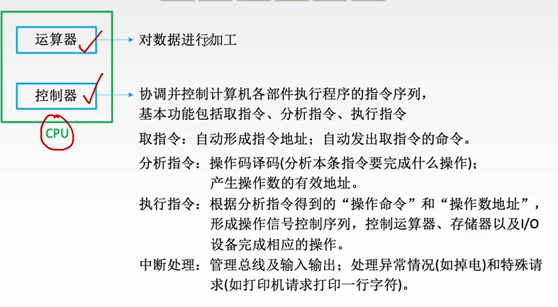

**运算器**：对数据进行加工

**控制器：**协调并控制计算机各个部件执行程序的指令序列(取指令、分析指令、执行指令)

- 取指令：自动**形成下一条指令地址**；自动**发出下一条取指令命令**
- 分析指令：操作码**译码**；**产生操作数的有效地址**
- 执行指令：根据分析指令得到的 *操作命令* 和 *操作数地址* ，**形成操作信号控制序列**，控制运算器、存储器以及I/O设备**完成相应操作**
- (每执行完一条指令就检查)中断处理：管理总线及输入输出；处理异常情况(掉电、不合规的运算)和特殊请求(打印机请求打印)

### CPU的基本结构

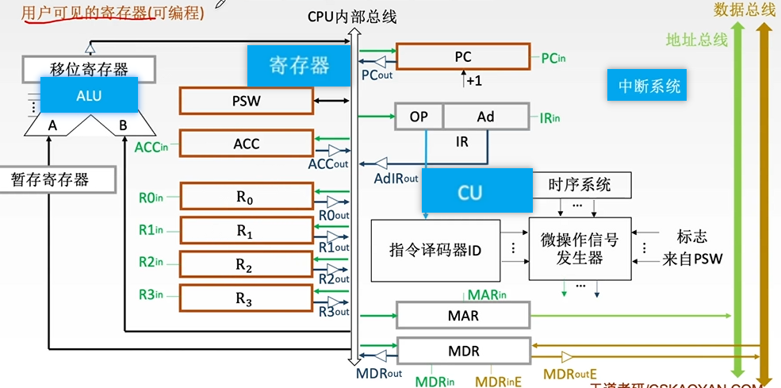

棕色是对用户可见的寄存器，灰色是对用户不可见的

图中的终端系统暂时还未介绍

#### 运算器的基本结构

此图采用的是**CPU单总线方式**的示意图，还有一种是**专用数据通路**方式

##### 算数逻辑单元ALU

主要功能是进行算数/逻辑运算

##### 通用寄存器组

如AX、BX、SP等

用于存放操作数和各种地址信息

AX这种可以被分为AH和AL来使用

其中SP是**堆栈指针**，用于指示当前进程栈顶的位置

> ### ALU与寄存器数据的传送
>
> #### 专用数据通路方式
>
> 每个寄存器都跟ALU相连，假设有一个寄存器n位，那每一个寄存器就要和ALU的一端有n根线(图中简化成1个箭头了)
>
> 但是直接相连可能会导致ALU同时接收到很多数据，所以需要**多路选择器**，每次根据控制信号选择确定的数据读入
>
> 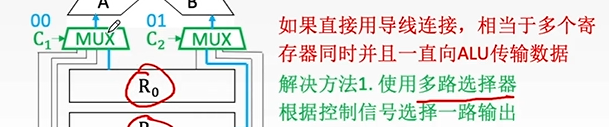
>
> 或者使用**三态门**，原理也类似
>
> 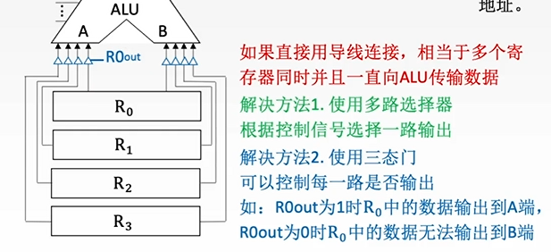
>
> 优点：性能高，不会冲突
>
> 缺点：结构复杂，硬件量大，不易实现
>
> #### CPU内部单总线方式
>
> 在CPU内部设置一个总线，所有数据都通过这个总线传送
>
> 每个寄存器都有三态门来选择是否读入或输出到总线
>
> 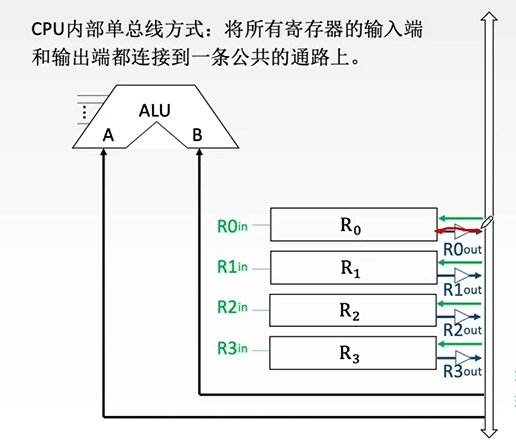
>
> 优点：结构简单，便于实现
>
> 缺点：数据传输有较多冲突，性能较低
>
> ##### 解决冲突
>
> 若直接采用上图，当两数相加时，ALU不能同时读到2组数据，导致运算不能成功
>
> 所以需要在一端添加**暂存寄存器**，先把数据存储进去，然后再让另一个寄存器发送数据，这样就能进行两个数据的运算了
>
> 
>
> 除此之外，在ALU的输出端也需要一个暂存寄存器，当信号稳定时再输出结果
>
> 

##### 暂存寄存器

用于**暂存从主存读来的数据**，这个数据**不能存放在通用寄存器**中，否则会破坏器原有内容(也就是通用寄存器中存储的数据是未使用的，不能覆盖)

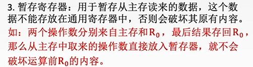

还可以对暂存寄存器进行一些改造，让其变成累加寄存器或者移位寄存器，累加寄存器也可以单独定义

##### 累加寄存器ACC

是通用寄存器，暂存ALU的结果信息，用于实现加法运算

##### 程序状态字寄存器PSW

也叫标志寄存器FR

存储ALU算出来的标志信息，如OF、SF、ZF、CF等

##### 移位器

对运算结果进行移位

##### 计数器

用于控制乘除的操作步数

#### 控制器的基本结构

##### 程序计数器PC

用于指出下一条指令在主存中的存放地址。CPU是根据PC的值取指令的

PC一般会有自增功能(但是有的设备是交给ALU来实现)

##### 指令寄存器IR

用于保存当前正在执行的指令

地址码会传到总线

操作码会传给**指令译码器**

##### 指令译码器ID

译码器根据操作码，向控制器确定下一步该进行的信号

##### 微指令信号发生器

根据译码器的输出，判断应该执行的一系列微操作信号

但是微操作执行需要先后顺序，这通过**时序系统**来进行控制

有些操作还会受PSW的一些标志信号影响

##### 时序系统

产生各种时序信号

##### 存储器地址寄存器MAR

存放要访问的主存单元的地址

在导通后，根据地址在**地址总线**上查找对应的地址单元

找到数据后，会通过**外部的数据总线**放入MDR中

##### 存储器数据寄存器MDR

MDR有两个输入控制信号

$MDR_{in}$ 是CPU内部总线输入数据是否有效

 $MDR_{inE}$是外部数据总线输入数据是否有效

输出也有2个

$MDR_{out}$ 有效时，会输出数据到CPU内部总线

 $MDR_{outE}$有效时，会输出数据到外部数据总线

## 指令的执行过程

### 指令周期

**指令周期**：CPU从主存取出一条指令，并执行一条指令，所需的全部时间

**指令周期**常用若干**机器周期**表示，机器周期又叫**CPU周期**

一个机器周期，又包含若干个**时钟周期**(CLK也称**节拍、T周期或CPU周期**，他是CPU操作的**最基本单位**)

一个机器周期就是完成一个子工作时间，若指令的每个子工作花费的时间都相等，则称为是**定长机器周期**，否则是**不定长的机器周期**

> 下面以**定长机器周期**(电路简单)为例，记录一些具体的指令周期的实现
>
> 一个指令会包括取指周期、间址周期、执行周期、中断周期
>
> 其中间址周期可能0，1，多个都有可能
>
> 每一个时钟周期最多可以通过一个**微命令**完成一个**微操作**
>
> 当时当几个微操作间**不冲突**时，它们可以**并行执行**，
>
> 所以一个时钟周期，**通过并行可能会完成多个微操作**
>
> 每个周期的时钟周期数按最大的统一，若操作实际需要的较少，**在机器周期的末尾进行操作**(也就是前面的空出来)
>
> 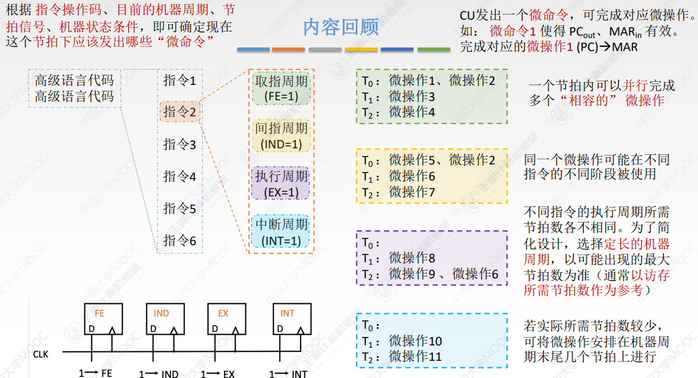

对不同指令来说，机器周期数可以不等，每个机器周期内的节拍数也可以不等，但是电路设计会较复杂

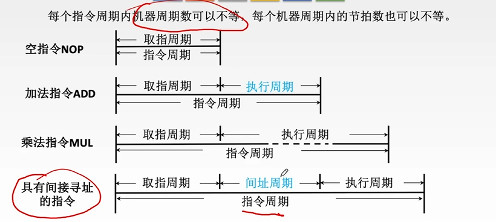

### 指令周期的数据流

取指、间址、执行和中断这四个周期都有可能有CPU访存操作，但是目的不同

**取指周期**FE：取指令

**间址周期**IND：为了取有效地址

**执行周期**EX：为了取操作数

**中断周期**INT：为例保存程序断点

#### 取指周期

1. 把当前地址送入MAR中，记做：$(PC)\ -> MAR$ 

2. CU发出控制信号，经控制总线传到主存，这里是读信号，那就是

   $1->R$    (R=1代表读信号)

3. 将MAR所指的主存地址的内容通过数据总线送入MDR，记做$M(MAR)->MDR$ 

4. 将MDR中的内容送人 IR，记做$(MDR)->IR$

#### 间址周期

有的指令会有这个周期，不是都有

1. 把当前指令的地址码送入MAR,，记做：$Ad(IR)->MAR$
2. CU发出读控制信号，就是$1->R$
3. 根据MAR指明的地址，把数据送入MDR记做$M(MAR->MDR)$
4. 将有效地址送入指令的地址码字段，记做$MDR->Ad(IR)$

#### 执行周期

不同指令的操作不同，所以**没有统一的数据流向**

#### 中断周期

中断：暂停当前任务去其它任务。为了恢复当前任务，**需要保存断点**

一般使用堆栈保存断点，这里用SP表示栈顶，**假设SP指向栈顶元素，则要先修改指针，再存入数据**

1. CU控制将SP减1，把修改后的地址(SP-1)送入MAR

   记做$(SP-1)->SP$ ，$(SP)->MAR$

   这是为了确定PC要写入的地址，先把这个地址送入MAR，然后才能写

2. CU发出控制信号，启动主存做写操作，记做：$1->W$  (W代表写)

3. 将当前的断点(PC的值)送入MDR，记做$(PC)->MDR$

   此时断点就保存了，该去执行中断处理程序了

4. CU控制将中断服务程序的入口地址(由向量地址形成部件产生)送入PC，记做$向量地址->PC$

### 指令执行方案

#### 单指令周期

对所有指令都采用相同的执行时间来完成

也就是所有指令的执行时间都和最长的一样

是**串行执行**

效率低，但设计简单

CPI=1

#### 多指令周期

对不同指令选用不同的执行步骤来完成。

可以选用不同个数的时钟周期来完成不同指令

指令之间也是**串行执行**

效率稍高，但是硬件更复杂一些

CPI>=1

#### 流水线方案

在每个时钟周期启动一条指令，

尽量让多条指令同时运行，

各自处于不同的执行步骤

**指令间并行执行**

当指令很多时，CPI趋向于1

## 数据通路

CPU可视为由**数据通路**和**控制部件**两大部分组成

***数据在指令执行过程中所经过的路径，包括路径上的部件，称为数据通路***

> 数据通路由若干**组合逻辑元件**和**时序逻辑元件**连接而成
>
> #### 组合逻辑元件（操作元件）
>
> **不含存储**信号的记忆单元，**不受时钟信号的控制**，输入输出间没有反馈通路，**信号单向传输**
>
> 如**加法器、ALU、译码器、多路选择器、三态门**
>
> #### 时序逻辑单元（状态元件）
>
> 输出不仅与该时刻的输入有关，还和之间的输入有关，所以时序电路必然**包含存储信号**的记忆单元。**必须在时序节拍下工作**
>
> 主要是**各类寄存器和存储器**：通用寄存器组、程序计数器、
>
> 状态/移位/暂存/锁存寄存器等

数据流通一共三种：**寄存器之间**，**寄存器与主存**之间，**寄存器与ALU**之间

数据通路：数据在功能部件之间的传输的路径（信息从哪开始，经过哪些部件，传送到哪里）

所有数据通路，都是由控制部件(主要是**微操作信号发生器**)产生的**控制信号**建立的

控制信号分两种：信号是否可以**进入**寄存器；信号是否可以**流出**寄存器

CPU内部**单总线结构**:在同一时刻，**只允许一对**部件进行数据传送

CPU内部**多总线结构**:与单总线几乎一样，就是多了几根总线，在同一时刻，只**允许多对**部件进行数据传送

**专用数据通路方式**：只要两个部件会有数据流动，就建立一条专用的数据t通路

下面进行介绍

### 单总线结构

内部总线：CPU内部连接各寄存器及运算部件之间的总线

系统总线：CPU、内存、通道和各类I/O接口间相互连接的总线

#### 寄存器之间的数据传送

以把PC送入MAR为例，传送操作的流程和控制信号为：

(PC)->Bus         $PC_{out}$有效，**PC内容传送到总线**

Bus->MAR			$MAR_{in}$有效，**总线的内容送到MAR**

> 
>
> 寄存器之间传输，只需要一个out信号打开，传输到总线，然后另一个in信号打开，接收，就完成了

#### 主存与寄存器之间的数据传送

以CPU从主存中读取指令为例，传送操作的流程和控制信号为：

(PC)->Bus->MAR			$PC_{out}$和$MAR_{in}$有效，现行**指令地址存入到MAR**

(结束后，上述两信号撤销，让总线重新空闲)

**1->R**									CU发送读命令(通过控制总线发出)

MEM(MAR)->MDR		  $MDR_{inE}$有效，主存中的指令读入到MDR

MDR->Bus->IR				 $MDR_{out}$和$IR_{in}$有效，指令读入到IR

#### 执行算数或逻辑运算(寄存器->ALU)

以加法指令为例，微指令操作序列和控制信号为：

一个操作数已经在ACC中，指令也已读入IR

1. Ad(IR)->Bus->MAR							$MDR_{out}$和$MAR_{in}$有效(也可以使用IR和MAR)

2. **1->R**														CU发送读命令(通过控制总线发出)

3. MEM(MAR)->数据线->MDR		  $MDR_{inE}$有效，主存中的指令读入到MDR

4. MDR->Bus->Y									$MDR_{out}$和$Y_{in}$有效，操作数存入暂存寄存器Y

5. (ACC)+(Y)->Z									 $ACC_{out}$和$ALU_{in}$有效，CU向ALU发送加命令，ACC把数据也传入ALU，与Y一起，进行加运算，结果输入到暂存寄存器Z

   > 4、5这两步操作是因为，ALU必须两端数据都有效才有正确结果，但是单总线同时只能输出一个数据
   >
   > 所以需要**暂存寄存器**存储一个操作数
   >
   > 如果使用多总线方式，可以不用设置

6. Z->Bus->ACC 									$Z_{out}$和$ACC_{in}$有效，当结果的数据稳定后，通过内部总线存入到ACC

> 每个时钟周期可以完成一个微操作

#### 例题

##### 分析指令功能和指令周期

由于是ADD ($R_0$), $R_1$

所以是是把$R_1$的值加到主存的$R_0$地址处，也就是目的操作数采用了寄存器间接寻址

> 本题不是X86的汇编，使用的()代表在主存地址

所以需要把$R_0$的值读出来，在主存中找到对应值，与$R_1$计算后，写回主存

##### 取指周期

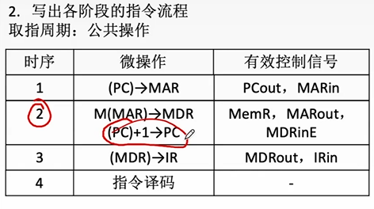

##### 间址周期

##### 执行周期

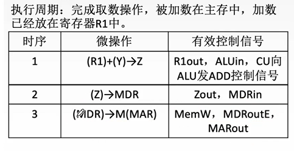

### 专用通路结构

专用通路就是把所有需要数据传递的部件，都设计了一条通路用于传输数据

每个通路上都有控制信号，用于控制哪些部件进行传递数据

如下图

下面举一些例子

#### 取指周期

与单总线的实现还是比较类似的

## 控制器的工作原理

> 一段代码会被转换成若干指令
>
> 一个指令分为若干周期，称作机器周期，其中间址周期可能有多次
>
> 每个周期有若干节拍(时钟周期)，每个节拍可以串行完成一个微操作或并行完成多个微操作
>
> 对应**定长机器周期**的系统，器每个机器周期长度相同，长度较短的那些，在机器周期的后部进行微操作
>
> 对于所有的指令，其取指周期、间址周期和中断周期的微操作是完全一样的
>
> 

### 硬布线控制器的设计

CU是控制器的核心部件，下面介绍一下CU需要的输入和输出

#### CU的输入和输出

1. 首先是指令寄存器传来的n位操作码，通过指令译码器ID后传入CU，表明当前是什么指令
2. 然后是FE、IND、EX、INT四个触发器，分别表示当前出去取指、间址、执行还是中断周期
3. 还有各种标志信号，主要来自PSW、ACC，也可能来自I/O设备或者主存
4. 然后是通过节拍发生器传来的节拍信号，也就是表明现在是当前周期的第几个节拍，以便确定应当的微操作

- 输出信号就是当前应当执行的微命令的控制信号

  例如$(PC)->MAR$ $C_1=FE \cdot T_0$ 

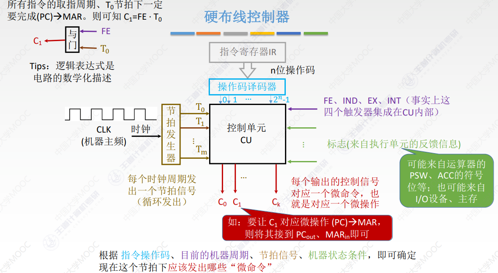

所以**只要我们能写出根据输入得到输出的逻辑表达式，那么电路也就好设计了**

#### 设计步骤

##### 分析每个周期的微操作序列

也就是分析每个指令，在每个阶段会用到的微操作

> 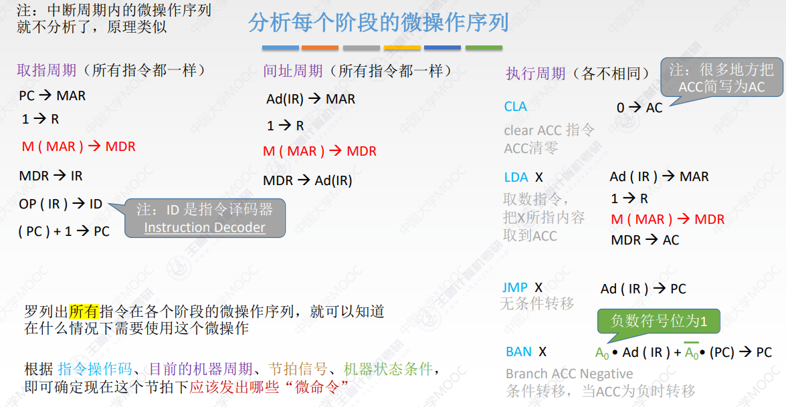
>
> 把所有指令的微操作都罗列出来就行了

##### 选择CPU的控制方式

> 为了简单，只考虑定长机器周期，一个机器周期3个节拍

##### 安排微指令操作时序

如果在3个节拍内完成这个周期的所有操作

安排操作时序的原则

- 微操作的先后**顺序不能随意更改**

- **被控对象不同**的微操作，尽量在一个节拍内完成

  也就是说这两个微指令的对象不一样，可以并行，要在一个节拍

- 占用**时间较短**的微操作，尽量在一个节拍内完成

  主要是指全部都是寄存器间的操作

> #### 取指周期
>
> 
>
> 先写出所有微操作，然后找到各微操作是否有依赖关系
>
> 确定可能的顺序
>
> 如果涉及到访存，那就只能让它独享一个时钟周期
>
> 如果全在寄存器里，且是可以顺序执行的，那么可以安排在一个时钟周期
>
> #### 间址周期
>
> 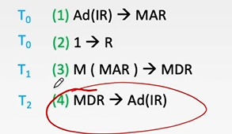 像(3)和(4)就不能在同一个节拍
>
> #### 执行周期
>
> 每个指令在执行周期的微操作并不相同，所以每个都要设计
>
> 把指令分为非访存指令和访存指令，这是因为访存指令可能会有间址，进入到间址周期，而非访存指令不会间址
>
> 

##### 电路设计

确定每个微操作命令的逻辑表达式，然后用电路实现

> ## 设计步骤
>
> ### 列出操作时间表
>
> 列出在四个周期中，T0，T1，T2节拍内可能用到的所有微操作
>
> #### 取指周期FE
>
> 由于所有指令都会有取指，所以几乎全是1
>
> 其中条件状态行的I，代表是否有间址的特征，如果有，下一步会进行间址周期，若没有，会进入执行周期
>
> 对于没有访存的指令来说，不论怎样都不会有间址周期，所以倒数第二行不填，需要访存的指令在有间址特征时需要进入间址周期所以要填
>
> 
>
> #### 间址周期IND
>
> 对于非访存指令，不会进入这个周期，所以都不写
>
> 对访存指令来说，由于可能进行多次间址，所以还要判断这次是否有**间址周期标志**，**如果有，还要再进入间址周期，若没有，进入执行周期**
>
> 
>
> #### 执行周期
>
> 把T0，T1，T2节拍内可能用到的所有微操作和所有指令都列出来，但是指令不同，表也不大相同，这里只有一部分
>
> 
>
> ### 写出操作命令的最简表达式
>
> 根据所有的操作时间表，找到每种微指令的所有出现的情况
>
> 找到逻辑表达式，并化简
>
> 以$M(MAR) \to MDR$为例
>
> 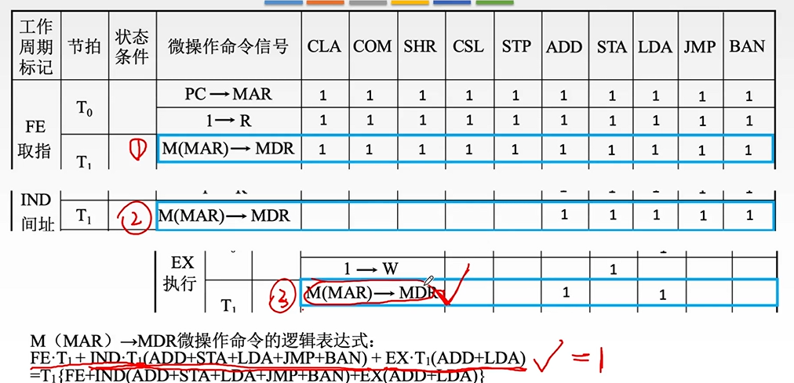
>
> ### 画出逻辑图
>
> 根据逻辑表达式画出电路，以$M(MAR) \to MDR$为例
>
> 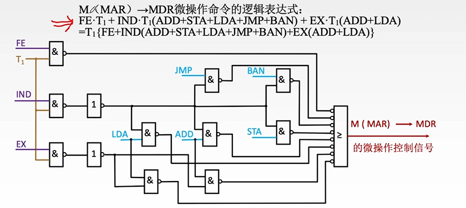

#### 特点

指令越多，实现就越复杂，所以一**般是用于RISC**

扩充指令控制器设计需要大改，所以**扩充指令较困难**

使用纯硬件控制，执行速度很快。微操作控制信号有组合逻辑电路即时产生

### 微指令控制器

> 

#### 微指令控制器的设计思路

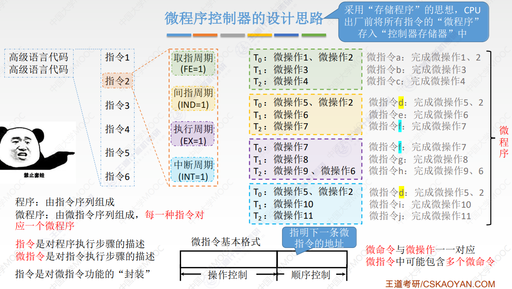

程序：由指令序列组成

**指令**是对程序执行步骤的描述

微程序：由微指令序列组成，**每一种指令对应一个微程序**

**微指令**是对指令执行步骤的描述

> **微命令**与**微操作**一一对应
>
> 但是**微指令**是一个时钟周期所有的操作，**可能对应多个微命令**或者说微操作

微指令的基本格式：nbit的操作控制+mbit的顺序控制(下一条指令在控存中的地址)

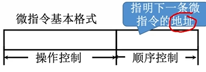

#### 微指令控制器的基本结构

在CU中的部件如下

**控制存储器CM**：用于**存放**各指令对应的**微程序**，一般用ROM制成

**微地址寄存器CMAR：别名$\mu PC$**，接收微地址形成部件送来的微地址，为在CM中读取微指令做准备(类似cache和主存的关系) 

**地址译码器**：把地址码转化为存储单元控制信号

**CMDR：别名$\mu IR$**：用于存放从CM中取出的微指令。他的位数和微指令字长相同

**微地址形成部件**：产生初始微地址和后续微地址，保证微指令连续执行

**顺序逻辑**：根据标志和CLK信息，确定微指令的存放地址

#### 微程序控制器的工作原理

对于取指、间址、中断周期，微指令序列或者说是微程序是一样的，所以在CM中只需要存1份。只有执行周期是每个指令不同的

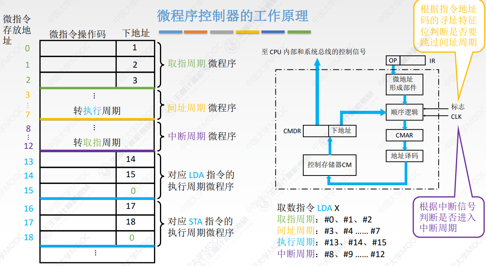

每一段结束后，除了要看最后那个微指令的**下地址**，还要根据**顺序逻辑**接收到的**标志**或**CLK**进行指令跳转

可以说一条指令对应一个微程序，也可以说那一段是一个微程序，或者叫它微程序段

### 微指令的设计

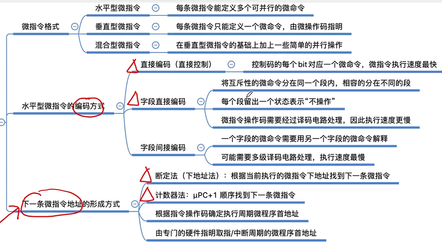

#### 微指令的格式

**相容性微命令**：可以并行完成的微命令

**互斥性微命令**：不允许并行完成的微命令

##### 水平型微指令

一条微指令能定义多个微命令

优点：微程序短(微指令条数少)

缺点：每个**微指令长**，编写微程序较麻烦

##### 垂直型微指令

一条微指令只能定义一个微命令

优点：**微指令短**，简单规整，便于编写微程序

缺点：微程序长，执行速度慢，工作效率低

##### 混合型微指令

在垂直型的基础上增加一些不太复杂的并行操作，微指令较短，仍易于编写；微程序也不长，执行速度加快

#### 水平型微指令的编码方式

也叫微指令的控制方式，他是指如何对微操作的控制字段进行编码，形成控制信号。编码的目的是在**保证速度的情况下，尽量缩短微指令字长**。

##### 直接编码(直接控制)方式

在微指令的操作控制字段中，**每一位代表一个微操作命令**

规定每一位代表的微操作，然后当这位为1，代表该指令会执行这个微操作

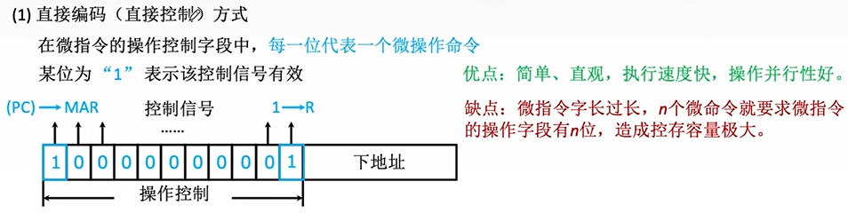

优点：**简单直观，执行速度快，并行性好**

缺点：**微指令字长过长**，会导致控存容量占比过高

##### 字段直接编码方式

把微指令的控制字段分成若干个段，**每段经过译码后发出控制信号**

微命令分段的原则：

**互斥性**微操作分在**同一段**内，**相容性**微命令分**在不同段**内

**每个小段**包含的**信息位不能太多**，否则会增加译码线路的复杂性和译码时间

**每个小段还要留出一个状态**，表示本段不发出任何微命令，所以说3位最大表示7个互斥的微命令，一般用000表示不操作

这样互斥的指令永远不会同时发出，相容性微命令可以并行发出

优点：**可以缩短微指令的字长**

缺点：每个字段都要经过译码电路再发出微命令，**比直接编码方式慢**

##### 字段间接编码方式

一个字段的某些微命令，需要由另一个字段中的某些微命令来解释，而不是靠字段直接译码发出的微命令，所以叫字段间接编码，又称隐式编码

也就是某个字段译码后，不直接发出，还要交给下一级译码器处理，才能发出控制信号

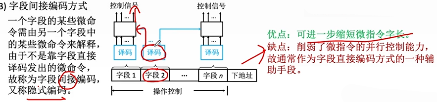

优点：**可以进一步缩短微指令字长**

缺点：**削弱了微指令的并行控制能力**，所以一般作为直接编码方式的辅助手段

#### 微指令的地址形成方式

- 由微指令的**下地址字段**指出

  微指令格式中设置一个下地址字段，由微指令的下地址字段直接指出后继微指令的地址，这种方式又称为**断定方式**

- 根据机器指令的**操作码**形成

  当机器指令取至指令寄存器后，微指令的地址由操作码经**微地址形成部件**形成

- 增量**计数器法**

  (CMAR)+1 -> CMAR，有点像PC

- 分支转移

  

  转移方式是指判别条件；转移地址是转移成功后的去向

  有点像JMP或者条件转移指令

- 通过测试网络

  

  测试网络就是内部的一个电路，根据顺序逻辑接收到的标志信息和当前微指令的信息进行判断地址

- 由硬件产生微程序入口地址

  **第一条微指令地址** 由专门的**硬件**产生(用硬件记录取指周期的微程序首地址)

  中断周期 由**硬件**产生**中断周期微程序首地址**(专用的硬件记录地址)

### 微程序控制单元的设计

#### 设计步骤

1. 分析指令每个阶段的微操作序列

   > 这一步与硬布线控制器的一模一样，都是分析每个阶段需要的微操作

2. 写出对应机器指令的微操作命令及节拍安排

   > 这个原理也和硬布线很相似
   >
   > 设计原则：微操作按序、可并行的并行，短的也放一起
   >
   > 但是在设计完成后有所不同
   >
   > 
   >
   > 首先是每一个节拍看作是一个微指令，每**个微指令之间都需要通过CMAR寻址一次**即$Ad(CDMA) \to CDMA$，指明下一微指令的地址，这**会额外占用一个节拍**
   >
   > 在最后一个节拍的最后，硬布线是把操作码交给**指令译码器ID**
   >
   > 而微程序控制器是把操作码交给**微地址形成部件**
   >
   > 即$OP(IR) \to 微地址形成部件 \to CMAR$ ，用于进入下一个周期
   >
   > 

3. 确定微指令格式

   > 在微指令设计部分讨论过了
   >
   > 主要包括微指令采用何种编码，确定微指令*操作控制*字段的位数
   >
   > 根据CM中存储的微指令总数，确定微指令的*顺序控制*字段的位数
   >
   > 从而确定微指令字长
   >
   > 

4. 编写微指令码点

   > 根据操作控制字段代表的微操作，编写微指令的码点
   >
   > 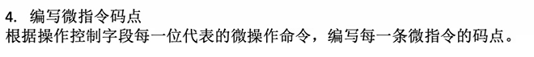

#### 微程序设计的分类

1. 静态微程序设计和动态微程序设计

   

2. 毫微程序设计

   毫微程序设计就是用*毫微程序*解释*微程序*

   

#### 硬布线控制器与微程序控制器的比较

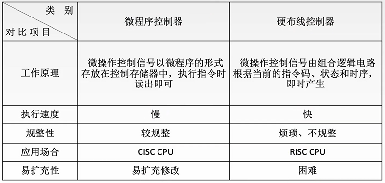

微程序控制器：是把微操作控制信号以微程序的形式**存放在控制存储器中**，执行指令时读出即可

硬布线控制器：把微操作控制信号由组合逻辑电路根据当前的指令码、状态和时序**即时产生**

硬布线比微程序执行速度快

微程序比硬布线更规整

微程序主要用于CISC，硬布线用于RISC

微程序更易扩充

## 异常和中断机制

由CPU内部产生的意外事件称为**异常**，也叫**内中断**

> 异常是在CPU内部检测到的、**与正在执行的指令相关**的同步事件
>
> 若在**执行第i行指令时**，检测到异常，则CPU打断当前程序，转去执行相应的异常处理程序，若异常处理程序可以解决，在处理程序结束后，执行异常返回指令，则重新回到该程序，**再执行第i行**
>
> 若处理程序发现是不可恢复的致命错误，则终止程序。

由来自CPU外部的的设备向CPU发出的中断请求被称为**中断**，也叫**外中断**

> 中断是由外部设备触发的、**与当前执行的指令无关**的异步事件
>
> 若在**第i行指令结束后**(由于中断检测只在指令结束后才检测)，发现一个中断请求信号，则CPU打断当前程序，转去执行相应的中断处理程序，若中断处理程序可以解决，在处理程序结束后，执行中断返回指令，重新回到该程序，**执行第i+1行**
>
> 若处理程序发现是不可恢复的致命错误，则终止程序。

可以发现异常和中断处理的过程其实很相似

### 异常的分类

异常是CPU内部产生的意外事件，分为**硬故障中断**和**程序性异常**

> **硬故障中断**是**硬连线出现异常**引起的。因为它在CPU内部，而且是由指令执行时发现的，所以属于异常
>
> 如：存储器校验错、总线错误等
>
> 
>
> **程序性异常**，也叫**软件中断**，是指**因执行指令引起的异常事件**
>
> 如：整除0、溢出、断点、单步跟踪、非法指令、栈溢出、地址越界、缺页等

如果按照异常发生的原因和返回方式分类，可分为：故障、自陷、终止

#### 故障Fault

在指令执行过程中检测到的异常事件

如：指令译码发现非法操作码、取数据发现缺页缺段、除法发现除数为0等

对于缺页缺段，**处理后可继续执行**，**则返回该指令**继续执行

对于非法操作码、除数为0等，**无法**通过异常处理程序**恢复故障**，所以**直接终止程序**

#### 自陷Trap

是预先安排的一种异常

CPU在执行完自陷指令后，会根据不同的自陷指令进行相应处理，然后**返回到自陷指令的下一行**继续执行

（当自陷指令是跳转时，跳转后就不会回到源程序了）

#### 终止Abort

执行指令过程中发生了**硬件故障**，

如控制器出错、存储器校验错、总线错误等

则**直接终止**

这种错误与故障和自陷不同，不是特定指令发生的，而**是随机产生的**

### 中断的分类

中断是来自**CPU外部**，**与CPU执行指令无关的事件**引起的中断

包括IO设备发送的IO中断(打印机缺纸、键盘输入)，或其它特殊事件(用户强制关闭、定时器到时间)等

> 外部设备通过特定的**中断请求信号线**向CPU发出中断请求
>
> CPU**每执行完一条指令，检测一次中断信号**，如有则进入中断响应周期

#### 可屏蔽中断

可以通过中断控制器设置屏蔽这些中断

#### 不可屏蔽中断

通常是非常紧急的硬件故障，如电源掉电等。不可屏蔽

****

> 故障和自陷属于**程序性异常**(**软件中断**)
>
> 终止和外中断属于**硬件中断**
>
> (终止属于异常)

中断和异常本质上是一样的，但是有所不同

> 异常是在指令执行过程中产生的，而中断和指令无关
>
> 异常的检测由CPU自身完成。中断必须通过外部的中断请求线获得
>
> 无论中断还是异常，都是硬件检测发现的

### 异常和中断的响应过程

异常和中断响应分为三部分，分别是：关中断、保存断点和程序状态、识别异常和中断 并转到相应的处理程序

1. #### 关中断

   保存断点和程序状态时不能被新的中断打断，所以要**停止响应新的中断**

2. #### 保存断点和程序状态

   将**程序的断点**和**程序状态字寄存器PSW的值**保存在栈或特定寄存器中

3. #### 识别异常和中断并转到相应的处理程序

   通过**软件识别方式**或**硬件识别方式**判断当前中断或异常的类型，并传入对应的处理程序

整个响应过程是**不可被打断**的。

中断响应结束后，就开始执行中断响应程序，直到中断返回。

## 指令流水线

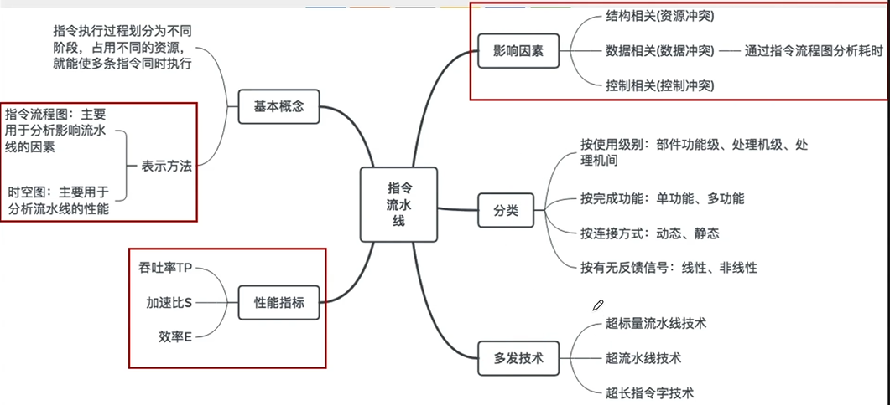

### 指令流水线的基本概念

一条指令的执行过程可以分成多个阶段，根据计算机不同分法可能不同，但大致是：取指+分析+执行

假设这三个阶段执行时间都为t，则以下执行方式执行n条指令的时间分析如下

1. 顺序执行方式
   $$
   T=n\times 3t = 3nt
   $$
   传统冯诺依曼机就采用这种方式，也成为**串行执行方式**

   控制简单，硬件代价小，但是部件利用率低，执行慢

   

2. 一次重叠执行方式
   $$
   T=3t+(n-1)\times 2t = (1+2n)t
   $$
   时间缩短了1/3，利用率提高了

   但是硬件更复杂

   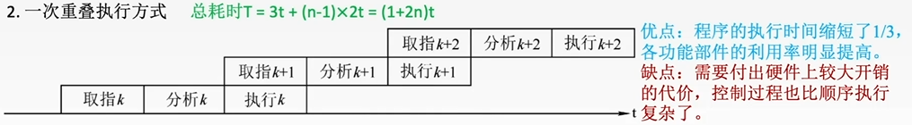

3. 二次重叠方式
   $$
   T=3t+(n-1)\times t = (2+n)t
   $$
   更快了，同一时刻处理器最大同时执行3条指令

   当分的阶段变大，重叠的更多时，效率会更高

   实际上一般分为5个阶段，假设分为x阶段，重叠x-1
   $$
   T=xt+(n-1)t=(x-1+n)t
   $$
   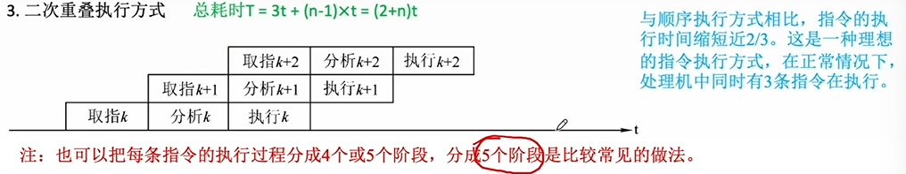

#### 流水线的表示方法

1. 指令执行过程图

   

2. 时空图

   横坐标表示时间，纵坐标表示执行阶段，斜着的代表同一个指令

   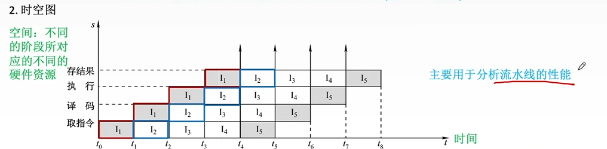

#### 流水线的性能指标

##### **吞吐率TP**

单位时间内流水线所完成的任务数量，或者结果输出数量

一般就是用**单位时间完成的任务数量**表示

设任务数量为n、完成n个任务的时间为$T_k$

则计算流水线**吞吐率TP**的公式为 
$$
TP = \frac{n}{T_k}
$$

> **理想状况下**的时空图如下
>
> 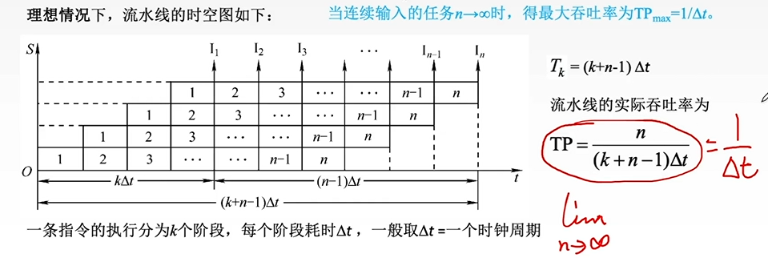
>
> I1之前叫做装入时间，I3之后叫做排空时间
> $$
> TP = \frac{n}{(k+n-1)\Delta t}
> $$
> 当n很大时，TP就接近于$\frac{1}{\Delta t}$ 其中$\Delta t$一般取一个时钟周期，这是在最理想情况下的值

##### **加速比S**

完成同一批任务，**不使用**流水线和**使用**流水线所用**时间的比值**

假设不用流水线的时间为$T_0$使用流水线的时间为$T_k$，则
$$
S= \frac{T_0}{T_k}
$$

> 上面那个例子的实际加速比S为
> $$
> S = \frac{kn\Delta t}{(k+n-1)\Delta t} = \frac{kn}{(k+n-1)}
> $$
> 所以当n很大时，$S_{max} = k$

##### **效率**

流水线**设备的利用率**称为流水线的效率

在时空图中比较方便计算，就是完成n个任务占用的时空区**有效面积**与n个任务所用时间和k个流水线所围时空区**总面积之比**

> 

所以流水线效率R的公式为
$$
E = \frac{n个任务占用的时空区有效面积}{个任务所用时间和k个流水线所围时空区总面积} = \frac{T_0}{kT_k} = \frac{n}{k+n-1}
$$
($T_0$是指不用流水线的时间，也就是摊平了；$kT_k$是指有效的面积(方格数))

当n很大时$E_{max} = 1$ 

#### 指令机器周期的设置

大多数都采用**MIPS的五个周期**，就算有些指令不执行某些周期，也要等待这个周期结束才能下一个周期

为了便于设计，会将每个周期的耗时都相同，**以最长耗时为准**

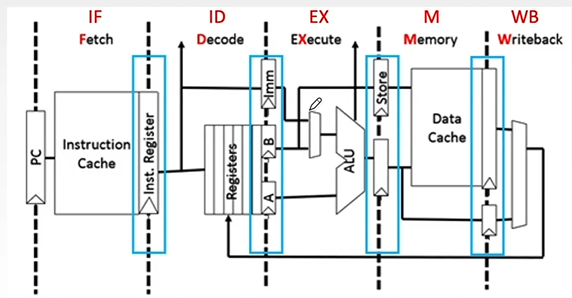

**每个功能段间都需要有**缓存寄存器，也叫**锁存器**，这是为了暂存本功能段的结果，等到对应的时间再输出给下一段

1. **取指令IF**

   通过PC的值去访存获取指令，由于Cache的命中率很高，所以一般是去**Cache取指令**

   把取到的指令存入锁存器

   > 这个与第4段访存访问的Cache不一样，这是**指令Cache**，那是**数据Cache**，所以它们之间不会冲突，可以并行
   >
   > (但是也可能会不命中，只能访问主存，这时流水线会断流)

2. **指令译码ID**

   对于RISC的指令集，所有指令的操作数都**必须来自寄存器**，若不在需要去访存存入寄存器

   根据指令译码结果，把指令中的操作数放入锁存器，供执行阶段使用

3. **执行阶段EX**

   执行阶段把译码阶段的操作数**通过ALU进行处理**，把结果放入锁存器中

   等下一阶段使用，可能会存入Cache，也可能等到WB直接写回

4. **存储M**

   根据指令要求选择是否存入Cache

5. **写回WB**

   根据要求选择是否写回到通用寄存器

   > 本阶段会进行写操作，而第二阶段会进行读操作，这两步同时进行就可能会出现一些冲突

### 指令流水线的影响因素

#### 结构冒险(结构相关、资源冲突)

由于多条指令在**同一时刻争用同一资源**而形成的冲突，称为结构相关

同时访存或者同时访问寄存器就会导致资源冲突

两种解决办法：

1. 让**后一个指令暂停一个周期**
2. 资源重复配置：把**指令和数据存放在不同的存储器**，这样IF和M、ID和WB就不会冲突了

#### 数据冒险(数据相关、数据冲突)

数据相关指的是，在一个程序中，存在**必须等前一条指令执行完，才能执行后一条指令**的情况，那么这两条指令即为数据相关

**在按序执行的流水线中，只会出现写后读RAW冲突**

这个例子中，中间3条指令都会与第一条指令产生数据冲突，但是最后一条不会，因为它在指令译码阶段时，r1已经写回了

**解决办法：**

1. **等待**

   等到数据不会冲突了，再执行后续指令

   > 分为硬件阻塞(stall)和软件插入NOP两种方法
   >
   > 
   >
   > 硬件阻塞由**硬件添加气泡(bubble)**进行等待
   >
   > 
   >
   > 在编译阶段，若发现数据冲突，则在之间**插入空操作nop**，直到不发生冲突

2. **数据旁路技术(转发机制)**

   不从寄存器中读取，之间提前获取前面计算后的需要的值

   > 增加电路，可以直接让ALU的结果送入ALU的输入
   >
   > 

3. **编译优化**

   通过编译器调整指令顺序来解决数据冲突

   > 与空操作比较像，是把后面与这些不冲突的指令先执行，等数据不冲突

   

#### 控制冒险(控制相关、控制冲突)

当流水线遇到转移指令或其它改变PC值的指令二操作断流时，会引起控制相关

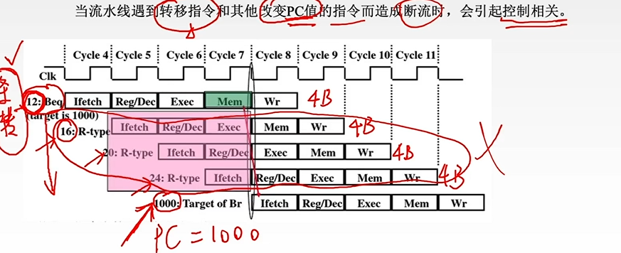

除了转移指令，如函数调用，中断都可能引起控制冲突

>**后续指令必须等转移指令得出结果后才能判断是否执行，所以在转移指令得到结果前(MEM之前)一定是要被阻塞的**

下面主要讨论转移指令的解决办法：

1. 转移指令分支预测

   > 简单预测：永远猜ture或永远猜false
   >
   > 动态预测：根据历史情况动态调整

2. 预取转移成功和不成功两个控制流

   提前把两种情况的指令都提前取出，会让硬件变复杂

3. 加快和提前形成控制码

   进行电路改造，让条件码提前产生

4. 提高转移方向的猜准率

   对第一种方法的优化

### 指令流水线的分类

1. **部件功能级**、**处理机级**和**处理机间级**流水线

   > 根据**流水线使用的级别不同**，流水线可分为部件功能级流水线、处理机级流水线、处理机间级流水线
   >
   > **部件功能级流水线**：把**某个部件细分**进行流水线，如在ALU执行浮点数加法操作时，将其细分成求阶差、对阶、尾数相加、结果规格化这4个子过程，四个子过程的电路不同，将其进行流水线化
   >
   > **处理机级流水线**：就是前面讲的把一个指令分为多个子过程，如取指、译码、执行、访存、写回这些。是在**同一个处理机内**进行的流水线
   >
   > **处理机间流水线**：每一个处理机完成某一个专门任务，各个处理机得到的结果，需要存放在与下一个处理机所共享的存储器中

2. **单功能流水线和多功能流水线**

   > 按照流水线可完成的**功能分类**
   >
   > **单功能流水线**：只能实现一种固定的专门功能的流水线
   >
   > 多功能流水线：通过内部的不同连接方式。可以同时或者不同时的**实现多种功能**的流水线，如指令流水线

3. **动态流水线和静态流水线**

   > 按**同一时间内，各段之间的连接方式**分类
   >
   > 静态流水线：在同一时间，只能有**一种连接方式**来工作
   >
   > 动态流水线：同一时间可以有**多种连接方式**，也就是在同一时间可以进行完全不同类型的运算
   >
   > 注意和功能分类区分

4. **线性流水线和非线性流水线**

   > 按照各个**功能段之间有没有反馈信号**分类
   >
   > 线性流水线：每个功能段只允许经过一次，没有反馈电路
   >
   > 非线性流水线：存在反馈电路，**某些功能段可以多次返回通过**流水线，这种适合进行线性递归运算递归(如解决数据冲突的数据旁路技术)

### 流水线的多发技术

#### 超标量技术

本质是空间换时间

每个时钟周期可以**并发**   **多条独立指令** 

要配置多组功能部件

**不能调整指令的执行顺序**

得通过编译优化技术，把可并行的指令搭配起来，放在一起

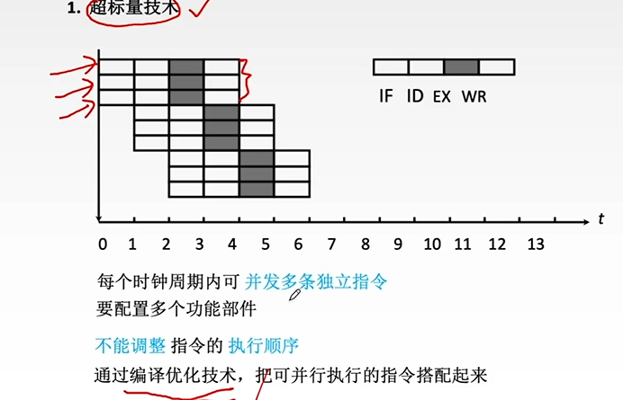

#### 超流水技术

本质是时间换空间

在一个周期内**再进行分段**，一个周期**同一个部件使用多次**

**不能调整指令的执行顺序**

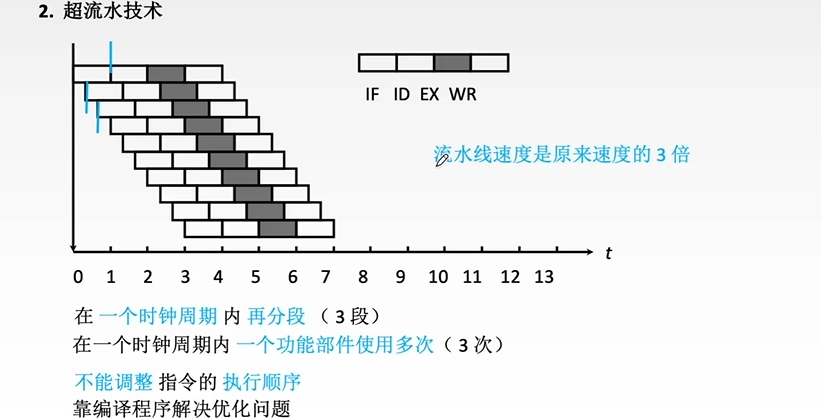

流水线的速度会提高，但是需要进行编译优化，把可并行的放在一起

#### 超长指令字

编译程序发现指令间可以并行

那就把多条可**并行操作**的指令**组合成**有多个操作码字段的**超长指令字**

所以**需要有多个相互独立的处理部件**

### 五段式指令流水线

不同指令不一定都有这五个阶段，但是无论有没有，时间都是要花费的

下面介绍5种类型的指令

#### 运算类指令

> 这里的指令格式是MIPS，与之前的X86有所不同，源操作数在前，目的操作数在后
>
> 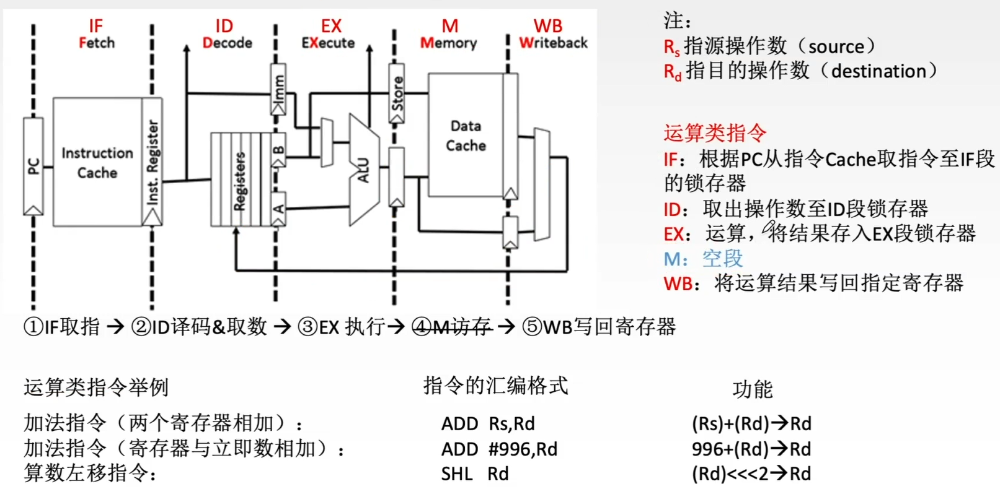
>
> **运算类指令没有访存阶段**

1. **IF取指**

   > 根据PC把指令从Cache，**取到IF段的锁存器**

2. **ID译码以及取数**

   > 取出操作数，**放到ID段的锁存器**
   >
   > 如果有立即数，会放到Imm，其它的就放到A或B

3. **EX执行**

   > ALU根据指令计算，把结果**存入EX段的锁存器**

4. **~~M访存~~** 

   > **空段**

5. **WB写回**

   > 将结果**写回指定寄存器**

#### LOAD取数指令

> 注意 LOAD Rd，996(Rs)   是指把主存Rs+996处的地址存入Rd，其实就是基址寻址
>
> 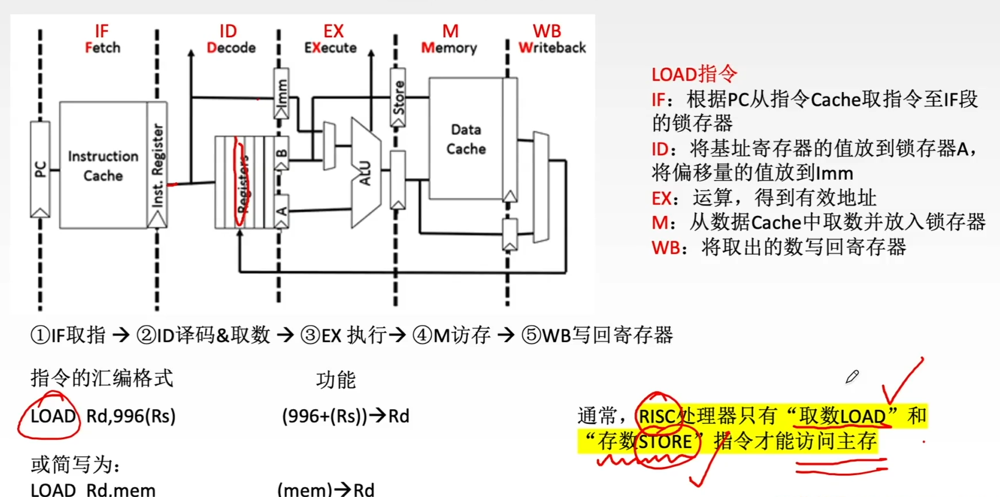

1. **IF取指**

   > 根据PC把指令从Cache，**取到IF段的锁存器**
   >
   > 这一步所有指令都一样

2. **ID译码以及取数**

   > 把**基址寄存器的值放到锁存器A**，将**偏移量放入Imm**

3. **EX执行**

   > 把上一阶段的地址进行计算，**得到有效地址**

4. **M访存**

   > 根据有效地址从Cache中**取数**，并且**放入M段的锁存器**

5. **WB写回**

   > 将取出的数**写回指定寄存器**

#### STORE存数指令

> 格式与LOAD很相似，如 STORE Rs，996(Rd)，会把Rs的数据存入主存的(996+Rd)位置
>
> 
>
> **不需要写回**

1. **IF取指**

   > 根据PC把指令从Cache，**取到IF段的锁存器**
   >
   > 这一步所有指令都一样

2. **ID译码以及取数**

   > 把**基址寄存器的值放到锁存器A**，将**偏移量放入Imm**
   >
   > 把**要存的数，放入锁存器B**

3. **EX执行**

   > 把上一阶段的地址进行计算(A+Imm)，**得到有效地址**
   >
   > 并将锁存器**B放入锁存器Store**
   >
   > 

4. **M访存**

   > 写入数据Cache

5. **~~WB写回~~**

   > 空段

#### 条件转移指令

> 转移类的指令一般采用**相对寻址**，相对于PC跳转多少(向前或向后)
>
> 指令格式一般前两个是条件，最后一位是立即数，代表相对偏移
>
> 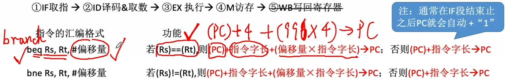
>
> 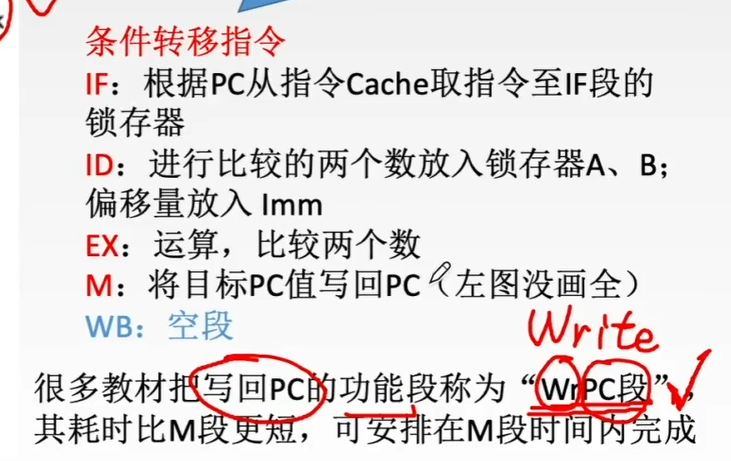
>
> **不需要写回**

1. **IF取指**

   > 根据PC把指令从Cache，**取到IF段的锁存器**
   >
   > 这一步所有指令都一样

2. **ID译码以及取数**

   > 把要比较的两个操作数放入锁存器A、B，偏移量放入Imm

3. **EX执行**

   > 运算A与B的值，进行比较

4. **M访存**

   > 不进行访存，而是
   >
   > 根据EX运算结果，**把PC的值修改成对应的值**
   >
   > 也会把写回PC称为**WrPC段**，耗时比M更短，所以可以安排在这里执行

5. **~~WB写回~~**

   > 空段

#### 无条件转移指令

> jmp #偏移量   也是相对寻址
>
> 

1. **IF取指**

   > 根据PC把指令从Cache，**取到IF段的锁存器**
   >
   > 这一步所有指令都一样

2. **ID译码以及取数**

   > 偏移量放入Imm

3. **EX执行**

   > 把目标PC值写回PC
   >
   > 
   >
   > 这是为了尽量**避免控制冲突**

4. **~~M访存~~**

   > 空段

5. **~~WB写回~~**

   > 空段

## 多处理器的基本概念

### SISD、SIMD、MISD、MIMD的概念

Single、Instruction、Multiple、Data

#### 单指令流单数据流结构SISD

仅包含一个处理器和一个存储器，按指令流规定顺序串行执行指令

为了加速使用流水线，所以会设置多个部件、采用多模块交叉方式组织存储器

**可以并发，不能并行**

#### 单指令流多数据流结构SIMD

一个指令流同时对多个数据流进行处理

也就是多个处理单元同时使用同一条指令，处理不同的数据

这是因为每个处理单元都有专用的地址寄存器

**对指令来说可以并发，不能并行，但是可以同时处理很多数据，可以看作是数据的并行**

#### 多指令流单数据流结构MISD

多条指令处理一条数据，实际上并不存在

#### 多指令流多数据流结构MIMD

同时执行多条指令，分别处理不同数据。

指令序列**可以并行**，而且是线程级甚至进程级并行

分为**多计算机系统**和**多处理器系统**

多计算机系统的**私有存储器不可互相直接访问**，而是**通过消息传送**来进行数据传送。也叫**消息传输MIMD**

多处理器系统是共享存储多处理器(SMP)系统的简称，可通过存取指令直接访问所有存储器，也称**共享存储MIMD**

#### 向量处理器

向量处理器是**SIMD的变体**，实现了直接操作一维数组指令集的CPU

可以说是数据并行

### 硬件多线程的基本概念

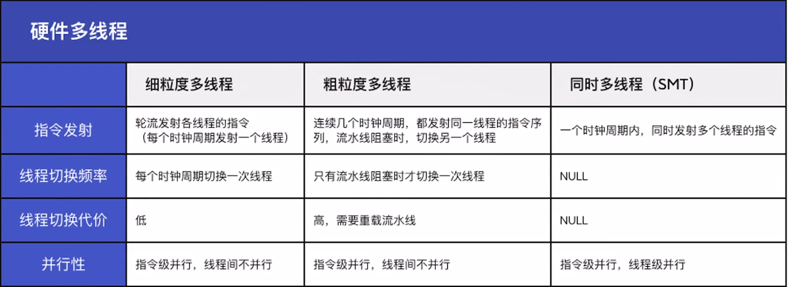

> 不支持硬件多线程的处理器：只有一个IR和PC，同时只能并行一个线程
>
> 线程间切换需要保存和恢复线程运行环境数据，耗时很多
>
> 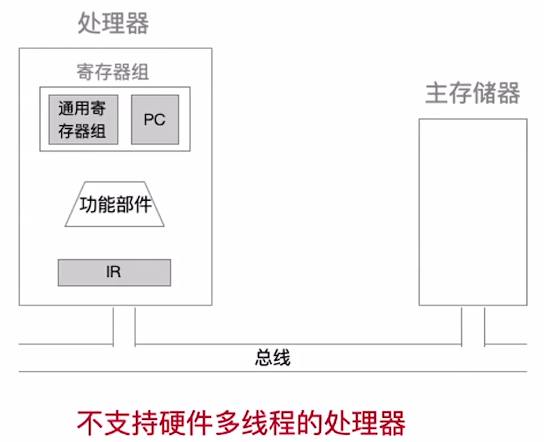
>
> 支持硬件多线程的处理器：有多个IR和PC
>
> 
>
> 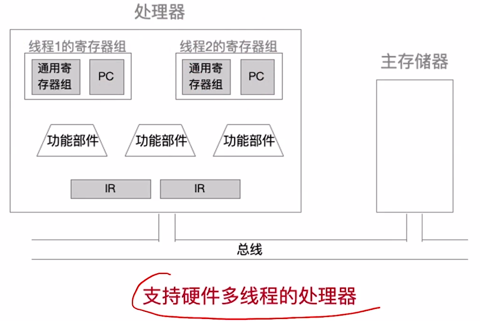

#### 细粒度多线程

轮流发射各个线程的指令，每个周期都切换一次线程

**指令级并行，线程间不并行**

#### 粗粒度多线程

连续几个周期都发送同一个线程的指令，直到当前流水线线程被阻塞才切换另一个线程

线程切换时需要重载流水线

**指令级并行，线程间不并行**

#### 同时多线程SMT

一个时钟周期内，同时发射多个线程的指令

**指令级并行，线程间并行**

### 共享内存多处理器的基本概念

具有共享的单一物理地址的多处理器被称为共享内存多处理器SMP

整个系统共享物理地址，但处理器还是能在自己的虚拟地址空间单独的运行程序

**统一存储访问(UMA)多处理器**：每个处理器对所有存储单元的访存**时间是相同**的

**非统一存储访问(NUMA)多处理器**：每个CPU分为自己直连的本地内存和其它CPU的远程内存，**访问不同内存的时间不同**

会出现多个CPU访问共享变量，所以要对数据上锁

### 多核处理器的基本概念

把多个**处理单元**集成到一个CPU上，每个处理单元称为一个核，也叫做片**上处理器**

想充分发挥性能必须采用多线程执行，它是真正意义上的**物理并行**

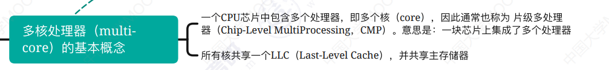
