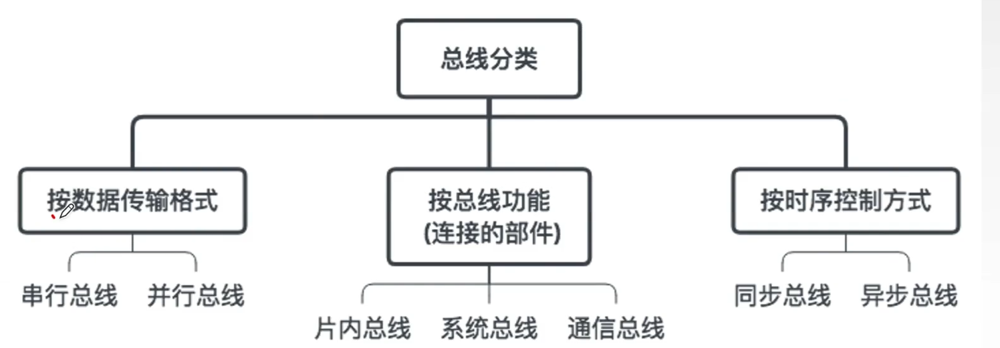

# 总线

## 总线概述

### 总线的基本概念

总线是一组能为多个部件分时和共享的公共信息传送线路。

**分时**和**共享**是总线的两个特点

分时：同一时刻只允许一个部件向总线发送信息

共享：总线上传递的信息，所有连接的部件都能读取

#### 总线的特性

机械特性、电气特性、功能特性、时间特性

#### 总线设备

主设备：指**发出总线请求**且获得**总线控制权**的设备

从设备：**被主设备访问的设备**，他**只能响应**主设备发来的总线命令

### 总线的分类

#### 按数据传输方式分类

- **串行总线**：每次只能传输1位数据

  只需要1根传输线，成本低，抗干扰能力强，主要**应用于长距离传输**，在计算机内部可以节省布线空间

  但是在数据发送和接收时要进行拆卸和装配，也**要考虑串并行转换**

- **并行总线**：每次可以传输多位数据

  总线逻辑时序简单，电路实现冗余

  但是信号线越多，占用布线空间越大；远距离传输成本高；当工作频率高时，信号线之间会产生严重干扰，所以说速度有上限，**不一定比串行快**

#### 按时序控制方式分类

- **同步总线**：总线上连接的部件通过统一的时钟周期同步，按照节拍进行规定的总线操作
- **异步总线**：总线上的设备没有统一的时钟，以信号握手来协调信息传输，操作时序不固定

#### 按总线功能分类

- **片内总线**

  是**芯片内部的总线**，主要是CPU内部寄存器之间、寄存器与ALU之间的连接线

- **系统总线**

  是计算机系统内各功能部件(CPU、主存、I/O接口)之间相互连接的总线

  > 又可分为传输信息的内容不同，分为数据总线、地址总线和控制总线
  >
  > 
  >
  > #### 数据总线DB
  >
  > 传输各功能部件间的**数据信息**，包括指令和操作数
  >
  > **位数与机器字长、存储字长有关**
  >
  > (若和机器字长一致，读取CPU一次处理的数据只需要一次
  >
  > 若和存储字长一致，主存读写操作只需要传送一次)
  >
  > **传送方向是双向的**
  >
  > >数据总线与数据通路是两个概念
  > >
  > >数据通路是各个功能部件通过数据总线连接形成的数据传送路**径**，包括部件
  > >
  > >数据总线只是数据传输的**媒介**
  >
  > #### 地址总线AB
  >
  > 传输地址信息，除了主存单元地址，还包括I/O端口的地址
  >
  > **位数与主存地址空间大小和设备数量有关**(因为一个设备至少也占一个地址)
  >
  > **传送方向是单向的**
  >
  > 
  >
  > #### 控制总线CB
  >
  > **一根控制线传送一个控制信号**，对每**一根控制线来说**都是**单向**传送的
  >
  > 但是有的数据线会从CPU**发出**：CPU送出的控制命令
  >
  > 有的会**接收**：主存或外设返回的CPU反馈信号
  >
  > 

- **I/O总线**

  主要连接中低速的I/O设备，通过IO接口与系统总线相连接，目的是将**低速设备和高速总线分离，提高总线的系统性能**

- **通信总线**

  用于连接各个计算机系统的，如网线，也叫*外部总线*

### 系统总线的结构

#### 单总线结构

计算机内部**只有一组系统总线**(包括数据、地址、控制)

CPU、主存、I/O设备**都连接在一组总线**上，允许I/O设备之间或和主存或CPU直接交换信息

**优点**：**结构简单，成本低，易于接入新设备**

**缺点**：**带宽低、负载重**。多个部件只能**争用唯一的总线**，**不支持并发(并行)传送**。外设传送慢，性能浪费

#### 双总线结构

有两组总线，一条是主存总线，用于CPU、主存、通道间的数据传送

另一条是I/O总线，用于外部设备与通道进行数据传送

> 通道是有特殊功能的处理器，对I/O设备进行统一的管理，通道程序放在主存中

**优点**：把较低速的I/O设备从单总线分离出来，**实现存储器总线和I/O总线的分离**

**缺点**：需要增加通道等硬件设备

> **支持突发传送(猝发传送)**：送出一个地址，主存能传送回来**多个连续地址**的数据

#### 三总线结构

分为三组各自独立的总线，分别是主存总线、I/O总线、直接内存访问DMA总线

> DMA总线：将主存与高速外设直接相连，快速传输数据，而不用通过慢速的I/O总线

**优点**：提高了I/O设备的性能，更快的响应命令，**提高系统吞吐量**

**缺点：**系统工作效率较低，因为同一时刻只能有一组总线工作

### 总线的性能指标

- 总线的**传输周期（总线周期）**

  一次总线操作所需的时间(包括**申请阶段**(总线仲裁)、**寻址阶段**、**传输阶段和结束阶段**)，通常由若干总线时钟周期组成(但是也能一个总线时钟周期包含2个传输周期)。(假设总线宽度是32位，则一个总线周期结束，就传递了32位数据)

- **总线的时钟周期**

  通常就是机器的时钟周期

  > ### 总线周期和总线时钟周期的关系
  >
  > 关系不太确定
  >
  > 
  >
  > 现代的总线时钟周期也有可能是桥接器提供的

- 总线的**工作频率**

  是总线周期的倒数

- 总线的**时钟频率**

  是总线时钟周期的倒数

- **总线宽度**

  也叫总线的位宽，是总线上能同时传输的数据位数

- **总线带宽**

  单位时间内总线上课传输的数据的位数
  $$
  总线带宽= 总线工作频率\times 总线宽度(bit/s)=\frac{总线宽度}{总线周期}(bit/s)
  $$
  是总线本身能达到的**最高传输速率**

  > 例题
  >
  > 
  >
  > 串行总线和并行总线
  >
  > 

- **总线复用**

  **一种信号线在不同时间传输不同的信息**

  可以节省空间和成本

- **信号线数**

  地址总线+数据总线+控制总线的总根数

## 总线事务和定时

总线仲裁部分已删去，简单来说就是通过集中仲裁或者分布仲裁选定哪个设备使用总线

### 操作和定时

占用总线的一对设备如何进行数据传输

#### 总线周期的四个阶段

1. **申请分配阶段**：由需要使用总线的主模块提出申请，经过仲裁，决定把总线的使用权交给申请者。也可以细分成**传输请求**和**总线仲裁**两个阶段
2. **寻址阶段**：获得使用权的**主模块**通过总线发出本次要访问的从模块的**地址**和有关**命令**，**启动**参与本次传输的**从模块**
3. **传输阶段**：主模块和从模块进行**数据交换**，可以单向也可以双向
4. **结束阶段**：主模块的**有关信息**均从系统总线上**撤除**，让出总线使用权

#### 总线定时

> **总线定时**是指总线在双方**交换**数据**过程中**需要时间上配合关系的控制，这种控制称为总线定时，它的本质是一种**协议**

总线定时包括**同步通信(同步定时方式)、异步通信(异步定时方式)、半同步通信、分离式通信**

##### 同步定时方式

系统采用**统一的时钟信号**来协调发送和接收双方的传送定时关系。

若干个时钟周期产生相等的时间间隔

一个总线周期双方可以进行一次数据传送

一个总线周期结束就进行下一个总线周期

> 假设是4个时钟周期
>
> 1. T1的上升沿CPU给出**地址信息**
> 2. 在T2上升沿给出**读命令**
> 3. T3时钟周期内，把**数据传送**完毕
> 4. T4上升沿**撤销**读命令，输入设备不再传输数据
>
> 在T3必须传送全部数据，否则就会出现问题
>
> 

**优点**：传输速率快，**速率高，逻辑控制简单**

**缺点**：主从设备属于强制性同步；不能及时进行数据通信的有效性检验，**可靠性较差**

适用于**总线长度较短**和所连接部件**存取时间较接近**的系统

##### 异步定时方式

异步定时没有统一的时钟信号，也没有**固定的时间间隔**，完全依靠传送双方相互制约的握手信号实现定时控制

**主设备**需要提出交换信息的**请求信号**，经过**接口**传输到从设备；**从设备**接收到主设备的请求后通过接口向主设备发出**回答信号**

> 根据请求和回答的撤销是否互锁，分为三种方式
>
> - **不互锁方式** 速度最快、可靠性最差
>
>   主设备发出请求信号后，**不用管从设备是否接收**到，过一段时间就自动撤销，**无互锁**
>
>   从设备接收到请求，就发出，**不用管主设备是否接收**到，过一会就撤销。**无互锁**
>
>   
>
> - **半互锁方式**
>
>   主设备发出请求信号后，必须等从设备发出回答信号，之后才能撤销。**有互锁**
>
>   从设备发出后不管主设备是否接收到，过段时间就撤销。**无互锁**
>
>   
>
> - **全互锁方式**
>
>   主设备发出请求信号后，必须等从设备发出回答信号，之后才能撤销。**有互锁** 速度最慢、可靠性最强
>
>   从设备发出后，等到主设备信号结束后，才撤销。**有互锁**
>
>   

**优点**：总线周期长度可变，可以保证两个工作**速度相差较**大的设备间**可靠地**进行信息交换

**缺点**：控制方式稍复杂，**速度慢**

##### 半同步通信

在统一时钟基础上，添加一个**等待响应信号**$\overline{WAIT}$，可以让主部件等待几个节拍

##### 分离式通信

> 以上三种方式的共同点
>
> 在**从模块准备数据时，总线是空闲的**

分离式通信解决这个问题，更充分的利用总线

1. 子周期1：主模块申请占用总线，使用完后放弃总线的使用权
2. 子周期2，从模块申请占用总线，将信息送至总线

在准备数据是不占用总线

特点：

1. 各模块**都可以申请**占用总线
2. 采用**同步**方式，不等回答
3. 准备数据时**不占用总线**
4. 总线**利用率高**

