# 指令系统

## 指令系统概述

指令系统是指令集体系结构ISA中最核心的部分，ISA完整定义了软件和硬件之间的接口，是机器语言或汇编语言程序员所应当熟悉的

主要内容包括：

- **指令格式**，**指令寻址方式**，**操作类型**，以及**每种操作对应的操作数**的相应规定
- **操作数的类型**，操作数的**寻址方式**，以及按照**大端还是小端存放**
- 程序**可访问的寄存器编号**、**个数**和**位数**，**存储空间的大小和编制方式**
- **指令执行的控制方式**，包括**程序计数器、条件码定义**等

### 指令的基本格式

一台计算机所有指令的集合构成该机器的**指令系统**，也称为**指令集**

一条指令就是机器语言的一个语句，是一组有意义的二进制代码

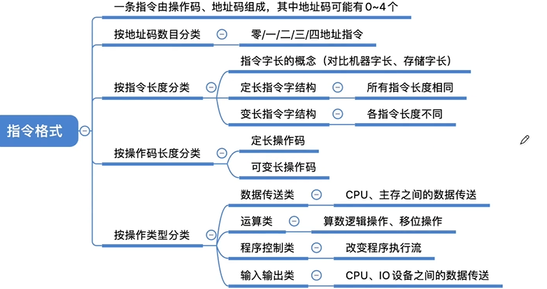

#### 按地址码数目分类

一条指令通常要包括**操作码**和**地址码**两部分

一个指令可能含有0、1、2、3、4个地址码，根据数量不同可分为零地址指令、一地址指令、二地址指令。。。。

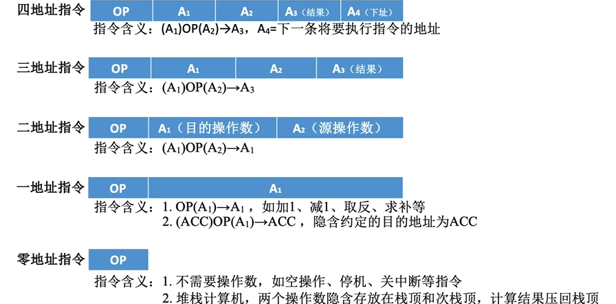

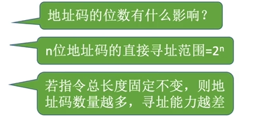

##### 零地址指令

只有操作码OP

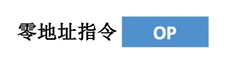

1. **不需要操作数**的，如空操作、停机、关中断等指令
2. **堆栈计算机**，两个**操作数隐含**存放在栈顶和次栈顶，计算结果会再压回栈顶

##### 一地址指令

有操作码OP和一个地址$A_1$组成

1. **只需要单操作数**。如加1，减一，取反、求补等

   指令含义：OP($A_1$)->$A_1$，完成一条指令需要**3次访存**：取指、读$A_1$、写$A_1$

2. 需要**两个操作数**，但是其中一个**隐含在某个寄存器**中(如在ACC中)

   指令含义(ACC)OP($A_1$)->ACC，只需要**2次访存**：取指、读$A_1$

$A_1$指某个地址，($A_1$)表示该地址的内容

##### 二地址指令

一般的由***OP+$A_1$(目的操作数)+$A_2$(源操作数)***组成

常用于两个操作数的**算数运算、逻辑运算**等相关指令

指令含义：($A_2$)OP($A_1$)->$A_1$

完成一条指令需要4次访存：取指、读$A_1$、读$A_2$、写$A_1$

##### 三地址指令

由**OP+$A_1$+$A_2$+$A_3$(结果)**组成

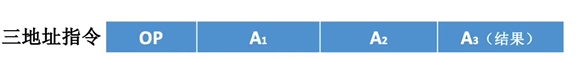

常用于两个操作数的**算数运算、逻辑运算**等相关指令

指令含义：($A_2$)OP($A_1$)->$A_3$

完成一条指令需要4次访存：取指、读$A_1$、读$A_2$、写$A_3$

##### 四地址指令

由**OP+$A_1$+$A_2$+$A_3$(结果)+$A_4$(下一条的地址)**组成

指令含义：($A_2$)OP($A_1$)->$A_3$，$A_4$是下一条指令的地址

完成一条指令需要4次访存：取指、读$A_1$、读$A_2$、写$A_3$

正常一条指令执行完毕都是PC+1，进行下一条指令

**四地址指令直接把PC的值改成$A_4$**，可以让指令跳着执行

#### 按指令长度分类

**指令字长**：一条指令的总长度(**对同一台计算机长度可能会变**)

> **机器字长：**CPU进行一次整数运算所能处理的二进制数据位数(通常和ALU及通用寄存器直接相关)
>
> **存储字长**：一个存储单元的二进制代码位数(通常和MDR位数相同)
>
> 对于同一台计算机，这都不会变

有半字长指令、单字长指令、双字长指令：指令长度是机器字长的多少倍

**指令字长会影响取指令所需的时间**。如取双字长指令需要两次访存

**定长指令字结构**：系统中所有指令长度都相等

**变长指令字结构**：指令系统中各种指令的长度不等

#### 按操作码长度进行分类

操作码的长度可以确定指令的个数

**定长操作码**：指令系统中所有指令的操作码长度都相同

n位操作码可以表示$2^n$条指令

> 控制器的译码电路设计简单，但是灵活性较低

**可变长操作码：**指令系统中各指令的操作码长度可变

> 指令设计的灵活性较高，但是译码电路设计复杂

此外还有扩展操作码指令格式：定长指令字+可变长操作码

对不同地址数的指令，使用不同长度的操作码

#### 按操作类型分类

1. **数据传送**

   MOV：作用：**寄存器之间**传送

   LOAD：作用：把**存储器**中的数据放到**寄存器**中

   STORE：作用：把**寄存器**中的数据放到**存储器**中

   PUSH：进栈

   POP出栈

   > 数据传送类：进行主存和CPU之间的数据传送

2. **算数逻辑操作**

   算数：加减乘除、增1、减1、求补、浮点运算、十进制运算

   逻辑：与或非、异或、位操作、位测试、位清除、位求反

3. **移位操作**

   算数移位、逻辑移位、循环移位

   > 运算类

4. **转移操作**

   无条件转移JMP

   条件转移：JZ：结果为0转移；JO：结果溢出转移；JC：结果有进位转移

   调用和返回：CALL和RETURN

   陷阱(Trap)和陷阱指令

   > 程序控制类：改变程序执行顺序

5. **输入输出操作**

   CPU与IO端口之间的数据传送(端口是IO接口中的寄存器)

   > 输入输出类：进行CPU和IO设备间的数据传送

### 拓展操作吗指令格式

扩展操作码指令格式，就是指令的总长度不变，但是操作码长度可能会变

#### 扩展操作码举例

例如指令字长为16位，每个地址码占4位时:

前4位位基本的OP，剩下3个4位地址字段

所以可以前4位全做指令的话，最多能有16个，但是为了扩展，只用11个，全1的留下

也就是3地址指令1**5个**

然后对于二地址指令，OP全1，第一块地址也可以当作操作码来使用，同理，也有**15个**

1地址也同理**15个**

0地址因为不用留出全1，所以有**16个**

> 设计方式不止这一种，但是必须满足如下要求：
>
> - **短码不能是长码的前缀(与哈夫曼编码要求一致)**
> - **指令的操作码不能重复**

**另一种例子：**

根据不同类型指令的个数，分配地址的扩展

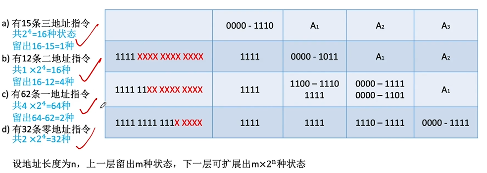

#### 与定长操作码相比优缺点

**定长操作码**：指令的前固定位数表示操作码

**优点**：可以简化硬件设计，提高译码和识别速度

**缺点**：会占用更多固定位，留给表示操作数地址的位数受限

**扩展操作码**：指令的操作码字段位数不固定，且分散在不同位置

**优点**：可以在指令字长有限的前提下仍然保持较丰富的指令种类

**缺点**：增加了指令译码和分析的难度，使得控制器的设计复杂化

## 指令的寻址方式

### 指令寻址

**程序计数器PC：用于指明下一条指令的存放地址**

#### 顺序寻址

PC都会顺序指向下一条指令的地址

​                                                    **(PC)+“1”->PC**

对于定长指令字，且按字编址来说下一条指令的地址：(PC)+1->PC

但是如果不是按字编址，而是按字节编址时，(假设指令16位)那一个指令就占2个地址

PC就得+2

对于变长指令字来说，简单的加固定的值是不可以的，需要加上当前指令的字节数。

但是不论怎样，PC都指向下一条指令的地址

#### 跳跃寻址

PC的值由转移指令给出

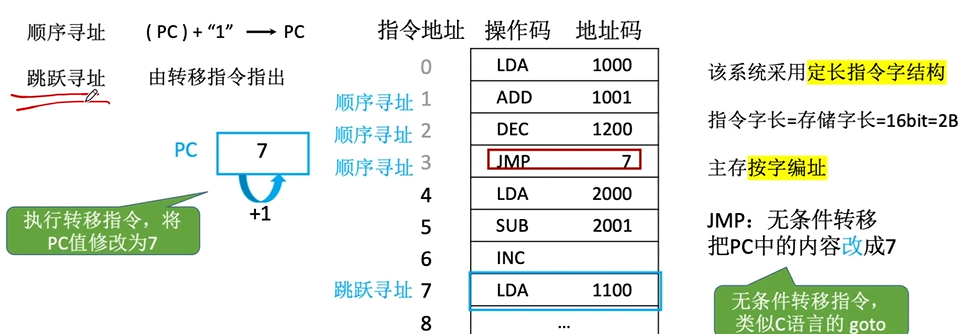

会与顺序寻址结合使用

### 数据寻址

是用于指出**本指令的地址码**指明**的真实地址**

但是地址码的解释方式有很多种，所以需要有不同的数据寻址方式

由于方式很多这里介绍10种，所以需要4位来区分是那种方式

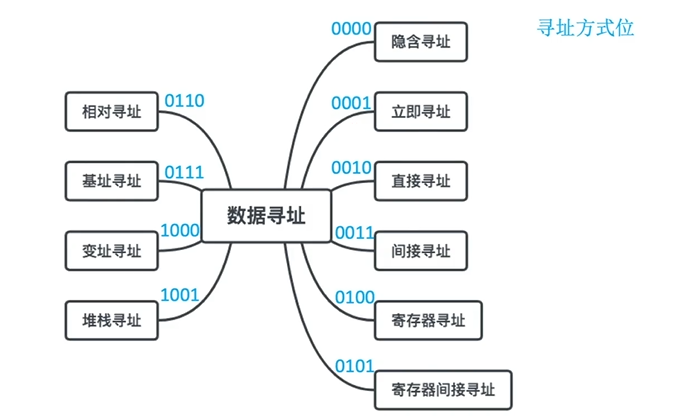

操作码的格式也发生了一些改变

也就是把原来的地址划分为**寻址特征+形式地址**

***注意计算实际访存数的时候，不能忘记取指令还有一次访存***

#### 直接寻址

形式地址就是真实地址，即EA=A

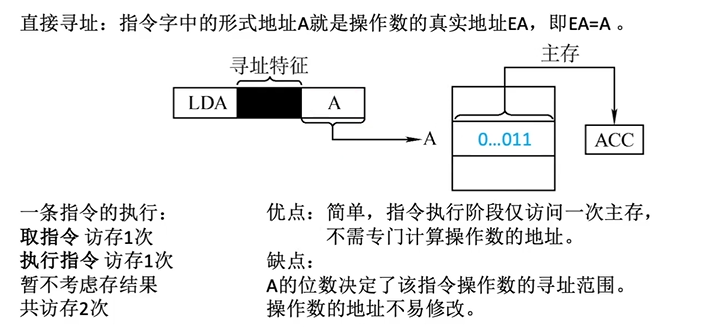

优点是简单，访问主存少

缺点是寻址范围固定，且操作数的地址不易修改

#### 间接寻址

形式地址存的不是真正的地址，而是真正地址在主存中的位置

即EA=(A)

也就是需要多访存一次才能找到真正的地址

如果A处的值的第一位是1，说明还需要再进行一次间接寻址，指令的地址在下一个位置存储

直到第一位是0，说明后面存储的是真实地址了

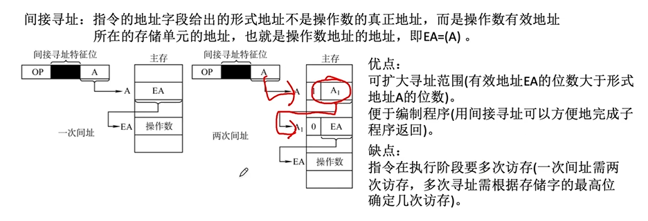

优点是可以扩大寻址范围，多级寻址还可以便于子程序调用

缺点是需要多次访存

#### 寄存器寻址

形式地址指向的是操作数所在寄存器的编号

即EA=$R_1$

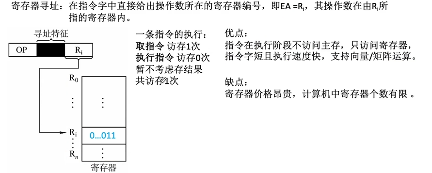

优点是执行指令不放我主存，指令字短，速度快

缺点是贵，且寄存器个数有限

#### 寄存器间接寻址

形式地址指向寄存器，这个寄存器里面是操作数的地址

即EA=($R_1$)

与间接寻址类似，但是可以少访问一次主存，速度更快

#### 隐含寻址

不明显给出操作数的地址，而是按照规定固定的凑在某个位置

如存在ACC中

优点就是能减少指令字长

缺点是要增加存储操作数，或者隐含地址的硬件

#### 立即寻址

立即寻址会直接把**操作数写在形式地址**

\#后面跟数字就代表立即数，用**补码表示**

优点是执行指令不用访存

缺点是立即数的范围被限制

#### 偏移寻址—基址寻址

将CPU中**基址寄存器(BR)**的内容加上指令格式中的形式地址A，从而形成操作数的有效地址

即EA=(BR)+A

对于CPU中没有BR的计算机，使用通用寄存器来代替，这种方式需要占用寻址特征中的几位，来表示是哪个通用寄存器

> **基址寻址是面向操作系统的**
>
> 优点：可以便于程序的浮动，方便实现多道程序并发运行。此外还可以扩大寻址范围

对于汇编程序员，可以修改通用寄存器，也可以决定哪个寄存器当作基准寄存器，但是如果它作为基址寄存器，就不能修改它的内容，**只能操作系统来决定**

> **但基址寄存器对汇编程序员是可见的**

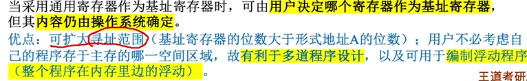

#### 偏移寻址—变址寻址

与基址寻址集合相同，只是从使用基址寄存器变为了使用变址寄存器(IX)

有效地址EA等于指令字中的形式地址A与**变址寄存器(IX)**的内容的和

**即EA=(IX)+A**

其中IX可为变址寄存器(专用)，也可以是通用寄存器作为变址寄存器

> **变址寻址是面向用户的**内容可以由用户改变
>
> 它的形式地址A可以看作基地址，IX看作是偏移量
>
> 特别适用于编写循环程序
>
> 

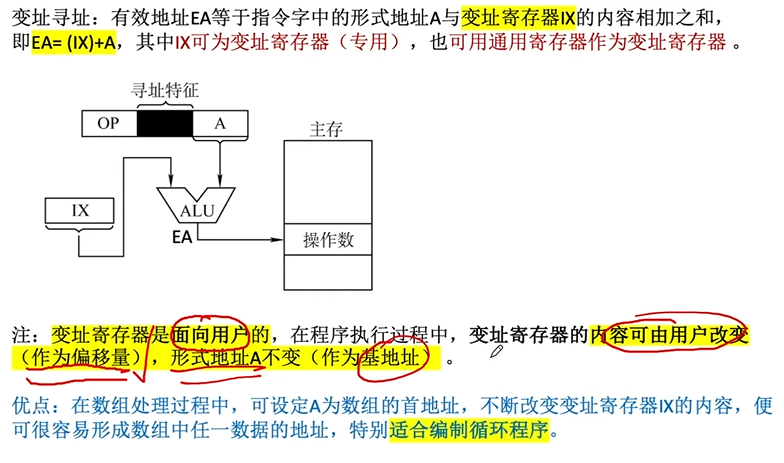

#### 基址寻址和变址寻址的复合寻址

当程序不在内存的开始处时，使用基址寻址很方便实现程序的浮动，不用修改程序代码

在基址的情况下使用变址寻址如下
$$
EA=(IX)+((BR)+A)
$$

#### 相对寻址

把程序计数器**PC的值作为基地址，把形式地址A看作是偏移量**

即
$$
EA = (PC)+A
$$
A是相对与PC的位移量，可正可负，**补码表示**

> 当代码在程序内部挪动时，固定地址的跳转指令需要修改地址码才能保证正确，
>
> 但是使用相对寻址只需要保证这一小块的相对位置不变，就**可以在程序内随意浮动**，很方便
>
> **广泛应用于转移指令**
>
> 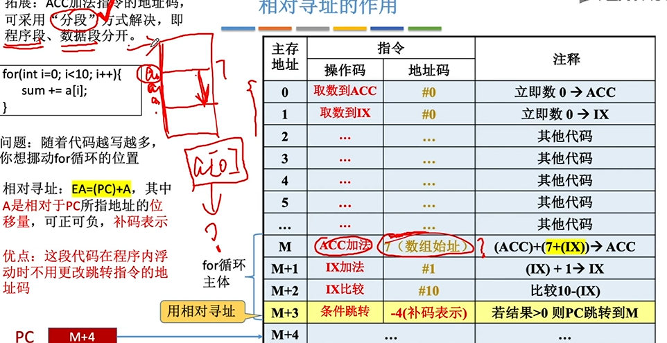
>
> 

#### 堆栈寻址

操作数放在堆栈中，隐含使用**堆栈指针(SP寄存器)**作为操作数地址

有两种方式：

- 一种是使用一组寄存器，来实现栈

  > 这种叫做硬堆栈
  >
  > 当要计算时使用POP出栈两个数据，再进行计算
  >
  > 将结果再使用PUSH压入栈
  >
  > 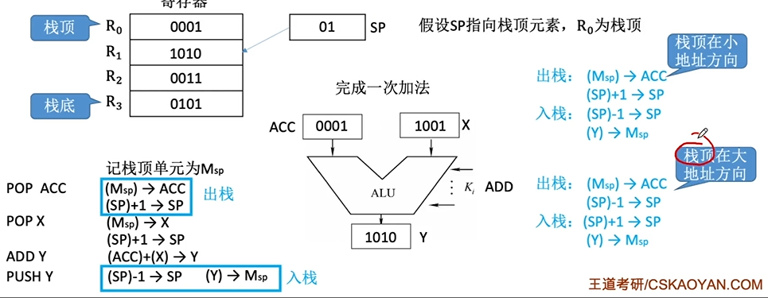
  >
  > **出栈入栈不用访存速度快**
  >
  > 但是**贵**

- 另一种是在主存划分出一块区域实现

  > 叫做软堆栈
  >
  > 每次进栈出栈都会访存**速度较慢**
  >
  > 但是**便宜**
  >
  > 实际一般都用这个

**函数的调用一般就使用堆栈**

## 高级语言与机器级代码

汇编语言指令与机器代码一一对应

### X86汇编语言指令基础

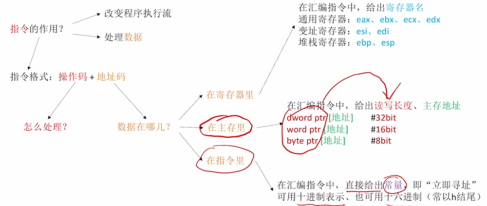

指令的作用：改变程序的执行流、处理数据

指令格式：操作码+操作数

数据分为在寄存器、在主存、在指令里直接存储三种情况

#### 以MOV为例

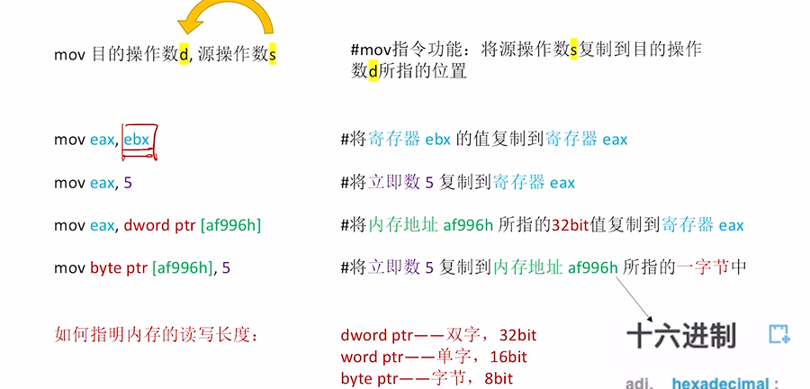

##### 操作数表示

目的操作数一般用d(destination)表示

源操作数一般用s(source)表示

一般就是把源操作数和目的操作数的值进行操作后，**存入目的操作数**的位置

不同操作数间用 ，分隔

##### 内存的读写长度

dword ptr——按双字读写，32bit

word ptr  ——按字读写，16bit

byte ptr   ——按字节读写，8bit

##### X86的寄存器

> ##### 通用寄存器
>
> 以X结尾说明是通用寄存器
>
> 当E开头时，说明是32位
>
> 
>
> 当没有E时，如AX，表示低16位
>
> 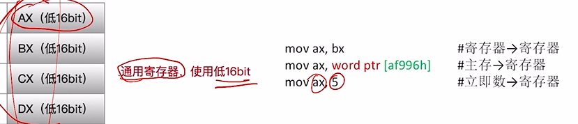
>
> 甚至还可以再分成8bit
>
> 
>
> ##### 变址寄存器
>
> 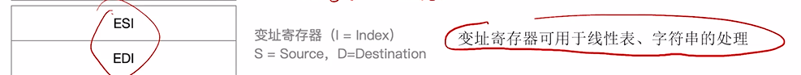
>
> 以I结尾的是变址寄存器，**固定32位**
>
> 中间的S和D分别表示是源地址还是目的地址
>
> ##### 堆栈寄存器
>
> 
>
> 以P结尾是堆栈寄存器，**固定32位**
>
> BP是堆栈基指针
>
> SP是堆栈顶指针

##### 其它例子

中括号代表 括号内部的数是地址，整个代表主存在括号里地址的数据

就是间接寻址

#### 常用的X86汇编指令(Intel格式)

##### 常见算数运算

> d代表的目的操作数，***d一定来自寄存器或主存，不可能是常量***
>
> s代表的可以是常量
>
> 对于**X86指令，禁止两个操作数都来自主存**

| 功能     | 汇编指令 |                             注释                             |
| -------- | -------- | :----------------------------------------------------------: |
| 加       | add d,s  |                      计算d+s，结果放入d                      |
| 减       | sub d,s  |                      计算d-s，结果放入d                      |
| 无符号乘 | mul d,s  |              无符号数计算d$\times$s，结果放入d               |
| 有符号乘 | imul d,s |              有符号数计算d$\times$s，结果放入d               |
| 无符号除 | div s    | 除法采用了隐含寻址，被除数放入了edx和eax中，在在计算前，先拓展成**64位**即edx:eax，再进行除运算edx:eax$\div$s，商放入eax，余数放入edx |
| 有符号除 | idiv s   |     有符号数除法，edx:eax$\div$s，商放入eax，余数放入edx     |
| 取负数   | neg d    |                       把d取负数，存入d                       |
| 自增     | inc d    |                         把d++，存入d                         |
| 自减     | dec d    |                         把d--，存入d                         |

##### 常见逻辑运算

| 功能 | 汇编指令 |            注释             |
| ---- | -------- | :-------------------------: |
| 与   | and d,s  |    d和s按位与，结果放入d    |
| 或   | or d,s   |    d和s按位或，结果放入d    |
| 非   | not d    |     对d按位取反，放入d      |
| 异或 | xor d,s  |   d和s按位异或，结果放入d   |
| 左移 | shl d,s  |  把d逻辑左移s位，结果放入d  |
| 右移 | shr d,s  | 把d逻辑右移s位，把结果放入d |

##### 其它指令

实现分支、循环的：cmp、test、jmp、jxxx

实现函数调用的：push、pop、call、ret

实现数据转移的：mov

#### AT&T格式指令

与Intel格式有所不同

最重要的是操作数表示的位置与Intel相反，左边是源操作数，右边是目的操作数

寄存器前要加%

主存地址用()

立即数要加$

读写长度要在指令后面加b、w、l表示8、16、32位，而不是在地址前加byte ptr这种

主存偏移量：加减写在括号外面如ebx减8：mov -8(%ebx),%eax

乘法在括号里面 如ebx+ecx*32+4为：mov 4(%ebx, %ecx, $32), eax

### 选择语句机器级表示

在Intel X86处理器中，程序计数器**PC**(Program Counter)**常被称为IP**(Instruction Pointer)

#### 无条件转移指令jmp

jmp <地址>     地址可以是常数，也能来自主存或者寄存器

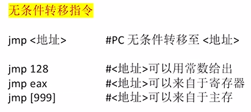

> 为了方便编程，除此之外还可以**跳到指定的位置**
>
> 如下图右，跳到NEXT
>
> 

#### 条件转移指令jxxx

je <地址>   ——jump when equal，若a==b则跳转

jne <地址>   ——jump when not equal，若a!=b则跳转

jg <地址>   ——jump when greater than，若a>b则跳转

jge <地址>   ——jump when greater than or equal to，若a>=b则跳转

jl <地址>   ——jump when less than，若a<b则跳转

jle <地址>   ——jump when less than or equal to，若a<=b则跳转

> **一般和cmp结合使用**
>
> 
>
> 

#### 一个c语言例子

#### 另一个例子

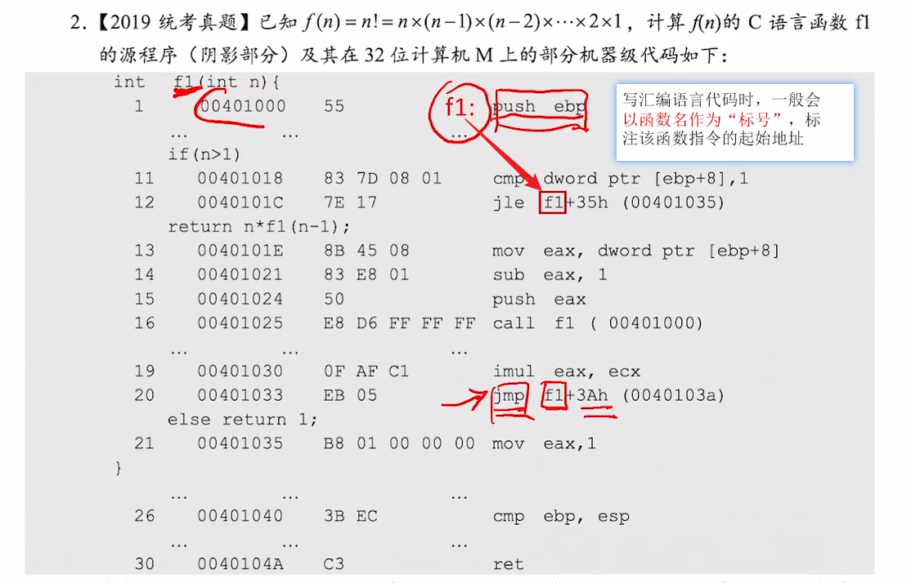

> cmp的底层原理
>
> 两个数相减，把标志位存入PSW(或者叫IR)，根据结果的OF、SF、ZF、CF判断大小，比较两数的大小
>
> 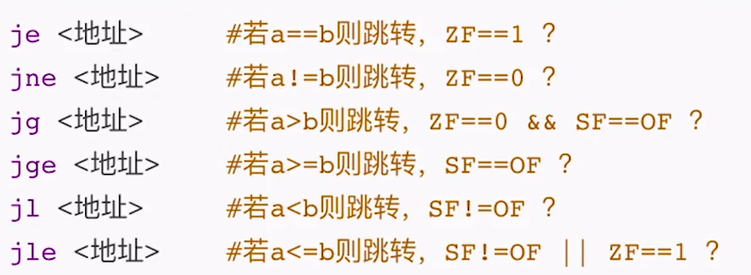

### 循环语句机器级表示

#### 用条件转移指令实现

先将循环需要使用的数据初始化

然后判断初始状态能否进入循环

进入循环执行循环主体

主体结束判断是否再次循环

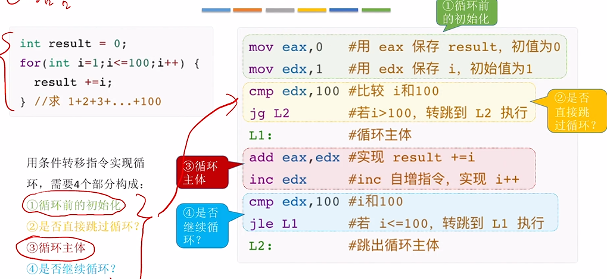

#### 使用loop实现循环

loop使用ecx寄存器(必须是这个)，会先给ecx赋值，然后每次跳转自动让ecx-1，当ecx为0时结束循环

使用条件转移指令可以实现同样的效果，但是loop更简洁

此外还有如loopnz，loopz这种指令，只是结束条件不同，会多判断最近一次运算的值的ZF的值

### 函数调用机器级表示

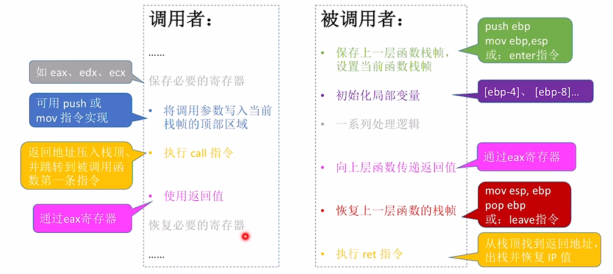

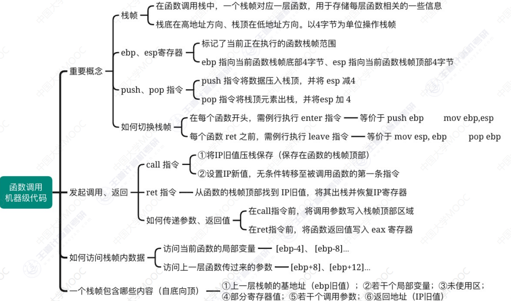

#### call和ret

用call调用，用ret返回

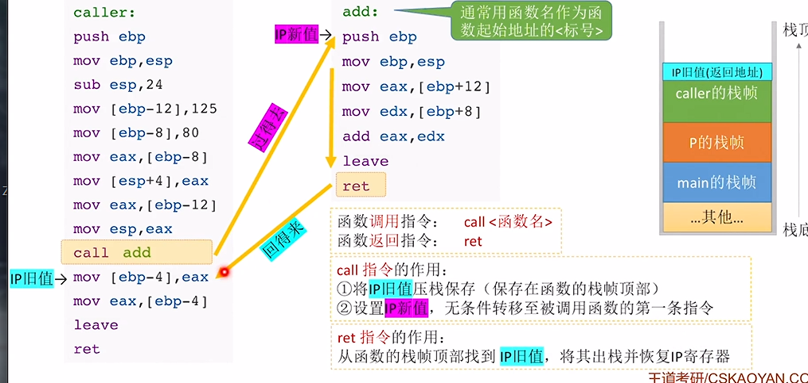

##### 调用：call <函数名>

将IP(也就是PC)的**旧值压入栈保存**，放在栈顶

**设置IP的新值**，也就是被调用函数的第一行

##### 返回：ret

在函数栈帧的顶部**找到IP旧值**，出栈，并恢复IP寄存器的值

#### 函数调用栈在内存的位置

由于**栈底是高地址，栈顶是低地址**

所以说画图会把栈底画在上面，栈顶画在下面

#### 如何访问栈帧中的数据

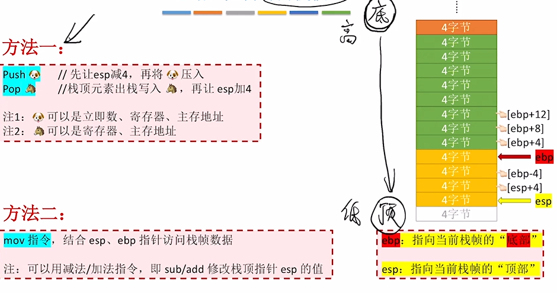

##### 标记栈帧范围：EBP、ESP寄存器

EBP:指向当前栈帧的**底部**

ESP指向当前栈帧的**顶部**

在X86系统中，栈的操作单位是**4字节**

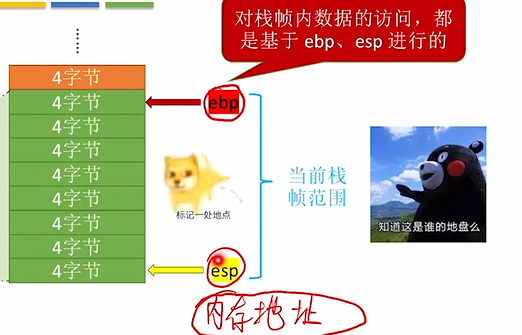

##### 访问栈帧数据：push、pop

push实现入栈，pop实现出栈。x86默认以**4字节**为单位

但是这种方法**只能访问到栈顶的元素**

##### 访问栈帧数据：mov

使用**mov指令，结合esp、ebp访问栈帧数据**

可以用减法/加法指令，即sub/add修改栈顶指针esp的值

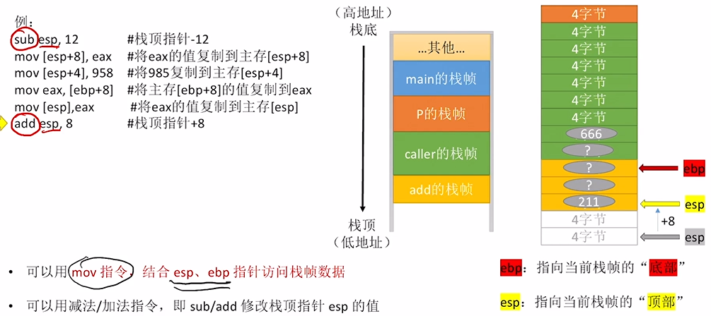

#### 如何切换栈帧

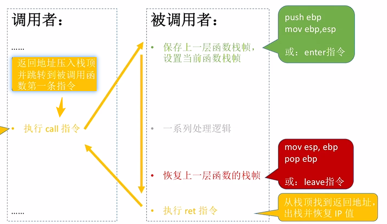

##### 调用时切换

call *函数名*   的作用：

将I**P的旧值压栈**保存(相当于push IP)

然后**设置IP的新值**，也就是无条件转移到被调用函数的第一条指令(相当于 jmp *函数名*)

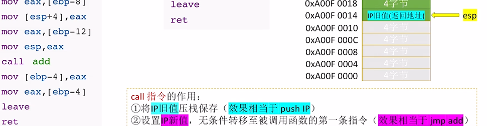

这个函数就暂时结束，**执行被调用函数的指令**

先 **push ebp** 也就是把原先函数的ebp所在地址压入栈顶（对这个新函数来说其实是栈底）

然后**mov ebp, esp**   把esp赋给ebp(也就是让ebp指向esp，现在ebp就是新函数的栈底了)

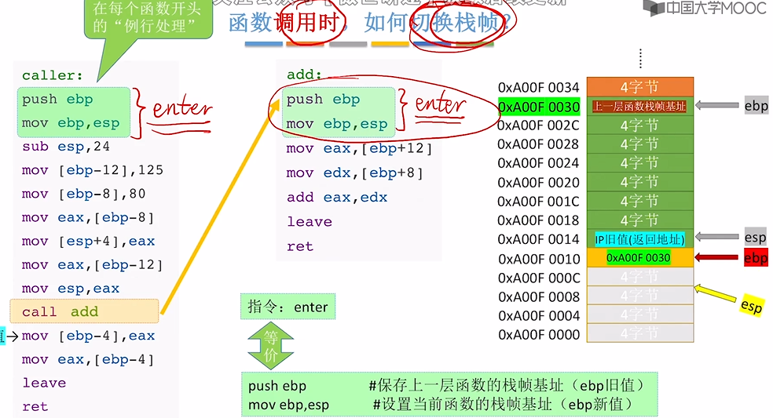

如果要回退的话，只用**找到栈底的地址，就能找到调用函数的基地址了**

这两条指令可以用**enter**指令替代，每个函数的开头都有这个指令

##### 返回时如何切换

先 **mov esp, ebp** 让栈顶指针指向栈底

**pop ebp** 把当前栈顶的值赋给ebp，也就让ebp指向了上一层的栈底，

同时esp也回退一单位，指向**IP旧值**

这两个指令，等价于**leave**指令，在**返回之前都要执行**

**ret** 指令，会从函数的栈帧的顶部找到**IP旧值**，将其出栈并恢复IP寄存器

#### 如何传递参数和返回值

##### 栈帧内包含的内容

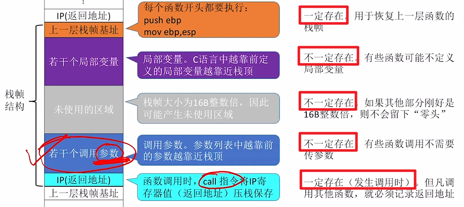

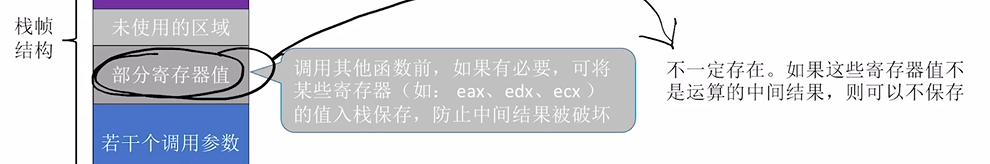

栈帧**最底层**一定是上一层函数的基地址（**ebp旧值**）

栈帧**最顶部**一定是IP的值（也就是上一层**IP的旧值**）

**栈底下面**紧接着是函数的**局部变量**，按倒序存储的，越**先定义的**，越靠近栈顶(**靠下**)

> 如[ebp-4]就是**本函数最后一个**定义的局部变量

**栈顶上面**是**调用参数**(传入的)，还是**先出现的靠下**（注意：传入的参数存在上一层函数，也就是ebp的上面）

> 如[ebp+8]就是**上一层**函数传入的**第一个参数**
>
> 注意[ebp+4]是上一层函数的IP

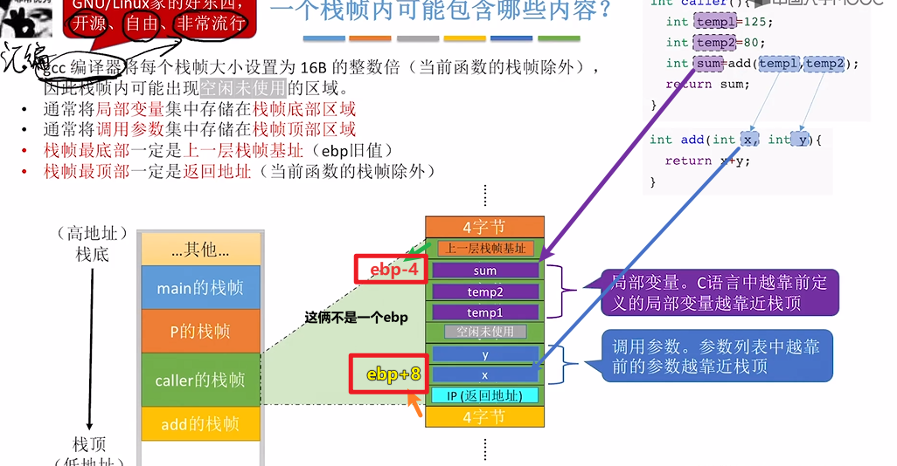

使用返回值和传递返回值都需要把本函数的返回值写入eax寄存器中

需要调用上个函数的返回值，也从eax里读取

### CISC和RISC

CISC复杂指令集：一条指令完成一个复杂的基本功能

> X86架构，主要用于笔记本台式机
>
> 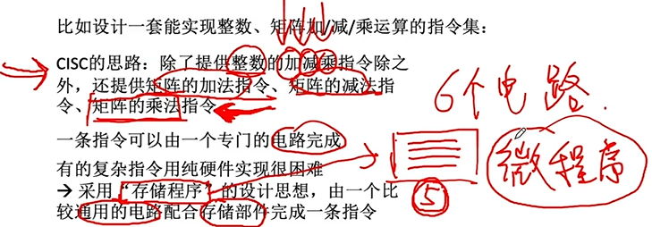
>
> 指令都可以访问主存

RISC精简指令集：一条指令完成一个基本动作；多条指令完成复杂的基本功能

> ARM架构，主要用于手机、平板
>
> 
>
> 只有load和store才能访存
