[TOC]


# 计算机系统概述


计算机系统=硬件+软件

## 计算机系统层次结构

### 计算机硬件

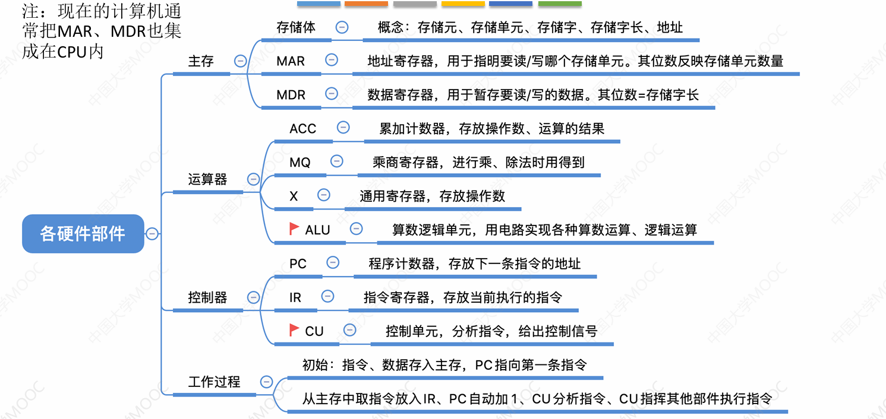

#### 计算机硬件的基本组成


##### 冯诺依曼机

其工作的基本方式是**控制流驱动方式**：按照指令的执行序列，依次读取指令，然后根据指令所含的控制信息，调用数据信息进行处理，在执行过程中，始终以控制信息流为驱动工作的因素。


1. 采用存储程序的工作方式

   > **存储程序**：**指将指令以二进制代码的形式事先输入计算机的主存储器**，然后按其在存储器的首地址执行程序的第一条指令，然后就按该程序的规定顺序执行其它指令，直到执行结束

2. 计算机硬件系统由运算器、存储器、控制器、输入输出设备5大部件组成

   > 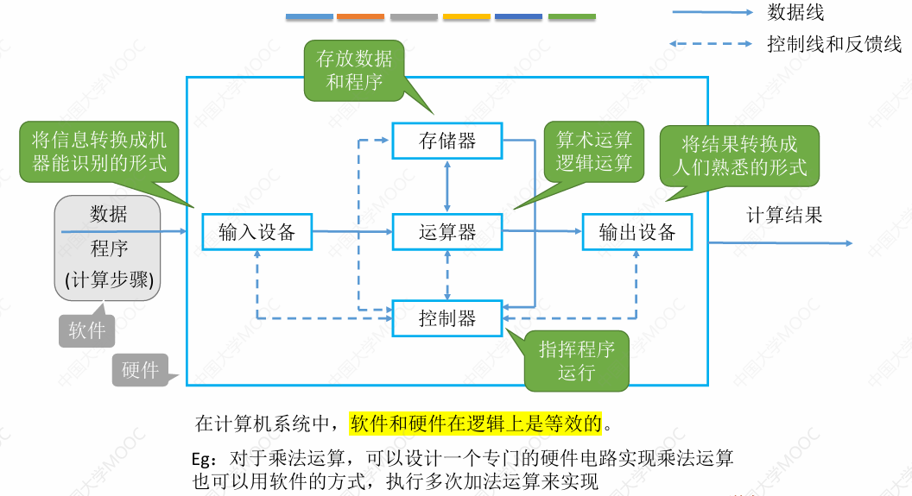
   >
   > 在计算机系统中，软件和硬件在逻辑上是等价的

3. 指令和数据以同等地位存于存储器，可按地址访问

4. 指令和数据都用二进制表示

5. 指令由操作码和地址码组成

6. **以运算器为中心**

    

##### 现代计算机结构

现代计算机采用以**存储器**为中心的结构，能减少运算器的占用时间，提高效率

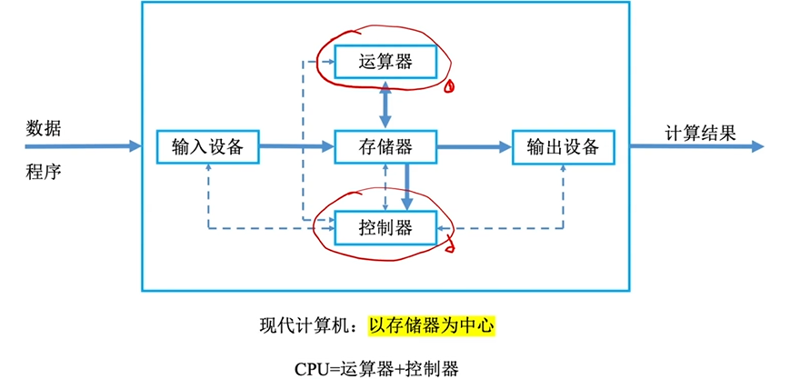


注意，主机只包含主存，而辅存属于IO设备


#### 主存储器的基本组成

主存储器包括三个部分

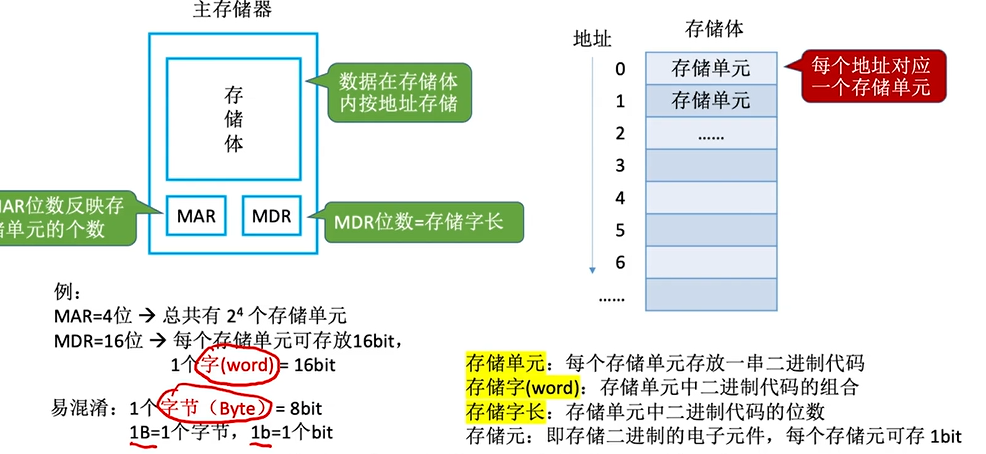

- 存储体

  > 这是所有数据存放的地方
  >
  > 整个存储体会按地址被分为好多个**存储单元**,每个存储单元存放一串二进制
  >
  > 这串二进制数据叫做**存储字**
  >
  > 存储单元的二进制的位数叫做**存储字长**
  >
  > **存储元**，就是存储二进制的电子原件，一个可以存1bit

- 存储地址寄存器MAR

  > 这里暂时存储访存的地址，处理后便于去找到或者存储到这个位置
  >
  > **MAR的位数可以显示有多少个存储单元**

- 存储数据寄存器MDR

  > 这里是数据暂存的地方，读出来或者要写入的数据会先存放在这里，然后从这里被拿走
  >
  > MDR的位数与存储单元的位数一样，也即**MDR位数=存储字长**

#### 运算器的基本组成

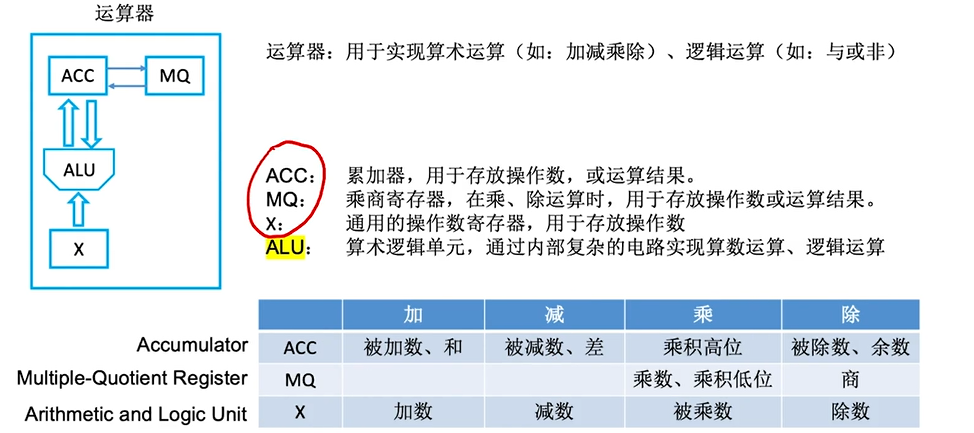

运算器是用于实现算数运算(加减乘除)和逻辑运算(与或非)的

主要包含这么几个部分

- 累加器ACC

  > 用于存放操作数或者运算结果
  >
  > 加减乘除都会用到
  >
  > 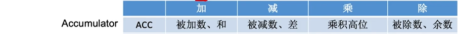

- 乘商寄存器MQ

  > 在乘除运算时，用于存储操作数或运算结果
  >
  > 只在乘除使用
  >
  > 

- 操作数寄存器X

  > 通用的操作数寄存器，用于存储操作数
  >
  > 加减乘除都能用
  >
  > 

- 算数逻辑单元ALU

  > 有复杂的电路，可以实现算数运算和逻辑运算
  >
  > 它会进行计算，是运算器的核心部件


#### 控制器的基本组成


控制器有3个部分组成

- 控制单元CU

  > 是最核心的，用于分析指令，给出控制信号
  >
  > 根据读入的操作码，判断是什么操作

- 指令寄存器IR

  > 用于存放当前执行的指令

- 程序计数器PC

  > 用于存放下一条指令的地址，有自动加1的功能

##### 完成一条指令的过程

先取指令，从PC中找到下一条指令的地址并取出

存入到指令寄存器IR

最后交给CU来执行指令


#### 计算机工作过程举例


##### 取指令和分析指令


其中( )是指该器件内的数据，如(PC)=0，就是程序计数器的、值为0

M(MAR)->MDR是指把  主存的 *MAR现存地址处*的数据  存入MDR

存入MDR后，IR把这条指令读出来，存到IR

OP(IR)->CU就是把IR里的操作码读出交给CU，然后CU进行指令分析

指令分析结束后会根据结果不同进行不同的操作

##### 取数

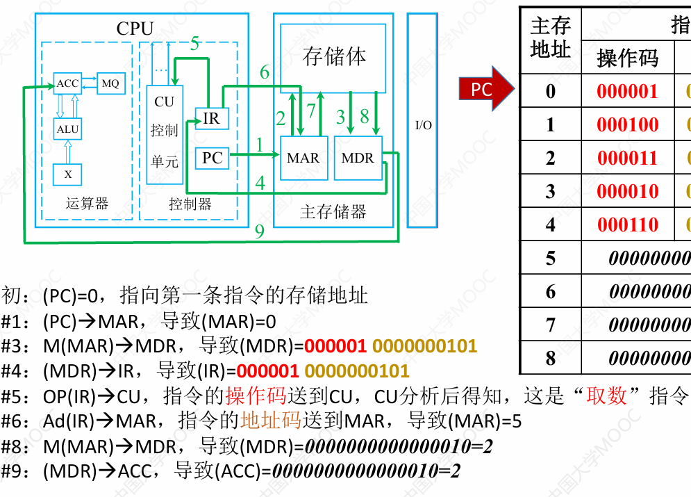

这是**取数指令**

**就是把地址码处的值读入到ACC**

Ad(IR)->MAR，就是把IR里的地址码存入MAR

然后其实是重复3，把M(MAR)的值存入MDR

最后把MDR的值存入ACC

第一个指令取a的值就结束了（#1~4取指令，#5分析指令，#6-9执行指令）

PC加1，去取下一个指令，重复执行

##### 乘法

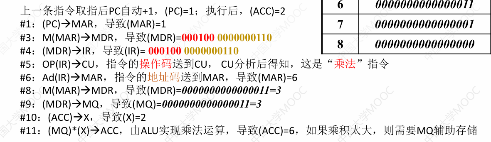

这是**乘法指令**(#6-11)

需要**把地址码的值乘以ACC**

与取数有所不同，#9要把乘数读入到MQ

然后先把ACC的数存入X，然后让ALU计算MQ*X的值，存入到ACC

结束   但如果乘积太大，可以把结果的低位交给MQ来存储

PC值再次加1

##### 加法


这是**加法指令**(#6-10)

需要**把地址码的值加到上ACC**上

也与前面不同，MDR的值是读入到X

然后ACC直接更新为(ACC)+(X)

结束

PC+1

##### 存数

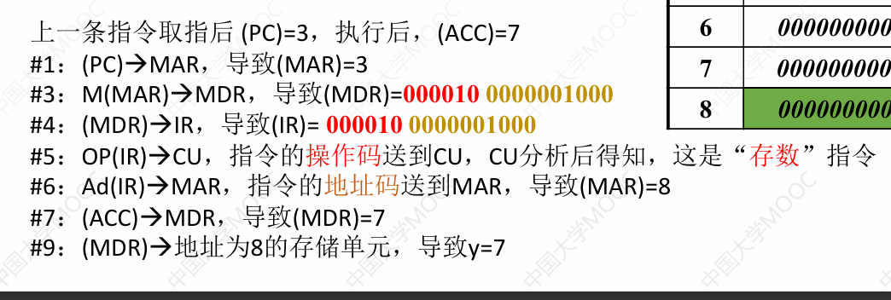

这是**存数指令**(#6-9)

这需要**把ACC的值存到指令的地址码位置处**

那就把IR的地址码存到MAR

把ACC的值存入MDR

哪最后就会把MAR地址处的值更新为MDR的值

PC+1

##### 停机


发现是停机指令后直接调用系统中断，结束


### 计算机软件

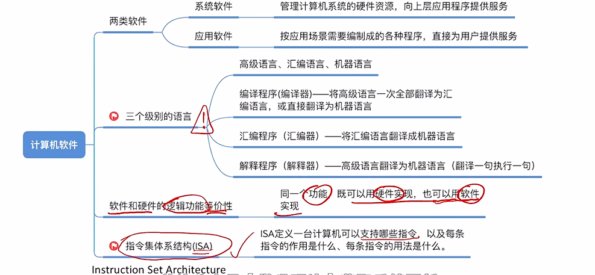

软件包括系统软件和应用软件

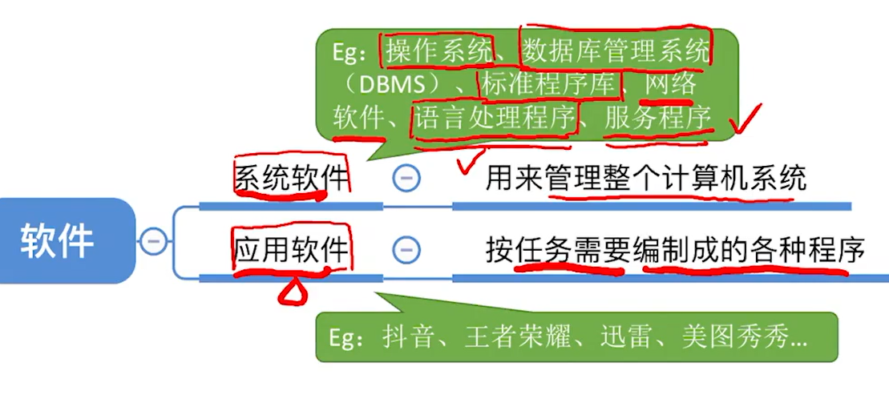

**应用软件**是为了解决某个应用领域的问题而编制的程序

**系统软件**负责管理硬件资源，并向上层应用程序提供基础服务


#### 软件和硬件具有逻辑功能等价性

实现同一个功能，可以由硬件实现，需要设计专用的硬件，成本高但效率高，也能在不改变硬件的情况下用软件实现(成本低但效率也低)


#### 指令集体系结构ISA

规定了软件和硬件之间的界限，设计计算机系统的ISA，就是要定义一台计算机可以支持哪些指令，每条指令的作用是什么，用法是什么


### 计算机系统的多级层次结构


计算机系统层次大概分为以下几层

前两层是硬件，后三层是软件

- 微程序机器M0

  > 就是微指令系统，是一个实在的硬件层，由**硬件**直接执行微指令

- 传统机器M1

  > 就是用机器语言的机器，也是一个实在的机器层，执行的是二进制的机器指令，由微程序解释机器指令系统

- 虚拟机器M2

  > 操作系统机器，它由操作系统程序实现，操作系统程序是由机器指令和广义的指令组成的，广义指令**(系统调用**)是操作系统定义的

- 虚拟机器M3

  > 汇编语言机器，由汇编程序支持和执行，借此可编写汇编语言源程序

- 虚拟机器M4

  > 高级语言机器，是面向用户的，由各种高级语言支持和执行


### 计算机系统的工作原理

#### 从源程序到可执行文件

源程序.c经过预处理器，变为.i，然后再经过编译器，变为汇编语言程序.s，再经过汇编器，变成.o，最后经过链接器，变为.exe

把源程序转换成汇编语言叫做**编译**

把汇编语言转换成机器语言叫做**汇编**

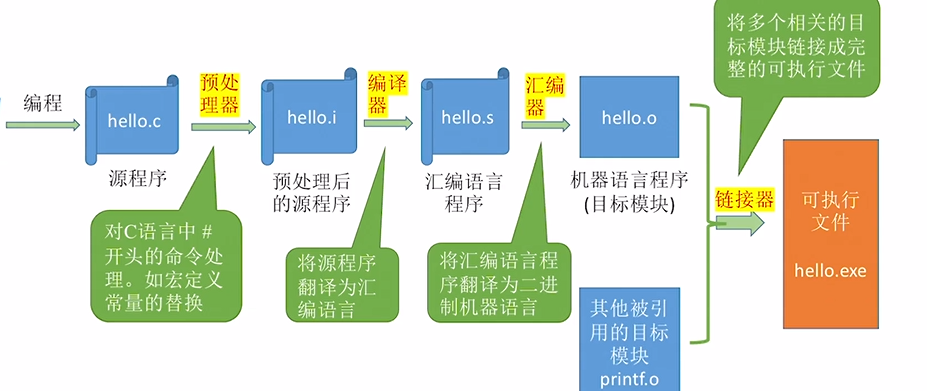

#### 存储程序的工作方式

程序存储在外部存储器中，当需要运行时，将其调入到主存中，进行执行

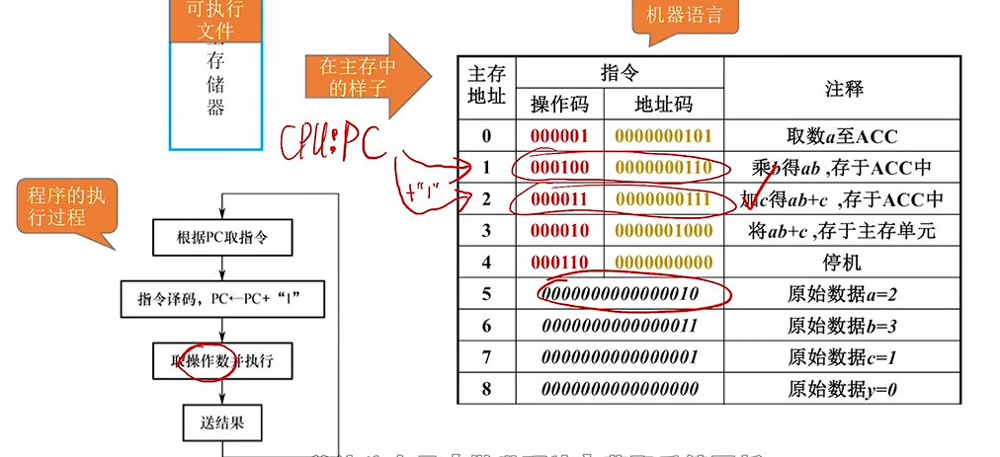


## 计算机的性能指标


### 存储器的性能指标

MAR反映存储单元的个数

MDR反映每个存储单元的大小

#### 最大总容量

$$
最大总容量=存储单元个数 \times 存储字长 (bit)
      =\frac{存储单元个数 \times 存储字长}{8} (B)
$$


### CPU的性能指标

#### **CPU主频**：

CPU内数字脉冲信号震荡的频率(Hz)

#### **时钟周期**：

每一个脉冲信号的时间
$$
CPU主频 = \frac{1}{CUP时钟周期}
$$

#### **CPI**:

每一条指令所需的时钟周期(通常使用平均时间)
$$
执行一条指令的耗时 = CPI \times CUP时钟周期
$$

$$
CPU执行时间(整个程序的耗时) = \frac{指令条数 \times CPI}{主频}
$$

#### **IPS**：

每秒执行多少指令
$$
IPS = \frac{主频}{平均CPI}
$$

#### **FLOPS**：

每秒执行多少浮点运算


### 系统整体性能的指标

#### 数据通路带宽：

数据总线一次所能并行传送信息的位数(各硬件部件通过数据总线传输数据)

#### 机器字长

指计算机进行一次整数运算所能处理的二进制数据位数，通常与通用寄存器位数、ALU有关。**一般等于通用寄存器的的位数**或者**ALU的宽度**。

#### 吞吐量：

指系统在单位时间内**处理请求的数量**(一个完整的程序运行或者一个指令叫做一个请求)

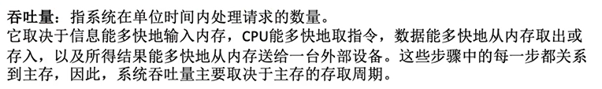

#### 响应时间：

用户从向计算机**发送一个请求**，**到**系统对该请求**做出响应**并获得它所需要的结果的等待时间。


#### 基准程序(动态测试)：


### 速度比较

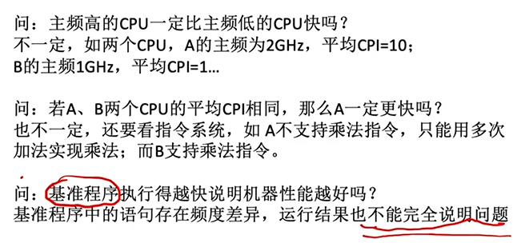

## 其它术语

### 系列机

用于基本相同的体系结构，**使用相同的基本指令系统**的多个不同型号的计算机组成的一个产品系列

### 兼容

指软件或硬件的通用性，即两个不同型号的计算机能运行同样的软/硬件，则说这些软硬件兼容这两种计算机

### 固件

将程序固化在ROM中组成的部件称为固件。是一种具有软件特性的硬件，比软件快，比硬件灵活。


# 数据的表示和运算

## 数制与编码

### 进位计数制及其转换


#### r进制转10进制

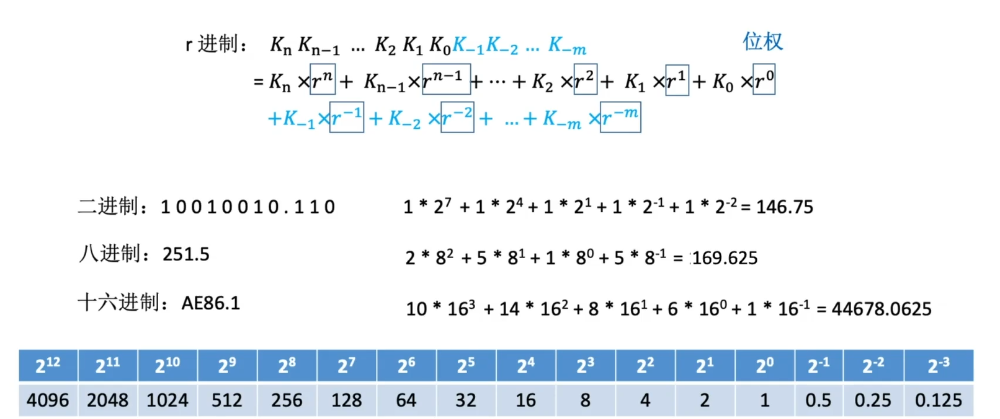

#### 10进制转r进制

整数部分**除基取余**，倒序排列


小数部分**乘基取整**，顺序排列

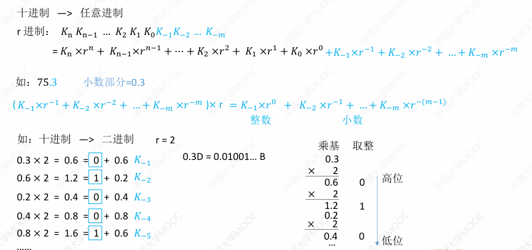

#### 真值和机器数

真值就是人们实际中使用的带正负号的数

机器数是该真值在机器中存储的数


### 定点数


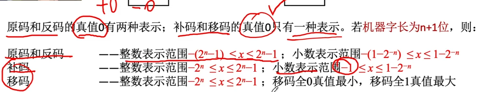


**定点数**：小数点位置固定，也就是常规计数

**浮点数：**小数点位置不定，也就是使用科学计数法

下面主要先介绍定点数的一些分类

#### 无符号数

整个机器字长全部的二进制位**均为数值位**，**没有符号**位，相当于是数的绝对值

n位的无符号数的二进制表示范围就是0~$2^n-1$ 

一般来说，只有无符号的整数，没有无符号的小数

#### 有符号数的定点表示

有符号数第一位是符号位，剩余部分是数值部分，也称**尾数**

一个定点小数的整数部分和小数部分需要分开保存

定点整数默认小数点在最低位

定点小数的小数点在最高位(隐含在符号位后面)


##### 原码

用尾数表示真值的绝对值，符号位0/1表示正/负

整数：**从右向左**，分别是2^0^到2^n-1^ ，最左侧是符号位

**整数真值范围是-(2^n^-1)~(2^n^-1)，而且有+0和-0两种形式**

小数：**从左向右**，最左是符号位，然后分别是2^-1^到2^-(n-1)^ 

**小数的范围是-(1-2^-n^)~1-2^-n^，0也有+0和-0**


不足要补0


##### 反码

若原码符号位为**0**，则反码与原码**相同**

若符号位为**1**，则符号位不变，**数值位全取反**

反码的范围也是-(2^n^-1)~(2^n^-1)，包含-0和+0

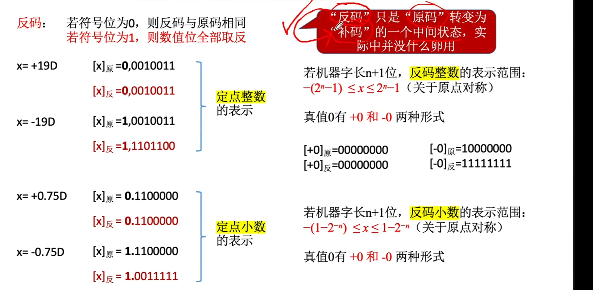

##### 补码

正数的补码就是原码

负数的补码是反码+1


对于补码来说，真值0只有1种表示形式，这是因为10000000(即-0)求补码之后会得到1 00000000，多出1位，首位会溢出，剩下的与+0一样

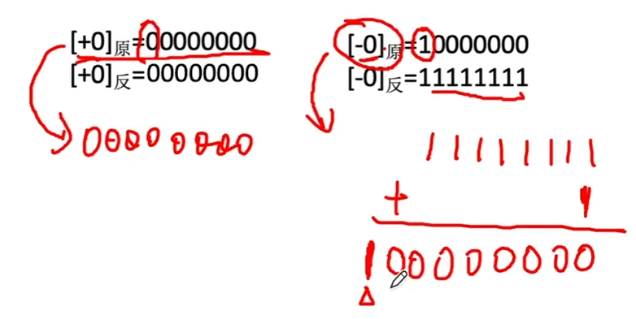

所以说就没有-0了，**定义1000 0000为 -2^7^**

所以说补码的范围与原码和反码不同，**为-2^7^~2^7^-1**

**对于小数，-1~1-2^-n^，多表示了一个-1**


补码运算便于处理减法，补码求法的由来：原码加反码会得到1111 1111 再+1就会得到1 0000 0000也就是模的值，所以反码+1就是原码的补数


**当补码进行加法的时候，符号位也参与运算**

##### 移码

把补码的符号位取反。注意，**移码只能表示整数**

表示范围和补码一样

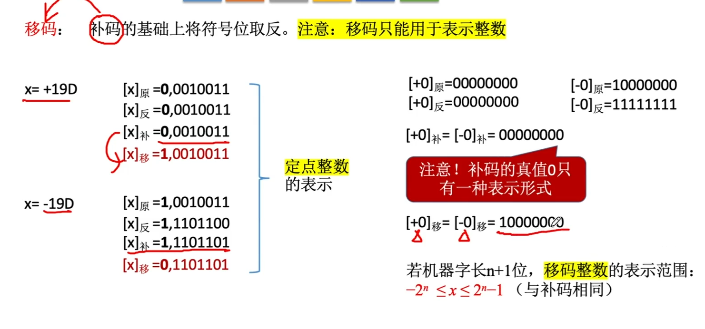

移码的作用：把移码看作一个无符号数，则当真值增大，移码就增大，**便于比较大小**


（这里的移码是当作有符号整数来计算了）


#### C语言的定点整数

C语言里的定点数全都是用补码存储的

##### 强制类型转换

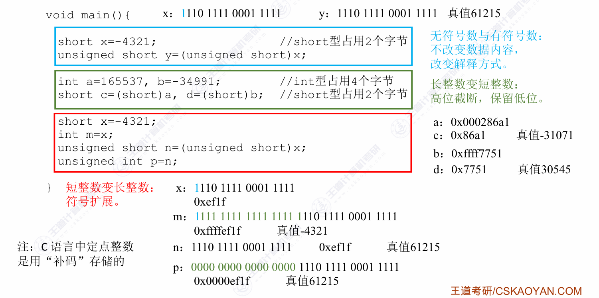

当**无符号数转换成有符号数**，数据存储完全不变(还是原来的补码)，只是把原来的**第一位看作符号位**，根据符号位0/1把补码转换成真值

**有符号数转换成无符号数**，就直接把第一位符号位看作是数值，直接拿**补码当真值计算**


当**长整数变短整数**，先算出长整数的补码，然后**高位直接截断**，剩下的当作补码根据第一位的符号位计算真值


当**短整数变长整数**，判断短整数补码的符号位，向前**补齐n个符号位**，作为长整数的补码(**值不变**)，对于无符号数，当正数看，在前面添0即可


#### 符号扩展和零扩展

由于ALU以及通用寄存器的宽度是固定的，但是不同类型的数据存储长度可能不太一样，所以需要对数据进行扩展


对于无符号整数，只需要在前面补0就行

对于有符号整数，正数在前面添0，负数在前面添1


## 运算方法和运算电路

### 逻辑门电路


**与AND**

只有输入均为1，输出1

**或OR**

输入有一个1就输出1

**非NOT**

取反

**与非NAND**

先与再取反，只有输入都是1，才输出0

**或非NOT-OR**

先或再取反，只有都是0，才能输出1

**异或XOR**

当两个值不一样时，输出1，相同则输出0

**同或XNOR**

对异或取反就行了


#### 优先级

非>与>或


#### 多路选择器MUX

作用：在多个输入数据中，只允许其中一个进入

图形：通常用梯形表示，多个输入，一个输出，一个控制信号(虚线)

若有k个输入，则控制信号的位数m  $\ge log_2k$ bit

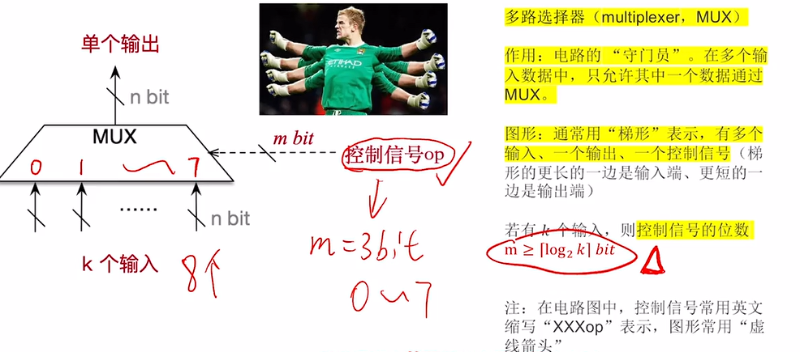


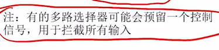

#### 三态门

与多路选择器相似，但是只有两种情况

当op是0时，不允许通过，当op是1，就允许通过

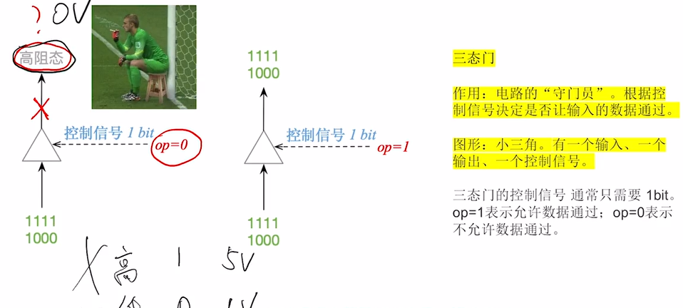

三态门还可以在出口处加上非门取反，图像和非门有些相似，但是飞马没有控制信号


### 加法器


加法器要能实现两个n比特数据的加法

既要考虑这两个本位的值，以及来自低位的进位信息，计算出本位和，以及对高位的进位信息

##### 一位加法器

对于本位和：

只要这三个数1的个数是奇数，就说明本位和是1，对这三个数进行异或即可

对于进位：

也就是有两个以上的1时，进位信息为1，否则为0

也就是AB + ((A+B)C)

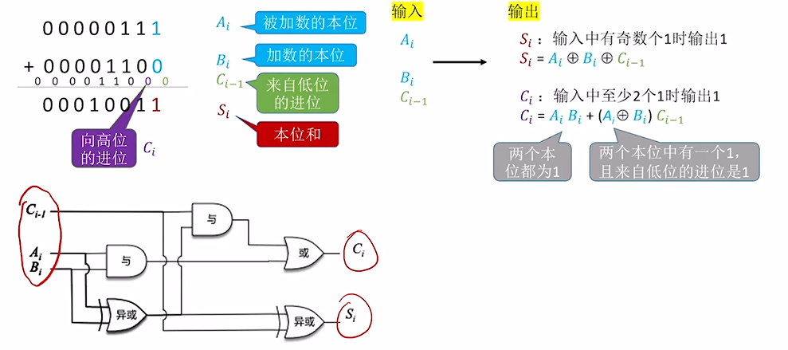

这就是一位全加器，FA


##### n位加法器

把n个一位全加器串联起来，就可以进行两个nbit数的相加

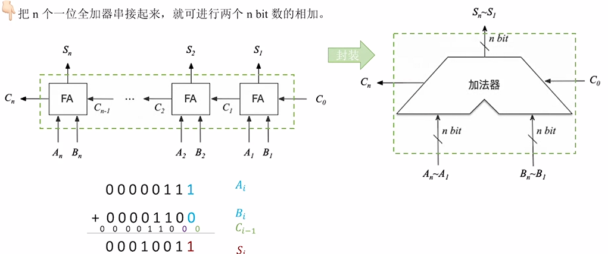

这种加法器**的进位信息是串行产生的**，运算速度较慢

但是这个加法器输入数据是从两端并行的输入

所以总结起来叫做**串行进位的并行加法器**


###### 并行进位的并行加法器:


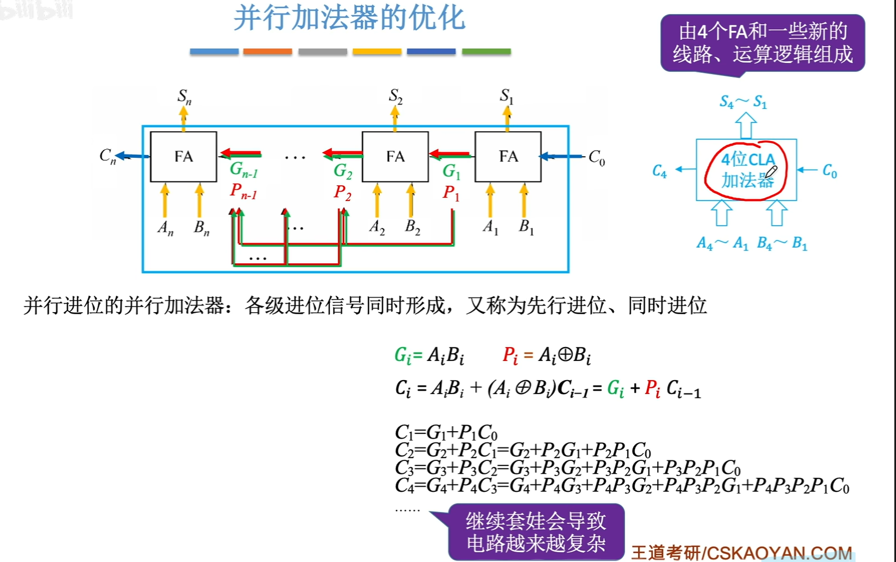

也就是为这些展开式设计专用的电路，便于提前接收到后面的一些结果，提前做一些运算

但是为了防止电路过于复杂，层数不易过高一般是4位的CLA加法器

这种加法器的进位信息是并行产生的，更快


#### 带标志位的加法器

由于计算时会溢出，计算机硬件应当能判断

此外，判断结果的符号也很常用，最好也能让硬件直接给出

为此，对加法器增加了许多标志位便于判断

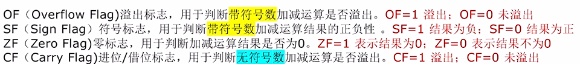

**OF溢出标志(Overflow Flag)**

用于判断**带符号数**的加减运算是否溢出，1代表溢出，0代表未溢出

对最高位进位和次高位进位两个数进行异或

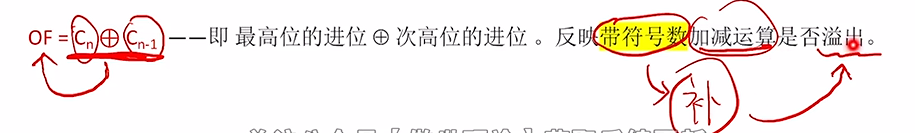

**SF符号标志(Sign Flag)**

符号标志用于判断**带符号数**加减运算结果的正负性，1代表负，0代表正

只用看补码的最高位即可


**ZF零标志(Zero Flag)**

用于判断加减运算结果是否为0，ZF=1代表结果是0，ZF=0代表不是0

判断所有位的结果是否全0 全0说明是0，所以使用或非门即可

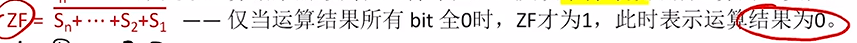

**CF进位/错位标志(Carry Flag)**

用于判断**无符号数**加减运算是否溢出，CF=1代表溢出，0代表没溢出

只用判断进位信息的第一个和最后一个，若它们不一样，则溢出，也就是对他俩进行异或


### 算数逻辑单元ALU

ALU是运算器的核心，加法器是ALU的核心

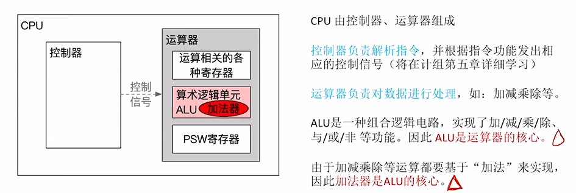

#### ALU的功能


算数运算：加减乘除

逻辑运算：与、或、非、异或、移位等

其它：求补码、直送(完全不处理，直接从输出端输出)等


ALU接收到m比特的由控制器产生的控制信号，对两端的数据进行对应的操作，并输出结果。

若ALU有k个功能，则控制信号的位数 $m\ge log_2k$ bit


#### ALU的电路原理

可以看作是一个多路选择器，把每种功能的电路接到多路选择器上，根据对应的控制信号，输出对应的结果即可

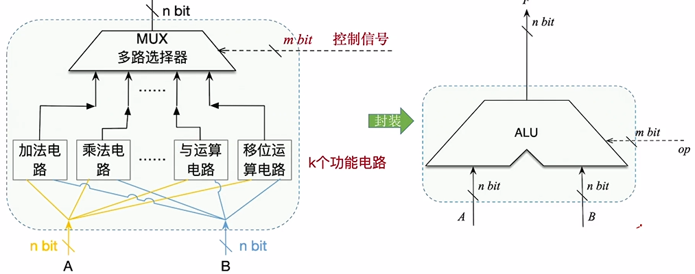

#### ALU图示

ALU的运算数与计算机的机器字长相同

也会有4个标志位ZF、OF、SF、CF分别代表零标志位、有符号数溢出、有符号数正负，无符号数溢出(和上面带标志的加法器一样)

这些标志位会被送到**PSW程序状态字寄存器**中(有的系统也称其为**标志寄存器FR**)

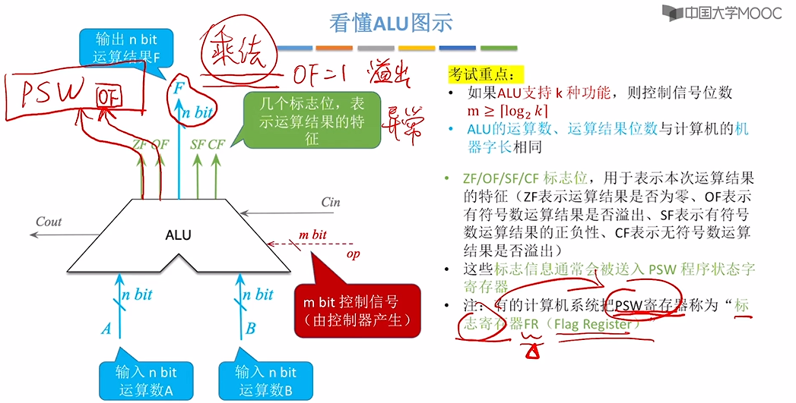


### 定点数的移位运算


移位包括算数移位、逻辑移位和循环移位

#### 算数移位


其实就是改变每个数码的位权，左移就是乘上r，右移就是除以r

可以使用移位运算等价实现乘法和除法


##### 对原码移位

符号位不变，仅对数值位进行移位

对于右移，高位补零，移出的数据就直接舍弃掉，所以精度会有损失。

对于左移，低位补零，超出的还是直接丢弃，这可能会溢出

小数也是同理


##### 对反码移位

对于**正数**来说，反码**和原码一样**，所以移位的方法也一样

对于**负数**来说，其实与原码也相似，但是注意**补位的数据是1**


##### 对补码移位

正数和原码也相同

对于负数，由于补码是反码加1得来的，加1时会产生进位，把相连的1再反转一次，所以补码的尾部的连续0直到第一个1，这部分是和原码相同的，这部分的左侧是未改变的反码，所以与反码相同

所以说**右移的时候与反码相同，补1**；**左移的时候与原码相同，补0**

**其实说到底就是让左移是真值乘以2，右移就是让真值除以2**，但是可能会产生溢出或精度丢失

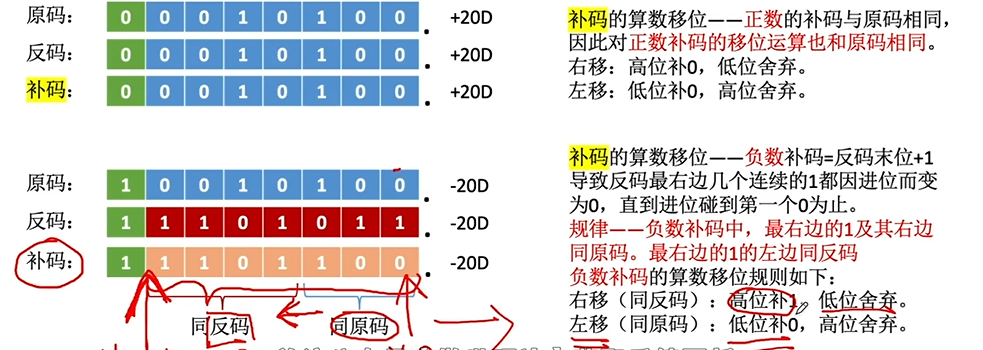


#### 逻辑移位

逻辑移位就是可以直接看作是原码的移位，但是符号位也跟着一点

也就相当于是对**无符号数的算数移位**


#### 循环移位

在移动时，移出的数据不丢弃，而是放到另一端


还有带**进位位**的循环移位，就是相当于多了一位移动的空间，区别不大

(进位位CF，是用于存放进位信息的，可以实现超过8bit的加法，可以得到正确的结果)


### 定点数加减运算

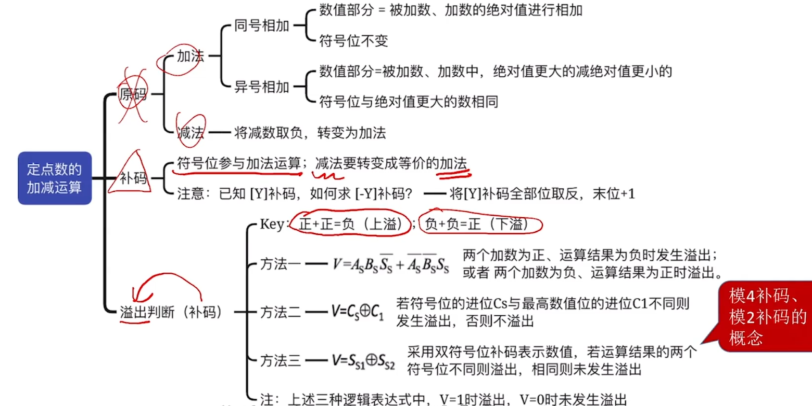

一般来说，进行加减运算只用原码和补码，是不用反码的

#### 原码的加减

如果直接对原码进行加减，很可能得到错误的答案，所以要根据两数的符号进行分类进行

两正相加就直接数值相加取正数

两负相加，就数值相加取负

正负相加，就让数值大的减数值小的，符号与原理数值大的数相同


对于减法，就把减数取反，就可以转换成加法了

两个同号的数相加时可能会产生溢出，需要注意


#### 补码的加减


两数加减的补码与两数补码的加减相同(带符号位进行计算)
$$
[A+B]_补 = [A]_补 +[B]_补
$$

$$
[A-B]_补 = [A]_补 +[-B]_补
$$

对于$[-B]_补$，它其实就是B的补码带着符号位一起取反，然后再加1


这样将两个数的补码加减后，就得到了结果的补码，再将结果转换成真值即可

但是注意还是会产生**溢出**

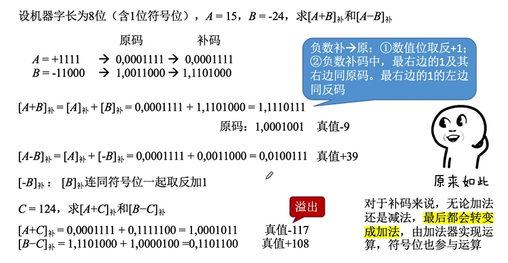

##### 溢出判断

溢出分为上溢出和下溢出

只有正数+正数会产生上溢出：正+正=负

负数+负数才会产生下溢出：负+负=正


###### 采用1位符号位(只看符号位)


$A_S$、$B_S$代表两个加数的符号，$S_S$代表结果的符号

则溢出表达式为
$$
V = A_S B_S \overline{S_S} +\overline{A_S B_S} S_S
$$
当V=1，说明溢出了，V=0则没溢出

**也就是两个加数符号相同，但是结果与其不同，说明溢出了**


###### 采用1位符号位(看符号位进位和数值位进位)


$C_S$是符号位进位，$C_1$是数值位最高位的进位

| 溢出类型 | $C_S$ | $C_1$ |
| :------- | ----- | ----- |
| 上溢出   | 0     | 1     |
| 下溢出   | 1     | 0     |

当符号位进位和数值最高位的进位不同时发生溢出
$$
V = C_S \oplus C_1
$$

###### 采用双符号位

正数符号位为00，负数符号位为11（只是计算的时候有两个，**实际存储还是1个**）

若结果的符号位为01则上溢，为10则下溢


双符号位补码又称模4补码，单符号位补码又称模2补码

#### 无符号数的加减运算


**加法**：就直接按位相加即可

**减法**：

与有符号数类似，需要转换成加法来计算，也就是把**减数转换成它的补数**，再与原来的被减数**相加**，就是结果了

求补数其实就是求模256同余的数，和补码求法很像，就是要**把所有位都取反，然后+1**

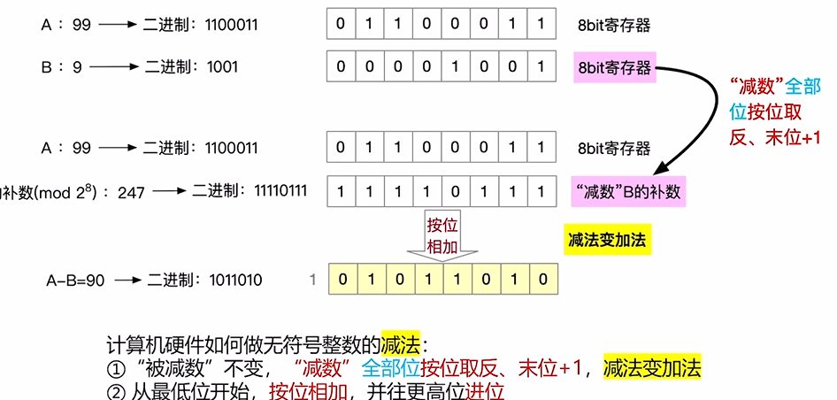


##### 判断溢出

直接手算判定很简单，结果超出 0~2^n^-1 这个范围，则溢出

计算机判别：

**加法**：最高位产生**进位**1，说明**上溢出**


**减法**：最高位的进位为0(也就是**没有进位**)，说明发生了**下溢出**

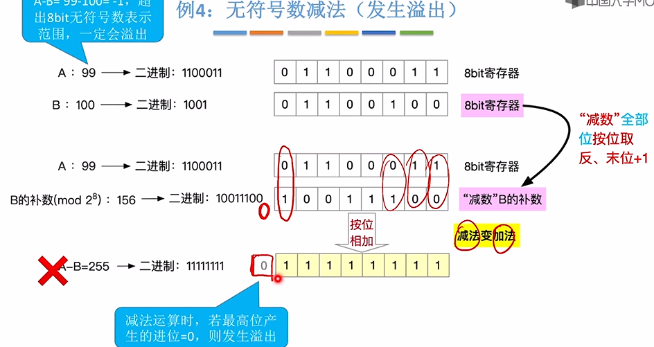


#### 补码加减的运算电路

只需要对原有的加法器进行一些拓展就可以进行补码的加减运算了

最加数B处增加了一个多路选择器，接收Sub控制信号，Sub=1时代表减法，0代表加法

当Sub=0时，直接把B的数据输入 加法器

当Sub=1时，需要把B的数据全部取反，输入加法器，而且此时来自低位的进位Cin也要置为1（它与Sub相连）


而且也可以实现无符号数的加减法运算


##### 带符号位的补码加法器

与之前加法器的符号位没有区别

注意一下CF的实现原理，它是$C_{in}$和$C_{out}$进行异或的结果，

这是因为加法的时候，最高位进位为1发生溢出，而此时$C_{in}$为0，

减法的时候，最高位进位为0发生溢出，而此时$C_{in}$为1，

所以对它们异或即可判断溢出

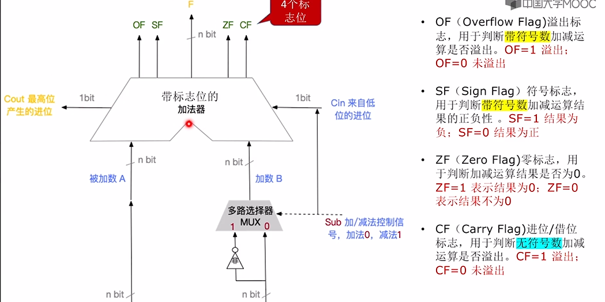


### 定点数的乘法


#### 原码的1位乘法

假设机器字长为n+1，符号位为1位，求它们的乘积xy

符号位先单独处理
$$
符号位 = x_s \oplus y_s
$$
然后对数值位进行乘法计算

首先通用寄存器X要存被乘数，乘商寄存器刚开始存放的是乘数，刚开始ACC也清零

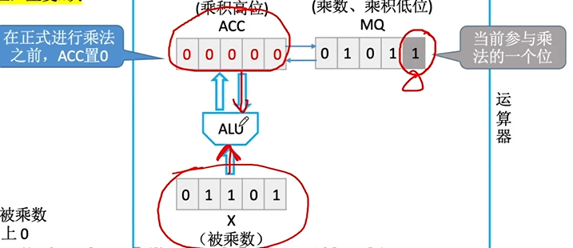

然后判断MQ里当前位置(最低位)的数，若是1则ACC加上X里的被乘数，若是0 则加0

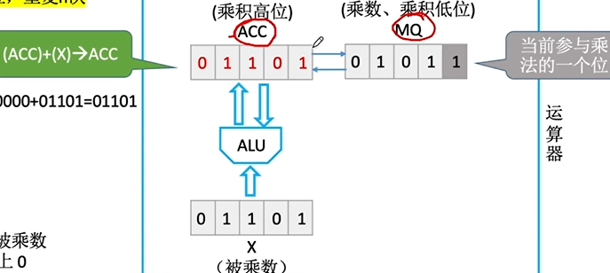

然后让ACC和MQ整体**逻辑右移**(左边补0，**符号位也要移动**)


重复上述过程，拿MQ当前的最低位乘以X的值加到ACC上，然后ACC和MQ整体右移，直到MQ的最低位是原来乘数的符号位就结束

也就是机器字长n+1位数值位n位的数乘，上述操作重复n次

最后修改符号位，改成原来符号位的异或


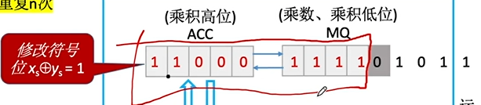


由于补码乘法一定要用双符号位，所以原码乘法为了记忆就也用双符号位吧

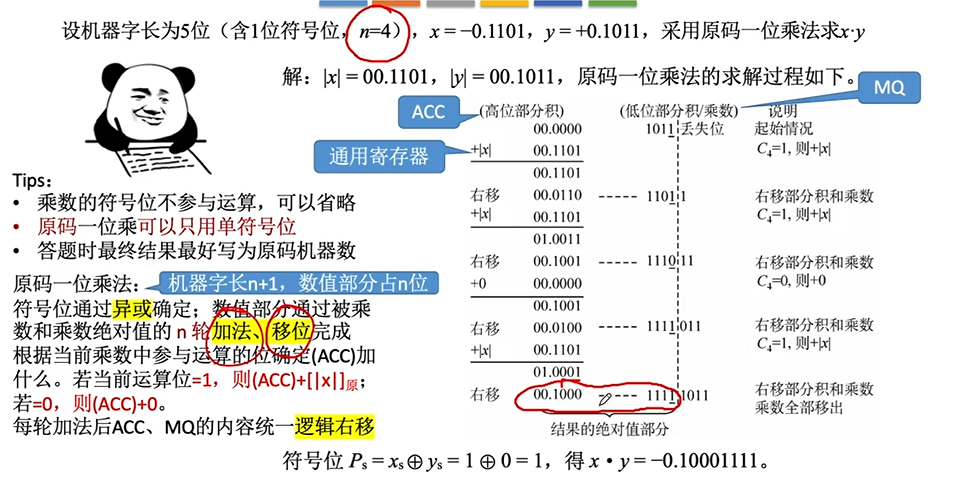

最好在计算出来真值后写出原码

以上是使用小数乘法举例，整数乘法相同，就是注意小数点的位置不同即可

> **当乘积的高33位不全是0或全是1，说明溢出了**

#### 补码的1位乘法


补码运算主要要注意：移位采用算数移位(**符号位不动**，右移补的和符号位相同)，符号位也参与计算

在MQ多了一个辅助位，在原来寄存器的后面，会存储上一轮被移出的最低位

所以MQ有n+2位，与此同时ACC和X也变为了n+2位，在前面多一位，用于实现双符号位的补码运算

最后一轮数值位完成后，**最后还有一次加法，但是不移位**

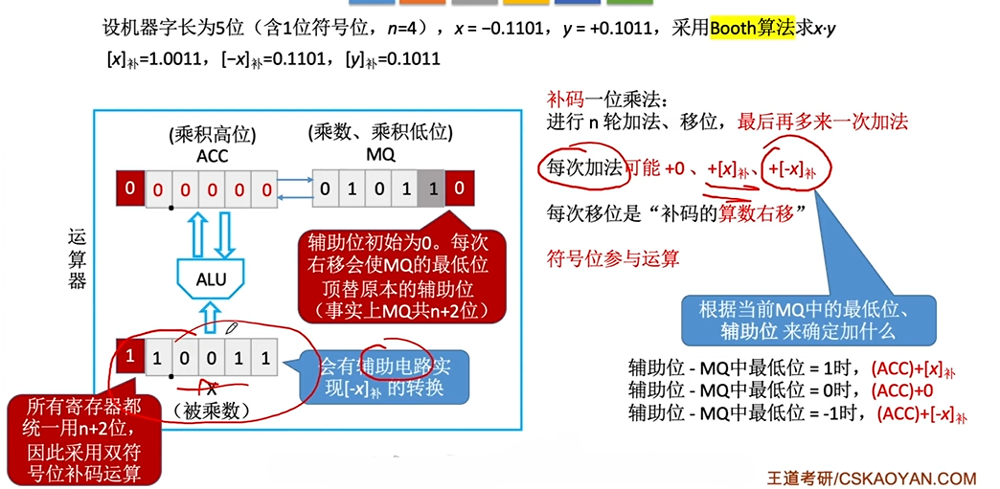

下面是具体流程

首先ACC置0，X存入双符号位的被乘数补码，MQ的前n+1位放入单符号位的乘数补码，n+2位也就是辅助位 置0

先判断**辅助位减最低位**(MQ的n+1位)的值

- 若是1，则ACC加上$[x]_补$
- 若是0，则ACC加上0
- 若是-1，则ACC加上$[-x]_补$

带符号一起计算补码的加法，现在ACC就是计算结果

根据现在ACC结果的正负性(开头是11就负)，ACC和MQ整体**算数右移**一位(注意正负数左边补的数不同，而且**ACC的符号位不动**)

总共n轮加法和算数右移，n轮结束后，

**再判断辅助位减最低位的值**，ACC加上对应的数，**但是不移位**

（最后一次时，最低位其实就是原来乘数的符号位，所以才说符号位也参与运算）

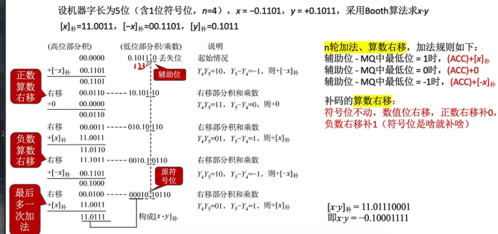


### 定点数的除法

> ***注意，对于定点小数除法，被除数的绝对值一定得大于除数，因为定点小数表示不了大于1的数，所以说如果第一步得到的商是1的话，会直接停止运算。***


手算方式如下


#### 原码的除法(恢复余数法)

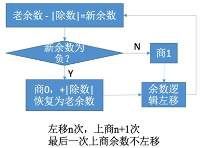

符号也是单独处理，对两数的符号位进行异或

下面就只考虑数据的绝对值，当作正数来计算(符号位也改为0)


最开始，ACC存储被除数(也可以看作是商0时的余数)，通用寄存器X存储除数，MQ存储商，先置为0

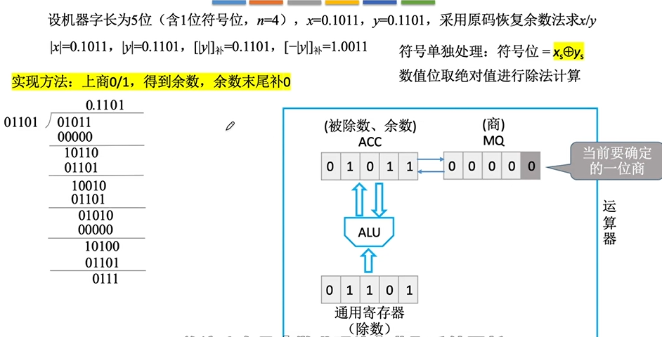

然后看MQ的最低位，先假定其为1，此时先让ACC减去y(也就是加上$[-y]_补$(也就是带上符号位取反+1) )

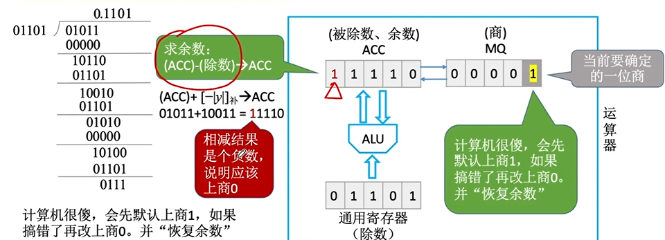

判断此时ACC结果的符号位

- 若是1,说明结果是负数，代表此处的商不能为1，需要把ACC复原，也就是再加上y，然后把商改回0
- 若是0，说明结果是正数，说明对了，不用修改

然后把此时的ACC和MQ看作整体，统一逻辑左移(右边补0，符号位也一起移动)

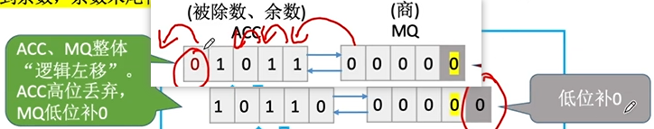

然后重复上述操作，直到n位的商全都计算完毕

最后要调整结果，主要是余数要乘上$2^{-n}$ 这是因为它左移了n次，需要变成真正的值

并且判断商的符号位，把符号位改为两数的符号位的异或


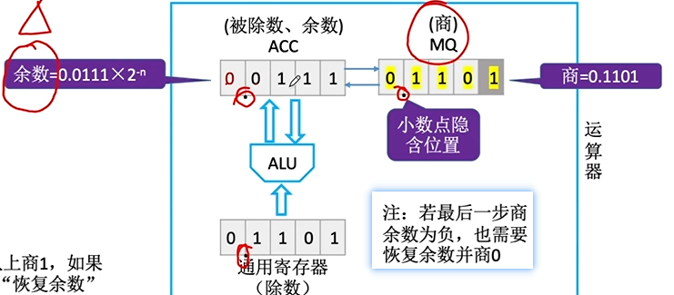


手算的话是这样


#### 原码的加减交替法(不恢复余数法)


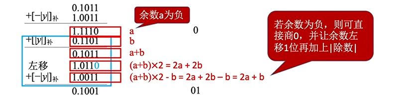

原来余数出现负数时，可以经过化简，省去恢复余数的过程

发现是**负数**后，**把商改为0后，不用再恢复余数**

**直接左移，但是注意这样下一步就要变为*加上*除数了**

如果是**正数**，就和之前一样，下一步还是要**减去除数**

但是**最后一步如果**发现余数**是负数**，就**要把它恢复(再加上除数绝对值)**，不左移，这样才有正确的结果


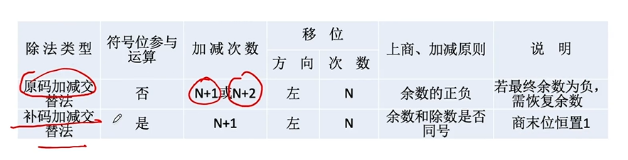

#### 补码的除法运算(加减交替法)

大体上与原码的运算是相同的，只有少数区别

补码的符号位要参与运算，被除数/余数，除数均采用**双符号位**

注意刚开始，存储的不是数的绝对值，而是该数据带符号的补码

ACC存储被除数的双符号补码，X存储除数的双符号补码，MQ存储商，刚开始还是0


第一步，先判断加减需要看除数和被除数的符号

- 被除数和除数**同号**，用被除数**减**去除数，**商1**
- 若**异号**，被除数**加**上除数，**商0**

把数据带着符号位加减结果计算出来后，连同MQ的商一起**逻辑左移1位**

然后把新得到数(也就是余数)，当作下一轮的被除数，重复此过程

**直到最后一位时，不要计算直接恒置为1**

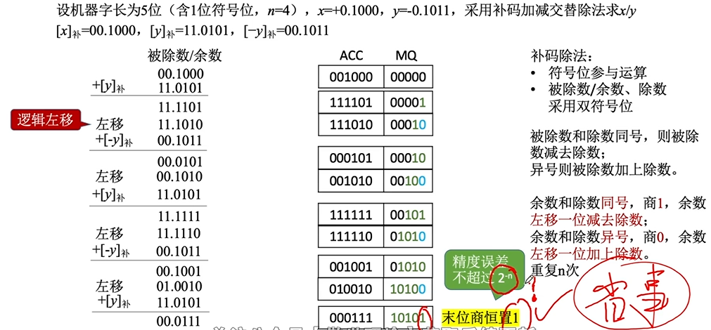

最后计算余数时，记得乘以$2^{-n}$


## 浮点数的表示和运算


浮点数是为了在位数不变的情况下增加数据的表示范围


### 浮点数的表示


由阶码和尾数组成，若阶码为E，尾数为M

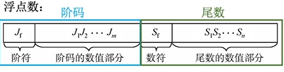

N是真值.r是进制(一般是2)
$$
N = r^E \times M
$$
阶码E反映浮点数的表示范围及小数点的实际位置

尾数M的数值部分的位数翻译浮点数的**精度**


尾数给出一个小数，而阶码就是小数点前移或者后移的位数

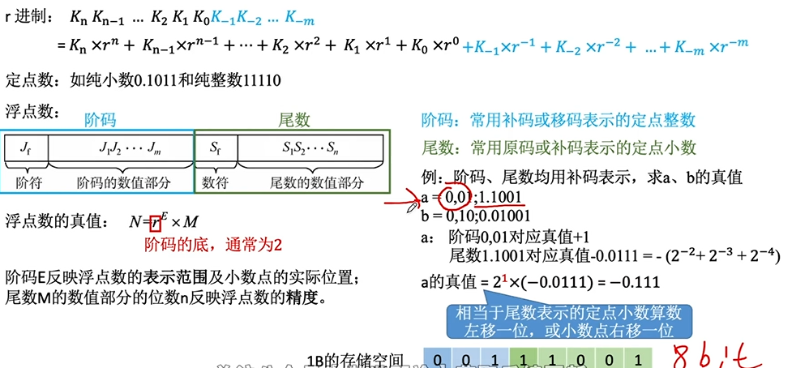

#### 浮点数尾数的规格化

要求尾数数据的第一位必须是有效数据(二进制也就是1)，且符号位不变

当第一个数据第一位不是1时，要把数据左移，同时阶码减一，也就是**左规**


当运算后的尾数数据过大时(发生溢出时)，需要进行右移，同时阶码加一，也叫**右归**

使用**双符号位可以很方便的判断溢出**，而且只需要右移一次就可以变为正确的值


#### 规格化浮点数的特点

如果对使用**原码**表示的尾数进行规格化：

- 正数一定是0.1***的形式，最大值为0.1111，最小值为0.1，所以正数尾数的表达范围是
  $$
  \frac{1}{2} \le M \le (1-2^{-n})
  $$

- 对于负数一定是1.1***，最大值是1.10000，最小值是1.11111，所以负数尾数的范围是
  $$
  -(1-2^{-n}) \le M \le -\frac{1}{2}
  $$

如果使用**补码**进行尾数规格化：

- 对正数来说没有区别，仍然是0.1***的形式，最大值为0.1111，最小值为0.1，所以正数尾数的表达范围是
  $$
  \frac{1}{2} \le M \le (1-2^{-n})
  $$

- 对于负数一定是**1.0*****，最大值是1.011111，最小值是1.000000，所以真值的范围是
  $$
  -1 \le M\le -(\frac{1}{2}+2^{-n})
  $$
  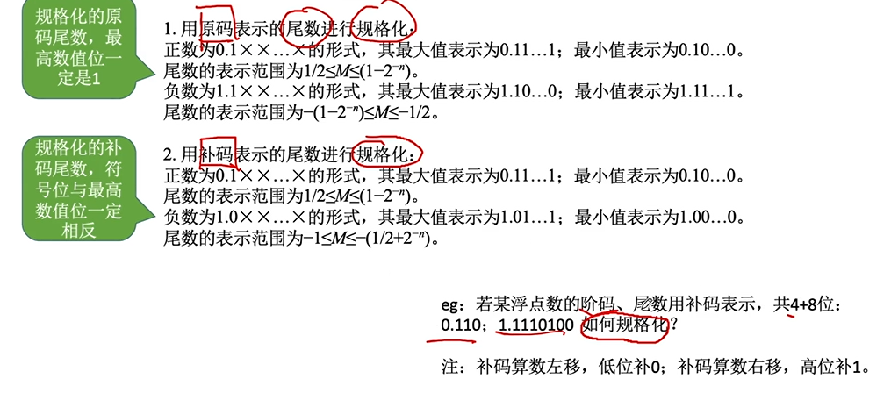

**注意负数补码尾数规格化是数值第一位必须是0，别忘了阶码也要修改**


**浮点数的溢出：**

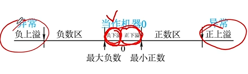

正下溢和负上溢是浮点数能表示的最小小数溢出了，此时可以把它认为是0


### IEEE754


移码：真值+偏置值(一般来说偏置值取$2^{n-1}$,此时移码就是 对应补码的符号位取反)

偏置值可以取其他值，对于IEEE来说，偏置值取$2^{n-1}-1$

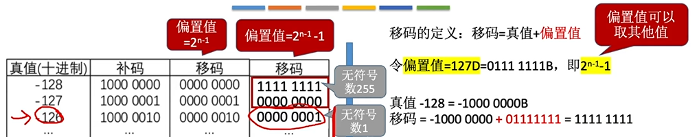

#### IEEE754标准

数据首先是1位数符，然后是阶码和尾数，类型不同位数也不相同

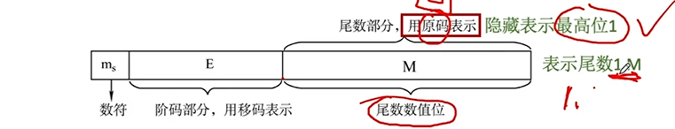

阶码使用移码(偏置值是$2^{n-1}-1$，注意此时的移码全1($-2^{n-1}$)和全0($-(2^{n-1}-1)$)用于特殊用途，一般不表示真值)

尾数使用原码表示(最高位是1，但是只保存小数点后面的数据，所以相当于可以多表示一位)

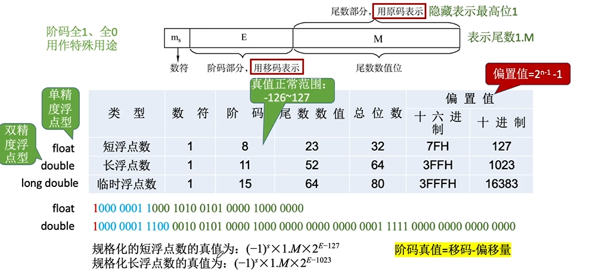

#####   浮点数表示的范围


#### 阶码全0或全1的特殊用途

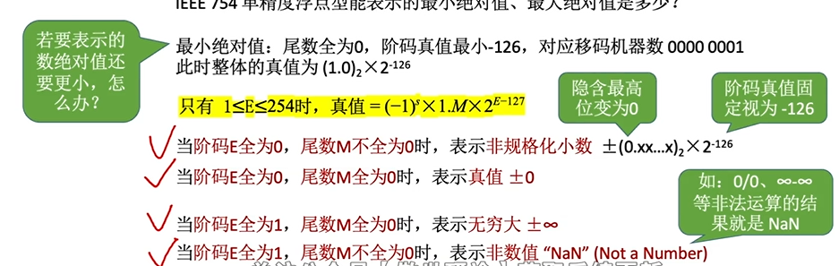

当**阶码全为0，尾数M不全为0**时，表示非规格化小数，表示$\pm (0.xxxx)\times 2^{-126}$(这是对单精度，其实就是隐含最高位变为了0)

当**阶码全为0，尾数全为0**时，表示真值$\pm0$


当**阶码全1，尾数全为0**时，表示无穷大$\pm \infty$ 

当**阶码全1，尾数不全为0**时，表示非数值，NaN


### 浮点数的加减运算

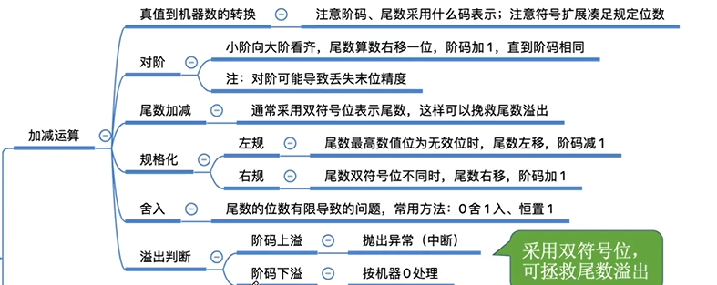

一般实际卷子上的运算不使用IEEE754，而是要先按要求，把对应数据化成对应的形式，然后再按照下述步骤操作 


#### 对阶

让阶数小的向阶数大的靠齐，阶码变大后尾数也右移

#### 尾数加减

把对好阶的尾数进行加减法

#### 规格化

把结果重新规格化，左规或右规

#### 舍入

根据要求的有效尾数，进行舍弃或者进位(看要求，可能是四舍五入，也可能直接舍)


#### 判溢出

判断溢出，根据要求，看**阶码**有没有超过范围(阶码溢出才是真溢出，尾数溢出不一定会真的溢出)

#### 实际例子


### 浮点数的强制类型转换

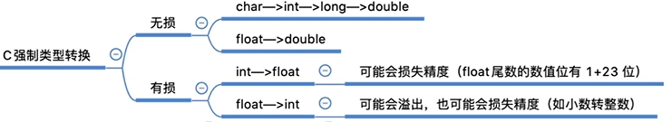

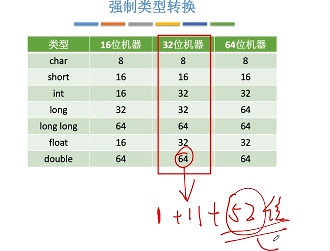

double的尾数位数最多是52位，但是可以无损表示53位的尾数，这是因为IEEE754会有一个隐含的1省去不写


所以32位的数据向double转换时是无损的，而64位向double转换就需要舍入了

float尾数有23位，最多表示24位尾数，大于的话也需要舍入

int转float不会溢出，但是可能损失精度

而float转int既可能溢出，也可能损失精度(这是因为int不能表示小数)


### 数据的存储和排列

#### 数据的大小端模式

最高有效字节(最高位的一个字节)是MSB，最低有效字节(最低位的一个字节)是LSB

**大端方式**就是：高位字节存储在地址的低位，低位字节存储在地址高处(符合人的阅读习惯，从左到右)

**小端方式**就是：低位字节存储在地址的低位，高位字节存储在地址高位(便于机器存取)


#### 数据的对齐存储

计算机一般是**按字节编址**，也就是一个字节是一个地址

而**寻址**通常支持**按字、按半字、按字节**寻址

(**字与存储字长相同**，按字寻找就是指给每个字一个编号，查找字的编号进行寻址，通常要与字节编址进行转换，像32位的字地址只需要逻辑左移2位，就变成了相应的字节地址)


**每次访存只能读/写一个字**

边界对齐就是为了减少访存次数而产生的，也就是尽量把一整个数据存储在同一个字中


对于C语言来说，采用的就是边界对齐方式，特别是存储结构体时

如

```c
struct A{
    int a;
    char b;
    short c;
}
struct B{
    char b;
    int a;
    short c;
}
```

在32位的计算机上，A的大小是8字节，而B的大小是12字节


# 存储系统


## 存储器概述


存储器主要分为：寄存器、Cache、内存、辅存  （外存）

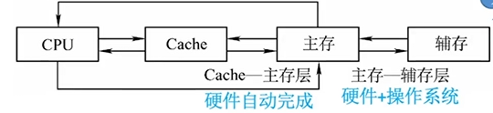

越往后容量越大，但速度越慢

其中CPU可以直接和寄存器、cache、主存交换信息，但是**辅存数据必须要调入主存才能被CPU访问**

主存--辅存：实现了虚拟存储系统，**解决了主存储容量不够的问题**

Cache--主存：**解决了主存与CPU速度不匹配的问题**


### 存储器的分类

#### 按层次分类

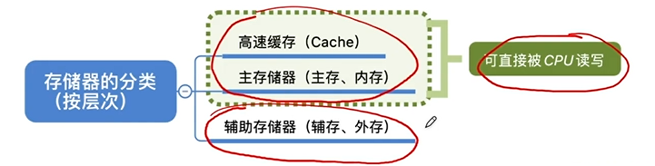

#### 按存储介质分类

**半导体存储器**

**磁表面存储器**

**光存储器**


#### 按存取方式分类

**随机存取存储器RAM**：读写任意一个存储单元的时间相同，与物理位置无关

**顺序存取存储器SAM**：读写时间与物理位置有关

**直接存取存储器DAM**：即有随机存取特性，又有顺序存取的特性，先直接访问到存储单元的区域，然后按顺序存取来找

后两者也可以归为**串行访问存储器**


**相联存储器CAM**：**按照内容检索存储位置**进行读写


#### 按信息的可更改性进行分类

**读写存储器**：既可以读，又可以写

**只读存储器ROM**，只能读，不能写


#### 按信息的可保存性分类

**易失性存储器**：存储信息断电后会消失

**非易失性存储器**：存储信息断电后仍然保存

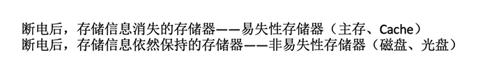

**破坏性读出**：信息读出后，原存储信息被破坏，读完数据需要重新写

**非破坏性读出**：信息读出后，原存储信息不被破坏


### 存储器的性能指标


- 存储容量：存储字数$\times$字长

- 单位成本：每**位**价格  =  总成本/总容量

- 存储速度：**数据传输率** = 数据宽度/存储周期

  > 存取时间：从启动一次存取操作到完成该次操作花的时间
  >
  > 存取周期：连续两次存取之间所需要的最小间隔
  >
  > 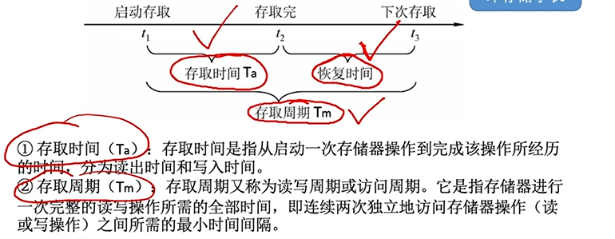
  >
  > 主存带宽：也称**数据传输率**，表示每秒从主存进出信息的最大数量，单位为字/秒、字节/秒、位/秒
  >
  > 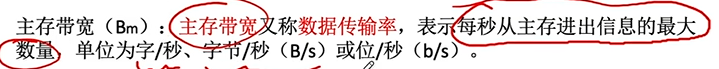


## 主存储器

### 主存储器的基本组成

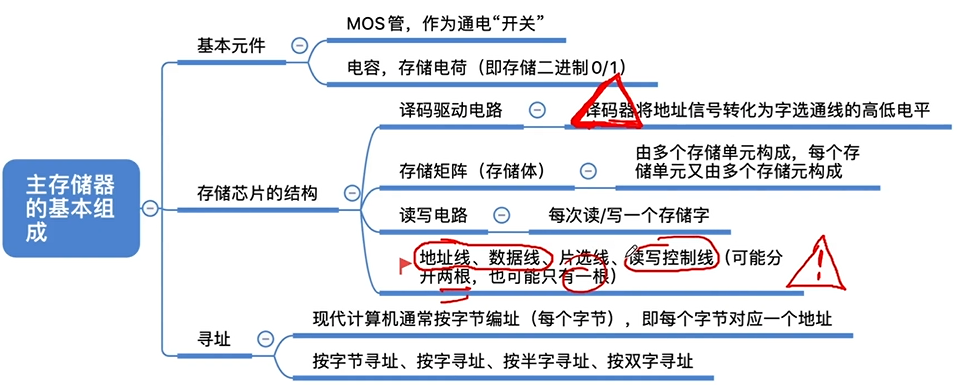

主存储器由存储体、MAR、MDR组成

#### 基本半导体元件及原理

每个存储元由电容和MOS管组成，电容里存储的电荷可以表示0和1

给电容充电就是存数据，放电就是写数据

多个存储元串成一行，叫做一个存储单元，多个存储单元就构成了存储体


#### 存储芯片的基本原理

##### 译码器部分

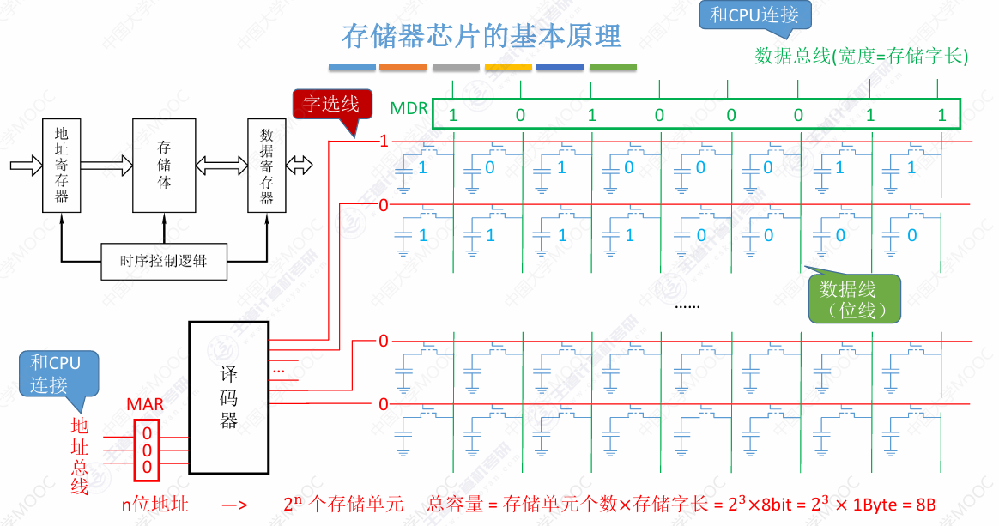

**译码器**用于选择存储单元，

MAR处的n位地址，可以在译码器对应成成$2^n$个存储单元的地址，

译码器会通过**字选线**(让这条线变为高电平)选择对应的存储单元，

通过**数据线**读出数据到MDR中，

然后CPU通过数据总线一次读入MDR中的数据


##### 控制电路部分

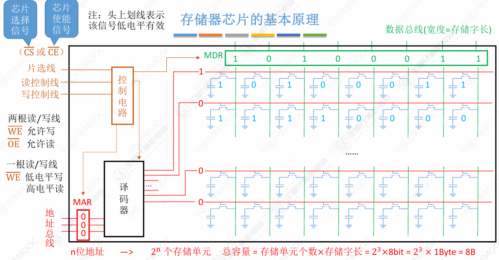

除此之外还有**控制电路**，用于发出信号，使对应器件工作，

如在MAR电压稳定前，不会给译码器发信号，当稳定时才发信号将地址送入译码器，输出时也同理


存储芯片还需要有**片选线**对外进行输出

通常会用**$\overline{CS}$或$\overline{CE}$** (chip select或chip enable)表示，其中上面的**横线代表**该信号在**低电平时有效**


还有**读/写控制线**

$\overline{WE}$代表允许写，$\overline{OE}$代表允许读

也有时候用一根线$\overline{WE}$，低电平代表写，高电平代表读


##### 封装后来看

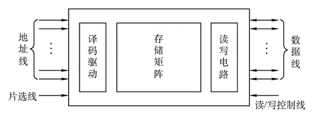

存储矩阵就是原理多个存储单元组成的部分

译码驱动包括原来的译码器，和用于确保信号能传输到对应存储单元的驱动器

读写电路包括原来的控制电路和原来图里用于读写数据传输的线路(红色和绿色的)

地址线用于接收CPU传入的地址信息

数据线用于将数据的交换

片选线用于表示当前这块芯片是否可用

读写控制线表示当前是读还是写


图中每一根线在实际芯片上会对应一个针脚(除此之外还可能有供电引脚、接地引脚)


8$\times$8位的芯片，代表共有8个地址单元，存储字长是8bit

也就是地址线有$log_2(8) = 3$条，数据线有8条


#### 寻址

一般是按字节寻址，所以总容量为N B，地址线就会需要$log_2(N)$条

当按字或者按半字、双字寻址时，可能真正用到的数据线会少于这个数


### SRAM和DRAM


RAM是随机访问存储器

DRAM是动态RAM，使用**栅极电容**存储信息，一般用于制作主存

SRAM是静态RAM，使用**双稳态触发器**存储信息，用于制作Cache


> 对于DRAM的一些计算：
>
> 整个芯片如果有多个DRMA芯片，只用看一个芯片有多少行
>
> 所有DRMA是同时刷新的
>
> 计算地址条数，需要除以2

#### 栅极电容与双稳态触发器

栅极电容几乎就是上一节的存储元，一个MOS管一个电容，只需要一根数据线，当MOS管接通，电容放电时，读出1；若不放电，读出0

但是当其放电时，信息会被破坏，也就是**破坏性读出**，读出后应当有**重写**操作恢复数据

由于电容的电荷会流失，所以需要**定时刷新**(也就是重新充入电荷)，大概2ms就要刷新一次

所以相对之下速度较慢，但是**制造成本低，集成度高，功耗低**

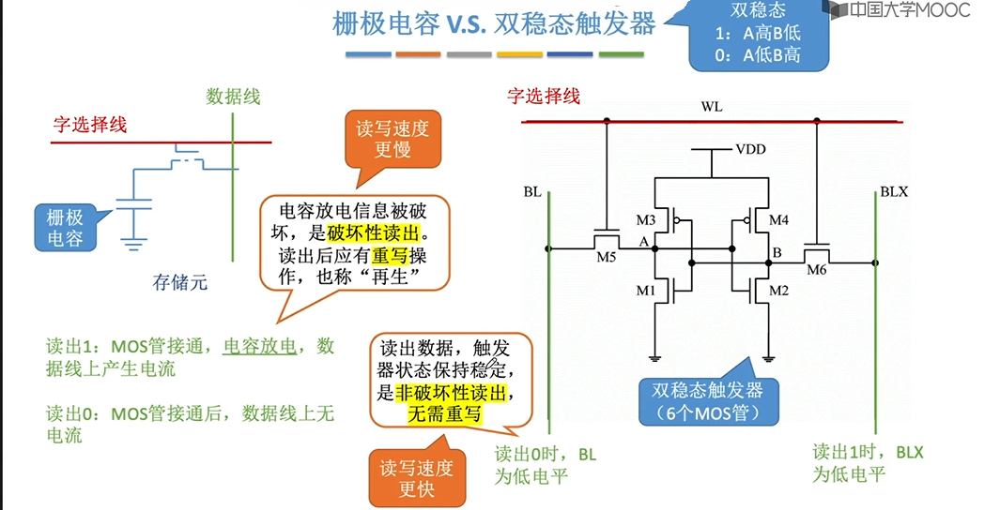

双稳态触发器比较复杂，由6个MOS管，2个数据线组成，当电平A高B低时读出1，A低B高时读出0

读出数据时，触发器状态保持稳定，是**非破坏性读出，无需重写**

**不用刷新**，只要不断电就不会改变

速度较快，**成本高，集成度低，功耗高**

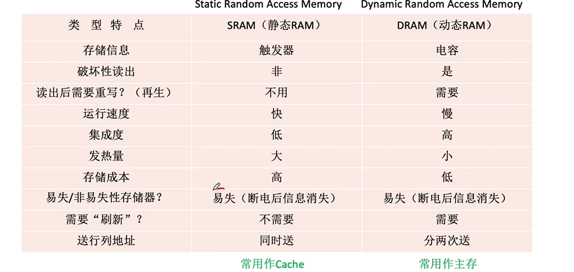

#### DRAM的刷新

**刷新由存储器独立完成，不需要CPU的控制**

刷新是**通过**对存储单元只读但不输出数据的**假读实现的**

1. 刷新周期：一般为2ms

2. 以行为单位，每次刷新一行存储单元

   > 使用行列地址是为了减少选通线的个数，如果不用需要$2^n$根，而用行列地址只需要$2^{\frac{n}{2}} + 2^{\frac{n}{2}}$根选通线
   >
   > 行列地址的实现：把原来的一维存储单元看作一个矩阵，拆分成行地址和列地址，分别送给行地址译码器和列地址译码器
   >
   > 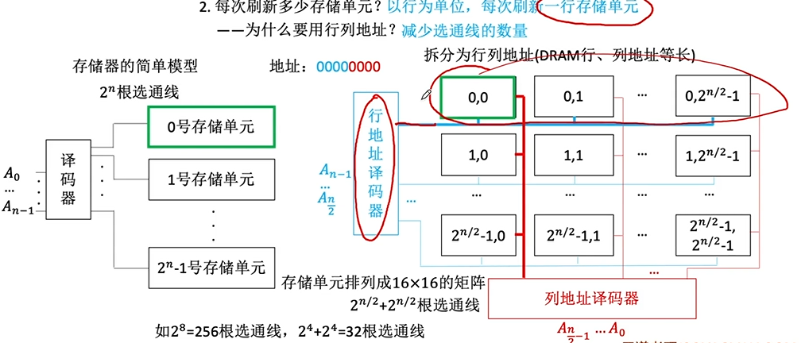

3. 有硬件支持刷新，读出一整行的数据后重新写入，会占用1个读写周期

4. 刷新时间:

   > 假设DRAM内部排列是128*128，且读写周期(存取周期)是0.5微秒，则2ms共4000个周期。有下面家中刷新方式
   >
   > **分散刷新**：每次读写完毕后刷新以下，会导致存取周期翻倍变成1微秒，**没有访问死区**
   >
   > **集中刷新**：在2ms内集中安排时间全部刷新，系统的存取周期还是0.5微秒，但是会有一段时间专用于刷新，无法访问存储器，这段时间称为**访存死区**，对于这个例子，2ms中后128个周期是访存死区
   >
   > **异步刷新：**把所有刷新分散到2ms中，保证在2ms中每行都能刷新一次，对于这个例子就是2ms/128 = 15.6微秒刷新一次，**访问死区比较分散**
   >
   > 


#### DRAM的地址线复用技术

**把行地址和列地址分两次送入**，放入行地址缓冲器和列地址缓冲器中，再送入行/列地址译码器，这样每次只需要n/2根地址线即可

可减少整个芯片的地址线数量，让芯片的引脚更少


### 只读存储器ROM

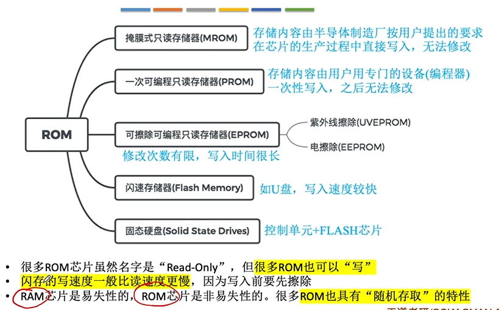

ROM是**非易失性**的芯片，断电后数据不会消失


#### 各种ROM

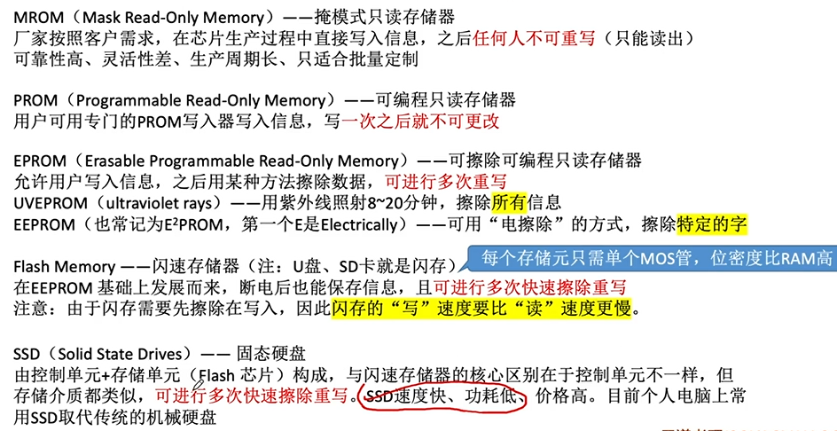

- MROM (Mask Read Only Memory)掩模式只读存储器：在生产时写入信息，之后**完全不能重写**

- PROM(Programmable Read Only Memory)可编程只读存储器：可以让用户写入一次数据，**之后就不能更改**

- EPROM(Erasable Programmable Read Only Memory)可擦写可编程只读存储器：可进行多次擦写

  > 又分为UVEPROM和EEPROM
  >
  > UVEPROM是用紫外线照射后**擦除所有信息**
  >
  > EEPROM用电擦写，可以**擦除特定部分**

- Flash Memory 闪速存储器(像U盘、SD卡就是闪存)

  > 是由EEPROM发展而来的，断电后也能保存信息，**可进行多次快速擦除和重写。**
  >
  > 注意，由于每次写入都要先擦除，**所以写入比读取慢**

- SSD(Solid State Drives)固态硬盘

  > 由控制单元+存储单元(flash芯片)组成，与闪存的核心区别是控制单元不一样，但是存储介质相似，可以多次擦除重写，速度快，功耗低，价格高


#### 计算机内部的重要ROM

操作系统安装在辅存中，刚开机时，RAM里没有数据，无法允许，所以需要一个特殊的**BIOS芯片**(ROM)，存储了“自举装入程序”，用于把操作系统装入主存

虽然BIOS一般集成在主板上，但是我们会在逻辑上把它看作是主存的一部分

且这个ROM和RAM常统一编址（即前n个地址给BIOS，紧接着给RAM）


### 双端口RAM和多模块存储器

408只考多模块存储器

**这两种方式都是用于提升主存速度的**

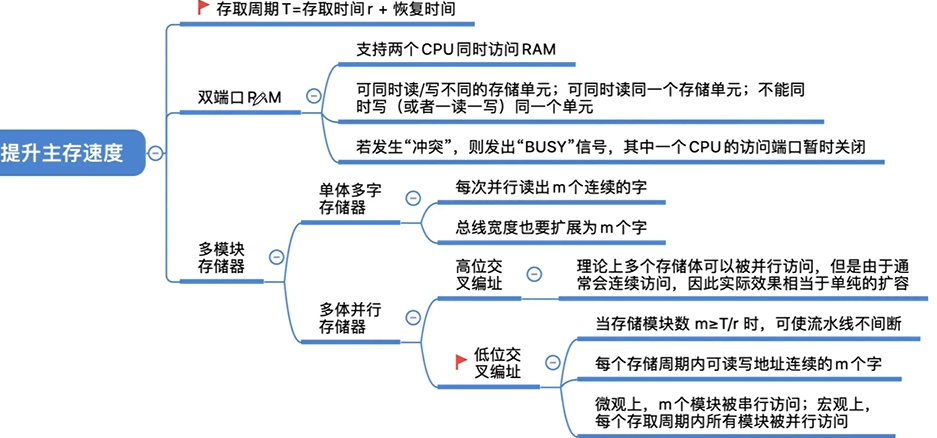

#### 存取周期

存取周期就是可以连续读写的最短时间间隔，**存取时间+恢复时间**

**DRAM的恢复时间较长**，可能是存取时间的好几倍（SRAM就比较短）

当多个核的CPU都要访存，需要等很久

CPU的读写速度远快于主存的存取周期，如果一直等，会严重损失性能，所以有了后面的几种优化方法


#### 双端口RAM

**可以优化多核CPU访问一根内存条的速度**

需要有两组完全独立的数据线、地址线、控制线。CPU、RAM也要有更复杂的控制电路


当不同端口的操作相冲突时(对一个地址同时写，或对一个地址一个写一个读)，要提示忙，暂时关闭一个端口


#### 多体并行存储器

对于多个存储体，进行编址，可以分为**体号**和**体内地址**

假设有N个存储体，就需要$n=log_2(N)$位做体号

**高位交叉编址：**取前n位做体号，所以总的地址在单独一个存储体中是连续的

**低位交叉编址：**取后n位做体号，这种方式，每个存储体中地址是不连续的，但是存储体间，水平的地址是连续的，这样读取一整段数据时，一个存储体读取后，可以再其恢复时间去读下一个存储体的数据，类似流水线作业，能大大提高效率


假设存取周期是T，存取时间是r，那么读连续n个地址

高位交叉编址的时间是$nT$

低位交叉编址的时间是$T+(n-1)r$


##### 存储体个数

假设存取周期是T，存取时间是r

那么**存储体的个数m应当满足$m\ge \frac{T}{r}$** 


#### 单体多字存储器

上面的多体并行存储器，它每个存储体都是一个模块，各个模块都有单独的读写控制电路、MDR、MAR，它们既可以并行工作，也可以交叉工作


还有单体多字存储器，它相当于是把原先多个存储体合并，一次读取一整行，每个存储单元存储m字，总线宽度也需要变为m个字，一次并行读出m个字

但是这种情况不如多体并行存储器灵活，**一次必须读出m个字**，不能单独取某个字

且指令和数据在主存中必须是连续存放的

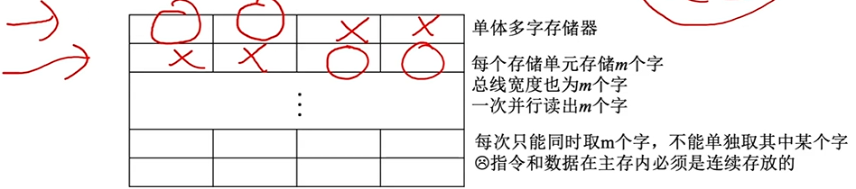


## 主存储器和CPU的连接


### 单块存储芯片与CPU的连接

对于单块存储芯片，需要对外暴露出：

地址线(与行数的对数相同)、

数据线(与一行存储元的个数相同，也就是存储字长)、

读写控制线(可能1根可能2根)，

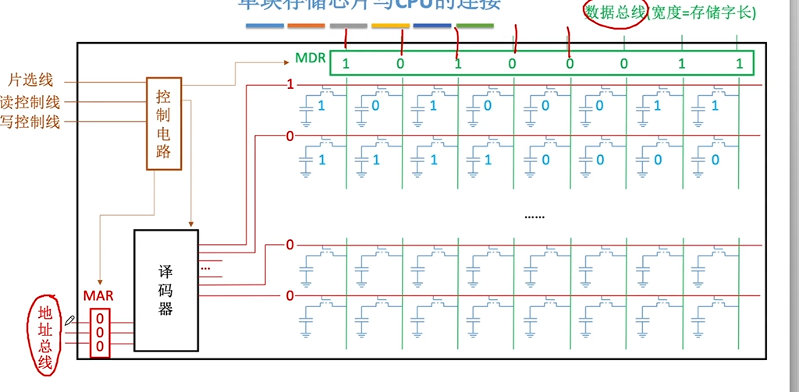

对于现在的计算机，MDR和MAR都是集成在CPU内部的，存储芯片里的只是一个普通寄存器

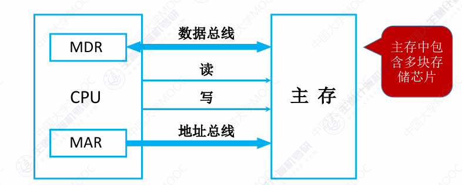

这是对单个芯片连接

当字数不够时，需要对芯片进行位扩展

当总线宽度比芯片的字长大的时候，要用位扩展


### 多块存储芯片与CPU的连接

#### 输入输出信号的命名

- 地址线$A_n$

- 数据线$D_n$

- 片选线$\overline{CS}$或$\overline{CE}$，带横线指低电平时有效

- 读写控制线$\overline{WE}$或$\overline{WR}$，低电平代表写，高电平代表读

  也可能分开成$\overline{WE}$或$\overline{OE}$两条读写线

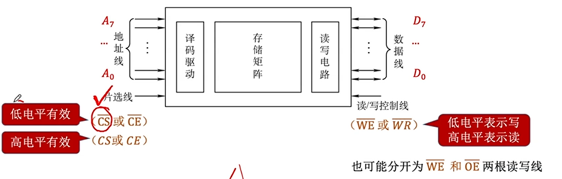

#### 增加存储字长—位扩展

把每个小芯片的地址线都连接到主存对应的**同一段地址线**上

数据线每个小芯片连n位(n是小芯片自己的字长)**不同的数据线**

**片选信号都置为选通**(要看是需要低电平还是高电平)

这样每次选到该地址，所有小芯片会同时读或者写，相当于是把它们水平拼接在一起，也就是把**位扩展**了

如下图就是把$8k\times 1$位的最终扩展成了$8k\times 8$位的，也就是把1位的扩展成了8位的


#### 增加存储字数—字扩展

当数据总线已经使用完全，但是地址总线还有空余时，可以把剩余的t个地址信号经过以下两种方式，转换成片选信号，分发给多个小存储器，这样就相当于增加从存储的字数，也就是容量扩大了

> - **线选法**：给每个芯片的**片选线直接连接一根地址线**，以2根地址线且片选信号高电平有效为例，一根0一根1时，1的那根工作
>
>   但是这样会有问题，当有2个及以上的1时会发生冲突，当全0时会无反应，而且**n根线只能产生n个片选信号**，会造成地址极大的浪费，**地址不连续**
>
> - **译码器片选法：**地址线连接译码器，**n根地址线能产生2^n^个片选信号**，且不会冲突，这样**地址是连续的**
>
> 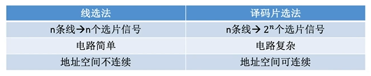

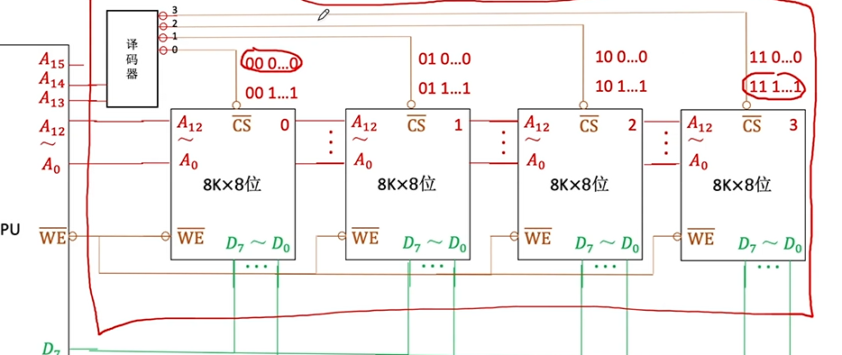

注意：译码器的输出口画了小圆圈，代表此处有非门，也就是最后输出的信号是1个0其它全1。由于片选信号是低电平有效(上面带横线)，所以也要给它加个非门


#### 主存容量扩展—字位同时扩展

就是把字扩展和位扩展结合起来


### 译码器

译码器一般有两种，一种就是出口没有非门的，它最终输出的数据是1个1，其它都是无效信号0，一般用于高电平有效的片选信号

另一种是出口有非门，这时候会输出1个0，其它的全是无效信号1。一般用于低电平有效的片选信号

#### 使能信号

译码器中，除了之前常见的输入信号和输出信号之外，还有**使能信号$EN$**，用于表示当前译码器是否使用，若信号不合规，则所有输出信号都是无效信号

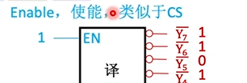

还有更复杂的，多个使能信号共同作用，一般是$G_1$，$\overline{G_{2A}}$，$\overline{G_{2B}}$来表示(就是74ls138)

只有$G_1$是高电平，$\overline{G_{2A}}$和$\overline{G_{2B}}$都是低电平时，才有效

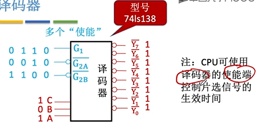


**使能端的作用**：可以通过控制使能端的电平，**控制片选信号的生效时间**


CPU输出地址信号，但是刚开始可能输出信号不稳定，所以需要等稳定之后，才通过$\overline{MREQ}$(主存请求信号)发出信号，让译码器生效


## 外部存储器


磁表面存储是指把某些磁性材料薄薄的覆盖在铝或者塑料表面上作为磁载体来存储信息，像磁盘、磁带和磁鼓都属于磁表面存储器

磁表面存储器每次**读和写都是以1bit为单位**的，如果发来的是**并行**的nbit数据，需要在内部**转换成串行**的数据

**读和写是不可以同时**进行的

**优点**

- 存储容量大，位价格低
- 记录介质可以重复使用
- 信息可以长时间保存
- 非破坏性读出，不用再生

**缺点**

- 存取速度较慢
- 机械结构复杂
- 对工作环境要求高

外存储器既可以做输入设备，也可以做输出设备

### 磁盘存储器


磁盘存储器分为磁盘驱动器和磁盘控制器

> 磁盘驱动器：核心部件是**磁头**组件和**盘片**组件，温彻斯特盘是一种可移动头固定盘片的硬盘存储器
>
> 磁盘控制器：是磁盘存储器和主机的接口，主流的标准有IDE、SCSI、SATA等


#### 磁盘设备的组成

**存储区域**

一块硬盘有多个记录面，每个记录面划分为若干个**磁道**，每条磁道分为若干个**扇区**，**扇区也称块**，是磁盘读写的最小单位，也就是说**磁盘按块存取**

> **磁头数：**也就是记录面数，表示磁盘一共多少个磁头，磁头用于读写盘片上记录面的信息，**一个记录面对应一个磁头**
>
> **柱面数：**表示硬盘每个盘面上有多少条磁道，在一个盘组中，不同记录面的相同编号的多个磁道组成一个圆柱面。**柱面数和每一面的磁道数相同**
>
> **扇区数：**表示每一个磁道上有多少个扇区。注意：不论周长大小，每个**磁道扇区数是相同的**

**硬盘存储器**

硬盘存储器由磁盘驱动器、磁盘控制器和盘片组成


#### 磁盘的性能指标

- **磁盘的容量：**磁盘能存储的总的字节数称为磁盘容量。磁盘容量有非格式化容量和格式化容量。

  > **非格式化容量**就是总可能存储的字节数；
  > $$
  > 非格式化容量 = 记录面数\times柱面数\times每个磁道的磁化单元数
  > $$
  > **格式化容量**是把数据格式化后的容量，会损失一些容量
  > $$
  > 格式化容量 = 记录面数\times柱面数\times每道扇区数\times每个扇区的容量
  > $$

- **记录密度**：指盘片上单位面积记录的二进制的信息量，通常以道密度、位密度和面密度表示

  > **道密度**是沿磁盘**半径方向单位长度上的磁道数**
  >
  > **位密度**是**磁道上单位长度能记录的二进制代码位数**
  >
  > **面密度**是**位密度和道密度的乘积**
  >
  > 磁盘上每个扇区的信息量一样，与长度无关，所以说**每个磁道的位密度不同**
  >
  > 

- **平均存取时间：**

  > $$
  > 平均存取时间=寻道时间+旋转延迟时间+传输时间
  > $$
  >
  > 寻道时间：磁头移动**到**目的**磁道**（计算时一般使用题目中所给的平均时间，否则就用最外道到最内道的时间的一半）
  >
  > 旋转延迟时间：磁头定位**到**所在**扇区**（若题目中没给，就按照**转半圈**来计算）
  >
  > 传输时间：**传输数据**随花费的时间（转数据所在扇区花费的时间）
  >
  > 除此之外还可能让加上磁盘控制器的延迟时间

- **数据传输率：**磁盘存储器在单位时间内向主机传输数据的字节数，叫做数据传输率

  > 假设磁盘**转速为r**，每个**磁道N个字节**
  >
  > 则数据传输率
  > $$
  > D_r= rN
  > $$


#### 磁盘地址

主机向磁盘发生寻址信息，磁盘的地址一般是

驱动器号+柱面号+盘面号+扇区号

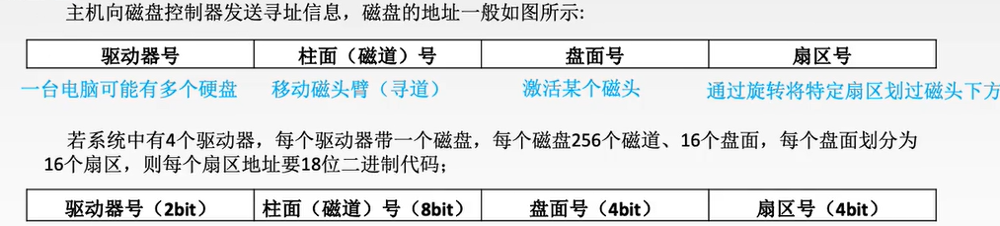


#### 磁盘的工作过程

主要操作是：寻址、读盘、写盘。每个操作都对应一个控制字

硬盘工作时第一步是取控制字，第二步是执行控制字

硬盘属于机械式部件，**操作是串行**的，不能同时读写，也不能同时读或写两组数据


#### 磁盘阵列RAID

RAID廉价的冗余磁盘阵列，是将**多个独立的物理磁盘组成一个**独立的逻辑盘，数据在多个物理盘上**交叉存储、并行访问**，有**更好的存储性能、可靠性和安全性**


- RAID0：无冗余和无校验的磁盘阵列

  > 逻辑上相邻的几个扇区存到几个不同的磁盘，有点像前面的低位交叉编址
  >
  > 
  >
  > 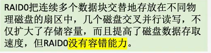

- RAID1：镜像磁盘阵列

  > 存两份数据，两个磁盘存一份数据，发生扇区损坏时可以找到备份的数据。同时比较两块磁盘的数据是否相同，来判断是否发生错误
  >
  > 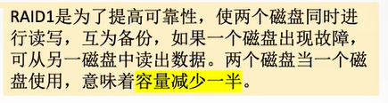

- RAID2：采用纠错的海明码的磁盘阵列

  > 把连续的几个bit(之前都是扇区，这里不同)分散存储在各个盘中
  >
  > 还要增加若干个磁盘存储校验位
  >
  > 4bit信息位+3bit海明码可以纠正1位错
  > $$
  > 2^k \ge r+k+1
  > $$
  > 其中，r是数据位数，k是纠错码的位数

- RAID3：位交叉奇偶校验的磁盘阵列

- RAID4：块交叉奇偶校验的磁盘阵列

- RAID5：无独立校验的奇偶校验磁盘阵列

**越往下冗余的占比会减少，可靠性会增加**


### 固态硬盘SSD


基于闪存技术实现的，属于电可擦ROM，也就是EEPROM

#### 组成

**闪存翻译层**：负责翻译逻辑块号，找到其对应的物理地址(页号)

**存储介质：**多个闪存芯片(一个芯片由多个块组成，一个块由多个页组成)

> 
>
> IO总线传来的是逻辑块号，转换成物理地址时应当找的是最小存取单位
>
> 对与磁盘来说是扇区
>
> 对应固态硬盘来说是页


#### 读写性能特性


- 固态硬盘**以页为单位读写**(相当于磁盘的扇区)

- 固态硬盘**以块为单位进行擦除**

  > 擦干净的块，其中每页都**只允许写一次**，可以读无数次
  >
  > 当只要修改某个块中1页的数据时，应当**把整块**的其它所有页数据**复制到另一块**里，然后新数据写入，**原来那块进行擦除**。与此同时，**内存翻译层的地址映射也要改变**
  >
  > 所以，**某一逻辑地址的物理地址是可能改变的**。

- **支持随机访问**，由地址翻译层迅速定位

- **读比写块**，因为写入可能要擦除


#### 与机械a硬盘的比较

- 固态硬盘读写速度快、随机访问性能高、用电路控制访问位置；机械硬盘有寻道时间和旋转延迟等，慢很多
- SSD安静无噪音，耐摔抗震、能耗低但造价更贵
- **SSD的一个块擦除次数过多可能会坏掉**。但是**机械硬盘的扇区不会**因为读写过多而损坏


#### 磨损均衡技术

思想：**将擦除平均分布在各个块上，以提高使用寿命**

动态磨损均衡：写入数据时，优先选择累计擦除次数少的新闪存块

静态磨损均衡：SSD检测并自动进行数据分配、迁移，让老旧的闪存块承担以读为主的存储认为，让新的承担更多写任务


## 高速缓冲存储器


即使采用了双端口RAM、多模块存储器的方式提高了主存的工作速度，但是速度与CPU还是有很大的差距

可以使用更快的SRAM，但是价格更高，容量更小，单纯用它，满足不了需求

所以根据程序访问的局部性原理，把SRAM制成Cache


### Cache的基本工作原理


**由于根据局部性原理，短时间内，同一程序使用的指令和数据大概率会在一块区域**，如果把最近会频繁使用的指令和数据放入Cache中，这样CPU可以直接和Cache交换数据，速度会大大提高

> ### 局部性原理
>
> #### 空间局部性
>
> 在最近的未来要用到的信息(指令和数据)，很可能与现在在使用的信息在空间上看是邻近的
>
> #### 时间局部性
>
> 在最近的未来使用到的信息，很可能是现在正在使用的信息
>
> 
>
> 

#### 性能分析

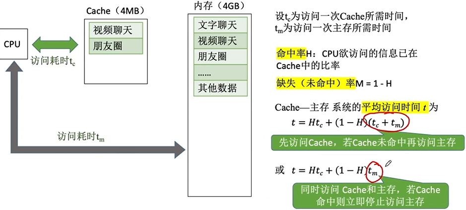

假设访问一次Cache的时间为$t_c$，访问一次主存的时间为$t_m$

命中率H：CPU欲访问的信息在Cache中的比率

缺失率(未命中率)M = 1-H

所以Cache—主存系统的平均访问时间t就为
$$
t = Ht_c + (1-H)(t_c+t_m）
$$
因为物理数据是否在Cache中，CPU都要先去Cache中寻找，若没有命中，再去主存中寻找

还有另一种方式，CPU同时在Cache和主存中寻找数据，若Cache中找到了，则直接停止主存的查找，若没找到，就在内存里继续查，这时平均访问时间会稍短，为
$$
t = Ht_c + (1-H)(t_m）
$$

#### 主存与Cache的数据交换(以块为单位)

为了主存与Cache进行数据交换，需要把主存和Cache都进行分块

一次要交换一块数据

分块之后，原先的地址在逻辑上也被划分为了**块号和块内地址**

(在操作系统中，主存的一个块，也被称为一个页/页面/页框

Cache的块有时也被称为行)

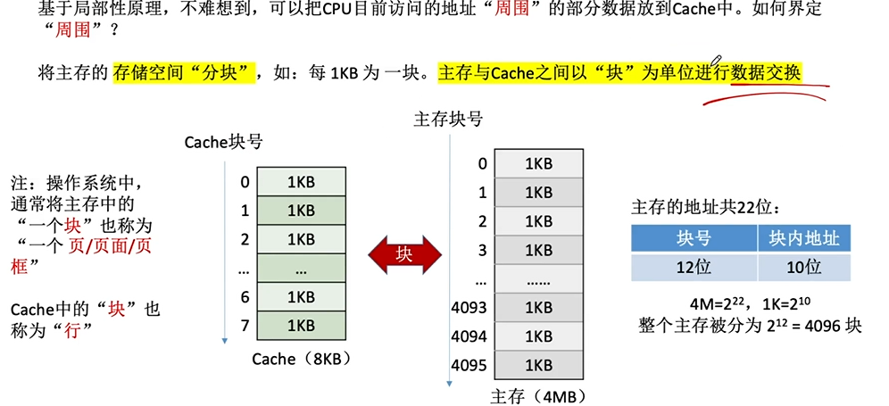

### Cache-主存的映射方式

由于Cache中保存的是内存中数据的副本，该怎么区分Cache与主存的映射关系


为了区分每个Cache块，要给每个Cache加上**标记**，标记里存的是主存的块号

除此之外，还需要再加上一位**有效位**，当有效位为1时，才代表这个Cache存储了数据

Cache的映射方式一共有3种，分别是全相联映射、直接映射、组相联映射


假设主存为256MB，Cache有8个Cache行，行长为64B

所以主存总地址为28位，块内地址位6位，块地址22位

下面是不同映射方式的实现细节

#### 全相联映射

也就是随意映射，主存中的块可以任意映射到Cache的任意位置

**对Cache的空间利用充分，但是查找标记最慢**


最开始Cache全是空的，有效位全为0

##### 主存放入Cache

主存放入Cache中时，可以随意放入Cache的一个位置，然后为Cache标记位写入**22位的标记**(主存块号)，并把有效位置为1

##### CPU访存

当CPU访问主存地址时，拿主存地址的**前22位**一个一个对比Cache中的每个标记

若标记与前22位**相同**，且**有效位为1**，说明**命中**，根据剩余的块内地址访问即可

若没有标记相同或有效位为0，说明**没有命中**，去**访问主存**


#### 直接映射

每个主存块在Cache中的位置是固定的，**位置=主存块号%Cache总块数**

但是会有缺点，**在Cache相同位置的主存块，即使Cache空闲，也只能存入一个**

**对任意一个地址，只需要对比一次标记查找最快，但是对Cache的空间利用不充分**

##### 标记简化

由于位置是根据取模固定好的，所以若Cache块总数为$2^n$，则Cache的每一行在主存地址的后n位是确定好的，所以标记里不需要存这后n位


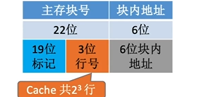

##### CPU访存

当访问主存地址时，可以直接根据**主存块号的后n位**确定Cache行号

然后用主存块号剩余的前面的位数去和标记进行匹配

若相同且有效位为1，说明命中，根据块内地址访问即可

否则未命中，去访问主存


#### 组相联映射

每个主存地址在Cache中只能放在某个固定的分组，但是在分组内部可以随意放

像是全相联映射和直接映射的结合，效果也比较折中

**所属分组 = 主存块号%分组数**

假设二路组相联(也就是2块为一组)

此时主存块号也就被分为了**标记和组号两部分**

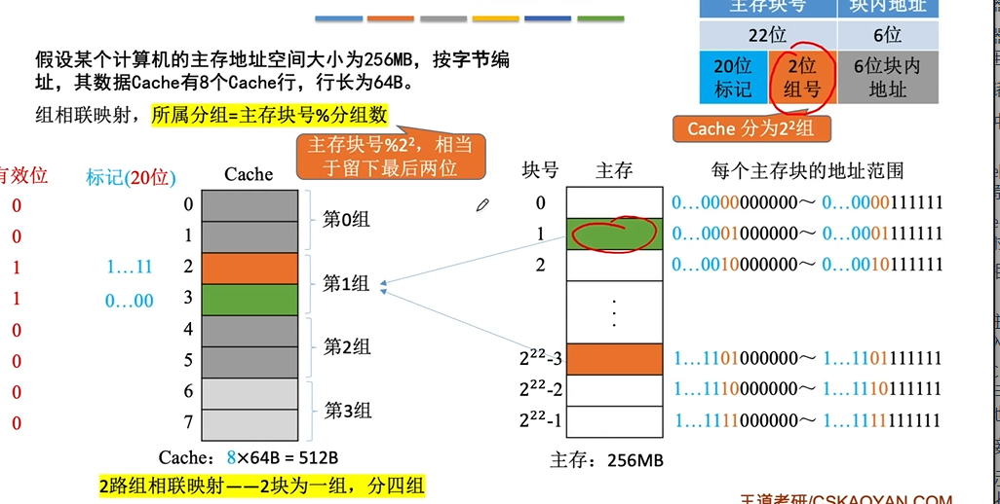

##### CPU访存

先根据后2位判断分组号，然后在对应分组里去判断是否命中


### Cache替换算法

当Cache满了该如何替换呢


对于全相联映射：当Cache完全满了才需要替换

对于直接映射：不需要考虑替换，或者说直接替换

对于组相联映射，当分组满了才需要替换，在分组内选择替换


下面以全相联映射为例

#### 随机算法RAND

当Cache满了，**随机选择一块**去替换

实现简单，但没有考虑局部性原理，命中率低，很不稳定


#### 先进先出算法FIFO

若Cache满了，则**替换最先被调入**Cache的块

 实现方便，但是也没考虑局部性原理，最先调入Cache的块也可能是被频繁访问的

还可能出现频繁的刚被换出就要再换入的情况，被称作**抖动**


#### 近期最少使用算法LRU

(Least Recently Used)给每个Cache块设置一个计数器，用于记录每个Cache块有多久没有访问了，当Cache满了，**替换计数器值最大的块**


当某个**块命中**时，将其**计数器置为0**，计数器**值比他低**的所有计数器+1

当未命中但有空闲行时，新装入的行置为0，其余非空闲的行加1

当未命中且无空闲行时，替换掉计数器最大的块，并将计数器置为0


LRU算法是**基于局部性原理**的，最近被访问过的块，在短期内也很有可能再被访问，所以淘汰最久没被访问的块是合理的。**运行效果优秀，Cache命中率高**

> 但是，如果**频繁访问的主存块数量大于Cache行数**，也可能发生**抖动**
>
> 如1，2，3，4，5，1，2，3，4，5....


#### 最不经常使用算法LFU

为每个Cache设置一个计数器，记录每个Cache被访问过几次。Cache满了就**替换计数器最小的**

> 如果有多个相同的最小行，有两种方法，一种是按行号最小的淘汰
>
> 另一种是按FIFO的策略选择

计数器可能会很大，所以计数器占的空间并不能很好确定

而且LFU算法**没有很好地遵循局部性原则**，曾经经常访问的块，在未来不一定会用到

所以**实际效果不如LRU**


### Cache写策略

Cache中保存的只是主存中的一个副本，当CPU对Cache进行写操作时，如何确保主存中数据母本的一致性呢


#### 写命中

当被写的块在Cache中时，有两种方法

##### 写回法

当CPU对Cache写命中时，**只修改Cache的内容**，而不立即写入主存，只有**当此块被换出时从写回主存**

如果没被修改就换出了，不用写回主存。

由此需要添加一个**脏位**，判断是否被修改过


可以减少访存次数，但是存在数据不一致的隐患

##### 全写法

也叫写直通法

当写命中时，**必须把数据同时写入Cache和主存**，一般使用写缓冲

> 写缓冲是用SRAM实现的FIFO队列，每当CPU对Cache写成功时，就也存入写缓冲，写缓冲有专门的控制电路写回主存
>
> 使用写缓冲，则CPU写的速度很快，如果写的不是很频繁，效果就很好
>
> 但是写的太频繁，写缓冲会保活，则CPU必须阻塞等待

访存次数增加，速度变慢，但是更能保证数据的一致性

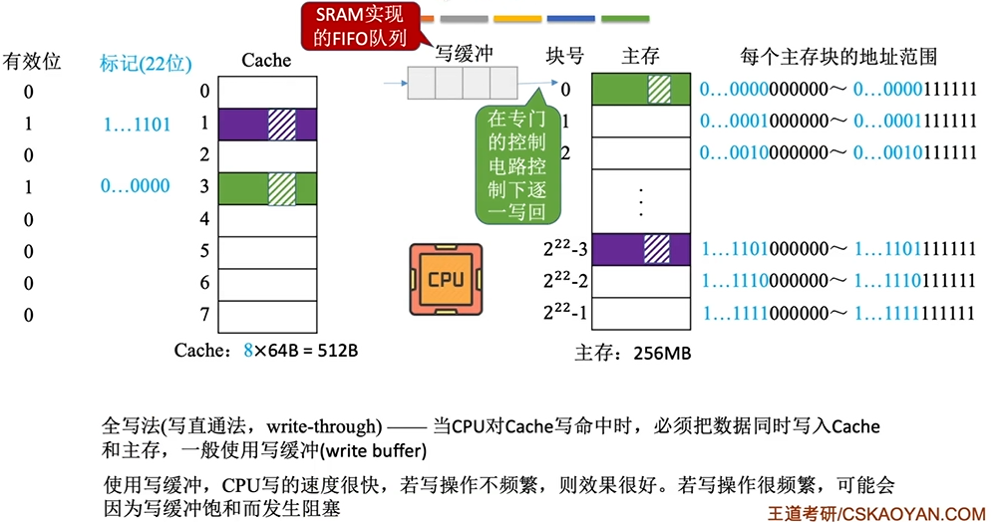


#### 写不命中


##### 写分配法

当CPU对Cache写不命中时，先把主存中的块调入Cache，**在Cache中修改**。通常**搭配写回法**使用


##### 非写分配法

当CPU对Cache写不命中时，**只写入主存，不调入Cache**。**搭配全写法**使用

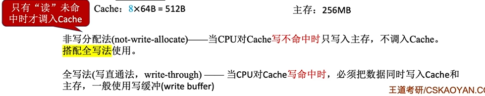


### 多级Cache

现代计算机常采用多级Cache

离CPU越近，速度越快，容量越小


一般来说最底层Cache与主存之间采用写回法+非写分配法

Cache之间采用全写法+非写分配法


## 虚拟存储器


### 页式存储


每个程序要分成若干个**页**，每个页的大小**和物理块的大小相同**


**页式存储系统**：一个进程在**逻辑**上被分为若干个大小相同的***页面***，***页面*大小与*块*的大小相同**，每个*页面*可以**离散的**放入不同的主存块中


#### 虚地址和实地址

也叫逻辑地址和物理地址

**逻辑地址：**在程序内部的相对地址

**物理地址：**在主存实际的物理地址

操作系统负责把逻辑地址映射为物理地址

假设分了2^n^页，则逻辑地址前n位是逻辑页号，换为物理地址就是把逻辑页号转换成主存块号

页内地址和块内地址是一样的

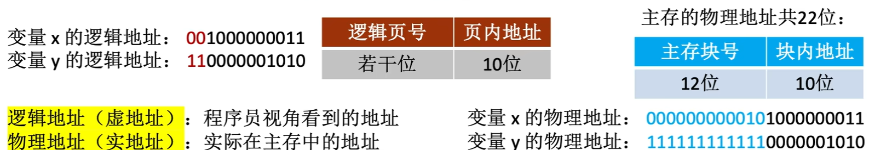

#### 页表(慢表)

页号与主存块号的对应关系存在**页表**之中

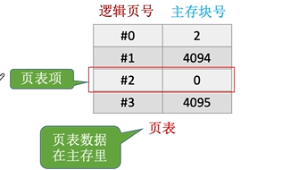

CPU的**所有机器指令都是逻辑地址**，所以在实际访存时都要通过页表将其转换成物理地址。同时**页表也存在主存里，所以读页表也需要一次访存**


#### 地址变换过程

先把逻辑地址拆分成逻辑页号和页内地址

CPU内有一个**页表基址寄存器**，用于存放当前运行的程序的**页表第一项在主存中的位置**

通过寄存器，找到页表，然后根据逻辑页号找到对应的主存块号，用**主存块号替换逻辑页号**，这就是该逻辑地址在主存的物理地址


#### 快表TLB

由于程序运行具有局部性，所以每次找对应页表项都要访问主存显然是低效的

所以出现了**快表**

它使用SRAM，而且是相联存储器，**可以按照内容查找**，速度很快，但是容量较小

在其中存储一些最近使用的表项

此时地址变换时，会先在快表里找寻逻辑页号，如果**找到了，直接转换**

如果**没有找到**，还是根据页表基址寄存器访存，找到对应表项后，**存入页表**，并**转换地址**

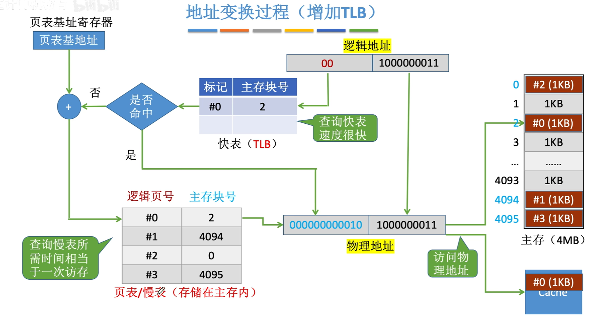


### 虚拟存储系统

基于局部性原理，一个程序也不是同时会用到它的所有内容

所以只需要把**辅存**的一部分需要用到的的内容**调入主存**即可


#### 页式虚拟存储器

把程序分页后，只把一部分会用到的调入主存

所以此时在使用数据时，可能有些数据不在主存，需要从外存调入

所以页表的结构需要改进


**逻辑页号**和**主存块号**与之前一样

**外存块号**指的是这个数据在外存的存储位置(外存也和主存一样进行了分块)

**有效位**为1代表已经被调入主存了，0代表还没调入

**访问位**是用于页面替换算法的，与Cache的替换控制位类似

**脏位**也是标记是否被修改过，在置换出去时是否需要写回外存


#### 段式虚拟存储器

段式虚拟存储器是把程序**按照功能模块拆分**，大小可能不一样

**主存不需要分块**或者分页了，地址一般就是按字节编址的了

段式存储的地址格式为：段号+段内地址

段表的结构也有所不同

**段号+段首址+装入位+段长**

段号就是段的标记

段首址就是段的首地址

装入位就是有效位

段长就是这个段的长度


#### 段页式虚拟存储器

先把程序分段，每段里再分为若干个页

此时虚拟地址就是：**段号+段内页号+页内地址**


# 指令系统


## 指令系统概述

指令系统是指令集体系结构ISA中最核心的部分，ISA完整定义了软件和硬件之间的接口，是机器语言或汇编语言程序员所应当熟悉的

主要内容包括：

- **指令格式**，**指令寻址方式**，**操作类型**，以及**每种操作对应的操作数**的相应规定
- **操作数的类型**，操作数的**寻址方式**，以及按照**大端还是小端存放**
- 程序**可访问的寄存器编号**、**个数**和**位数**，**存储空间的大小和编制方式**
- **指令执行的控制方式**，包括**程序计数器、条件码定义**等

### 指令的基本格式

一台计算机所有指令的集合构成该机器的**指令系统**，也称为**指令集**

一条指令就是机器语言的一个语句，是一组有意义的二进制代码

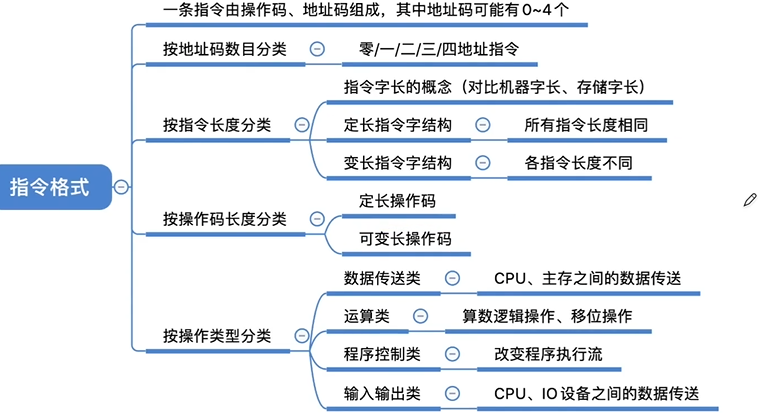

#### 按地址码数目分类

一条指令通常要包括**操作码**和**地址码**两部分

一个指令可能含有0、1、2、3、4个地址码，根据数量不同可分为零地址指令、一地址指令、二地址指令。。。。

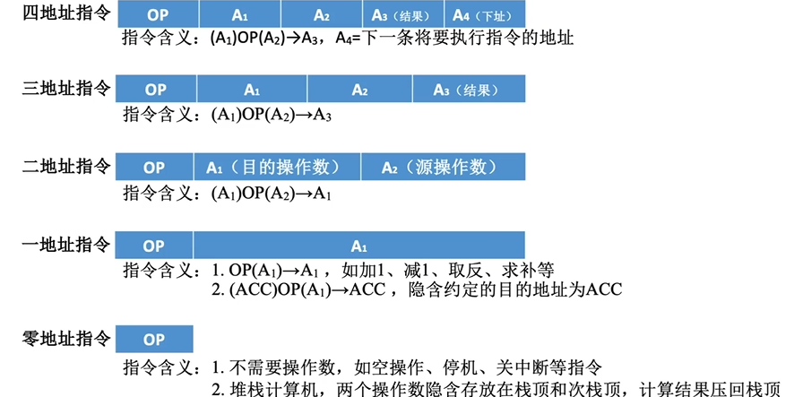

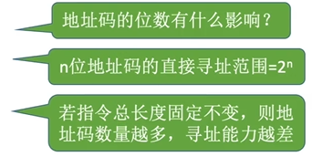

##### 零地址指令

只有操作码OP


1. **不需要操作数**的，如空操作、停机、关中断等指令
2. **堆栈计算机**，两个**操作数隐含**存放在栈顶和次栈顶，计算结果会再压回栈顶


##### 一地址指令

有操作码OP和一个地址$A_1$组成

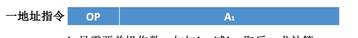

1. **只需要单操作数**。如加1，减一，取反、求补等

   指令含义：OP($A_1$)->$A_1$，完成一条指令需要**3次访存**：取指、读$A_1$、写$A_1$

2. 需要**两个操作数**，但是其中一个**隐含在某个寄存器**中(如在ACC中)

   指令含义(ACC)OP($A_1$)->ACC，只需要**2次访存**：取指、读$A_1$

$A_1$指某个地址，($A_1$)表示该地址的内容


##### 二地址指令

一般的由***OP+$A_1$(目的操作数)+$A_2$(源操作数)***组成

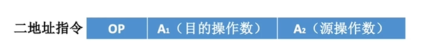

常用于两个操作数的**算数运算、逻辑运算**等相关指令

指令含义：($A_2$)OP($A_1$)->$A_1$

完成一条指令需要4次访存：取指、读$A_1$、读$A_2$、写$A_1$


##### 三地址指令

由**OP+$A_1$+$A_2$+$A_3$(结果)**组成

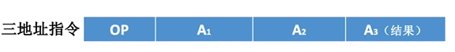

常用于两个操作数的**算数运算、逻辑运算**等相关指令

指令含义：($A_2$)OP($A_1$)->$A_3$

完成一条指令需要4次访存：取指、读$A_1$、读$A_2$、写$A_3$


##### 四地址指令

由**OP+$A_1$+$A_2$+$A_3$(结果)+$A_4$(下一条的地址)**组成


指令含义：($A_2$)OP($A_1$)->$A_3$，$A_4$是下一条指令的地址

完成一条指令需要4次访存：取指、读$A_1$、读$A_2$、写$A_3$


正常一条指令执行完毕都是PC+1，进行下一条指令

**四地址指令直接把PC的值改成$A_4$**，可以让指令跳着执行


#### 按指令长度分类

**指令字长**：一条指令的总长度(**对同一台计算机长度可能会变**)

> **机器字长：**CPU进行一次整数运算所能处理的二进制数据位数(通常和ALU及通用寄存器直接相关)
>
> **存储字长**：一个存储单元的二进制代码位数(通常和MDR位数相同)
>
> 对于同一台计算机，这都不会变

有半字长指令、单字长指令、双字长指令：指令长度是机器字长的多少倍

**指令字长会影响取指令所需的时间**。如取双字长指令需要两次访存


**定长指令字结构**：系统中所有指令长度都相等

**变长指令字结构**：指令系统中各种指令的长度不等


#### 按操作码长度进行分类

操作码的长度可以确定指令的个数

**定长操作码**：指令系统中所有指令的操作码长度都相同

n位操作码可以表示$2^n$条指令

> 控制器的译码电路设计简单，但是灵活性较低

**可变长操作码：**指令系统中各指令的操作码长度可变

> 指令设计的灵活性较高，但是译码电路设计复杂


此外还有扩展操作码指令格式：定长指令字+可变长操作码

对不同地址数的指令，使用不同长度的操作码


#### 按操作类型分类

1. **数据传送**

   MOV：作用：**寄存器之间**传送

   LOAD：作用：把**存储器**中的数据放到**寄存器**中

   STORE：作用：把**寄存器**中的数据放到**存储器**中

   PUSH：进栈

   POP出栈

   > 数据传送类：进行主存和CPU之间的数据传送

2. **算数逻辑操作**

   算数：加减乘除、增1、减1、求补、浮点运算、十进制运算

   逻辑：与或非、异或、位操作、位测试、位清除、位求反

3. **移位操作**

   算数移位、逻辑移位、循环移位

   > 运算类

4. **转移操作**

   无条件转移JMP

   条件转移：JZ：结果为0转移；JO：结果溢出转移；JC：结果有进位转移

   调用和返回：CALL和RETURN

   陷阱(Trap)和陷阱指令

   > 程序控制类：改变程序执行顺序

5. **输入输出操作**

   CPU与IO端口之间的数据传送(端口是IO接口中的寄存器)

   > 输入输出类：进行CPU和IO设备间的数据传送


### 拓展操作吗指令格式

扩展操作码指令格式，就是指令的总长度不变，但是操作码长度可能会变

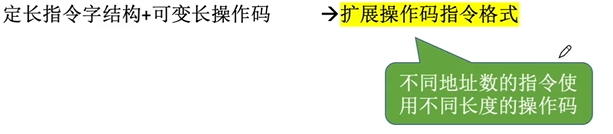

#### 扩展操作码举例

例如指令字长为16位，每个地址码占4位时:

前4位位基本的OP，剩下3个4位地址字段

所以可以前4位全做指令的话，最多能有16个，但是为了扩展，只用11个，全1的留下

也就是3地址指令1**5个**

然后对于二地址指令，OP全1，第一块地址也可以当作操作码来使用，同理，也有**15个**

1地址也同理**15个**

0地址因为不用留出全1，所以有**16个**


> 设计方式不止这一种，但是必须满足如下要求：
>
> - **短码不能是长码的前缀(与哈夫曼编码要求一致)**
> - **指令的操作码不能重复**

**另一种例子：**

根据不同类型指令的个数，分配地址的扩展

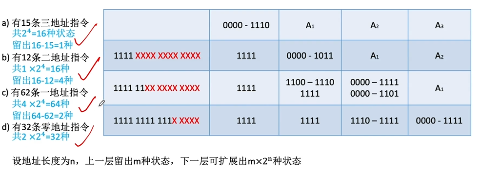

#### 与定长操作码相比优缺点

**定长操作码**：指令的前固定位数表示操作码

**优点**：可以简化硬件设计，提高译码和识别速度

**缺点**：会占用更多固定位，留给表示操作数地址的位数受限


**扩展操作码**：指令的操作码字段位数不固定，且分散在不同位置

**优点**：可以在指令字长有限的前提下仍然保持较丰富的指令种类

**缺点**：增加了指令译码和分析的难度，使得控制器的设计复杂化


## 指令的寻址方式


### 指令寻址

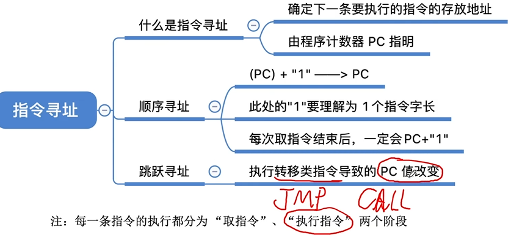

**程序计数器PC：用于指明下一条指令的存放地址**

#### 顺序寻址

PC都会顺序指向下一条指令的地址

​                                                    **(PC)+“1”->PC**


对于定长指令字，且按字编址来说下一条指令的地址：(PC)+1->PC

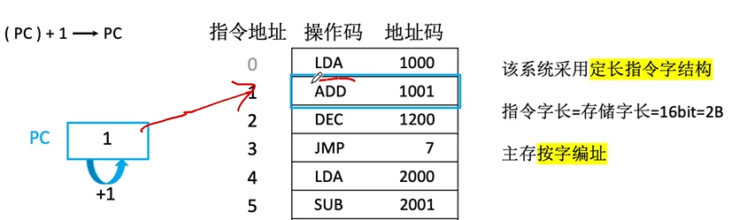

但是如果不是按字编址，而是按字节编址时，(假设指令16位)那一个指令就占2个地址

PC就得+2

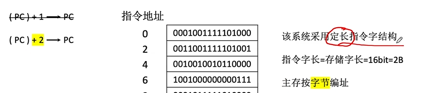

对于变长指令字来说，简单的加固定的值是不可以的，需要加上当前指令的字节数。

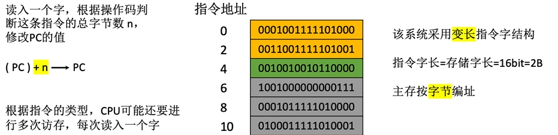

但是不论怎样，PC都指向下一条指令的地址

#### 跳跃寻址

PC的值由转移指令给出

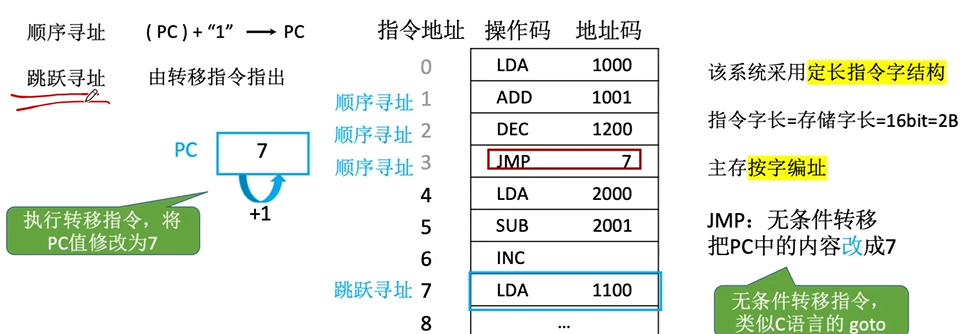

会与顺序寻址结合使用


### 数据寻址

是用于指出**本指令的地址码**指明**的真实地址**


但是地址码的解释方式有很多种，所以需要有不同的数据寻址方式

由于方式很多这里介绍10种，所以需要4位来区分是那种方式

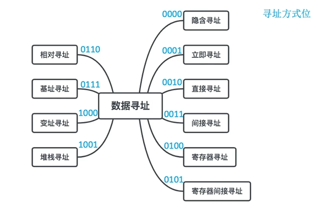

操作码的格式也发生了一些改变

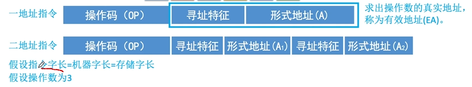

也就是把原来的地址划分为**寻址特征+形式地址**


***注意计算实际访存数的时候，不能忘记取指令还有一次访存***

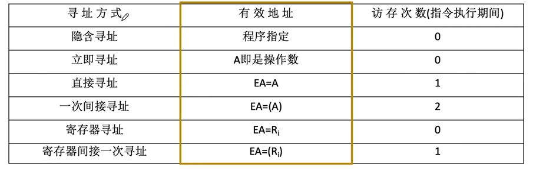

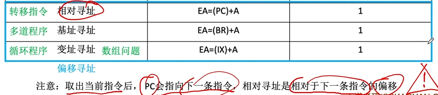

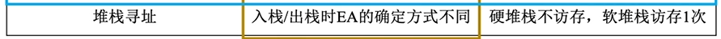

#### 直接寻址

形式地址就是真实地址，即EA=A

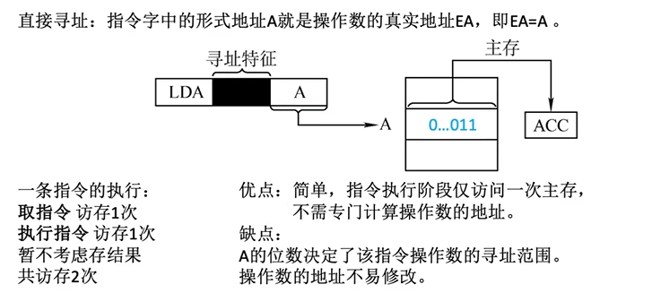

优点是简单，访问主存少

缺点是寻址范围固定，且操作数的地址不易修改


#### 间接寻址

形式地址存的不是真正的地址，而是真正地址在主存中的位置

即EA=(A)

也就是需要多访存一次才能找到真正的地址

如果A处的值的第一位是1，说明还需要再进行一次间接寻址，指令的地址在下一个位置存储

直到第一位是0，说明后面存储的是真实地址了

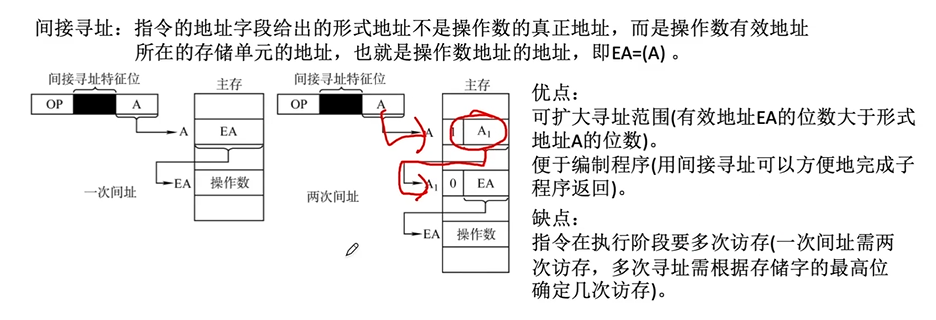

优点是可以扩大寻址范围，多级寻址还可以便于子程序调用

缺点是需要多次访存


#### 寄存器寻址

形式地址指向的是操作数所在寄存器的编号

即EA=$R_1$

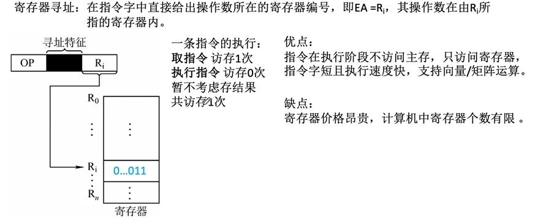

优点是执行指令不放我主存，指令字短，速度快

缺点是贵，且寄存器个数有限


#### 寄存器间接寻址

形式地址指向寄存器，这个寄存器里面是操作数的地址

即EA=($R_1$)

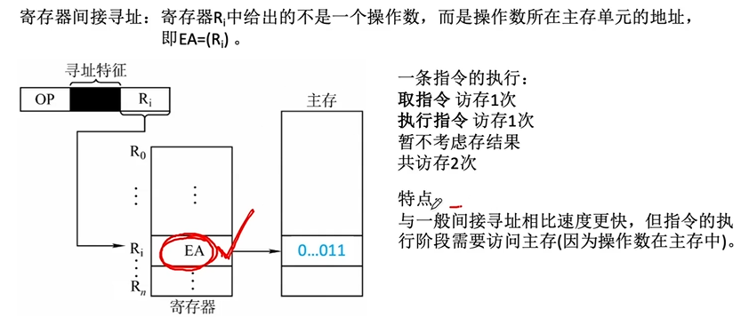

与间接寻址类似，但是可以少访问一次主存，速度更快


#### 隐含寻址

不明显给出操作数的地址，而是按照规定固定的凑在某个位置

如存在ACC中

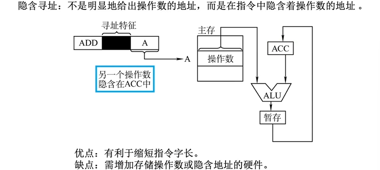

优点就是能减少指令字长

缺点是要增加存储操作数，或者隐含地址的硬件


#### 立即寻址

立即寻址会直接把**操作数写在形式地址**

\#后面跟数字就代表立即数，用**补码表示**

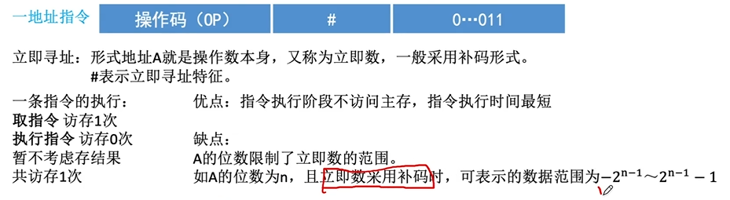

优点是执行指令不用访存

缺点是立即数的范围被限制


#### 偏移寻址—基址寻址


将CPU中**基址寄存器(BR)**的内容加上指令格式中的形式地址A，从而形成操作数的有效地址

即EA=(BR)+A

对于CPU中没有BR的计算机，使用通用寄存器来代替，这种方式需要占用寻址特征中的几位，来表示是哪个通用寄存器

> **基址寻址是面向操作系统的**
>
> 优点：可以便于程序的浮动，方便实现多道程序并发运行。此外还可以扩大寻址范围


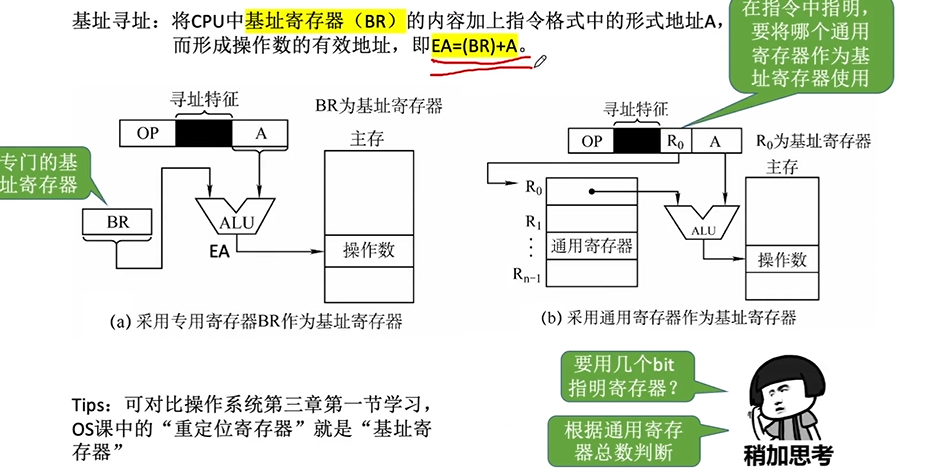


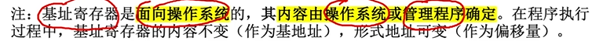

对于汇编程序员，可以修改通用寄存器，也可以决定哪个寄存器当作基准寄存器，但是如果它作为基址寄存器，就不能修改它的内容，**只能操作系统来决定**

> **但基址寄存器对汇编程序员是可见的**


#### 偏移寻址—变址寻址

与基址寻址集合相同，只是从使用基址寄存器变为了使用变址寄存器(IX)

有效地址EA等于指令字中的形式地址A与**变址寄存器(IX)**的内容的和

**即EA=(IX)+A**

其中IX可为变址寄存器(专用)，也可以是通用寄存器作为变址寄存器

> **变址寻址是面向用户的**内容可以由用户改变
>
> 它的形式地址A可以看作基地址，IX看作是偏移量
>
> 特别适用于编写循环程序
>
> 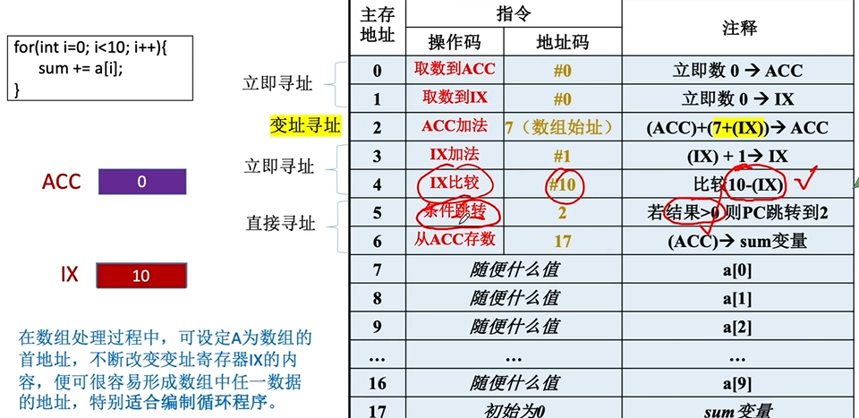

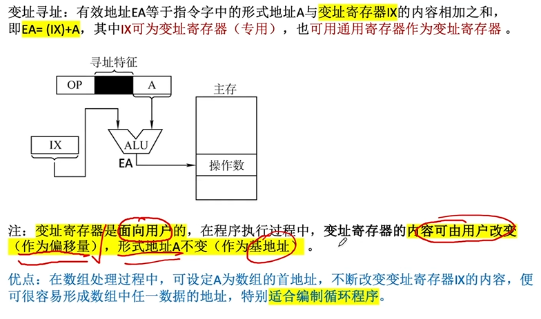


#### 基址寻址和变址寻址的复合寻址

当程序不在内存的开始处时，使用基址寻址很方便实现程序的浮动，不用修改程序代码

在基址的情况下使用变址寻址如下
$$
EA=(IX)+((BR)+A)
$$
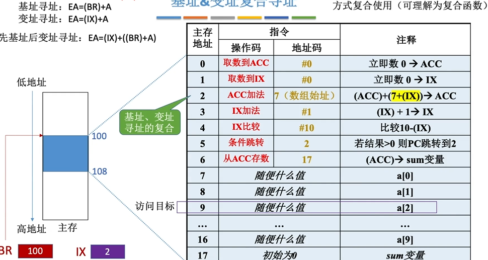


#### 相对寻址

把程序计数器**PC的值作为基地址，把形式地址A看作是偏移量**

即
$$
EA = (PC)+A
$$
A是相对与PC的位移量，可正可负，**补码表示**

> 当代码在程序内部挪动时，固定地址的跳转指令需要修改地址码才能保证正确，
>
> 但是使用相对寻址只需要保证这一小块的相对位置不变，就**可以在程序内随意浮动**，很方便
>
> **广泛应用于转移指令**
>
> 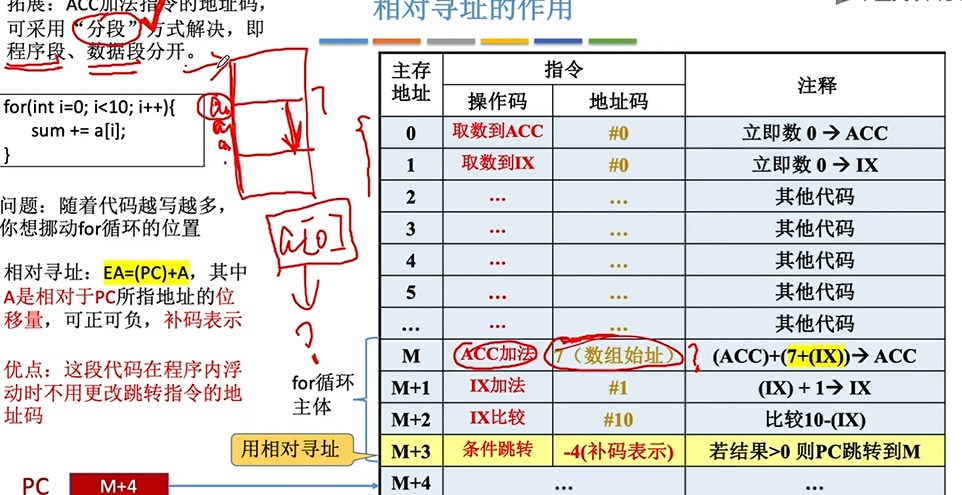
>
> 


#### 堆栈寻址

操作数放在堆栈中，隐含使用**堆栈指针(SP寄存器)**作为操作数地址


有两种方式：

- 一种是使用一组寄存器，来实现栈

  > 这种叫做硬堆栈
  >
  > 当要计算时使用POP出栈两个数据，再进行计算
  >
  > 将结果再使用PUSH压入栈
  >
  > 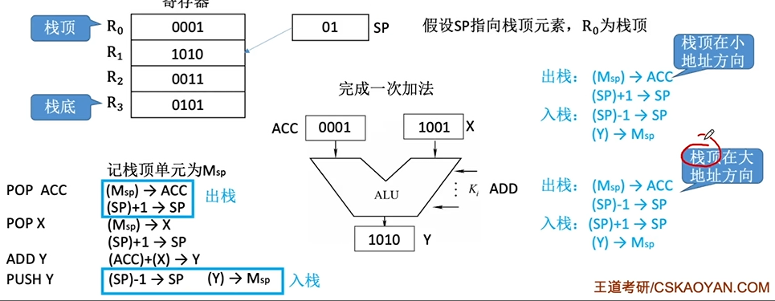
  >
  > **出栈入栈不用访存速度快**
  >
  > 但是**贵**

- 另一种是在主存划分出一块区域实现

  > 叫做软堆栈
  >
  > 每次进栈出栈都会访存**速度较慢**
  >
  > 但是**便宜**
  >
  > 实际一般都用这个

**函数的调用一般就使用堆栈**


## 高级语言与机器级代码

汇编语言指令与机器代码一一对应


### X86汇编语言指令基础

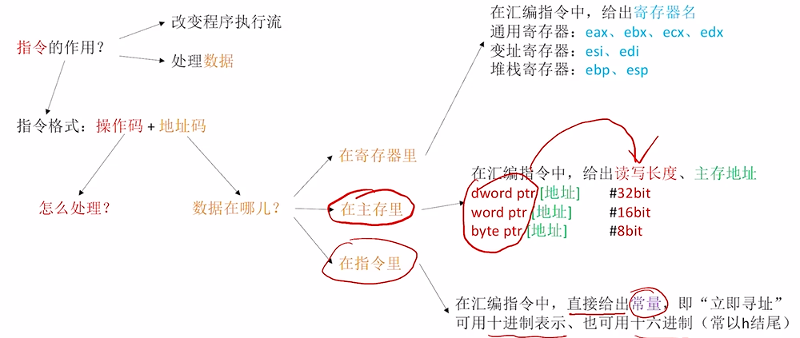

指令的作用：改变程序的执行流、处理数据

指令格式：操作码+操作数

数据分为在寄存器、在主存、在指令里直接存储三种情况


#### 以MOV为例

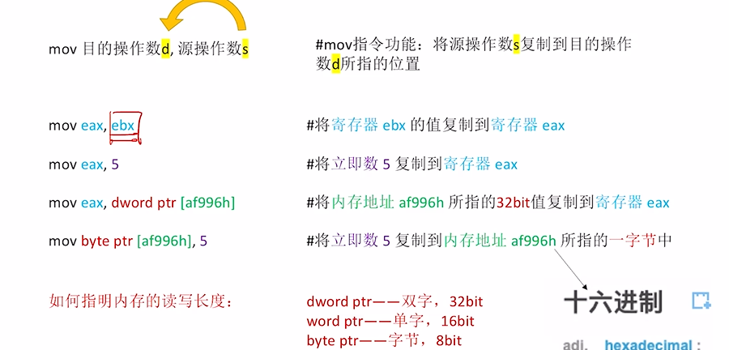

##### 操作数表示

目的操作数一般用d(destination)表示

源操作数一般用s(source)表示

一般就是把源操作数和目的操作数的值进行操作后，**存入目的操作数**的位置

不同操作数间用 ，分隔

##### 内存的读写长度

dword ptr——按双字读写，32bit

word ptr  ——按字读写，16bit

byte ptr   ——按字节读写，8bit


##### X86的寄存器

> ##### 通用寄存器
>
> 以X结尾说明是通用寄存器
>
> 当E开头时，说明是32位
>
> 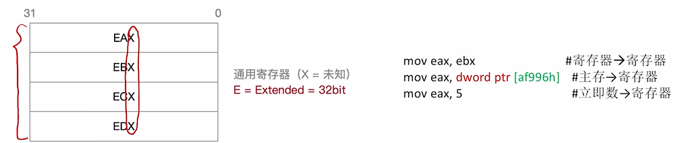
>
> 当没有E时，如AX，表示低16位
>
> 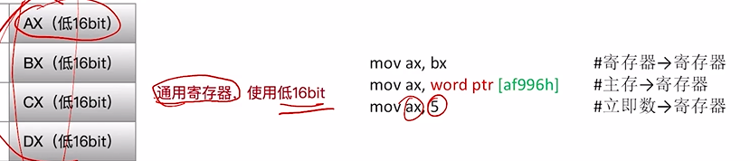
>
> 甚至还可以再分成8bit
>
> 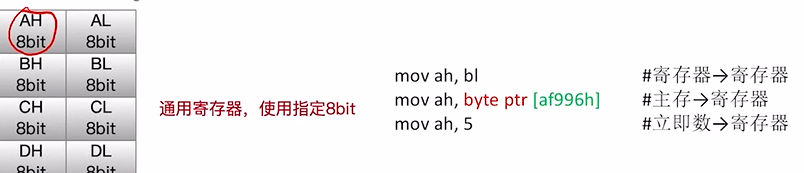
>
> ##### 变址寄存器
>
> 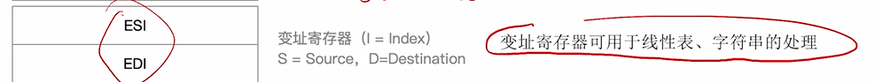
>
> 以I结尾的是变址寄存器，**固定32位**
>
> 中间的S和D分别表示是源地址还是目的地址
>
> ##### 堆栈寄存器
>
> 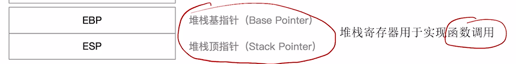
>
> 以P结尾是堆栈寄存器，**固定32位**
>
> BP是堆栈基指针
>
> SP是堆栈顶指针

##### 其它例子

中括号代表 括号内部的数是地址，整个代表主存在括号里地址的数据

就是间接寻址

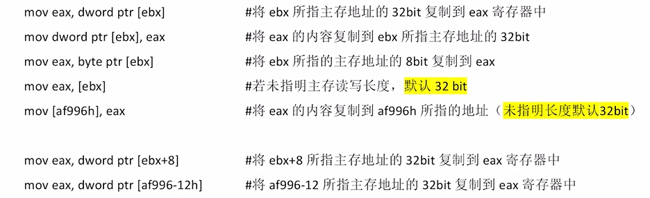


#### 常用的X86汇编指令(Intel格式)


##### 常见算数运算

> d代表的目的操作数，***d一定来自寄存器或主存，不可能是常量***
>
> s代表的可以是常量
>
> 对于**X86指令，禁止两个操作数都来自主存**

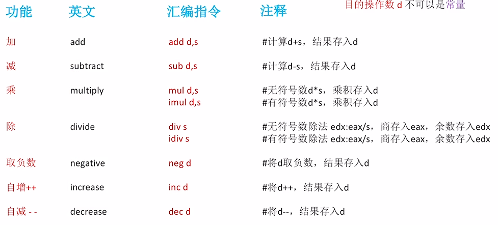

| 功能     | 汇编指令 |                             注释                             |
| -------- | -------- | :----------------------------------------------------------: |
| 加       | add d,s  |                      计算d+s，结果放入d                      |
| 减       | sub d,s  |                      计算d-s，结果放入d                      |
| 无符号乘 | mul d,s  |              无符号数计算d$\times$s，结果放入d               |
| 有符号乘 | imul d,s |              有符号数计算d$\times$s，结果放入d               |
| 无符号除 | div s    | 除法采用了隐含寻址，被除数放入了edx和eax中，在在计算前，先拓展成**64位**即edx:eax，再进行除运算edx:eax$\div$s，商放入eax，余数放入edx |
| 有符号除 | idiv s   |     有符号数除法，edx:eax$\div$s，商放入eax，余数放入edx     |
| 取负数   | neg d    |                       把d取负数，存入d                       |
| 自增     | inc d    |                         把d++，存入d                         |
| 自减     | dec d    |                         把d--，存入d                         |


##### 常见逻辑运算

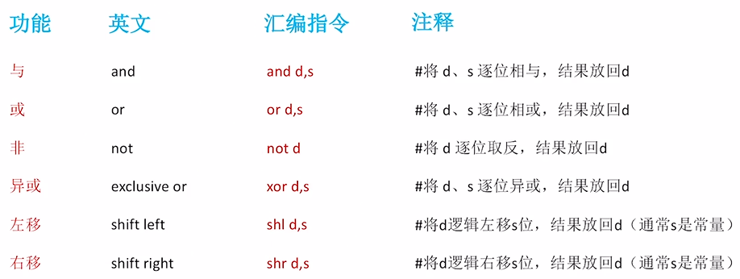

| 功能 | 汇编指令 |            注释             |
| ---- | -------- | :-------------------------: |
| 与   | and d,s  |    d和s按位与，结果放入d    |
| 或   | or d,s   |    d和s按位或，结果放入d    |
| 非   | not d    |     对d按位取反，放入d      |
| 异或 | xor d,s  |   d和s按位异或，结果放入d   |
| 左移 | shl d,s  |  把d逻辑左移s位，结果放入d  |
| 右移 | shr d,s  | 把d逻辑右移s位，把结果放入d |


##### 其它指令

实现分支、循环的：cmp、test、jmp、jxxx

实现函数调用的：push、pop、call、ret

实现数据转移的：mov

#### AT&T格式指令

与Intel格式有所不同

最重要的是操作数表示的位置与Intel相反，左边是源操作数，右边是目的操作数

寄存器前要加%

主存地址用()

立即数要加$

读写长度要在指令后面加b、w、l表示8、16、32位，而不是在地址前加byte ptr这种

主存偏移量：加减写在括号外面如ebx减8：mov -8(%ebx),%eax

乘法在括号里面 如ebx+ecx*32+4为：mov 4(%ebx, %ecx, $32), eax

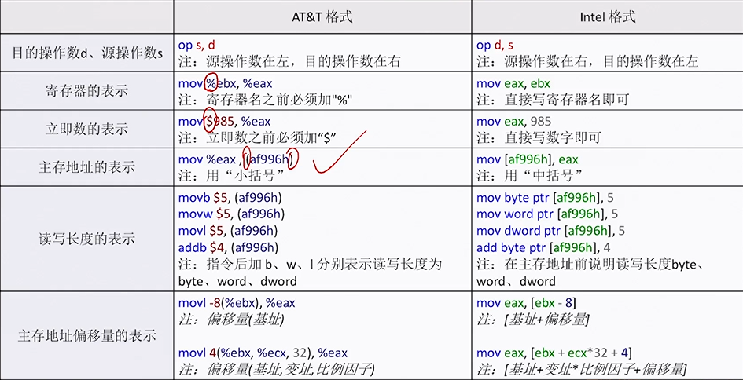


### 选择语句机器级表示

在Intel X86处理器中，程序计数器**PC**(Program Counter)**常被称为IP**(Instruction Pointer)


#### 无条件转移指令jmp

jmp <地址>     地址可以是常数，也能来自主存或者寄存器

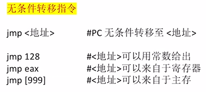

> 为了方便编程，除此之外还可以**跳到指定的位置**
>
> 如下图右，跳到NEXT
>
> 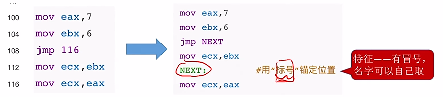


#### 条件转移指令jxxx

je <地址>   ——jump when equal，若a==b则跳转

jne <地址>   ——jump when not equal，若a!=b则跳转

jg <地址>   ——jump when greater than，若a>b则跳转

jge <地址>   ——jump when greater than or equal to，若a>=b则跳转

jl <地址>   ——jump when less than，若a<b则跳转

jle <地址>   ——jump when less than or equal to，若a<=b则跳转

> **一般和cmp结合使用**
>
> 
>
> 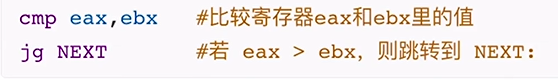

#### 一个c语言例子

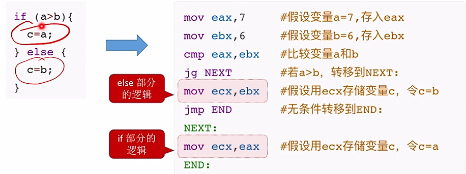

#### 另一个例子

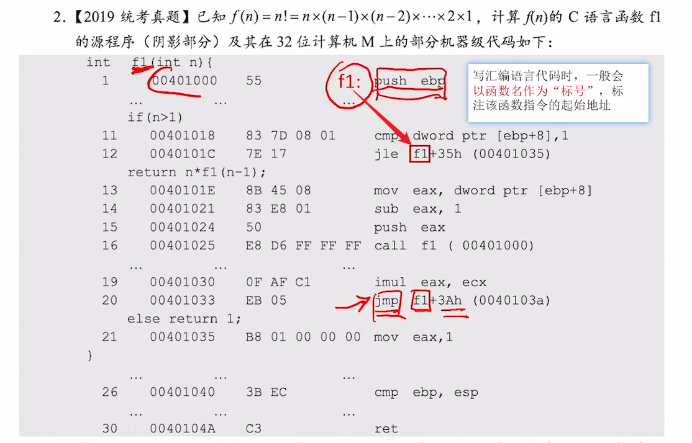


> cmp的底层原理
>
> 两个数相减，把标志位存入PSW(或者叫IR)，根据结果的OF、SF、ZF、CF判断大小，比较两数的大小
>
> 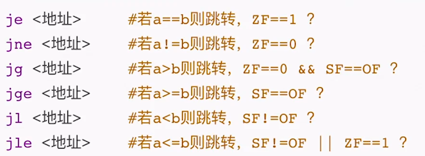


### 循环语句机器级表示


#### 用条件转移指令实现

先将循环需要使用的数据初始化

然后判断初始状态能否进入循环

进入循环执行循环主体

主体结束判断是否再次循环

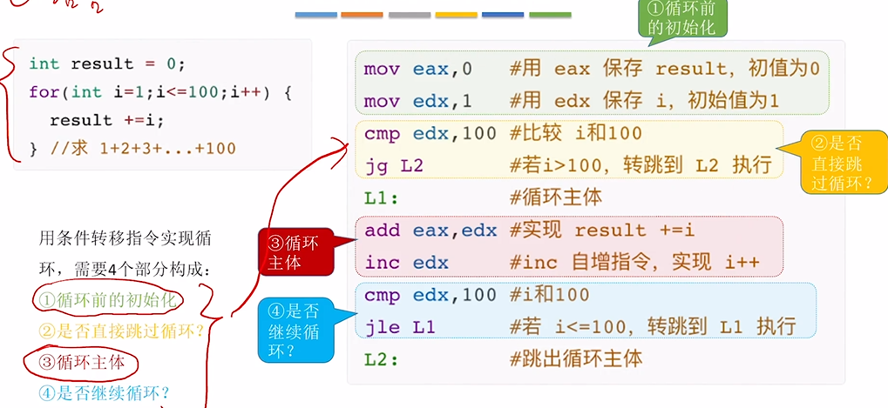


#### 使用loop实现循环

loop使用ecx寄存器(必须是这个)，会先给ecx赋值，然后每次跳转自动让ecx-1，当ecx为0时结束循环

使用条件转移指令可以实现同样的效果，但是loop更简洁

此外还有如loopnz，loopz这种指令，只是结束条件不同，会多判断最近一次运算的值的ZF的值

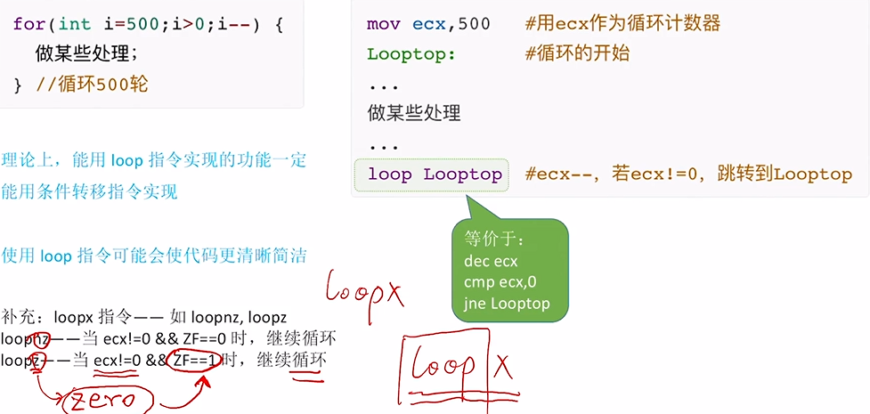


### 函数调用机器级表示

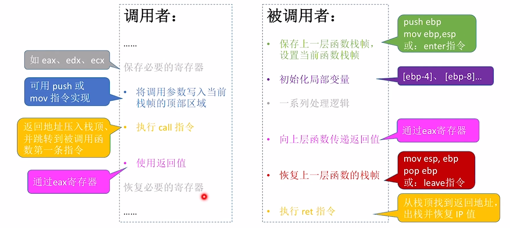

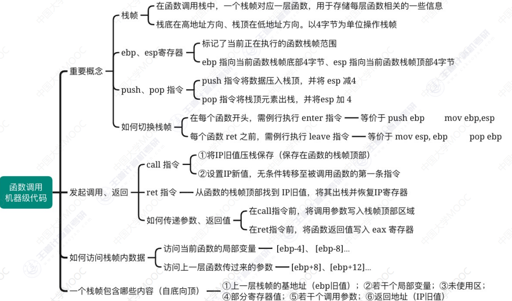

#### call和ret

用call调用，用ret返回

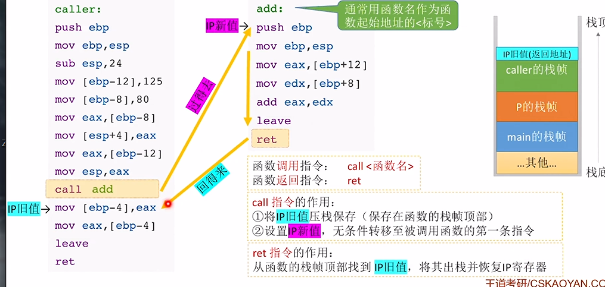

##### 调用：call <函数名>

将IP(也就是PC)的**旧值压入栈保存**，放在栈顶

**设置IP的新值**，也就是被调用函数的第一行

##### 返回：ret

在函数栈帧的顶部**找到IP旧值**，出栈，并恢复IP寄存器的值


#### 函数调用栈在内存的位置

由于**栈底是高地址，栈顶是低地址**

所以说画图会把栈底画在上面，栈顶画在下面

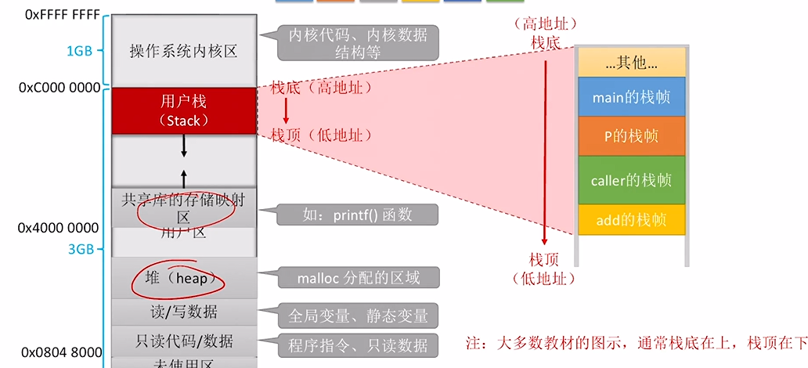

#### 如何访问栈帧中的数据

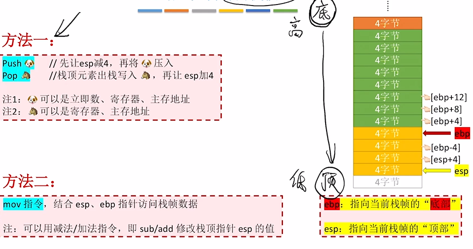

##### 标记栈帧范围：EBP、ESP寄存器

EBP:指向当前栈帧的**底部**

ESP指向当前栈帧的**顶部**

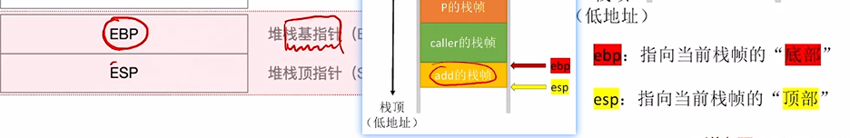

在X86系统中，栈的操作单位是**4字节**

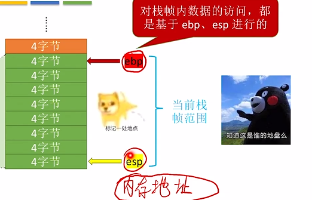

##### 访问栈帧数据：push、pop

push实现入栈，pop实现出栈。x86默认以**4字节**为单位

但是这种方法**只能访问到栈顶的元素**

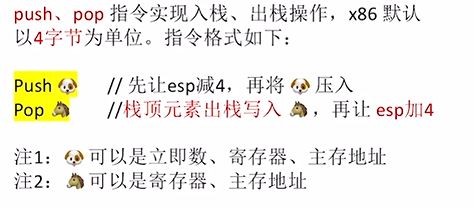

##### 访问栈帧数据：mov

使用**mov指令，结合esp、ebp访问栈帧数据**

可以用减法/加法指令，即sub/add修改栈顶指针esp的值

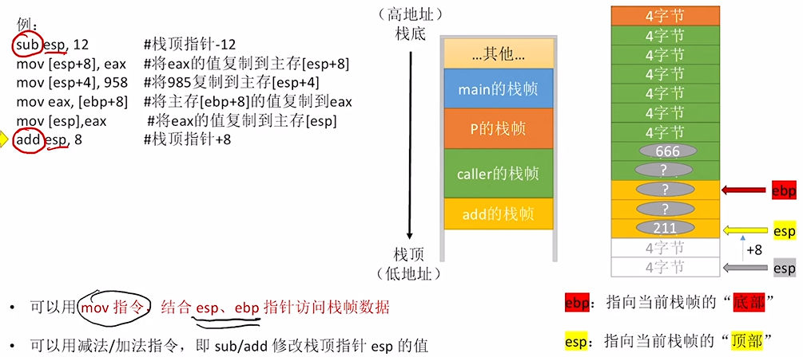


#### 如何切换栈帧

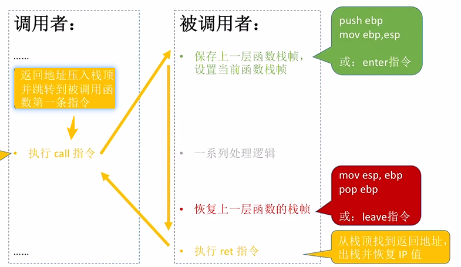


##### 调用时切换

call *函数名*   的作用：

将I**P的旧值压栈**保存(相当于push IP)

然后**设置IP的新值**，也就是无条件转移到被调用函数的第一条指令(相当于 jmp *函数名*)

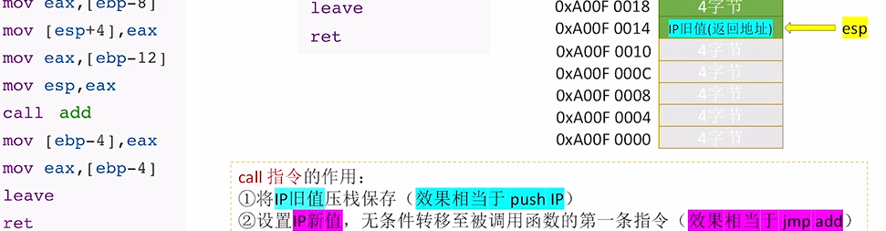

这个函数就暂时结束，**执行被调用函数的指令**

先 **push ebp** 也就是把原先函数的ebp所在地址压入栈顶（对这个新函数来说其实是栈底）

然后**mov ebp, esp**   把esp赋给ebp(也就是让ebp指向esp，现在ebp就是新函数的栈底了)

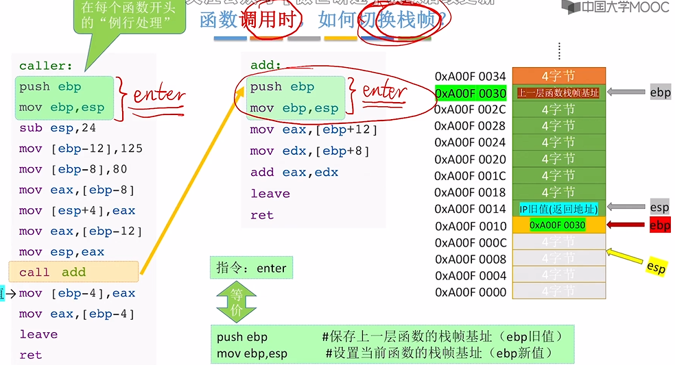

如果要回退的话，只用**找到栈底的地址，就能找到调用函数的基地址了**

这两条指令可以用**enter**指令替代，每个函数的开头都有这个指令


##### 返回时如何切换

先 **mov esp, ebp** 让栈顶指针指向栈底

**pop ebp** 把当前栈顶的值赋给ebp，也就让ebp指向了上一层的栈底，

同时esp也回退一单位，指向**IP旧值**

这两个指令，等价于**leave**指令，在**返回之前都要执行**

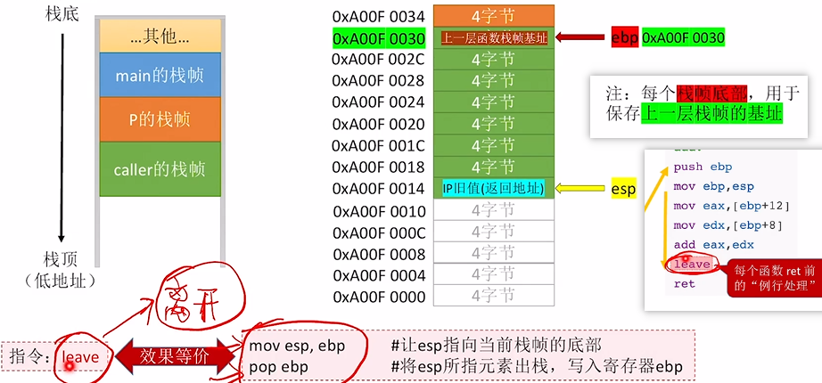

**ret** 指令，会从函数的栈帧的顶部找到**IP旧值**，将其出栈并恢复IP寄存器

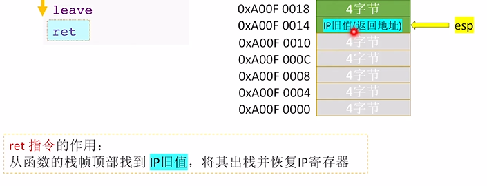


#### 如何传递参数和返回值


##### 栈帧内包含的内容

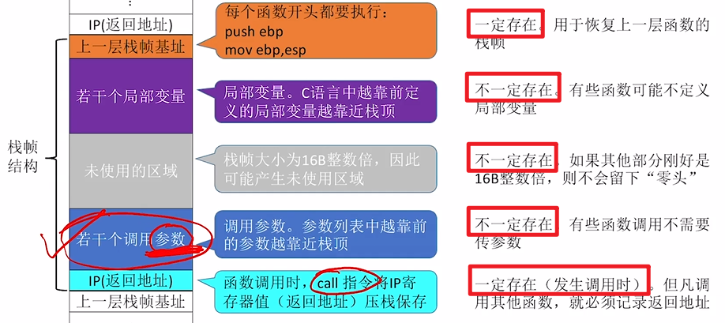

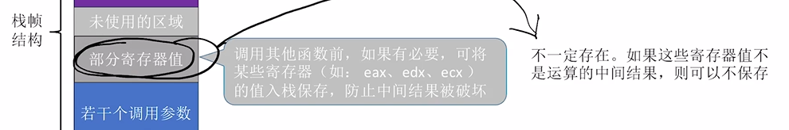

栈帧**最底层**一定是上一层函数的基地址（**ebp旧值**）

栈帧**最顶部**一定是IP的值（也就是上一层**IP的旧值**）

**栈底下面**紧接着是函数的**局部变量**，按倒序存储的，越**先定义的**，越靠近栈顶(**靠下**)

> 如[ebp-4]就是**本函数最后一个**定义的局部变量

**栈顶上面**是**调用参数**(传入的)，还是**先出现的靠下**（注意：传入的参数存在上一层函数，也就是ebp的上面）

> 如[ebp+8]就是**上一层**函数传入的**第一个参数**
>
> 注意[ebp+4]是上一层函数的IP

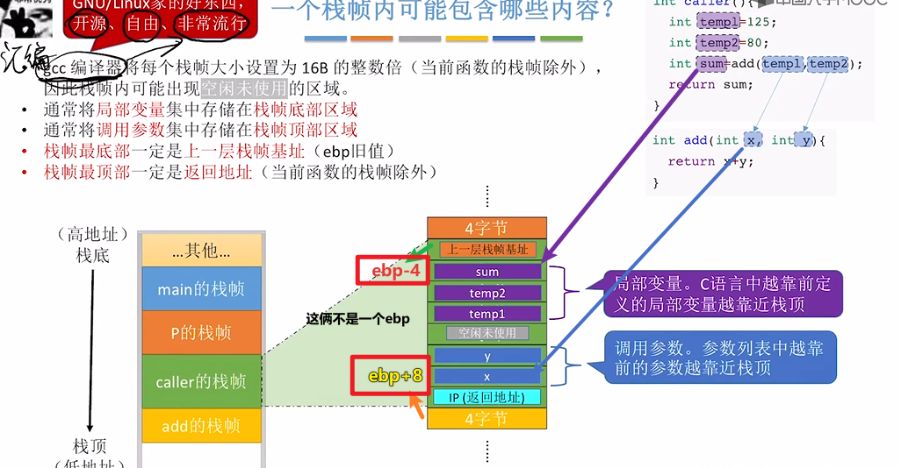


使用返回值和传递返回值都需要把本函数的返回值写入eax寄存器中

需要调用上个函数的返回值，也从eax里读取


### CISC和RISC

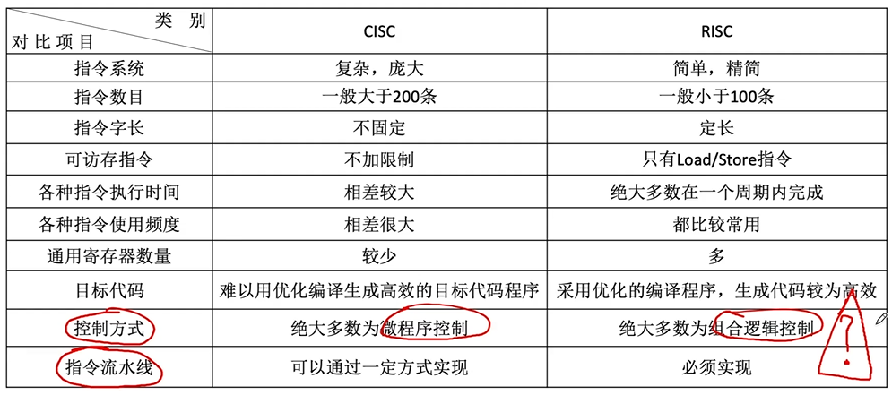

CISC复杂指令集：一条指令完成一个复杂的基本功能

> X86架构，主要用于笔记本台式机
>
> 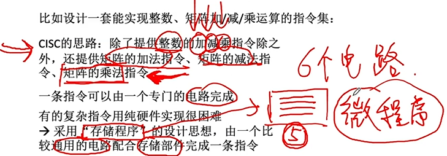
>
> 指令都可以访问主存

RISC精简指令集：一条指令完成一个基本动作；多条指令完成复杂的基本功能

> ARM架构，主要用于手机、平板
>
> 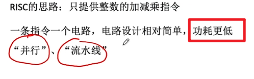
>
> 只有load和store才能访存


# 中央运算器


## CPU的功能和基本结构


### CPU的功能

1. **指令控制**

   完成取指令、分析指令和执行指令的操作，也即**程序的顺序控制**

2. **操作控制**

   一条指令往往由多个操作信号组合实现，**CPU管理并产生**由内存取出的每条指令的**操作信号**，把各种操作信号**送往相应的部件**，从而**控制部件按照指令的要求进行动作**

3. **时间控制**

   对各种操作进行时间上的控制，时间控制要**为每条指令按时间顺序提供应有的控制信号**

4. **数据加工**

   也就是对数据进行算数和逻辑运算

5. **中断处理**

   对计算机运行过程中出现的异常情况和特殊请求进行处理


#### 运算器和控制器的功能

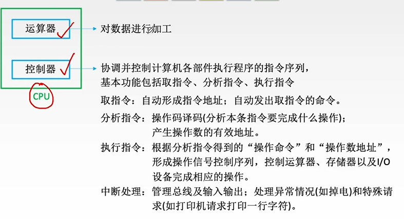

**运算器**：对数据进行加工

**控制器：**协调并控制计算机各个部件执行程序的指令序列(取指令、分析指令、执行指令)

- 取指令：自动**形成下一条指令地址**；自动**发出下一条取指令命令**
- 分析指令：操作码**译码**；**产生操作数的有效地址**
- 执行指令：根据分析指令得到的 *操作命令* 和 *操作数地址* ，**形成操作信号控制序列**，控制运算器、存储器以及I/O设备**完成相应操作**
- (每执行完一条指令就检查)中断处理：管理总线及输入输出；处理异常情况(掉电、不合规的运算)和特殊请求(打印机请求打印)


### CPU的基本结构

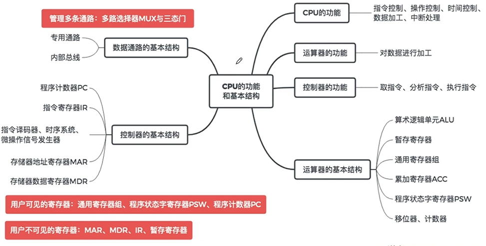


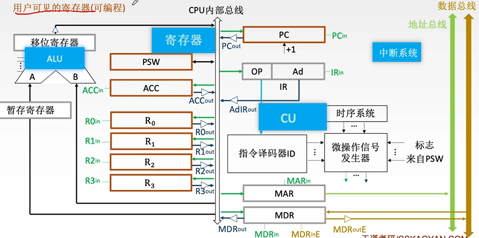

棕色是对用户可见的寄存器，灰色是对用户不可见的

图中的终端系统暂时还未介绍


#### 运算器的基本结构

此图采用的是**CPU单总线方式**的示意图，还有一种是**专用数据通路**方式

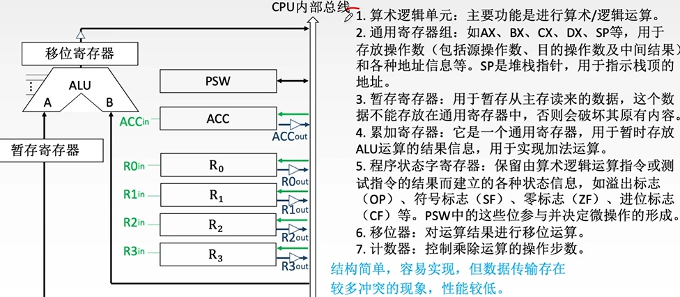

##### 算数逻辑单元ALU

主要功能是进行算数/逻辑运算

##### 通用寄存器组

如AX、BX、SP等

用于存放操作数和各种地址信息

AX这种可以被分为AH和AL来使用

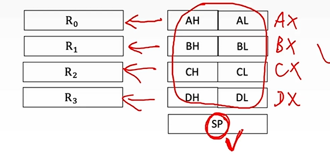

其中SP是**堆栈指针**，用于指示当前进程栈顶的位置

> ### ALU与寄存器数据的传送
>
> #### 专用数据通路方式
>
> 每个寄存器都跟ALU相连，假设有一个寄存器n位，那每一个寄存器就要和ALU的一端有n根线(图中简化成1个箭头了)
>
> 但是直接相连可能会导致ALU同时接收到很多数据，所以需要**多路选择器**，每次根据控制信号选择确定的数据读入
>
> 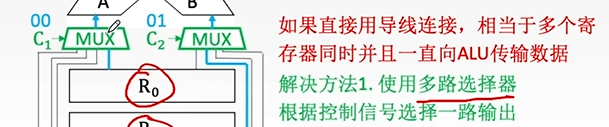
>
> 或者使用**三态门**，原理也类似
>
> 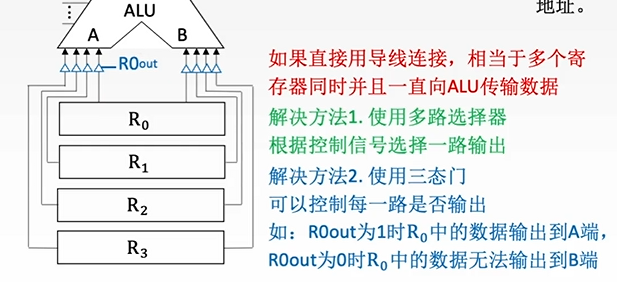
>
> 优点：性能高，不会冲突
>
> 缺点：结构复杂，硬件量大，不易实现
>
> #### CPU内部单总线方式
>
> 在CPU内部设置一个总线，所有数据都通过这个总线传送
>
> 每个寄存器都有三态门来选择是否读入或输出到总线
>
> 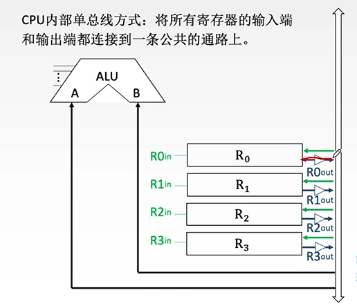
>
> 优点：结构简单，便于实现
>
> 缺点：数据传输有较多冲突，性能较低
>
> ##### 解决冲突
>
> 若直接采用上图，当两数相加时，ALU不能同时读到2组数据，导致运算不能成功
>
> 所以需要在一端添加**暂存寄存器**，先把数据存储进去，然后再让另一个寄存器发送数据，这样就能进行两个数据的运算了
>
> 
>
> 除此之外，在ALU的输出端也需要一个暂存寄存器，当信号稳定时再输出结果
>
> 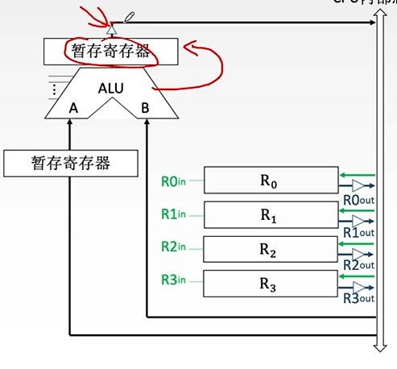


##### 暂存寄存器

用于**暂存从主存读来的数据**，这个数据**不能存放在通用寄存器**中，否则会破坏器原有内容(也就是通用寄存器中存储的数据是未使用的，不能覆盖)

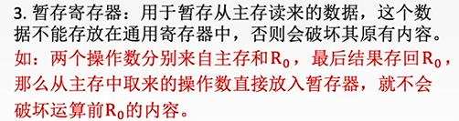

还可以对暂存寄存器进行一些改造，让其变成累加寄存器或者移位寄存器，累加寄存器也可以单独定义

##### 累加寄存器ACC

是通用寄存器，暂存ALU的结果信息，用于实现加法运算

##### 程序状态字寄存器PSW

也叫标志寄存器FR

存储ALU算出来的标志信息，如OF、SF、ZF、CF等

##### 移位器

对运算结果进行移位

##### 计数器

用于控制乘除的操作步数


#### 控制器的基本结构


##### 程序计数器PC

用于指出下一条指令在主存中的存放地址。CPU是根据PC的值取指令的

PC一般会有自增功能(但是有的设备是交给ALU来实现)

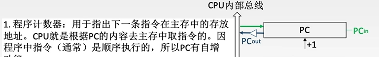

##### 指令寄存器IR

用于保存当前正在执行的指令

地址码会传到总线

操作码会传给**指令译码器**

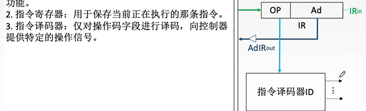

##### 指令译码器ID

译码器根据操作码，向控制器确定下一步该进行的信号


##### 微指令信号发生器

根据译码器的输出，判断应该执行的一系列微操作信号

但是微操作执行需要先后顺序，这通过**时序系统**来进行控制

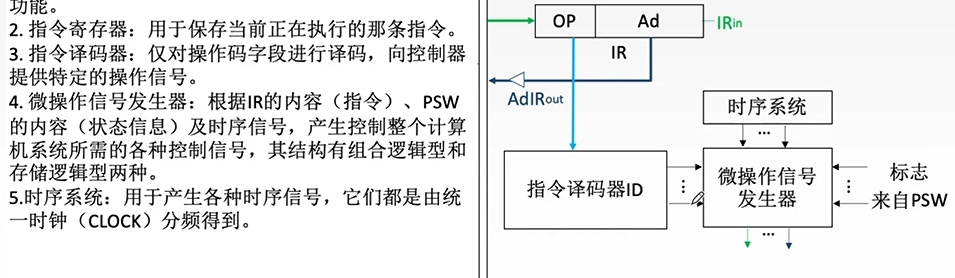

有些操作还会受PSW的一些标志信号影响

##### 时序系统

产生各种时序信号


##### 存储器地址寄存器MAR

存放要访问的主存单元的地址

在导通后，根据地址在**地址总线**上查找对应的地址单元

找到数据后，会通过**外部的数据总线**放入MDR中

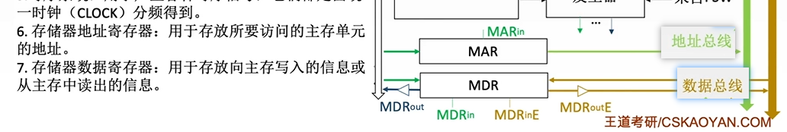

##### 存储器数据寄存器MDR

MDR有两个输入控制信号

$MDR_{in}$ 是CPU内部总线输入数据是否有效

 $MDR_{inE}$是外部数据总线输入数据是否有效

输出也有2个

$MDR_{out}$ 有效时，会输出数据到CPU内部总线

 $MDR_{outE}$有效时，会输出数据到外部数据总线


## 指令的执行过程

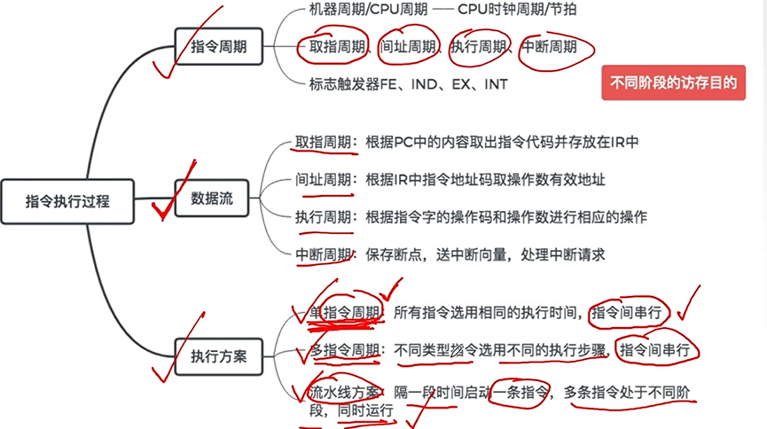

### 指令周期

**指令周期**：CPU从主存取出一条指令，并执行一条指令，所需的全部时间

**指令周期**常用若干**机器周期**表示，机器周期又叫**CPU周期**

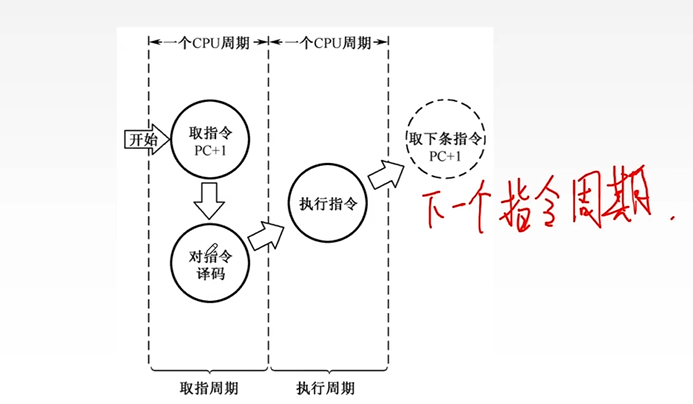

一个机器周期，又包含若干个**时钟周期**(CLK也称**节拍、T周期或CPU周期**，他是CPU操作的**最基本单位**)

一个机器周期就是完成一个子工作时间，若指令的每个子工作花费的时间都相等，则称为是**定长机器周期**，否则是**不定长的机器周期**

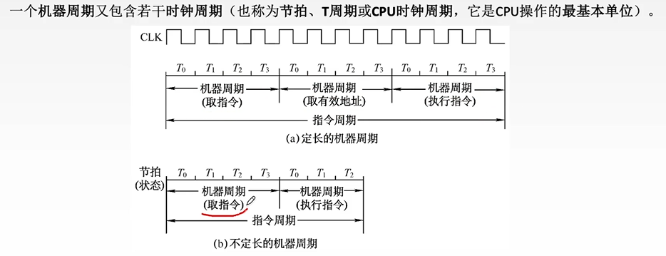

> 下面以**定长机器周期**(电路简单)为例，记录一些具体的指令周期的实现
>
> 一个指令会包括取指周期、间址周期、执行周期、中断周期
>
> 其中间址周期可能0，1，多个都有可能
>
> 每一个时钟周期最多可以通过一个**微命令**完成一个**微操作**
>
> 当时当几个微操作间**不冲突**时，它们可以**并行执行**，
>
> 所以一个时钟周期，**通过并行可能会完成多个微操作**
>
> 每个周期的时钟周期数按最大的统一，若操作实际需要的较少，**在机器周期的末尾进行操作**(也就是前面的空出来)
>
> 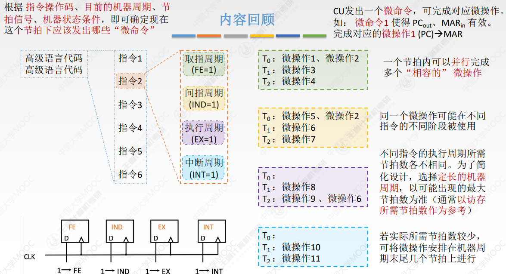

对不同指令来说，机器周期数可以不等，每个机器周期内的节拍数也可以不等，但是电路设计会较复杂

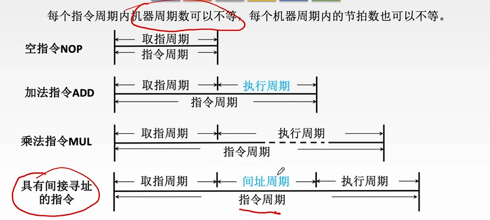

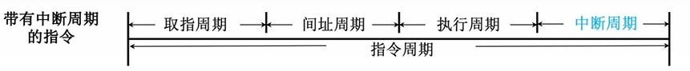


### 指令周期的数据流

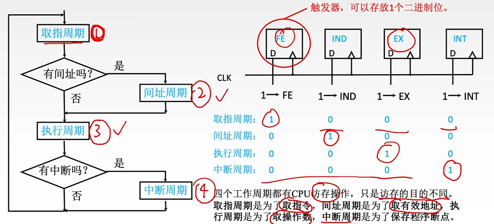

取指、间址、执行和中断这四个周期都有可能有CPU访存操作，但是目的不同

**取指周期**FE：取指令

**间址周期**IND：为了取有效地址

**执行周期**EX：为了取操作数

**中断周期**INT：为例保存程序断点


#### 取指周期

1. 把当前地址送入MAR中，记做：$(PC)\ -> MAR$ 

2. CU发出控制信号，经控制总线传到主存，这里是读信号，那就是

   $1->R$    (R=1代表读信号)

3. 将MAR所指的主存地址的内容通过数据总线送入MDR，记做$M(MAR)->MDR$ 

4. 将MDR中的内容送人 IR，记做$(MDR)->IR$


#### 间址周期

有的指令会有这个周期，不是都有

1. 把当前指令的地址码送入MAR,，记做：$Ad(IR)->MAR$
2. CU发出读控制信号，就是$1->R$
3. 根据MAR指明的地址，把数据送入MDR记做$M(MAR->MDR)$
4. 将有效地址送入指令的地址码字段，记做$MDR->Ad(IR)$

#### 执行周期

不同指令的操作不同，所以**没有统一的数据流向**


#### 中断周期

中断：暂停当前任务去其它任务。为了恢复当前任务，**需要保存断点**

一般使用堆栈保存断点，这里用SP表示栈顶，**假设SP指向栈顶元素，则要先修改指针，再存入数据**

1. CU控制将SP减1，把修改后的地址(SP-1)送入MAR

   记做$(SP-1)->SP$ ，$(SP)->MAR$

   这是为了确定PC要写入的地址，先把这个地址送入MAR，然后才能写

2. CU发出控制信号，启动主存做写操作，记做：$1->W$  (W代表写)

3. 将当前的断点(PC的值)送入MDR，记做$(PC)->MDR$

   此时断点就保存了，该去执行中断处理程序了

4. CU控制将中断服务程序的入口地址(由向量地址形成部件产生)送入PC，记做$向量地址->PC$


### 指令执行方案


#### 单指令周期

对所有指令都采用相同的执行时间来完成

也就是所有指令的执行时间都和最长的一样

是**串行执行**

效率低，但设计简单

CPI=1

#### 多指令周期

对不同指令选用不同的执行步骤来完成。

可以选用不同个数的时钟周期来完成不同指令

指令之间也是**串行执行**

效率稍高，但是硬件更复杂一些

CPI>=1

#### 流水线方案

在每个时钟周期启动一条指令，

尽量让多条指令同时运行，

各自处于不同的执行步骤

**指令间并行执行**

当指令很多时，CPI趋向于1


## 数据通路

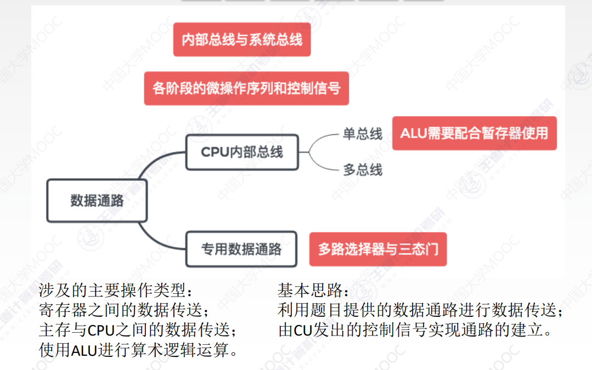

CPU可视为由**数据通路**和**控制部件**两大部分组成

***数据在指令执行过程中所经过的路径，包括路径上的部件，称为数据通路***

> 数据通路由若干**组合逻辑元件**和**时序逻辑元件**连接而成
>
> #### 组合逻辑元件（操作元件）
>
> **不含存储**信号的记忆单元，**不受时钟信号的控制**，输入输出间没有反馈通路，**信号单向传输**
>
> 如**加法器、ALU、译码器、多路选择器、三态门**
>
> #### 时序逻辑单元（状态元件）
>
> 输出不仅与该时刻的输入有关，还和之间的输入有关，所以时序电路必然**包含存储信号**的记忆单元。**必须在时序节拍下工作**
>
> 主要是**各类寄存器和存储器**：通用寄存器组、程序计数器、
>
> 状态/移位/暂存/锁存寄存器等

数据流通一共三种：**寄存器之间**，**寄存器与主存**之间，**寄存器与ALU**之间

数据通路：数据在功能部件之间的传输的路径（信息从哪开始，经过哪些部件，传送到哪里）

所有数据通路，都是由控制部件(主要是**微操作信号发生器**)产生的**控制信号**建立的

控制信号分两种：信号是否可以**进入**寄存器；信号是否可以**流出**寄存器

CPU内部**单总线结构**:在同一时刻，**只允许一对**部件进行数据传送

CPU内部**多总线结构**:与单总线几乎一样，就是多了几根总线，在同一时刻，只**允许多对**部件进行数据传送

**专用数据通路方式**：只要两个部件会有数据流动，就建立一条专用的数据t通路

下面进行介绍

### 单总线结构

内部总线：CPU内部连接各寄存器及运算部件之间的总线

系统总线：CPU、内存、通道和各类I/O接口间相互连接的总线

#### 寄存器之间的数据传送

以把PC送入MAR为例，传送操作的流程和控制信号为：

(PC)->Bus         $PC_{out}$有效，**PC内容传送到总线**

Bus->MAR			$MAR_{in}$有效，**总线的内容送到MAR**

> 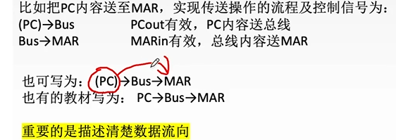
>
> 寄存器之间传输，只需要一个out信号打开，传输到总线，然后另一个in信号打开，接收，就完成了

#### 主存与寄存器之间的数据传送

以CPU从主存中读取指令为例，传送操作的流程和控制信号为：

(PC)->Bus->MAR			$PC_{out}$和$MAR_{in}$有效，现行**指令地址存入到MAR**

(结束后，上述两信号撤销，让总线重新空闲)

**1->R**									CU发送读命令(通过控制总线发出)

MEM(MAR)->MDR		  $MDR_{inE}$有效，主存中的指令读入到MDR

MDR->Bus->IR				 $MDR_{out}$和$IR_{in}$有效，指令读入到IR


#### 执行算数或逻辑运算(寄存器->ALU)

以加法指令为例，微指令操作序列和控制信号为：

一个操作数已经在ACC中，指令也已读入IR

1. Ad(IR)->Bus->MAR							$MDR_{out}$和$MAR_{in}$有效(也可以使用IR和MAR)

2. **1->R**														CU发送读命令(通过控制总线发出)

3. MEM(MAR)->数据线->MDR		  $MDR_{inE}$有效，主存中的指令读入到MDR

4. MDR->Bus->Y									$MDR_{out}$和$Y_{in}$有效，操作数存入暂存寄存器Y

5. (ACC)+(Y)->Z									 $ACC_{out}$和$ALU_{in}$有效，CU向ALU发送加命令，ACC把数据也传入ALU，与Y一起，进行加运算，结果输入到暂存寄存器Z

   > 4、5这两步操作是因为，ALU必须两端数据都有效才有正确结果，但是单总线同时只能输出一个数据
   >
   > 所以需要**暂存寄存器**存储一个操作数
   >
   > 如果使用多总线方式，可以不用设置

6. Z->Bus->ACC 									$Z_{out}$和$ACC_{in}$有效，当结果的数据稳定后，通过内部总线存入到ACC

> 每个时钟周期可以完成一个微操作


#### 例题

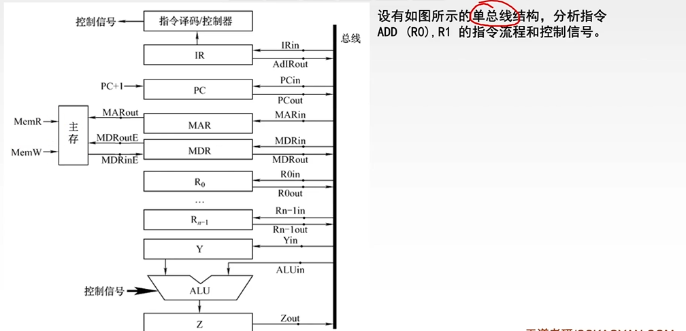


##### 分析指令功能和指令周期

由于是ADD ($R_0$), $R_1$

所以是是把$R_1$的值加到主存的$R_0$地址处，也就是目的操作数采用了寄存器间接寻址

> 本题不是X86的汇编，使用的()代表在主存地址

所以需要把$R_0$的值读出来，在主存中找到对应值，与$R_1$计算后，写回主存

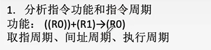

##### 取指周期

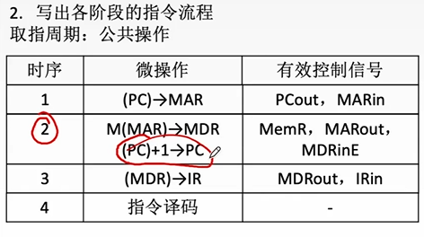

##### 间址周期

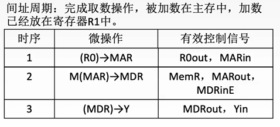

##### 执行周期

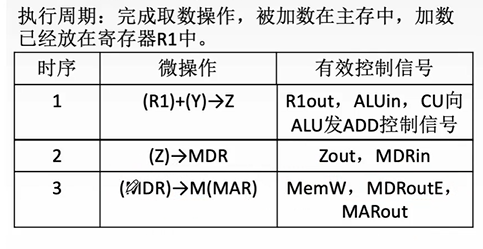

### 专用通路结构

专用通路就是把所有需要数据传递的部件，都设计了一条通路用于传输数据

每个通路上都有控制信号，用于控制哪些部件进行传递数据

如下图

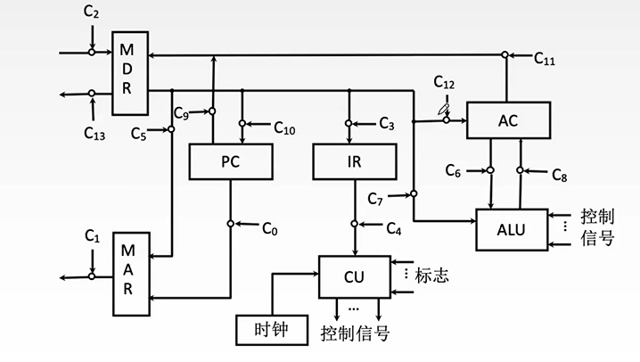

下面举一些例子

#### 取指周期

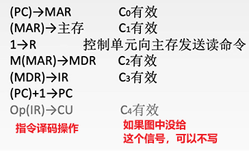

与单总线的实现还是比较类似的


## 控制器的工作原理


> 一段代码会被转换成若干指令
>
> 一个指令分为若干周期，称作机器周期，其中间址周期可能有多次
>
> 每个周期有若干节拍(时钟周期)，每个节拍可以串行完成一个微操作或并行完成多个微操作
>
> 对应**定长机器周期**的系统，器每个机器周期长度相同，长度较短的那些，在机器周期的后部进行微操作
>
> 对于所有的指令，其取指周期、间址周期和中断周期的微操作是完全一样的
>
> 


### 硬布线控制器的设计

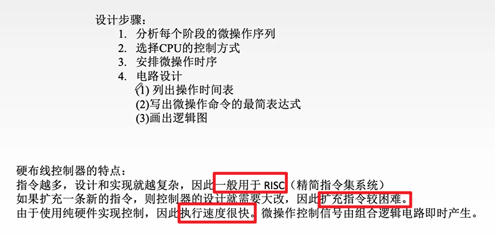


CU是控制器的核心部件，下面介绍一下CU需要的输入和输出

#### CU的输入和输出

1. 首先是指令寄存器传来的n位操作码，通过指令译码器ID后传入CU，表明当前是什么指令
2. 然后是FE、IND、EX、INT四个触发器，分别表示当前出去取指、间址、执行还是中断周期
3. 还有各种标志信号，主要来自PSW、ACC，也可能来自I/O设备或者主存
4. 然后是通过节拍发生器传来的节拍信号，也就是表明现在是当前周期的第几个节拍，以便确定应当的微操作

- 输出信号就是当前应当执行的微命令的控制信号

  例如$(PC)->MAR$ $C_1=FE \cdot T_0$ 

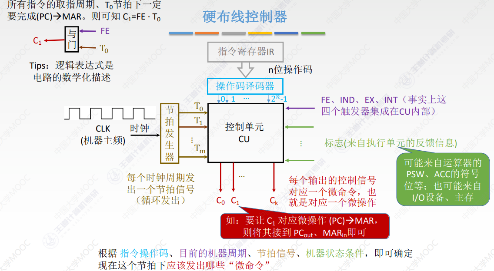

所以**只要我们能写出根据输入得到输出的逻辑表达式，那么电路也就好设计了**

#### 设计步骤

##### 分析每个周期的微操作序列

也就是分析每个指令，在每个阶段会用到的微操作

> 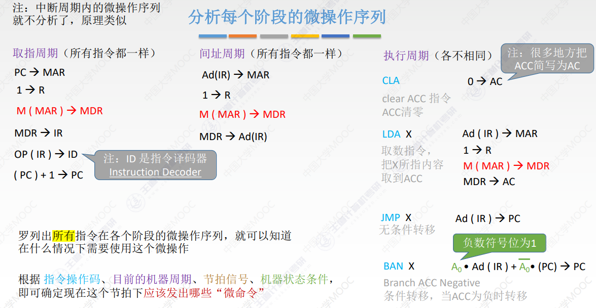
>
> 把所有指令的微操作都罗列出来就行了

##### 选择CPU的控制方式

> 为了简单，只考虑定长机器周期，一个机器周期3个节拍

##### 安排微指令操作时序

如果在3个节拍内完成这个周期的所有操作

安排操作时序的原则

- 微操作的先后**顺序不能随意更改**

- **被控对象不同**的微操作，尽量在一个节拍内完成

  也就是说这两个微指令的对象不一样，可以并行，要在一个节拍

- 占用**时间较短**的微操作，尽量在一个节拍内完成

  主要是指全部都是寄存器间的操作

> #### 取指周期
>
> 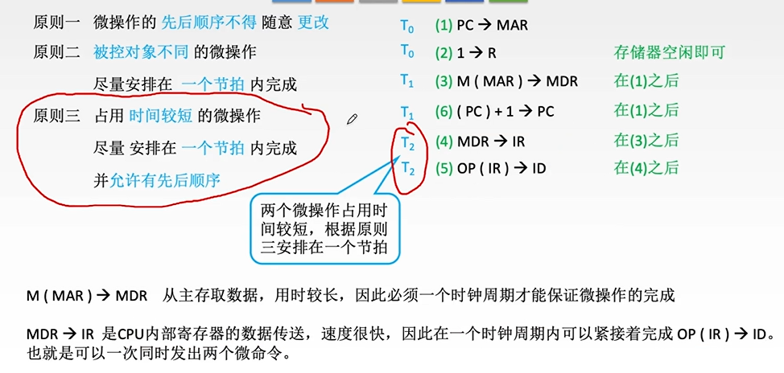
>
> 先写出所有微操作，然后找到各微操作是否有依赖关系
>
> 确定可能的顺序
>
> 如果涉及到访存，那就只能让它独享一个时钟周期
>
> 如果全在寄存器里，且是可以顺序执行的，那么可以安排在一个时钟周期
>
> #### 间址周期
>
> 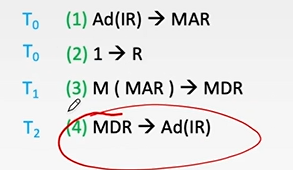 像(3)和(4)就不能在同一个节拍
>
> #### 执行周期
>
> 每个指令在执行周期的微操作并不相同，所以每个都要设计
>
> 把指令分为非访存指令和访存指令，这是因为访存指令可能会有间址，进入到间址周期，而非访存指令不会间址
>
> 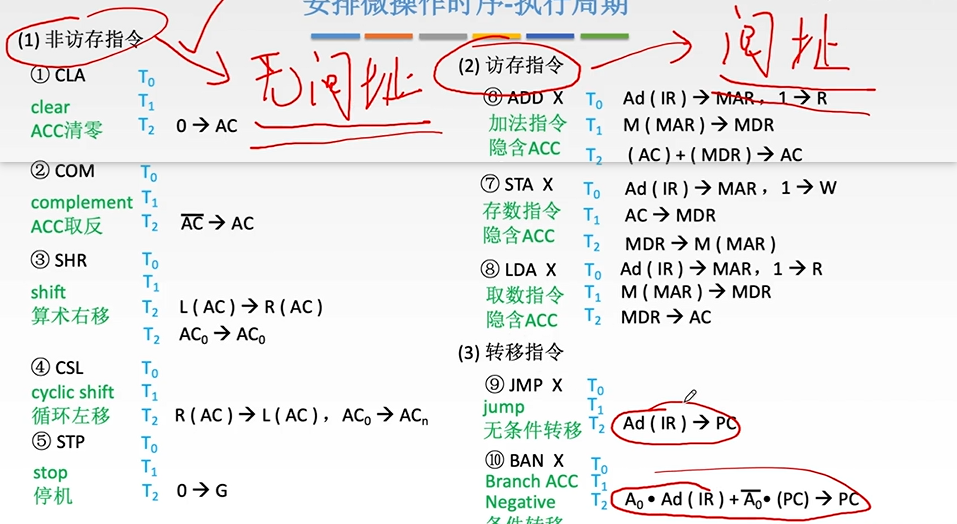

##### 电路设计

确定每个微操作命令的逻辑表达式，然后用电路实现

> ## 设计步骤
>
> ### 列出操作时间表
>
> 列出在四个周期中，T0，T1，T2节拍内可能用到的所有微操作
>
> #### 取指周期FE
>
> 由于所有指令都会有取指，所以几乎全是1
>
> 其中条件状态行的I，代表是否有间址的特征，如果有，下一步会进行间址周期，若没有，会进入执行周期
>
> 对于没有访存的指令来说，不论怎样都不会有间址周期，所以倒数第二行不填，需要访存的指令在有间址特征时需要进入间址周期所以要填
>
> 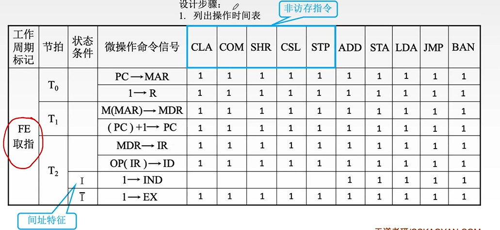
>
> #### 间址周期IND
>
> 对于非访存指令，不会进入这个周期，所以都不写
>
> 对访存指令来说，由于可能进行多次间址，所以还要判断这次是否有**间址周期标志**，**如果有，还要再进入间址周期，若没有，进入执行周期**
>
> 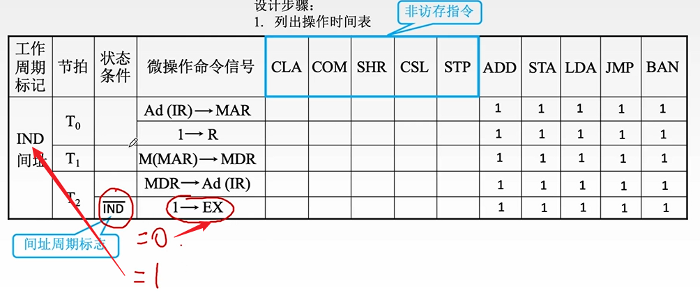
>
> #### 执行周期
>
> 把T0，T1，T2节拍内可能用到的所有微操作和所有指令都列出来，但是指令不同，表也不大相同，这里只有一部分
>
> 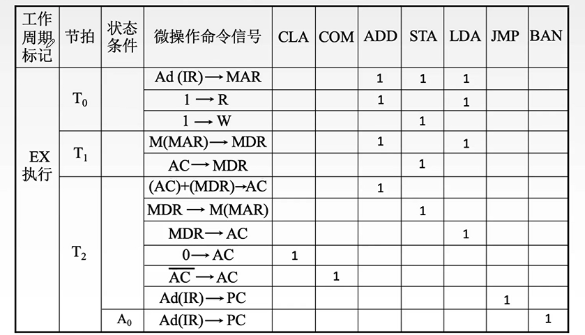
>
> ### 写出操作命令的最简表达式
>
> 根据所有的操作时间表，找到每种微指令的所有出现的情况
>
> 找到逻辑表达式，并化简
>
> 以$M(MAR) \to MDR$为例
>
> 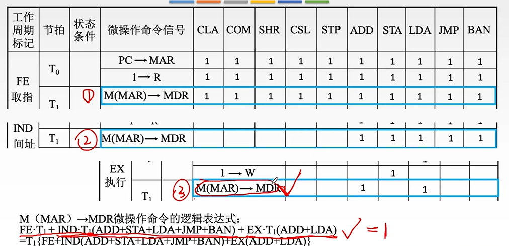
>
> ### 画出逻辑图
>
> 根据逻辑表达式画出电路，以$M(MAR) \to MDR$为例
>
> 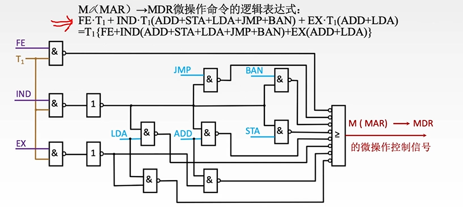

#### 特点

指令越多，实现就越复杂，所以一**般是用于RISC**

扩充指令控制器设计需要大改，所以**扩充指令较困难**

使用纯硬件控制，执行速度很快。微操作控制信号有组合逻辑电路即时产生


### 微指令控制器


> 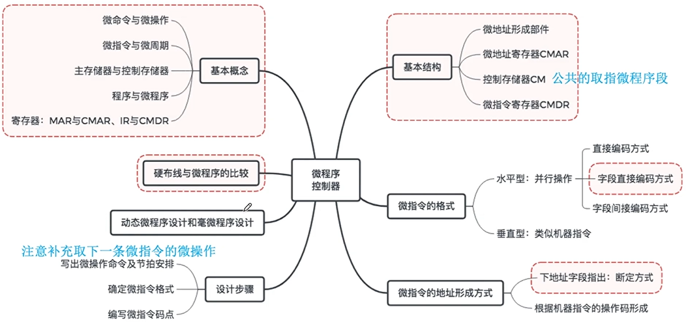

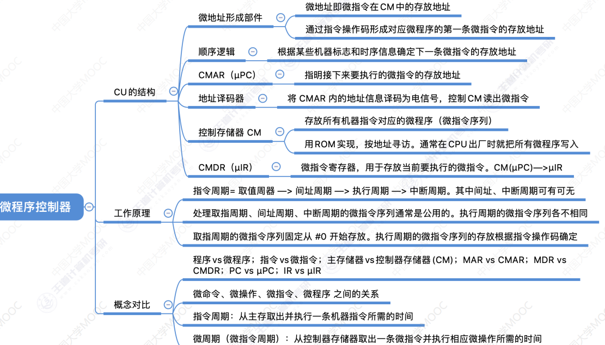

#### 微指令控制器的设计思路

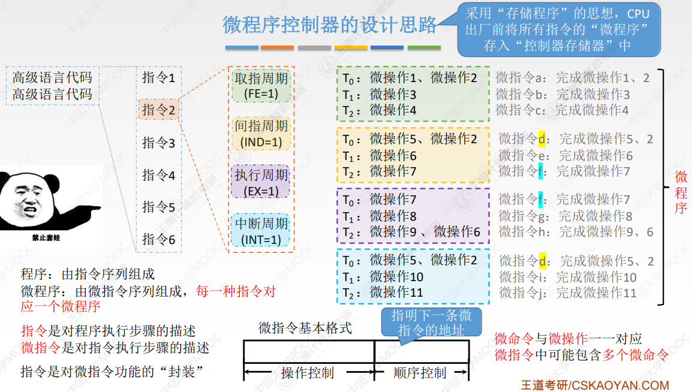

程序：由指令序列组成

**指令**是对程序执行步骤的描述

微程序：由微指令序列组成，**每一种指令对应一个微程序**

**微指令**是对指令执行步骤的描述

> **微命令**与**微操作**一一对应
>
> 但是**微指令**是一个时钟周期所有的操作，**可能对应多个微命令**或者说微操作

微指令的基本格式：nbit的操作控制+mbit的顺序控制(下一条指令在控存中的地址)

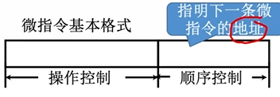

#### 微指令控制器的基本结构

在CU中的部件如下

**控制存储器CM**：用于**存放**各指令对应的**微程序**，一般用ROM制成

**微地址寄存器CMAR：别名$\mu PC$**，接收微地址形成部件送来的微地址，为在CM中读取微指令做准备(类似cache和主存的关系) 

**地址译码器**：把地址码转化为存储单元控制信号

**CMDR：别名$\mu IR$**：用于存放从CM中取出的微指令。他的位数和微指令字长相同

**微地址形成部件**：产生初始微地址和后续微地址，保证微指令连续执行

**顺序逻辑**：根据标志和CLK信息，确定微指令的存放地址

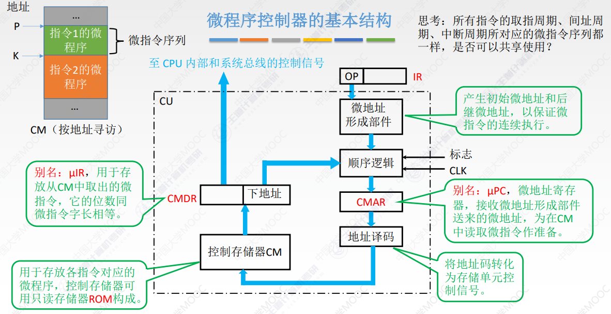

#### 微程序控制器的工作原理

对于取指、间址、中断周期，微指令序列或者说是微程序是一样的，所以在CM中只需要存1份。只有执行周期是每个指令不同的

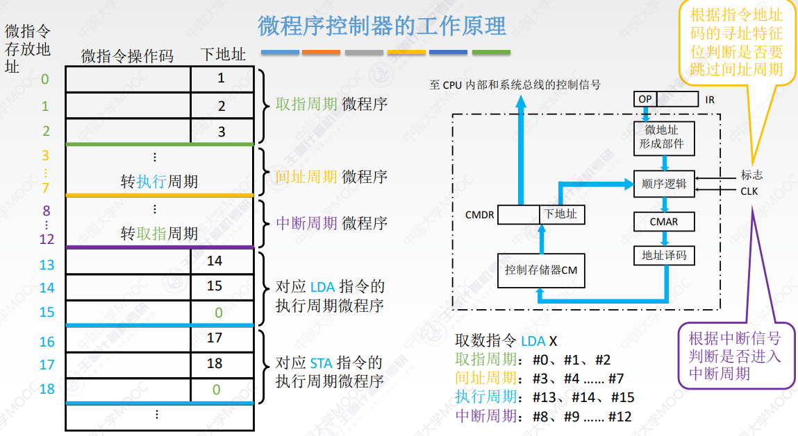

每一段结束后，除了要看最后那个微指令的**下地址**，还要根据**顺序逻辑**接收到的**标志**或**CLK**进行指令跳转

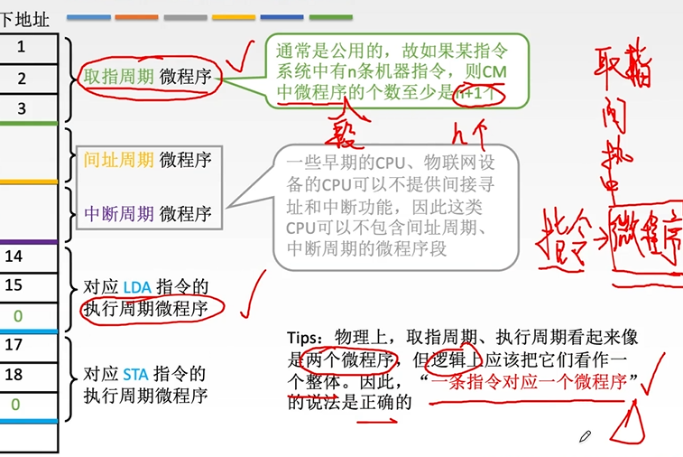

可以说一条指令对应一个微程序，也可以说那一段是一个微程序，或者叫它微程序段


### 微指令的设计

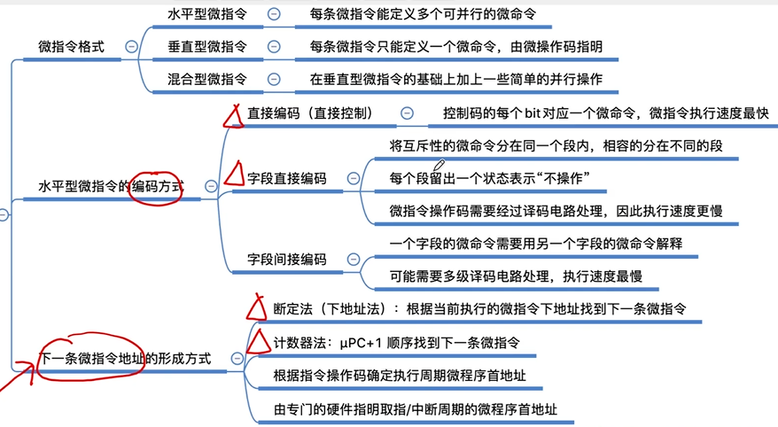

#### 微指令的格式

**相容性微命令**：可以并行完成的微命令

**互斥性微命令**：不允许并行完成的微命令


##### 水平型微指令

一条微指令能定义多个微命令

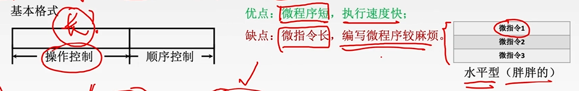

优点：微程序短(微指令条数少)

缺点：每个**微指令长**，编写微程序较麻烦

##### 垂直型微指令

一条微指令只能定义一个微命令

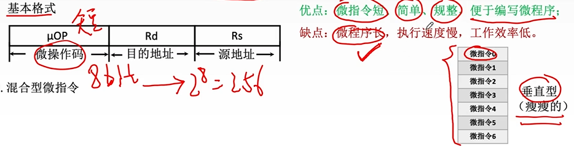

优点：**微指令短**，简单规整，便于编写微程序

缺点：微程序长，执行速度慢，工作效率低

##### 混合型微指令

在垂直型的基础上增加一些不太复杂的并行操作，微指令较短，仍易于编写；微程序也不长，执行速度加快


#### 水平型微指令的编码方式

也叫微指令的控制方式，他是指如何对微操作的控制字段进行编码，形成控制信号。编码的目的是在**保证速度的情况下，尽量缩短微指令字长**。


##### 直接编码(直接控制)方式

在微指令的操作控制字段中，**每一位代表一个微操作命令**

规定每一位代表的微操作，然后当这位为1，代表该指令会执行这个微操作

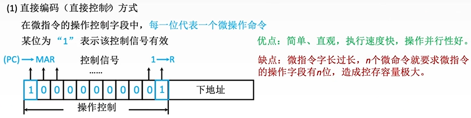

优点：**简单直观，执行速度快，并行性好**

缺点：**微指令字长过长**，会导致控存容量占比过高


##### 字段直接编码方式

把微指令的控制字段分成若干个段，**每段经过译码后发出控制信号**

微命令分段的原则：

**互斥性**微操作分在**同一段**内，**相容性**微命令分**在不同段**内

**每个小段**包含的**信息位不能太多**，否则会增加译码线路的复杂性和译码时间

**每个小段还要留出一个状态**，表示本段不发出任何微命令，所以说3位最大表示7个互斥的微命令，一般用000表示不操作

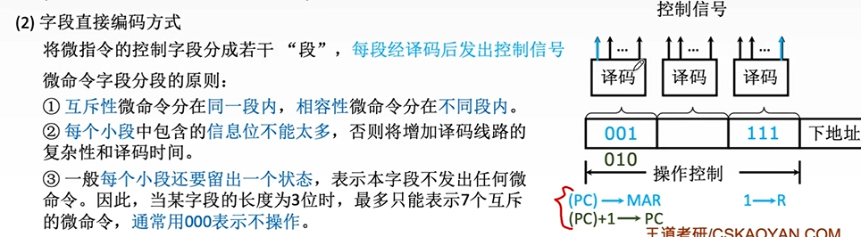

这样互斥的指令永远不会同时发出，相容性微命令可以并行发出

优点：**可以缩短微指令的字长**

缺点：每个字段都要经过译码电路再发出微命令，**比直接编码方式慢**


##### 字段间接编码方式

一个字段的某些微命令，需要由另一个字段中的某些微命令来解释，而不是靠字段直接译码发出的微命令，所以叫字段间接编码，又称隐式编码

也就是某个字段译码后，不直接发出，还要交给下一级译码器处理，才能发出控制信号

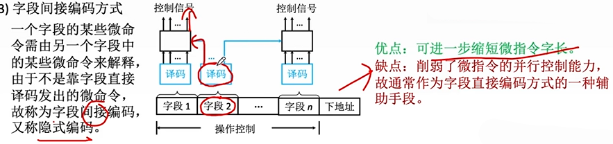

优点：**可以进一步缩短微指令字长**

缺点：**削弱了微指令的并行控制能力**，所以一般作为直接编码方式的辅助手段


#### 微指令的地址形成方式

- 由微指令的**下地址字段**指出

  微指令格式中设置一个下地址字段，由微指令的下地址字段直接指出后继微指令的地址，这种方式又称为**断定方式**

- 根据机器指令的**操作码**形成

  当机器指令取至指令寄存器后，微指令的地址由操作码经**微地址形成部件**形成

- 增量**计数器法**

  (CMAR)+1 -> CMAR，有点像PC

- 分支转移

  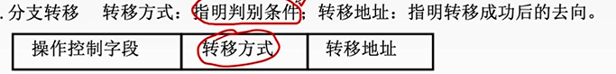

  转移方式是指判别条件；转移地址是转移成功后的去向

  有点像JMP或者条件转移指令

- 通过测试网络

  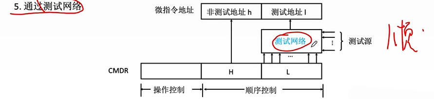

  测试网络就是内部的一个电路，根据顺序逻辑接收到的标志信息和当前微指令的信息进行判断地址

- 由硬件产生微程序入口地址

  **第一条微指令地址** 由专门的**硬件**产生(用硬件记录取指周期的微程序首地址)

  中断周期 由**硬件**产生**中断周期微程序首地址**(专用的硬件记录地址)


### 微程序控制单元的设计


#### 设计步骤

1. 分析指令每个阶段的微操作序列

   > 这一步与硬布线控制器的一模一样，都是分析每个阶段需要的微操作

2. 写出对应机器指令的微操作命令及节拍安排

   > 这个原理也和硬布线很相似
   >
   > 设计原则：微操作按序、可并行的并行，短的也放一起
   >
   > 但是在设计完成后有所不同
   >
   > 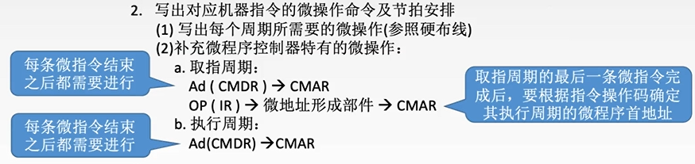
   >
   > 首先是每一个节拍看作是一个微指令，每**个微指令之间都需要通过CMAR寻址一次**即$Ad(CDMA) \to CDMA$，指明下一微指令的地址，这**会额外占用一个节拍**
   >
   > 在最后一个节拍的最后，硬布线是把操作码交给**指令译码器ID**
   >
   > 而微程序控制器是把操作码交给**微地址形成部件**
   >
   > 即$OP(IR) \to 微地址形成部件 \to CMAR$ ，用于进入下一个周期
   >
   > 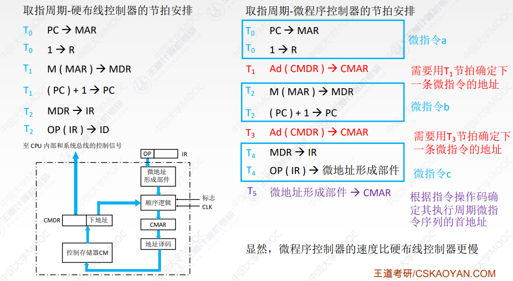

3. 确定微指令格式

   > 在微指令设计部分讨论过了
   >
   > 主要包括微指令采用何种编码，确定微指令*操作控制*字段的位数
   >
   > 根据CM中存储的微指令总数，确定微指令的*顺序控制*字段的位数
   >
   > 从而确定微指令字长
   >
   > 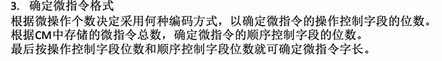

4. 编写微指令码点

   > 根据操作控制字段代表的微操作，编写微指令的码点
   >
   > 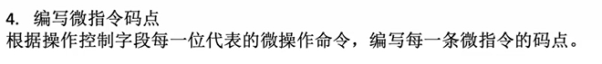


#### 微程序设计的分类

1. 静态微程序设计和动态微程序设计

   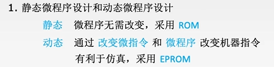

2. 毫微程序设计

   毫微程序设计就是用*毫微程序*解释*微程序*

   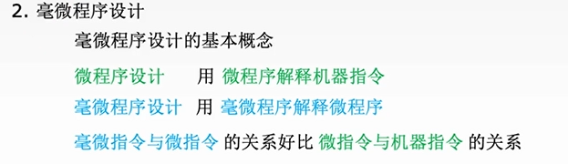


#### 硬布线控制器与微程序控制器的比较

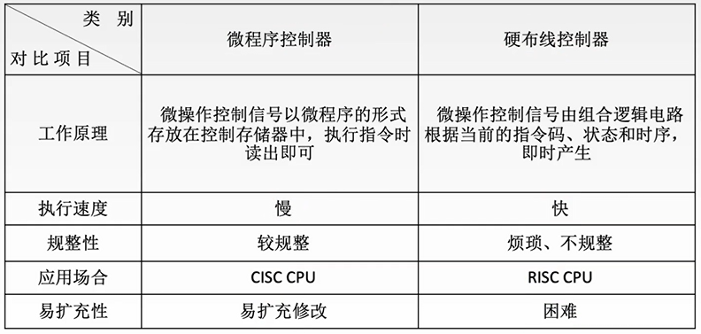

微程序控制器：是把微操作控制信号以微程序的形式**存放在控制存储器中**，执行指令时读出即可

硬布线控制器：把微操作控制信号由组合逻辑电路根据当前的指令码、状态和时序**即时产生**

硬布线比微程序执行速度快

微程序比硬布线更规整

微程序主要用于CISC，硬布线用于RISC

微程序更易扩充


## 异常和中断机制

由CPU内部产生的意外事件称为**异常**，也叫**内中断**

> 异常是在CPU内部检测到的、**与正在执行的指令相关**的同步事件
>
> 若在**执行第i行指令时**，检测到异常，则CPU打断当前程序，转去执行相应的异常处理程序，若异常处理程序可以解决，在处理程序结束后，执行异常返回指令，则重新回到该程序，**再执行第i行**
>
> 若处理程序发现是不可恢复的致命错误，则终止程序。

由来自CPU外部的的设备向CPU发出的中断请求被称为**中断**，也叫**外中断**

> 中断是由外部设备触发的、**与当前执行的指令无关**的异步事件
>
> 若在**第i行指令结束后**(由于中断检测只在指令结束后才检测)，发现一个中断请求信号，则CPU打断当前程序，转去执行相应的中断处理程序，若中断处理程序可以解决，在处理程序结束后，执行中断返回指令，重新回到该程序，**执行第i+1行**
>
> 若处理程序发现是不可恢复的致命错误，则终止程序。

可以发现异常和中断处理的过程其实很相似


### 异常的分类

异常是CPU内部产生的意外事件，分为**硬故障中断**和**程序性异常**

> **硬故障中断**是**硬连线出现异常**引起的。因为它在CPU内部，而且是由指令执行时发现的，所以属于异常
>
> 如：存储器校验错、总线错误等
>
> 
>
> **程序性异常**，也叫**软件中断**，是指**因执行指令引起的异常事件**
>
> 如：整除0、溢出、断点、单步跟踪、非法指令、栈溢出、地址越界、缺页等


如果按照异常发生的原因和返回方式分类，可分为：故障、自陷、终止

#### 故障Fault

在指令执行过程中检测到的异常事件

如：指令译码发现非法操作码、取数据发现缺页缺段、除法发现除数为0等

对于缺页缺段，**处理后可继续执行**，**则返回该指令**继续执行

对于非法操作码、除数为0等，**无法**通过异常处理程序**恢复故障**，所以**直接终止程序**

#### 自陷Trap

是预先安排的一种异常

CPU在执行完自陷指令后，会根据不同的自陷指令进行相应处理，然后**返回到自陷指令的下一行**继续执行

（当自陷指令是跳转时，跳转后就不会回到源程序了）

#### 终止Abort

执行指令过程中发生了**硬件故障**，

如控制器出错、存储器校验错、总线错误等

则**直接终止**

这种错误与故障和自陷不同，不是特定指令发生的，而**是随机产生的**


### 中断的分类

中断是来自**CPU外部**，**与CPU执行指令无关的事件**引起的中断

包括IO设备发送的IO中断(打印机缺纸、键盘输入)，或其它特殊事件(用户强制关闭、定时器到时间)等

> 外部设备通过特定的**中断请求信号线**向CPU发出中断请求
>
> CPU**每执行完一条指令，检测一次中断信号**，如有则进入中断响应周期


#### 可屏蔽中断

可以通过中断控制器设置屏蔽这些中断

#### 不可屏蔽中断

通常是非常紧急的硬件故障，如电源掉电等。不可屏蔽


****

> 故障和自陷属于**程序性异常**(**软件中断**)
>
> 终止和外中断属于**硬件中断**
>
> (终止属于异常)

中断和异常本质上是一样的，但是有所不同

> 异常是在指令执行过程中产生的，而中断和指令无关
>
> 异常的检测由CPU自身完成。中断必须通过外部的中断请求线获得
>
> 无论中断还是异常，都是硬件检测发现的


### 异常和中断的响应过程

异常和中断响应分为三部分，分别是：关中断、保存断点和程序状态、识别异常和中断 并转到相应的处理程序

1. #### 关中断

   保存断点和程序状态时不能被新的中断打断，所以要**停止响应新的中断**

2. #### 保存断点和程序状态

   将**程序的断点**和**程序状态字寄存器PSW的值**保存在栈或特定寄存器中

3. #### 识别异常和中断并转到相应的处理程序

   通过**软件识别方式**或**硬件识别方式**判断当前中断或异常的类型，并传入对应的处理程序

整个响应过程是**不可被打断**的。

中断响应结束后，就开始执行中断响应程序，直到中断返回。


## 指令流水线

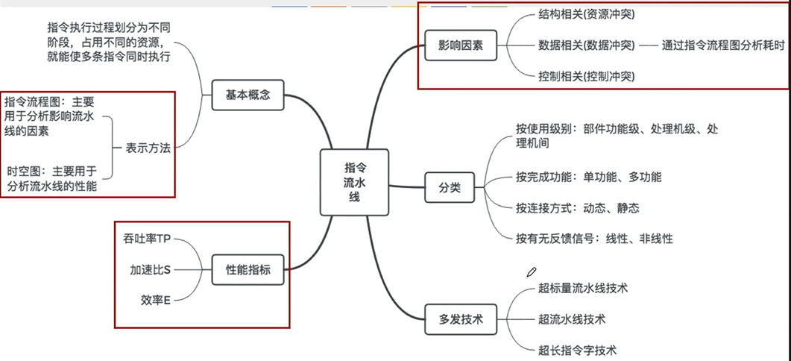

### 指令流水线的基本概念

一条指令的执行过程可以分成多个阶段，根据计算机不同分法可能不同，但大致是：取指+分析+执行

假设这三个阶段执行时间都为t，则以下执行方式执行n条指令的时间分析如下

1. 顺序执行方式
   $$
   T=n\times 3t = 3nt
   $$
   传统冯诺依曼机就采用这种方式，也成为**串行执行方式**

   控制简单，硬件代价小，但是部件利用率低，执行慢

   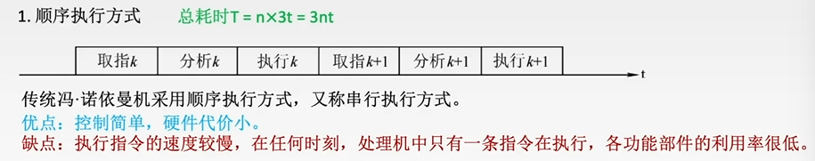

2. 一次重叠执行方式
   $$
   T=3t+(n-1)\times 2t = (1+2n)t
   $$
   时间缩短了1/3，利用率提高了

   但是硬件更复杂

   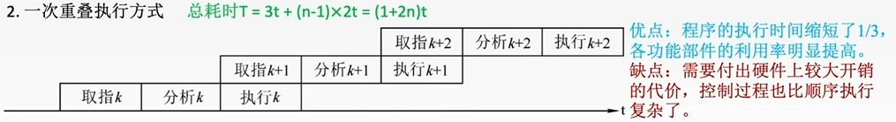

3. 二次重叠方式
   $$
   T=3t+(n-1)\times t = (2+n)t
   $$
   更快了，同一时刻处理器最大同时执行3条指令

   当分的阶段变大，重叠的更多时，效率会更高

   实际上一般分为5个阶段，假设分为x阶段，重叠x-1
   $$
   T=xt+(n-1)t=(x-1+n)t
   $$
   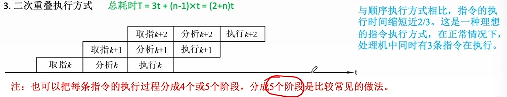


#### 流水线的表示方法

1. 指令执行过程图

   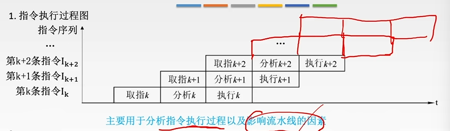

2. 时空图

   横坐标表示时间，纵坐标表示执行阶段，斜着的代表同一个指令

   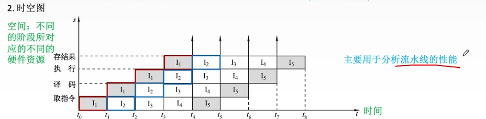


#### 流水线的性能指标

##### **吞吐率TP**

单位时间内流水线所完成的任务数量，或者结果输出数量

一般就是用**单位时间完成的任务数量**表示

设任务数量为n、完成n个任务的时间为$T_k$

则计算流水线**吞吐率TP**的公式为 
$$
TP = \frac{n}{T_k}
$$

> **理想状况下**的时空图如下
>
> 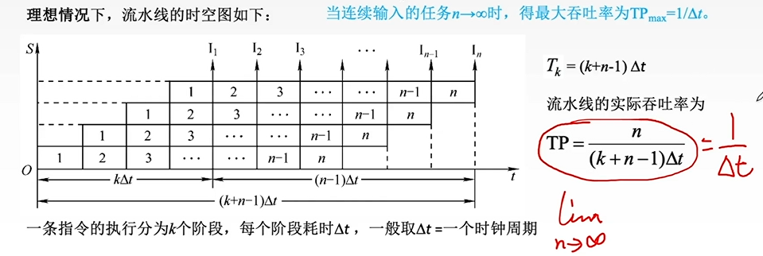
>
> I1之前叫做装入时间，I3之后叫做排空时间
> $$
> TP = \frac{n}{(k+n-1)\Delta t}
> $$
> 当n很大时，TP就接近于$\frac{1}{\Delta t}$ 其中$\Delta t$一般取一个时钟周期，这是在最理想情况下的值

##### **加速比S**

完成同一批任务，**不使用**流水线和**使用**流水线所用**时间的比值**

假设不用流水线的时间为$T_0$使用流水线的时间为$T_k$，则
$$
S= \frac{T_0}{T_k}
$$

> 上面那个例子的实际加速比S为
> $$
> S = \frac{kn\Delta t}{(k+n-1)\Delta t} = \frac{kn}{(k+n-1)}
> $$
> 所以当n很大时，$S_{max} = k$

##### **效率**

流水线**设备的利用率**称为流水线的效率

在时空图中比较方便计算，就是完成n个任务占用的时空区**有效面积**与n个任务所用时间和k个流水线所围时空区**总面积之比**

> 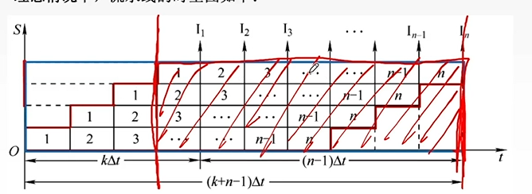

所以流水线效率R的公式为
$$
E = \frac{n个任务占用的时空区有效面积}{个任务所用时间和k个流水线所围时空区总面积} = \frac{T_0}{kT_k} = \frac{n}{k+n-1}
$$
($T_0$是指不用流水线的时间，也就是摊平了；$kT_k$是指有效的面积(方格数))

当n很大时$E_{max} = 1$ 


#### 指令机器周期的设置

大多数都采用**MIPS的五个周期**，就算有些指令不执行某些周期，也要等待这个周期结束才能下一个周期

为了便于设计，会将每个周期的耗时都相同，**以最长耗时为准**

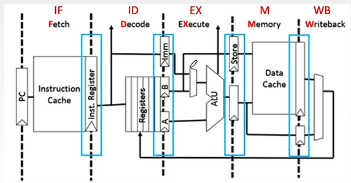

**每个功能段间都需要有**缓存寄存器，也叫**锁存器**，这是为了暂存本功能段的结果，等到对应的时间再输出给下一段

1. **取指令IF**

   通过PC的值去访存获取指令，由于Cache的命中率很高，所以一般是去**Cache取指令**

   把取到的指令存入锁存器

   > 这个与第4段访存访问的Cache不一样，这是**指令Cache**，那是**数据Cache**，所以它们之间不会冲突，可以并行
   >
   > (但是也可能会不命中，只能访问主存，这时流水线会断流)

2. **指令译码ID**

   对于RISC的指令集，所有指令的操作数都**必须来自寄存器**，若不在需要去访存存入寄存器

   根据指令译码结果，把指令中的操作数放入锁存器，供执行阶段使用

3. **执行阶段EX**

   执行阶段把译码阶段的操作数**通过ALU进行处理**，把结果放入锁存器中

   等下一阶段使用，可能会存入Cache，也可能等到WB直接写回

4. **存储M**

   根据指令要求选择是否存入Cache

5. **写回WB**

   根据要求选择是否写回到通用寄存器

   > 本阶段会进行写操作，而第二阶段会进行读操作，这两步同时进行就可能会出现一些冲突


### 指令流水线的影响因素

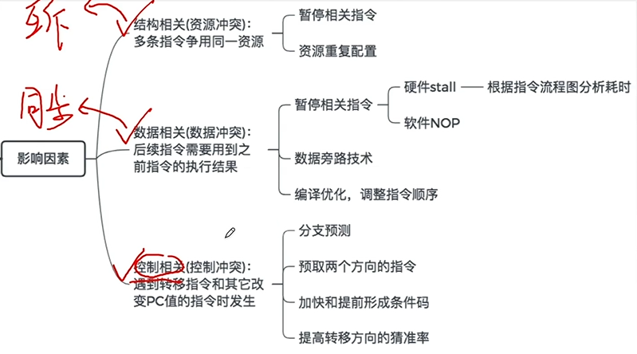

#### 结构冒险(结构相关、资源冲突)

由于多条指令在**同一时刻争用同一资源**而形成的冲突，称为结构相关

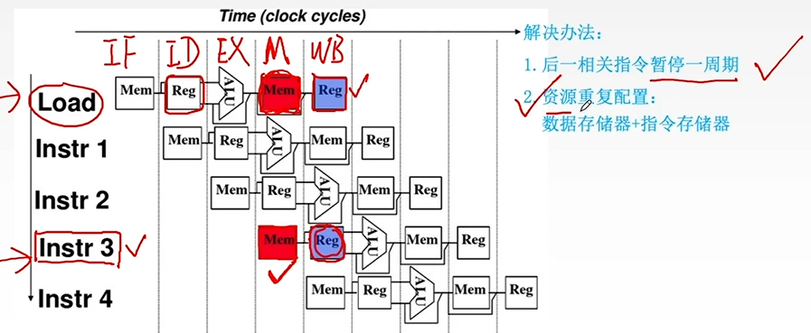

同时访存或者同时访问寄存器就会导致资源冲突

两种解决办法：

1. 让**后一个指令暂停一个周期**
2. 资源重复配置：把**指令和数据存放在不同的存储器**，这样IF和M、ID和WB就不会冲突了

#### 数据冒险(数据相关、数据冲突)

数据相关指的是，在一个程序中，存在**必须等前一条指令执行完，才能执行后一条指令**的情况，那么这两条指令即为数据相关

**在按序执行的流水线中，只会出现写后读RAW冲突**

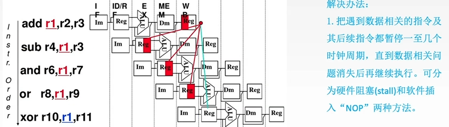

这个例子中，中间3条指令都会与第一条指令产生数据冲突，但是最后一条不会，因为它在指令译码阶段时，r1已经写回了

**解决办法：**

1. **等待**

   等到数据不会冲突了，再执行后续指令

   > 分为硬件阻塞(stall)和软件插入NOP两种方法
   >
   > 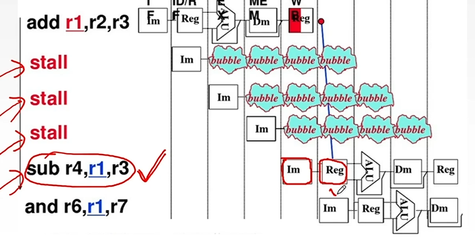
   >
   > 硬件阻塞由**硬件添加气泡(bubble)**进行等待
   >
   > 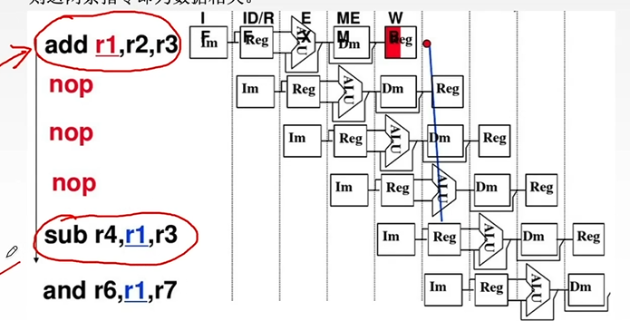
   >
   > 在编译阶段，若发现数据冲突，则在之间**插入空操作nop**，直到不发生冲突

2. **数据旁路技术(转发机制)**

   不从寄存器中读取，之间提前获取前面计算后的需要的值

   > 增加电路，可以直接让ALU的结果送入ALU的输入
   >
   > 

3. **编译优化**

   通过编译器调整指令顺序来解决数据冲突

   > 与空操作比较像，是把后面与这些不冲突的指令先执行，等数据不冲突

   

#### 控制冒险(控制相关、控制冲突)

当流水线遇到转移指令或其它改变PC值的指令二操作断流时，会引起控制相关

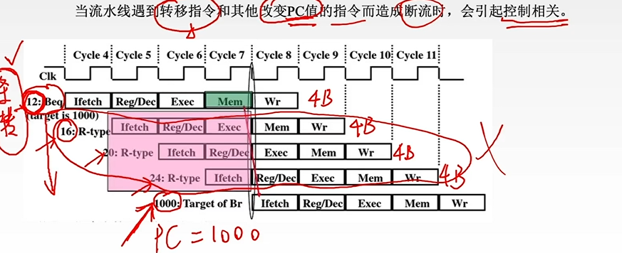

除了转移指令，如函数调用，中断都可能引起控制冲突

>**后续指令必须等转移指令得出结果后才能判断是否执行，所以在转移指令得到结果前(MEM之前)一定是要被阻塞的**

下面主要讨论转移指令的解决办法：

1. 转移指令分支预测

   > 简单预测：永远猜ture或永远猜false
   >
   > 动态预测：根据历史情况动态调整

2. 预取转移成功和不成功两个控制流

   提前把两种情况的指令都提前取出，会让硬件变复杂

3. 加快和提前形成控制码

   进行电路改造，让条件码提前产生

4. 提高转移方向的猜准率

   对第一种方法的优化


### 指令流水线的分类

1. **部件功能级**、**处理机级**和**处理机间级**流水线

   > 根据**流水线使用的级别不同**，流水线可分为部件功能级流水线、处理机级流水线、处理机间级流水线
   >
   > **部件功能级流水线**：把**某个部件细分**进行流水线，如在ALU执行浮点数加法操作时，将其细分成求阶差、对阶、尾数相加、结果规格化这4个子过程，四个子过程的电路不同，将其进行流水线化
   >
   > **处理机级流水线**：就是前面讲的把一个指令分为多个子过程，如取指、译码、执行、访存、写回这些。是在**同一个处理机内**进行的流水线
   >
   > **处理机间流水线**：每一个处理机完成某一个专门任务，各个处理机得到的结果，需要存放在与下一个处理机所共享的存储器中

2. **单功能流水线和多功能流水线**

   > 按照流水线可完成的**功能分类**
   >
   > **单功能流水线**：只能实现一种固定的专门功能的流水线
   >
   > 多功能流水线：通过内部的不同连接方式。可以同时或者不同时的**实现多种功能**的流水线，如指令流水线

3. **动态流水线和静态流水线**

   > 按**同一时间内，各段之间的连接方式**分类
   >
   > 静态流水线：在同一时间，只能有**一种连接方式**来工作
   >
   > 动态流水线：同一时间可以有**多种连接方式**，也就是在同一时间可以进行完全不同类型的运算
   >
   > 注意和功能分类区分

4. **线性流水线和非线性流水线**

   > 按照各个**功能段之间有没有反馈信号**分类
   >
   > 线性流水线：每个功能段只允许经过一次，没有反馈电路
   >
   > 非线性流水线：存在反馈电路，**某些功能段可以多次返回通过**流水线，这种适合进行线性递归运算递归(如解决数据冲突的数据旁路技术)


### 流水线的多发技术

#### 超标量技术

本质是空间换时间

每个时钟周期可以**并发**   **多条独立指令** 

要配置多组功能部件

**不能调整指令的执行顺序**

得通过编译优化技术，把可并行的指令搭配起来，放在一起

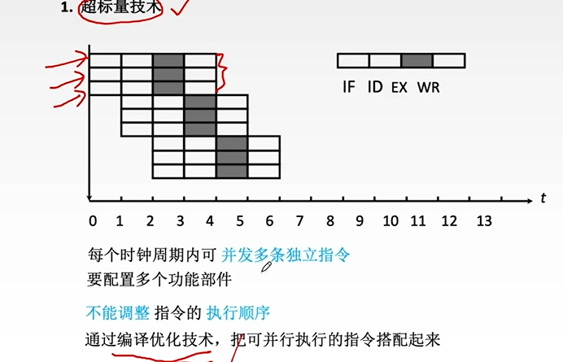

#### 超流水技术

本质是时间换空间

在一个周期内**再进行分段**，一个周期**同一个部件使用多次**

**不能调整指令的执行顺序**

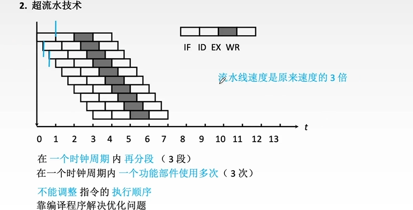

流水线的速度会提高，但是需要进行编译优化，把可并行的放在一起

#### 超长指令字

编译程序发现指令间可以并行

那就把多条可**并行操作**的指令**组合成**有多个操作码字段的**超长指令字**

所以**需要有多个相互独立的处理部件**

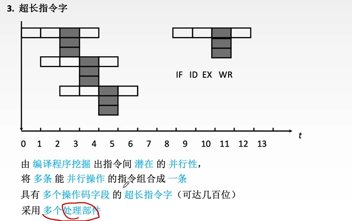


### 五段式指令流水线


不同指令不一定都有这五个阶段，但是无论有没有，时间都是要花费的

下面介绍5种类型的指令

#### 运算类指令

> 这里的指令格式是MIPS，与之前的X86有所不同，源操作数在前，目的操作数在后
>
> 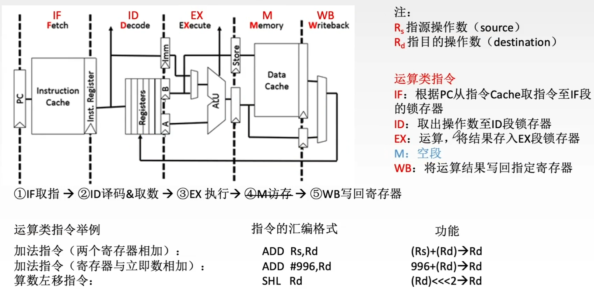
>
> **运算类指令没有访存阶段**

1. **IF取指**

   > 根据PC把指令从Cache，**取到IF段的锁存器**

2. **ID译码以及取数**

   > 取出操作数，**放到ID段的锁存器**
   >
   > 如果有立即数，会放到Imm，其它的就放到A或B

3. **EX执行**

   > ALU根据指令计算，把结果**存入EX段的锁存器**

4. **~~M访存~~** 

   > **空段**

5. **WB写回**

   > 将结果**写回指定寄存器**

#### LOAD取数指令

> 注意 LOAD Rd，996(Rs)   是指把主存Rs+996处的地址存入Rd，其实就是基址寻址
>
> 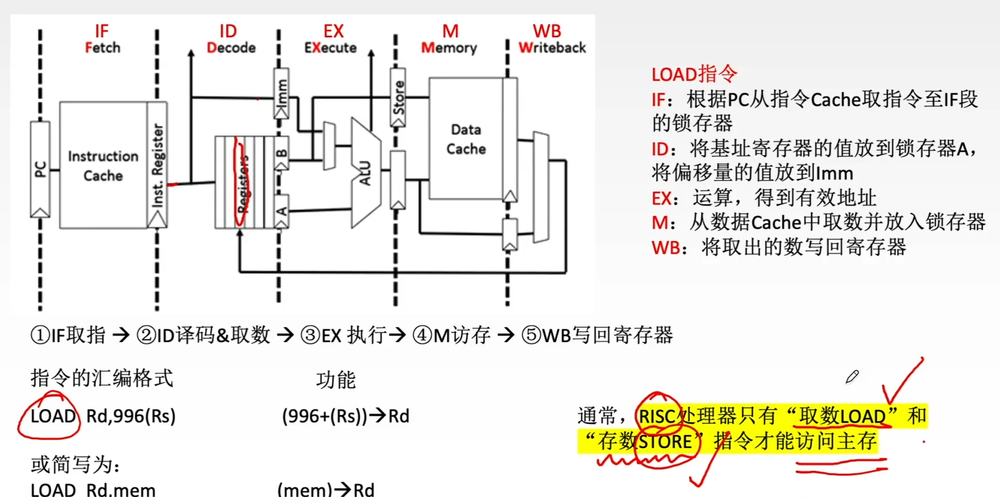

1. **IF取指**

   > 根据PC把指令从Cache，**取到IF段的锁存器**
   >
   > 这一步所有指令都一样

2. **ID译码以及取数**

   > 把**基址寄存器的值放到锁存器A**，将**偏移量放入Imm**

3. **EX执行**

   > 把上一阶段的地址进行计算，**得到有效地址**

4. **M访存**

   > 根据有效地址从Cache中**取数**，并且**放入M段的锁存器**

5. **WB写回**

   > 将取出的数**写回指定寄存器**


#### STORE存数指令

> 格式与LOAD很相似，如 STORE Rs，996(Rd)，会把Rs的数据存入主存的(996+Rd)位置
>
> 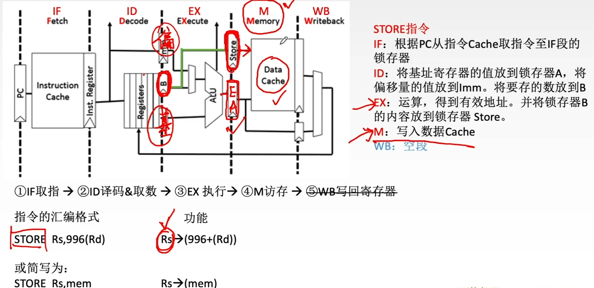
>
> **不需要写回**

1. **IF取指**

   > 根据PC把指令从Cache，**取到IF段的锁存器**
   >
   > 这一步所有指令都一样

2. **ID译码以及取数**

   > 把**基址寄存器的值放到锁存器A**，将**偏移量放入Imm**
   >
   > 把**要存的数，放入锁存器B**

3. **EX执行**

   > 把上一阶段的地址进行计算(A+Imm)，**得到有效地址**
   >
   > 并将锁存器**B放入锁存器Store**
   >
   > 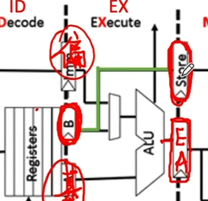

4. **M访存**

   > 写入数据Cache

5. **~~WB写回~~**

   > 空段


#### 条件转移指令

> 转移类的指令一般采用**相对寻址**，相对于PC跳转多少(向前或向后)
>
> 指令格式一般前两个是条件，最后一位是立即数，代表相对偏移
>
> 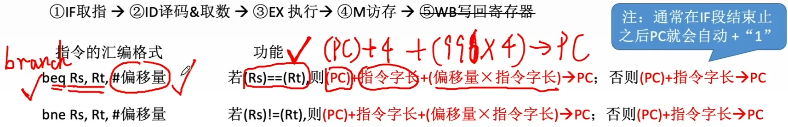
>
> 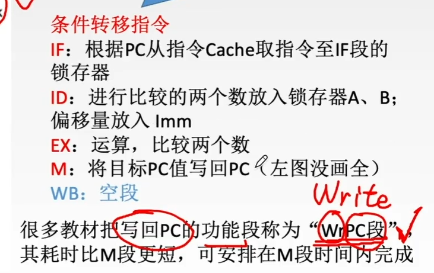
>
> **不需要写回**

1. **IF取指**

   > 根据PC把指令从Cache，**取到IF段的锁存器**
   >
   > 这一步所有指令都一样

2. **ID译码以及取数**

   > 把要比较的两个操作数放入锁存器A、B，偏移量放入Imm

3. **EX执行**

   > 运算A与B的值，进行比较

4. **M访存**

   > 不进行访存，而是
   >
   > 根据EX运算结果，**把PC的值修改成对应的值**
   >
   > 也会把写回PC称为**WrPC段**，耗时比M更短，所以可以安排在这里执行

5. **~~WB写回~~**

   > 空段


#### 无条件转移指令

> jmp #偏移量   也是相对寻址
>
> 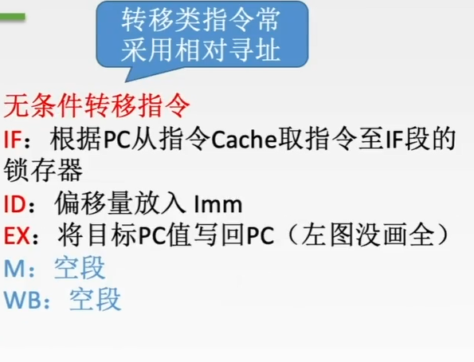


1. **IF取指**

   > 根据PC把指令从Cache，**取到IF段的锁存器**
   >
   > 这一步所有指令都一样

2. **ID译码以及取数**

   > 偏移量放入Imm

3. **EX执行**

   > 把目标PC值写回PC
   >
   > 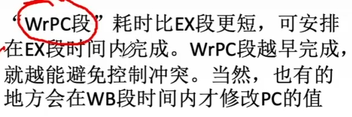
   >
   > 这是为了尽量**避免控制冲突**

4. **~~M访存~~**

   > 空段

5. **~~WB写回~~**

   > 空段


## 多处理器的基本概念


### SISD、SIMD、MISD、MIMD的概念

Single、Instruction、Multiple、Data

#### 单指令流单数据流结构SISD

仅包含一个处理器和一个存储器，按指令流规定顺序串行执行指令

为了加速使用流水线，所以会设置多个部件、采用多模块交叉方式组织存储器

**可以并发，不能并行**

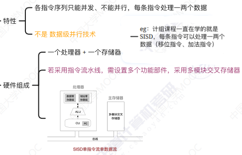

#### 单指令流多数据流结构SIMD

一个指令流同时对多个数据流进行处理

也就是多个处理单元同时使用同一条指令，处理不同的数据

这是因为每个处理单元都有专用的地址寄存器

**对指令来说可以并发，不能并行，但是可以同时处理很多数据，可以看作是数据的并行**

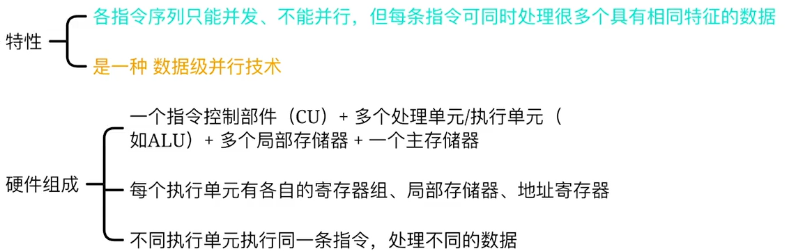


#### 多指令流单数据流结构MISD

多条指令处理一条数据，实际上并不存在


#### 多指令流多数据流结构MIMD

同时执行多条指令，分别处理不同数据。

指令序列**可以并行**，而且是线程级甚至进程级并行

分为**多计算机系统**和**多处理器系统**

多计算机系统的**私有存储器不可互相直接访问**，而是**通过消息传送**来进行数据传送。也叫**消息传输MIMD**

多处理器系统是共享存储多处理器(SMP)系统的简称，可通过存取指令直接访问所有存储器，也称**共享存储MIMD**

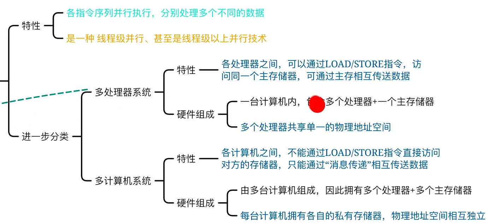

#### 向量处理器

向量处理器是**SIMD的变体**，实现了直接操作一维数组指令集的CPU

可以说是数据并行

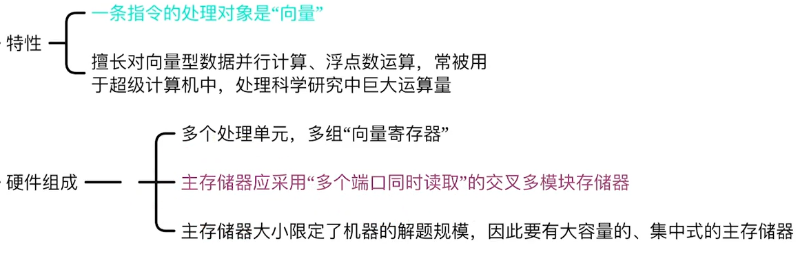


### 硬件多线程的基本概念

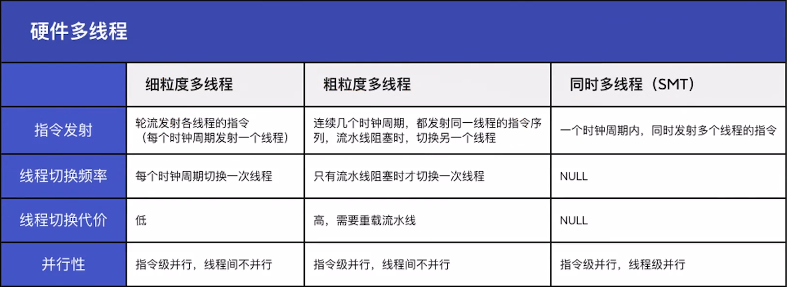


> 不支持硬件多线程的处理器：只有一个IR和PC，同时只能并行一个线程
>
> 线程间切换需要保存和恢复线程运行环境数据，耗时很多
>
> 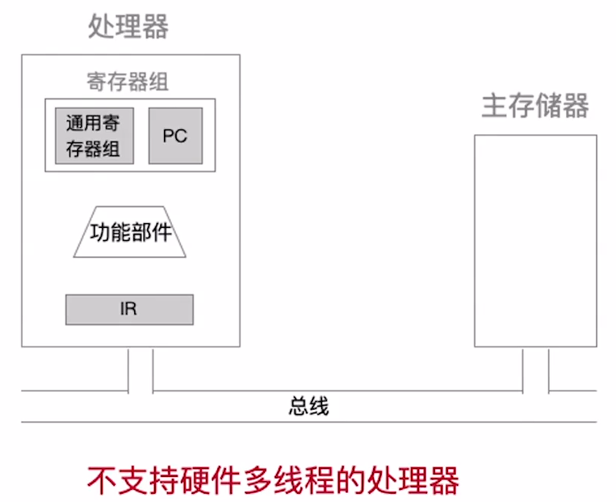
>
> 支持硬件多线程的处理器：有多个IR和PC
>
> 
>
> 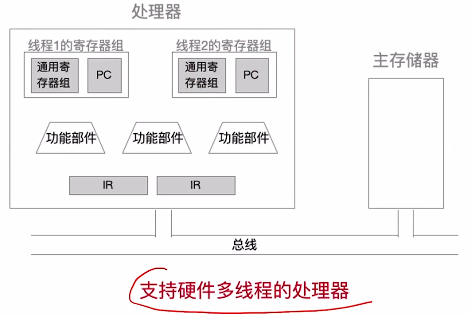


#### 细粒度多线程

轮流发射各个线程的指令，每个周期都切换一次线程

**指令级并行，线程间不并行**

#### 粗粒度多线程

连续几个周期都发送同一个线程的指令，直到当前流水线线程被阻塞才切换另一个线程

线程切换时需要重载流水线

**指令级并行，线程间不并行**

#### 同时多线程SMT

一个时钟周期内，同时发射多个线程的指令

**指令级并行，线程间并行**


### 共享内存多处理器的基本概念

具有共享的单一物理地址的多处理器被称为共享内存多处理器SMP

整个系统共享物理地址，但处理器还是能在自己的虚拟地址空间单独的运行程序

**统一存储访问(UMA)多处理器**：每个处理器对所有存储单元的访存**时间是相同**的

**非统一存储访问(NUMA)多处理器**：每个CPU分为自己直连的本地内存和其它CPU的远程内存，**访问不同内存的时间不同**

会出现多个CPU访问共享变量，所以要对数据上锁

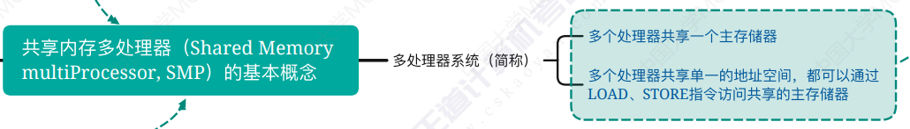

### 多核处理器的基本概念

把多个**处理单元**集成到一个CPU上，每个处理单元称为一个核，也叫做片**上处理器**

想充分发挥性能必须采用多线程执行，它是真正意义上的**物理并行**


# 总线


## 总线概述


### 总线的基本概念

总线是一组能为多个部件分时和共享的公共信息传送线路。

**分时**和**共享**是总线的两个特点

分时：同一时刻只允许一个部件向总线发送信息

共享：总线上传递的信息，所有连接的部件都能读取


#### 总线的特性

机械特性、电气特性、功能特性、时间特性


#### 总线设备

主设备：指**发出总线请求**且获得**总线控制权**的设备

从设备：**被主设备访问的设备**，他**只能响应**主设备发来的总线命令

### 总线的分类


#### 按数据传输方式分类

- **串行总线**：每次只能传输1位数据

  只需要1根传输线，成本低，抗干扰能力强，主要**应用于长距离传输**，在计算机内部可以节省布线空间

  但是在数据发送和接收时要进行拆卸和装配，也**要考虑串并行转换**

- **并行总线**：每次可以传输多位数据

  总线逻辑时序简单，电路实现冗余

  但是信号线越多，占用布线空间越大；远距离传输成本高；当工作频率高时，信号线之间会产生严重干扰，所以说速度有上限，**不一定比串行快**

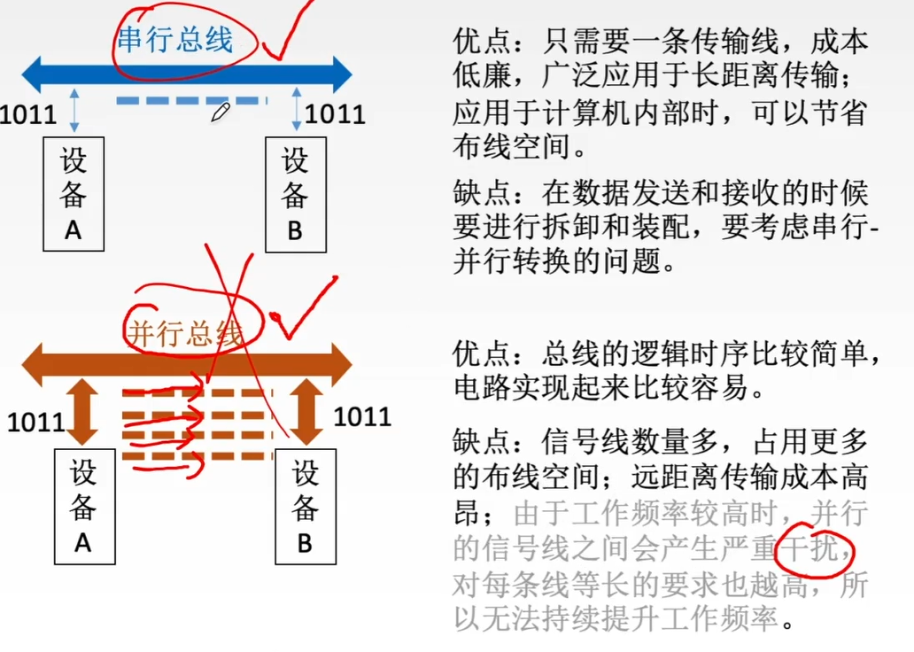

#### 按时序控制方式分类

- **同步总线**：总线上连接的部件通过统一的时钟周期同步，按照节拍进行规定的总线操作
- **异步总线**：总线上的设备没有统一的时钟，以信号握手来协调信息传输，操作时序不固定

#### 按总线功能分类

- **片内总线**

  是**芯片内部的总线**，主要是CPU内部寄存器之间、寄存器与ALU之间的连接线

- **系统总线**

  是计算机系统内各功能部件(CPU、主存、I/O接口)之间相互连接的总线

  > 又可分为传输信息的内容不同，分为数据总线、地址总线和控制总线
  >
  > 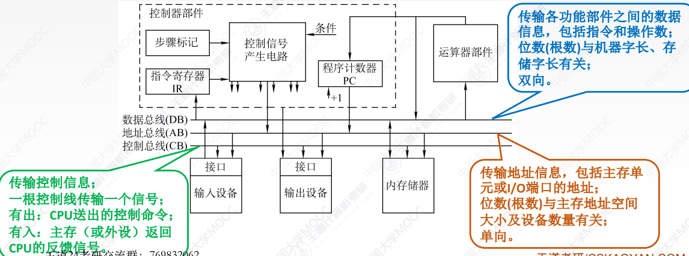
  >
  > #### 数据总线DB
  >
  > 传输各功能部件间的**数据信息**，包括指令和操作数
  >
  > **位数与机器字长、存储字长有关**
  >
  > (若和机器字长一致，读取CPU一次处理的数据只需要一次
  >
  > 若和存储字长一致，主存读写操作只需要传送一次)
  >
  > **传送方向是双向的**
  >
  > >数据总线与数据通路是两个概念
  > >
  > >数据通路是各个功能部件通过数据总线连接形成的数据传送路**径**，包括部件
  > >
  > >数据总线只是数据传输的**媒介**
  >
  > #### 地址总线AB
  >
  > 传输地址信息，除了主存单元地址，还包括I/O端口的地址
  >
  > **位数与主存地址空间大小和设备数量有关**(因为一个设备至少也占一个地址)
  >
  > **传送方向是单向的**
  >
  > 
  >
  > #### 控制总线CB
  >
  > **一根控制线传送一个控制信号**，对每**一根控制线来说**都是**单向**传送的
  >
  > 但是有的数据线会从CPU**发出**：CPU送出的控制命令
  >
  > 有的会**接收**：主存或外设返回的CPU反馈信号
  >
  > 

- **I/O总线**

  主要连接中低速的I/O设备，通过IO接口与系统总线相连接，目的是将**低速设备和高速总线分离，提高总线的系统性能**

- **通信总线**

  用于连接各个计算机系统的，如网线，也叫*外部总线*

### 系统总线的结构


#### 单总线结构

计算机内部**只有一组系统总线**(包括数据、地址、控制)

CPU、主存、I/O设备**都连接在一组总线**上，允许I/O设备之间或和主存或CPU直接交换信息

**优点**：**结构简单，成本低，易于接入新设备**

**缺点**：**带宽低、负载重**。多个部件只能**争用唯一的总线**，**不支持并发(并行)传送**。外设传送慢，性能浪费


#### 双总线结构

有两组总线，一条是主存总线，用于CPU、主存、通道间的数据传送

另一条是I/O总线，用于外部设备与通道进行数据传送

> 通道是有特殊功能的处理器，对I/O设备进行统一的管理，通道程序放在主存中

**优点**：把较低速的I/O设备从单总线分离出来，**实现存储器总线和I/O总线的分离**

**缺点**：需要增加通道等硬件设备


> **支持突发传送(猝发传送)**：送出一个地址，主存能传送回来**多个连续地址**的数据


#### 三总线结构

分为三组各自独立的总线，分别是主存总线、I/O总线、直接内存访问DMA总线

> DMA总线：将主存与高速外设直接相连，快速传输数据，而不用通过慢速的I/O总线

**优点**：提高了I/O设备的性能，更快的响应命令，**提高系统吞吐量**

**缺点：**系统工作效率较低，因为同一时刻只能有一组总线工作


### 总线的性能指标

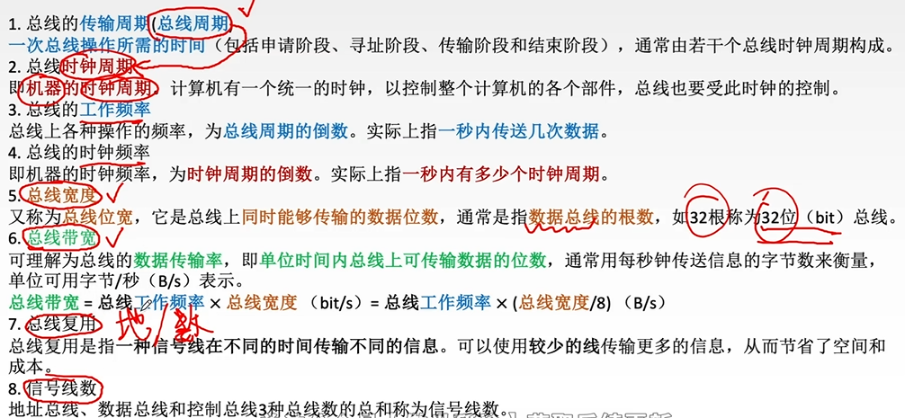

- 总线的**传输周期（总线周期）**

  一次总线操作所需的时间(包括**申请阶段**(总线仲裁)、**寻址阶段**、**传输阶段和结束阶段**)，通常由若干总线时钟周期组成(但是也能一个总线时钟周期包含2个传输周期)。(假设总线宽度是32位，则一个总线周期结束，就传递了32位数据)

- **总线的时钟周期**

  通常就是机器的时钟周期

  > ### 总线周期和总线时钟周期的关系
  >
  > 关系不太确定
  >
  > 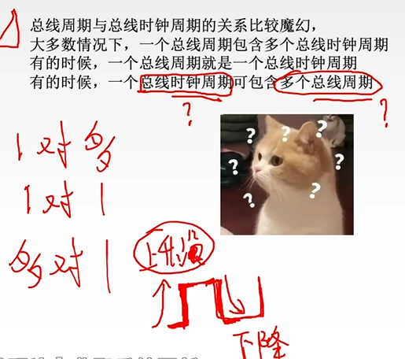
  >
  > 现代的总线时钟周期也有可能是桥接器提供的

- 总线的**工作频率**

  是总线周期的倒数

- 总线的**时钟频率**

  是总线时钟周期的倒数

- **总线宽度**

  也叫总线的位宽，是总线上能同时传输的数据位数

- **总线带宽**

  单位时间内总线上课传输的数据的位数
  $$
  总线带宽= 总线工作频率\times 总线宽度(bit/s)=\frac{总线宽度}{总线周期}(bit/s)
  $$
  是总线本身能达到的**最高传输速率**

  > 例题
  >
  > 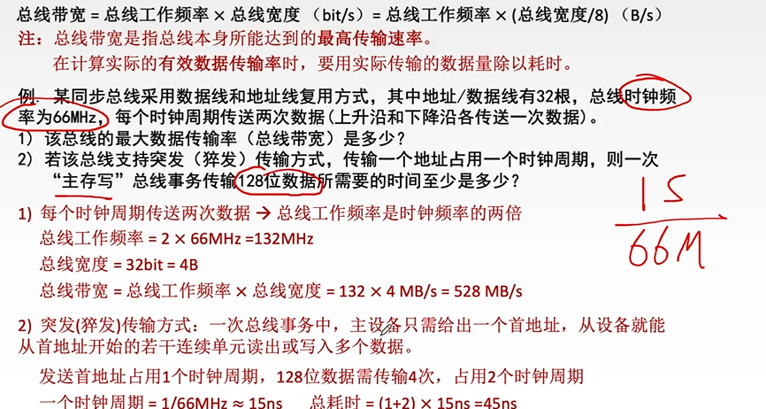
  >
  > 串行总线和并行总线
  >
  > 

- **总线复用**

  **一种信号线在不同时间传输不同的信息**

  可以节省空间和成本

- **信号线数**

  地址总线+数据总线+控制总线的总根数

## 总线事务和定时

总线仲裁部分已删去，简单来说就是通过集中仲裁或者分布仲裁选定哪个设备使用总线

### 操作和定时

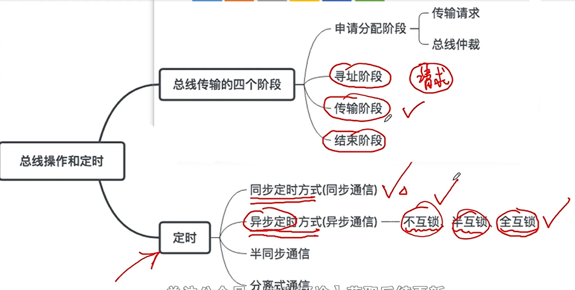

占用总线的一对设备如何进行数据传输

#### 总线周期的四个阶段

1. **申请分配阶段**：由需要使用总线的主模块提出申请，经过仲裁，决定把总线的使用权交给申请者。也可以细分成**传输请求**和**总线仲裁**两个阶段
2. **寻址阶段**：获得使用权的**主模块**通过总线发出本次要访问的从模块的**地址**和有关**命令**，**启动**参与本次传输的**从模块**
3. **传输阶段**：主模块和从模块进行**数据交换**，可以单向也可以双向
4. **结束阶段**：主模块的**有关信息**均从系统总线上**撤除**，让出总线使用权


#### 总线定时


> **总线定时**是指总线在双方**交换**数据**过程中**需要时间上配合关系的控制，这种控制称为总线定时，它的本质是一种**协议**

总线定时包括**同步通信(同步定时方式)、异步通信(异步定时方式)、半同步通信、分离式通信**

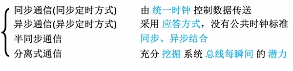

##### 同步定时方式

系统采用**统一的时钟信号**来协调发送和接收双方的传送定时关系。

若干个时钟周期产生相等的时间间隔

一个总线周期双方可以进行一次数据传送

一个总线周期结束就进行下一个总线周期

> 假设是4个时钟周期
>
> 1. T1的上升沿CPU给出**地址信息**
> 2. 在T2上升沿给出**读命令**
> 3. T3时钟周期内，把**数据传送**完毕
> 4. T4上升沿**撤销**读命令，输入设备不再传输数据
>
> 在T3必须传送全部数据，否则就会出现问题
>
> 

**优点**：传输速率快，**速率高，逻辑控制简单**

**缺点**：主从设备属于强制性同步；不能及时进行数据通信的有效性检验，**可靠性较差**

适用于**总线长度较短**和所连接部件**存取时间较接近**的系统


##### 异步定时方式

异步定时没有统一的时钟信号，也没有**固定的时间间隔**，完全依靠传送双方相互制约的握手信号实现定时控制

**主设备**需要提出交换信息的**请求信号**，经过**接口**传输到从设备；**从设备**接收到主设备的请求后通过接口向主设备发出**回答信号**

> 根据请求和回答的撤销是否互锁，分为三种方式
>
> - **不互锁方式** 速度最快、可靠性最差
>
>   主设备发出请求信号后，**不用管从设备是否接收**到，过一段时间就自动撤销，**无互锁**
>
>   从设备接收到请求，就发出，**不用管主设备是否接收**到，过一会就撤销。**无互锁**
>
>   
>
> - **半互锁方式**
>
>   主设备发出请求信号后，必须等从设备发出回答信号，之后才能撤销。**有互锁**
>
>   从设备发出后不管主设备是否接收到，过段时间就撤销。**无互锁**
>
>   
>
> - **全互锁方式**
>
>   主设备发出请求信号后，必须等从设备发出回答信号，之后才能撤销。**有互锁** 速度最慢、可靠性最强
>
>   从设备发出后，等到主设备信号结束后，才撤销。**有互锁**
>
>   

**优点**：总线周期长度可变，可以保证两个工作**速度相差较**大的设备间**可靠地**进行信息交换

**缺点**：控制方式稍复杂，**速度慢**


##### 半同步通信

在统一时钟基础上，添加一个**等待响应信号**$\overline{WAIT}$，可以让主部件等待几个节拍


##### 分离式通信

> 以上三种方式的共同点
>
> 在**从模块准备数据时，总线是空闲的**

分离式通信解决这个问题，更充分的利用总线

1. 子周期1：主模块申请占用总线，使用完后放弃总线的使用权
2. 子周期2，从模块申请占用总线，将信息送至总线

在准备数据是不占用总线

特点：

1. 各模块**都可以申请**占用总线
2. 采用**同步**方式，不等回答
3. 准备数据时**不占用总线**
4. 总线**利用率高**


# 输入输出设备


## I/O系统的基本概念

> 本节已从大纲删除

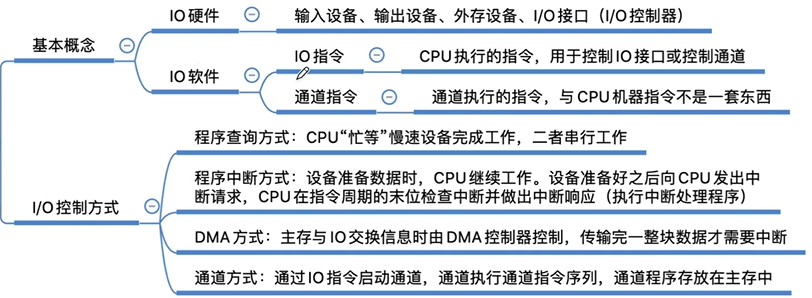

**I/O接口**：又叫**I/O控制器**、**设备控制器**，负责协调主机与外部设备间的数据传输

I/O接口**是一块芯片**，常被集成在主板上(会在南桥芯片内部)

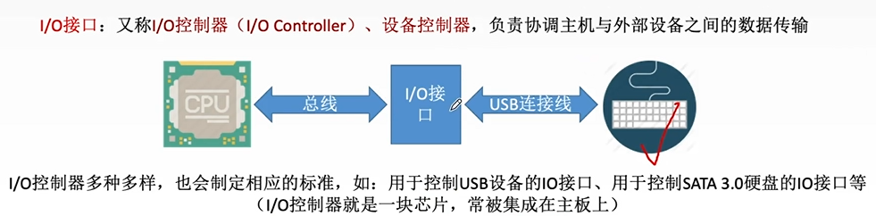


### I/O控制方式简介

在I/O接口中，有3个寄存器，分别是

- **数据寄存器**：存放要交换的数据
- **控制寄存器**：可以直接反应外设的具体动作
- **状态寄存器**：反应外设的当前状态(是否完成、损坏等)

CPU通过控制总线发出命令；地址总线指明设备的地址和读到的数据放到哪个寄存器；

判断I/O操作是否完成的方式有以下几种

#### 程序查询方式

**CPU不断轮询**检测I/O控制器中的状态寄存器、检查是否完成。完成后取出数据

这会一直占用CPU


#### 程序中断方式

等待I/O时CPI可以先执行其它程序，等I/O完成后，I/O控制器向CPU发出**中断请求**，CPU响应中断，取走数据


> 以上两种方式的数据流：键盘->I/O接口的数据寄存器->数据总线->CPU的某个寄存器->主存

#### DMA控制方式


> 注：DMA接口，即DMA控制器，也是一种特殊的I/O控制器。主要应用于连接高速外设
>
> 采用的是三总线的结构

主存与高速的I/O设备有一条**直接数据通路**(DMA总线)。CPU向DMA接口发出读写命令，并且指明主存地址、磁盘地址、读写数据量等参数

**DMA控制器自动控制磁盘与主存的数据读写**，每**完成一整块**的数据读写，才向CPU**发送一次中断**请求

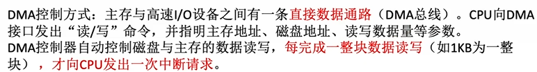


> 每一个字直接CPU需要暂停一个读写周期，但是比每个字都要中断的程序中断方式快多了

#### 通道控制方式

商用的中型机、大型即会有超多的I/O设备，中断太过频繁，CPU处理不过来

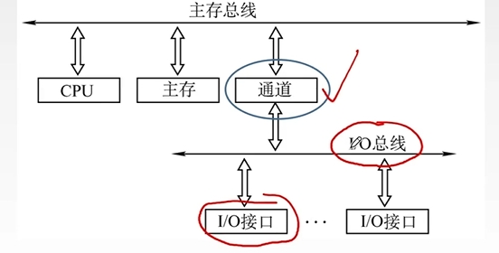

> 通道是具有特殊功能的处理器，能对I/O设备进行统一管理

通道能识别并执行一系列**通道指令**，指令的种类、功能通常比较单一

实现过程：

1. CPU向通道发出I/O指令。指明通道程序在内存中的位置，并指明它管理哪个设备，然后CPU就可以处理其它程序
2. 通道执行通道程序，控制I/O设备
3. 通道完成任务后，向CPU发出中断请求，CPU处理中断


### I/O系统基本组成

I/O系统由**I/O软件**和**I/O硬件**组成

- I/O硬件：包括外部设备、I/O接口、I/O总线等

  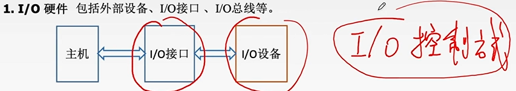

- I/O软件：包括驱动程序、用户程序、管理程序、升级补丁等

  通常采用I/O指令和通道指令实现CPU和I/O设备的信息交换

  > **I/O指令**：**CPU指令的一部分**
  >
  > 操作码+命令名+设备码
  >
  > 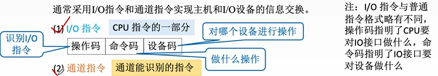
  >
  > ****
  >
  > **通道指令**：**通道能识别的指令**
  >
  > **通道程序**提前编制好**放在主存中**
  >
  > 在含有通道的计算机中，**CPU执行I/O指令**对通道发出命令，由**通道执行通道指令**，代替CPU对I/O设备进行管理
  >
  > 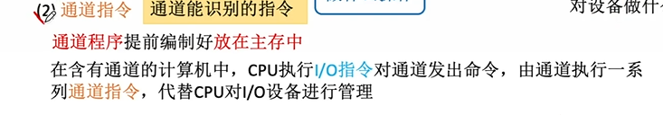 


## I/O接口


> **I/O接口**：又叫**I/O控制器**、**设备控制器**，复杂协调主机与外部设备间的数据传输
>
> I/O接口**是一块芯片**，常被集成在主板上(会在南桥芯片内部)
>
> 
>
> 
>
> 在I/O接口中，有3个寄存器，分别是
>
> - **数据寄存器**：存放要交换的数据，用于缓存
> - **控制寄存器**：可以直接反应外设的具体动作
> - **状态寄存器**：反应外设的当前状态(是否完成、损坏等)
>
> CPU通过控制总线发出命令；地址总线指明设备的地址和读到的数据放到哪个寄存器；

### I/O接口的作用

**数据缓冲**：通过数据寄存器(DBR)达到主机与外设速度相匹配的功能

**错误或状态监测**：通过状态控制器，反馈设备的错误、状态信息，供CPU查询

**控制和定时**：接收控制总线传来的控制信号和时钟信号

**数据格式转换**：串并行转换

**实现主机和设备间的通信**：实现主机-I/O接口-I/O设备间的通信

### 工作过程

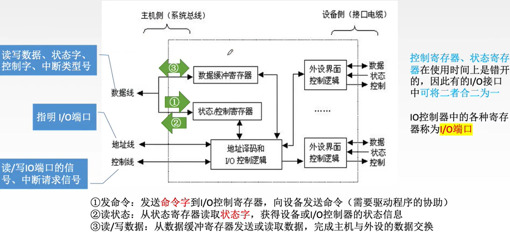

1. **发命令**：发送命令字到I/O**控制寄存器**，向设备发送命令
2. **读状态**：从状态寄存器读取**状态字**，获得设备的状态信息
3. **读写数据**：从数据缓存寄存器发送或读取数据，完成主机与外设间的数据交换

> 控制寄存器与状态寄存器使用时间是错开的，所以常把它们合并
>
> I/O控制器中的各种**寄存器**也被称为**I/O端口**

数据线用于**读写数据、状态字、控制字、中断类型号**

地址线用于**指明I/O端口**(寄存器)

控制线用于**传输读写I/O端口的信号、中断请求信号**

> 确定操作的外部设备有两种方法
>
> 1. 选择寄存器后，再发送一次地址来请求设备
> 2. 每个设备有一组寄存器，选择那组寄存器，就控制哪个设备

### 接口与端口

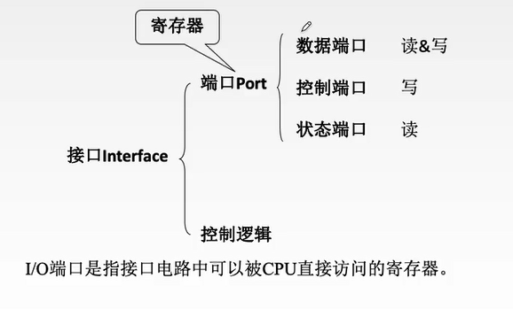

#### 统一编址和独立编址

统一编址是与主存地址是连续的

> 靠地址码就可以分别内存和I/O设备
>
> 也叫**存储器映射方式**


独立编制是地址是独立的

> 由于主存和I/O地址可能重复，所以要靠不同的指令来区分主存和I/O设备
>
> **只能用专用的I/O指令访问I/O端口**


#### I/O接口的类型

按数据传送方式可分为：串行接口\并行接口

按主机访问I/O设备的控制方式可分为：程序查询接口、中断接口、DMA接口

按功能选择的灵活性可分为：可编程接口、不可编程接口


## I/O控制方式


### 程序查询方式

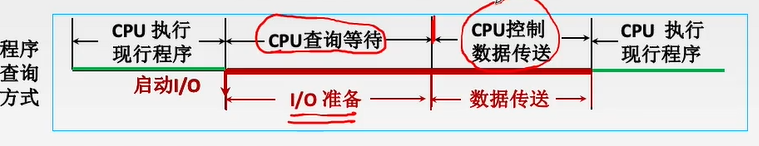

在I/O设备准备数据时，CPU不能做其它事情，要轮询检查判断是否处理完毕，当状态变成已完成，读出数据。这叫做独占查询

保证数据不丢失的情况下，隔一段时间查询一次，叫做定时查询，期间可以执行其它程序


#### 实例模拟

以X86下的IN和OUT指令为例

IN Rd Rs ：把I/O端口RS的数据读入到CPU的Rd中

OUT Rd Rs：把CPU寄存器Rs的数据输出到I/O端口Rd


> 假设要打印字符，过程如下
>
> 1. 先把当前要打印的数据存入CPU的寄存器中
>
> 2. 通过OUT指令，把打印指令送入I/O接口的控制寄存器(可能得先把指令从主存调入CPU寄存器)
>
>    (CPU根据指令，通过地址线寻找到要写入的I/O端口，通过控制线指明对目标寄存器进行的操作，需要的数据通过数据线传入)
>
> 3. 此时打印命令存储在控制寄存器中,I/O控制器通过控制线，向I/O设备发出控制信号
>
> 4. I/O设备接收到控制信号后，开始进行工作，把当前自己的状态，通过状态线发送给I/O控制器
>
> 5. 当I/O控制器接收到状态信息后，将其存入状态寄存器
>
>    (此时控制寄存器已经不用了，所以控制寄存器可以和状态寄存器合并)
>
> 6. CPU通过IN指令，轮询检测状态寄存器中的值，直到读取到就绪状态
>
>    (用IN通过数据线把状态寄存器中的值读入CPU寄存器，再判断)
>
> 7. CPU使用OUT指令向I/O接口发送信息(通过地址线指明存放的I/O端口(寄存器)，控制线指明是要写数据，数据线传入要打印的数据)
>
> 8. I/O控制器通过数据线把传来的数据送入I/O设备，并发出控制信号
>
> 9. CPU打印过程中，状态控制器显示忙，打印完成改为就绪状态，等待数据
>
> 10. CPU发现后，把下一个数据传入，重复789
>
> 11. CPU检测到数据全部结束打印后，通过数据线向I/O接口发送停机命令字
>
> 12. I/O控制器把指令传给打印机，工作结束

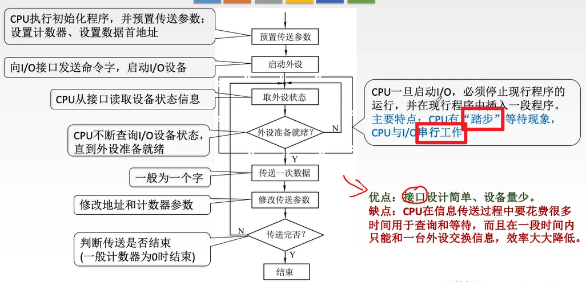

#### 例题

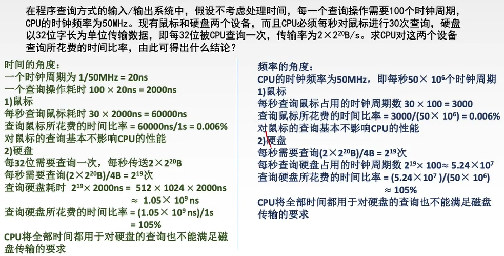


****

想要了解程序中断方式，就得先直到什么是中断

下面先来介绍一下中断系统

### 中断系统介绍


#### 中断系统的作用和原理

包括中断的**概念**、中断的**分类**、以及中断系统的**通用操作**

中断请求标记用于**判断**是哪个**类型**的中断

中断判优是**选择**哪个**中断**请求

##### 中断的概念

> ### 中断的基本概念
>
> 中断是指计算机在执行现行程序的过程中，出现急需处理的异常或特殊请求，CPU暂时中止现行程序，而转而去对这些异常情况或特殊请求进行处理，处理完成再返回
>
> 假如没有中断，某个进程会一直占有CPU，即使调用jmp或者call也仅仅是让执行的位置发生变换。还是会占用CPU直到该进程自主停止（以上指的是单核单CPU）
>
> 中断系统实现后，每个指令结束了，都会检测是否有中断信号需要响应，如有，就转向先执行中断这部分代码；具体过程是
>
> 1. **中断请求**
>
>    中断源向CPU发出中断请求信号
>
> 2. **中断响应**
>
>    先判断响应中断的条件是否满足(如关中断后一般的中断就不再响应)
>
>    然后进行中断判优(根据优先级判断响应哪一个中断)
>
> 3. **中断处理**
>
>    中断隐指令(根据中断信号的不同，转移到程序正确的位置)
>
>    执行中断服务程序

##### 中断的分类

> ### 中断的分类
>
> 分为异常和中断，其中异常叫做内中断，中断也叫外中断
>
> **内中断就是CPU内部执行指令时发现的**，分为
>
> - 故障：指令发现不能运行：缺页、除以0
> - **自陷**：系统故意的
> - **终止**：发现硬件坏了，如存储器校验错误、总线错误
>
> **外中断就是来自系统外部发出的中断请求**，分为
>
> I/O等外部设备发出的请求
>
> 用户的特殊操作（定时器到时，用户强制关闭）
>
> 
>
> 内中断的**故障和自陷**被称作**软件中断**
>
> **外中断和**内中断的**终止**被称作**硬件中断**
>
> #### 狭义上的中断
>
> 狭义上只有外中断才叫中断
>
> 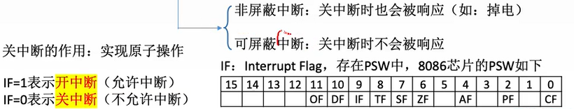
>
> 又分为：
>
> - **可屏蔽中断**：关中断不会响应
> - **不可屏蔽中断**：关中断也会响应（如掉点
>
> > ##### 关中断：
> >
> > 为了**实现原子性操作**实现的
> >
> > 在PSW寄存器中的IF标志字，用于显示是否关中断
> >
> > **当IF为1，表示开中断**
> >
> > IF为0表示关中断

##### 中断请求标记

> ### 中断请求标记
>
> 为了判断中断信号是哪个设备发来的，需要设计一个**中断请求标记寄存器**，由触发器组成，对每个中断源设置一个**中断请求标记触发器INTR**，当其**状态为1时，表示中断源有请求**。
>
> 中断请求标记寄存器可以在CPU中集成，也可以分散在各个中断源中
>
> 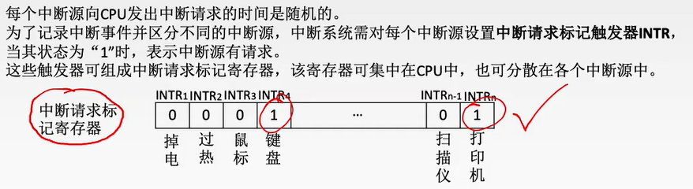
>
> 对于外中断，CPU在每条指令执行结束前向接口发出中断查询信号，以获取I/O中断请求。**CPU响应中断的时间是每条指令执行阶段的结束时刻（中断阶段）**
>
> 
>
> CPU响应中断必须有以下三个条件：
>
> 中断源**有中断请求**；处于**开中断**；**一条指令执行完毕**，且没有更紧急的任务

##### 中断判优

> ### 中断判优
>
> 当多个中断请求同时发出时，CPU要进行中断判优
>
> 可以由**硬件排队器**实现
>
> 也可以由软件**查询程序**实现
>
> 
>
> #### 优先级设置
>
> 1. **硬件故障是最高级，之后才是软件中断**
> 2. **非屏蔽中断优于可屏蔽中断**
> 3. **DMA请求优于I/O设备传送的中断请求**
> 4. **高速设备优于低速设备**
> 5. **输入设备优于输入设备**
> 6. **实时设备优于普通设备**

#### 单重中断的处理过程

> ### 中断处理过程
>
> 
>
> 在跳转到中断程序之前，需要保存当前状态，这是由中断隐指令实现的
>
> **中断隐指令**是一系列任务，会**先保存源程序的PC值**(假设执行到K发生中断，不同中断保存的不一样，反正就是中断结束后该执行的指令的PC)，**让PC指向中断服务程序的第一条指令**
>
> #### 中断隐指令的任务
>
> 1. **关中断**
>
>    为了防止此次中断被别的中断打断(对于单重中断的系统)
>
> 2. **保存断点**
>
>    为了中断结束之后能再返回，要把PC的值放到堆栈中，也可以放到特定的单元中
>
>    > 注意，中断隐指令只保存PC和PSW，
>    >
>    > 而**保存中断屏蔽字**、**保存通用寄存器的值**以及**提供中断服务**都由**操作系统来实现**
>
> 3. **引出中断服务程序**
>
>    也就是把PC的值更改为中断服务程序的起始位置
>
>    但是现在还不知道该位置，有两种查询方法：软件查询法和硬件向量法，后面会介绍硬件向量法
>
> 
>
> #### 硬件向量法
>
> 会采用间接寻址的思想，把跳转到程序起始位置的代码(一个JMP指令)保存在主存中。让**中断向量地址形成部件**根据硬件**排队器的输出**，形成**向量地址**(代码在主存中的位置)。
>
> 执行这个向量地址的代码，PC就被更改为中断程序的起始位置(**这个位置叫做中断向量**)了。
>
> 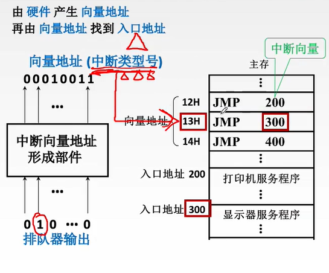
>
> >右边的就是中断向量表，产生的向量地址相当于是中断向量表的地址，可以看作是下标
> >
> >而中断程序在内存中是离散 的，而且位置可能变得，所以需要向量表里记录对应程序的起始地址，这样位置变动不用修改硬件。
> >
> >**中断向量表是由操作系统初始化的**
>
> 
>
> #### 中断服务程序的任务
>
> 主要包括3个方面
>
> 1. **保护现场**
>
>    **保存通用寄存器和状态寄存器的值**，便于中断执行结束后原程序可以恢复CPU环境。可以用堆栈，也可以用特定的存储单元
>
> 2. **中断服务**(设备服务)
>
>    这就是该中断需要进行的事情**主体**，不同中断的该部分也不一样
>
> 3. **恢复现场**
>
>    把之前保存的信息**送回原来的寄存器**，
>
> 4. **中断返回**
>
>    执行开中断，把原先的PC也变回去，也就回到了原来程序的位置

#### 多重中断

> ### 多重中断
>
> 有些系统中，需要在**中断过程中还需要响应其它中断**，这就是**多重中断**，也叫做中断嵌套
>
> 在单重中断中，调用中断前需要关中断，直到服务结束，再打开中断
>
> 而多重中断系统中，在**关闭中断后**，中断程序**还未结束时**，就**能收到开中断**的信号，这时就会跳转到另一个中断程序，在哪个中断程序**执行完毕**后，需要把**中断关闭**，回来**继续执行**原中断程序，**最后打开中断**
>
> 
>
> 此外，在保存现场和恢复现场时，需要多保存一个**屏蔽字**
>
> #### 屏蔽字
>
> 屏蔽字是为了限制一些中断的调用，也就是说让**高优先级中断不会被低优先级中断打断**
>
> 注意与硬件排队器区分
>
> 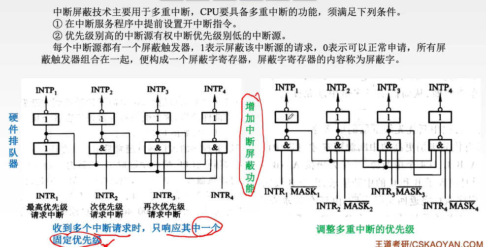
>
> 电路了解即可
>
> 注意，屏蔽字至少应该屏蔽自己
>
> #### 例题
>
> 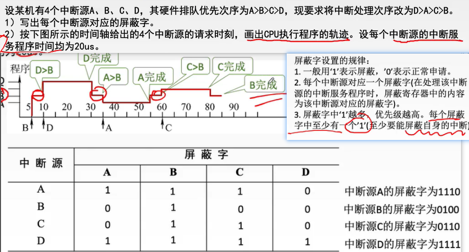


### 程序中断方式


当I/O指令发出后，在**I/O部件准备数据**过程中，**CPU先执行**其它程序

当外部设备准备完毕后，**向CPU发出中断**指令，

当**CPU**在某个指令的中断周期**检测到这个中断**信号后，**去处理**该程序

在处理**结束后**，**继续回来执行下一条指令**

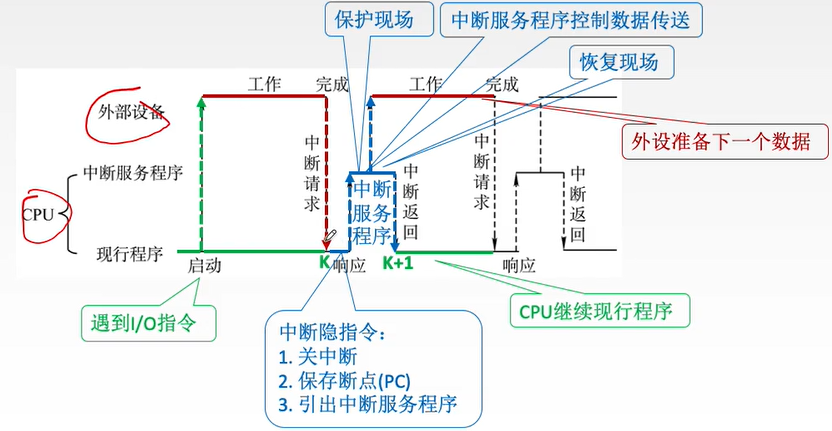

> 有些I/O操作必须等待所有外部设备处理结束才能执行后续程序，如scanf，就不是这个图示
>
> 但是大部分其实是可以实现的，比如printf、外部的打印机这种

### DMA方式


DMA通常用于**控制块设备**(以块为单位进行读写的设备，典型的就是磁盘)


CPU可以向DMA控制器**指明**当前是**输入**操作**还是输出**操作；

要传送**多少数据**；(可以以字节或字为单位)

数据在主存、外设的**地址**

####  主要功能

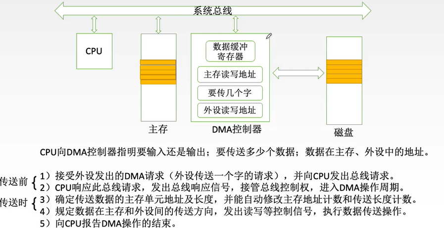

1. DMA控制器**接受**外设发出的DMA**请求**(一次传一个字)，并向CPU发出总线请求(这是单总线结构的DMA，3总线不需要请求)

2. CPU响应此总线请求，发出总线响应信号，DMA控制器接管总线控制权，**进入DMA操作周期**

   > 1、2这是传送到主存之前发生的事情，**预处理**

3. **确定**传送数据的**主存单元地址及长度**，并且能自动修改**主存地址计数**和**传送长度计数**

4. 规定数据在主存和外设间的**传送方向**，发出读写等**控制信号**，执行**数据传送**操作

   > 3、4这是传送时发生的操作，**数据传送**

5. 向CPU**报告**DMA操作的**结束**

   > 5是CPU执行中断做DMA的结束处理，**后处理**

#### DMA控制器的组成

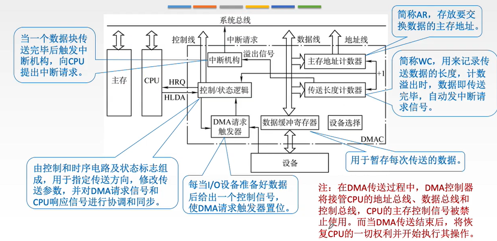

- ***控制/状态*逻辑**：用于指定传送方向、修改传送参数、并对DMA请求信号和CPU响应信号进行协调和同步
- **DMA请求触发器**：每当I/O设备准备好数据后，发出一个控制信号，使DMA请求触发器置位(当设备完成一个字的输入，就会发请求让它变为1，控制逻辑就进行对应操作)
- **主存地址计数器**：简称AR，指明要交换的数据在主存的地址。每传送一个字就自动+1，直至数据传输完毕
- **传送长度计数器**：简称WC，用来记录传送数据的长度。刚开始是要传送的总长度，每传一个-1，直到0
- **数据缓冲寄存器**：暂存要交换的数据
- **中断机构**：当一批数据发送完毕后(也就是一块)，向CPU发出中断信号


#### 详细传送过程

以下是**单总线结构**的DMA实现的传送过程


##### **预处理**：

- CPU向DMA控制器指明接下来要交换的数据的地址(主存和设备)

  主存交给AR，I/O设备交给DAR

- 要传送数据的个数

  交给WC

- 启动I/O设备

##### **数据传送**：

以数据输入为例

- I/O设备将数据**写入**数据缓冲寄存器DR

- DR写满后向DMA触发器**发送DMA请求**，让它变为1

- **控制逻辑**检测到这个DMA请求时，DMA控制器就向总线**发送总线请求**

- **CPU**发回信号，**将总线控制权交给DMA控制器**

- DMA控制器通过数据线、地址线、控制线**写入主存**

  数据缓冲寄存器放到数据线、主存地址计数器放到地址线

- 修改**主存地址寄存器**和**传送长度计数器**

  > 循环上述操作，直至所有字都写入主存

- 传递长度计数器发生溢出，传给**中断机构**，向CPU发出中断

##### **后处理**：

- CPU处理中断
- 做DMA结束处理

结束，CPU继续执行主程序

#### DMA使用主存的方式

当采用**三总线结构**时，CPU和DMA可能会同时访问主存，产生冲突，为了提高主存利用率，有以下3种方式使用主存

##### 停止CPU访问主存

> DMA工作时CPU不能访问主存
>
> **控制简单，但是CPU利用率降低**
>
> 

##### DMA与CPU交替访问

> 把一个CPU周期分为两半，前一半交给DMA访问，后一半交给CPU访问
>
> **不需要总线的使用权申请，但硬件逻辑更复杂一些，主存利用也不充分**

##### 周期挪用(周期窃取)

> DMA访存时有3种可能
>
> - CPU此时不访存：也就是没冲突，直接访存
> - CPU正在访存：DMA此时想访存，得等到CPU访存结束后让出总线
> - CPU和DMA同时访存：发生冲突，让**DMA优先**
>
> 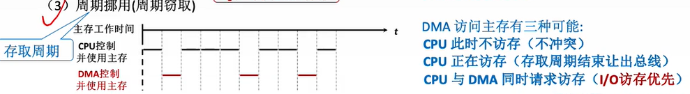
>
> **这里是主存周期**

#### DMA方式的特点

**I/O与主机并行工作，程序和传送并行工作**

主存既能被CPU也能被外设访问

数据块传送时，所有操作都由硬件电路实现

主存要开辟专用缓冲区，接收或供给外设数据

DMA传送块，CPU和外设并行，提高了系统效率

DMA在传送开始前要通过程序进行预处理，结束后要用中断进行后处理


#### DMA方式与中断方式

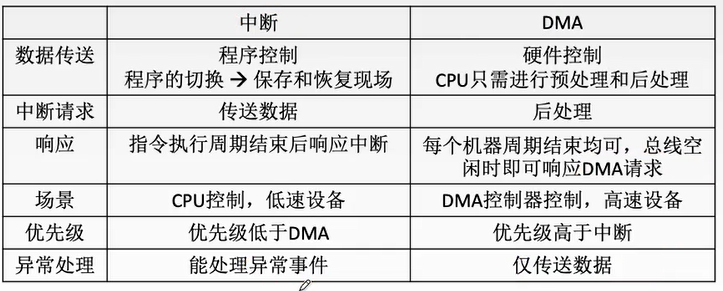

- **在数据传送时**：

  中断需要CPU进行程序切换、保存恢复现场等操作

  DMA只需要进行预处理和后处理

- **中断请求的发出**

  中断是在每次传送数据前

  DMA只有后处理时才发

- **响应中断的时机**

  中断方式是在每个指令周期结束后响应

  DMA是每个机器周期结束都行，总线空闲就能响应

- **使用场景**

  中断一般是CPU控制的低速设备

  DMA是DMA控制器控制的高速设备,块设备

- **优先级**

  DMA发出的中断优先级高

- **异常处理**

  中断方式能处理异常

  DMA只能传输数据