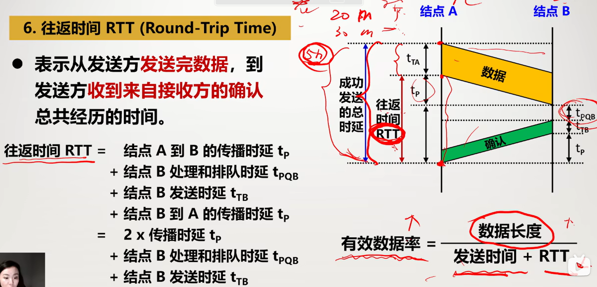

# 一、概述

## 1.1计算机网络在信息时代的作用

### 计算机网络概念

#### 三大网络

**电信网络、有线电视网络、计算机网络**

覆盖全球的：互联网(Integernet)

局部范围使用的：互连网(internet)

### 互连网的两个重要基本特点

#### 连通性

用户终端好像彼此直接联通一样

#### 共享性

信息共享、网络共享、硬件共享

## 1.2互联网概述

### 网络的网络

#### 计算机网络(简称网络)：

由若干**节点**和连接节点的**链路**组成

节点可以是计算机、集线器、交换机、路由器等

#### 互**连**网(internet注意是连)

把多个网络连接起来就叫互连网

#### 互联网(Internet)

特指覆盖全球的，具有连通性和资源共享性的计算机网络

### 互联网基础结构的发展阶段

#### 第一阶段1969-1990

先是ARPANET(阿帕网)，最初至少简单的分组交换网，不是互连网

1983年，TCP/IP协议作为阿帕网的标准协议，

所以1983年作为互联网诞生年

1990年阿帕网关闭，

#### 第二阶段1985-1993

三级结构：主干网、地区网、校园网(企业网)

#### 第三阶段1993-现在

##### 出现了互联网服务提供者ISP

提供接入互联网的服务

收取费用

##### 多层次ISP结构

主干ISP、地区ISP、本地ISP、主机

##### 互联网交换点IXP

允许两个网络直接相连，并快速交换

##### 内容提供者

向用户提供视频和文件，**不提供转接服务**

### 互联网标准化工作

所有标准都是RFC(请求评论)形式发布，任何人都能评论，但需要审核

**不是所有RFC都是互联网标准，只有一小部分**

## 1.3互联网的组成

从工作方式上看可以分为边缘部分和核心部分

边缘部分提供互联网的**共享性**

核心部分提供**连通性**

### 边缘部分

边缘的部分就是连接的所有主机，也叫**端系统**

主机A和主机B通信指主机A的某个进程和B的进程通信

#### 客户端服务器 C/S方式

客户是被调用后执行，主动发起通信

服务器是不断运行，被动等待

**通信可以是双向的，都可接受或发送**

#### 对等连接方式P2P

每个主机平等

本质上仍是C/S方式

### 核心部分

为主机提供连通性

在核心部分起特殊作用的是**路由器**

路由器是实现**分组交换**的关键，其任务是**转发**收到的分组

**分组转发**是网络核心部分**最重要**的功能

#### 电路交换

交换就是转接

电路交换分为三个阶段

**建立连接**，建立物理通路(占用通信资源)

**通话**(一直占用资源)

**释放连接**(归还通信资源)

**在通话全部时间内，通话的两个用户始终占用端到端的通信资源**

用于计算机数据传输效率低

#### 分组交换

采用**存储转发**技术

数据段加上首部就是**分组**

路由器处理分组过程：先暂存，检查首部，查找转发表，找到合适接口转发

##### 优点：

高效：**动态分配**带宽，**逐段占用**链路

灵活：每个分组**独立**选择转发路由

迅速：**不用事先建立连接**就能发送分组

可靠：有可靠的网络协议，可以保证**不重复，不丢失，不失序**

##### 缺点

排队延迟：分组在个路由器要排队

不保证带宽：由于是动态分配的

会增加开销：报头，转发表

#### 电路交换，报文交换，分组交换区别

电路交换：连续直达终点

报文交换：(就是不分组的分组交换)整个报文一个一个节点往后转发

分组交换：把报文分组，每个组可以各自转发

但传输**大量**数据(传输时间**远大于**连接时间)，**电路交换**速率较快

**报文交换**和分组交换不用预先分配带宽，在传输**突发数据**时可提高信道利用率

由于分组长度**远远小**于报文，所以**分组交换**时延小，更灵活

## 1.5计算机网络的类别

### 定义

把握住连通性和共享性即可

### 类别

#### 按范围分类

广域网WAN：范围大，是互联网的核心部分，使用点对点协议

城域网MAN

局域网LAN：使用广播协议

个人区域网：PAN

#### 按使用者分类

公用网

专用网

#### 把用户接入互联网的网络：接入网AN

## 1.6计算机网络的性能()

### 计算机网络的性能指标

#### 速率

比特是信息的基本单位

速率就是数据的传输速率，指**理想**情况下一段时间网络信道能通过的**最大数据量**

单位bit/s，kbit/s，Mbit/s，Gbit/s，每个差1000倍(注意k是小写)

是指**额定速率**，不是时间运行速率

#### 带宽

##### 频域称谓

带宽本来是指信号的频带宽度，单位Hz

指某信道允许通过的信号频带范围

##### 时域称谓

但在计算机网络中，用来表示**某通道**传送数据的能力

表示单位时间内能通过的最高数据率

单位也是bit/s

可以比速率大，也可以小

#### 吞吐量

单位时间某个网络(信道、接口)的**实际数据量**

受**带宽**和**额定速率**的限制

**可能远小于**额定速率

#### 时延

指数据从网络(或链路)的**一端传送到另一端**的所需**时间**

##### 发送时延

$$
发送时延 = 数据帧长度(bit)/发射速率(bit/s)
$$

##### 传播时延

$$
传播时延 = 信道长度(米)/在信道上的传播速率(米/s)
$$

##### 处理时延和排队时延

都在路由器里发送

**处理时延**是收到分组时，处理分组所花时间

**排队时延**是**在路由器队列等待处理转发**所经历的时延

当数据量很大导致**队列溢出时**，分组会丢失，相当于**排队时延无穷大**

##### 总时延

总时延=发送时延+传播时延+处理时延+排队时延

那个时延占主导地位，就是瓶颈

注：带宽不会影响传播时延，其只与信道长度和介质有关

#### 时延带宽积

$$
时延带宽积=传播时延*带宽
$$

就是相当于链路能装多少数据

只有链路都充满比特时，链路才充分利用

#### 往返时间RTT

表示发送完数据(不算A的发送时延)，收到接收方的确认所经历的时间

也就是传播时延*2+B的处理时延和排队时延+B的发送时延

当确认信息极短时，可忽略B的发送时延

$$
有效数据率 = 数据长度/ (发送时延+RTT)
$$
但是实际上RTT里还有中间节点的的处理时延、排队时延和转发时的发送时延

#### 利用率

信道利用率：某信道有百分之几的时间被利用(有数据通过)，空闲时就是0

网络利用率：整个网络所有信道的信道利用率的加权平均值

但是不是利用率越高越好，利用率增大，时延也会增大

D代表当时时延，D0代表空闲时延，U代表当前网络利用率
$$
D=D0/(1-U)
$$

### 非性能指标

费用

质量

标准化

可靠性

可拓展性

管理和维护

## 1.7计算机网络体系结构()

### 体系结构的形成

由于计算机网络太复杂

ARPANET提出分层设计，把复杂的通信问题划分成若干较小的易于研究的局部问题

分层基本原则：**抽象分层、统一标准、模块独立**

### 体系结构中的协议与层次划分

**网络的体系结构**：是计算机网络各层及其**协议的集合**，也就是这个计算机网络及其构建所应当完成的**功能的精确定义(不涉及实现)**

#### 网络协议

是为了进行网络中数据的交换建立的规则、标准或约定

有三个组成要素：

**语法**：规定传输数据的格式，解决交换信息的格式问题

**语义**：规定要完成的功能，解决做什么的问题

**同步**：规定各种操作的顺序，又称为时序，解决什么时间什么条件下做什么操作

#### 划分层次

分层适度，功能确定，层次独立，层次关联，层次对等，层次协议和接口

至少要完成以下功能：

差错控制

流量控制

分段和重装

复用和分用

建立连接和释放(逻辑连接)

#### 优点

- 各层独立，不关心其他层的实现
- 灵活性好，一层发生变化，不影响其他层
- 结构上好分割，每层可以用合适的技术
- 易于实现和维护
- 能促进标准化

#### 缺点

- 降低效率
- 有些功能要在多层重复实现，增加开销

### 五层协议的体系结构

#### 应用层

任务：通过应用进程间的交互完成特定的网络应用

协议：应用进程间通信和交互的规则

数据单元是**报文**

为**用户**提供服务

#### 运输层

任务：负责向两主机中**进程间**的通信提供服务

协议：传输控制协议TCP：面向连接的可靠传输，用户数据协议UDP：无连接的数据传输

具有**分用和复用**的功能

#### 网络层

为分组交换网上的不同主机提供通信服务

两个具体任务

- 路由选择：在每个路由器上生成转发表
- 转发：收到分组时，依据转发表转发到下一个路由器

网际协议**IP**和路由协议

IP数据报

#### 数据链路层

实现同一个网络中的两个节点(相邻节点)的可靠通信

在相邻节点间传送的是**帧**

有差错检验

#### 物理层

实现**比特**的传输

确定电缆插头的引脚，引脚如何连接

传输介质在物理层

### 实体、协议、服务和服务访问点

**实体**：可发送或接收信息的硬件或软件进程

**协议**：控制两个对等实体进行通信的规则的集合

**服务**：在协议的控制下，对等实体间的通信使得其能对上一层提供服务；要实现本层服务，需要下层提供的服务

**服务是垂直的**，下层为上层服务，每一个下层对于上层来讲，都是透明的 

**协议是水平的**，每一个实体都认为自己在和对等层之间靠本层之间的协议在直接通信 实际上该层实体之间的功能是靠它下一层的实体在给它提供通信服务

**服务访问点**：相邻两层之间实体进行交换的地方叫服务访问点SAP

### TCP/IP体系结构

IP屏蔽了下层所有的接口和上面所有的协议