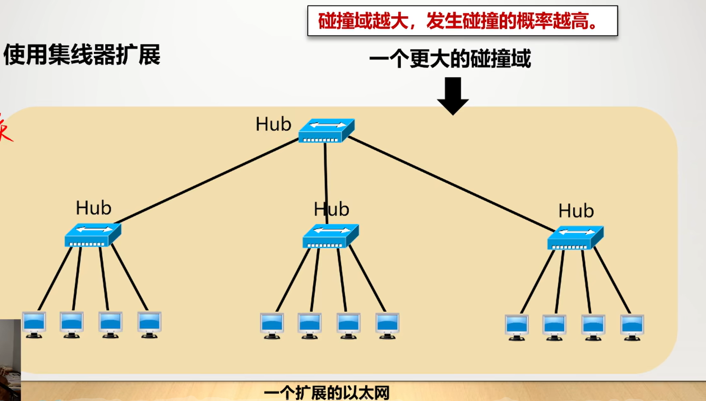

# 数据链路层

## 概述

### 为什么要数据链路层

物理层解决了相邻节点**透明传输**比特的问题

但是如何在比特流中找到数据开始和结束的位置

线路上有多个设备时比特流由谁接收

比特传输错误怎么办

### 什么是数据链路

**链路**link：是节点间的**物理通道**，是无源的物理线路，中间无交换节点

**数据链路**data link：是节点间的**逻辑通道**，是把实现控制数据传输的硬件和软件加到链路上，即**链路+协议**

**数据链路层**：负责通过一条链路从一个节点向物理链路**直接相连的**相邻节点传送帧

**帧**：链路层协议数据单元，封装网络层的数据报

数据链路层不必考虑物理层的实现比特传输细节

向下利用物理层提供的位流服务

向上向网络层提供明确的服务接口

### 链路层信道类型

点对点通信：一对一的通信方式(一般是骨干网用)

广播通信：一对多的通信方式(边缘部分用)

信道使用的形式不同，就会有不同的控制协议

## 三个基本问题

### 封装成帧 

**封装成帧**framing：在一段数据的前后分别添加**首部和尾部**，构成一个帧

首部和尾部的一个重要作用就是进行**帧定界**

将比特流划分成**帧**的主要目的是为了**检测和纠正**物理层在比特传输可能出现的错误

帧头和帧尾之间的数据部分(也就是IP数据报的长度)，要**小于等于**最大传输单元MTU

怎么封装成帧

字节计数法：指定第一个字节为该帧的长度，读完，读下一个计数字节判断下一个帧

但是当技术字节出错，会导致一连串错误

#### 带字节的填充的定界符法：用控制字符作为帧定界符

控制字符SOH代表帧首部的开始

控制字符EOT放在帧的末尾，表示帧的结束

但是当数据和开始符或结束符相同时，会出现划分错误

### 透明传输

是为了：无论发送什么样的比特组合的数据，都能按照原样**没有差错**地通过这个数据链路层

#### 发送方采用字节填充或字符填充

对内部数据的与开头结尾相同的数据前，加上一个转义符号

接收方逐个字节检查，遇到转义符号就不会认为是帧头或帧尾，把转义符号删掉再读入。

#### 其它发送方式的解决办法(比特填充、编码违例)

### 差错控制(不能实现可靠传输)

噪声会导致数据在传输过程中产生**比特差错**

**误码率BER**：传输错误比特占传输比特总数的比率，与信噪比有关

**纠错码**：主要用于错误发生比较频繁的信道上，如无线链路

检错码：主要用在高可靠、误码率较低的信道上，例如光纤链路

#### 循环冗余检验CRC

在原始数据(假设k位)后加上n位的冗余码，改为发送n+k位数据

##### 冗余码计算

先在k位数据后**加上n个0**，除上事先约定好的数P(n+1位)

进行模2除法运算(可以看作是**求异或**，相同为0不同为1)

用得到的**余数(n位)就是冗余码**

冗余码也叫做**帧检测序列FCS**

##### 除数P的表示，P(X)生成多项式

多项式与2对应次方存在的位置写1，其余补0

##### 接收端检验

接收端对接收到的帧进行CRC检验，若余数为0，可认为无错误

若不为0，就认为出了差错，丢弃

#### 可靠传输的概念

仅用循环冗余检验差错只能做到**无差错接受**

即凡是接受的帧，都能以**非常接近于1的概率**认为在传输过程中没有差错

即**凡是接收端数据链路层接受的帧均无差错**

以上只确定了每个帧无比特差错

但是无传输差错要求帧与帧之间的关系也不能错

要**不重复、不丢失、不失序**

所以还有加上**帧编号、确认和重传**才能做到可靠传输

## 点对点协议PPP

### 应当满足的需求

**简单**、

能承载不同的网络层分组、

能在多种链路上运行

封装成帧、

透明传输(字节填充、零比特传输)、

差错检验

实时检测链路工作状态

设置链路最大传输单元MTU

网络层地址协商机制——必须提供一种机制使得通信的两个网络层实体能通过协商知道或能配置彼此的网络层地址

数据压缩协商机制

### PPP协议的组成

#### 一种将IP数据报封装到同步/异步串行链路的方法

#### 链路控制协议LCP

用于**建立、配置和测试**数据链路的控制协议，通信双方可以协商一些选项，最重要的功能之一是**身份验证**

#### 网络控制协议NCP

其中每个协议支持一种不同的网络层协议，如IP、OSI的网络层

### PPP协议的帧格式

首部的第一个字段和尾部最后一个字段都是标志字段F(16进制的7E，2进制的01111110).它标志一个帧的开始和结束。**F就是PPP帧的定界符**

### 透明传输问题

PPP在异步传输时，使用**字节填充法**

在同步传输时，采用**零比特填充法**

#### 字节填充

在遇到7E或者小于0x20的字符，在其前面加上7E，并对数据做一些改变

在接收时反向改回来就行了

#### 零比特填充

在数据里，每遇到5个1在后面加一个0

### PPP的工作状态

## 广播通信

### 局域网的数据链路层

#### 局域网的主要特点

网络一个单位所有，且地理位置和站点数目均有限

#### 局域网的优点

有广播功能：一个站点可以方便的访问全网

便于系统拓展和演变

更可靠

#### 局域网的拓扑结构

共享同一个信道

#### 广播面临的问题

可能会有多个站点同时请求

#### 解决办法

进行信道分配

#### 适配器(网卡)的作用

MAC地址存在适配器里，IP地址存在计算机存储器里

可以进行串行/并行转换

对数据进行缓存

在操作系统按照设备驱动程序

实现以太网协议

#### 以太网采取的两种重要措施

采用较为灵活的**无连接工作方式**

- 不必事先建立连接就能发送
- 不对发送的数据帧编号，也不要求对方发确认(不需要进行可靠传输)
- 提供不可靠的尽最大努力的交付
- 差错帧是否重传由**高层决定**(运输层)

发送数据都使用**曼彻斯特**编码，便于同步

曼彻斯特编码的缺点

**所占频带宽度是基带信号的两倍**(由于每秒的码元数加倍了)

#### 总线型以太网的工作特点

最早的以太网：把许多计算机都连接到一根**总线**上

总线特点：易于实现**广播通信**，简单可靠。

##### 如何实现一对一通信

将接收站的硬件地址写入**帧首部**的目的地址字段中，仅当目的地址与适配器硬件地址一致时才接收这个数据帧

##### 总线缺点

会产生发送**碰撞或冲突**(信号的叠加)，导致发送失败

需要在以太网上实现动态 媒体接入控制，也就是下面的CSMA/CD协议

### 媒体接入控制MAC

**静态划分信道**：频分复用、时分复用、波分复用、码分复用(在物理层学习的)

适用于通信流量大且流量稳定、用户数量少且固定

代价高，不适合突发性业务，**不适合局域网**

**动态媒体接入控制(多点接入)**

随机接入：用户可随机地发送信息(**以太网**)

受控接入：用户必须服从一定的控制，如轮询

下面介绍一下对应协议，主要是随机接入的

### ALOHA协议

#### 纯ALOHA协议

不监听信道，不按时间槽发送，随机重发，想发就发

下图里的T0指的是发送时延+传输时延，也就是发送开始直到到达站点

#### 时隙ALOHA协议

把时间分成若干个相同的时间片，所有用户在时间片开始同步接入网络，若发生冲突，必须等到下一个时间片再发送

### CSMA

#### 1-坚持CSMA

空闲直接传

忙就一直监听直到空闲发送

遇到冲突就等待随机时间再开始监听

#### 非坚持CSMA

如果忙了，先等待一段时间再监听

#### p-坚持CSMA

空闲以概率p发送，否则等到下一个时间槽再发

忙就持续监听

冲突就等到下一个时间槽

### CSMA/CD(在以太网上，是有线网)

中文名：载波监听多点接入/碰撞检测

这个协议简单来说就是： 先听后发，边听边发， 冲突停止，延迟重发

**多点接入：**说明是总线型网络。(许多计算机以多点接入的方式连接在一根总线上)

**载波监听：**边发送边监听，不论是在想发送数据**之前**还是发送数据**之中**，每个站**都不断检测信道**(看是不是空闲)。

**碰撞检测：**检测信道上的信号电压变化情况，若**电压摆动值**超过了某一阈值，则认为总线上至少两个站在发送数据，说明发生了**碰撞**

检测到碰撞后：

适配器立刻停止发送。等待一段随机时间后再发送。

96比特时间是指9.6微秒

#### 碰撞检测实现

发送数据前，就已经监听过信道，但是还要进行碰撞检测

这是因为信号有传播时延

τ是单项传播时延，A到达B还剩δ是B发送数据

则在τ+δ/2时刻两信号相遇，在τ时刻B检测到碰撞

在2τ-δ时刻A检测到碰撞

**若未发生碰撞，A接收到信号的最短时间为2τ**(B接收到A的信号，立刻接收完毕并向A返回)

所有把2τ的时间称为**争用期**，一般就是51.2微秒

**经过争用期还未检测到碰撞，这次发送就不会再有碰撞了**

#### 碰撞后重传(截断二进制指数退避)

在发生碰撞后，要等一个随机的时间再发生

**基本退避时间2τ**

从集合中随机选一个数r，则时延T=r*基本退避时间

集合为1、2，......(2^k-1)。里面的k是重传次数和10的较小值

重传最多进行16次，再不成功就要丢弃，并向上层汇报

#### 最短有效帧长

64字节，最短也要发2τ的时间，在这个期间可能会有碰撞出现，所以最好要一直监听，所以有了最短帧长，刚好是10Mbps的以太网2τ发送的数据

#### 强化碰撞

当AB发生碰撞时，其它用户可能不知情

所以在发生碰撞时，先发现的那个用户要发送一个人为干扰信号

#### CSMA/CD的重要特性

使用CSMA/CD协议的以太网不能全双工，只能半双工

每个站在自己发送数据后的一小段时间里，可能发生碰撞

以太网的平均通信量**远小于最高**通信率

**先听后发，边听边发， 冲突停止，延迟重发**

### CSMA/CA(适用于无线局域网)

中文名：载波监听多址接入/碰撞避免

在局域网不能使用碰撞检测CD

由于无线局域网信号弱，要实现碰撞检测的硬件要求非常高

即使能实现，也会由于隐蔽站的问题，没什么意义

#### 特点

802.11无限局域网使用CSMA/CA协议，实现了碰撞避免功能

由于**不可能避免所有碰撞**，且无线通信**误码率较高**，802.11还**使用了确认机制(停止等待协议SW)**，确保数据正确接收

#### 帧间间隔IFS

**所有站点必须在检测到信道空闲后，等待一段指定的时间IFS才能发送帧**

帧间隔取决于该帧的类型

优先级高，间隔就短，反之则长

可以减少碰撞

##### 短帧间间隔SIFS

最短的帧间间隔28微秒，ACK帧、CTS帧还有MAC分片导致的多个帧都是用SIFS

##### DCF帧间间隔DIFS

128微秒，在DCF方式中发送数据帧和管理帧

#### 工作原理

##### 信道空闲

在源站要发送数据帧时，若检测到信道空闲，则**等待一个DIFS帧**的时间，若依旧空闲，则发送帧

**等待DIFS是为了防止有其它优先级更高的帧要发送，若有就先让它们发**

目的站接收帧后，**等一个SIFS**后，**发送ACK**返回 (其实这里就是使用的SW协议)

等待SIFS是为了分隔各帧切换站点的发送方式变为接收

##### 信道繁忙

当信道繁忙时，其它站要发信号，必须要在繁忙结束后，等待一个DIFS，然后再等待一段随机时间才能发送。这是为了防止多个信道发生碰撞

##### 使用退避算法条件

##### 退避算法

在执行退避算法时，先给该站点设置一个随机的退避时间

当计时器变为0就可以发送数据了

但还未到0，信道繁忙了，计时器要暂停，等到信道空闲并等一个DIFS后，再开始计时

###### 退避时间计算

与二进制退避算法很相似，基本退避时间变为了时隙长度

第i次退避时隙编号变为了[0,1,......2^(2+i)-1]，i到6就不再增长(也就是最小是[0,7],最大是[0,255])，与二进制退避稍有不同

#### 信道预约

##### 源站和目的站

源站先发送RTS帧，

目的站收到后等一个SIFS发送CTS帧，

源站收到CTS帧后，等一个SIFS发送数据帧，

目的站收到后，等一个SIFS发送ACK帧

##### 其它站

其它站收到CTS帧，说明有其它站在预约成功了，就推迟自己的通信

#### 虚拟载波监听

CTS帧和RTS帧都含有占用时间，其它站只要收到了，就暂时不会发送数据

解决了隐蔽站的问题，减少了碰撞

### 轮询访问：令牌传输协议

#### 轮询协议

#### 令牌传递协议

空闲时令牌不断在各站间依次传递

若遇到要发数据的站点，修改令牌标志位，加入数据，继续传递，传递到目的站点时，复制一份，继续传递，回到源站后，检测是否有差错，若有则重传

没有就把标志位改回去，数据去掉，继续传递

### 使用集线器的星形拓扑

使用双绞线的以太网采用星形拓扑

在星形中心增加了可靠性非常高的设备，叫做**集线器**

每个站到集线器的距离不超过100m

#### 集线器的特点

使用集线器的以太网在**逻辑上依然是一个总线网**

仍然是**共享信道**，还是使用CSMA/CD协议，共享逻辑上的总线

**工作在物理层**

采用专门芯片，减少干扰

### 以太网的信道利用率

多个站在以太网同时工作就会发生碰撞

碰撞时资源会浪费，所以**以太网的信道利用率并不能达到100%**

τ/T0越小，信道利用率越高

在以太网中定义了参数a=τ/T0
$$
以太网的信道利用率S_{max} = \frac{T_0}{T_0+τ} = \frac{1}{1+a}
$$
a应当尽量小，帧不能太短

### 以太网的MAC层

#### MAC层的硬件地址

又称**物理地址**或者**MAC地址**

每台计算机中**固化在适配器的ROM中的地址**

每个适配器一个MAC地址，相当于标识符

**局域网上的每个接口都有一个MAC地址**

IEEE规定mac地址第一个字节的最低有效位为I/G

单站地址：I/G位=0。可作为发送方，也可作为接收方

组地址：I/G位=1.组地址用于多播，只能作为目的地址使用

广播地址：48位全都为1.只能作为目的地址使用。

发往本站的帧有三种

#### MAC帧的格式

目的地址(接收方)6字节

源地址(发送方)6字节

类型2字节：上次的协议类型

数据字段46-1500字节

帧检验序列FCS 4字节

注意，MAC帧的长度为64-1518字节

而数据字段，也就是本层的MTU长度为48-1500字节

##### 帧前同步码

##### 无效帧

长度不是整数字节的

校验码校验不通过的

数据长度不在范围内的

**检测到无效帧就丢弃**

## 拓展的以太网

解决了怎么把以太网变大，并应对变大后产生的后果

在网络层眼中：扩展后的以太网仍然是一个网络

### 在物理层扩展以太网

#### 使用光纤拓展(延长距离)

主机使用光纤和一对光纤调制解调器连接到集线器

#### 使用集线器扩展

 使用集线器扩展，将原来几个集线器组成的独立的网络，合并成一个大的网络，这些计算机仍然在一个冲突域中

##### 优点

使原来不同冲突域的计算机能**跨冲突域通信**

扩大了覆盖范围

##### 缺点

冲突域增大了，总的吞吐量没提高

如果用到以太网技术不同(如数据率不同)，就不能用集线器互联

存在安全隐患

### 数据链路层扩展以太网

更常用

早期使用**网桥**，现在用以太网**交换机**

#### 以太网交换机的特点

实质上是一个**多接口的网桥**

每个接口的与一个单台主机或另一个以太网交换机相连，并且一般是**全双工**的方式工作。

以太网交换机具有**并行性**

能连接多对接口，使多对主机能同时通信

互相联通的主机都独占传输媒体，无冲突的传输数据

每个端口和连接到端口的主机构成了一个冲突域

接口有存储器

**即插即用**。其内部的帧**交换表**(也叫地址表)是通过自学习算法自动的建立起来的

使用专用的交换结构芯片，用硬件转发，比网桥块

每个用户独享带宽，增加了总容量

可以支持多种速率甚至多种类型的接口

#### 以太网交换机的自学习功能

刚开始，交换表是空的

若A发送给B消息，则先将A的地址和端口记录在表中

在表中查询B，差不到，则对所有端口广播

当B给A发消息，B不在表里，则先把B的mac地址和端口记录在表中

然后在表中查A，查到了，向对应端口发消息即可

##### 两台交换机相连时

##### 多台交换机互联(形成回路<广播风暴>)

可能会形成回路，会无限循环下去，不会停止，效率会急剧降低

解决广播风暴：使用STP生成树协议，不改变实际拓扑结构，但在逻辑上切断某些链路(阻塞端口)，使得所有到其它主机的路径都是无环树的结构，消除循环。

#### 从总线以太网到星形以太网

总线型：采用总线结构，使用CSMA/CD协议，半双工

星形：不用共享总线，没有碰撞，不用CSMA/CD协议，全双工，但仍然采用以太网的帧结构

### 虚拟局域网

以太网存在的主要问题：

不可避免广播，可能会产生广播风暴

会有安全问题

用户过多，管理困难，无法区别用户

**广播域**

广播域是指：这部分网络其中的任何一台设备发出的广播通信都能被该部分网络中其它所有设备接收

**一个以太网是一个广播域**

#### 虚拟局域网定义

**虚拟局域网VLAN**是由一些局域网网段构成的**与物理位置无关的逻辑组**

这些网段有一些共同的需求，每一个VLAN的帧都有一个明确的标识符，指明发送该帧的计算机是哪一个VLAN。

虚拟局域网其实是局域网给用户提供的一种服务，不是新型的局域网

每个VLAN是一个广播域，每个主机发出的广播只能在VLAN里传播

也可以看作一种安全手段

#### 优点

便于管理，需求相似的用户共享同一个VLAN

增强网络安全性，普通用户与敏感用户隔离

限制了广播报文范围，抑制广播风暴

减少网络拓扑变更成本

降低CPU开销

#### 划分方法

基于交换机端口

基于网卡的MAC地址

基于协议类型

基于IP子网地址

基于高层应用或服务

## 高速以太网

### 100BASE-T以太网

又称为快速以太网

仍使用CSMA/CD协议

可在**全双工**方式下工作，而无冲突

全双工下**不使用CSMA/CD**

仍使用**IEEE802.3规定的MAC帧格式**

保持**最短帧长64字节不变**，一个网段最大电缆长度减小到100米(原来是1km)

帧间时间间隔从9.6微秒变为**0.96微秒**

### 吉比特以太网

与100BASE-T相似

当半双工时加了载波延伸(最小帧长改为512字节)和分组突发

### 10吉比特以太网

与之前相同，但是只用光纤，只用全双工

已经扩大到了城域网和广域网，实现了**端到端的以太网传输**

### 进行宽带接入

可以提供双向的宽带传输

可以根据对用户的需求灵活进行**带宽升级**

可以实现端到端的以太网传输，不**需要帧格式转换**

但是**不支持**用户识别

# 可靠传输

在传输层也会讲，这里就提前一些

## 停止等待协议SW

### 确认与否认

分为发送方和接收方

发送方发送数据，接收方接收到数据后进行校验，若校验成功，则给发送方发送确认分组ACK

若校验失败，则丢弃该分组，向发送方发送否认分组NAK

发送方收到ACK后，可以发送下一个分组

若收到NAK，则立刻重传上一个分组

### 超时重传

若发送方数据丢失，接收端不可能返回ACK或NAK，则发送方会无限制等待

所以加入了超时重传功能

### 分组编号 和 确认分组编号

为了避免分组重复发送或者顺序错误，对分组进行编号

在发送重复确认时，会可能导致发送方无法理解是对哪个分组的确认，所以确认分组也需要编号

### 信道利用率

$$
信道利用率U = \frac{T_D}{T_D+RTT+T_A}
$$
其中T_A一般远小于T_D，可以忽略

当往返时延RTT远大于传输时延T_D时，信道利用率很低

## 回退N帧协议GBN

SW协议一次只发一个分组，信道利用率很低，但是如果能连续发送多个分组，就能大大提高信道利用率，这就是流水线传输

回退N帧协议就是在流水线传输的基础上，利用发送窗口来限制发送方连续发送数据分组的个数

### 窗口尺寸

发送窗口尺寸范围是
$$
1< W_T < 2^n - 1
$$
n是分组的编号占用的字节数，比如0-7编号，占用3个字节，所以尺寸最大为2^3-1=7

如果超过7，在出现错误重传的时候，会产生与接收分组编号重复的分组，导致接收方，无法确定是否为重复分组，从而导致重复接收

接收方的接收窗口长度始终为1

### 流程

发送方和接收方先按一定规范给分组编号

发送方一次发送多个分组，到达后接收方根据窗口目前的编号，按序接收

接收完毕一个，确认无误码，给发送方发送对应分组的确认分组

发送端接收后到第k确认分组，窗口后移k位，继续发送新加入的未发送的分组

#### 累积确认

接收方不一定要每个分组都发送确认，可以发接收到k个，只发送第k个分组的确认分组即可，发送方收到第k个确认分组，就能得知前k个都成功发送了

#### 有差错情况

若有误码，先丢弃有误码的那个分组，然后该次收到的其它分组必然全部不匹配，发送上次收到的最后一个的分组编号的确认

发送方检测到超时后，则重新发送目前窗口里的所有分组

## 选择重传协议SR

GBN协议接收窗口只能等于1，所以只能按序接收

若一个分组误码，则它后面的所有分组全部都要丢弃，全都要重传资源浪费严重

让接收窗口尺寸大于1，可以接受下失序但是没有误码的分组，并落在对应接收窗口的分组，收齐后再交付给上层，这就是选择重传协议

注意，选择重传协议**不能使用GBN的累计确认**，而要逐个确认

窗口尺寸也有所不同

### 窗口尺寸

发送窗口尺寸：
$$
1<W_T<2^{n-1}
$$
这里和GBN的2^n   -  1不同

**接收方**窗口尺寸一般**与发送方相同**

若发送方窗口不在范围内，还是无法分别新旧分组

### 流程

例如，发送了0123分组，若2号丢失了，则接收0、1分组，发送确认分组，接收窗口向前2块，然后接收3，发送确认，但是窗口不移动

发送方收到0、1、3，则发送窗口也只向前滑动2个，滑动后把新加入的发送过去

接收方接到后发送确认，但是由于2还没接到，窗口仍不动

在发送方超时后，则重新发送

当接收方收到2后，则发送确认，并窗口向前滑动

发送方收到确认，也向前滑动
