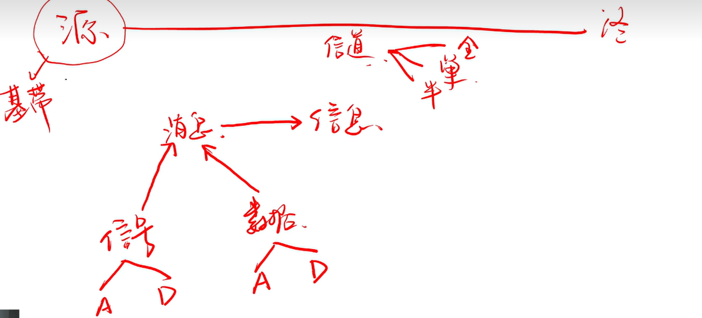
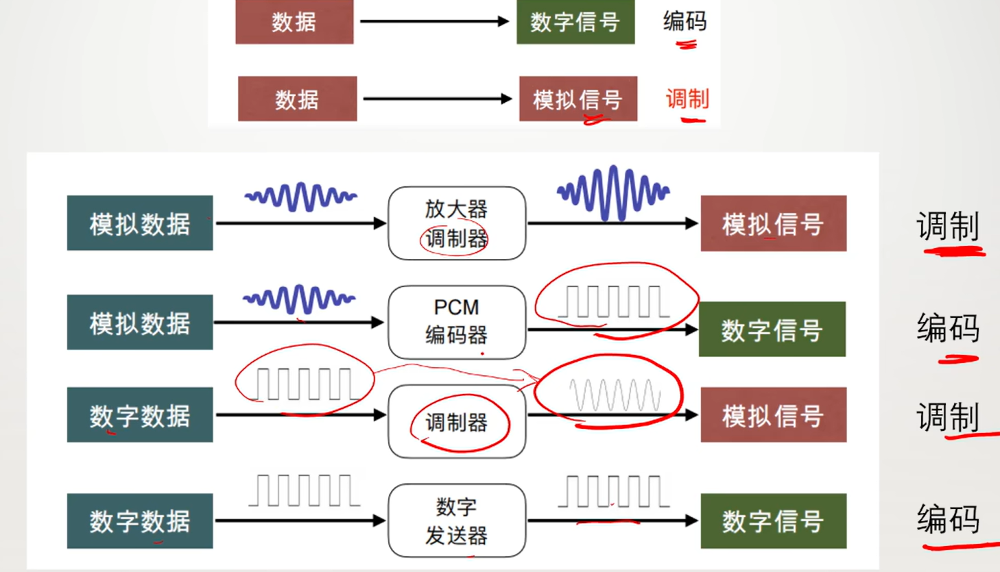
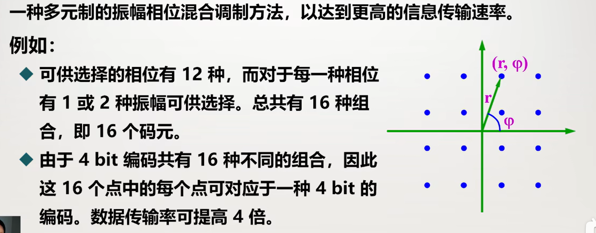
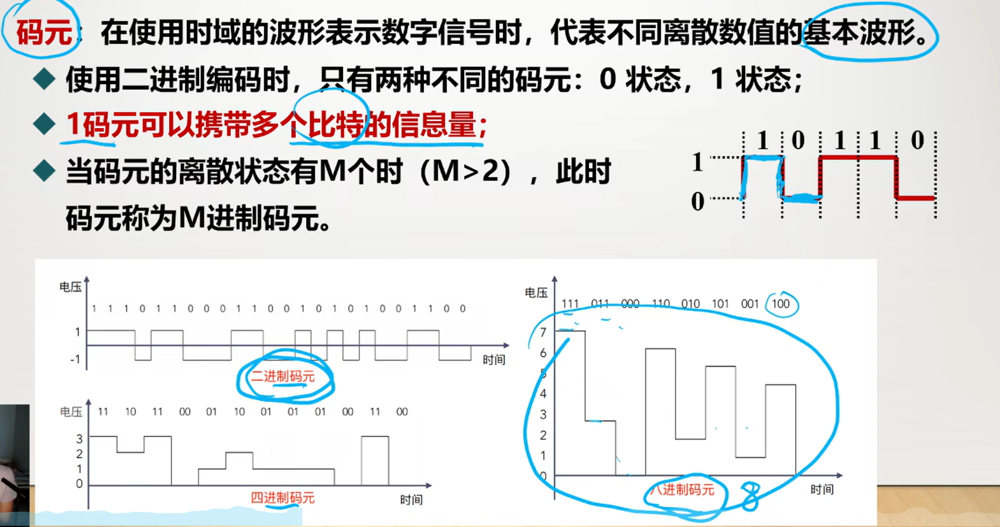
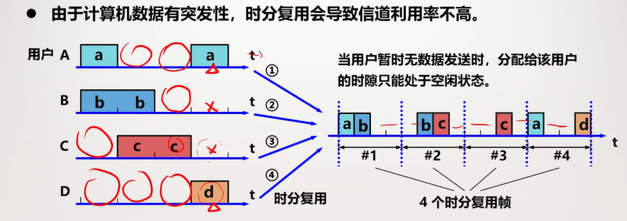

# 物理层

## 物理层的基本概念

### 位置：**在网络体系结构的最底层**

**不是**具体的传输媒体，也**不是**连接计算机的具体的物理设备

### 功能：**如何在连接各种计算机的传输媒体上传输数据比特流**

数据链路层将比特流传给物理层

物理层将比特流按照传输媒体进行**编码**

通过传输媒体传输给下一个节点的物理层

### 作用：尽可能**屏蔽掉不同传输媒体和通信手段的差异**

为数据链路层提供统一的传输服务

物理层的协议也叫物理层**规程**

### 主要任务：确定传输媒体的**接口**的有关特性

#### DTE：数据终端设备

有数据处理和转发能力的设备

可以是数据的源头或起点

#### DCE：数据电路终结设备

在DTE和传输线路间提供信号

变换和编码

建立、保持和释放数据链路

### 物理层协议(规程)

物理层协议是DTE和DCE间的约定，规定了标准化的DTE/DCE皆有的特性

#### 机械特性

接口尺寸、形状、引线数目和排列等

#### 电气特性

电压、阻抗、传输速率

#### 功能特性

某条线在某个电平的电压的意义，每个引脚的作用

#### 过程特性

不同功能各种可能事件出现的顺序

## 数据通信的基本概念

### 通信系统的模型

可划分为三大部分：源系统(发送方、发送端)，传输系统(传输网络)，目的系统(接收端、接收方)

#### 常用术语

**通信**：是在源点与终点之间传递**消息或信息**，但信息和消息不一样

**消息**：文字，符号，数据，语音和图像等

**信息**：包含在消息中，对通信者有意义的部分，**消息是信息的载体**

**数据**：数据是有意义的符号原始表达，是**运送消息的实体**，分为模拟数据和数组数据

**信号**：**信号是消息的载体**，是数据的电气或电磁表现

**信道:**信号传输的通道(传输媒介)，按照传送方向和时间的关系，可分为三类：

单向通信(**单工**)：只有一个方向通信

双向交替通信(**半双工**)：双方都能发，但不能同时

双向同时通信(**全双工**)：可以同时发送接收

**基带信号**：基本频带信号

信源发出的没有调制的原始信号，包含较多低频甚至直流成分，但是很多信道不允许低频信号

**调制**：让信号可以在相应信道中传输

**基带调制(编码)**：仅对基带信号的波形进行变换，把数据信号转换成另一种形式的数字信号

**带通调制**：使用**载波**进行调制，把基带频率范围转移到较高频段，并**转换为模拟信号**，经过载波调制后的信号成为带通信号

#### 常用编码方式

**不归零制**：正电平代表1，负电平代表0。这种方式下不能根据信号本身找到时钟周期

**归零制**：正脉冲代表1，负脉冲代表0。脉冲就是在周期中心上跳下来或下跳上来

**曼彻斯特编码**：在周期中心向上跳是0，在周期中心向下跳是1

**差分曼彻斯特编码**：若下一个是0，则在边界跳变，若是1，则不变

频率：曼彻斯特和差分曼彻斯特编码产生的信号频率比不归零制高

自同步能力：不归零制没有自同步，曼彻斯特和差分曼彻斯特有自同步

#### 基本的带通调制方法

**调幅AM**：载波的振幅随基带信号变化

**调频FM**：载波的频率随基带信号变化

**调相PM**：载波的初始频率随基带信号变化

通过基本的带通调制方法，把基带信号搬移到更高的频率上去

正交振幅调制QAM，振幅和相位混合调制

**码元：**在使用时域的波形表示数字信号时，代表不同离散数值的基本波形

**一个码元可以携带多个比特的信息量**

**波特**：就是单位时间传送的码元个数

### 信道的极限容量

 任何实际信道都不是理想的，可能受到干扰而失真

严重失真时可能会无法识别

产生失真的原因：距离远、传输媒体质量差、噪声干扰、码元速率过高(**不可能**速率无限大)

#### 影响码元速率的因素：

#### 信道能通过的频率范围

当码元传播速度过快时会出现**码间串扰**(接收端收到的信号失去了码元间的清晰界限)

为了避免其过于严重，在理想条件下推导出了**奈氏准则**

##### 奈氏准则 

在带宽为W(单位HZ)的理想低通信道(无噪声，带宽受限)中信道上，
$$
码元传输的最高速率=2W(码元/秒)
$$
 信道频带越宽，能通过的信号的高频分量越多，那就可以用更高速率传送码元而不出现码间串扰。

奈氏准则给出的是码元传输速率的限制，没对信息传输速率做出限制

在v进制码元的情况下
$$
理想低通信道的极限数据传输率=2W\log_2v (bit/s)
$$

#### 信噪比

信噪比就是信号的平均功率和噪声平均功率之比，常记作S/N，是个没有单位的比值，但是可以用分贝(dB)表示，下面是和分贝的换算公式，其实它们数值上是相等的，但是分贝更易记录
$$
信噪比(dB) = 10\lg(S/N)(dB)
$$
香农公式提出，信道的**极限无差错**的传输速率C为

**注意，若给的S/N是分贝，要化回比值再算**
$$
C = W\log_2(1+S/N) (bit/s)
$$
香农公式表明，**信道的带宽越大或信噪比越大，极限传输速率就越大**

香农公式的意义：只要信息的传输速率低于极限信息传输速率，就一定能找到某种方法实现无差错传输。

### 奈氏准则和香农公式的意义

## 物理层下的传输媒体

传输媒体就是发送器和接收器间的传输媒体

分为**导引型**和**非导引型**

### 引导型

双绞线(不超过100米)，带宽最大能到50Gbit/s

同轴电缆，带宽能接近1Gbit/s

光缆：使用光脉冲进行通信

发送端要有光源，能产生光脉冲，接收端要有光检测器

### 非导引层

用无线电通信

在空间主要是**直线**传播

短波可以通过电离层反射

微波：要么用**微波接力**，要么采用**卫星中继**

## 信道复用技术

### 为什么要信道复用

信道**资源是有限**的，实际网络中多对用户往往需要利用相同的信道传输信息

但是不同信号同时在同一信道传输可能会产生严重的**相互干扰**

### 什么是信道复用

**多路复用技术**：把多个信号组合在一条物理信道上传输，共享信道资源，提高信道利用率，降低成本

### 频分复用FDM

把带宽(Hz)分成多份，每个用户使用一个频带，在通信过程中**一直**使用它

也就是所有用户在**同样的时间**占**不同的带宽**资源

可以**充分利用带宽，效率高，易实现**

可以让N个用户个使用一个频带，也可以让很多用户**轮流使用**这N个频带，这种方式成为**频分多址接入(FDMA)**，简称**频分多址**

### 时分复用TDM

只使用频分复用可能会有些频带大部分是闲置的，所以有了时分复用

时分复用频率是一样的，但是在时间上分为许多个TDM帧，周期性出现，复用的n个用户，每个占用一个帧(125微秒)的1/n，不论每个用户是否有数据传输，在它分配的时间里，其他用户都要等待

让N个用户各使用一个间隙，或让更多用户轮流使用这些间隙，这种方式称为**时分多址接入(TDMA)**，简称**时分多址**

**由于计算机数据有突发性，时分复用效率不高**

### 统计时分复用STDM

也叫异步时分复用

多个用户连接一个集中器，把数据发往集中器，复用器按顺序扫描，把复用器的数据放入STDM帧中，**帧满**了就发出

STDM**不是固定分配时隙**，而是按需**动态分配时隙**

适合突发数据多，用户多，数据少的时候

### 波分复用WDM

就是光的频分复用

将两种或多种**不同波长**的光载波信号，在发送端径复用器把光载波信号汇合在一起使用**一根光纤来同时传输多个光载波信号**

### 码分复用CDM

每一个用户可以在**相同的时间**使用**相同的频带**进行通信

各用户经过特殊挑选的码型传输数据，不会产生相互干扰

当CDM为多个用户共享时，就称为**码分多址**

#### 发送原理

把原来一个比特的时间分为m个短的时间间隔，称为码片

**每个站**有一个自己**唯一**的**码片**序列

若该站想发1，这改为发送这个m位的码片序列

若想发0，则发码片序列的反码

这样做，原来要发送的数据率是b bit/s，现在就变成了mb bit/s了

**实现了扩频**，但对单个信号也增加了消耗的带宽，不过由于可以和其它用户公用，整体是高效的

#### 接收原理

首先对每个站的码片序列有要求，相互之间**码片各不相同，且相互正交(内积为0)**

每个码片与自己的**规格化内积为1**(自己的内积除以m)

与自己**反码的内积为-1**

在发送时，直接把几个站使用码片变换后的数据直接叠加进行传输

在接收端，对每一段时间间隔，使用各个站的码片和收到的信号向量做规格化内积

若内积为1，则该站这个时间间隔发送的是1；

若内积为-1，则说明发送的是0；

若内积为0，则说明该站在这个时间间隔没发送数据

#### 优点

保密性高，发送过程中，不知道码片无法得知传送的信息。

效率高，可以多个用户公用。

