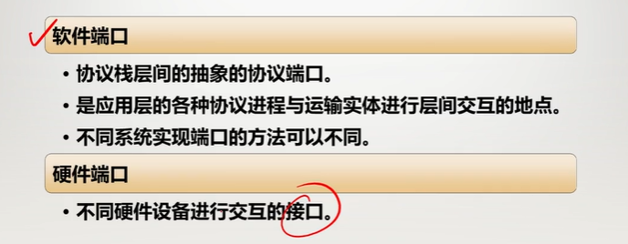
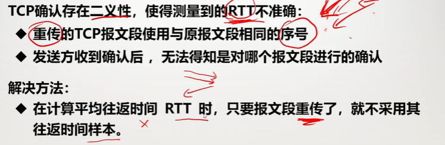

# 运输层

## 运输层要解决的问题

前几层仍遗留了一些问题：

- 参与通信的主机里，不知道是谁在发送和接受应用程序
- 没有完全实现可靠传输的问题

### 进程间的通信

主机间的通信，实际上是两台主机的**应用进程之间的通信**。而且往往是多个进程同时和另一台主机多个进程的通信

**发送方复用**：多个应用进程使用一个运输层协议传输数据

**接收方分用**：在接受到报文后，能正确交给正确的应用程序

有点像物理信道的复用

### 运输层提供的服务

传输层**依赖并扩展网络层的服务**：

传输层可以通过差错恢复、重排序等手段**提供可靠、按序交付**的服务

但是无法提供延迟保证、带宽保证等服务

#### 最低限度的服务：进程到进程的数据交付

运输层提供应用进程间的逻辑通信，在两个运输层实体之间建立**端到端的逻辑通信信道。**

它向高层用户**屏蔽**了下层网络核心的细节

#### 最低限度的服务：差错检测

#### 提供的增强服务

**可靠传输**

**流量控制**

**拥塞控制**

### 运输层的两个重要标准

**用户数据报协议UDP**

**传输控制协议TCP**

#### 可靠信道与不可靠信道

TCP是可靠信道，UDP是不可靠信道

#### 运输协议数据单元

两个对等运输实体在通信时传输的数据叫**运输协议数据单元TPDU**

TCP的数据单位协议是**TCP报文段**

UDP传送的数据单位协议是**UDP报文或用户数据报**

#### TCP与UDP的区别

最大的区别就是：

TCP要提供可靠服务，所以要先建立连接。要满足基本服务和增强服务。且只能一对一。

UDP不提供可靠服务，不提前建立连接。只满足最低限度服务

#### 复用TCP和UDP的协议

UDP：

域名解析服务DNS、动态主机配置DHCP、路由选择RIP、文件传输TFTP、流式多媒体通信

TCP：

万维网的HTTP、电子邮件SMTP、文件传送FTP、远程终端接入TELNET

### 运输层的端口

**复用**：所有进程都可以通过运输层再传送到IP层

**分用**：运输层从IP层收到发送给应用进程的数据后，必须交给**指明的**应用程序

为此要为每个数据指明端口

**协议端口号**，简称为**端口**

**端口是通信的抽象终点**

可以在一台主机上准确找到某个进程

不受操作系统限制

可以实现异构系统间的通信

以上指的是软件端口：

协议栈层间的抽象协议端口

是应用层各种协议进程与运输实体进行层间交互的地点

不同系统实现端口的方法可以不同

硬件端口指的是：不同硬件设备进行交互的接口

#### 端口的表示

端口用一个**16位的端口号**进行标志，允许有65535个不同的端口号

端口号只有**本地意义**，是为了**标志本计算机应用层的各个进程**

不同计算机间相同端口号没有联系

#### 服务器端使用的端口号

**熟知端口号(系统端口号)**：数值一般在0~1023，由公共域协议使用

**登记端口号**，数值为1024~49151，为没有熟知端口号的应用程序使用，需要在IANA登记才能使用

#### 客户端使用端口号

也叫**短暂端口号**：49452~65532，给客户端程序进程短暂使用，使用完要释放

### 套接字socket

**通信需要同时知道对方的IP地址和端口号**

socket=(IP地址：端口号)。例如192.168.0.1:80

#### UDP的套接字

UDP的套接字使用**<IP地址，端口号>**进行标识

<目的IP，目的端口号>相同的报文**交给同一个**套接字

与<源IP，源端口号>**无关**

#### TCP的套接字

由于TCP是一对一的，所以更复杂一些

TCP的套接字需要用**<源IP，目的IP，源端口号，目的端口号>**进行标识

**且一个源端口只能和一个目的端口通信**，所以一个主机上的多个应用程序要和别的主机通信，需要准备多个套接字

## UDP

#### UDP概述

网络层服务：

- 尽最大努力将数据报发送给主机
- 不保证可靠传输
- 不保证带宽和延迟

UDP只在IP数据报服务之上**添加了一些功能**

**复用和分用**

**差错检测**

#### UDP的主要特点

1. **无连接**：发送数据之前不需要建立连接

2. **使用尽最大努力交付**：也就是不保证可靠交付

3. **面向报文**：UDP溢出传送和交付一个完整的报文

   > **发送方**：应用层的报文，既不合并也不拆分，按原样发送
   >
   > **接收方**：UDP对IP层发送上来的UDP用户信息数据报，**去掉首部后就原封不动**的交给上层的应用程序，一次交付一个完整的报文
   >
   > (下层可能会对报文进行分片或合并，但是对运输层是透明的，不用在意)
   >
   > 
   >
   > 这种简单的方式会有一些问题：
   >
   > **应用程序必须选择大小合适的报文**
   >
   > 若报文太长，IP层要进行分片，降低IP层效率
   >
   > 若报文太短，则首部相对长度太大，降低IP层效率

4. **没有拥塞控制**：不会因网络拥塞降低源主机的发送速率，适合实时的多媒体通信

5. 支持**一对一、一对多、多对一、多对多**等交互通信(一和多在这里指端口)

6. **首部开销小**：只有8个字节

##### 为什么需要UDP

应用可以尽可能快的发送报文

- 无建立连接的延迟
- 不限制发送速率(没有拥塞控制和流量控制

报头开销小

协议处理简单

##### 适合于哪些应用

容忍丢包但对延迟敏感的应用：IP电话、视频会议、多媒体应用

以单次请求/响应为主的应用：DNS、RIP、DHCP等

若应用要求基于UDP实现可靠传输：则由应用层实现可靠性

### UDP的首部

**源端口**：16位，2个字节。在需要对方回信的时候选用，不用可全0

**目的端口**：16位，2个字节。若接收方UDP发现目的端口号**不正确**(也就是没这个应用程序)，则**丢弃**该报文，并用**ICMP发送“端口不可达”**差错报文

**长度**：16位，2个字节。整个用户数据报(含首部)的长度，最小值为8(仅有首部)

**检验和**：检测UDP数据报传输过程中是否有错，首部和数据一起参加计算，错误就丢弃

> 但是因为每个IP地址的端口号是可重复的，需要判断是否是源IP地址发送来的，所以检验和还要进行这个判断
>
> 计算检验和的时候，需要加上一个12字节的**伪首部**，包括源IP地址、目的IP地址、俩标志位、UDP长度，一起进行计算检验和（这个伪首部，仅仅为了计算检验和，并不发送）
>
> 接收方也加上你这个伪首部判断检验和是否出错
>
> 

## TCP概述

TCP是**面向连接**的运输层协议，在无连接不可靠的IP层服务之上**提供了可靠交付**的服务，为此在IP数据报服务之上，添加了一系列措施

### TCP的主要特点

1. 是**面向连接**的传输层协议

2. 每一条TCP连接只能有两个端点，每个TCP连接只能是**点对点**的(一对一)

3. 在IP服务之上，提供面向连接的**可靠交付**服务：流水线式发送、报文段检错、丢失重传等。

4. TCP提供**全双工**通信，发送方和接收方都可以同时与对方收发数据

   > ***可靠性保证总结***
   >
   > **面向连接的电路交换(物理层保证)**：
   >
   > 通信双方必须有一条物理连接的通路(直接相连)，且被双方**独享**，数据按序发送并按序接收
   >
   > **面向连接的虚电路(网络层保证)**：
   >
   > 双方采用复用技术，逐段占用物理通道，每段物理通路可被多对通信使用，分组按序发送并按序接收
   >
   > **面向连接的TCP(运输层协议保证**)：
   >
   > 采用协议的方法(**确认、序号、重传**)，确保通信双方有一条全双工的、可靠的逻辑信道(实际上提供服务的IP数据报是不可靠的)，字节按序发送，并能按序接收(但是数据报不一定是按序到达的)
   >
   > 

5. **面向字节流**

   > TCP中的流指的是流入或流出的字节序列
   >
   > **面向字节流**：可靠、有序的字节流，不保留报文边界
   >
   > 发送的字节流和接收的字节流完全一致，但是报文大小和边界不一定相同(这是TCP会把报文分段、拼接导致的)
   >
   > 
   >
   > 

### TCP首部

TCP传输的数据单元是报文端。

一个TCP报文段分为首部和数据两部分

TCP报文首部的前20个字节是固定的，后面有4n字节是根据需要而添加的选项。**TCP首部最小长度是20字节**

#### **源端口和目的端口**：

都是16位，2字节。就是端口号

#### **序号seq**：

32位，4个字节。TCP传输中传送的数据流中的**每一个字节**都有一个序号。序号的值指的是**本报文所发送的数据的第一个字节的序号**(也就是每一个报文里的序号都一样，都是第一个的)

#### **确认号ack**：

32位4个字节。是**期望收到**的**对方**下一个报文段的数据的第一个字节的**序号**。(也就是上次对方发的数据(确认号之前)我都收到了，下次给我发这之后的)

#### **数据偏移**：

4位。指出TCP报文段的**数据起始**处距离**报文段起始**处有多远，也就是**TCP首部的长度**。**1比特算4个字节**。(也就是首部最长15*4=60个字节)

#### 保留位(6位，暂时没用)

#### 6个标志位(每个1位)：

##### 紧急URG(相当于高优先级)：

当URG=1，表明紧急指针字段有效，告诉系统此报文段中有紧急数据，应当尽快传送

##### 确认ACK(判断确认号有效)

当ACK=1，确认号字段才有效(确认号是ack，这里是ACK)，只有在最开始的时候才为0

##### 推送PSH(Push)(尽快提交，不等缓存)

接收TCP收到PSH为1的报文段后，就尽快(推送)交付给应用进程，而不用等整个缓存填满

##### 复位RST(Reset)(重新建立连接)

当RST=1，表面TCP连接中出现严重差错(如主机崩溃)，**必须释放连接重新建立连接**

##### 同步SYN(Synchronization)(连接请求或连接接受)

当SYN=1，说明这是个连接请求或者连接接受请求

当SYN=1，ACK=0，表明是**连接请求**报文段

当SYN=1，ACK=1，表明这是**连接接受**的报文段

之后其它情况都是0了

##### 终止FIN(Finsh)(数据发完，请求释放连接)

FIN=1，表明发送端数据已经发送完毕，要求释放连接。(这是单方面的，但还能接收)

#### 窗口

16位2个字节。接收方目前允许对方发送的数据量(字节)，窗口值是动态变化的。

#### 校验和

16位2个字节。检验首部和数据部分。与UDP一样，也要加上12字节的伪首部

#### 紧急指针

16位2个字节。**在URG=1时**，指出本报文段中紧急数据的**字节数**(后面就是普通数据)，**也就是指出了紧急数据末尾的位置**

#### 可选项和填充

长度可变，最多40字节

下面是一些可选项

##### 最大报文段长度MSS

就是报文段数据的最大长度

##### 窗口扩大

原先窗口可能太小，可以乘上2的s次方倍

#### 时间戳

占10个字节(80位)，主要有时间戳值字段(4字节)，时间戳回送回答字段(4字节)

主要功能：

- 计算往返时延RTT

- 防止序号绕回 PAWS

  > 2^32的序号空间对于高带宽很容易耗尽，序号重复时，可以把新旧报文区分开
  >
  > 
  >
  > 

- 选择确认SACK

  > 

  

## 可靠传输原理

### 理想传输条件的特点

传输信道不产生差错(不用纠错)

不论发送方以多块的速度发送数据，接收方都来得及处理(不用流量控制)

但是实际网络都**不具备理想传输条件**。必须使用一些可靠传输协议，在不可靠信道实现可靠传输

这部分在数据链路层已经记录过了，再简单来一次

### 停止等待协议SW

#### 无差错情况

但实际上这4个分组都有可能出错

#### 分组错误或丢失

##### 超时重传

#### 确认丢失或迟到

重复确认A并不理会，只要收到一个确认，就说明此确认之前的分组B都成功收到了

#### 停止等待协议要点

其中编号是在TCP报文首部的序号和确认号实现的

这种重传叫**自动重传请求ARQ**

#### 信道利用率

停止等待**降低了**信道利用率

解决办法：通过流水线传输来提高效率。

### 连续ARQ协议(使用了回退N帧)

使用滑动窗口协议来解决上述信道利用率低的问题

先让要发送的数据移入发送窗口(缓存)，位于窗口内的分组都可以被连续发出去，而不需要对方的确认，但是不能发窗口以外的分组

发送方每接收到一个确认，就把滑动窗口向前滑动一个

#### 累计确认

#### 回退N帧协议GBN

#### 与停止等待的对比

## 可靠传输的实现

### 以字节为单位的滑动窗口

TCP使用流水线传输和滑动窗口协议实现高效可靠的传输

TCP滑动窗口是**以字节为单位**的(**TCP报文的每一个字节都有编号**)

发送方A和接收方B都各维持一个**发送窗口**和**接收窗口**

#### 发送窗口

窗口只能向大的方向移动，未收到确认的序号，必须保持在窗口里，且留有备份，以便于丢失后重传

#### 接收窗口

对于回退N帧来说，可以认为接收窗口长度是1，所以接收到一个未按序到达的分组，后续分组全部不接收，让发送方重新发送

#### 窗口的滑动

31未收到，让A重发31后面的数据

按序都收到的数据，可以向前移动

收到确认后，可用窗口增大

A可以一直发，直到可用窗口发完了，这时候要一直等待，知道B发到确认，向前滑动

#### 缓存

发送窗口要比发送缓存小

接收窗口也要比接收窗口小，应用只能读取以按序到达的字节数据

### 超时重传

TCP的发送方若在规定的时间内未收到确认，就要**重传**自己已发送的报文段

但是重传时间不能太短，否则可能引起不必要的重传

也不能太长，可能会使空闲时间增大，降低传输效率

#### 加权平均往返时间

加权平均往返时间$RTT_s$又称平滑的往返时间
$$
新的RTT_s = (1-\alpha) \times (旧的RTT_s) + \alpha \times (新的RTT样本)
$$

#### 超时重传时间RTO

超时重传时间应当略大于平均往返时间$RTT_s$

$$
RTO = RTT_S + 4 \times RTT_D
$$

$$
新的RTT_D = (1-\beta)旧的RTT_D + \beta(RTT_S - 新的RTT样本)
$$

#### Karn算法

由于TCP确认存在二义性，会使RTT不准

重传的TCP报文段使用的是与原报文段相同的序号

发送方收到确认后，无法得知是哪个报文段进行的确认(就是可能收到的会是之前阻塞在网络里的报文段)

解决办法：

**在计算平均RTT时，只要重传了，就不把它当作样本**

#### 修正的Karn算法

使用Karn算法时，当报文的**时延突然增大**很多时，在原来的重传时间内，不会收到确认报文，就会重传，但是根据Karn算法又不会吧重传的往返时间当作样本，**就会导致超时重传时间无法更新，造成很多不必要的重传**

解决办法：

发送重传时，先把超时时间增大

等到不发生报文段重传时，再用往返时延更新平均往返时延和超时时间

### 选择确认SACK

## TCP流量控制

通过确认和重传机制，可以让发送方确认接收方已经正确收到数据

但如果接收方收不到数据，就无法做出确认

如果数据量太大，产生了大量的丢包和重传，就不是一种高效的工作方式了

### 利用滑动窗口实现流量控制

**流量控制**：让发送方发送速率不要太快，使得接收方来得急接收

利用**滑动窗口机制**可以很方便的在TCP连接上实现对发送方的流量控制

其中ACK代表这个报文是确认，ack201代表201之前的都收到了，下一次从201开始发送，rwnd300代表，当前的接收窗口设定成300

当窗口被设置为0，这段时间A就不能给B发数据了，但是一直不发数据就不会收到窗口改变的确认，这就需要在收到0窗口时，启动一个持续计时器

当持续计时器归零后，就发送零窗口探测报文段，等待对方的回复

### TCP的传输效率

TCP发送数据的三种情况：

- 缓存中的数据达到预先设定的最大报文段长度MSS字节时，就组装成一个TCP发送
- 由发送方的应用进程指明要求发送的报文段(Push操作)
- 发送方某个计时器到期了，就报已有的缓存数据(不超过MSS)发送出去

#### 糊涂窗口综合征

产生的原因就是接收方处理数据太慢，接收缓存被占满了

解决办法：

使用Nagle算法，等到数据多一点再发

## TCP的拥塞控制

在某段时间，网络中有许多资源同时产生拥堵的情况，网络性能明显变坏，整个网络的吞吐量将随着输入负荷的增大而下降，这种现象称为**拥塞。**

### 什么是拥塞

起因：

大量分组短时间内进入网络，超出网络的处理能力

1. 节点缓存容量太小
2. 链路容量不足
3. 处理机处理效率太慢
4. 拥塞本身会进一步加剧拥塞

可总结为：

**对资源需求的总和大于可用资源**

### 解决拥塞

拥塞是一个**全局问题**，完了资源增加是有利于解决拥塞的，但是不能完全解决

解决拥塞的办法：**增加资源+控制发送量**

#### 拥塞控制的作用

#### 拥塞控制的一般原理

分为开环控制和闭环控制，开环控制是提前考虑，避免拥塞。闭环控制是实时监控，发现了进行干预解决拥塞

主要使用的是闭环控制

#### 闭环控制的一般思路

发现拥塞：

采取的措施：

发送“通知拥塞发生”的分组给 **源站**

### TCP的拥塞控制方法

TCP采用**基于滑动窗口的方法**进行闭环拥塞控制

发送方维持一个**拥塞窗口CWND**，用于控制发送速率：

拥塞窗口取决于网络的拥塞程度，动态的进行变化

发送端利用拥塞窗口根据网络的拥塞情况调整发送速率
$$
rate = \frac{cwnd}{RTT} (B/s)
$$
当拥塞窗口较大，往返时间较小，发送速率就可以增大，反之就要减小

网络没有拥塞，拥塞窗口就可以增大一点，可以发送更多分组，提高网络的利用率。

网络出现拥塞或可能发生拥塞，就把拥塞窗口减小，缓解网络的拥塞

#### 发送方判断拥塞的方法

超时重传计时器超时：大概率已经发生了拥塞，至少交付能力已经很差了

收到3个重复的确认，说明大概率上上次发的分组是丢失了，可能会发生拥塞，但是交付能力还是有的

#### TCP四种拥塞控制算法

先假设接收方接收能力无限大，发送能力仅限于网络状态的情况下

有这四种算法：慢开始、拥塞避免、快重传、快恢复

***注意，这里窗口的单位和下面窗口的单位都是MSS，所以每次加的不一定是1KB，而一定是一个MSS***

##### 慢开始

目的：探测网络的负载能力或者拥塞程度

算法：从小到大，逐渐加大注入到网络的数据字节数，即从小到大**逐渐增大拥塞窗口**的数值

基本思想：

在新建连接上指数增大cwnd，直至检测到丢包(此时终止)

希望能**迅速增大**cwnd到达可用的发送速度

慢开始门限：防止拥塞窗口cwnd增长过大，引起拥塞

每个RTT加倍

###### 慢开始门限ssthresh的用法

当窗口小于门限，只能用慢开始

大于门限，只能用拥塞避免

等于门限，都可以用

##### 拥塞避免

目的：让拥塞窗口cwnd缓慢地增大，避免出现拥塞

使cwnd按线性缓慢增长

拥塞避免并非完全避免拥塞，而是让拥塞窗口增长的缓慢点，拥塞来的晚些

每个RTT增加1

##### 出现拥塞时(超时)的处理

当网络出现拥塞，发送方**重传定时器超时**：

门限值改为当前窗口值的一半(但是不能小于2)
$$
ssthresh = max(\frac{cwnd}2,2)
$$
窗口值置为1
$$
cwnd = 1
$$
执行慢开始算法

这是为了迅速减少主机发送到网络中的分组数，使得发生阻塞的路由器有足够时间把积压的分组处理完毕

##### 快重传FR

目的：为了让发送方**尽早**知道发生了个别报文段的丢失

发送方只要收到**3个重复的确认**，就**立即进行重传**，这样就不会超时

快重传要求接收方**立即发送确认**即使收到了失序的报文段，也要对之前已经收到的报文段重复确认

##### 快恢复FR

当发送端收到3个连续的重复确认时，不执行慢开始，而是执行快恢复算法FR：

先让门限值改为当前窗口值的一半
$$
ssthresh = \frac{cwnd}{2}
$$
让当前窗口值改为当前门限值(也就是当前窗口值的一半)
$$
cwnd = ssthresh
$$
执行拥塞避免算法

目的：减少一些主机发送的分组数，避免进一步加剧拥塞，但是又不至于让网络性能下降太多

#### TCP拥塞控制总结

如图，门限值之前，慢开始；超过门限，拥塞避免；超时，门限为窗口一半，窗口变1，进行慢开始；遇到3个重复确认(快恢复)，进行快恢复，然后拥塞避免。

##### 加法增大，乘法减小AIMD算法

##### 拥塞控制和流量控制的区别

流量控制，是只考虑接收方发情况，判断自己的发送速率

拥塞控制，是考虑整个网络的情况，判断自己最多能发多少

##### 发送窗口上限值

所以说发送窗口的上限值，应当是这两者间较小的那个
$$
发送窗口的上限值 = \min[rwnd,cwnd]
$$

#### 主动队列管理AQM

如果使用路由器默认的尾部丢弃策略

若同时来了一大波数据，全部丢弃，过一段时间，这些数据又会同时重传到这里，再次产生拥塞，这就叫**全局同步**

为了解决这种情况，可用使用主动队列管理

在队列长度到达某个警惕的值时，就要主动丢弃一些分组，避免全局同步

增加比较流行的一个方法就是随机早期检测RED

##### 随机早期检测RED

可以延缓拥塞的发生。

但是最近已经不推荐使用RED

## TCP的运输连接管理

TCP是面向连接的协议

TCP连接有三个阶段：连接建立、数据传输、连接释放

### TCP的连接建立

连接建立要解决3个问题：

1. 每一方都能确定知道对方的**存在**
2. 要允许双方**协商**一些参数(如最大窗口值、是否使用窗口扩大选项、时间戳、服务质量等)
3. 能对运输实体资源(如缓存大小、连接表中的项目等)进行**分配**

TCP连接的建立采用**客户服务器**方式(C/S)

TCP建立连接的过程叫做握手，需要交换3次报文段，所以叫做**三报文握手**

B是服务器，A是客户机，所以B是被动打开连接，A是主动打开连接

A先给B发送连接请求，SNY=1，ack=0，假设seq=x

B接收到后，同意进行连接，所以要先进行对上个报文的收到，并且和A连接所以

SNY=1，ACK=1，ack=x+1，假设它的seq=y

A收到B的确认和连接请求，则对这个请求进行确认

SNY=0(因为这已经不是连接的报文了，所以置为0)，ACK=1，ack=y+1，seq=x+1

**最后一次A的确认是为了防止已经失效的连接请求到达B**

### TCP的连接释放

连接的释放稍微复杂一些

在数据传输结束后，通信**双方**都可以释放连接

连接的释放是**四报文握手**

假如A数据先传输完毕，则A为主动关闭

A发送关闭连接报文，FIN=1，假设seq=u

B收到后，发送确认，ACK = 1，ack = u+1，假如seq=v，此后，A不再向B发送数据，但是B还能给A发送数据

当B也不用给A发数据时，B给A发送关闭连接的报文，**FIN=1，ACK = 1，ack = u+1，假如seq = w**(注意这里发送的是确认报文，确认的是之前A关闭连接的报文，而且由于期间B还能给A发数据，所以seq不一定是v+1)

则A向B回复确认，ACK=1，ack=w+1，seq=u+1

由于A发出的确认分组不一定能到B，若没有其它处理，B就会重发关闭请求给A，但A已经关闭了，不会回应，就会出现B的资源关闭不了

所以要在A处设置一个计时器(**时间等待计时器**)，等待2MSL，A再进行关闭，这样能保证B如果没有接收到确认，重传的请求能让A接收

其中MSL是最长报文段寿命，建议的时间为2分钟

### TCP的四个计时器

保活计时器：

### TCP有限状态机

