# 应用层

 

应用层的具体内容就是规定应用进程在通信过程中所遵循的协议

大多数协议都是基于客户端服务器模式

## 域名系统DNS

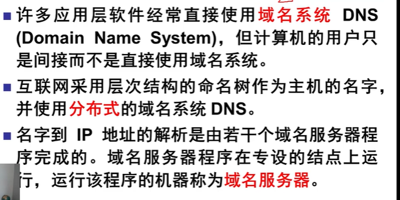

### 互联网的域名结构

每个域名都是唯一的(不能超过253个字符)

域名的结构由标号序列组成，各标号之间用点隔开

域名等级是倒序排列的

**域名只是个逻辑概念，与物理地址无关，其中的点和IP地址也无对应关系，与子网划分也没有关系**

### 顶级域名

1. 国家顶级域名

   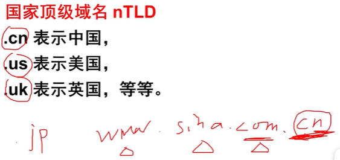

2. 通用顶级域名

   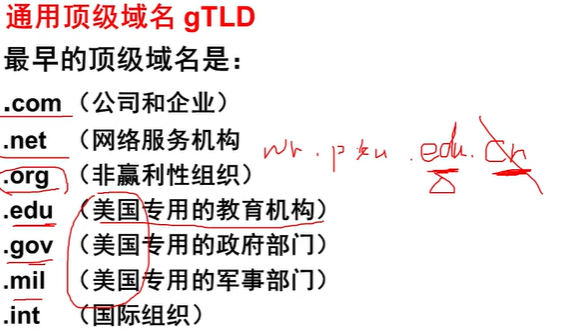

### 域名服务器

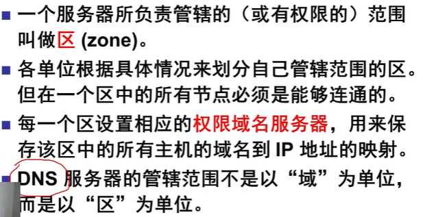

一个服务器所管辖的范围叫做**区**

每个单位自己划分区，一个区中的所有单位必须是要能互联的

每一个区设置相应的**权限域名服务器**，用于保存该区中的所有主机的域名到IP地址的映射

DNS服务器的管辖单位是区

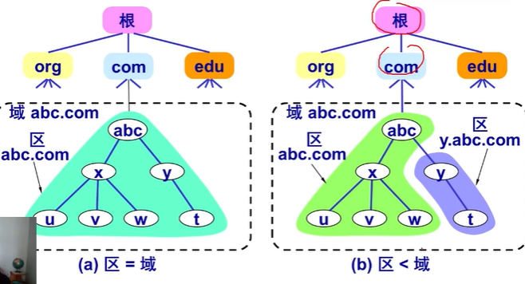

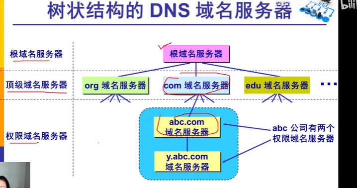

#### 根域名服务器

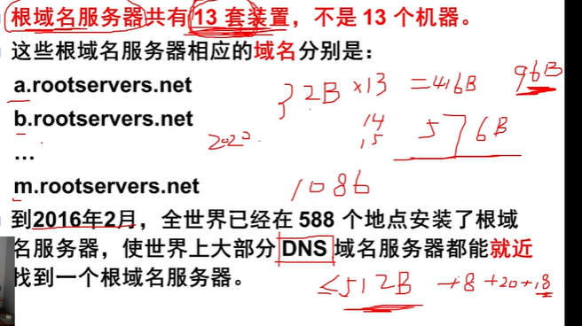

#### 顶级域名服务器

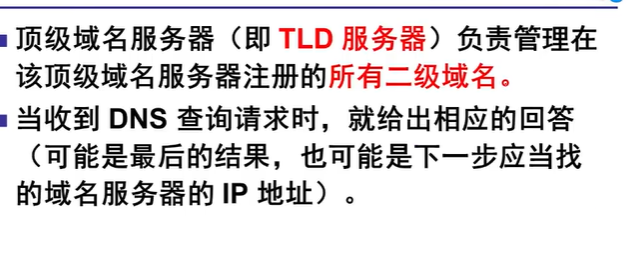

#### 权限域名服务器

这就是负责一个区的域名服务器

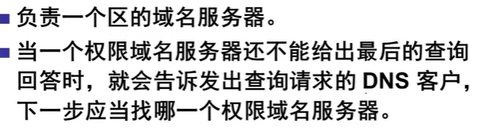

#### 本地域名服务器

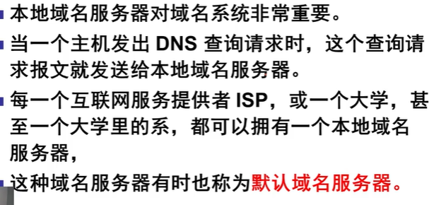

它可以提高查询的效率，降低外部服务器的负担

#### 提高域名服务器的可靠性

把数据复制几份，一个是主域名服务器，剩下的是辅助域名服务器

这样主域名服务器崩溃了，DNS还能由辅助域名服务器进行

### 域名解析过程

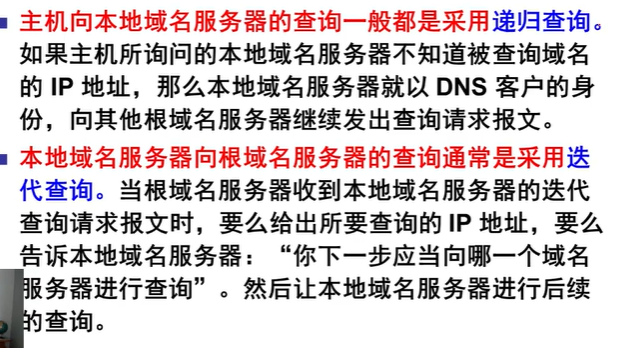

主要有两种查询方式，一种是递归，另一种是迭代

在主机向本地域名服务器请求的时候使用**递归查询**，也就是向本地域名服务器发请求，本地域名服务器查询结束获得IP后返回给主机

但是本地域名服务器查询IP地址的时候又分为递归查询和迭代查询，递归查询和上面的一样，就是会交给根域名服务器，让它来查，查完在交回来，根又去找顶级。。。直到找到

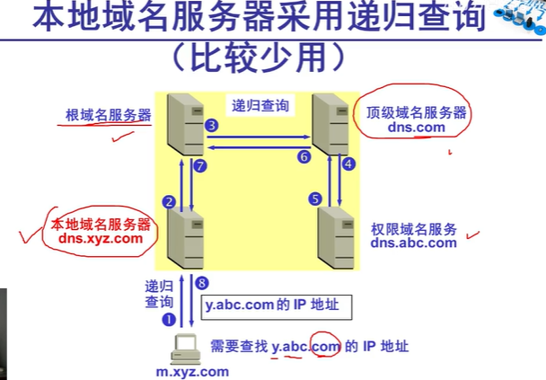

迭代查询稍微有些不一样，是本地域名服务器先询问根域名服务器，根域名服务器查询目的域名是在哪的，如果自己有，就直接交给本地，如果没有，那就告诉本地的要去哪个服务器查询，直到查到

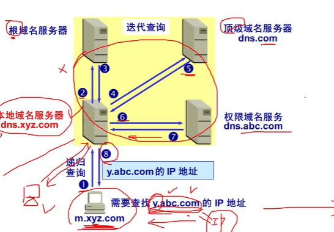

**作为用户，不管采用哪种方式，都是先和本地域名服务器进行查询**

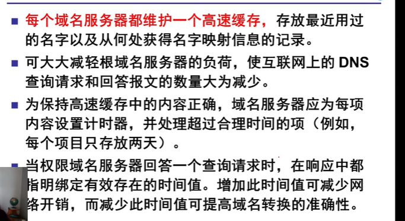

## 文件传送协议FTP

### FTP的特点

使用TCP实现可靠传输

FTP可以减少或消除不同操作系统的不兼容性

FTP使用客户服务器方式，一个FTP服务器可以为多个用户进程提供服务。

FTP的服务进程分为两个部分，一个是主进程，负责接收新的请求，另外有从属进程，负责处理单个请求

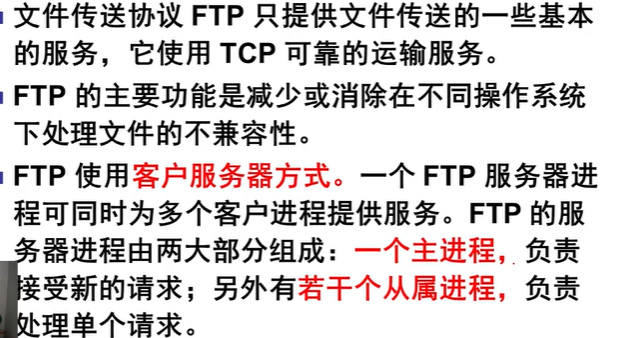

### 工作步骤

打开**熟知端口21**，使得客户进程能连上

等待客户连接，启动从属进程处理。处理完毕后继续等待

这是控制连接，它会在整个会话期间一直打开，但是不传送文件

实际用于传输文件的是**数据连接(端口20)**

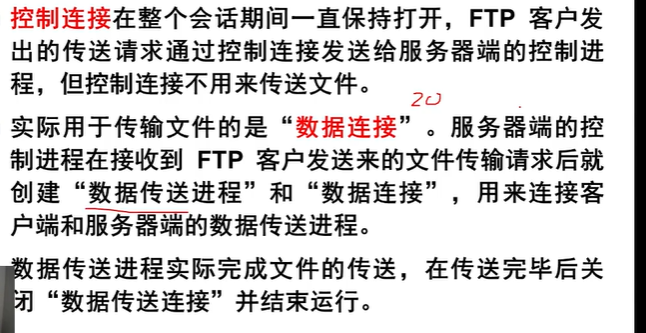

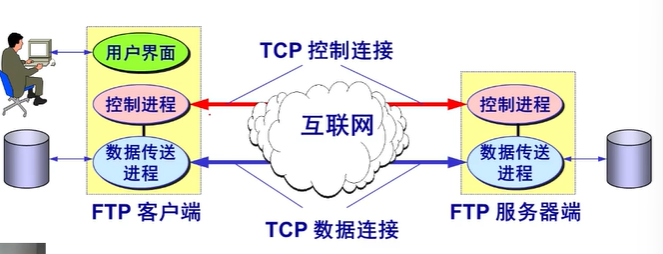

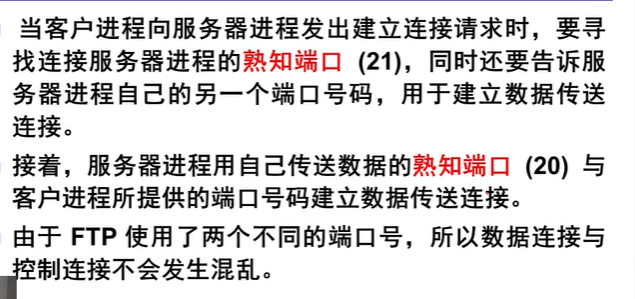

### 简单文件传送协议TFTP

基于UDP

用于传输更小的文件，不用身份验证，不会列出目录

**端口就一个，是69**

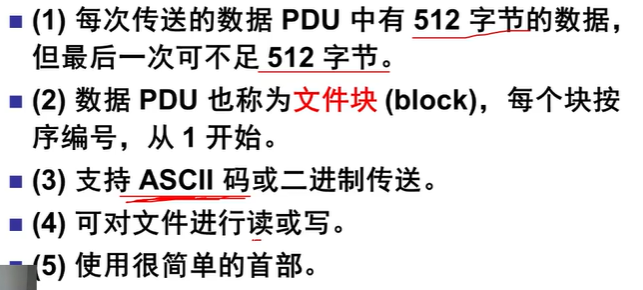

#### 工作步骤

很像停止等待协议

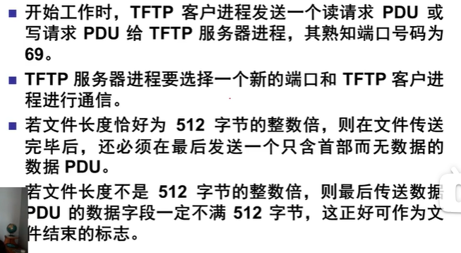

## 远程终端协议TELNET

TELNET是一个简单的远程终端协议，使用TCP连接注册到远程的另一台主机上(使用主机名或IP地址)

可以把用户的指令传到远程主机

**端口是23**

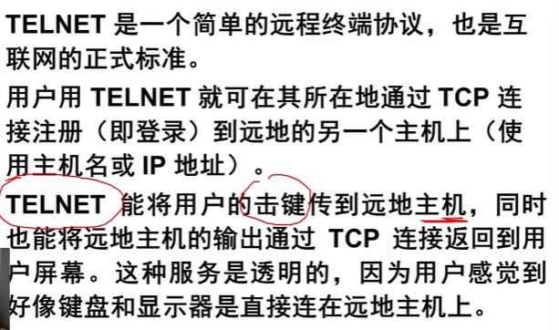

使用的客户服务器方式

#### 虚拟网络终端NVT

NVT可以把本地的指令转换成远地主机系统里的指令格式

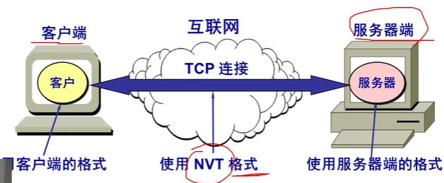

## 万维网WWW

### 万维网概述

它并不是某种特殊的计算机网络

万维网是一个大规模的、联机式的**信息储藏所**

用链接的方式在互联网上的一个站点访问另一个网站

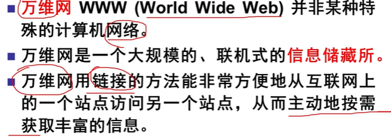

提供的是分布式服务

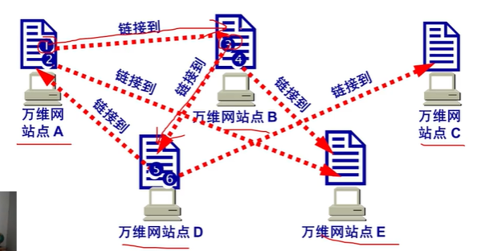

万维网是分布式超媒体系统

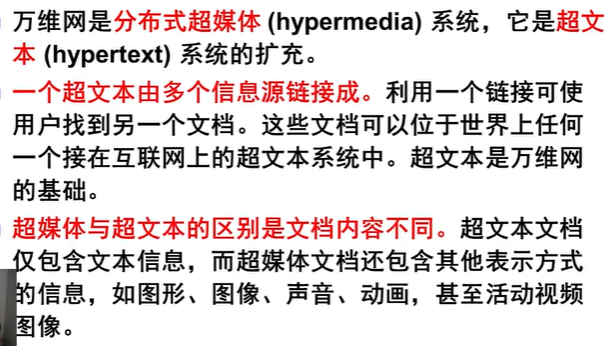

采用客户服务器方式工作

#### 万维网必须解决的问题

##### 如何标志分布在互联网上的文档

使用统一资源定位符URL来标志文档，每个文档有唯一的URL

##### 用何协议实现万维网上各种超链的链接

使用超文本传送协议HTTP。HTTP是应用层协议，采用TCP传输。

##### 如何使万维网各种文档都在计算机上显示出来

使用超文本标记语言HTML

##### 怎样方便的找到资源

使用搜索引擎

### 统一资源定位符URL

#### 一般形式

$$
<协议>://<主机>:<端口>/<路径>
$$

其中，主机指的是IP地址或者域名

协议指的是采用的协议，如ftp、http等等(http或https会默认使用)

端口会默认使用协议的端口，此时可不写

### 超文本传输协议HTTP

HTTP是**面向事务的应用层协议**，他是万维网能可靠交换文件的重要基础

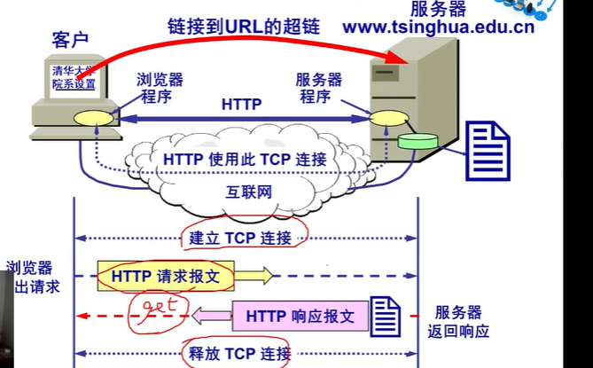

#### 点击URL后发生的事件：

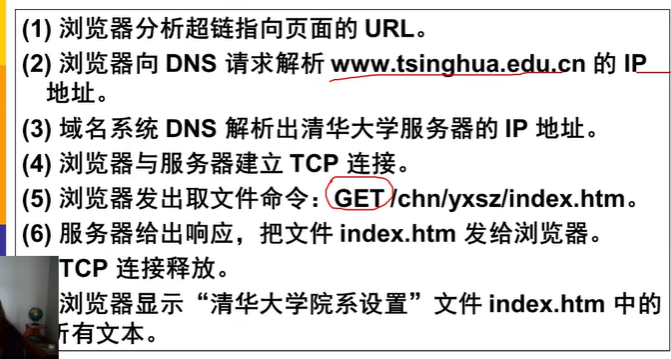

先是浏览器解析，判断是哪个域名

向DNS请求解析该域名

DNS解析出IP地址返回

浏览器与服务器建立TCP连接

浏览器发送GET请求

服务器做出响应

TCP连接释放

浏览器展示

#### HTTP的特点

HTTP是面向事务的客户服务器协议

HTTP1.0是**无状态的**，每一次连接只有一次，就会断开

虽然他在运输层使用了TCP，但是HTTP协议本身是**无连接的**，即不需要收到对方的确认

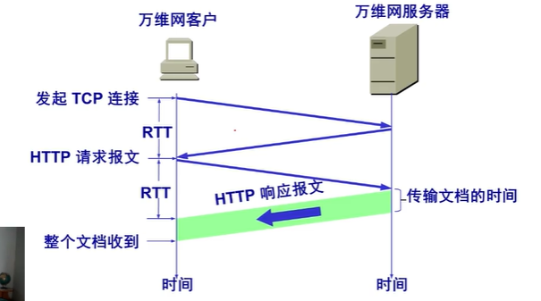

HTTP/1.1使用**持续连接**，服务器发送响应后，在一段时间内都会保持，可以继续交换报文

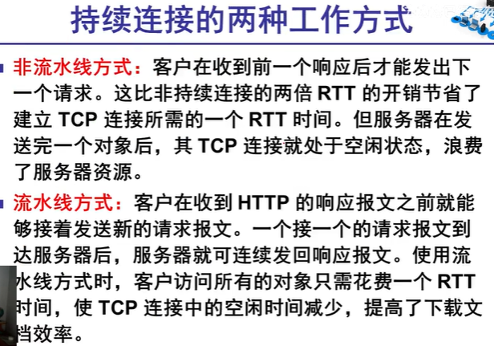

HTTP/2.0可以多路复用，一次取多个数据

#### 代理服务器

代理服务器又称万维网高速缓存，它代表浏览器发出HTTP请求

它会把最近的一些请求和响应暂存在本地磁盘，如果有相同的新请求，就把把暂存的发过去，不用再去网络请求

也能屏蔽掉内网的细节

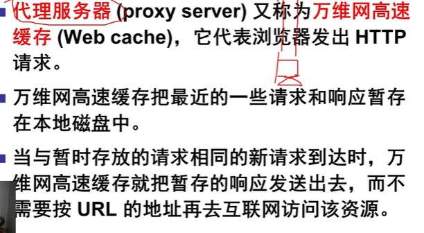

#### HTTP的报文结构

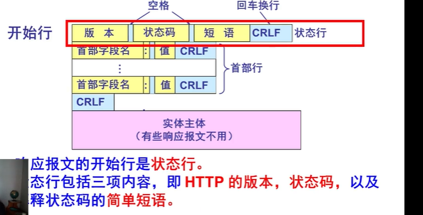

#### 服务器存放用户信息

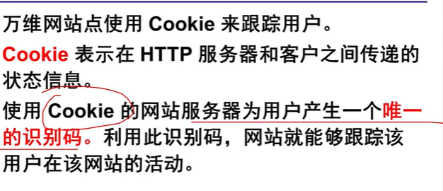

### 万维网的文档

#### 超文本标记语言HTML

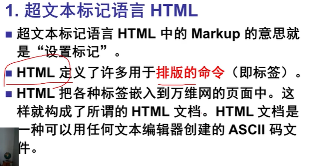

##### XML:

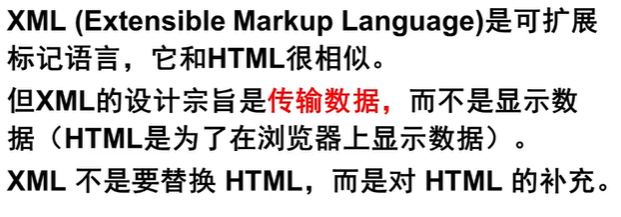

#### 动态万维网文档

数据可以刷新

### 万维网的信息检索系统

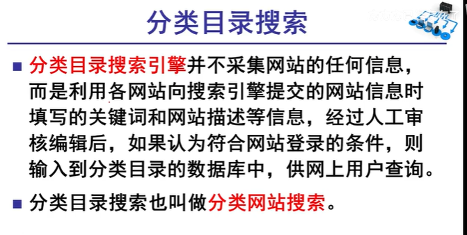

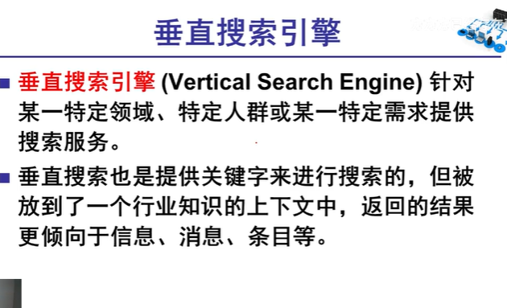

## 电子邮件

发送邮件的协议SMTP

读取邮件的协议：POP3和IMAP

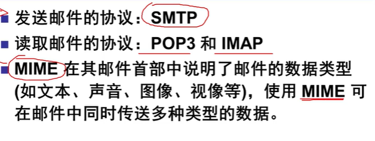

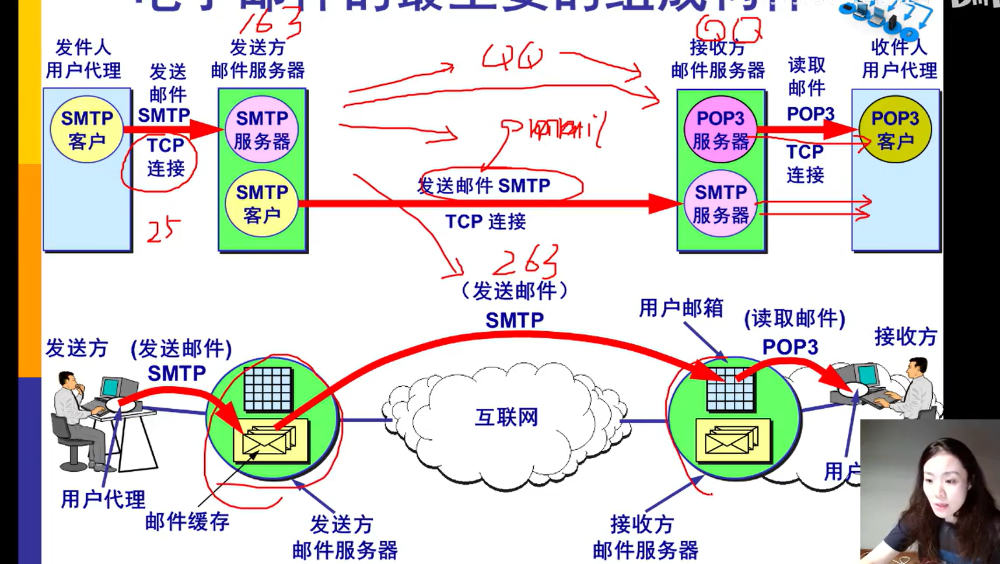

SMTP使用的是TCP连接，其熟知端口为25

### 用户代理UA

UA就是用户与电子邮箱系统的接口，是电子邮件客户端软件

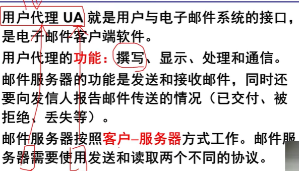

### 发送和接收的重要步骤

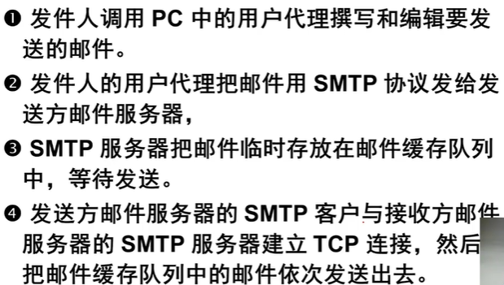

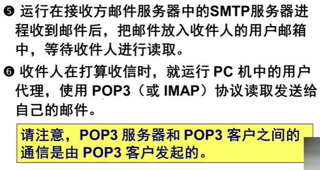

### 简单邮件传送协议SMTP

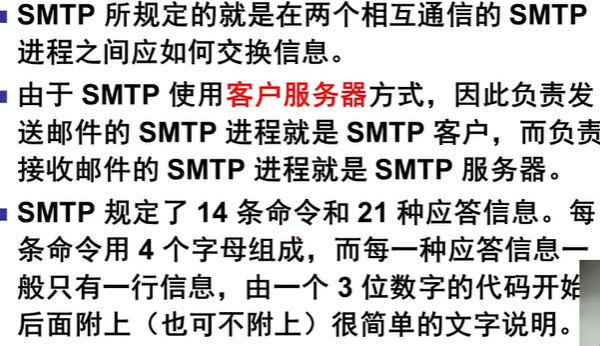

1. 连接建立：在发送主机的SMTP客户和接收主机的SMTP服务器之间建立的。SMTP不使用中间邮件服务器
2. 邮件传送
3. 连接释放，结束后释放TCP连接

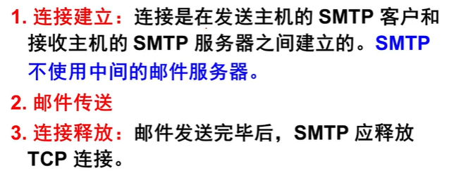

### 邮件读取协议POP3和IMAP

邮局协议POP是一个非常简单，但功能有限的邮件读取协议

IMAP可以像操纵ISP服务器的邮箱，就像在本地操作一样，因此IMAP是一个联机协议

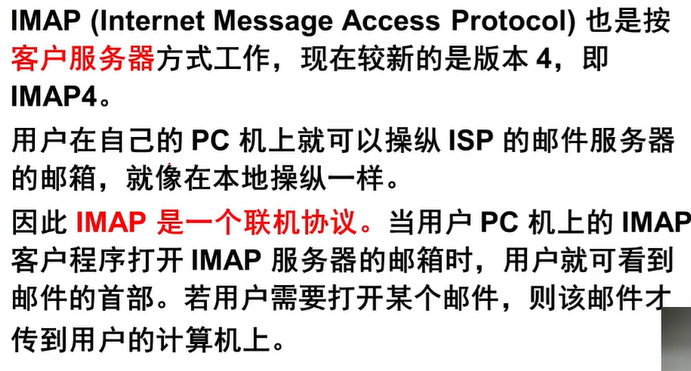

### 它们的区别

POP只会删除本地，不管服务器

IMAP会同步对服务器进行操作

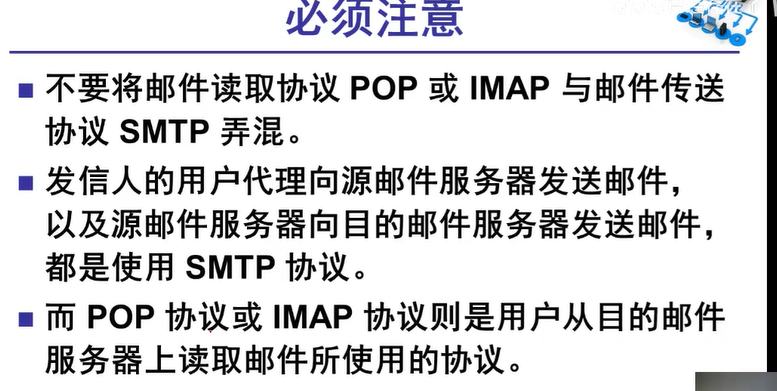

### 基于万维网的电子邮件

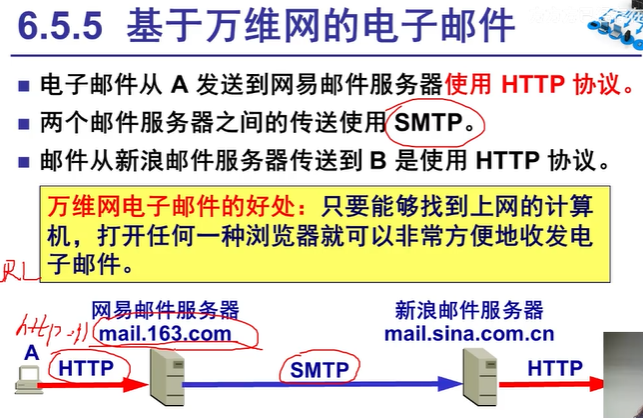

向邮件服务器发送时使用的HTTP协议，但是邮件服务器之间仍然使用的是SMTP

### 通用互联网邮件扩充MIME

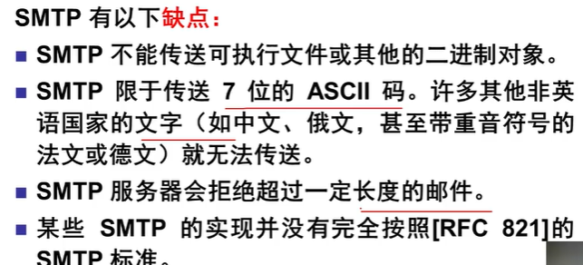

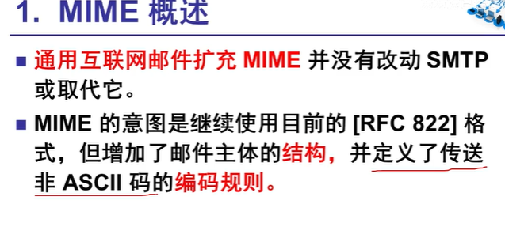

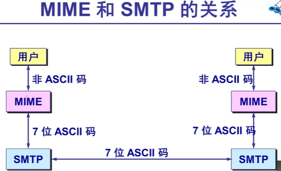

## 动态主机配置协议DHCP

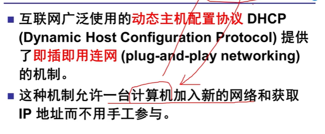

### 分配过程

当有新的主机加入网络时，还未分配IP地址

该主机就在整个主机进行广播，寻找DHCP服务器

DHCP接收到后，也发广播进行回应

主机再发送广播，请求分配IP地址

DHCP服务器就在地址池中找到一个，广播发送过去

（主机发送广播时，发送IP地址置为0.0.0.0）

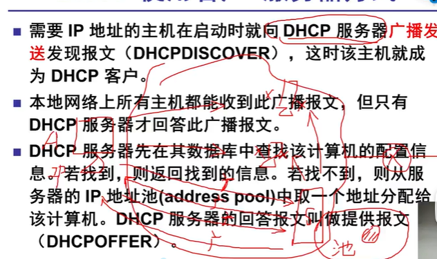

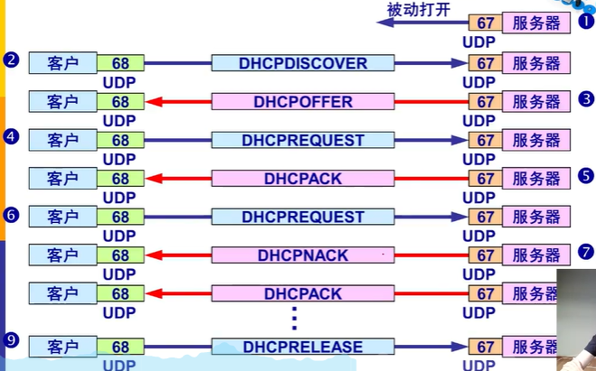

当租用期到达0.5T和0.875T时，主机向服务器请求更新租用期

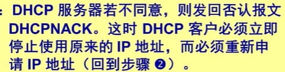

### 租用期

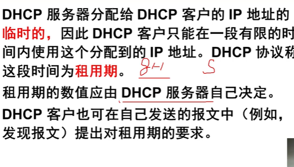

## 简单网络管理协议

网络管理包括对硬件软件和人力的使用与协调等

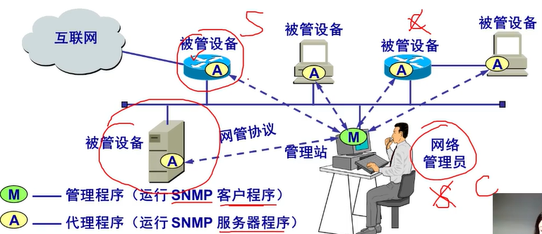

## 应用程序跨域网络的通信

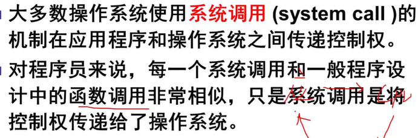

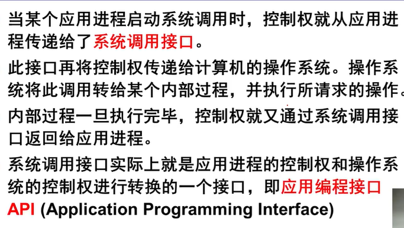

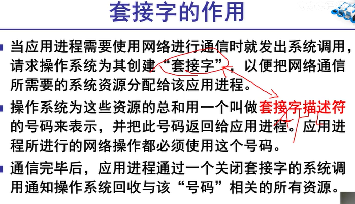

之前所学的所有协议啊，封装啊，其实都是操作系统在做

## P2P