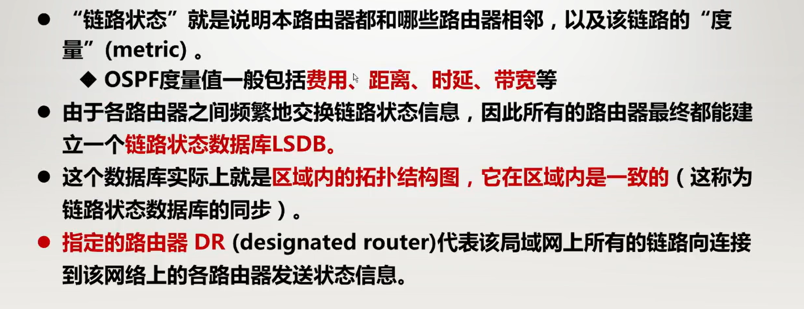

# 网络层

怎么把局域网连接成全球的互联网

数据链路层解决了同一局域网计算机间帧的传输问题，但没有解决**异构网络间的连接和资源共享**问题

## 网络层的重要概念

### 网络层提供的两种服务

有两种观点

#### 虚电路服务(面向连接的)：

模仿电信网络，使用**面向连接**的通信方式

通信之前先建立虚电路，按需预留所需的网络资源，双方沿着这条**逻辑链路**按照**存储转发**传送分组，结束后释放虚电路

如果再使用可靠传输的协议，可使分组不重复，不丢失，不失序

#### 数据报(分组)服务(无连接的(目前主要使用))

网络层设计要尽量简单，向上层只提供简单**灵活的、无连接的、尽最大努力交付的数据报服务**。

网络在发送分组时不需要先建立连接

每个分组独立发送，不编号

网络层不提供服务质量的承诺

可靠通信交给上层的**运输层**

## 网络协议IP

 

网络层与IP配套的协议有

地址解析控制协议ARP

网际控制报文协议ICMP

网际组管理协议IGMP

### 虚拟互联网络

没有任何一种单一网络能满足所有用户的需求，所有网络互联采用了一些**中间设备**

有了网络协议IP和中间设备，主机间的通信就好像在一个网络上通信了一样

 

如果没有经过路由器叫**直接交付**

经过路由器叫**间接交付**

### IP地址

给每个连接在互联网上的主机或路由器的每个接口分配的全球唯一的标识符。

IP地址是32位的二进制地址

采用2级结构

IP地址 ::= {<网络号>,<主机号>}

分级的好处：**便于IP地址的管理**；路由器只需根据网络号转发，**减少路由表大小，提高效率**

#### IP地址的分类

分为ABCDE，5类

A类：0开头，8位网络号

B类：10开头，16位网络号

C类：110开头，24位网络号

D类：1110开头，后面是多播地址

E类：1111开头，暂时仍未使用

主要关心前三类

#### 讨论网络数和主机数

对A类来说，网络号**全0代表本网络**，**0111111(127)用于本地环回测试**的

对A类，主机号全0**代表该网络的主机所在的地址**，主机号**全1代表对该网络所有主机**(用于广播)

对于B类和C类，**网络数与A类不同**，没有特殊要求，除了开头的格式要求外，其它都可以取

主机数和A类一样，**全0和全1不能使用**都要-2

其它一般不用于分配的IP地址

#### 子网划分

##### 定长编码

在原有的网络下，在原来的主机号里拿n位做子网号，就可以划分出2^n个子网

##### 变长编码

可以采用变长划分子网

n位可以划分n+1个子网，如

0、10、110、111；0、10、11；

##### 子网掩码

和IP地址位数一样，在网络号和子网号相同的位数上是1，其余是0，这样和IP地址进行与运算，就可以得知这个子网的网络地址了(后续路由器就靠这个转发)

#### 无分类编制方法CIDR

取消了ABC类地址、子网划分的概念，直接调整网络前缀的禅古，能更加有效的分配IPv4地址

前缀数就只需要在IP地址后面加上/然后写位数就行了

可以表示任意大小的地址块

##### 三个特殊的CIDR地址块

#### IP地址的特点

##### **每个IP地址都由网络前缀和主机号组成**

方便了IP地址的分配和管理

实现路由聚合，减小转发表的空间和查表时间

##### **IP地址是标志一台主机或路由器和一条链路的接口**

当一台主机要连到**两个网络**上时，必须要有**两个**对应的IP地址，且**网络号必须不同**，这叫多归属主机

一个路由器**至少**要连两个网络，所以至少俩IP地址(一个端口一个)

##### **转发器或交换机连接起来的局域网仍是一个网络**

一个网络就是指**网络前缀一样**的主机的集合

**不同网络号**的局域网必须用**路由器**进行互联

**同一网络**的主机接口必须有**一样的网络前缀**

##### 在IP地址中所有分配到网络前缀的网络都是平等的

地址块大小并不影响网络的优先级

### IP数据报的格式

#### **版本字段**：

**4位**0.5个字节，值就是协议的版本，如IPv4这里是0100，IPv6是0110

#### **首部长度**：

**4位**0.5个字节；代表首部的长度是多少字节，**一个比特代表4个字节**，最大值为1111，代表首部长度为15*4=60字节(主要是可变部分会变，所以其值不会小于0101)

#### 区分服务：

**8位**1个字节，实际没有使用

#### **总长度**：

**16位**4个字节；代表整个数据报的长度(首部+数据)，**一个比特代表1个字节**，最大可表示2^16-1=65535字节

实际上由于数据链路层MTU的要求，比如对以太网是不能超过1500字节的，超过要进行分片，注意，分段不影响这里的值，只影响下面三个字段，它们分开传输，最后在目的地进行组合。

下面三个字段就是用于分片的

#### **标识：**

16位2个字节；同一个数据报分片的标识值要相同

#### **标志**：

3位；如下图，

保留仍未使用。

DF(Don't Fragment)：是否分组，若是1则不进行分片，此时MF无用，是0则去看MF

MF(More Fragment)：1代表之后还有分片，0代表自己就是最后一个分片

#### **片偏移：**

13位；

表示该分片的数据距原始数据开头有多少字节

其中**一个比特算8个字节**，如下图第三个分片，偏移量的值就是2960/8=370

所以说分片的**数据长度必须被8整除**

顺便这三个分片DF都是0，前两个MF是1，第三个是0

#### 生存时间TTL：

8位一个字节

表示数据报在网络中可通过的路由器的最大个数，每经过一个路由器值减一，最大是255

#### 协议

8位1个字节

指出该将数据交个哪个上层协议

#### 首部校验和

16位2个字节

**每个路由器都校验，只校验首部，不管数据位**

先把校验和置为0，然后整个首部反码求和，再取反码

接收端先反码求和，再取反码，此时结果应当为0，否则丢弃

#### 源地址和目的地址

都是32位4个字节

32位的二进制IP地址，标识各个接口，用于网络层寻址

## IP分组的转发

### 基于终点的转发

分组是**逐跳转发**的，经过路由器查询转发表确定下一跳

基于终点的转发：基于首部的**目的地址**传送和转发

路由器转发表的信息：**目的地址和下一跳地址**

目的地址不是具体的IP地址，而是具体IP地址**所在的网络及其掩码**

### 最长前缀匹配

路由器收到转发请求，先将其**报文的目的IP地址**和路由器的**路由表中所存的所有目的网络的子网掩码相与**

若**得到的网络号和存储的一样**，就往对应的下一跳**转发**

但是可能会有多个转发表中的目的网络地址都匹配

此时要选择匹配更长的，也就是**掩选码更长**的那个，上图就因该选第一个

所以说转发表构造时，应当把前缀长的放前面

在最后应当放置全0的网络号当默认路由，用于在查不到地址时转发 

#### 转发表里的两种特殊路由

##### 主机路由

又叫特定主机路由，是对特定目的主机的IP地址指定的路由

网络前缀就是a.b.c.d/32，放在转发表的最前面

##### 默认路由

不管分组的最终目标在哪，都由指定的路由器处理

用0.0.0.1/0表示，放在转发表最后

#### 路由器分组转发算法

路由器一般不允许转发255.255.255.255，所以也叫受限广播地址

但是其它的广播可以，比如说2.255.255.255/8，这种可以广播，叫直接广播地址

#### 使用二叉线索查找转发表

根据存的IP地址的唯一前缀，构建二叉树，在查询的时候，把得到的IP逐个比较，到达叶子节点时，判断是否是一个网络，是就向其转发，否则丢弃

### IP地址与MAC地址

IP地址在过程中保持最初始和最后不变，MAC地址每次根据发送和接收端改变

IP层屏蔽了下层的细节，但是还是需要知道每个目的地的MAC地址才能转发，下面来了解如何知道MAC地址

### 地址解析协议ARP

每个主机会有ARP高速缓存，会存储到最近记录IP地址和MAC地址的映射，当想发送时，会先查表，若表里有，则直接使用对应的MAC地址即可，若没有，则进行下面的操作。ARP缓存biao里除了IP和MAC外，还有生存时间，这是防止原来的映射失效。

下面是**缓存中没有记录**的情况

##### 两台主机在同一局域网

发送方会先直接在本局域网广播发送ARP请求分组

分组中包含自己的IP和MAC地址，以及想知道MAC地址的IP（该分组的目的MAC地址为ff-ff--ff-ff-ff-ff）

若目的主机接收到了，则单播发送响应分组，包含自己的IP和MAC地址

##### 两台主机在不同局域网(跨路由器)

路由器在转发表中能找到对应主机，会给发送端主机回复ARP响应

##### 路由器发送在本局域网找主机

路由器会发送广播，然后对应主机会接收到发送ARP响应

##### 路由器发送在别的局域网找主机

发送方是路由器，会用ARP在本网络找到另一个路由器的MAC地址，接下来让它发，怎么找是依靠转发表，后面再看。

## 网际报文控制协议ICMP

它允许主机或路由器报告差错情况，和提供关于异常情况的报告

它封装在IP数据报的数据中

类型是分组出现问题的类型，而代码表示的是具体产生这种类型问题的原因

### 差错报告报文

ICMP差错报告报文，对出错的IP数据报，把该数据报的首部以及数据的前八个字节存入自己的数据部分

这样可以实现尽最大努力交付的任务

#### traceroute(用于网络层)

TTL为1，就会收到第一个路由器的回复。。。。。。以此类推，直到收不到

##### 不应当发送ICMP

不要为差错报告发差错报告

不对分片的后续分片发送

不对多播地址发送

特殊地址不发

### ICMP询问报文

#### Ping(应用层)

用于测试两个主机的连通性

## IPv6

**为什么需要IPv6**

IPv4地址耗尽，分配不合理，VLSM没有增加地址

NAT解决了IPv4不够的问题，但是破坏的端到端通信的完整性

广播和ARP的依赖带来安全问题

### IPv协议概述

更大的地址空间：地址增大到128位

拓展的地址层次结构：可以划分更多的层次

首部更灵活：定义了更多拓展首部

改进的选项

允许协议继续扩充

支持即插即用

支持资源的预分配

IPv6首部改为8字节对齐

更小的路由表：相同区域默认分配前缀相同的IP地址

分段处理：分片在发送端进行，路由器不分片，发现要分片直接丢弃

传输安全性：强制使用IPSec安全加密传输

#### IPv6数据报的一般形式

**版本**：4位，代表版本

**通信量类**：8位，用于区分数据报的类别或优先级

**流标号**：20位，主要在资源预分配时使用，同属一个流的数据报流标号一样

**有效载荷长度**：16位，指明除了基本首部外的字节数(拓展首部+数据)

**下一个首部**：8位，相当于IPv4的协议字段和可选字段。可能是TCP、UDP、ICMP，也可能是拓展头

**跳数限制**：8位，就是之前的TTL生存周期，最大255

**源地址和目的地址**：都是128位

#### IPv6的扩展首部

### IPv6的地址

每个地址128位

#### 三种基本类型

**单播**：传统的点对点通信

**多播**：1对多

任播：IPv6增加的类型，任播的终点是一组计算机，但是**只交付给最近的一个**

#### 冒号16进制记法

使用每4个16进制数一个冒号分隔

某一段的前导0都可以省略，若全是0则保留一个

**连续多段**0还可以进行**零压缩**:必须得连续，而且一整个地址，只能压缩一次

#### 点分十进制的后缀记法

主要用于IPv4向IPv6转变

#### 前缀的表示方法

CIDR的**斜线表示法**仍然可行，但是已经**取消了子网掩码**

#### 特别地址

#### IPv6地址的配置方式

手动配置

DHCPv6(IPv6动态主机配置协议)

无状态地址自动配置：基于邻居发现协议(NDP)的路由器请求报文(RS)的IPv6前缀信息，结合自己的MAC地址生成IPv6地址

### IPv4向IPv6的过度

它们并不互相兼容

涉及用户、服务器提供商ISP、互联网内容提供商ICP、网络设备厂家

要向后兼容：IPv6要能接收和转发IPv4，并为IPv4选择路由

#### 双协议栈

有域名系统DNS查询结果决定使用哪一套系统

在通过IPv4的路由器时，会被重新封装成IPv4进行传递，发现IPv6再转换回去，但是会产生一些首部丢失，如流标号

#### 隧道技术

把整个IPv6数据报封装成IPv4的数据包进行传递，出来再解封

### ICMPv6

在IPv6版的网络层中，**IGMP和ARP都被取消了**

#### ICMPv6报文分类

除了原有的差错报文和信息报文

新增了**临站发现报文**和**组成员关系报文**

## 路由选择协议

### 路由选择概述

#### 理想的路由算法：

算法必须是**正确完整的**

在计算上应当**尽量简单**

要能适应网络的变化，有自适应性

算法应有**稳定性**

算法应当是**公平的**

算法应是**最佳的**

静态路由选择：没有自适应性，但是简单开销小

动态路由选择：有自适应性，复杂开销大

#### 分层的路由选择协议

互联网由大量不同的网络互联，每个管理机构控制的网络是自治的

##### **自治系统(AS,Autonomous System)**

是在单一技术管理下的许多网络IP地址和路由器

这些路由器使用同一种自治的内部的路由选择协议(跳数、带宽、时延全都一样)

每一个AS对其它AS表现出的是一个**单一的和一致的路由选择策略**

不同的AS可以使用不同的路由算法/路由协议

每个AS有全球唯一的ID

AS还可以进一步划分层次：私有自治系统或区域

##### **自治系统内部使用使用内部网关路由协议IGP**

每个AS内的路由算法可以不同

典型的IGP算法：OSPF、RIP、IS-IS、IGRP、RIGRP

##### **自治系统之间的外部网关路由协议EGP**

个自治域之间的路由需统一

典型的EGP协议：BGP

##### 分层前后的效果

### 内部网关协议1---路由信息协议RIP

路由信息协议是一种**分布式的、基于距离向量**的路由选择

最大优点：**简单**

要求网络中每个路由器都**维护**一个自己到其它所有目的网络的**距离记录**

#### 距离定义

其中的距离就是**跳数**

**好路由：距离短的路由**

**一条路径最多15个路由器**

当距离**16时就认为不可达**

RIP**不能**在两个网络间**使用多条路由**，**只选择**距离最短的

#### 特点

只与相邻的路由器交换信息

交换的信息是本路由器**所有的**信息，即路由表

按照**固定的时间**间隔交换路由信息

#### RIP路由表的建立

在路由器刚开始工作时，只知道**直接相连**的网络的距离(此时距离为1)

之后，每个路由器都和**相邻的路由器**交换并更新路由表信息

若干次更新后，所有的路由器都会知道本自治系统中每个目的网络的**最短距离**和下一跳地址。

RIP的路由表表项：**目的网络、距离、下一跳**

距离向量算法的基础是弗洛伊德Ford算法

注意：假设R1与R2互换信息，若R1原来存有Net2 距离为4，且下一跳是R2，则不论新换来的R2里的路由表中，Net2的距离为多少，**都要更新**

这是因为可能后续Net2到R2的路径变了，原先路径不可达了

#### RIP2报文

#### RIP的优缺点

##### 好消息传的快坏消息传的慢

当时机不恰当时，会产生某个网断掉了，但是没有机会传递，知道双方互换到最后才能发现不可达，如上图

综上，**优点**：实现简单，开销小

**缺点**：网络规模有限，最大距离为15

交换的路由信息为完整的路由表，开销较大

坏消息传播慢，收敛时间过长

### 内部网关协议2---开放最短路径优先OSPF

采用了**Dijkstra**提出的最短路算法SPF

采用**分布式的链路状态协议**

限制使用OSPFv2

#### OSPF的特点

向本自治系统所有路由器**洪泛**信息

发送的信息是与本路由器**相邻**的所有路由器的链路状态

只要**当链路状态发生变化时**路由器才用泛洪法发送信息

各路由器通过交换信息，可以建立一个**链路状态数据库**(LSDB)，这个数据库实际上就是**全网的拓扑结构图**(RIP并不能知道整个的拓扑结构)

#### 划分区域

OSPF还能进行划分，分为主干区域和其它区域

每个其它区域，想要与域外别的区域或者其它AS连接，**必须经过主干区域**

处于主干区域的路由器叫主干路由器BR

如图R34567

处于区域边界上的叫做区域边界路由器ABR

如图347

与别的自治系统相连的叫做自治系统边界路由器ASBR

如R6

##### 划分区域的优缺点

**优点**：划分后洪泛时只需要在本区域即可，减少了网络路由信息交换的通信量

减少了链路状态数据库维护的信息

**缺点**：交换的信息的种类增加了，使得协议更复杂

#### OSPF的5种分组类型

问候分组：用于发现和维持临站的可达性

数据库描述：向临站提供自己链路状态数据库的所有链路项目的摘要信息

链路状态请求：向对方发送某些链路状态的详细信息

链路状态更新：使用洪泛法对全网更新。时OSPF最核心部分

链路状态确认：对链路更新分组的确认。

#### OSPF的工作过程

Hello能接收到的的叫做邻居

后四种分组都是用于链路状态数据库的同步

两个同步的路由器叫做完全邻接

##### 可靠洪泛法

接收到更新报文，需要回复确认报文

### 外部网关协议----边界网关协议BGP

BGP是**不同自治系统路由器之间**交换路由信息的协议

#### BGP的主要特点

力求选择能跨越AS到达目的网络且**比较好的路由**(不能兜圈子)，**并非计算出最佳路由**

因此采用的是路径向量路由选择协议

不同自治域通信靠的是自治系统边界路由器，在这里叫做**对等BGP发言人**

#### BGP路由

自治域内部使用iBGP，而且同时内部还会交换内部网关路由协议，如RIP，OSPF

自治域间使用eBGP

自治系统内的路由器只能把信息通报给发言人，或者发言人传给它们，它们之间不能互相通报

**BGP路由**：由**前缀、AS-PATH、NEXT-HOP**组成

前缀是目标地址的前缀，

AS-PATH是过程中经过的可行的一条AP路径，**中间不能有重复的自治系统号**

NEXT-HOP就是下一跳，选这个路径下一步要通过哪个服务器

##### 路由选择顺序

本地偏好高的先走

AS跳数少的先走

上两种都相同，则根据发送路由器距发言人近的路由器那个路径走(热土豆算法)

再相同就选路由器ID最小的

**报文**

### 路由器的构成

对于数据转发，路由器工作在网络层，**用于不同网络间转发分组**

#### 路由器的工作原理

##### **路由器传输的信息有以下两类**：

1. 主机间传送的**数据**
2. **路由信息**(这是用于构建路由表，位传输数据服务的)

##### **路由器包含两个核心功能**：

- **控制层面**：运行各种路由协议(BGP、OSPF、RIP等)，学习建立路由表
- **数据层面**：根据路由表，将IP分组转发到正确的下一跳链路

##### 路由器的结构

##### IP报文转发核心功能

链路层解封装，IP首部校验

获取报文目的IP地址

根据目的IP，基于最长前缀匹配，查询转发表

若查询成功：

1. 获取转发出去的接口和下一跳地址
2. TTL字段-1，重新计算首部的校验和
3. 重新进行链路层的封装，发送报文

若查询失败，丢弃分组

##### 典型交换结构

##### 家用路由器

与典型的路由器差异很大

## 多播

### IP多播概念

多播：源主机给目的网络中的一部分目标用户发送数据报

目的：更好地支持一对多通信

一对多通信：一个源点发送到多个终点

也是尽最大努力交付，但是不保证一定交付，丢失也不发送ICMP报文

#### 与多次单播的区别

左图应当为单播实现同样的效果

单播要进行30次，发送30份报文，

而多播主机只需要发送一份(路由器R1需要复制成3份发往三个局域网，而**局域网有硬件多播功能**，不用复制)

#### 确定组成员

边缘路由器与主机交互，了解到从它某个端口可以到达哪些组的成员—主机与路由器间的组成员关系协议。

网际组管理协议IGMP让连接在**本地局域网**上的多播路由器知道**本局域网**上是否有主机参加或退出了某个多播组，即让路由器知道**该网段**的多播组成员

**主机加入多播组**：向路由器发起请求

**路由器定期探寻成员的变化情况**：路由器定期向主机发送询问

#### 多播IP地址

多播地址在IPv4里就是D类地址(224.0.0.0~237~255.255.255)(110开头)，只能作为目的地址，不能作为发送地址

#### 多播硬件地址

**从01-00-5E-00-00-00到01-00-5E-7F-FF-FF**

所有通信**都使用IP多播**。只要有可能就都用**硬件多播**来传递，减少网络开销。

#### 多播路由

多播路由选择协议，使得多播路由器协同工作，把多播数据用最小代价传送给多播组的所有成员

实际上就是找到以源主机为根节点的**多播转发树**，数据沿着生成树发送

使用的三种方法如下

##### 洪泛与剪除

适合于较小的多播组，所有组成员接入的局域网也是相邻接的

为了避免兜圈子，采用**反向路径传播RPB**的策略，即受控制的洪泛：

收到的一个多播数据报时，先检查这个数据报是不是从源点的最短路径上发来的。实现的过程是，找到自己到源点的最短路径，看第一个路由器(若有多个路由器都是最短路径，那就选IP地址最小的)是不是刚才发送的那个，若是，就接收并向周围转发，否则丢弃。

剪除：若某个路由器下游没有该多播组成员，则把它下游都移除。

若多了新的组成员，再接上

这样就构成了**多播转发树**。

##### 隧道技术

对不支持多播的网络，就对单播数据报进行封装，先发单播，到了支持的地方，再变回来。

##### 基于核心的发现技术

## 虚拟专用网VPN和网络地址转换NAT

### 虚拟专用网络VPN

由于**IP地址的紧缺**，一个机构无法使所有主机都拥有公网IP

而且**互联网并不很安全**，一个机构也不需要把所有主机接入外部互联网

其实VPN就是加密技术和隧道技术的结合

#### 专用地址块

#### 实现原理

实现和下面的NAT有相似之处

### 网络地址转换NAT

想要在专用网上，让使用专用地址的主机与互联网上的主机通信，且无需加密时可以使用

把私有地址转换成共有地址，只要有NAT转换表就行，但是一个专用地址对应一个全球IP地址肯定是不现实的

可以轮流使用IP地址，这样是不能节省IP地址的，还是很受限。

#### 网络地址与端口号转换NAPT

使用**端口号**对每个专用地址进行区分

#### NAT的优缺点

优点：

节省合法地址，减少地址冲突

灵活连接互联网

保护局域网的私密性

缺点：

违法了IP的结构模型，由路由器处理传输层协议

违反了端到端的原则

不能处理IP报头加密

新型的网络应用设计得考虑NAT的场景，如P2P

## 多协议标签交换MPLS

当网络很大时，查询路由表要花很多时间

出现突发通信时，缓存会溢出，引起分组丢失，传输时延增大和服务质量下降

**多协议**：在MPLS的上层可以使用多种协议

**标签**：MPLS利用面向连接技术，使每一个分组携带一个叫标签的小整数，标签交换路由器用标签值检索转发表，实现分组的快速转发。

把网络简化了，从一个网络一个接口，变为一个标签一个接口

### 工作过程

首先需要有多个路由器支持MPLS，它们会组成一个MPLS域，可以在这个区域中使用MPLS协议

对进入的数据，对数据进行封装，打上标签

## 软件定义网络SDN

2009年才推出的协议

**优点：**

提高网络带宽利用率

网络运行更加稳定

管理更加高效简化

运行费用明显降低

### 如何工作

原先的转发表的计算是每个路由器自己与其它路由器交换信息计算得出的，耗时较长，且必须每个路由器都要工作才行

而SDN是有一个远程控制器，先收集好所有的数据，然后计算好每一个路由器的最佳路由，之后路由器只需要向它请求就可以了

对上是北向，对下是南向

### OpenFlow

在数据层面OpenFlow交换机完成匹配+动作，即广义转发。

**匹配**：对不同层次(链路层、网络层、运输层)首部中的字段进行匹配

**动作**：转发、重写、丢弃等

可以实现**负载均衡**

可以实现**防火墙**

### SDN体系结构

北向API就是实现上层接口

南向API就是实现下层的接口，比如说下发流表

### 与传统网络的差别

