[TOC]

# 概述

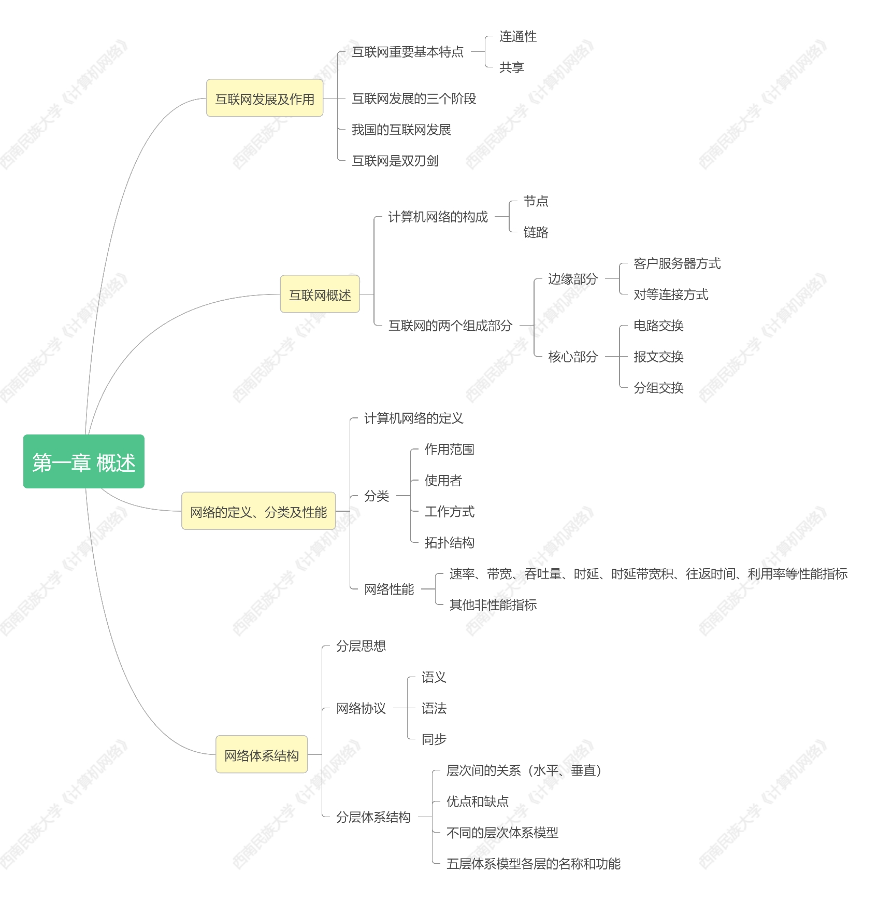

## 1.1计算机网络在信息时代的作用

### 计算机网络概念

#### 三大网络

**电信网络、有线电视网络、计算机网络**

覆盖全球的：互联网(Integernet)

局部范围使用的：互连网(internet)

### 互连网的两个重要基本特点

#### 连通性

用户终端好像彼此直接联通一样

#### 共享性

信息共享、网络共享、硬件共享

## 1.2互联网概述

### 网络的网络

#### 计算机网络(简称网络)：

由若干**节点**和连接节点的**链路**组成

节点可以是计算机、集线器、交换机、路由器等

#### 互**连**网(internet注意是连)

把多个网络连接起来就叫互连网

#### 互联网(Internet)

特指覆盖全球的，具有连通性和资源共享性的计算机网络

### 互联网基础结构的发展阶段

#### 第一阶段1969-1990

先是ARPANET(阿帕网)，最初至少简单的分组交换网，不是互连网

1983年，TCP/IP协议作为阿帕网的标准协议，

所以1983年作为互联网诞生年

1990年阿帕网关闭，

#### 第二阶段1985-1993

三级结构：主干网、地区网、校园网(企业网)

#### 第三阶段1993-现在

##### 出现了互联网服务提供者ISP

提供接入互联网的服务

收取费用

##### 多层次ISP结构

主干ISP、地区ISP、本地ISP、主机

##### 互联网交换点IXP

允许两个网络直接相连，并快速交换

##### 内容提供者

向用户提供视频和文件，**不提供转接服务**

### 互联网标准化工作

所有标准都是RFC(请求评论)形式发布，任何人都能评论，但需要审核

**不是所有RFC都是互联网标准，只有一小部分**

## 1.3互联网的组成

从工作方式上看可以分为边缘部分和核心部分

边缘部分提供互联网的**共享性**

核心部分提供**连通性**

### 边缘部分

边缘的部分就是连接的所有主机，也叫**端系统**

主机A和主机B通信指主机A的某个进程和B的进程通信

#### 客户端服务器 C/S方式

客户是被调用后执行，主动发起通信

服务器是不断运行，被动等待

**通信可以是双向的，都可接受或发送**

#### 对等连接方式P2P

每个主机平等

本质上仍是C/S方式

### 核心部分

为主机提供连通性

在核心部分起特殊作用的是**路由器**

路由器是实现**分组交换**的关键，其任务是**转发**收到的分组

**分组转发**是网络核心部分**最重要**的功能

#### 电路交换

交换就是转接

电路交换分为三个阶段

**建立连接**，建立物理通路(占用通信资源)

**通话**(一直占用资源)

**释放连接**(归还通信资源)

**在通话全部时间内，通话的两个用户始终占用端到端的通信资源**

用于计算机数据传输效率低

#### 分组交换

采用**存储转发**技术

数据段加上首部就是**分组**

路由器处理分组过程：先暂存，检查首部，查找转发表，找到合适接口转发

##### 优点：

高效：**动态分配**带宽，**逐段占用**链路

灵活：每个分组**独立**选择转发路由

迅速：**不用事先建立连接**就能发送分组

可靠：有可靠的网络协议，可以保证**不重复，不丢失，不失序**

##### 缺点

排队延迟：分组在个路由器要排队

不保证带宽：由于是动态分配的

会增加开销：报头，转发表

#### 电路交换，报文交换，分组交换区别

电路交换：连续直达终点

报文交换：(就是不分组的分组交换)整个报文一个一个节点往后转发

分组交换：把报文分组，每个组可以各自转发

但传输**大量**数据(传输时间**远大于**连接时间)，**电路交换**速率较快

**报文交换**和分组交换不用预先分配带宽，在传输**突发数据**时可提高信道利用率

由于分组长度**远远小**于报文，所以**分组交换**时延小，更灵活

## 1.5计算机网络的类别

### 定义

把握住连通性和共享性即可

### 类别

#### 按范围分类

广域网WAN：范围大，是互联网的核心部分，使用点对点协议

城域网MAN

局域网LAN：使用广播协议

个人区域网：PAN

#### 按使用者分类

公用网

专用网

#### 把用户接入互联网的网络：接入网AN

## 1.6计算机网络的性能()

### 计算机网络的性能指标

#### 速率

比特是信息的基本单位

速率就是数据的传输速率，指**理想**情况下一段时间网络信道能通过的**最大数据量**

单位bit/s，kbit/s，Mbit/s，Gbit/s，每个差1000倍(注意k是小写)

是指**额定速率**，不是时间运行速率

#### 带宽

##### 频域称谓

带宽本来是指信号的频带宽度，单位Hz

指某信道允许通过的信号频带范围

##### 时域称谓

但在计算机网络中，用来表示**某通道**传送数据的能力

表示单位时间内能通过的最高数据率

单位也是bit/s

可以比速率大，也可以小

#### 吞吐量

单位时间某个网络(信道、接口)的**实际数据量**

受**带宽**和**额定速率**的限制

**可能远小于**额定速率

#### 时延

指数据从网络(或链路)的**一端传送到另一端**的所需**时间**

##### 发送时延

$$
发送时延 = 数据帧长度(bit)/发射速率(bit/s)
$$

##### 传播时延

$$
传播时延 = 信道长度(米)/在信道上的传播速率(米/s)
$$

##### 处理时延和排队时延

都在路由器里发送

**处理时延**是收到分组时，处理分组所花时间

**排队时延**是**在路由器队列等待处理转发**所经历的时延

当数据量很大导致**队列溢出时**，分组会丢失，相当于**排队时延无穷大**

##### 总时延

总时延=发送时延+传播时延+处理时延+排队时延

那个时延占主导地位，就是瓶颈

注：带宽不会影响传播时延，其只与信道长度和介质有关

#### 时延带宽积

$$
时延带宽积=传播时延*带宽
$$

就是相当于链路能装多少数据

只有链路都充满比特时，链路才充分利用

#### 往返时间RTT

表示发送完数据(不算A的发送时延)，收到接收方的确认所经历的时间

也就是传播时延*2+B的处理时延和排队时延+B的发送时延

当确认信息极短时，可忽略B的发送时延

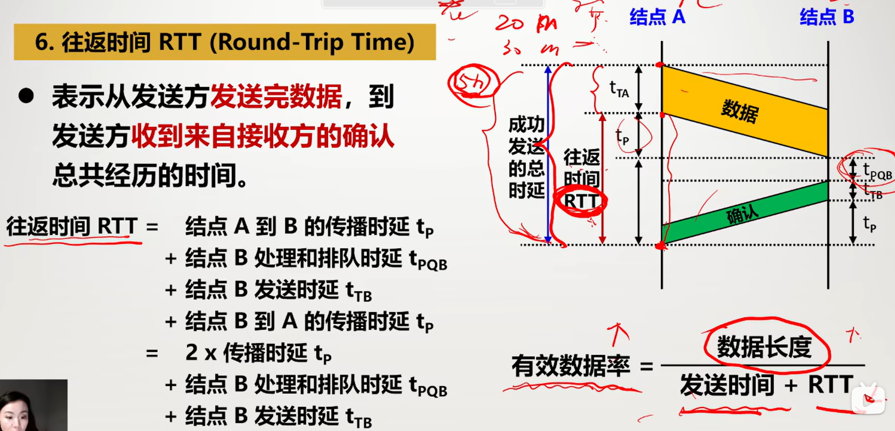
$$
有效数据率 = 数据长度/ (发送时延+RTT)
$$
但是实际上RTT里还有中间节点的的处理时延、排队时延和转发时的发送时延

#### 利用率

信道利用率：某信道有百分之几的时间被利用(有数据通过)，空闲时就是0

网络利用率：整个网络所有信道的信道利用率的加权平均值

但是不是利用率越高越好，利用率增大，时延也会增大

D代表当时时延，D0代表空闲时延，U代表当前网络利用率
$$
D=D0/(1-U)
$$

### 非性能指标

费用

质量

标准化

可靠性

可拓展性

管理和维护

## 1.7计算机网络体系结构()

### 体系结构的形成

由于计算机网络太复杂

ARPANET提出分层设计，把复杂的通信问题划分成若干较小的易于研究的局部问题

分层基本原则：**抽象分层、统一标准、模块独立**

### 体系结构中的协议与层次划分

**网络的体系结构**：是计算机网络各层及其**协议的集合**，也就是这个计算机网络及其构建所应当完成的**功能的精确定义(不涉及实现)**

#### 网络协议

是为了进行网络中数据的交换建立的规则、标准或约定

有三个组成要素：

**语法**：规定传输数据的格式，解决交换信息的格式问题

**语义**：规定要完成的功能，解决做什么的问题

**同步**：规定各种操作的顺序，又称为时序，解决什么时间什么条件下做什么操作

#### 划分层次

分层适度，功能确定，层次独立，层次关联，层次对等，层次协议和接口

至少要完成以下功能：

差错控制

流量控制

分段和重装

复用和分用

建立连接和释放(逻辑连接)

#### 优点

- 各层独立，不关心其他层的实现
- 灵活性好，一层发生变化，不影响其他层
- 结构上好分割，每层可以用合适的技术
- 易于实现和维护
- 能促进标准化

#### 缺点

- 降低效率
- 有些功能要在多层重复实现，增加开销

### 五层协议的体系结构

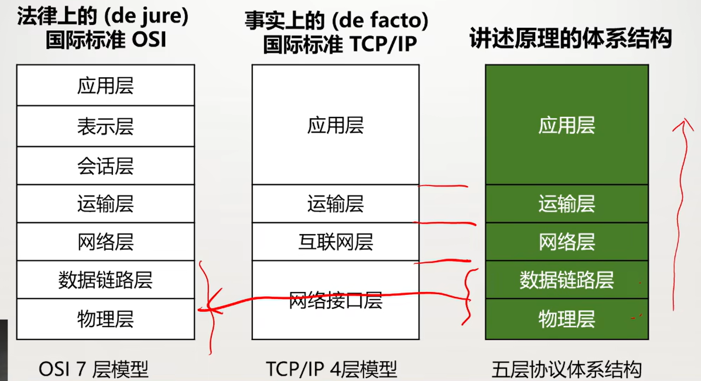

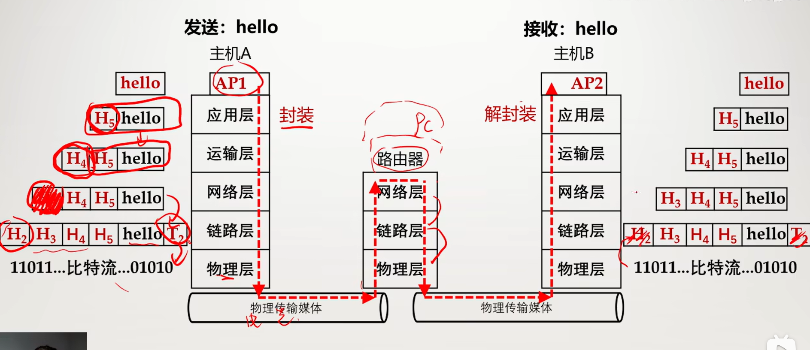

#### 应用层

任务：通过应用进程间的交互完成特定的网络应用

协议：应用进程间通信和交互的规则

数据单元是**报文**

为**用户**提供服务

#### 运输层

任务：负责向两主机中**进程间**的通信提供服务

协议：传输控制协议TCP：面向连接的可靠传输，用户数据协议UDP：无连接的数据传输

具有**分用和复用**的功能

#### 网络层

为分组交换网上的不同主机提供通信服务

两个具体任务

- 路由选择：在每个路由器上生成转发表
- 转发：收到分组时，依据转发表转发到下一个路由器

网际协议**IP**和路由协议

IP数据报

#### 数据链路层

实现同一个网络中的两个节点(相邻节点)的可靠通信

在相邻节点间传送的是**帧**

有差错检验

#### 物理层

实现**比特**的传输

确定电缆插头的引脚，引脚如何连接

传输介质在物理层

### 实体、协议、服务和服务访问点

**实体**：可发送或接收信息的硬件或软件进程

**协议**：控制两个对等实体进行通信的规则的集合

**服务**：在协议的控制下，对等实体间的通信使得其能对上一层提供服务；要实现本层服务，需要下层提供的服务

**服务是垂直的**，下层为上层服务，每一个下层对于上层来讲，都是透明的 

**协议是水平的**，每一个实体都认为自己在和对等层之间靠本层之间的协议在直接通信 实际上该层实体之间的功能是靠它下一层的实体在给它提供通信服务

**服务访问点**：相邻两层之间实体进行交换的地方叫服务访问点SAP

### TCP/IP体系结构

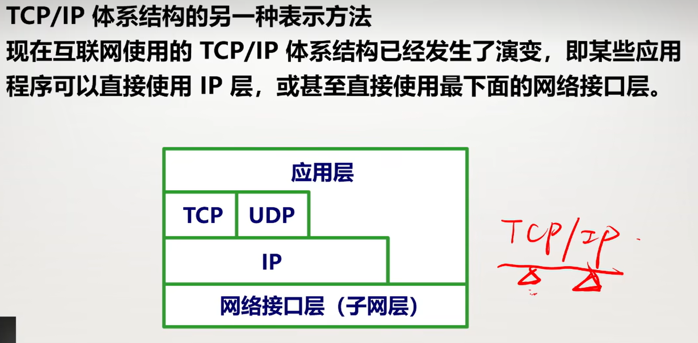

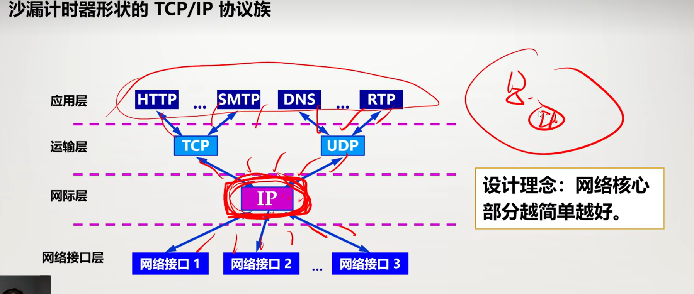

IP屏蔽了下层所有的接口和上面所有的协议

# 物理层

## 物理层的基本概念

### 位置：**在网络体系结构的最底层**

**不是**具体的传输媒体，也**不是**连接计算机的具体的物理设备

### 功能：**如何在连接各种计算机的传输媒体上传输数据比特流**

数据链路层将比特流传给物理层

物理层将比特流按照传输媒体进行**编码**

通过传输媒体传输给下一个节点的物理层

### 作用：尽可能**屏蔽掉不同传输媒体和通信手段的差异**

为数据链路层提供统一的传输服务

物理层的协议也叫物理层**规程**

### 主要任务：确定传输媒体的**接口**的有关特性

#### DTE：数据终端设备

有数据处理和转发能力的设备

可以是数据的源头或起点

#### DCE：数据电路终结设备

在DTE和传输线路间提供信号

变换和编码

建立、保持和释放数据链路

### 物理层协议(规程)

物理层协议是DTE和DCE间的约定，规定了标准化的DTE/DCE皆有的特性

#### 机械特性

接口尺寸、形状、引线数目和排列等

#### 电气特性

电压、阻抗、传输速率

#### 功能特性

某条线在某个电平的电压的意义，每个引脚的作用

#### 过程特性

不同功能各种可能事件出现的顺序

## 数据通信的基本概念

### 通信系统的模型

可划分为三大部分：源系统(发送方、发送端)，传输系统(传输网络)，目的系统(接收端、接收方)

#### 常用术语

**通信**：是在源点与终点之间传递**消息或信息**，但信息和消息不一样

**消息**：文字，符号，数据，语音和图像等

**信息**：包含在消息中，对通信者有意义的部分，**消息是信息的载体**

**数据**：数据是有意义的符号原始表达，是**运送消息的实体**，分为模拟数据和数组数据

**信号**：**信号是消息的载体**，是数据的电气或电磁表现

**信道:**信号传输的通道(传输媒介)，按照传送方向和时间的关系，可分为三类：

单向通信(**单工**)：只有一个方向通信

双向交替通信(**半双工**)：双方都能发，但不能同时

双向同时通信(**全双工**)：可以同时发送接收

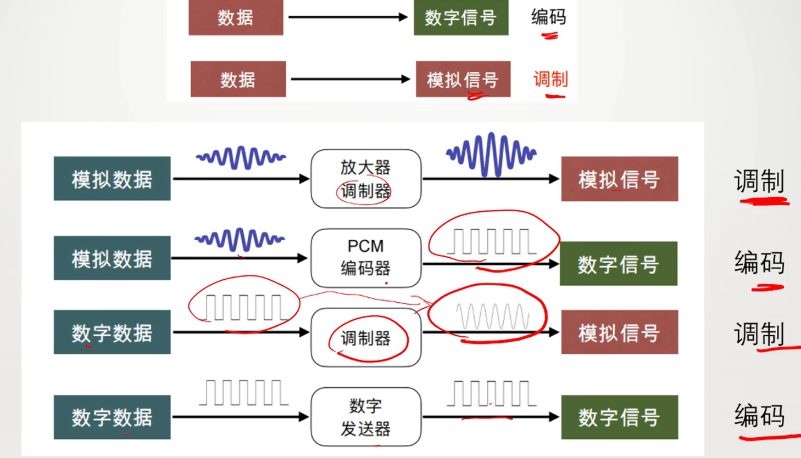

**基带信号**：基本频带信号

信源发出的没有调制的原始信号，包含较多低频甚至直流成分，但是很多信道不允许低频信号

**调制**：让信号可以在相应信道中传输

**基带调制(编码)**：仅对基带信号的波形进行变换，把数据信号转换成另一种形式的数字信号

**带通调制**：使用**载波**进行调制，把基带频率范围转移到较高频段，并**转换为模拟信号**，经过载波调制后的信号成为带通信号

#### 常用编码方式

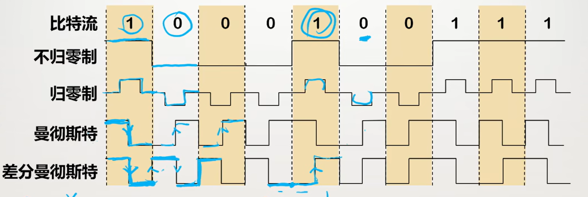

**不归零制**：正电平代表1，负电平代表0。这种方式下不能根据信号本身找到时钟周期

**归零制**：正脉冲代表1，负脉冲代表0。脉冲就是在周期中心上跳下来或下跳上来

**曼彻斯特编码**：在周期中心向上跳是0，在周期中心向下跳是1

**差分曼彻斯特编码**：若下一个是0，则在边界跳变，若是1，则不变

频率：曼彻斯特和差分曼彻斯特编码产生的信号频率比不归零制高

自同步能力：不归零制没有自同步，曼彻斯特和差分曼彻斯特有自同步

#### 基本的带通调制方法

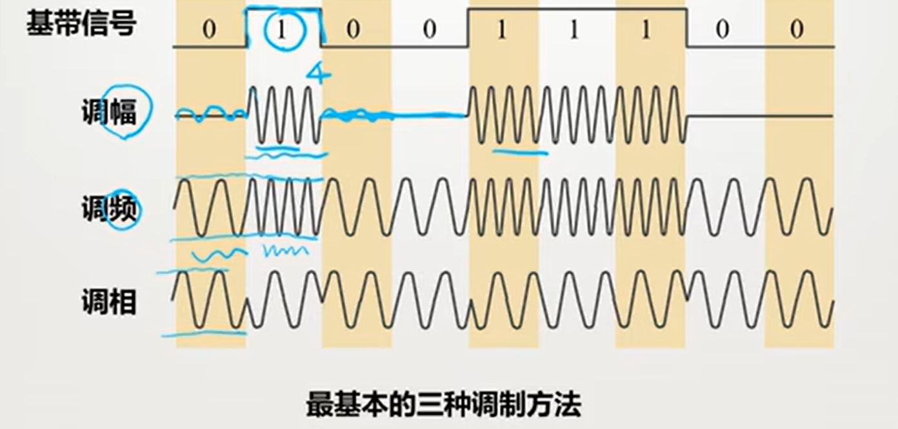

**调幅AM**：载波的振幅随基带信号变化

**调频FM**：载波的频率随基带信号变化

**调相PM**：载波的初始频率随基带信号变化

通过基本的带通调制方法，把基带信号搬移到更高的频率上去

正交振幅调制QAM，振幅和相位混合调制

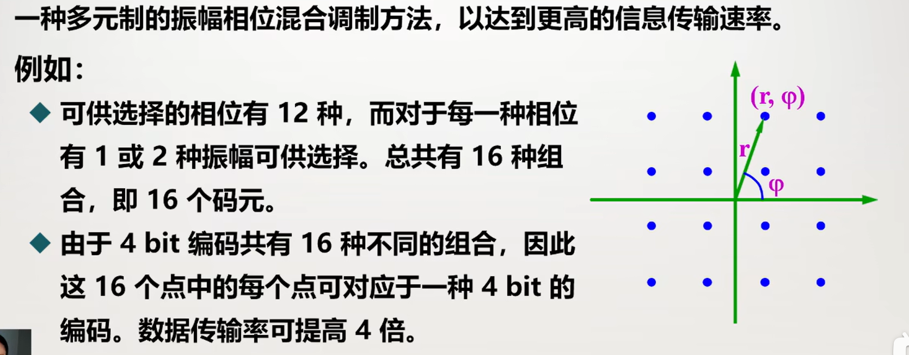

**码元：**在使用时域的波形表示数字信号时，代表不同离散数值的基本波形

**一个码元可以携带多个比特的信息量**

**波特**：就是单位时间传送的码元个数

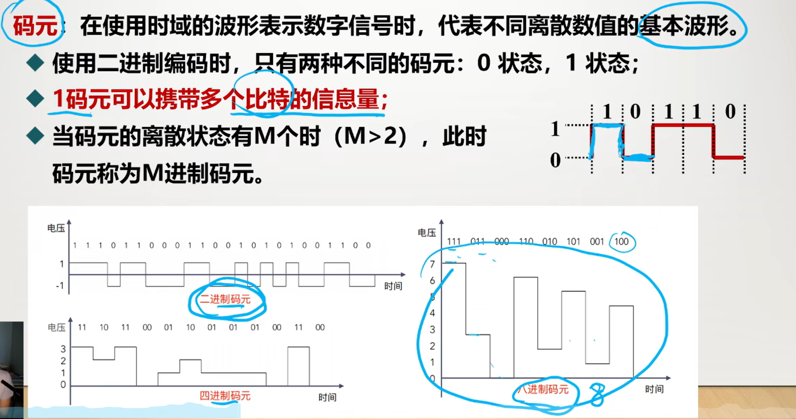

### 信道的极限容量

 任何实际信道都不是理想的，可能受到干扰而失真

严重失真时可能会无法识别

产生失真的原因：距离远、传输媒体质量差、噪声干扰、码元速率过高(**不可能**速率无限大)

#### 影响码元速率的因素：

#### 信道能通过的频率范围

当码元传播速度过快时会出现**码间串扰**(接收端收到的信号失去了码元间的清晰界限)

为了避免其过于严重，在理想条件下推导出了**奈氏准则**

##### 奈氏准则 

在带宽为W(单位HZ)的理想低通信道(无噪声，带宽受限)中信道上，
$$
码元传输的最高速率=2W(码元/秒)
$$
 信道频带越宽，能通过的信号的高频分量越多，那就可以用更高速率传送码元而不出现码间串扰。

奈氏准则给出的是码元传输速率的限制，没对信息传输速率做出限制

在v进制码元的情况下
$$
理想低通信道的极限数据传输率=2W\log_2v (bit/s)
$$
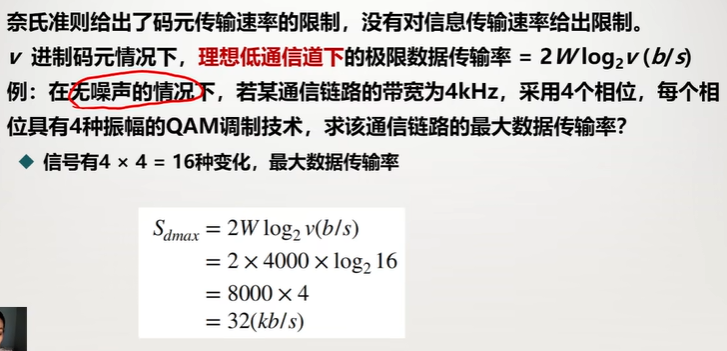

#### 信噪比

信噪比就是信号的平均功率和噪声平均功率之比，常记作S/N，是个没有单位的比值，但是可以用分贝(dB)表示，下面是和分贝的换算公式，其实它们数值上是相等的，但是分贝更易记录
$$
信噪比(dB) = 10\lg(S/N)(dB)
$$
香农公式提出，信道的**极限无差错**的传输速率C为

**注意，若给的S/N是分贝，要化回比值再算**
$$
C = W\log_2(1+S/N) (bit/s)
$$
香农公式表明，**信道的带宽越大或信噪比越大，极限传输速率就越大**

香农公式的意义：只要信息的传输速率低于极限信息传输速率，就一定能找到某种方法实现无差错传输。

### 奈氏准则和香农公式的意义

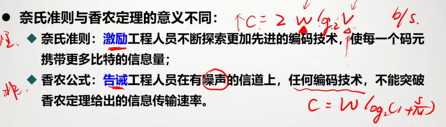

## 物理层下的传输媒体

传输媒体就是发送器和接收器间的传输媒体

分为**导引型**和**非导引型**

### 引导型

双绞线(不超过100米)，带宽最大能到50Gbit/s

同轴电缆，带宽能接近1Gbit/s

光缆：使用光脉冲进行通信

发送端要有光源，能产生光脉冲，接收端要有光检测器

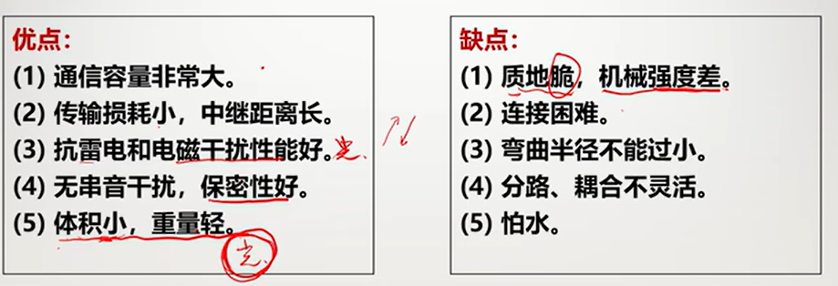

### 非导引层

用无线电通信

在空间主要是**直线**传播

短波可以通过电离层反射

微波：要么用**微波接力**，要么采用**卫星中继**

## 信道复用技术

### 为什么要信道复用

信道**资源是有限**的，实际网络中多对用户往往需要利用相同的信道传输信息

但是不同信号同时在同一信道传输可能会产生严重的**相互干扰**

### 什么是信道复用

**多路复用技术**：把多个信号组合在一条物理信道上传输，共享信道资源，提高信道利用率，降低成本

### 频分复用FDM

把带宽(Hz)分成多份，每个用户使用一个频带，在通信过程中**一直**使用它

也就是所有用户在**同样的时间**占**不同的带宽**资源

可以**充分利用带宽，效率高，易实现**

可以让N个用户个使用一个频带，也可以让很多用户**轮流使用**这N个频带，这种方式成为**频分多址接入(FDMA)**，简称**频分多址**

### 时分复用TDM

只使用频分复用可能会有些频带大部分是闲置的，所以有了时分复用

时分复用频率是一样的，但是在时间上分为许多个TDM帧，周期性出现，复用的n个用户，每个占用一个帧(125微秒)的1/n，不论每个用户是否有数据传输，在它分配的时间里，其他用户都要等待

让N个用户各使用一个间隙，或让更多用户轮流使用这些间隙，这种方式称为**时分多址接入(TDMA)**，简称**时分多址**

**由于计算机数据有突发性，时分复用效率不高**

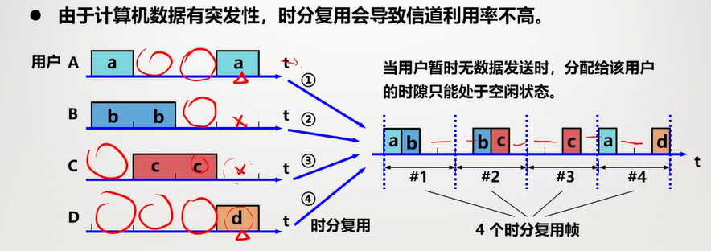

### 统计时分复用STDM

也叫异步时分复用

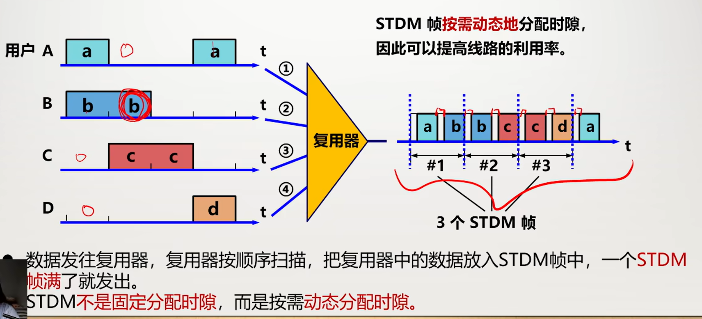

多个用户连接一个集中器，把数据发往集中器，复用器按顺序扫描，把复用器的数据放入STDM帧中，**帧满**了就发出

STDM**不是固定分配时隙**，而是按需**动态分配时隙**

适合突发数据多，用户多，数据少的时候

### 波分复用WDM

就是光的频分复用

将两种或多种**不同波长**的光载波信号，在发送端径复用器把光载波信号汇合在一起使用**一根光纤来同时传输多个光载波信号**

### 码分复用CDM

每一个用户可以在**相同的时间**使用**相同的频带**进行通信

各用户经过特殊挑选的码型传输数据，不会产生相互干扰

当CDM为多个用户共享时，就称为**码分多址**

#### 发送原理

把原来一个比特的时间分为m个短的时间间隔，称为码片

**每个站**有一个自己**唯一**的**码片**序列

若该站想发1，这改为发送这个m位的码片序列

若想发0，则发码片序列的反码

这样做，原来要发送的数据率是b bit/s，现在就变成了mb bit/s了

**实现了扩频**，但对单个信号也增加了消耗的带宽，不过由于可以和其它用户公用，整体是高效的

#### 接收原理

首先对每个站的码片序列有要求，相互之间**码片各不相同，且相互正交(内积为0)**

每个码片与自己的**规格化内积为1**(自己的内积除以m)

与自己**反码的内积为-1**

在发送时，直接把几个站使用码片变换后的数据直接叠加进行传输

在接收端，对每一段时间间隔，使用各个站的码片和收到的信号向量做规格化内积

若内积为1，则该站这个时间间隔发送的是1；

若内积为-1，则说明发送的是0；

若内积为0，则说明该站在这个时间间隔没发送数据

#### 优点

保密性高，发送过程中，不知道码片无法得知传送的信息。

效率高，可以多个用户公用。

# 数据链路层

## 概述

### 为什么要数据链路层

物理层解决了相邻节点**透明传输**比特的问题

但是如何在比特流中找到数据开始和结束的位置

线路上有多个设备时比特流由谁接收

比特传输错误怎么办

### 什么是数据链路

**链路**link：是节点间的**物理通道**，是无源的物理线路，中间无交换节点

**数据链路**data link：是节点间的**逻辑通道**，是把实现控制数据传输的硬件和软件加到链路上，即**链路+协议**

**数据链路层**：负责通过一条链路从一个节点向物理链路**直接相连的**相邻节点传送帧

**帧**：链路层协议数据单元，封装网络层的数据报

数据链路层不必考虑物理层的实现比特传输细节

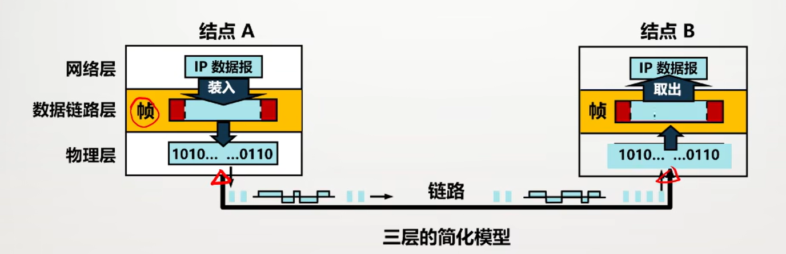

向下利用物理层提供的位流服务

向上向网络层提供明确的服务接口

### 链路层信道类型

点对点通信：一对一的通信方式(一般是骨干网用)

广播通信：一对多的通信方式(边缘部分用)

信道使用的形式不同，就会有不同的控制协议

## 三个基本问题

### 封装成帧 

**封装成帧**framing：在一段数据的前后分别添加**首部和尾部**，构成一个帧

首部和尾部的一个重要作用就是进行**帧定界**

将比特流划分成**帧**的主要目的是为了**检测和纠正**物理层在比特传输可能出现的错误

帧头和帧尾之间的数据部分(也就是IP数据报的长度)，要**小于等于**最大传输单元MTU

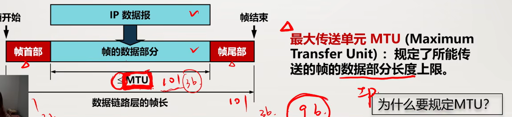

怎么封装成帧

字节计数法：指定第一个字节为该帧的长度，读完，读下一个计数字节判断下一个帧

但是当技术字节出错，会导致一连串错误

#### 带字节的填充的定界符法：用控制字符作为帧定界符

控制字符SOH代表帧首部的开始

控制字符EOT放在帧的末尾，表示帧的结束

但是当数据和开始符或结束符相同时，会出现划分错误

### 透明传输

是为了：无论发送什么样的比特组合的数据，都能按照原样**没有差错**地通过这个数据链路层

#### 发送方采用字节填充或字符填充

对内部数据的与开头结尾相同的数据前，加上一个转义符号

接收方逐个字节检查，遇到转义符号就不会认为是帧头或帧尾，把转义符号删掉再读入。

#### 其它发送方式的解决办法(比特填充、编码违例)

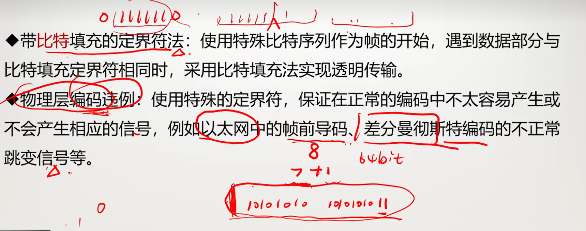

### 差错控制(不能实现可靠传输)

噪声会导致数据在传输过程中产生**比特差错**

**误码率BER**：传输错误比特占传输比特总数的比率，与信噪比有关

**纠错码**：主要用于错误发生比较频繁的信道上，如无线链路

检错码：主要用在高可靠、误码率较低的信道上，例如光纤链路

#### 循环冗余检验CRC

在原始数据(假设k位)后加上n位的冗余码，改为发送n+k位数据

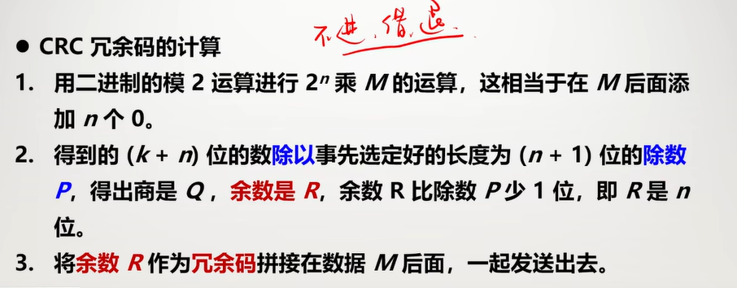

##### 冗余码计算

先在k位数据后**加上n个0**，除上事先约定好的数P(n+1位)

进行模2除法运算(可以看作是**求异或**，相同为0不同为1)

用得到的**余数(n位)就是冗余码**

冗余码也叫做**帧检测序列FCS**

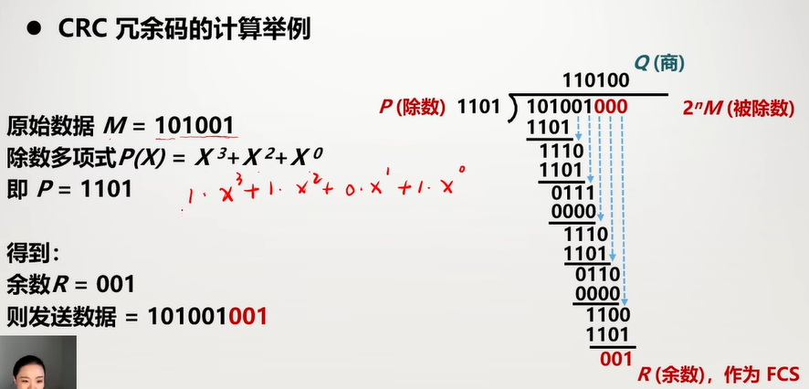

##### 除数P的表示，P(X)生成多项式

多项式与2对应次方存在的位置写1，其余补0

##### 接收端检验

接收端对接收到的帧进行CRC检验，若余数为0，可认为无错误

若不为0，就认为出了差错，丢弃

#### 可靠传输的概念

仅用循环冗余检验差错只能做到**无差错接受**

即凡是接受的帧，都能以**非常接近于1的概率**认为在传输过程中没有差错

即**凡是接收端数据链路层接受的帧均无差错**

以上只确定了每个帧无比特差错

但是无传输差错要求帧与帧之间的关系也不能错

要**不重复、不丢失、不失序**

所以还有加上**帧编号、确认和重传**才能做到可靠传输

## 点对点协议PPP

### 应当满足的需求

**简单**、

能承载不同的网络层分组、

能在多种链路上运行

封装成帧、

透明传输(字节填充、零比特传输)、

差错检验

实时检测链路工作状态

设置链路最大传输单元MTU

网络层地址协商机制——必须提供一种机制使得通信的两个网络层实体能通过协商知道或能配置彼此的网络层地址

数据压缩协商机制

### PPP协议的组成

#### 一种将IP数据报封装到同步/异步串行链路的方法

#### 链路控制协议LCP

用于**建立、配置和测试**数据链路的控制协议，通信双方可以协商一些选项，最重要的功能之一是**身份验证**

#### 网络控制协议NCP

其中每个协议支持一种不同的网络层协议，如IP、OSI的网络层

### PPP协议的帧格式

首部的第一个字段和尾部最后一个字段都是标志字段F(16进制的7E，2进制的01111110).它标志一个帧的开始和结束。**F就是PPP帧的定界符**

### 透明传输问题

PPP在异步传输时，使用**字节填充法**

在同步传输时，采用**零比特填充法**

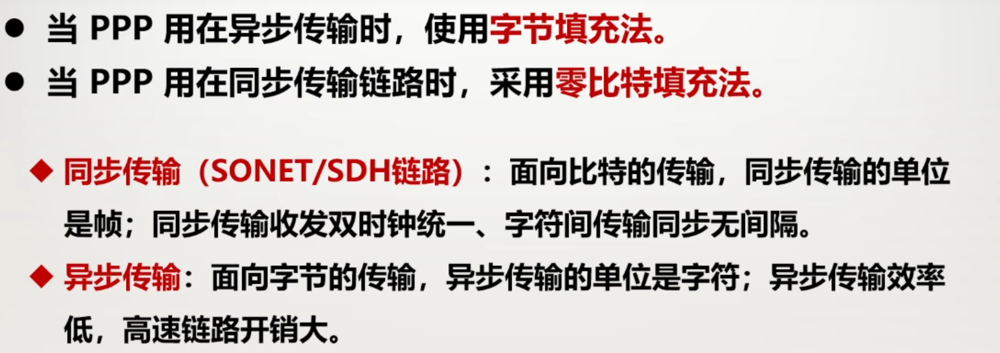

#### 字节填充

在遇到7E或者小于0x20的字符，在其前面加上7D，与0x20异或

在接收时反向改回来就行了

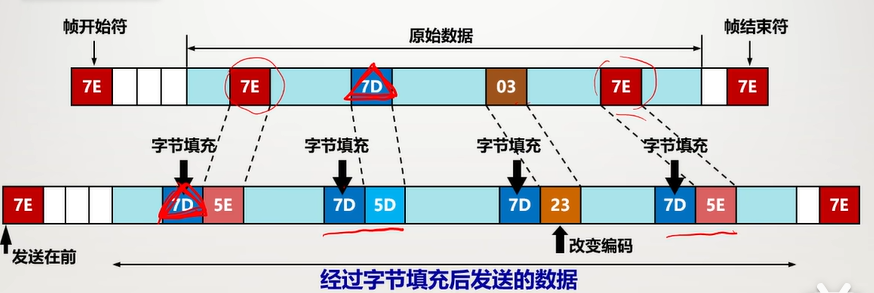

#### 零比特填充

在数据里，每遇到5个1在后面加一个0

### PPP的工作状态

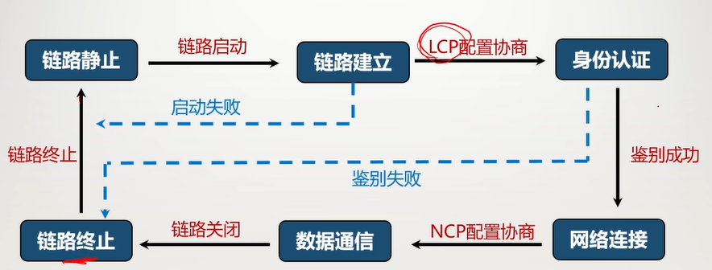

## 广播通信

### 局域网的数据链路层

#### 局域网的主要特点

网络一个单位所有，且地理位置和站点数目均有限

#### 局域网的优点

有广播功能：一个站点可以方便的访问全网

便于系统拓展和演变

更可靠

#### 局域网的拓扑结构

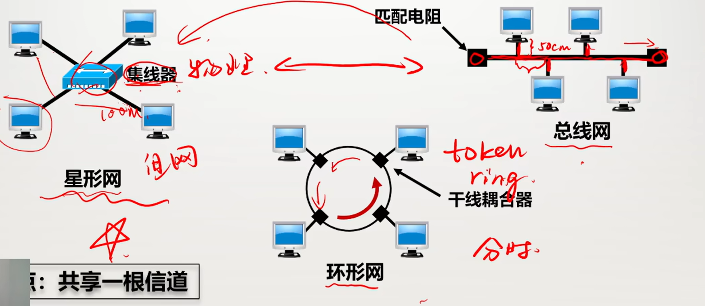

共享同一个信道

#### 广播面临的问题

可能会有多个站点同时请求

#### 解决办法

进行信道分配

#### 适配器(网卡)的作用

MAC地址存在适配器里，IP地址存在计算机存储器里

可以进行串行/并行转换

对数据进行缓存

在操作系统按照设备驱动程序

实现以太网协议

#### 以太网采取的两种重要措施

采用较为灵活的**无连接工作方式**

- 不必事先建立连接就能发送
- 不对发送的数据帧编号，也不要求对方发确认(不需要进行可靠传输)
- 提供不可靠的尽最大努力的交付
- 差错帧是否重传由**高层决定**(运输层)

发送数据都使用**曼彻斯特**编码，便于同步

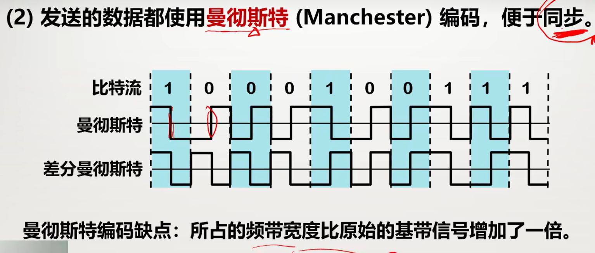

曼彻斯特编码的缺点

**所占频带宽度是基带信号的两倍**(由于每秒的码元数加倍了)

#### 总线型以太网的工作特点

最早的以太网：把许多计算机都连接到一根**总线**上

总线特点：易于实现**广播通信**，简单可靠。

##### 如何实现一对一通信

将接收站的硬件地址写入**帧首部**的目的地址字段中，仅当目的地址与适配器硬件地址一致时才接收这个数据帧

##### 总线缺点

会产生发送**碰撞或冲突**(信号的叠加)，导致发送失败

需要在以太网上实现动态 媒体接入控制，也就是下面的CSMA/CD协议

### 媒体接入控制MAC

**静态划分信道**：频分复用、时分复用、波分复用、码分复用(在物理层学习的)

适用于通信流量大且流量稳定、用户数量少且固定

代价高，不适合突发性业务，**不适合局域网**

**动态媒体接入控制(多点接入)**

随机接入：用户可随机地发送信息(**以太网**)

受控接入：用户必须服从一定的控制，如轮询

下面介绍一下对应协议，主要是随机接入的

### ALOHA协议

#### 纯ALOHA协议

不监听信道，不按时间槽发送，随机重发，想发就发

下图里的T0指的是发送时延+传输时延，也就是发送开始直到到达站点

#### 时隙ALOHA协议

把时间分成若干个相同的时间片，所有用户在时间片开始同步接入网络，若发生冲突，必须等到下一个时间片再发送

### CSMA

#### 1-坚持CSMA

空闲直接传

忙就一直监听直到空闲发送

遇到冲突就等待随机时间再开始监听

#### 非坚持CSMA

如果忙了，先等待一段时间再监听

#### p-坚持CSMA

空闲以概率p发送，否则等到下一个时间槽再发

忙就持续监听

冲突就等到下一个时间槽

### CSMA/CD(在以太网上，是有线网)

中文名：载波监听多点接入/碰撞检测

这个协议简单来说就是： 先听后发，边听边发， 冲突停止，延迟重发

**多点接入：**说明是总线型网络。(许多计算机以多点接入的方式连接在一根总线上)

**载波监听：**边发送边监听，不论是在想发送数据**之前**还是发送数据**之中**，每个站**都不断检测信道**(看是不是空闲)。

**碰撞检测：**检测信道上的信号电压变化情况，若**电压摆动值**超过了某一阈值，则认为总线上至少两个站在发送数据，说明发生了**碰撞**

检测到碰撞后：

适配器立刻停止发送。等待一段随机时间后再发送。

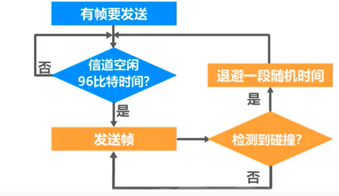

96比特时间是指9.6微秒

#### 碰撞检测实现

发送数据前，就已经监听过信道，但是还要进行碰撞检测

这是因为信号有传播时延

τ是单项传播时延，A到达B还剩δ是B发送数据

则在τ+δ/2时刻两信号相遇，在τ时刻B检测到碰撞

在2τ-δ时刻A检测到碰撞

**若未发生碰撞，A接收到信号的最短时间为2τ**(B接收到A的信号，立刻接收完毕并向A返回)

所有把2τ的时间称为**争用期**，一般就是51.2微秒

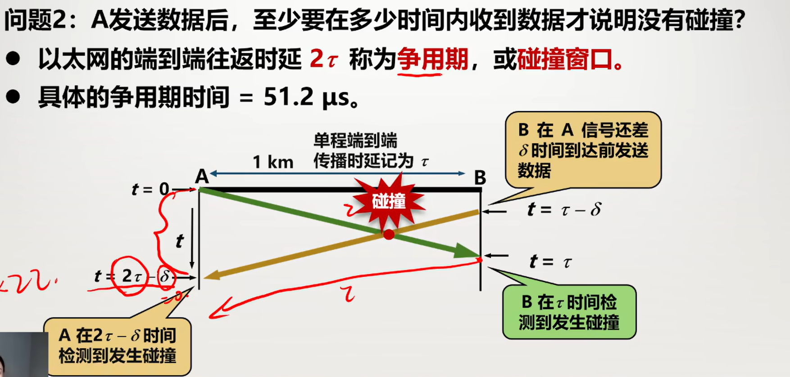

**经过争用期还未检测到碰撞，这次发送就不会再有碰撞了**

#### 碰撞后重传(截断二进制指数退避)

在发生碰撞后，要等一个随机的时间再发生

**基本退避时间2τ**

从集合中随机选一个数r，则时延T=r*基本退避时间

集合为1、2，......(2^k-1)。里面的k是重传次数和10的较小值

重传最多进行16次，再不成功就要丢弃，并向上层汇报

#### 最短有效帧长

64字节，最短也要发2τ的时间，在这个期间可能会有碰撞出现，所以最好要一直监听，所以有了最短帧长，刚好是10Mbps的以太网2τ发送的数据

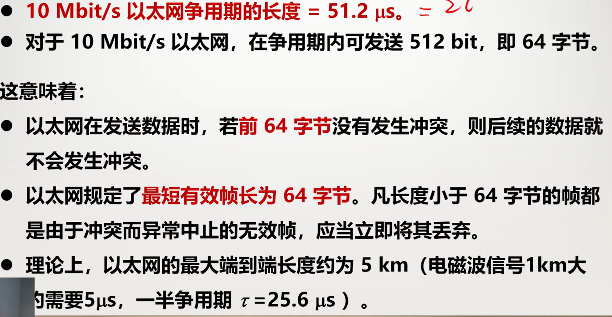

#### 强化碰撞

当AB发生碰撞时，其它用户可能不知情

所以在发生碰撞时，先发现的那个用户要发送一个人为干扰信号

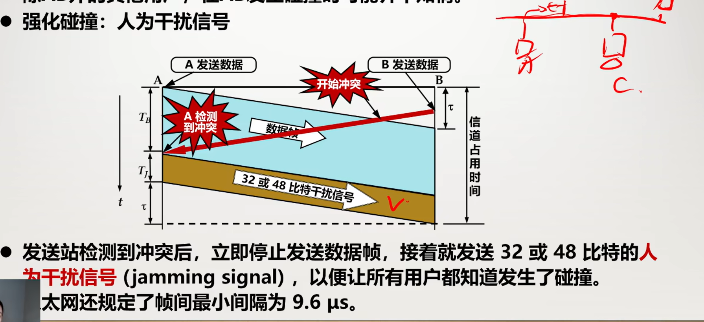

#### CSMA/CD的重要特性

使用CSMA/CD协议的以太网不能全双工，只能半双工

每个站在自己发送数据后的一小段时间里，可能发生碰撞

以太网的平均通信量**远小于最高**通信率

**先听后发，边听边发， 冲突停止，延迟重发**

### CSMA/CA(适用于无线局域网)

中文名：载波监听多址接入/碰撞避免

在局域网不能使用碰撞检测CD

由于无线局域网信号弱，要实现碰撞检测的硬件要求非常高

即使能实现，也会由于隐蔽站的问题，没什么意义

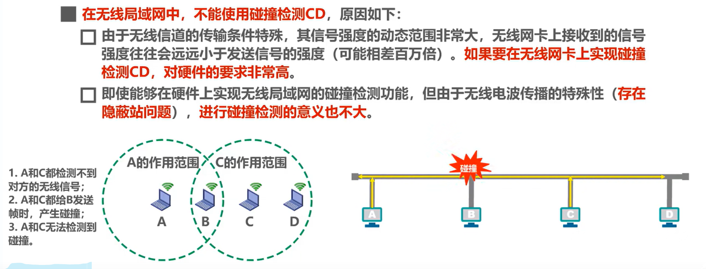

#### 特点

802.11无限局域网使用CSMA/CA协议，实现了碰撞避免功能

由于**不可能避免所有碰撞**，且无线通信**误码率较高**，802.11还**使用了确认机制(停止等待协议SW)**，确保数据正确接收

#### 帧间间隔IFS

**所有站点必须在检测到信道空闲后，等待一段指定的时间IFS才能发送帧**

帧间隔取决于该帧的类型

优先级高，间隔就短，反之则长

可以减少碰撞

##### 短帧间间隔SIFS

最短的帧间间隔28微秒，ACK帧、CTS帧还有MAC分片导致的多个帧都是用SIFS

##### DCF帧间间隔DIFS

128微秒，在DCF方式中发送数据帧和管理帧

#### 工作原理

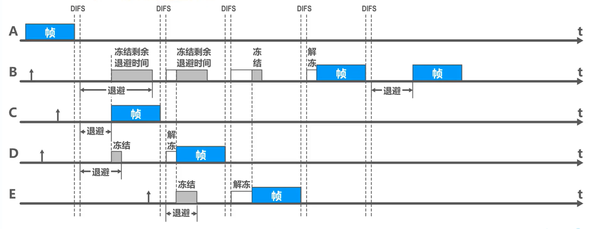

##### 信道空闲

在源站要发送数据帧时，若检测到信道空闲，则**等待一个DIFS帧**的时间，若依旧空闲，则发送帧

**等待DIFS是为了防止有其它优先级更高的帧要发送，若有就先让它们发**

目的站接收帧后，**等一个SIFS**后，**发送ACK**返回 (其实这里就是使用的SW协议)

等待SIFS是为了分隔各帧切换站点的发送方式变为接收

##### 信道繁忙

当信道繁忙时，其它站要发信号，必须要在繁忙结束后，等待一个DIFS，然后再等待一段随机时间才能发送。这是为了防止多个信道发生碰撞

##### 使用退避算法条件

##### 退避算法

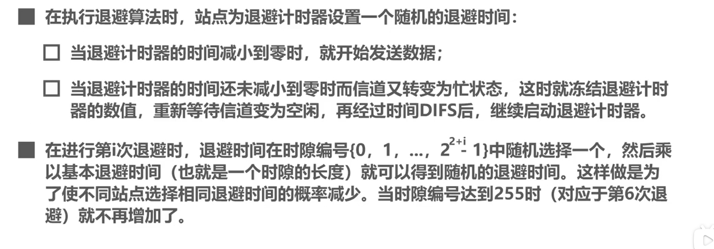

在执行退避算法时，先给该站点设置一个随机的退避时间

当计时器变为0就可以发送数据了

但还未到0，信道繁忙了，计时器要暂停，等到信道空闲并等一个DIFS后，再开始计时

###### 退避时间计算

与二进制退避算法很相似，基本退避时间变为了时隙长度

第i次退避时隙编号变为了[0,1,......2^(2+i)-1]，i到6就不再增长(也就是最小是[0,7],最大是[0,255])，与二进制退避稍有不同

#### 信道预约

##### 源站和目的站

源站先发送RTS帧，

目的站收到后等一个SIFS发送CTS帧，

源站收到CTS帧后，等一个SIFS发送数据帧，

目的站收到后，等一个SIFS发送ACK帧

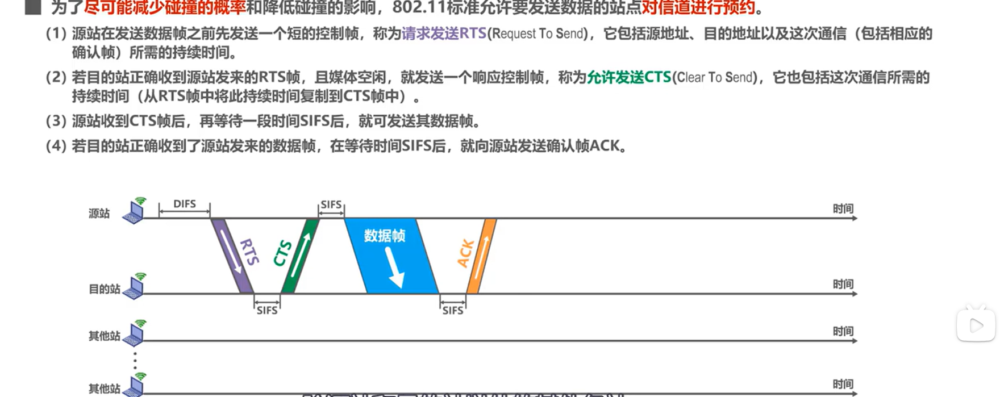

##### 其它站

其它站收到CTS帧，说明有其它站在预约成功了，就推迟自己的通信

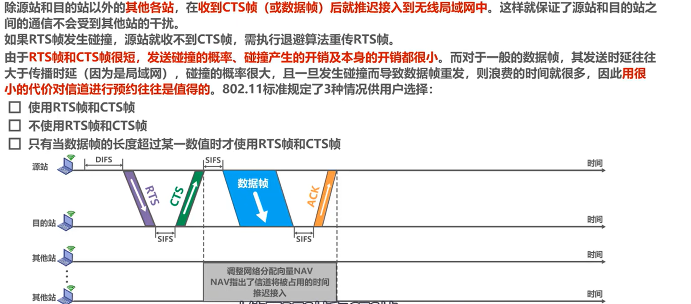

#### 虚拟载波监听

CTS帧和RTS帧都含有占用时间，其它站只要收到了，就暂时不会发送数据

解决了隐蔽站的问题，减少了碰撞

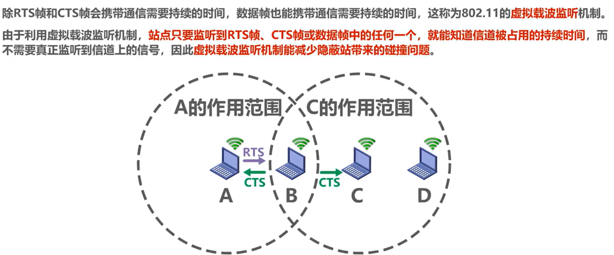

### 轮询访问：令牌传输协议

#### 轮询协议

#### 令牌传递协议

空闲时令牌不断在各站间依次传递

若遇到要发数据的站点，修改令牌标志位，加入数据，继续传递，传递到目的站点时，复制一份，继续传递，回到源站后，检测是否有差错，若有则重传

没有就把标志位改回去，数据去掉，继续传递

### 使用集线器的星形拓扑

使用双绞线的以太网采用星形拓扑

在星形中心增加了可靠性非常高的设备，叫做**集线器**

每个站到集线器的距离不超过100m

#### 集线器的特点

使用集线器的以太网在**逻辑上依然是一个总线网**

仍然是**共享信道**，还是使用CSMA/CD协议，共享逻辑上的总线

**工作在物理层**

采用专门芯片，减少干扰

### 以太网的信道利用率

多个站在以太网同时工作就会发生碰撞

碰撞时资源会浪费，所以**以太网的信道利用率并不能达到100%**

τ/T0越小，信道利用率越高

在以太网中定义了参数a=τ/T0
$$
以太网的信道利用率S_{max} = \frac{T_0}{T_0+τ} = \frac{1}{1+a}
$$
a应当尽量小，帧不能太短

### 以太网的MAC层

#### MAC层的硬件地址

又称**物理地址**或者**MAC地址**

每台计算机中**固化在适配器的ROM中的地址**

每个适配器一个MAC地址，相当于标识符

**局域网上的每个接口都有一个MAC地址**

IEEE规定mac地址第一个字节的最低有效位为I/G

单站地址：I/G位=0。可作为发送方，也可作为接收方

组地址：I/G位=1.组地址用于多播，只能作为目的地址使用

广播地址：48位全都为1.只能作为目的地址使用。

发往本站的帧有三种

#### MAC帧的格式

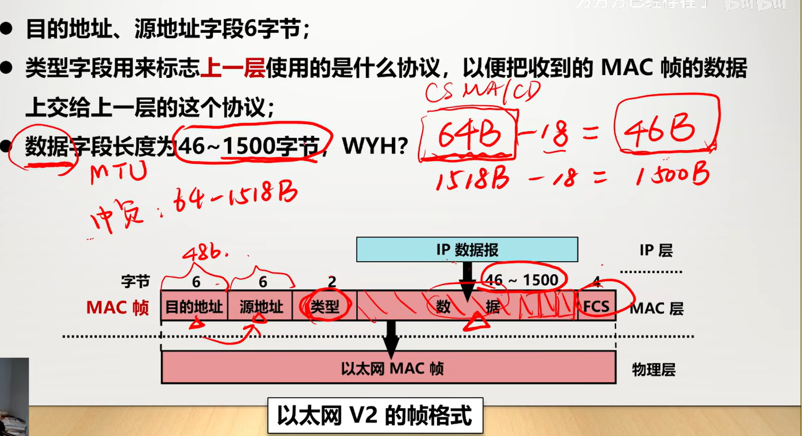

目的地址(接收方)6字节

源地址(发送方)6字节

类型2字节：上次的协议类型

数据字段46-1500字节

帧检验序列FCS 4字节

注意，MAC帧的长度为64-1518字节

而数据字段，也就是本层的MTU长度为48-1500字节

##### 帧前同步码

##### 无效帧

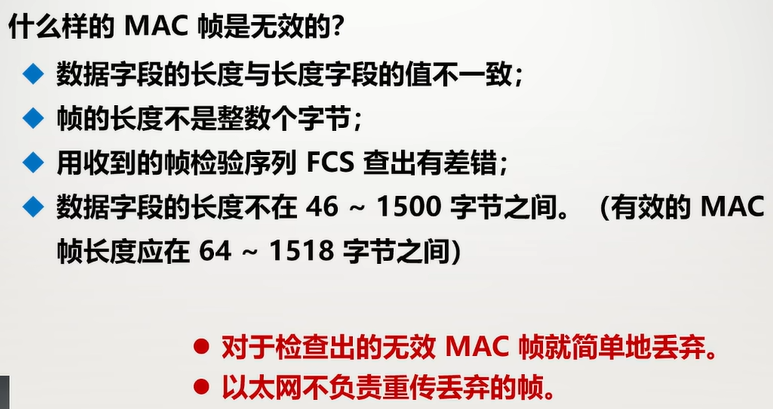

长度不是整数字节的

校验码校验不通过的

数据长度不在范围内的

**检测到无效帧就丢弃**

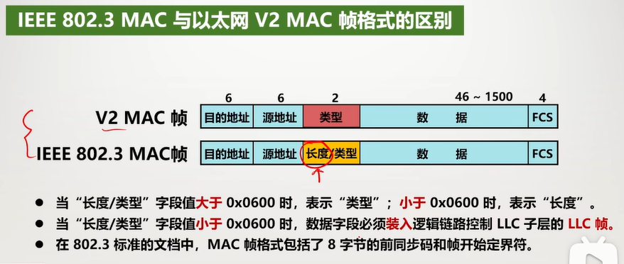

## 拓展的以太网

解决了怎么把以太网变大，并应对变大后产生的后果

在网络层眼中：扩展后的以太网仍然是一个网络

### 在物理层扩展以太网

#### 使用光纤拓展(延长距离)

主机使用光纤和一对光纤调制解调器连接到集线器

#### 使用集线器扩展

 使用集线器扩展，将原来几个集线器组成的独立的网络，合并成一个大的网络，这些计算机仍然在一个冲突域中

##### 优点

使原来不同冲突域的计算机能**跨冲突域通信**

扩大了覆盖范围

##### 缺点

冲突域增大了，总的吞吐量没提高

如果用到以太网技术不同(如数据率不同)，就不能用集线器互联

存在安全隐患

### 数据链路层扩展以太网

更常用

早期使用**网桥**，现在用以太网**交换机**

#### 以太网交换机的特点

实质上是一个**多接口的网桥**

每个接口的与一个单台主机或另一个以太网交换机相连，并且一般是**全双工**的方式工作。

以太网交换机具有**并行性**

能连接多对接口，使多对主机能同时通信

互相联通的主机都独占传输媒体，无冲突的传输数据

每个端口和连接到端口的主机构成了一个冲突域

接口有存储器

**即插即用**。其内部的帧**交换表**(也叫地址表)是通过自学习算法自动的建立起来的

使用专用的交换结构芯片，用硬件转发，比网桥块

每个用户独享带宽，增加了总容量

可以支持多种速率甚至多种类型的接口

#### 以太网交换机的自学习功能

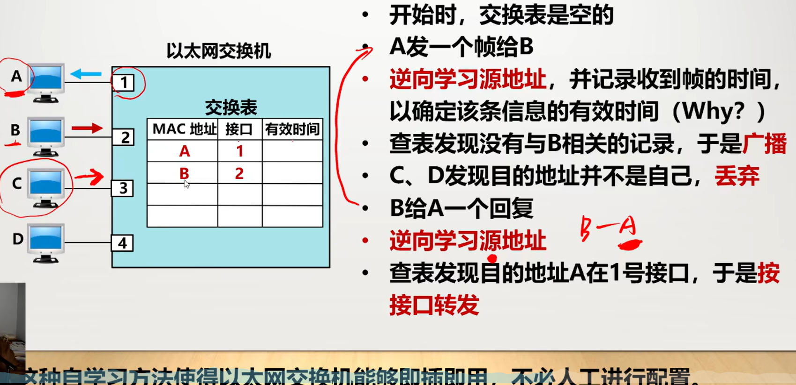

刚开始，交换表是空的

若A发送给B消息，则先将A的地址和端口记录在表中

在表中查询B，差不到，则对所有端口广播

当B给A发消息，B不在表里，则先把B的mac地址和端口记录在表中

然后在表中查A，查到了，向对应端口发消息即可

##### 两台交换机相连时

##### 多台交换机互联(形成回路<广播风暴>)

可能会形成回路，会无限循环下去，不会停止，效率会急剧降低

解决广播风暴：使用STP生成树协议，不改变实际拓扑结构，但在逻辑上切断某些链路(阻塞端口)，使得所有到其它主机的路径都是无环树的结构，消除循环。

#### 从总线以太网到星形以太网

总线型：采用总线结构，使用CSMA/CD协议，半双工

星形：不用共享总线，没有碰撞，不用CSMA/CD协议，全双工，但仍然采用以太网的帧结构

### 虚拟局域网

以太网存在的主要问题：

不可避免广播，可能会产生广播风暴

会有安全问题

用户过多，管理困难，无法区别用户

**广播域**

广播域是指：这部分网络其中的任何一台设备发出的广播通信都能被该部分网络中其它所有设备接收

**一个以太网是一个广播域**

#### 虚拟局域网定义

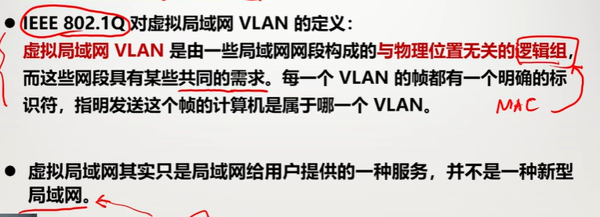

**虚拟局域网VLAN**是由一些局域网网段构成的**与物理位置无关的逻辑组**

这些网段有一些共同的需求，每一个VLAN的帧都有一个明确的标识符，指明发送该帧的计算机是哪一个VLAN。

虚拟局域网其实是局域网给用户提供的一种服务，不是新型的局域网

每个VLAN是一个广播域，每个主机发出的广播只能在VLAN里传播

也可以看作一种安全手段

#### 优点

便于管理，需求相似的用户共享同一个VLAN

增强网络安全性，普通用户与敏感用户隔离

限制了广播报文范围，抑制广播风暴

减少网络拓扑变更成本

降低CPU开销

#### 划分方法

基于交换机端口

基于网卡的MAC地址

基于协议类型

基于IP子网地址

基于高层应用或服务

## 高速以太网

### 100BASE-T以太网

又称为快速以太网

仍使用CSMA/CD协议

可在**全双工**方式下工作，而无冲突

全双工下**不使用CSMA/CD**

仍使用**IEEE802.3规定的MAC帧格式**

保持**最短帧长64字节不变**，一个网段最大电缆长度减小到100米(原来是1km)

帧间时间间隔从9.6微秒变为**0.96微秒**

### 吉比特以太网

与100BASE-T相似

当半双工时加了载波延伸(最小帧长改为512字节)和分组突发

### 10吉比特以太网

与之前相同，但是只用光纤，只用全双工

已经扩大到了城域网和广域网，实现了**端到端的以太网传输**

### 进行宽带接入

可以提供双向的宽带传输

可以根据对用户的需求灵活进行**带宽升级**

可以实现端到端的以太网传输，不**需要帧格式转换**

但是**不支持**用户识别

# 链路层可靠传输

在传输层也会讲，这里就提前一些

## 停止等待协议SW

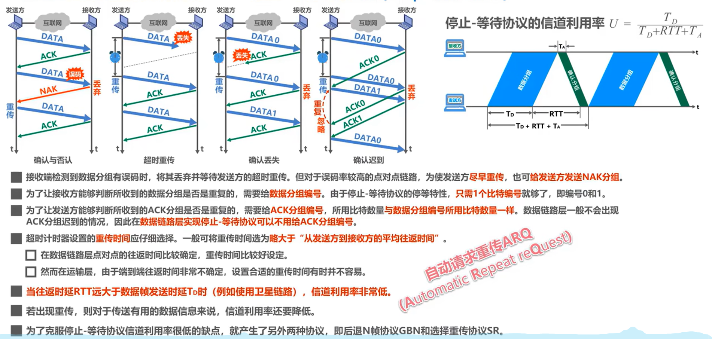

### 确认与否认

分为发送方和接收方

发送方发送数据，接收方接收到数据后进行校验，若校验成功，则给发送方发送确认分组ACK

若校验失败，则丢弃该分组，向发送方发送否认分组NAK

发送方收到ACK后，可以发送下一个分组

若收到NAK，则立刻重传上一个分组

### 超时重传

若发送方数据丢失，接收端不可能返回ACK或NAK，则发送方会无限制等待

所以加入了超时重传功能

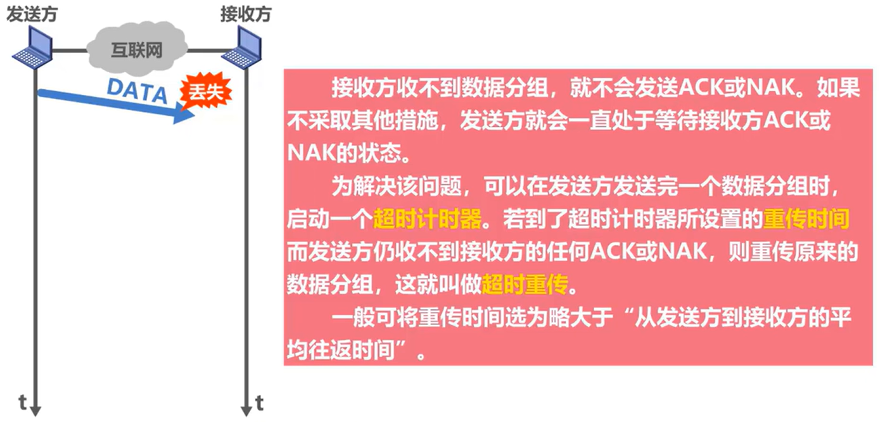

### 分组编号 和 确认分组编号

为了避免分组重复发送或者顺序错误，对分组进行编号

在发送重复确认时，会可能导致发送方无法理解是对哪个分组的确认，所以确认分组也需要编号

### 信道利用率

$$
信道利用率U = \frac{T_D}{T_D+RTT+T_A}
$$
其中T_A一般远小于T_D，可以忽略

当往返时延RTT远大于传输时延T_D时，信道利用率很低

## 回退N帧协议GBN

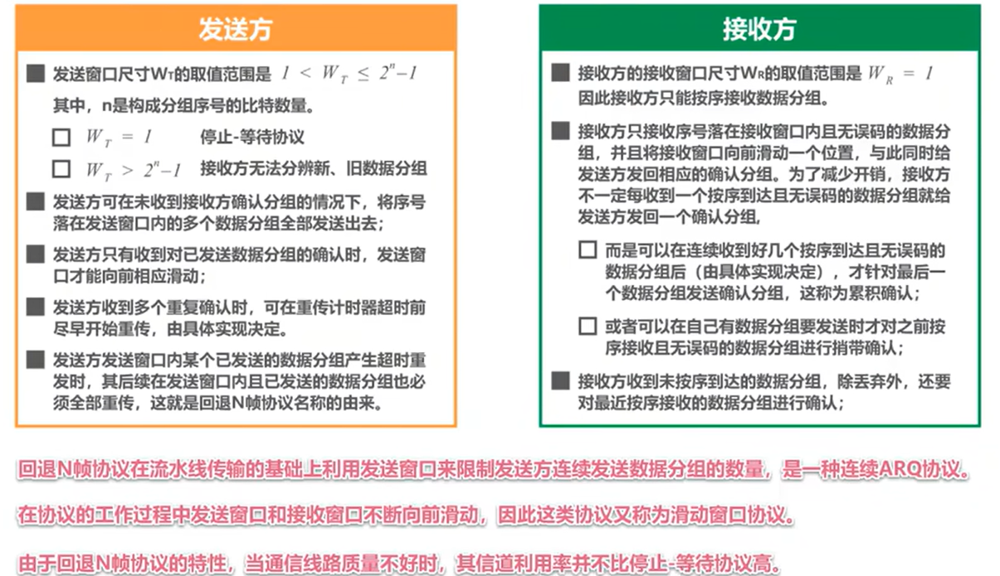

SW协议一次只发一个分组，信道利用率很低，但是如果能连续发送多个分组，就能大大提高信道利用率，这就是流水线传输

回退N帧协议就是在流水线传输的基础上，利用发送窗口来限制发送方连续发送数据分组的个数

### 窗口尺寸

发送窗口尺寸范围是
$$
1< W_T < 2^n - 1
$$
n是分组的编号占用的字节数，比如0-7编号，占用3个字节，所以尺寸最大为2^3-1=7

如果超过7，在出现错误重传的时候，会产生与接收分组编号重复的分组，导致接收方，无法确定是否为重复分组，从而导致重复接收

接收方的接收窗口长度始终为1

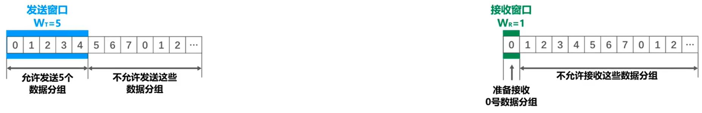

### 流程

发送方和接收方先按一定规范给分组编号

发送方一次发送多个分组，到达后接收方根据窗口目前的编号，按序接收

接收完毕一个，确认无误码，给发送方发送对应分组的确认分组

发送端接收后到第k确认分组，窗口后移k位，继续发送新加入的未发送的分组

#### 累积确认

接收方不一定要每个分组都发送确认，可以发接收到k个，只发送第k个分组的确认分组即可，发送方收到第k个确认分组，就能得知前k个都成功发送了

#### 有差错情况

若有误码，先丢弃有误码的那个分组，然后该次收到的其它分组必然全部不匹配，发送上次收到的最后一个的分组编号的确认

发送方检测到超时后，则重新发送目前窗口里的所有分组

## 选择重传协议SR

GBN协议接收窗口只能等于1，所以只能按序接收

若一个分组误码，则它后面的所有分组全部都要丢弃，全都要重传资源浪费严重

让接收窗口尺寸大于1，可以接受下失序但是没有误码的分组，并落在对应接收窗口的分组，收齐后再交付给上层，这就是选择重传协议

注意，选择重传协议**不能使用GBN的累计确认**，而要逐个确认

窗口尺寸也有所不同

### 窗口尺寸

发送窗口尺寸：
$$
1<W_T<2^{n-1}
$$
这里和GBN的2^n   -  1不同

**接收方**窗口尺寸一般**与发送方相同**

若发送方窗口不在范围内，还是无法分别新旧分组

### 流程

例如，发送了0123分组，若2号丢失了，则接收0、1分组，发送确认分组，接收窗口向前2块，然后接收3，发送确认，但是窗口不移动

发送方收到0、1、3，则发送窗口也只向前滑动2个，滑动后把新加入的发送过去

接收方接到后发送确认，但是由于2还没接到，窗口仍不动

在发送方超时后，则重新发送

当接收方收到2后，则发送确认，并窗口向前滑动

发送方收到确认，也向前滑动

# 网络层

怎么把局域网连接成全球的互联网

数据链路层解决了同一局域网计算机间帧的传输问题，但没有解决**异构网络间的连接和资源共享**问题

## 网络层的重要概念

### 网络层提供的两种服务

有两种观点

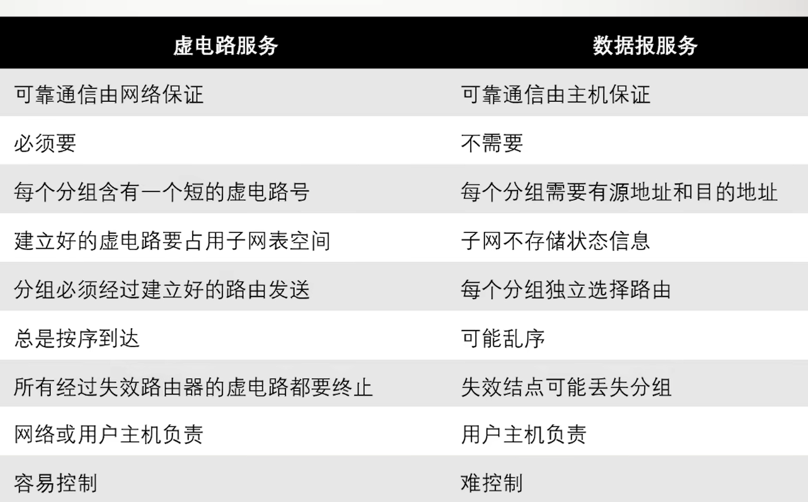

#### 虚电路服务(面向连接的)：

模仿电信网络，使用**面向连接**的通信方式

通信之前先建立虚电路，按需预留所需的网络资源，双方沿着这条**逻辑链路**按照**存储转发**传送分组，结束后释放虚电路

如果再使用可靠传输的协议，可使分组不重复，不丢失，不失序

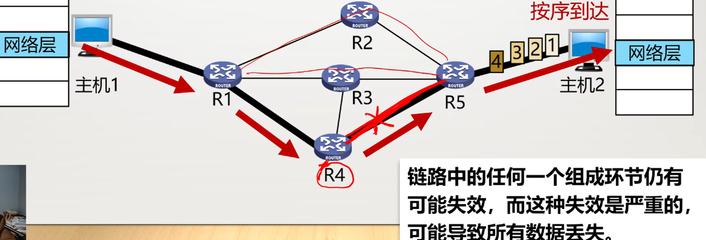

#### 数据报(分组)服务(无连接的(目前主要使用))

网络层设计要尽量简单，向上层只提供简单**灵活的、无连接的、尽最大努力交付的数据报服务**。

网络在发送分组时不需要先建立连接

每个分组独立发送，不编号

网络层不提供服务质量的承诺

可靠通信交给上层的**运输层**

## 网络协议IP

 

网络层与IP配套的协议有

地址解析控制协议ARP

网际控制报文协议ICMP

网际组管理协议IGMP

### 虚拟互联网络

没有任何一种单一网络能满足所有用户的需求，所有网络互联采用了一些**中间设备**

有了网络协议IP和中间设备，主机间的通信就好像在一个网络上通信了一样

 

如果没有经过路由器叫**直接交付**

经过路由器叫**间接交付**

### IP地址

给每个连接在互联网上的主机或路由器的每个接口分配的全球唯一的标识符。

IP地址是32位的二进制地址

采用2级结构

IP地址 ::= {<网络号>,<主机号>}

分级的好处：**便于IP地址的管理**；路由器只需根据网络号转发，**减少路由表大小，提高效率**

#### IP地址的分类

分为ABCDE，5类

A类：0开头，8位网络号

B类：10开头，16位网络号

C类：110开头，24位网络号

D类：1110开头，后面是多播地址

E类：1111开头，暂时仍未使用

主要关心前三类

#### 讨论网络数和主机数

对A类来说，网络号**全0代表本网络**，**0111111(127)用于本地环回测试**的

对A类，主机号全0**代表该网络的主机所在的地址**，主机号**全1代表对该网络所有主机**(用于广播)

对于B类和C类，**网络数与A类不同**，没有特殊要求，除了开头的格式要求外，其它都可以取

主机数和A类一样，**全0和全1不能使用**都要-2

其它一般不用于分配的IP地址

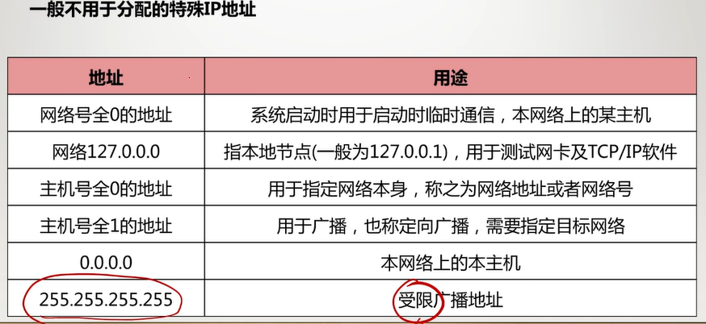

#### 子网划分

##### 定长编码

在原有的网络下，在原来的主机号里拿n位做子网号，就可以划分出2^n个子网

##### 变长编码

可以采用变长划分子网

n位可以划分n+1个子网，如

0、10、110、111；0、10、11；

##### 子网掩码

和IP地址位数一样，在网络号和子网号相同的位数上是1，其余是0，这样和IP地址进行与运算，就可以得知这个子网的网络地址了(后续路由器就靠这个转发)

#### 无分类编制方法CIDR

取消了ABC类地址、子网划分的概念，直接调整网络前缀的禅古，能更加有效的分配IPv4地址

前缀数就只需要在IP地址后面加上/然后写位数就行了

可以表示任意大小的地址块

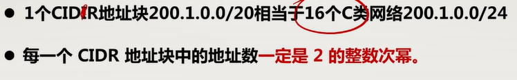

##### 三个特殊的CIDR地址块

#### IP地址的特点

##### **每个IP地址都由网络前缀和主机号组成**

方便了IP地址的分配和管理

实现路由聚合，减小转发表的空间和查表时间

##### **IP地址是标志一台主机或路由器和一条链路的接口**

当一台主机要连到**两个网络**上时，必须要有**两个**对应的IP地址，且**网络号必须不同**，这叫多归属主机

一个路由器**至少**要连两个网络，所以至少俩IP地址(一个端口一个)

##### **转发器或交换机连接起来的局域网仍是一个网络**

一个网络就是指**网络前缀一样**的主机的集合

**不同网络号**的局域网必须用**路由器**进行互联

**同一网络**的主机接口必须有**一样的网络前缀**

##### 在IP地址中所有分配到网络前缀的网络都是平等的

地址块大小并不影响网络的优先级

### IP数据报的格式

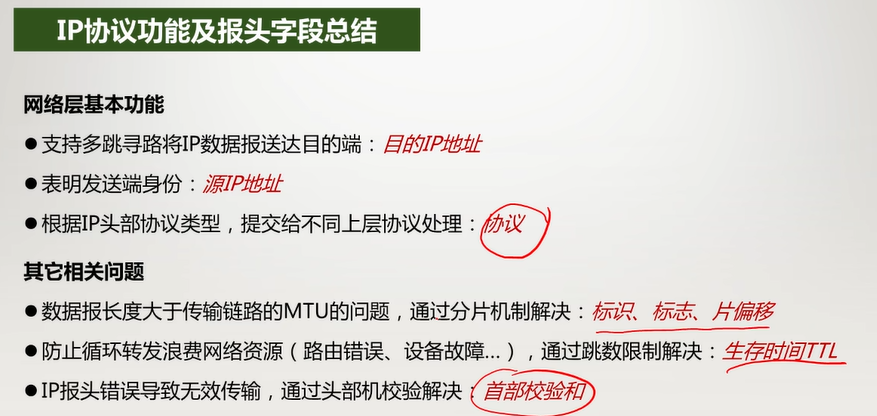

#### **版本字段**：

**4位**0.5个字节，值就是协议的版本，如IPv4这里是0100，IPv6是0110

#### **首部长度**：

**4位**0.5个字节；代表首部的长度是多少字节，**一个比特代表4个字节**，最大值为1111，代表首部长度为15*4=60字节(主要是可变部分会变，所以其值不会小于0101)

#### 区分服务：

**8位**1个字节，实际没有使用

#### **总长度**：

**16位**4个字节；代表整个数据报的长度(首部+数据)，**一个比特代表1个字节**，最大可表示2^16-1=65535字节

实际上由于数据链路层MTU的要求，比如对以太网是不能超过1500字节的，超过要进行分片，注意，分段不影响这里的值，只影响下面三个字段，它们分开传输，最后在目的地进行组合。

下面三个字段就是用于分片的

#### **标识：**

16位2个字节；同一个数据报分片的标识值要相同

#### **标志**：

3位；如下图，

保留仍未使用。

DF(Don't Fragment)：是否分组，若是1则不进行分片，此时MF无用，是0则去看MF

MF(More Fragment)：1代表之后还有分片，0代表自己就是最后一个分片

#### **片偏移：**

13位；

表示该分片的数据距原始数据开头有多少字节

其中**一个比特算8个字节**，如下图第三个分片，偏移量的值就是2960/8=370

所以说分片的**数据长度必须被8整除**

顺便这三个分片DF都是0，前两个MF是1，第三个是0

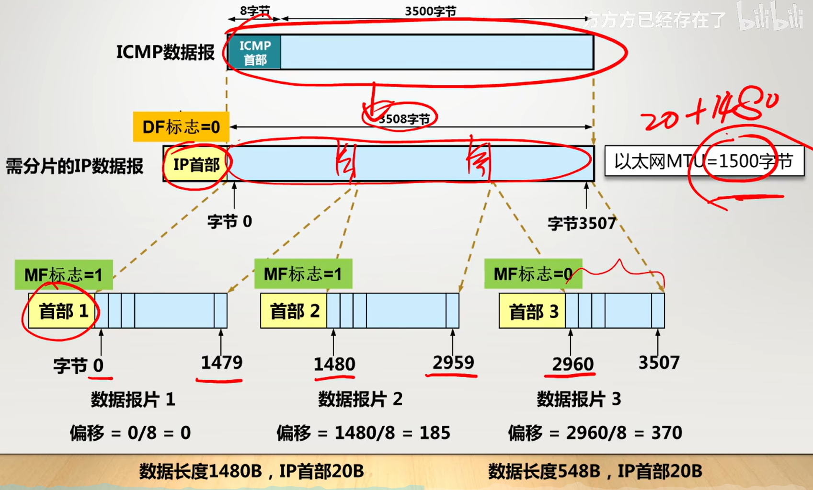

#### 生存时间TTL：

8位一个字节

表示数据报在网络中可通过的路由器的最大个数，每经过一个路由器值减一，最大是255

#### 协议

8位1个字节

指出该将数据交个哪个上层协议

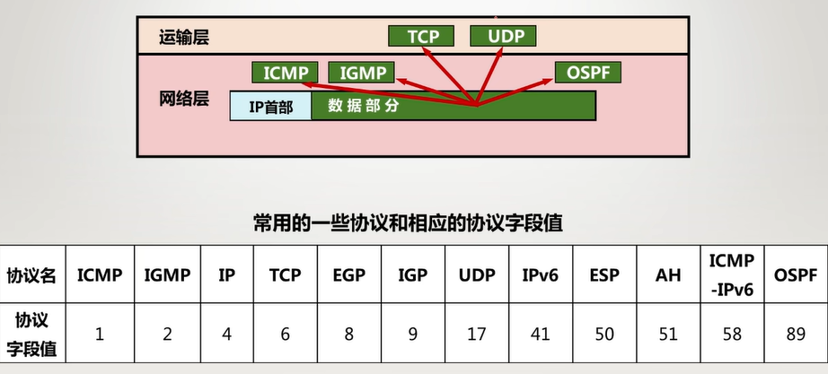

#### 首部校验和

16位2个字节

**每个路由器都校验，只校验首部，不管数据位**

先把校验和置为0，然后整个首部反码求和，再取反码

接收端先反码求和，再取反码，此时结果应当为0，否则丢弃

#### 源地址和目的地址

都是32位4个字节

32位的二进制IP地址，标识各个接口，用于网络层寻址

## IP分组的转发

### 基于终点的转发

分组是**逐跳转发**的，经过路由器查询转发表确定下一跳

基于终点的转发：基于首部的**目的地址**传送和转发

路由器转发表的信息：**目的地址和下一跳地址**

目的地址不是具体的IP地址，而是具体IP地址**所在的网络及其掩码**

### 最长前缀匹配

路由器收到转发请求，先将其**报文的目的IP地址**和路由器的**路由表中所存的所有目的网络的子网掩码相与**

若**得到的网络号和存储的一样**，就往对应的下一跳**转发**

但是可能会有多个转发表中的目的网络地址都匹配

此时要选择匹配更长的，也就是**掩选码更长**的那个，上图就因该选第一个

所以说转发表构造时，应当把前缀长的放前面

在最后应当放置全0的网络号当默认路由，用于在查不到地址时转发 

#### 转发表里的两种特殊路由

##### 主机路由

又叫特定主机路由，是对特定目的主机的IP地址指定的路由

网络前缀就是a.b.c.d/32，放在转发表的最前面

##### 默认路由

不管分组的最终目标在哪，都由指定的路由器处理

用0.0.0.1/0表示，放在转发表最后

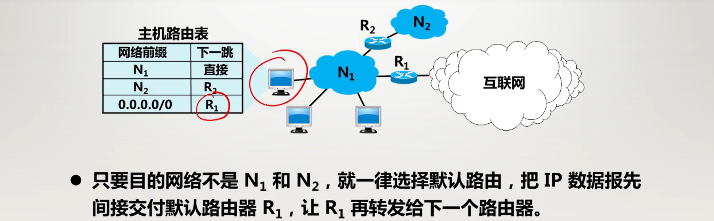

#### 路由器分组转发算法

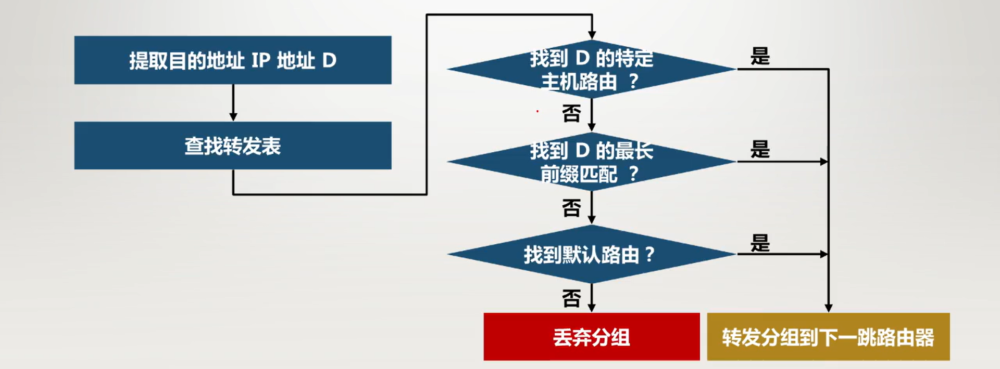

路由器一般不允许转发255.255.255.255，所以也叫受限广播地址

但是其它的广播可以，比如说2.255.255.255/8，这种可以广播，叫直接广播地址

#### 使用二叉线索查找转发表

根据存的IP地址的唯一前缀，构建二叉树，在查询的时候，把得到的IP逐个比较，到达叶子节点时，判断是否是一个网络，是就向其转发，否则丢弃

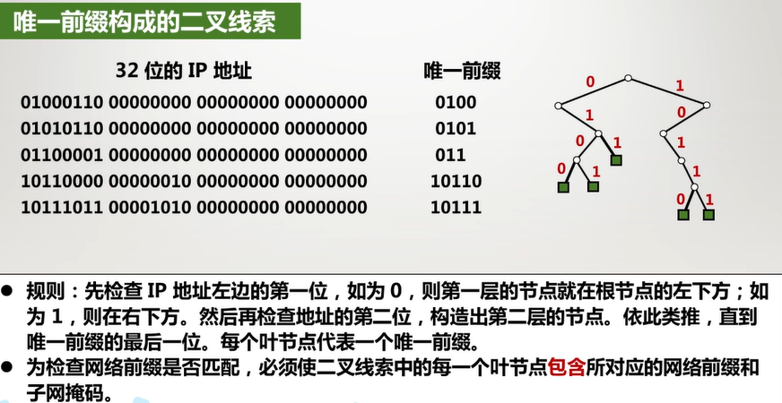

### IP地址与MAC地址

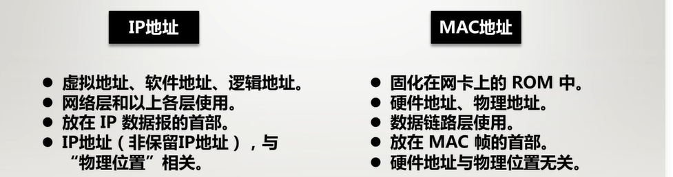

IP地址在过程中保持最初始和最后不变，MAC地址每次根据发送和接收端改变

IP层屏蔽了下层的细节，但是还是需要知道每个目的地的MAC地址才能转发，下面来了解如何知道MAC地址

### 地址解析协议ARP

每个主机会有ARP高速缓存，会存储到最近记录IP地址和MAC地址的映射，当想发送时，会先查表，若表里有，则直接使用对应的MAC地址即可，若没有，则进行下面的操作。ARP缓存biao里除了IP和MAC外，还有生存时间，这是防止原来的映射失效。

下面是**缓存中没有记录**的情况

##### 两台主机在同一局域网

发送方会先直接在本局域网广播发送ARP请求分组

分组中包含自己的IP和MAC地址，以及想知道MAC地址的IP（该分组的目的MAC地址为ff-ff--ff-ff-ff-ff）

若目的主机接收到了，则单播发送响应分组，包含自己的IP和MAC地址

##### 两台主机在不同局域网(跨路由器)

路由器在转发表中能找到对应主机，会给发送端主机回复ARP响应

##### 路由器发送在本局域网找主机

路由器会发送广播，然后对应主机会接收到发送ARP响应

##### 路由器发送在别的局域网找主机

发送方是路由器，会用ARP在本网络找到另一个路由器的MAC地址，接下来让它发，怎么找是依靠转发表，后面再看。

## 网际报文控制协议ICMP

它允许主机或路由器报告差错情况，和提供关于异常情况的报告

它封装在IP数据报的数据中

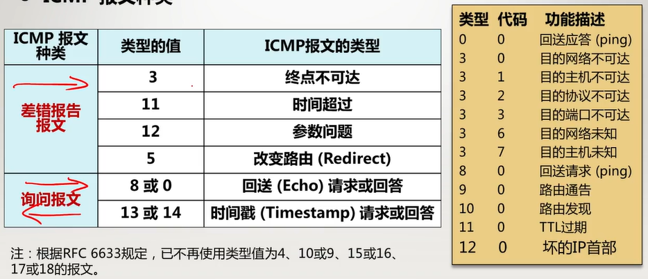

类型是分组出现问题的类型，而代码表示的是具体产生这种类型问题的原因

### 差错报告报文

ICMP差错报告报文，对出错的IP数据报，把该数据报的首部以及数据的前八个字节存入自己的数据部分

这样可以实现尽最大努力交付的任务

#### traceroute(用于网络层)

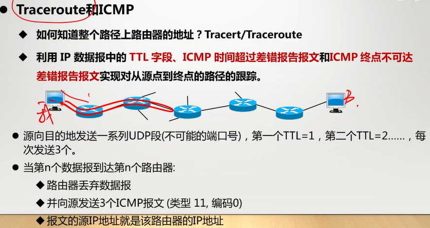

TTL为1，就会收到第一个路由器的回复。。。。。。以此类推，直到收不到

##### 不应当发送ICMP

不要为差错报告发差错报告

不对分片的后续分片发送

不对多播地址发送

特殊地址不发

### ICMP询问报文

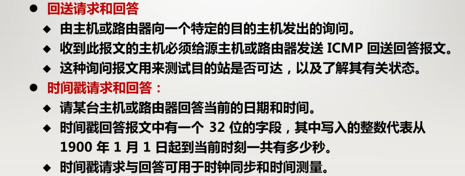

#### Ping(应用层)

用于测试两个主机的连通性

## IPv6

**为什么需要IPv6**

IPv4地址耗尽，分配不合理，VLSM没有增加地址

NAT解决了IPv4不够的问题，但是破坏的端到端通信的完整性

广播和ARP的依赖带来安全问题

### IPv协议概述

更大的地址空间：地址增大到128位

拓展的地址层次结构：可以划分更多的层次

首部更灵活：定义了更多拓展首部

改进的选项

允许协议继续扩充

支持即插即用

支持资源的预分配

IPv6首部改为8字节对齐

更小的路由表：相同区域默认分配前缀相同的IP地址

分段处理：分片在发送端进行，路由器不分片，发现要分片直接丢弃

传输安全性：强制使用IPSec安全加密传输

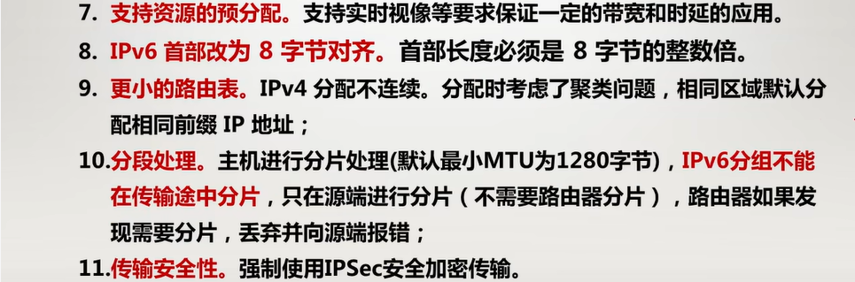

#### IPv6数据报的一般形式

**版本**：4位，代表版本

**通信量类**：8位，用于区分数据报的类别或优先级

**流标号**：20位，主要在资源预分配时使用，同属一个流的数据报流标号一样

**有效载荷长度**：16位，指明除了基本首部外的字节数(拓展首部+数据)

**下一个首部**：8位，相当于IPv4的协议字段和可选字段。可能是TCP、UDP、ICMP，也可能是拓展头

**跳数限制**：8位，就是之前的TTL生存周期，最大255

**源地址和目的地址**：都是128位

#### IPv6的扩展首部

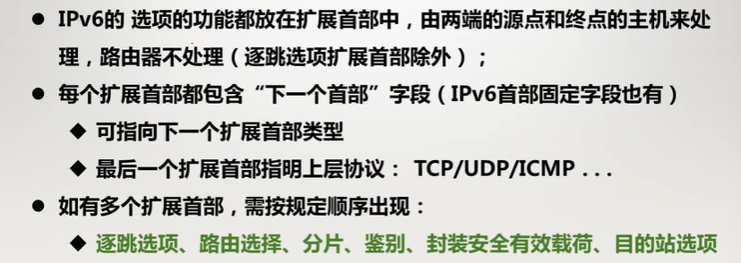

### IPv6的地址

每个地址128位

#### 三种基本类型

**单播**：传统的点对点通信

**多播**：1对多

任播：IPv6增加的类型，任播的终点是一组计算机，但是**只交付给最近的一个**

#### 冒号16进制记法

使用每4个16进制数一个冒号分隔

某一段的前导0都可以省略，若全是0则保留一个

**连续多段**0还可以进行**零压缩**:必须得连续，而且一整个地址，只能压缩一次

#### 点分十进制的后缀记法

主要用于IPv4向IPv6转变

#### 前缀的表示方法

CIDR的**斜线表示法**仍然可行，但是已经**取消了子网掩码**

#### 特别地址

#### IPv6地址的配置方式

手动配置

DHCPv6(IPv6动态主机配置协议)

无状态地址自动配置：基于邻居发现协议(NDP)的路由器请求报文(RS)的IPv6前缀信息，结合自己的MAC地址生成IPv6地址

### IPv4向IPv6的过度

它们并不互相兼容

涉及用户、服务器提供商ISP、互联网内容提供商ICP、网络设备厂家

要向后兼容：IPv6要能接收和转发IPv4，并为IPv4选择路由

#### 双协议栈

有域名系统DNS查询结果决定使用哪一套系统

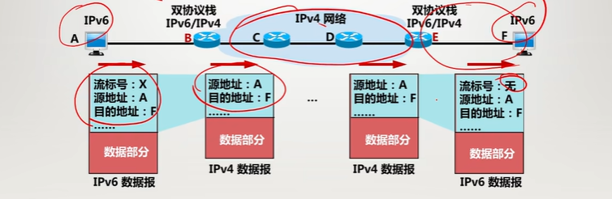

在通过IPv4的路由器时，会被重新封装成IPv4进行传递，发现IPv6再转换回去，但是会产生一些首部丢失，如流标号

#### 隧道技术

把整个IPv6数据报封装成IPv4的数据包进行传递，出来再解封

### ICMPv6

在IPv6版的网络层中，**IGMP和ARP都被取消了**

#### ICMPv6报文分类

除了原有的差错报文和信息报文

新增了**临站发现报文**和**组成员关系报文**

## 路由选择协议

### 路由选择概述

#### 理想的路由算法：

算法必须是**正确完整的**

在计算上应当**尽量简单**

要能适应网络的变化，有自适应性

算法应有**稳定性**

算法应当是**公平的**

算法应是**最佳的**

静态路由选择：没有自适应性，但是简单开销小

动态路由选择：有自适应性，复杂开销大

#### 分层的路由选择协议

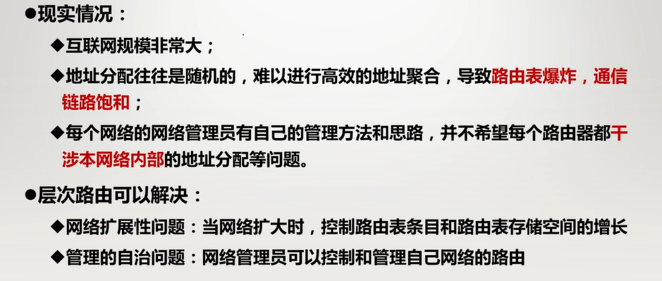

互联网由大量不同的网络互联，每个管理机构控制的网络是自治的

##### **自治系统(AS,Autonomous System)**

是在单一技术管理下的许多网络IP地址和路由器

这些路由器使用同一种自治的内部的路由选择协议(跳数、带宽、时延全都一样)

每一个AS对其它AS表现出的是一个**单一的和一致的路由选择策略**

不同的AS可以使用不同的路由算法/路由协议

每个AS有全球唯一的ID

AS还可以进一步划分层次：私有自治系统或区域

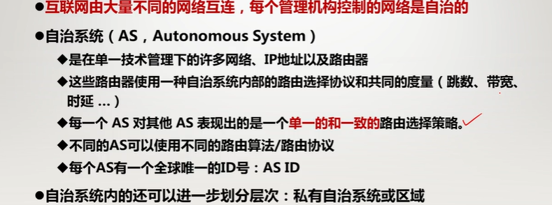

##### **自治系统内部使用使用内部网关路由协议IGP**

每个AS内的路由算法可以不同

典型的IGP算法：OSPF、RIP、IS-IS、IGRP、RIGRP

##### **自治系统之间的外部网关路由协议EGP**

个自治域之间的路由需统一

典型的EGP协议：BGP

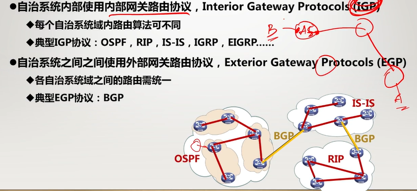

##### 分层前后的效果

### 内部网关协议1---路由信息协议RIP

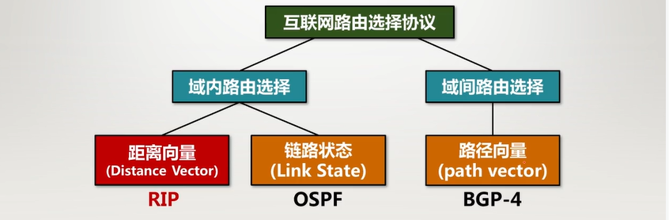

路由信息协议是一种**分布式的、基于距离向量**的路由选择

最大优点：**简单**

要求网络中每个路由器都**维护**一个自己到其它所有目的网络的**距离记录**

#### 距离定义

其中的距离就是**跳数**

**好路由：距离短的路由**

**一条路径最多15个路由器**

当距离**16时就认为不可达**

RIP**不能**在两个网络间**使用多条路由**，**只选择**距离最短的

#### 特点

只与相邻的路由器交换信息

交换的信息是本路由器**所有的**信息，即路由表

按照**固定的时间**间隔交换路由信息

#### RIP路由表的建立

在路由器刚开始工作时，只知道**直接相连**的网络的距离(此时距离为1)

之后，每个路由器都和**相邻的路由器**交换并更新路由表信息

若干次更新后，所有的路由器都会知道本自治系统中每个目的网络的**最短距离**和下一跳地址。

RIP的路由表表项：**目的网络、距离、下一跳**

距离向量算法的基础是弗洛伊德Ford算法

注意：假设R1与R2互换信息，若R1原来存有Net2 距离为4，且下一跳是R2，则不论新换来的R2里的路由表中，Net2的距离为多少，**都要更新**

这是因为可能后续Net2到R2的路径变了，原先路径不可达了

#### RIP2报文

#### RIP的优缺点

##### 好消息传的快坏消息传的慢

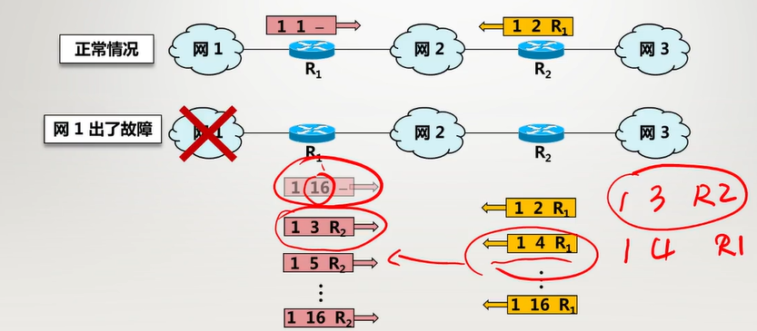

当时机不恰当时，会产生某个网断掉了，但是没有机会传递，知道双方互换到最后才能发现不可达，如上图

综上，**优点**：实现简单，开销小

**缺点**：网络规模有限，最大距离为15

交换的路由信息为完整的路由表，开销较大

坏消息传播慢，收敛时间过长

### 内部网关协议2---开放最短路径优先OSPF

采用了**Dijkstra**提出的最短路算法SPF

采用**分布式的链路状态协议**

限制使用OSPFv2

#### OSPF的特点

向本自治系统所有路由器**洪泛**信息

发送的信息是与本路由器**相邻**的所有路由器的链路状态

只要**当链路状态发生变化时**路由器才用泛洪法发送信息

各路由器通过交换信息，可以建立一个**链路状态数据库**(LSDB)，这个数据库实际上就是**全网的拓扑结构图**(RIP并不能知道整个的拓扑结构)

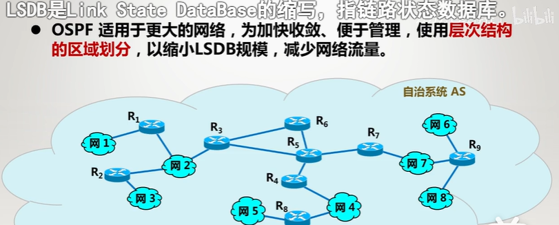

#### 划分区域

OSPF还能进行划分，分为主干区域和其它区域

每个其它区域，想要与域外别的区域或者其它AS连接，**必须经过主干区域**

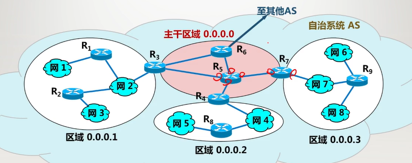

处于主干区域的路由器叫主干路由器BR

如图R34567

处于区域边界上的叫做区域边界路由器ABR

如图347

与别的自治系统相连的叫做自治系统边界路由器ASBR

如R6

##### 划分区域的优缺点

**优点**：划分后洪泛时只需要在本区域即可，减少了网络路由信息交换的通信量

减少了链路状态数据库维护的信息

**缺点**：交换的信息的种类增加了，使得协议更复杂

#### OSPF的5种分组类型

问候分组：用于发现和维持临站的可达性

数据库描述：向临站提供自己链路状态数据库的所有链路项目的摘要信息

链路状态请求：向对方发送某些链路状态的详细信息

链路状态更新：使用洪泛法对全网更新。时OSPF最核心部分

链路状态确认：对链路更新分组的确认。

#### OSPF的工作过程

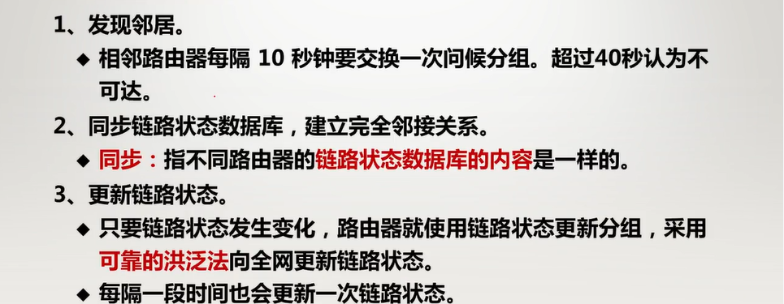

Hello能接收到的的叫做邻居

后四种分组都是用于链路状态数据库的同步

两个同步的路由器叫做完全邻接

##### 可靠洪泛法

接收到更新报文，需要回复确认报文

### 外部网关协议----边界网关协议BGP

BGP是**不同自治系统路由器之间**交换路由信息的协议

#### BGP的主要特点

力求选择能跨越AS到达目的网络且**比较好的路由**(不能兜圈子)，**并非计算出最佳路由**

因此采用的是路径向量路由选择协议

不同自治域通信靠的是自治系统边界路由器，在这里叫做**对等BGP发言人**

#### BGP路由

自治域内部使用iBGP，而且同时内部还会交换内部网关路由协议，如RIP，OSPF

自治域间使用eBGP

自治系统内的路由器只能把信息通报给发言人，或者发言人传给它们，它们之间不能互相通报

**BGP路由**：由**前缀、AS-PATH、NEXT-HOP**组成

前缀是目标地址的前缀，

AS-PATH是过程中经过的可行的一条AP路径，**中间不能有重复的自治系统号**

NEXT-HOP就是下一跳，选这个路径下一步要通过哪个服务器

##### 路由选择顺序

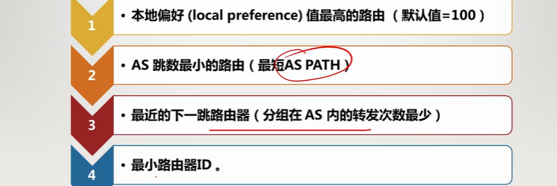

本地偏好高的先走

AS跳数少的先走

上两种都相同，则根据发送路由器距发言人近的路由器那个路径走(热土豆算法)

再相同就选路由器ID最小的

**报文**

### 路由器的构成

对于数据转发，路由器工作在网络层，**用于不同网络间转发分组**

#### 路由器的工作原理

##### **路由器传输的信息有以下两类**：

1. 主机间传送的**数据**
2. **路由信息**(这是用于构建路由表，位传输数据服务的)

##### **路由器包含两个核心功能**：

- **控制层面**：运行各种路由协议(BGP、OSPF、RIP等)，学习建立路由表
- **数据层面**：根据路由表，将IP分组转发到正确的下一跳链路

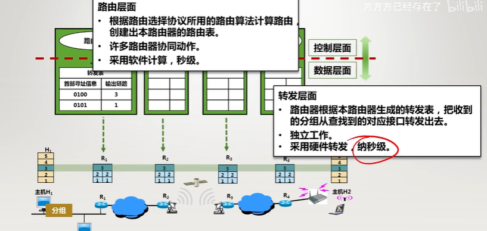

##### 路由器的结构

##### IP报文转发核心功能

链路层解封装，IP首部校验

获取报文目的IP地址

根据目的IP，基于最长前缀匹配，查询转发表

若查询成功：

1. 获取转发出去的接口和下一跳地址
2. TTL字段-1，重新计算首部的校验和
3. 重新进行链路层的封装，发送报文

若查询失败，丢弃分组

##### 典型交换结构

##### 家用路由器

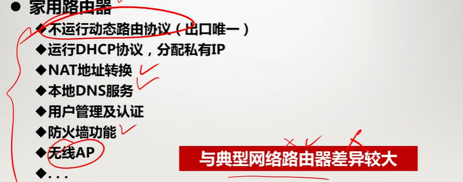

与典型的路由器差异很大

## 多播

### IP多播概念

多播：源主机给目的网络中的一部分目标用户发送数据报

目的：更好地支持一对多通信

一对多通信：一个源点发送到多个终点

也是尽最大努力交付，但是不保证一定交付，丢失也不发送ICMP报文

#### 与多次单播的区别

左图应当为单播实现同样的效果

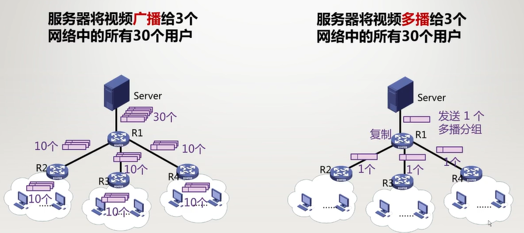

单播要进行30次，发送30份报文，

而多播主机只需要发送一份(路由器R1需要复制成3份发往三个局域网，而**局域网有硬件多播功能**，不用复制)

#### 确定组成员

边缘路由器与主机交互，了解到从它某个端口可以到达哪些组的成员—主机与路由器间的组成员关系协议。

网际组管理协议IGMP让连接在**本地局域网**上的多播路由器知道**本局域网**上是否有主机参加或退出了某个多播组，即让路由器知道**该网段**的多播组成员

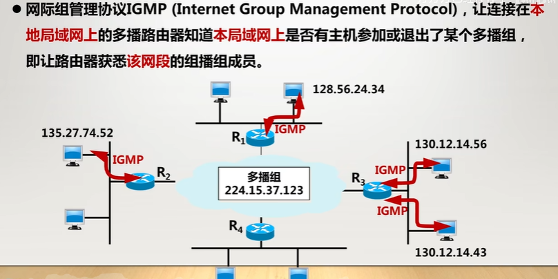

**主机加入多播组**：向路由器发起请求

**路由器定期探寻成员的变化情况**：路由器定期向主机发送询问

#### 多播IP地址

多播地址在IPv4里就是D类地址(224.0.0.0~239.255.255.255)(1110开头)，只能作为目的地址，不能作为发送地址

#### 多播硬件地址

**从01-00-5E-00-00-00到01-00-5E-7F-FF-FF**

所有通信**都使用IP多播**。只要有可能就都用**硬件多播**来传递，减少网络开销。

#### 多播路由

多播路由选择协议，使得多播路由器协同工作，把多播数据用最小代价传送给多播组的所有成员

实际上就是找到以源主机为根节点的**多播转发树**，数据沿着生成树发送

使用的三种方法如下

##### 洪泛与剪除

适合于较小的多播组，所有组成员接入的局域网也是相邻接的

为了避免兜圈子，采用**反向路径传播RPB**的策略，即受控制的洪泛：

收到的一个多播数据报时，先检查这个数据报是不是从源点的最短路径上发来的。实现的过程是，找到自己到源点的最短路径，看第一个路由器(若有多个路由器都是最短路径，那就选IP地址最小的)是不是刚才发送的那个，若是，就接收并向周围转发，否则丢弃。

剪除：若某个路由器下游没有该多播组成员，则把它下游都移除。

若多了新的组成员，再接上

这样就构成了**多播转发树**。

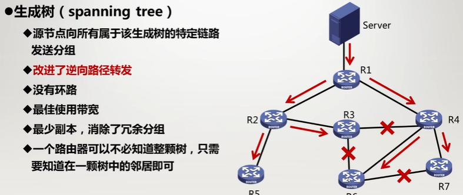

##### 隧道技术

对不支持多播的网络，就对单播数据报进行封装，先发单播，到了支持的地方，再变回来。

##### 基于核心的发现技术

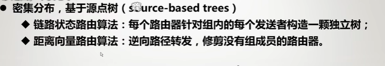

## 虚拟专用网VPN和网络地址转换NAT

### 虚拟专用网络VPN

由于**IP地址的紧缺**，一个机构无法使所有主机都拥有公网IP

而且**互联网并不很安全**，一个机构也不需要把所有主机接入外部互联网

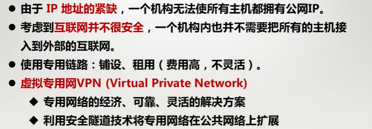

其实VPN就是加密技术和隧道技术的结合

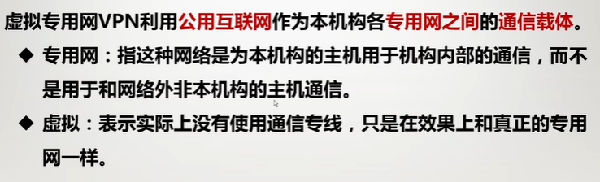

#### 专用地址块

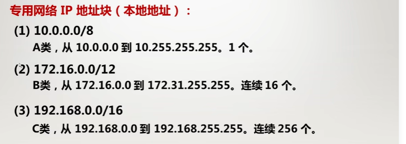

#### 实现原理

实现和下面的NAT有相似之处

### 网络地址转换NAT

想要在专用网上，让使用专用地址的主机与互联网上的主机通信，且无需加密时可以使用

把私有地址转换成共有地址，只要有NAT转换表就行，但是一个专用地址对应一个全球IP地址肯定是不现实的

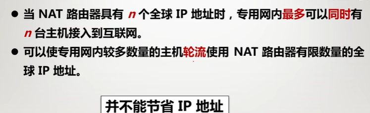

可以轮流使用IP地址，这样是不能节省IP地址的，还是很受限。

#### 网络地址与端口号转换NAPT

使用**端口号**对每个专用地址进行区分

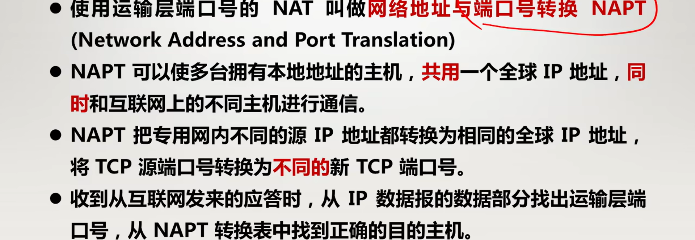

#### NAT的优缺点

优点：

节省合法地址，减少地址冲突

灵活连接互联网

保护局域网的私密性

缺点：

违法了IP的结构模型，由路由器处理传输层协议

违反了端到端的原则

不能处理IP报头加密

新型的网络应用设计得考虑NAT的场景，如P2P

## 多协议标签交换MPLS

当网络很大时，查询路由表要花很多时间

出现突发通信时，缓存会溢出，引起分组丢失，传输时延增大和服务质量下降

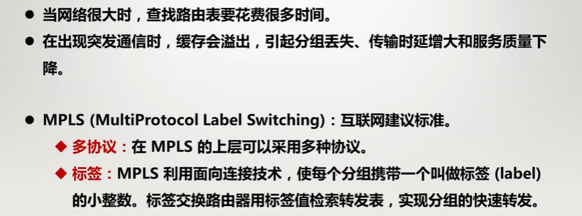

**多协议**：在MPLS的上层可以使用多种协议

**标签**：MPLS利用面向连接技术，使每一个分组携带一个叫标签的小整数，标签交换路由器用标签值检索转发表，实现分组的快速转发。

把网络简化了，从一个网络一个接口，变为一个标签一个接口

### 工作过程

首先需要有多个路由器支持MPLS，它们会组成一个MPLS域，可以在这个区域中使用MPLS协议

对进入的数据，对数据进行封装，打上标签

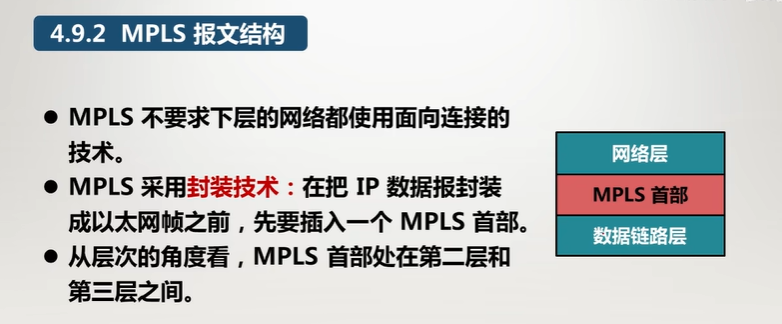

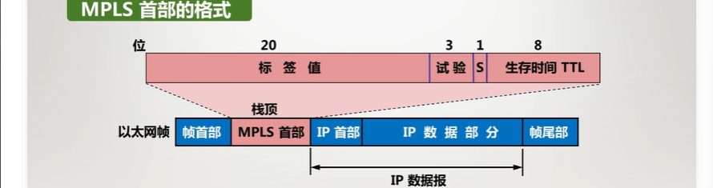

## 软件定义网络SDN

2009年才推出的协议

**优点：**

提高网络带宽利用率

网络运行更加稳定

管理更加高效简化

运行费用明显降低

### 如何工作

原先的转发表的计算是每个路由器自己与其它路由器交换信息计算得出的，耗时较长，且必须每个路由器都要工作才行

而SDN是有一个远程控制器，先收集好所有的数据，然后计算好每一个路由器的最佳路由，之后路由器只需要向它请求就可以了

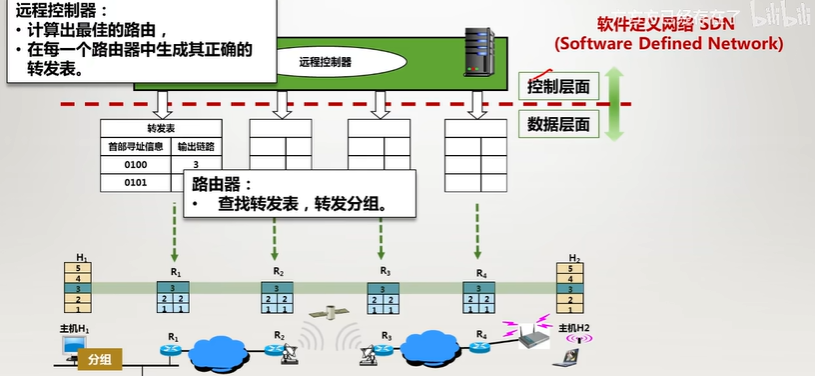

对上是北向，对下是南向

### OpenFlow

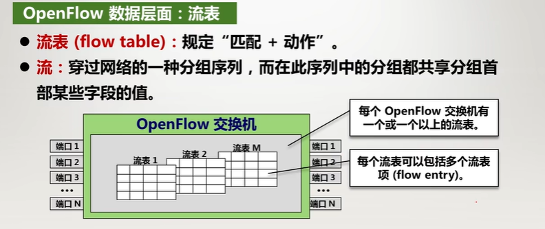

在数据层面OpenFlow交换机完成匹配+动作，即广义转发。

**匹配**：对不同层次(链路层、网络层、运输层)首部中的字段进行匹配

**动作**：转发、重写、丢弃等

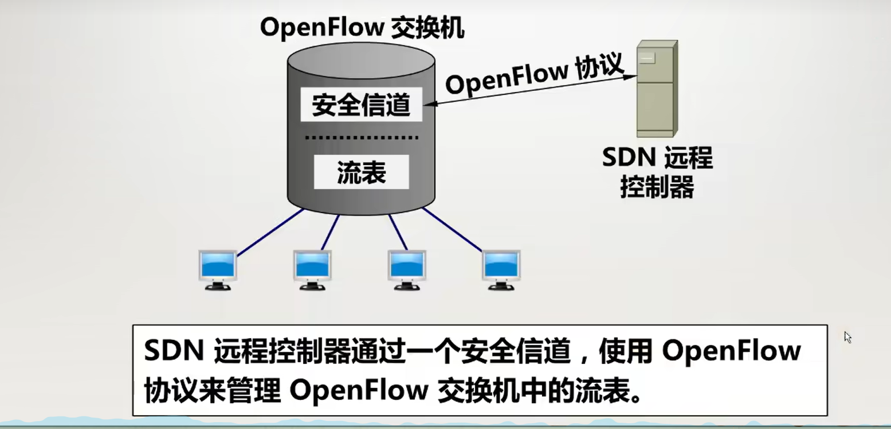

可以实现**负载均衡**

可以实现**防火墙**

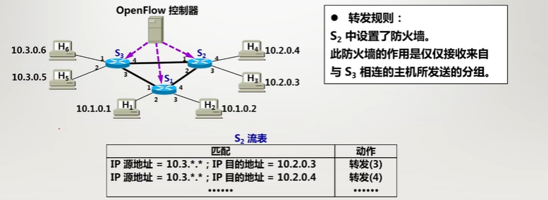

### SDN体系结构

北向API就是实现上层接口

南向API就是实现下层的接口，比如说下发流表

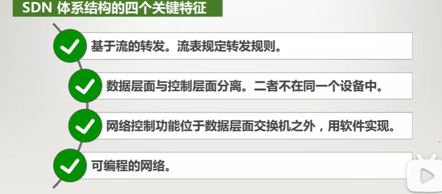

### 与传统网络的差别

# 运输层

## 运输层要解决的问题

前几层仍遗留了一些问题：

- 参与通信的主机里，不知道是谁在发送和接受应用程序
- 没有完全实现可靠传输的问题

### 进程间的通信

主机间的通信，实际上是两台主机的**应用进程之间的通信**。而且往往是多个进程同时和另一台主机多个进程的通信

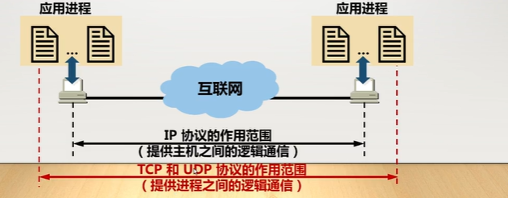

**发送方复用**：多个应用进程使用一个运输层协议传输数据

**接收方分用**：在接受到报文后，能正确交给正确的应用程序

有点像物理信道的复用

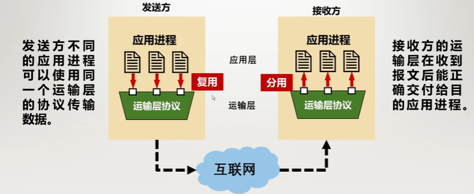

### 运输层提供的服务

传输层**依赖并扩展网络层的服务**：

传输层可以通过差错恢复、重排序等手段**提供可靠、按序交付**的服务

但是无法提供延迟保证、带宽保证等服务

#### 最低限度的服务：进程到进程的数据交付

运输层提供应用进程间的逻辑通信，在两个运输层实体之间建立**端到端的逻辑通信信道。**

它向高层用户**屏蔽**了下层网络核心的细节

#### 最低限度的服务：差错检测

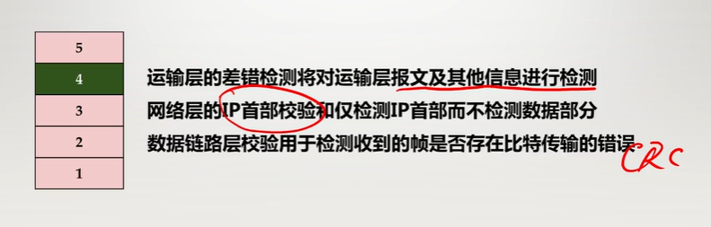

#### 提供的增强服务

**可靠传输**

**流量控制**

**拥塞控制**

### 运输层的两个重要标准

**用户数据报协议UDP**

**传输控制协议TCP**

#### 可靠信道与不可靠信道

TCP是可靠信道，UDP是不可靠信道

#### 运输协议数据单元

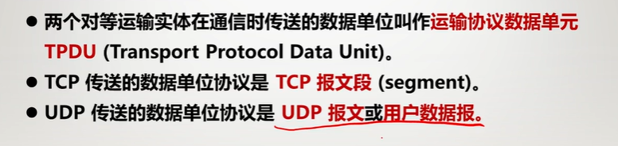

两个对等运输实体在通信时传输的数据叫**运输协议数据单元TPDU**

TCP的数据单位协议是**TCP报文段**

UDP传送的数据单位协议是**UDP报文或用户数据报**

#### TCP与UDP的区别

最大的区别就是：

TCP要提供可靠服务，所以要先建立连接。要满足基本服务和增强服务。且只能一对一。

UDP不提供可靠服务，不提前建立连接。只满足最低限度服务

#### 复用TCP和UDP的协议

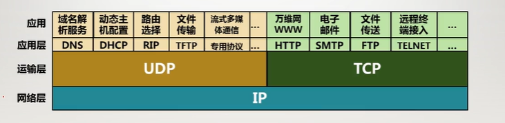

UDP：

域名解析服务DNS、动态主机配置DHCP、路由选择RIP、文件传输TFTP、流式多媒体通信

TCP：

万维网的HTTP、电子邮件SMTP、文件传送FTP、远程终端接入TELNET

### 运输层的端口

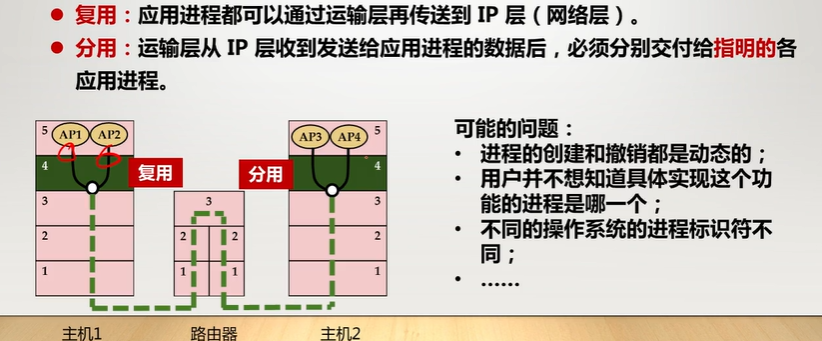

**复用**：所有进程都可以通过运输层再传送到IP层

**分用**：运输层从IP层收到发送给应用进程的数据后，必须交给**指明的**应用程序

为此要为每个数据指明端口

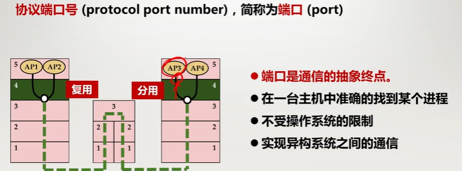

**协议端口号**，简称为**端口**

**端口是通信的抽象终点**

可以在一台主机上准确找到某个进程

不受操作系统限制

可以实现异构系统间的通信

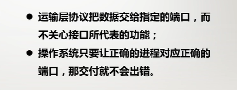

以上指的是软件端口：

协议栈层间的抽象协议端口

是应用层各种协议进程与运输实体进行层间交互的地点

不同系统实现端口的方法可以不同

硬件端口指的是：不同硬件设备进行交互的接口

#### 端口的表示

端口用一个**16位的端口号**进行标志，允许有65535个不同的端口号

端口号只有**本地意义**，是为了**标志本计算机应用层的各个进程**

不同计算机间相同端口号没有联系

#### 服务器端使用的端口号

**熟知端口号(系统端口号)**：数值一般在0~1023，由公共域协议使用

**登记端口号**，数值为1024~49151，为没有熟知端口号的应用程序使用，需要在IANA登记才能使用

#### 客户端使用端口号

也叫**短暂端口号**：49452~65532，给客户端程序进程短暂使用，使用完要释放

### 套接字socket

**通信需要同时知道对方的IP地址和端口号**

socket=(IP地址：端口号)。例如192.168.0.1:80

#### UDP的套接字

UDP的套接字使用**<IP地址，端口号>**进行标识

<目的IP，目的端口号>相同的报文**交给同一个**套接字

与<源IP，源端口号>**无关**

#### TCP的套接字

由于TCP是一对一的，所以更复杂一些

TCP的套接字需要用**<源IP，目的IP，源端口号，目的端口号>**进行标识

**且一个源端口只能和一个目的端口通信**，所以一个主机上的多个应用程序要和别的主机通信，需要准备多个套接字

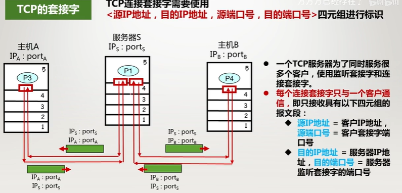

## UDP

#### UDP概述

网络层服务：

- 尽最大努力将数据报发送给主机
- 不保证可靠传输
- 不保证带宽和延迟

UDP只在IP数据报服务之上**添加了一些功能**

**复用和分用**

**差错检测**

#### UDP的主要特点

1. **无连接**：发送数据之前不需要建立连接

2. **使用尽最大努力交付**：也就是不保证可靠交付

3. **面向报文**：UDP溢出传送和交付一个完整的报文

   > **发送方**：应用层的报文，既不合并也不拆分，按原样发送
   >
   > **接收方**：UDP对IP层发送上来的UDP用户信息数据报，**去掉首部后就原封不动**的交给上层的应用程序，一次交付一个完整的报文
   >
   > (下层可能会对报文进行分片或合并，但是对运输层是透明的，不用在意)
   >
   > 
   >
   > 这种简单的方式会有一些问题：
   >
   > **应用程序必须选择大小合适的报文**
   >
   > 若报文太长，IP层要进行分片，降低IP层效率
   >
   > 若报文太短，则首部相对长度太大，降低IP层效率

4. **没有拥塞控制**：不会因网络拥塞降低源主机的发送速率，适合实时的多媒体通信

5. 支持**一对一、一对多、多对一、多对多**等交互通信(一和多在这里指端口)

6. **首部开销小**：只有8个字节

##### 为什么需要UDP

应用可以尽可能快的发送报文

- 无建立连接的延迟
- 不限制发送速率(没有拥塞控制和流量控制

报头开销小

协议处理简单

##### 适合于哪些应用

容忍丢包但对延迟敏感的应用：IP电话、视频会议、多媒体应用

以单次请求/响应为主的应用：DNS、RIP、DHCP等

若应用要求基于UDP实现可靠传输：则由应用层实现可靠性

### UDP的首部

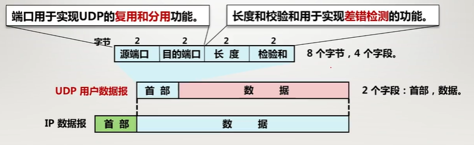

**源端口**：16位，2个字节。在需要对方回信的时候选用，不用可全0

**目的端口**：16位，2个字节。若接收方UDP发现目的端口号**不正确**(也就是没这个应用程序)，则**丢弃**该报文，并用**ICMP发送“端口不可达”**差错报文

**长度**：16位，2个字节。整个用户数据报(含首部)的长度，最小值为8(仅有首部)

**检验和**：检测UDP数据报传输过程中是否有错，首部和数据一起参加计算，错误就丢弃

> 但是因为每个IP地址的端口号是可重复的，需要判断是否是源IP地址发送来的，所以检验和还要进行这个判断
>
> 计算检验和的时候，需要加上一个12字节的**伪首部**，包括源IP地址、目的IP地址、俩标志位、UDP长度，一起进行计算检验和（这个伪首部，仅仅为了计算检验和，并不发送）
>
> 接收方也加上你这个伪首部判断检验和是否出错
>
> 

## TCP概述

TCP是**面向连接**的运输层协议，在无连接不可靠的IP层服务之上**提供了可靠交付**的服务，为此在IP数据报服务之上，添加了一系列措施

### TCP的主要特点

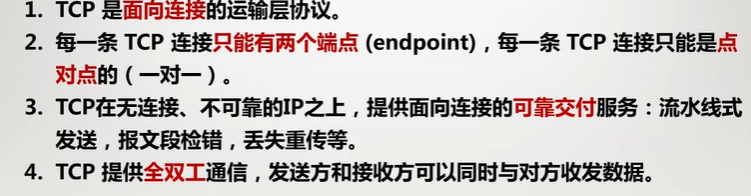

1. 是**面向连接**的传输层协议

2. 每一条TCP连接只能有两个端点，每个TCP连接只能是**点对点**的(一对一)

3. 在IP服务之上，提供面向连接的**可靠交付**服务：流水线式发送、报文段检错、丢失重传等。

4. TCP提供**全双工**通信，发送方和接收方都可以同时与对方收发数据

   > ***可靠性保证总结***
   >
   > **面向连接的电路交换(物理层保证)**：
   >
   > 通信双方必须有一条物理连接的通路(直接相连)，且被双方**独享**，数据按序发送并按序接收
   >
   > **面向连接的虚电路(网络层保证)**：
   >
   > 双方采用复用技术，逐段占用物理通道，每段物理通路可被多对通信使用，分组按序发送并按序接收
   >
   > **面向连接的TCP(运输层协议保证**)：
   >
   > 采用协议的方法(**确认、序号、重传**)，确保通信双方有一条全双工的、可靠的逻辑信道(实际上提供服务的IP数据报是不可靠的)，字节按序发送，并能按序接收(但是数据报不一定是按序到达的)
   >
   > 

5. **面向字节流**

   > TCP中的流指的是流入或流出的字节序列
   >
   > **面向字节流**：可靠、有序的字节流，不保留报文边界
   >
   > 发送的字节流和接收的字节流完全一致，但是报文大小和边界不一定相同(这是TCP会把报文分段、拼接导致的)
   >
   > 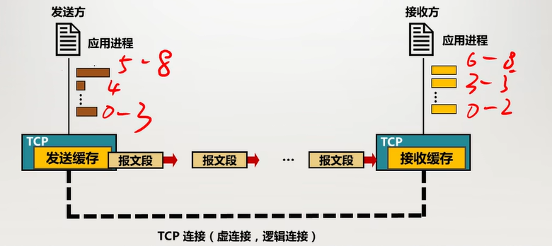
   >
   > 

### TCP首部

TCP传输的数据单元是报文端。

一个TCP报文段分为首部和数据两部分

TCP报文首部的前20个字节是固定的，后面有4n字节是根据需要而添加的选项。**TCP首部最小长度是20字节**

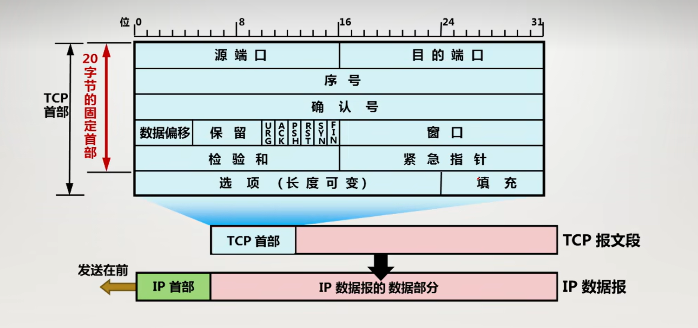

#### **源端口和目的端口**：

都是16位，2字节。就是端口号

#### **序号seq**：

32位，4个字节。TCP传输中传送的数据流中的**每一个字节**都有一个序号。序号的值指的是**本报文所发送的数据的第一个字节的序号**(也就是每一个报文里的序号都一样，都是第一个的)

#### **确认号ack**：

32位4个字节。是**期望收到**的**对方**下一个报文段的数据的第一个字节的**序号**。(也就是上次对方发的数据(确认号之前)我都收到了，下次给我发这之后的)

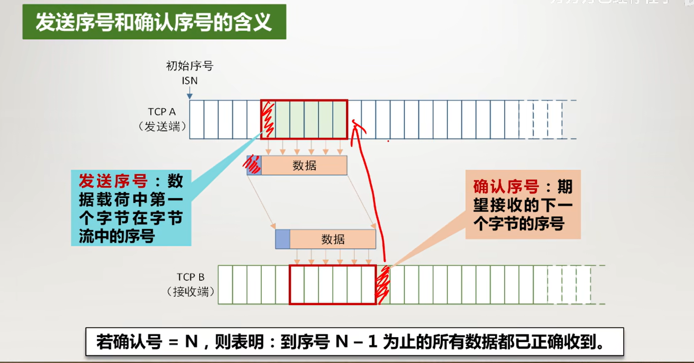

#### **数据偏移**：

4位。指出TCP报文段的**数据起始**处距离**报文段起始**处有多远，也就是**TCP首部的长度**。**1比特算4个字节**。(也就是首部最长15*4=60个字节)

#### 保留位(6位，暂时没用)

#### 6个标志位(每个1位)：

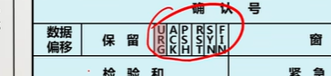

##### 紧急URG(相当于高优先级)：

当URG=1，表明紧急指针字段有效，告诉系统此报文段中有紧急数据，应当尽快传送

##### 确认ACK(判断确认号有效)

当ACK=1，确认号字段才有效(确认号是ack，这里是ACK)，只有在最开始的时候才为0

##### 推送PSH(Push)(尽快提交，不等缓存)

接收TCP收到PSH为1的报文段后，就尽快(推送)交付给应用进程，而不用等整个缓存填满

##### 复位RST(Reset)(重新建立连接)

当RST=1，表面TCP连接中出现严重差错(如主机崩溃)，**必须释放连接重新建立连接**

##### 同步SYN(Synchronization)(连接请求或连接接受)

当SYN=1，说明这是个连接请求或者连接接受请求

当SYN=1，ACK=0，表明是**连接请求**报文段

当SYN=1，ACK=1，表明这是**连接接受**的报文段

之后其它情况都是0了

##### 终止FIN(Finsh)(数据发完，请求释放连接)

FIN=1，表明发送端数据已经发送完毕，要求释放连接。(这是单方面的，但还能接收)

#### 窗口

16位2个字节。接收方目前允许对方发送的数据量(字节)，窗口值是动态变化的。

#### 校验和

16位2个字节。检验首部和数据部分。与UDP一样，也要加上12字节的伪首部

#### 紧急指针

16位2个字节。**在URG=1时**，指出本报文段中紧急数据的**字节数**(后面就是普通数据)，**也就是指出了紧急数据末尾的位置**

#### 可选项和填充

长度可变，最多40字节

下面是一些可选项

##### 最大报文段长度MSS

就是报文段数据的最大长度

##### 窗口扩大

原先窗口可能太小，可以乘上2的s次方倍

#### 时间戳

占10个字节(80位)，主要有时间戳值字段(4字节)，时间戳回送回答字段(4字节)

主要功能：

- 计算往返时延RTT

- 防止序号绕回 PAWS

  > 2^32的序号空间对于高带宽很容易耗尽，序号重复时，可以把新旧报文区分开
  >
  > 
  >
  > 

- 选择确认SACK

  > 

  

## 可靠传输原理

### 理想传输条件的特点

传输信道不产生差错(不用纠错)

不论发送方以多块的速度发送数据，接收方都来得及处理(不用流量控制)

但是实际网络都**不具备理想传输条件**。必须使用一些可靠传输协议，在不可靠信道实现可靠传输

这部分在数据链路层已经记录过了，再简单来一次

### 停止等待协议SW

#### 无差错情况

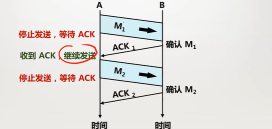

但实际上这4个分组都有可能出错

#### 分组错误或丢失

##### 超时重传

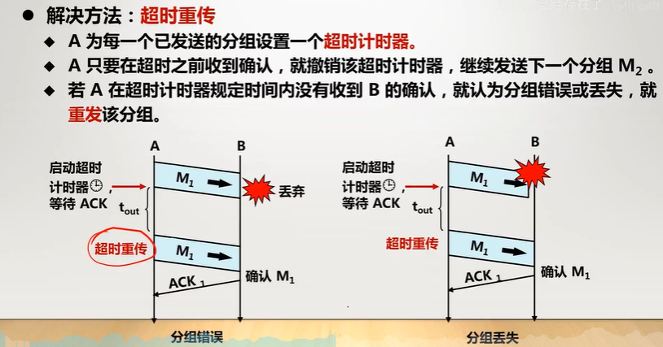

#### 确认丢失或迟到

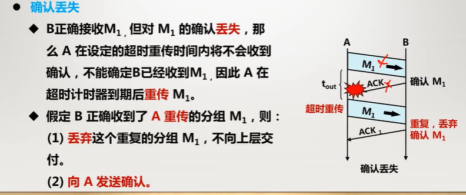

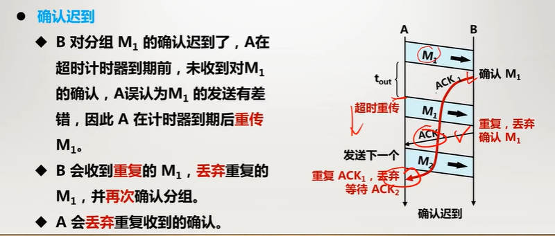

重复确认A并不理会，只要收到一个确认，就说明此确认之前的分组B都成功收到了

#### 停止等待协议要点

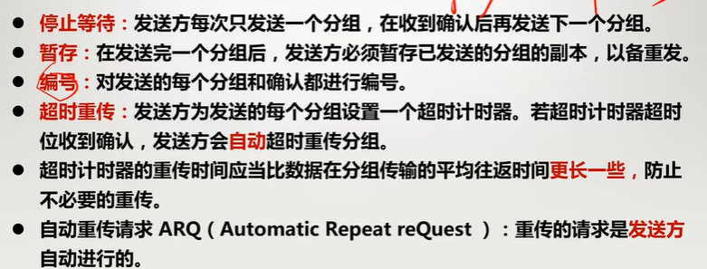

其中编号是在TCP报文首部的序号和确认号实现的

这种重传叫**自动重传请求ARQ**

#### 信道利用率

停止等待**降低了**信道利用率

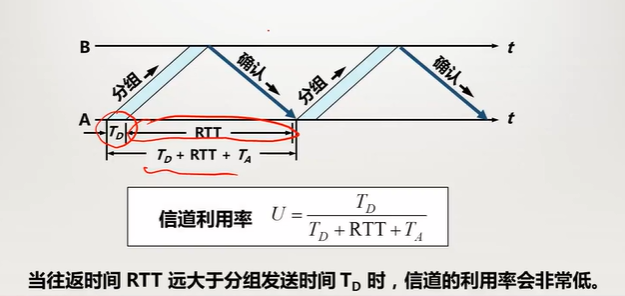

解决办法：通过流水线传输来提高效率。

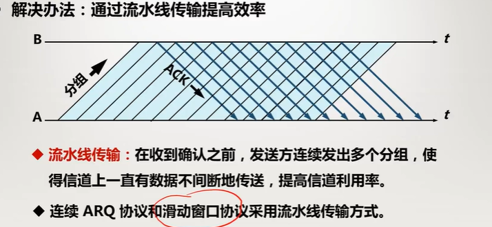

### 连续ARQ协议(使用了回退N帧)

使用滑动窗口协议来解决上述信道利用率低的问题

先让要发送的数据移入发送窗口(缓存)，位于窗口内的分组都可以被连续发出去，而不需要对方的确认，但是不能发窗口以外的分组

发送方每接收到一个确认，就把滑动窗口向前滑动一个

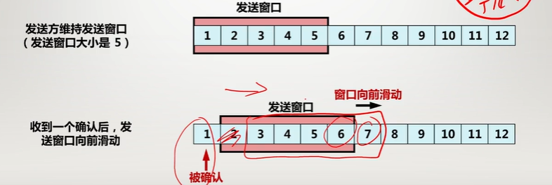

#### 累计确认

#### 回退N帧协议GBN

#### 与停止等待的对比

## 可靠传输的实现

### 以字节为单位的滑动窗口

TCP使用流水线传输和滑动窗口协议实现高效可靠的传输

TCP滑动窗口是**以字节为单位**的(**TCP报文的每一个字节都有编号**)

发送方A和接收方B都各维持一个**发送窗口**和**接收窗口**

#### 发送窗口

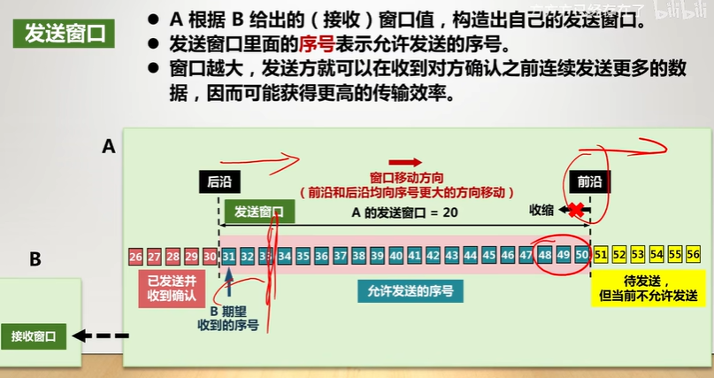

窗口只能向大的方向移动，未收到确认的序号，必须保持在窗口里，且留有备份，以便于丢失后重传

#### 接收窗口

对于回退N帧来说，可以认为接收窗口长度是1，所以接收到一个未按序到达的分组，后续分组全部不接收，让发送方重新发送

#### 窗口的滑动

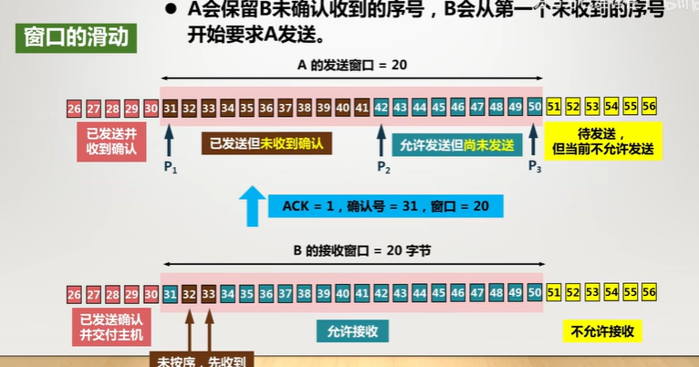

31未收到，让A重发31后面的数据

按序都收到的数据，可以向前移动

收到确认后，可用窗口增大

A可以一直发，直到可用窗口发完了，这时候要一直等待，知道B发到确认，向前滑动

#### 缓存

发送窗口要比发送缓存小

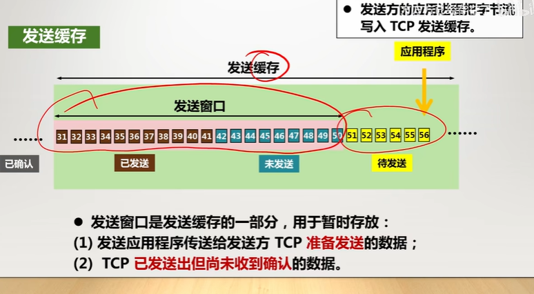

接收窗口也要比接收窗口小，应用只能读取以按序到达的字节数据

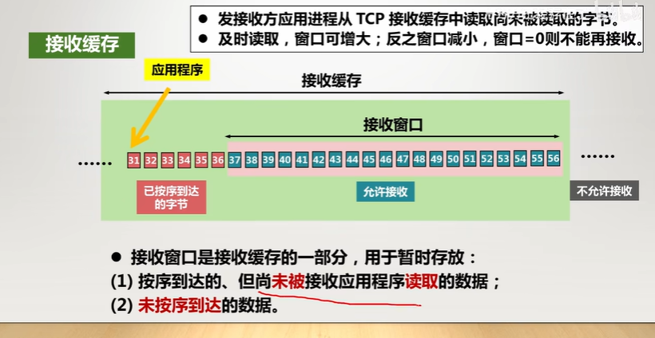

### 超时重传

TCP的发送方若在规定的时间内未收到确认，就要**重传**自己已发送的报文段

但是重传时间不能太短，否则可能引起不必要的重传

也不能太长，可能会使空闲时间增大，降低传输效率

#### 加权平均往返时间

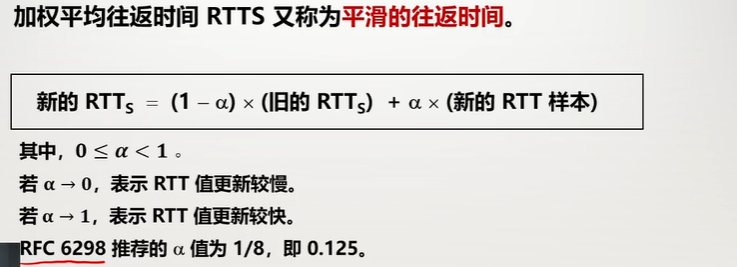

加权平均往返时间$RTT_s$又称平滑的往返时间
$$
新的RTT_s = (1-\alpha) \times (旧的RTT_s) + \alpha \times (新的RTT样本)
$$

#### 超时重传时间RTO

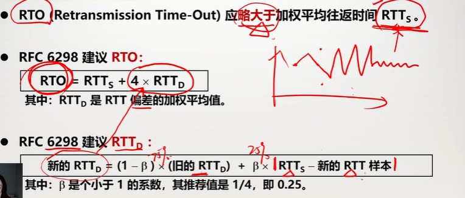

超时重传时间应当略大于平均往返时间$RTT_s$

$$
RTO = RTT_S + 4 \times RTT_D
$$

$$
新的RTT_D = (1-\beta)旧的RTT_D + \beta(RTT_S - 新的RTT样本)
$$

#### Karn算法

由于TCP确认存在二义性，会使RTT不准

重传的TCP报文段使用的是与原报文段相同的序号

发送方收到确认后，无法得知是哪个报文段进行的确认(就是可能收到的会是之前阻塞在网络里的报文段)

解决办法：

**在计算平均RTT时，只要重传了，就不把它当作样本**

#### 修正的Karn算法

使用Karn算法时，当报文的**时延突然增大**很多时，在原来的重传时间内，不会收到确认报文，就会重传，但是根据Karn算法又不会吧重传的往返时间当作样本，**就会导致超时重传时间无法更新，造成很多不必要的重传**

解决办法：

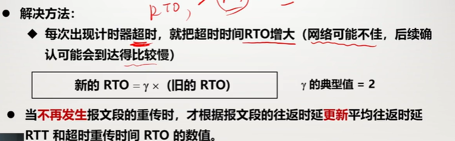

发送重传时，先把超时时间增大

等到不发生报文段重传时，再用往返时延更新平均往返时延和超时时间

### 选择确认SACK

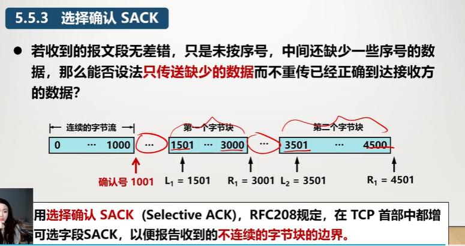

## TCP流量控制

通过确认和重传机制，可以让发送方确认接收方已经正确收到数据

但如果接收方收不到数据，就无法做出确认

如果数据量太大，产生了大量的丢包和重传，就不是一种高效的工作方式了

### 利用滑动窗口实现流量控制

**流量控制**：让发送方发送速率不要太快，使得接收方来得急接收

利用**滑动窗口机制**可以很方便的在TCP连接上实现对发送方的流量控制

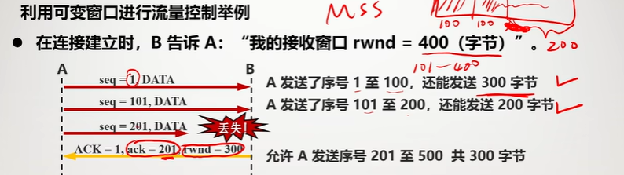

其中ACK代表这个报文是确认，ack201代表201之前的都收到了，下一次从201开始发送，rwnd300代表，当前的接收窗口设定成300

当窗口被设置为0，这段时间A就不能给B发数据了，但是一直不发数据就不会收到窗口改变的确认，这就需要在收到0窗口时，启动一个持续计时器

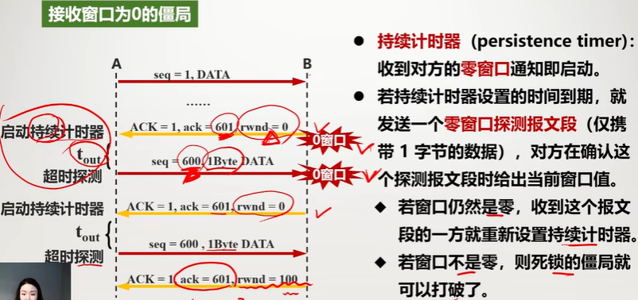

当持续计时器归零后，就发送零窗口探测报文段，等待对方的回复

### TCP的传输效率

TCP发送数据的三种情况：

- 缓存中的数据达到预先设定的最大报文段长度MSS字节时，就组装成一个TCP发送
- 由发送方的应用进程指明要求发送的报文段(Push操作)
- 发送方某个计时器到期了，就报已有的缓存数据(不超过MSS)发送出去

#### 糊涂窗口综合征

产生的原因就是接收方处理数据太慢，接收缓存被占满了

解决办法：

使用Nagle算法，等到数据多一点再发

## TCP的拥塞控制

在某段时间，网络中有许多资源同时产生拥堵的情况，网络性能明显变坏，整个网络的吞吐量将随着输入负荷的增大而下降，这种现象称为**拥塞。**

### 什么是拥塞

起因：

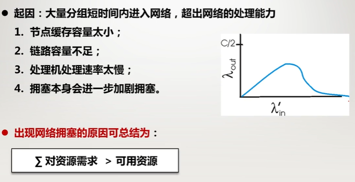

大量分组短时间内进入网络，超出网络的处理能力

1. 节点缓存容量太小
2. 链路容量不足
3. 处理机处理效率太慢
4. 拥塞本身会进一步加剧拥塞

可总结为：

**对资源需求的总和大于可用资源**

### 解决拥塞

拥塞是一个**全局问题**，完了资源增加是有利于解决拥塞的，但是不能完全解决

解决拥塞的办法：**增加资源+控制发送量**

#### 拥塞控制的作用

#### 拥塞控制的一般原理

分为开环控制和闭环控制，开环控制是提前考虑，避免拥塞。闭环控制是实时监控，发现了进行干预解决拥塞

主要使用的是闭环控制

#### 闭环控制的一般思路

发现拥塞：

采取的措施：

发送“通知拥塞发生”的分组给 **源站**

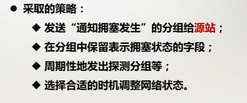

### TCP的拥塞控制方法

TCP采用**基于滑动窗口的方法**进行闭环拥塞控制

发送方维持一个**拥塞窗口CWND**，用于控制发送速率：

拥塞窗口取决于网络的拥塞程度，动态的进行变化

发送端利用拥塞窗口根据网络的拥塞情况调整发送速率
$$
rate = \frac{cwnd}{RTT} (B/s)
$$
当拥塞窗口较大，往返时间较小，发送速率就可以增大，反之就要减小

网络没有拥塞，拥塞窗口就可以增大一点，可以发送更多分组，提高网络的利用率。

网络出现拥塞或可能发生拥塞，就把拥塞窗口减小，缓解网络的拥塞

#### 发送方判断拥塞的方法

超时重传计时器超时：大概率已经发生了拥塞，至少交付能力已经很差了

收到3个重复的确认，说明大概率上上次发的分组是丢失了，可能会发生拥塞，但是交付能力还是有的

#### TCP四种拥塞控制算法

先假设接收方接收能力无限大，发送能力仅限于网络状态的情况下

有这四种算法：慢开始、拥塞避免、快重传、快恢复

***注意，这里窗口的单位和下面窗口的单位都是MSS，所以每次加的不一定是1KB，而一定是一个MSS***

##### 慢开始

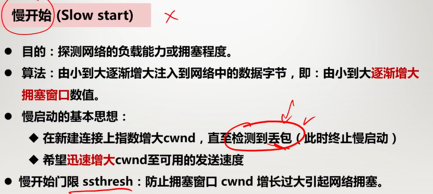

目的：探测网络的负载能力或者拥塞程度

算法：从小到大，逐渐加大注入到网络的数据字节数，即从小到大**逐渐增大拥塞窗口**的数值

基本思想：

在新建连接上指数增大cwnd，直至检测到丢包(此时终止)

希望能**迅速增大**cwnd到达可用的发送速度

慢开始门限：防止拥塞窗口cwnd增长过大，引起拥塞

每个RTT加倍

###### 慢开始门限ssthresh的用法

当窗口小于门限，只能用慢开始

大于门限，只能用拥塞避免

等于门限，都可以用

##### 拥塞避免

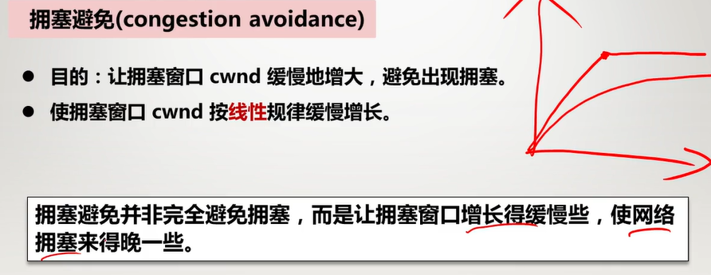

目的：让拥塞窗口cwnd缓慢地增大，避免出现拥塞

使cwnd按线性缓慢增长

拥塞避免并非完全避免拥塞，而是让拥塞窗口增长的缓慢点，拥塞来的晚些

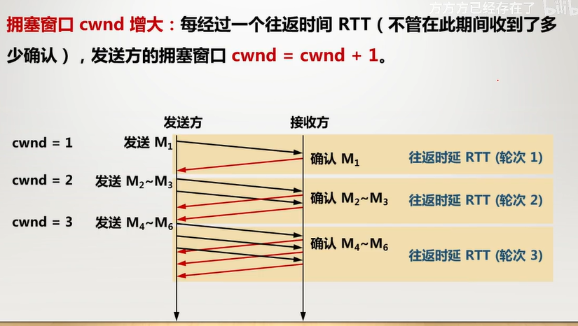

每个RTT增加1

##### 出现拥塞时(超时)的处理

当网络出现拥塞，发送方**重传定时器超时**：

门限值改为当前窗口值的一半(但是不能小于2)
$$
ssthresh = max(\frac{cwnd}2,2)
$$
窗口值置为1
$$
cwnd = 1
$$
执行慢开始算法

这是为了迅速减少主机发送到网络中的分组数，使得发生阻塞的路由器有足够时间把积压的分组处理完毕

##### 快重传FR

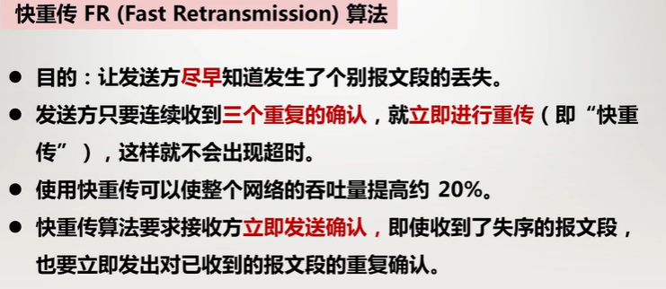

目的：为了让发送方**尽早**知道发生了个别报文段的丢失

发送方只要收到**3个重复的确认**，就**立即进行重传**，这样就不会超时

快重传要求接收方**立即发送确认**即使收到了失序的报文段，也要对之前已经收到的报文段重复确认

##### 快恢复FR

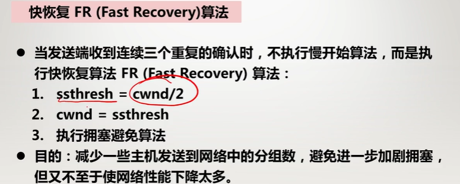

当发送端收到3个连续的重复确认时，不执行慢开始，而是执行快恢复算法FR：

先让门限值改为当前窗口值的一半
$$
ssthresh = \frac{cwnd}{2}
$$
让当前窗口值改为当前门限值(也就是当前窗口值的一半)
$$
cwnd = ssthresh
$$
执行拥塞避免算法

目的：减少一些主机发送的分组数，避免进一步加剧拥塞，但是又不至于让网络性能下降太多

#### TCP拥塞控制总结

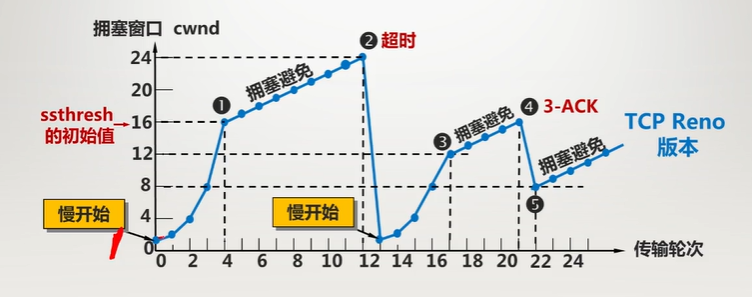

如图，门限值之前，慢开始；超过门限，拥塞避免；超时，门限为窗口一半，窗口变1，进行慢开始；遇到3个重复确认(快恢复)，进行快恢复，然后拥塞避免。

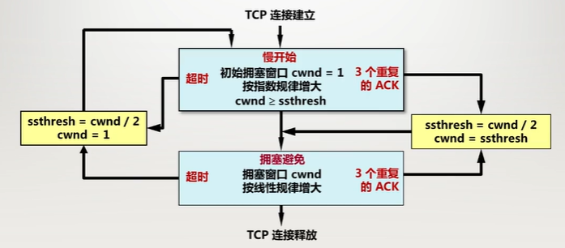

##### 加法增大，乘法减小AIMD算法

##### 拥塞控制和流量控制的区别

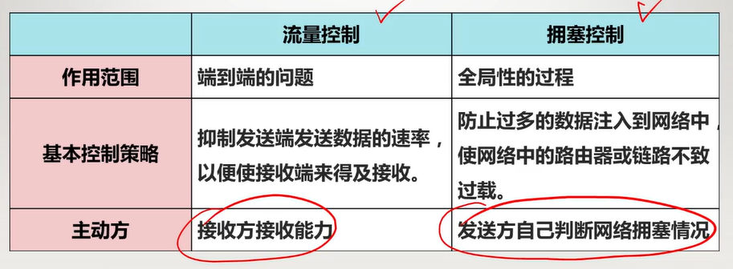

流量控制，是只考虑接收方发情况，判断自己的发送速率

拥塞控制，是考虑整个网络的情况，判断自己最多能发多少

##### 发送窗口上限值

所以说发送窗口的上限值，应当是这两者间较小的那个
$$
发送窗口的上限值 = \min[rwnd,cwnd]
$$

#### 主动队列管理AQM

如果使用路由器默认的尾部丢弃策略

若同时来了一大波数据，全部丢弃，过一段时间，这些数据又会同时重传到这里，再次产生拥塞，这就叫**全局同步**

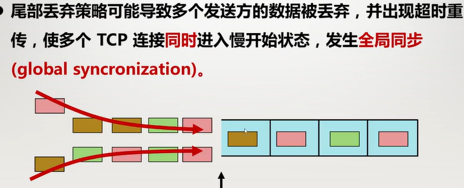

为了解决这种情况，可用使用主动队列管理

在队列长度到达某个警惕的值时，就要主动丢弃一些分组，避免全局同步

增加比较流行的一个方法就是随机早期检测RED

##### 随机早期检测RED

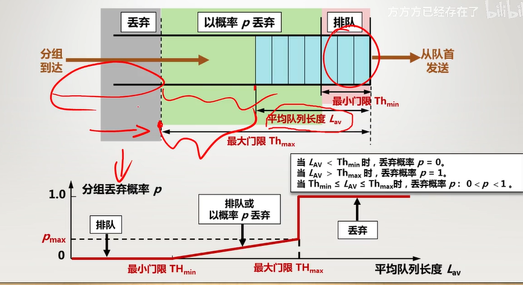

可以延缓拥塞的发生。

但是最近已经不推荐使用RED

## TCP的运输连接管理

TCP是面向连接的协议

TCP连接有三个阶段：连接建立、数据传输、连接释放

### TCP的连接建立

连接建立要解决3个问题：

1. 每一方都能确定知道对方的**存在**
2. 要允许双方**协商**一些参数(如最大窗口值、是否使用窗口扩大选项、时间戳、服务质量等)
3. 能对运输实体资源(如缓存大小、连接表中的项目等)进行**分配**

TCP连接的建立采用**客户服务器**方式(C/S)

TCP建立连接的过程叫做握手，需要交换3次报文段，所以叫做**三报文握手**

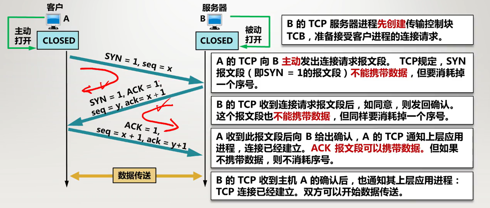

B是服务器，A是客户机，所以B是被动打开连接，A是主动打开连接

A先给B发送连接请求，SNY=1，ack=0，假设seq=x

B接收到后，同意进行连接，所以要先进行对上个报文的收到，并且和A连接所以

SNY=1，ACK=1，ack=x+1，假设它的seq=y

A收到B的确认和连接请求，则对这个请求进行确认

SNY=0(因为这已经不是连接的报文了，所以置为0)，ACK=1，ack=y+1，seq=x+1

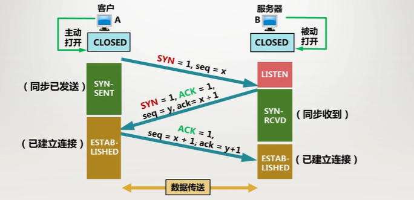

**最后一次A的确认是为了防止已经失效的连接请求到达B**

### TCP的连接释放

连接的释放稍微复杂一些

在数据传输结束后，通信**双方**都可以释放连接

连接的释放是**四报文握手**

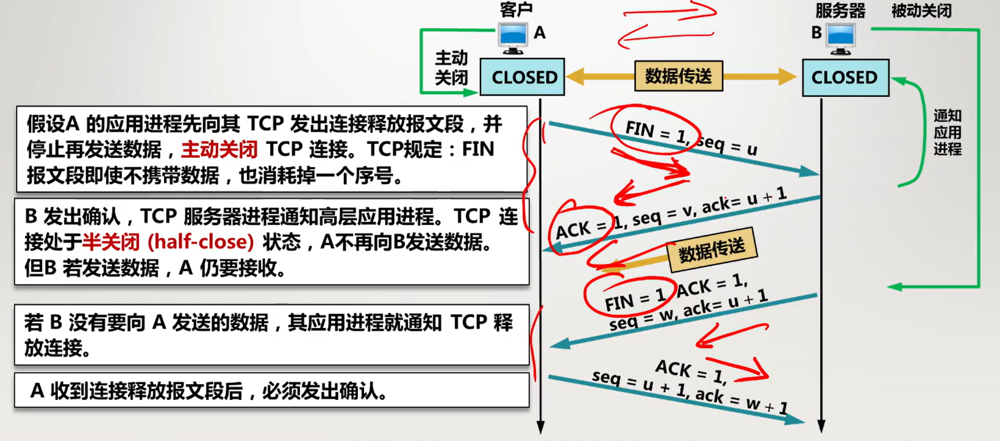

假如A数据先传输完毕，则A为主动关闭

A发送关闭连接报文，FIN=1，假设seq=u

B收到后，发送确认，ACK = 1，ack = u+1，假如seq=v，此后，A不再向B发送数据，但是B还能给A发送数据

当B也不用给A发数据时，B给A发送关闭连接的报文，**FIN=1，ACK = 1，ack = u+1，假如seq = w**(注意这里发送的是确认报文，确认的是之前A关闭连接的报文，而且由于期间B还能给A发数据，所以seq不一定是v+1)

则A向B回复确认，ACK=1，ack=w+1，seq=u+1

由于A发出的确认分组不一定能到B，若没有其它处理，B就会重发关闭请求给A，但A已经关闭了，不会回应，就会出现B的资源关闭不了

所以要在A处设置一个计时器(**时间等待计时器**)，等待2MSL，A再进行关闭，这样能保证B如果没有接收到确认，重传的请求能让A接收

其中MSL是最长报文段寿命，建议的时间为2分钟

### TCP的四个计时器

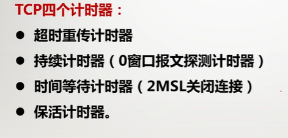

保活计时器：

### TCP有限状态机

# 应用层

 

应用层的具体内容就是规定应用进程在通信过程中所遵循的协议

大多数协议都是基于客户端服务器模式

## 域名系统DNS

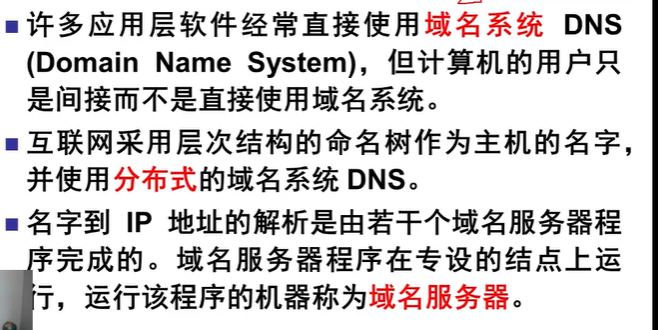

### 互联网的域名结构

每个域名都是唯一的(不能超过253个字符)

域名的结构由标号序列组成，各标号之间用点隔开

域名等级是倒序排列的

**域名只是个逻辑概念，与物理地址无关，其中的点和IP地址也无对应关系，与子网划分也没有关系**

### 顶级域名

1. 国家顶级域名

   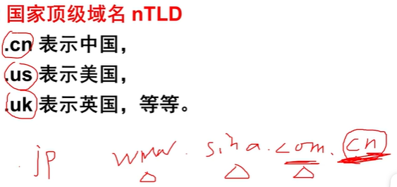

2. 通用顶级域名

   

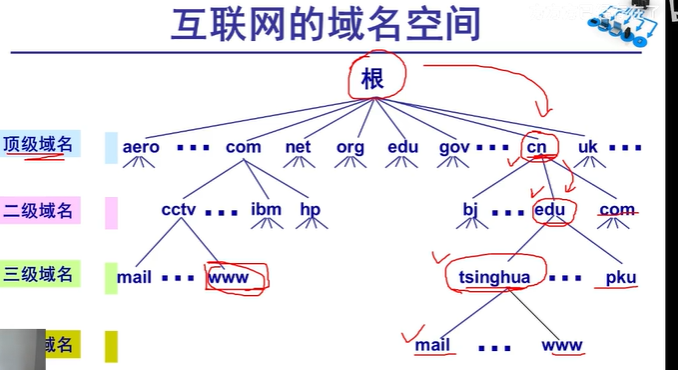

### 域名服务器

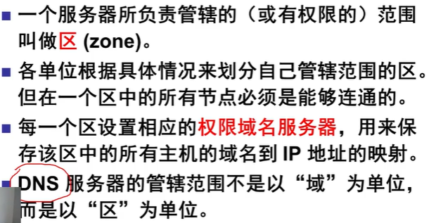

一个服务器所管辖的范围叫做**区**

每个单位自己划分区，一个区中的所有单位必须是要能互联的

每一个区设置相应的**权限域名服务器**，用于保存该区中的所有主机的域名到IP地址的映射

DNS服务器的管辖单位是区

#### 根域名服务器

#### 顶级域名服务器

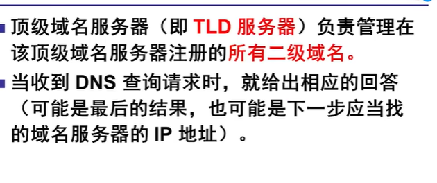

#### 权限域名服务器

这就是负责一个区的域名服务器

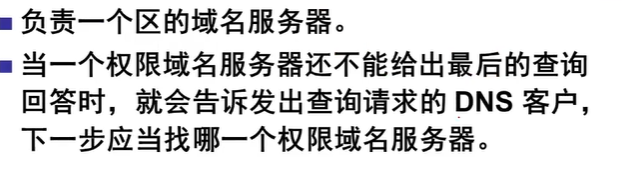

#### 本地域名服务器

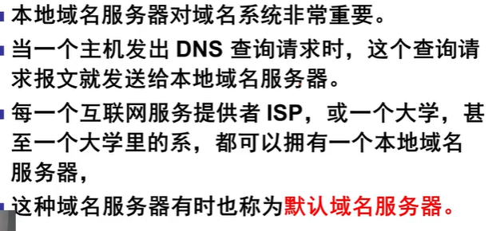

它可以提高查询的效率，降低外部服务器的负担

#### 提高域名服务器的可靠性

把数据复制几份，一个是主域名服务器，剩下的是辅助域名服务器

这样主域名服务器崩溃了，DNS还能由辅助域名服务器进行

### 域名解析过程

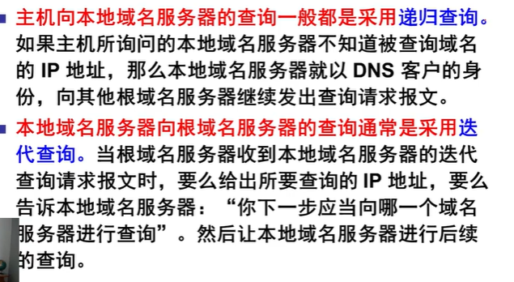

主要有两种查询方式，一种是递归，另一种是迭代

在主机向本地域名服务器请求的时候使用**递归查询**，也就是向本地域名服务器发请求，本地域名服务器查询结束获得IP后返回给主机

但是本地域名服务器查询IP地址的时候又分为递归查询和迭代查询，递归查询和上面的一样，就是会交给根域名服务器，让它来查，查完在交回来，根又去找顶级。。。直到找到

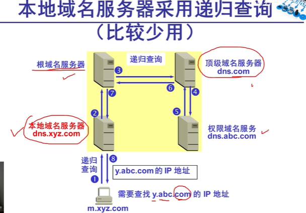

迭代查询稍微有些不一样，是本地域名服务器先询问根域名服务器，根域名服务器查询目的域名是在哪的，如果自己有，就直接交给本地，如果没有，那就告诉本地的要去哪个服务器查询，直到查到

**作为用户，不管采用哪种方式，都是先和本地域名服务器进行查询**

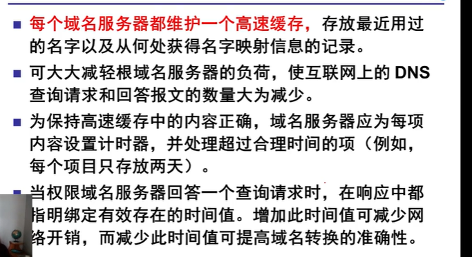

## 文件传送协议FTP

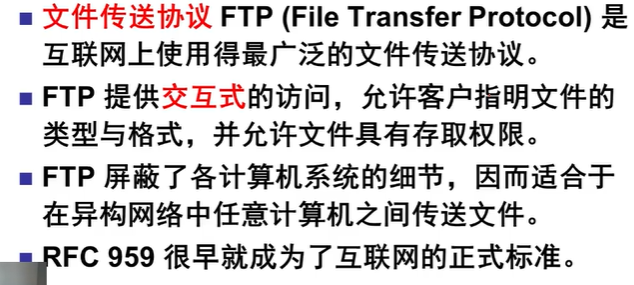

### FTP的特点

使用TCP实现可靠传输

FTP可以减少或消除不同操作系统的不兼容性

FTP使用客户服务器方式，一个FTP服务器可以为多个用户进程提供服务。

FTP的服务进程分为两个部分，一个是主进程，负责接收新的请求，另外有从属进程，负责处理单个请求

### 工作步骤

打开**熟知端口21**，使得客户进程能连上

等待客户连接，启动从属进程处理。处理完毕后继续等待

这是控制连接，它会在整个会话期间一直打开，但是不传送文件

实际用于传输文件的是**数据连接(端口20)**

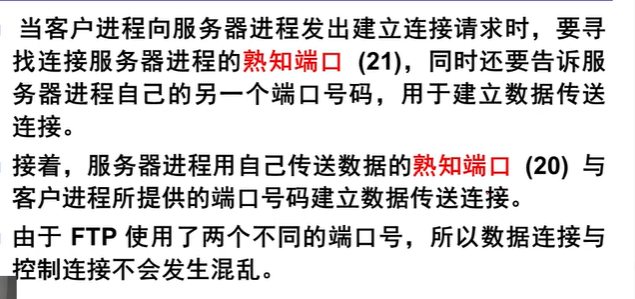

### 简单文件传送协议TFTP

基于UDP

用于传输更小的文件，不用身份验证，不会列出目录

**端口就一个，是69**

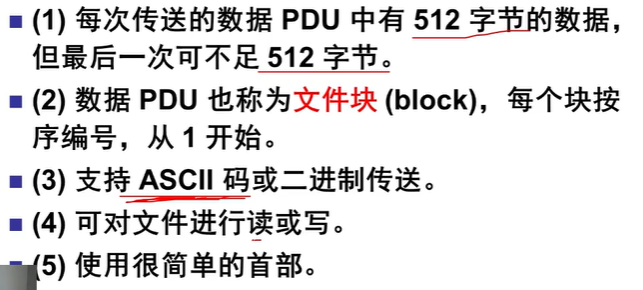

#### 工作步骤

很像停止等待协议

## 远程终端协议TELNET

TELNET是一个简单的远程终端协议，使用TCP连接注册到远程的另一台主机上(使用主机名或IP地址)

可以把用户的指令传到远程主机

**端口是23**

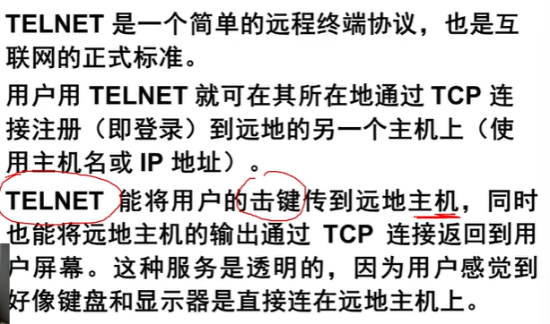

使用的客户服务器方式

#### 虚拟网络终端NVT

NVT可以把本地的指令转换成远地主机系统里的指令格式

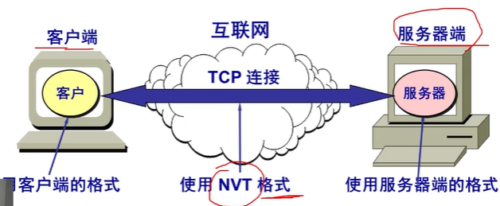

## 万维网WWW

### 万维网概述

它并不是某种特殊的计算机网络

万维网是一个大规模的、联机式的**信息储藏所**

用链接的方式在互联网上的一个站点访问另一个网站

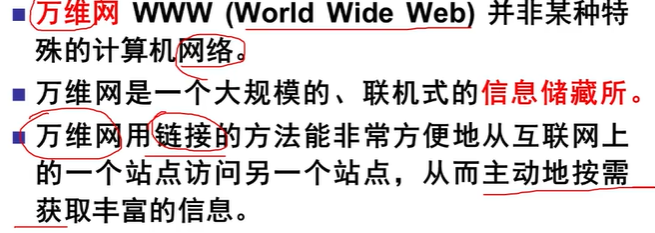

提供的是分布式服务

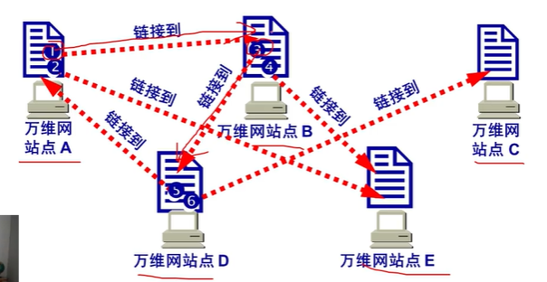

万维网是分布式超媒体系统

采用客户服务器方式工作

#### 万维网必须解决的问题

##### 如何标志分布在互联网上的文档

使用统一资源定位符URL来标志文档，每个文档有唯一的URL

##### 用何协议实现万维网上各种超链的链接

使用超文本传送协议HTTP。HTTP是应用层协议，采用TCP传输。

##### 如何使万维网各种文档都在计算机上显示出来

使用超文本标记语言HTML

##### 怎样方便的找到资源

使用搜索引擎

### 统一资源定位符URL

#### 一般形式

$$
<协议>://<主机>:<端口>/<路径>
$$

其中，主机指的是IP地址或者域名

协议指的是采用的协议，如ftp、http等等(http或https会默认使用)

端口会默认使用协议的端口，此时可不写

### 超文本传输协议HTTP

HTTP是**面向事务的应用层协议**，他是万维网能可靠交换文件的重要基础

#### 点击URL后发生的事件：

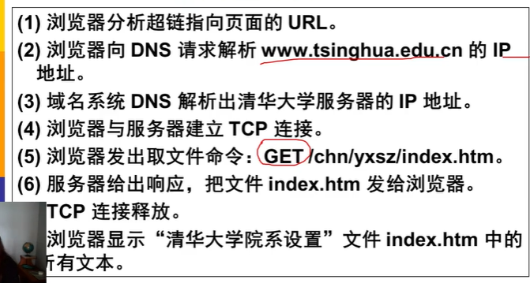

先是浏览器解析，判断是哪个域名

向DNS请求解析该域名

DNS解析出IP地址返回

浏览器与服务器建立TCP连接

浏览器发送GET请求

服务器做出响应

TCP连接释放

浏览器展示

#### HTTP的特点

HTTP是面向事务的客户服务器协议

HTTP1.0是**无状态的**，每一次连接只有一次，就会断开

虽然他在运输层使用了TCP，但是HTTP协议本身是**无连接的**，即不需要收到对方的确认

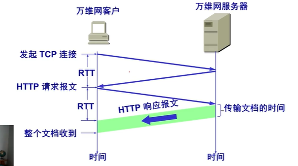

HTTP/1.1使用**持续连接**，服务器发送响应后，在一段时间内都会保持，可以继续交换报文

HTTP/2.0可以多路复用，一次取多个数据

#### 代理服务器

代理服务器又称万维网高速缓存，它代表浏览器发出HTTP请求

它会把最近的一些请求和响应暂存在本地磁盘，如果有相同的新请求，就把把暂存的发过去，不用再去网络请求

也能屏蔽掉内网的细节

#### HTTP的报文结构

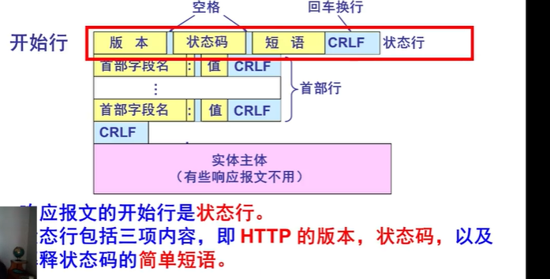

#### 服务器存放用户信息

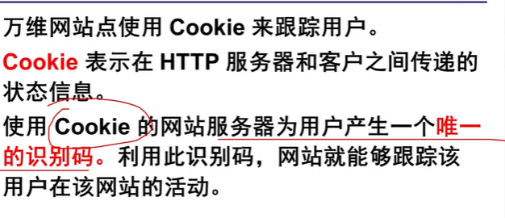

### 万维网的文档

#### 超文本标记语言HTML

##### XML:

#### 动态万维网文档

数据可以刷新

### 万维网的信息检索系统

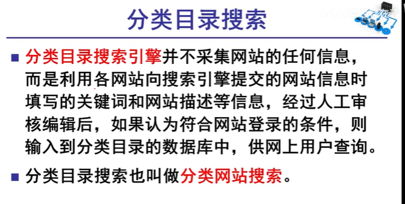

## 电子邮件

发送邮件的协议SMTP

读取邮件的协议：POP3和IMAP

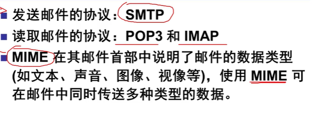

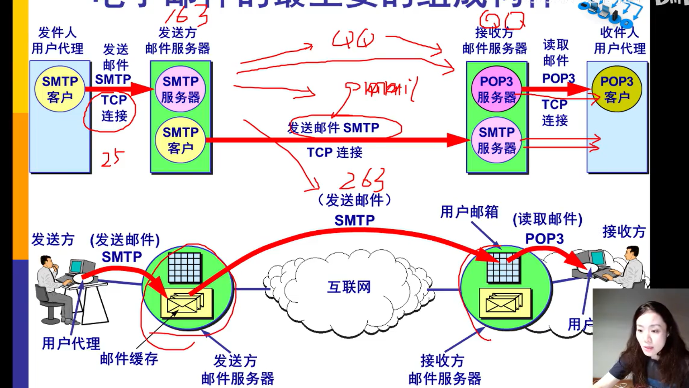

SMTP使用的是TCP连接，其熟知端口为25

### 用户代理UA

UA就是用户与电子邮箱系统的接口，是电子邮件客户端软件

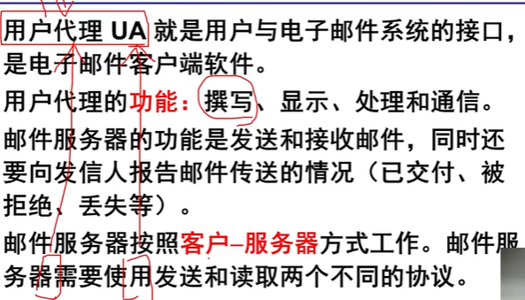

### 发送和接收的重要步骤

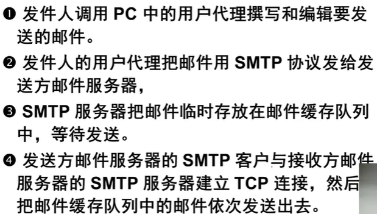

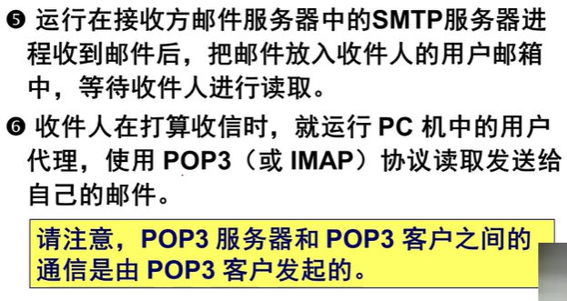

### 简单邮件传送协议SMTP

1. 连接建立：在发送主机的SMTP客户和接收主机的SMTP服务器之间建立的。SMTP不使用中间邮件服务器
2. 邮件传送
3. 连接释放，结束后释放TCP连接

### 邮件读取协议POP3和IMAP

邮局协议POP是一个非常简单，但功能有限的邮件读取协议

IMAP可以像操纵ISP服务器的邮箱，就像在本地操作一样，因此IMAP是一个联机协议

### 它们的区别

POP只会删除本地，不管服务器

IMAP会同步对服务器进行操作

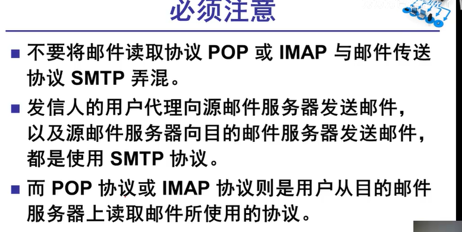

### 基于万维网的电子邮件

向邮件服务器发送时使用的HTTP协议，但是邮件服务器之间仍然使用的是SMTP

### 通用互联网邮件扩充MIME

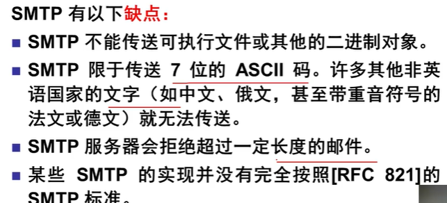

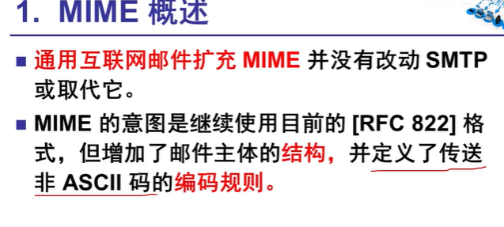

## 动态主机配置协议DHCP

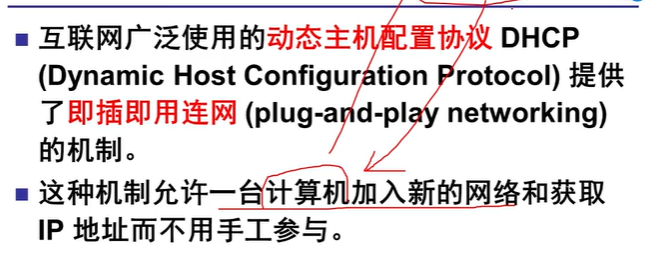

### 分配过程

当有新的主机加入网络时，还未分配IP地址

该主机就在整个主机进行广播，寻找DHCP服务器

DHCP接收到后，也发广播进行回应

主机再发送广播，请求分配IP地址

DHCP服务器就在地址池中找到一个，广播发送过去

（主机发送广播时，发送IP地址置为0.0.0.0）

当租用期到达0.5T和0.875T时，主机向服务器请求更新租用期

### 租用期

## 简单网络管理协议

网络管理包括对硬件软件和人力的使用与协调等

## 应用程序跨域网络的通信

之前所学的所有协议啊，封装啊，其实都是操作系统在做

## P2P